# Me and My Girlfriend

下载地址https://www.vulnhub.com/entry/me-and-my-girlfriend-1,409/   。在这里选择下载镜像文件

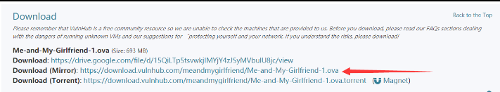

打开虚拟机设置，将网络设为NAT模式，这样靶机和kali在同一网段下.涉及到的知识点包括x-forwarded-for主机头转发、 手工爆库、sudo php提权

# 信息收集

## Nmap

开启kali用扫同网段，找到该虚拟机ip，同时扫描开放端口：

```
nmap -sn 192.168.111.0/24
nmap --min-rate 10000 -p- -Pn  192.168.111.137
```

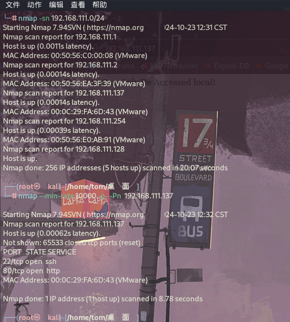

获得靶机ip：192.168.111.137

开放端口：22、80等端口，是Apache服务器

## Port - 80

看来是只能从80端口Web入手，浏览器访问靶机ip，显示如下：

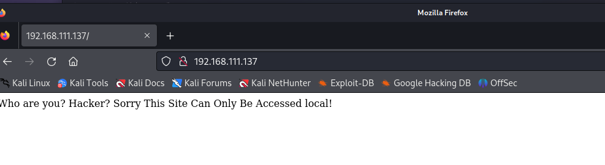

这页面提示我们，站点只能本地local访问，查看网页源代码如下：

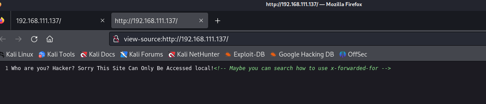

> 提示我们应该研究以下如何使用x-forwarded-for， X-Forwarded-For（XFF）是用来识别通过HTTP代理或负载均衡方式连接到Web服务器的客户端最原始的IP地址的HTTP请求头字段，换句话就是无论你用了多少层代理，XFF头都能给你显示出每层代理和原始ip，如果没有XFF或者另外一种相似的技术，所有通过代理服务器的连接只会显示代理服务器的IP地址，而非连接发起的原始IP地址，这样的代理服务器实际上充当了匿名服务提供者的角色，如果连接的原始IP地址不可得，恶意访问的检测与预防的难度将大大增加。

那么我们就添加一个XFF头部，内容写localhost表示本地，也就是在每个请求中添加如下一行：`x-forwarded-for:localhost`

用burpsuit拦截请求，然后改包添加x-forwarded-for:localhost即可访问：

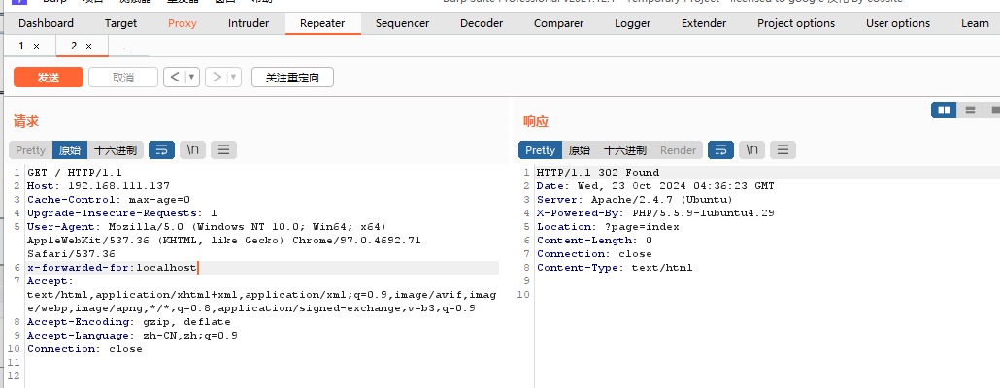

访问`?page=index`

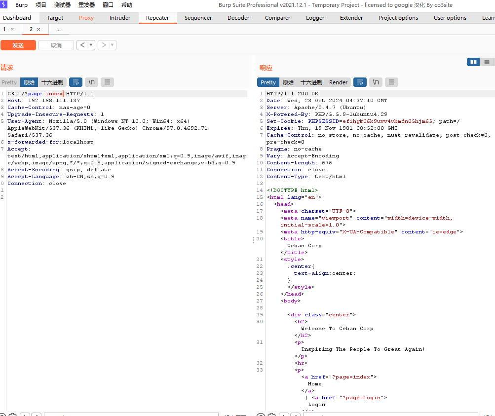

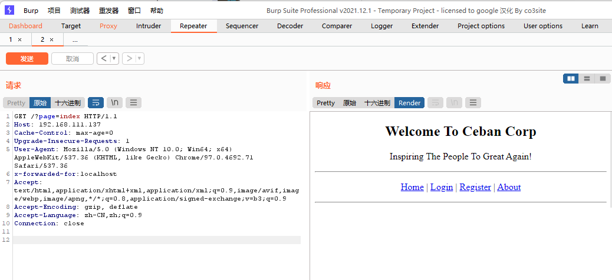

但如果每次请求页面都要手动添加`x-forwarded-for:localhost`还是挺麻烦的一件事。因此可以在BurpSuite代理proxy模块中的Options选项的Match and Replace添加一条规则：

点击Add，将请求头中增加x-forwarded-for:localhost即可，这样每次请求时都会添加这一行，就无需每次请求都手动添加了

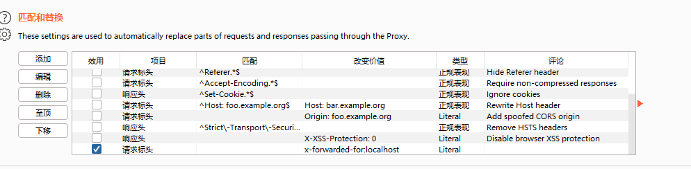

# 数据库手工枚举

现在观察web页面，Ceban Corp正是靶机描述中Alice的公司名称。这个界面其实没太多信息，Login是登录界面，需要有账号和密码。

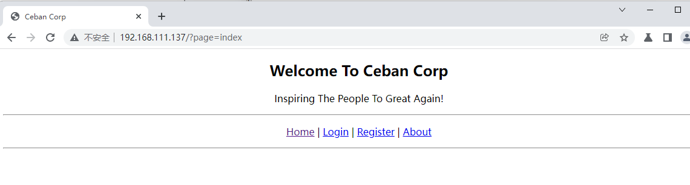

Register是注册界面，如下，干脆就随便注册一个账号试试：

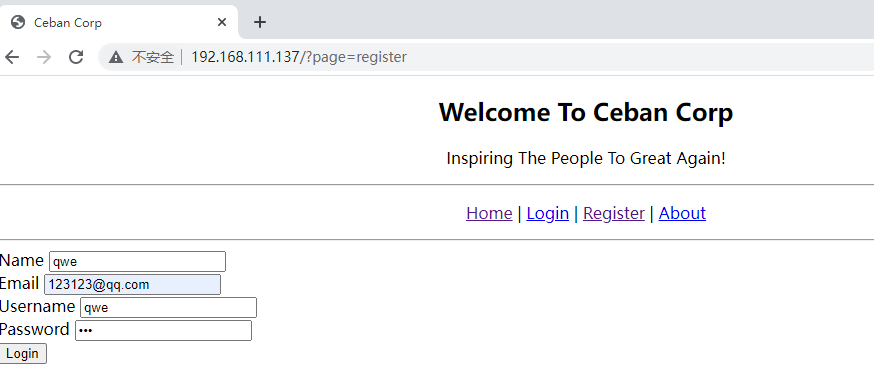

我这里注册的账号和密码都是qwe，注册完成之后Login，登录成功：

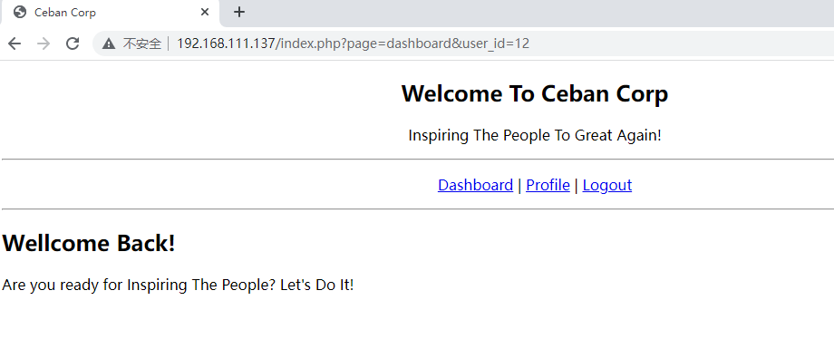

注意url中有一个`user_id=12`，这估计是一个查询，我们尝试能不能直接修改这个user_id，实现对其他用户账号密码的查看：

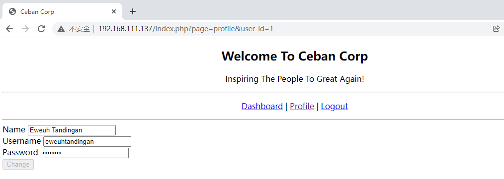

将 user_id改为1后，成功看到了其他账号，那我们手工更换user_id为1到11，看看有哪些凭据，重点看有没有账号为alice（靶机描述的提示），果然找到了，当user_id=5时，是Alice的凭据：

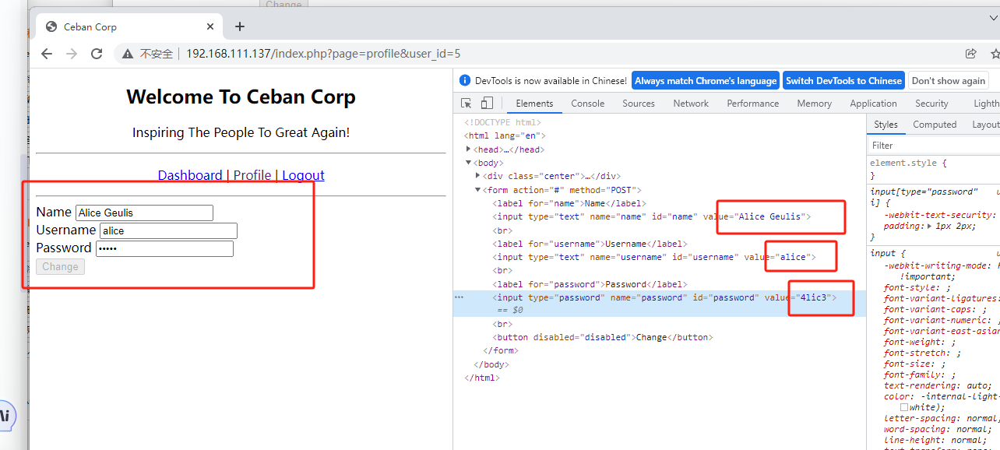

这密码都是前端明文显示的，alice账号的密码是4lic3 ，我们尝试用ssh登录，如果数据库密码和ssh密码一致的话，我们就能够成功ssh，如下图，撞库成功了！

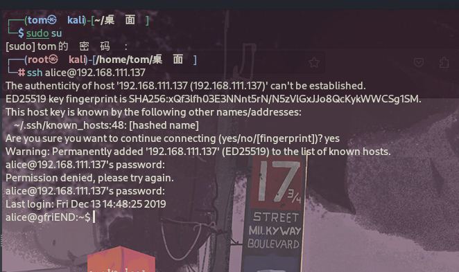

# sudo php提权

> 列出当前用户在系统中有哪些使用 sudo 执行命令的权限

```
sudo -l
```

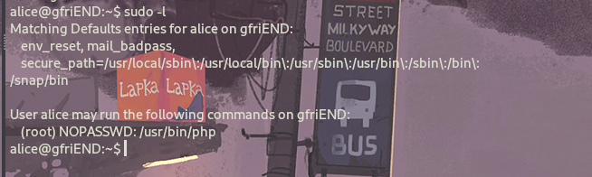

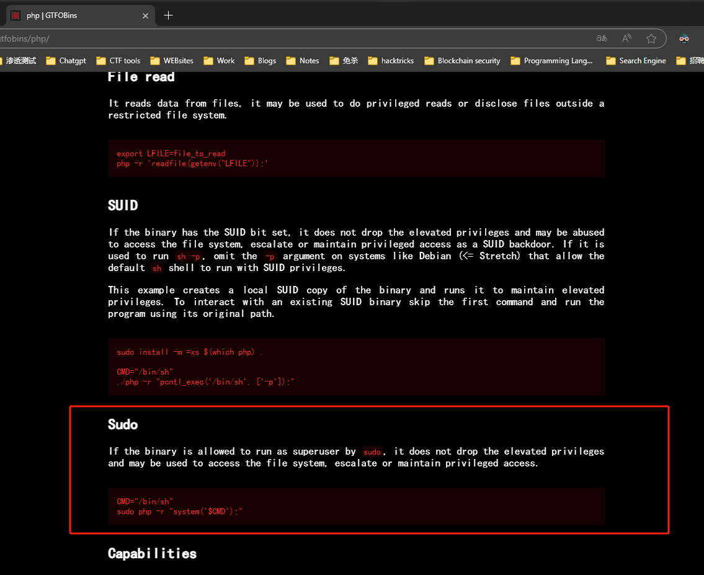

提权完毕。

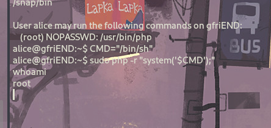

# 总结与思考

1.主机发现和端口扫描，确定入手点基本上是80。
2.Web渗透，直接浏览器访问靶机无法显示内容，提示我们修改XFF头部本地访问，于是用BurpSuite改包在请求头添加x-forwarded-for:localhost即可访问。
3.数据库手工枚举，注册账号登录后，发现url中存在user_id，怀疑这里是否是数据库直接查询的传参，直接秀嘎user_id发现可以找到alice的账号和密码，尝试撞库登录ssh，成功。
4.sudo -l枚举sudo权限的二进制可执行文件，发现有php，直接用php执行系统命令启动shell即可提权。