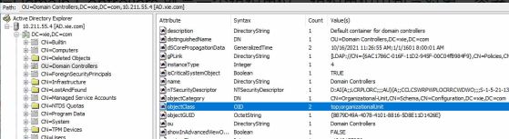
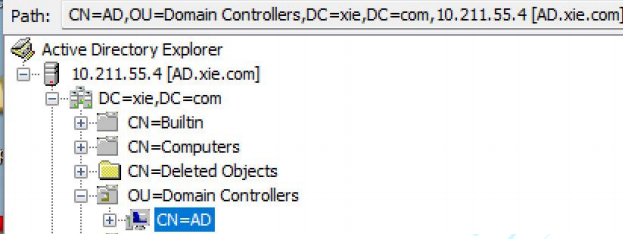
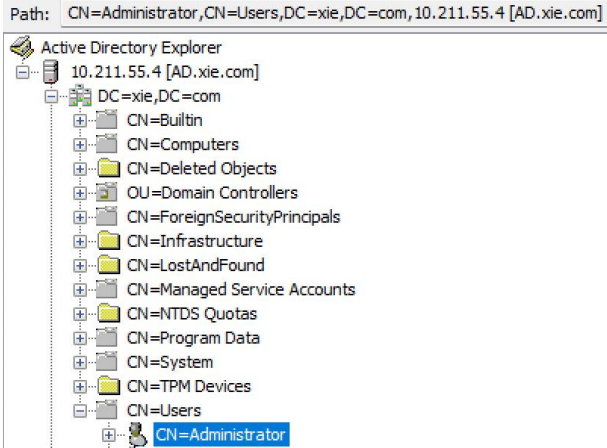
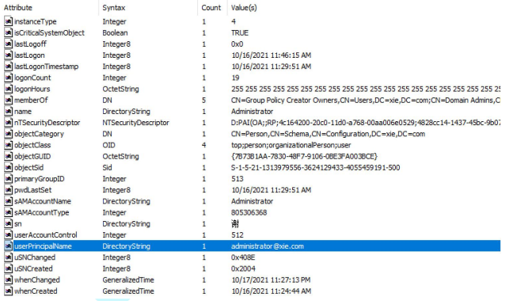
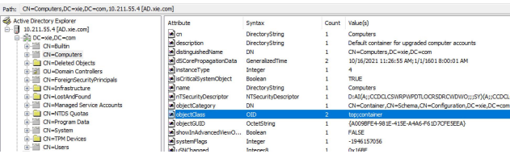

# 域中常见名词

在学习域的过程中，我们经常会碰到一些专有名词，如：AD、CN、OU、DN 等。

## AD

AD是Active Directory活动目录的缩写。我们先来看看什么是活动目录。日常生活中我们的电话本记录着亲朋好友的电话和姓名等数据，这就是 Telephone Directory 电话目录；计算机中的文件系统记录着文件的文件名、大小和日期等数据，这就是 File Directory 文件目录。而**Active Directory 活动目录是微软对通用目录服务的实现，它使用LDAP作为其主要访问协议**。**活动目录存储着有关网络中各种对象的信息，如用户账户，计算机账户，组和Kerberos使用的所有相关凭据等信息**。活动目录让管理员和用户能够轻松地查找和使用这些信息。活动目录服务(AD DS ,Active Dirctory Domain Service)是Windows Server 2000 操作系统平台的中心组件之一，活动目录可以作为活动目录域服务(ADDS)或活动目录轻型目录服务(ADLDS)部署。活动目录使用了一种结构化的数据存储方式，并以此作为基础对目录信息进行合乎逻辑的分层组织。

所以可以看出，Acitive Directory 其实就是目录服务数据库。目录服务数据库也是一种数据库，这种数据库相比较于我们熟知的关系型数据库(比如MySQL,SQLServer,Oracle)，主要有以下几个方面的特点。

1. 它成树状结构组织数据，类似文件目录一样。
2. 它是为查询、浏览和搜索而优化的数据库，也就是说活动目录数据库的读性能特别强，但是写性能差，而且还不支持事务处理、回滚等复杂功能。

## LDAP

既然有了目录服务数据库了，就必然需要目录访问协议去访问目录服务数据库了。而 LDAP 协议就是设计用来对目录服务数据库访问的协议之一。

LDAP(Lightweight Directory Access Protocol)轻量级目录访问协议，它基于X.500 标准，是一个开放的、中立的、工业标准的应用协议。它可以用来查询与更新活动目录数据库，**活动目录利用 LDAP 名称路径来描述对象在活动目录内的位置。**

LDAP 目录类似于文件系统目录，例如：`CN=DC01,OU=Domain Controllers,DC=xie,DC=com`，如果类比成文件系统的话，可被看作如下文件路径：`xie.com/Domain Controllers/DC01`，`DC01 `代表一个对象，`OU=Domain Controllers` 代表一个 `Domain Controllers` 组织单位。**这句话的含义就是 DC01 这个对象处在 xie.com 域的 Domain Controllers 组织单元中**。在 LDAP 中数据以树状方式组织，在树状信息中的基本数据单元是条目，而每个条目由属性组成。

例如图所示，*DC01、win7、test 等都是一个条目，也是一个对象，这些对象都有自身的属性。*

### X.500 标准定义

那么 LDAP 协议如何能快速的定位需要查询的对象呢？

完成这项工作需要定义名称空间，使其可以快速的确定每个对象的位置，下面我们来看看 X.500 标准中定义了哪些东西。

#### 1.DC

**DC(Domain Component) 域组件**：此 DC 不是 Domain Controllers 域控，而是**类似于 DNS 中的每个元素**，**DC 对象表示使用 DNS 来定义其名称空间的 LDAP 树的<u>顶部</u>**。例如域 xie.com，用 . 分开的每个单元都可以看成是一个 DC 域组件。

#### 2.OU

**OU(OrganizationUnit) 组织单位**：在活动目录数据中定义了 Organization Unit组织单位类，最多可以有四级，每级最长 32 个字符，可以为中文。如OU=Domain Controllers 就是一个组织单位，组织单位中包含对象、容器，还可以包含其他组织单位，并且组织单位还可以链接组策略。如图所示，可以看到Domain Controllers 的 objectClass 属性是 OrganizationUnit。

#### 3.CN

**CN(Common Name) 通用名称**：对象的名称，最大长度可以到 80 个字符，可以为中文。例如一个用户名为张三，那么张三就是一个 CN，再比如一个计算机名为Win7，那么 Win7 就是 CN。

#### 4.DN(包含上面三个元素)

**DN(Distinguished Name)可分辨名称**：<u>Active Directory 中的每个对象都有完全唯一的 DN</u>，其包含对象到 LDAP 名称空间根的整个路径。DN 有三个属性，分别是 DC、OU、CN。DN 可以表示为 ldap 的某个目录，也可以表示成目录中的某个对象，这个对象可以是用户、计算机等。

 如：CN=AD,OU=Domain Controllers,DC=xie,DC=com 这是一个 DN，它是层次结构树，从右(根)向左(叶)。表示的是 xie.com 域下的 Domain Controllers 组织单元下 的 AD 对象。如图所示：

再如：CN=Administrator,CN=Users,DC=xie,DC=com 这是一个 DN，表示的是xie.com 域下的 Users 容器下的 Administrator 对象。如图所示：

#### 5.RDN

**RDN(Relative Distinguished Name) 相对可分辨名称**：他与目录结构无关。比如CN=Administrator,CN=Users,DC=xie,DC=com，他的 RDN 为CN=Administrator。两个对象可以具有相同的 RDN，但是不能具有相同的 DN。

#### 6.UPN

**UPN(User Principal Name)用户辨别名称**：如在域 xie.com 中的 administrator用户，它的 UPN 为：administrator@xie.com 。**用户登录时最好输入 UPN，因为无论此用户的账号被移动到哪一个域，其 UPN 都不会变化，因此用户可以一直用同一个 UPN 来登录。**如图所示，可以看到 administrator 的 UPN。

#### 7.容器 Container

在活动目录数据中定义了容器 Container 类，容器是一些属性的集合。容器内可以包含其他对象，如用户、计算机等，但是容器中不能再嵌套其他容器和 OU 组织单位。计算机默认在 CN=Computers 容器中，用户默认在 CN=Users 容器中。如图所示，可以看到 CN=Computers 的 objectClass 属性为 container。

## FQDN

**FQDN(Fully Qualified Domain Name)全限定域名**：同时带有主机名和域名的名称。如域 xie.com 下的 win7 主机，其 FQDN 为 win7.xie.com。全限定域名可以从逻辑上准确地表示出主机在什么地方，也可以说全限定域名是主机名的一种完全表示形式。从全限定域名中包含的信息可以看出主机在域名树中的位置。