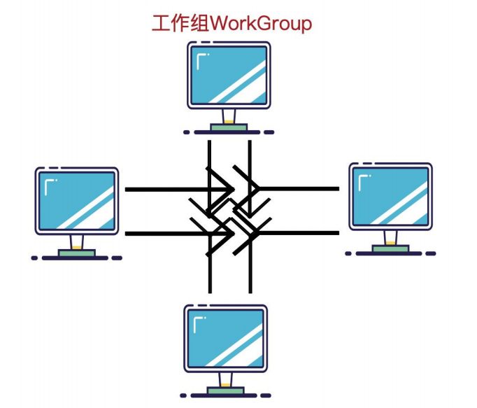
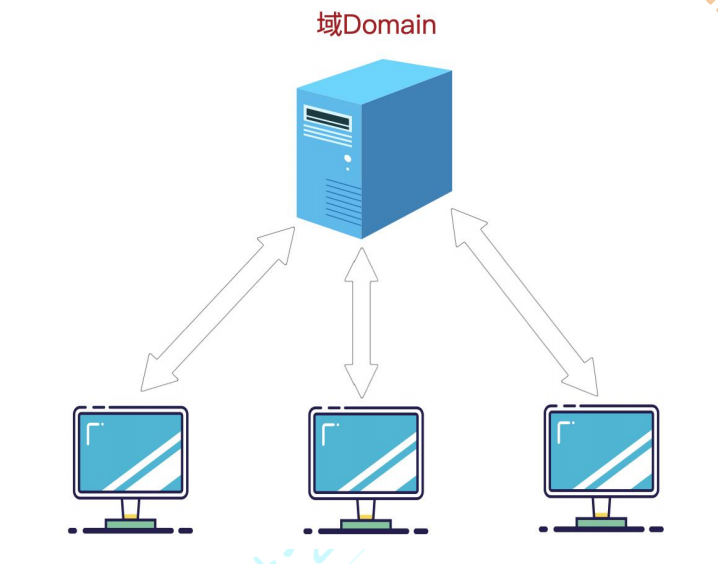
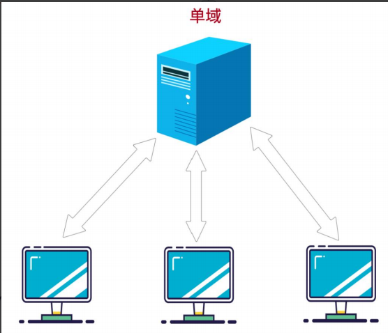
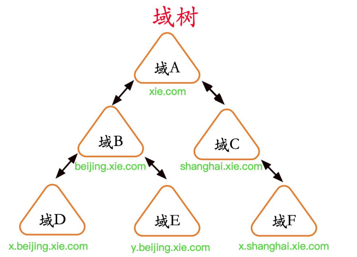
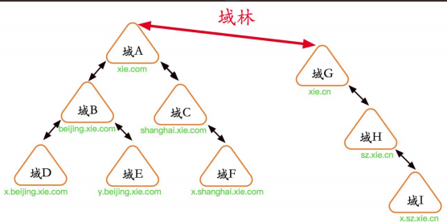

# 工作组和域

域(Domain)是微软为集中管理计算机而推出的一种方式。其中所有的用户帐户，计算机，打印机和其他安全主体都在域控制器的中央数据库中注册。 在域中使用计算机的每个人都会收到一个唯一的用户帐户，然后可以为该帐户分配对该域内资源的访问权限。从 Windows Server 2003 开始，Active Directory 是负责维护该中央数据库的 Windows 组件。Windows 域的概念与工作组的概念形成对比，在工作组中，每台计算机都维护自己的安全主体数据库。

## 工作组

工作组（Work Group）是局域网中的一个概念，它是最常见最简单最普通的资源管理模式，就是将不同的电脑按功能分别列入不同的组中，以方便管理。在一个网络内，可能有上百台电脑，如果这些电脑不进行分组，都列在“网上邻居”中，电脑无规则的排列为我们访问资源带来不方便。为了解决这一问题，Windows98 操作系统之后就引用了“工作组”这个概念，将不同的电脑按功能分别列入不同的组中，如软件部的电脑都列入“软件部”工作组中，网络部的电脑都列入“网络部”工作组中。你要访问某个部门的资源，就在“网上邻居”里找到那个部门的工作组名，双击就可以看到那个部门的电脑了。计算机通过工作组进行分类，使得我们访问资源更加具有层次化。默认情况下所有计算机都处在名为 WORKGROUP 的工作组中，工作组资源管理模式适合于网络中计算机不多，对管理要求不严格的情况。它的建立步骤简单，使用起来也很好上手。大部分中小公司都采取工作组的方式对资源进行权限分配和目录共享。

相同组中的不同用户通过对方主机的用户名和密码可以查看对方共享的文件夹。不同组的不同用户通过对方主机的用户名和密码也可以查看对方共享的文件夹。所以工作组并不存在真正的集中管理作用 , 工作组里的所有计算机都是对等的 , 也就是没有服务器和客户机之分的。

如图所示，是工作组的拓扑图：

### 1.工作组的特点

工作组是一个由许多在同一物理地点，而且被相同的局域网连接起来的计算机组成的小组。相应地，一个工作组也可以是遍布一个机构的，但却被同一网络连接的计算机构成的逻辑小组。在以上两种情况下，在工作组中的计算机都可以以预定义的方式，共享文档、应用程序、电子函件和系统资源。

### 2.工作组的优缺点

#### (1) 优点

工作组下资源可以相当随机和灵活的分布，更方便资源共享，管理员只需要实施相当低级的维护。

#### (2) 缺点

缺乏集中管理与控制的机制，没有集中的统一帐户管理，没有对资源实施更加高效率的集中管理，没有实施工作站的有效配置和安全性严密控制，缺乏单点登录，可扩展性，弹性/灾难恢复功能以及许多安全功能。只适合小规模用户的使用。

## 域

基于工作组以上缺点，当计算机数量比较多时，大型企业中网络规模大，需要统一的管理和集中的身份验证，并且能够给用户提供方便的搜索和使用网络资源的方式，工作组的组织形式就不合适了，于是域就出现了！域是由工作组升级而来的高级架构，可以简单的把域理解成升级版的“工作组”，**相比工作组而言，它有一个更加严格的安全管理控制机制**，如果你想访问域内的资源，就必须拥有一个合法的身份登陆到该域中,而你对该域内的资源拥有什么样的权限,还需要取决于你在该域中的用户身份。

如图所示，是域的拓扑图：

 

### 1.域的原理

其实可以把域和工作组联系起来理解，在工作组上你一切的设置在本机上进行包括各种策略，用户登录也是登陆在本机的，密码是放在本机的数据库来验证的。而**如果你的计算机加入域的话，各种策略是域控制器统一设定的，用户名和密码也是放到域控制器去验证，也就是说你的账号密码可以在同一域的任何一台计算机登录。**

如果说工作组是"免费的旅店"，那么域(Domain)就是"星级的宾馆"；工作组可以随便进进出出，而域则需要严格控制。"域"的真正含义指的是服务器控制网络上的计算机能否加入的计算机组合。一提到组合，势必需要严格的控制。所以实行严格的管理对网络安全是非常必要的。在对等网模式下，任何一台电脑只要接入网络，其他机器就都可以访问共享资源，如共享上网等。尽管对等网络上的共享文件可以加访问密码，但是非常容易被破解。在由 Windows 9x 构成的对等网中，数据的传输是非常不安全的 。

不过在“域”模式下，至少有一台服务器负责每一台联入网络的电脑和用户的验证工作，相当于一个单位的门卫一样，称为“域控制器（Domain Controller，简写为DC）”。

**域控制器中包含了由这个域的账户、密码、属于这个域的计算机等信息构成的数据库。**当电脑接入网络时，域控制器首先要鉴别这台电脑是否是属于这个域的，用户使用的登录账号是否存在、密码是否正确。如果以上信息有一样不正确，那么域控制器就会拒绝这个用户从这台电脑登录。不能登录，用户就不能访问服务器上有权限保护的资源，他只能以对等网用户的方式访问 Windows 共享出来的资源，这样就在一定程度上保护了网络上的资源。

要把一台电脑加入域，仅仅使它和服务器在网上邻居中能够相互“看”到是远远不够的，必须要由网络管理员进行相应的设置，把这台电脑加入到域中。这样才能实现文件的共享，集中统一，便于管理。

### 2.域结构

域结构是很复杂的，因为对于不同体量大小的企业，需求不同。域结构可以分为单域、域树、域林。

#### (1) 单域

对于小型公司来说，单域即可满足需求。所有的机器都加入到一个域中。

如图所示，是单域的拓扑图：

#### (2) 域树

域树指若干个域通过建立信任关系组成的集合。一个域管理员只能管理本域的内部，不能访问或者管理其他的域，二个域之间相互访问则需要建立信任关系(Trust Relation)。

**信任关系是连接在域与域之间的桥梁。父域与子域之间自动建立起了双向信任关系，并且信任关系可传递。**

域树内的父域与子域之间不但可以按需要相互进行管理，还可以跨网分配文件和打印机等设备资源，使不同的域之间实现网络资源的共享与管理，以及相互通信和数据传输

如图所示域树架构，xie.com 与 shanghai.xie.com 和 beijing.xie.com 是父子域关系，因此他们之间自动建立起了双向信任关系。而 beijing.xie.com 与x.beijing.xie.com 和 y.beijing.xie.com、shanghai.xie.com 和x.shanghai.xie.com 也属于父子域关系，因此他们之间也自动建立起了双向信任关系。因此，在该域树内，所有的域都有信任关系，因此<u>只要拥有任何一个域内的权限，那么就可以访问其他域内的资源。</u>在域树内的所有域共享一个 AD DS 域服务，也就是在此域树之下只有一个 AD DS 域服务，不过其数据是分散存储在各个域中的，每一个域中只存储着属于该域的数据。

##### 建立域树的好处

- 如果把不同地理位置的分公司放在同一个域内，那么他们之间信息交互（包括同步，复制等）所花费的时间会比较长，而且占用的带宽也比较大。因为在同一个域内，信息交互的条目是很多的，而且不压缩；而在域和域之间，信息交互的条目相对较少，而且压缩。
- 还有一个好处，就是子公司可以通过自己的域来管理自己的资源。
- 还有一种情况，就是出于安全策略的考虑，因为每个域都有自己独有的安全策略。比如一个公司的财务部门希望能使用特定的安全策略（包括帐号密码策略等），那么可以将财务部门做成一个子域来单独管理。

#### (3) 域林

由一个或多个没有形成连续名称空间的域树组成，林中每个域树都有唯一的名称空间，之间不连续。域林指若干个域树通过建立信任关系组成的集合。可以通过域树之间建立的信任关系来管理和使用整个域林中的资源，从而又保持了原有域自身原有的特性。

**同一个林中，林根域与其他树根域自动建立双向信任关系，信任关系可传递。因此，在林中，只要拥有其中一个域内的权限，就可以访问其他林中其他域的资源。**

如图所示，是域林结构：

### 3.域的功能和特点

- 集中管理，可以集中地管理企业中成千上万分布于异地的计算机和用户。
- 便捷的资源访问，能够很容易地定位到域中的资源。 用户依次登录就可以访问整个网络资源，集中地身份验证。
- 可扩展性，既可以适用于几十台计算机的小规模网络，也可以用于跨国公司。

## 工作组和域的区别

工作组是一群计算机的集合，它仅仅是一个逻辑的集合，各自计算机还是各自管理的，你要访问其中的计算机，还是要到被访问计算机上来实现用户验证的。而域不同，域是一个有安全边界的计算机集合，在同一个域中的计算机彼此之间已经建立了信任关系，在域内访问其他机器，你只需要经过域控的许可即可。

域和工作组适用的环境不同，域一般是用在比较大的网络里，工作组则较小，在一个域中需要一台类似服务器的计算机，叫域控服务器，其他电脑如果想互相访问首先都是经过它的，但是工作组则不同，在一个工作组里的所有计算机都是对等的，也就是没有服务器和客户机之分的，但是和域一样，如果一台计算机想访问其他计算机的话首先也要找到这个组中的一台类似组控服务器，组控服务器不是固定的，以选举的方式实现，它存储着这个组的相关信息，找到这台计算机后得到组的信息然后访问。