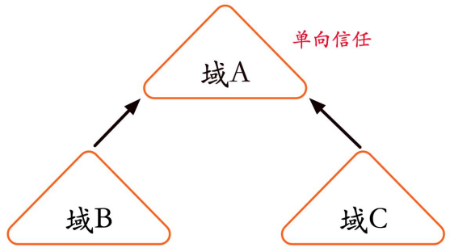
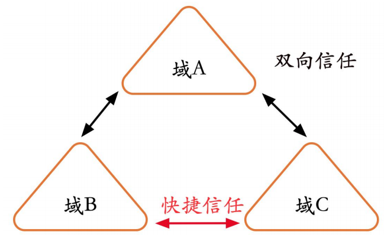
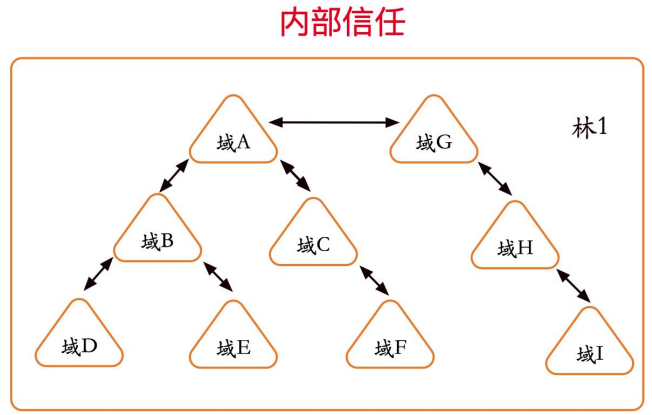
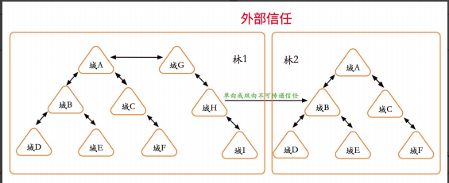
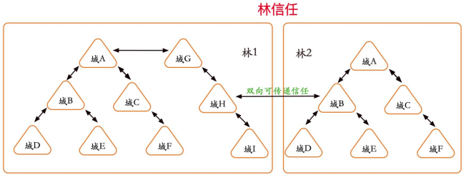
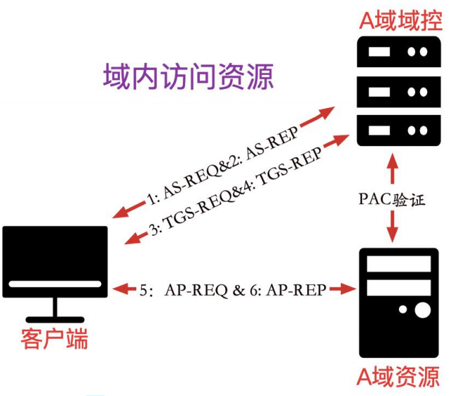
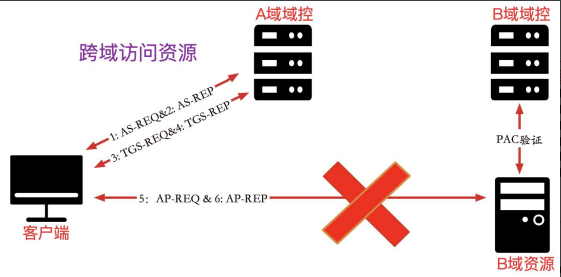
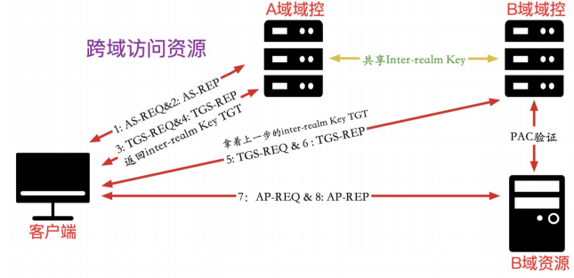
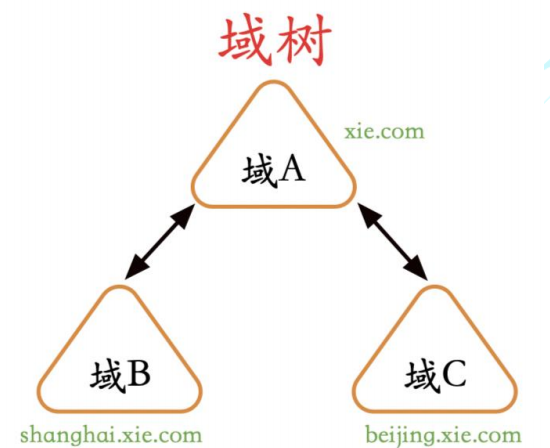
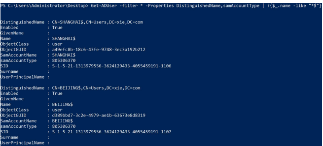

# 域信任

域信任(Domain Trust)是为了解决多域环境下的跨域资源共享问题而诞生的。两个域之间必须拥有信任关系(Trust Relationship),才可以互相访问到对方域内的资源。由于此信任工作是通过Kerberos协议完成的，因此也被称为**Kerberos Trust**。

域信任作为一种机制，允许另一个域的用户在通过身份验证后访问本域内的资源。同时，**域信任利用 DNS 服务器定位两个不同子域的域控制器**，如果两个域中的域控制器都无法找到另一个域，那么也就不存在通过域信任关系进行跨域资源共享了。

## 单向信任、双向信任和快捷信任

域信任关系可以分为单向信任、双向信任和快捷信任。

### 1.单向信任

单向信任是指在两个域之间创建单向的信任路径，即在一个方向上是信任流，在另一个方向上是访问流。在信任域和受信任域之间的单向信任中，受信任域内的用户或计算机可以访问信任域中的资源，但信任域内的用户或计算机却无法访问受信任域内的资源。

如图所示单向信任域架构，域 A 信任域 B 和域 C，那么域 B 内和域 C 内受信任的主体可以访问域 A 内的资源，但域 A 内的主体却无法访问域 B 和域 C 内的资源。



### 2.双向信任

双向信任是指两个单向信任的组合，信任域和受信任域彼此信任，在两个方向上都有信任流和访问流。这意味着，可以从两个方向在两个域之间传递身份验证请求。活动目录中的所有域信任关系都是双向可传递信任的。**任何一个新的子域加入到域林之后，这个域会自动信任其上一层的父域，同时父域也会自动信任新子域，这种信任关系称为父子信任**；**由于这些信任关系具备双向传递性(Two-Way Transitive)，因此林根域和其他树根域之间也会自动双向信任，这称为树信任**。在早期的域中，域信任是单向的，从 Windows Server2003 开始，域信任关系变为双向的。

如图所示双向信任域架构：域 A 和域 B、域 C 之间都是双向信任关系；域 A 信任域 B，域 B 也信任域 A；域 A 信任域 C，域 C 也信任域 A。**所以当任何一个新域加入到域树后，默认它会自动的建立起双向信任的关系。**因此只要拥有任何一个域内的权限，那么就可以访问其他域内的资源了。

### 3.快捷信任

快捷信任其实属于双向信任，快捷信任是指两个子域之间的信任。

如图所示，域 A 信任域 B，域 B 也信任域 A；域 A 信任域 C，域 C 也信任域 A。此时域 B 和域 C 之间也有双向信任关系。由于域是树状结构，如果域 B 到域 C 双向信任，需要先经过林根域 A，这中间肯定会多很多认证流程和步骤。因此，域 B和域 C 之间默认建立起了一个快捷信任。



## 内部信任、外部信任和林信任

域信任根据**作用范围**还可以分为内部信任、外部信任和林信任；内部信任是相对于同一个林来说的，而外部信任和林信任则是相对于不同林来说的。

### 1.内部信任

在默认情况下，使用活动目录安装向导将新域添加到林根域中时，会自动创建双向可传递信任。在现有林中创建域时，将建立新的林根信任。当前域林中的两个或多个域之间的信任关系称为内部信任。这种信任关系是可以传递的。

如图所示，是内部信任架构图：



### 2.外部信任

外部信任是指两个不同林间的域信任关系，外部信任是单向或双向不可传递的。比如两个林之间需要跨域资源访问，因此有必要建立外部信任。创建外部信任需要在两个域的 DNS 中设置互相指向对方的条件转发器，确保能正确解析到目标的地址

如图所示，是外部信任架构图：



### 3.林信任

林信任也是指两个不同林间的域信任关系，林信任给两个林中的域之间提供双向的可传递信任关系。比如两个林中有很多域，要进行跨域资源访问的话就需要设置很多次，为了简化操作，可以设置林信任，林信任是自 Windows Server 2003 起拥有的信任关系。创建林信任需要在两个域的 DNS 中设置互相指向对方的条件转发器，确保能正确解析到目标的地址。林信任只能在两个林之间创建，不能隐式扩展到第三个林。比如在林 1 和林 2 之间创建了一个林信任，在林 2 和林 3 之间也创建了一个林信任，则林 1 和林 3 之间没有隐式信任关系。

如图所示，是林信任架构图：



## 跨域资源访问

跨域是如何进行资源访问的呢？

如图所示，域内访问资源简要概括为 6 步：



那么，可能我们会猜想，跨域进行资源访问是不是也是类似呢？

我们猜想跨域资源访问如图所示，但是仔细思考一下就知道应该不是这样。首先A 域域控没有 B 域资源服务器的 hash，因此无法生成 B 域资源的 ST 服务票据。其次，B 域域控没有 A 域的 krbtgt 哈希，因此无法验证 PAC。所以以下访问流程是行不通的。



事实上，为了进行跨域间的身份验证，微软提出了 inter-realm key(跨域间密钥)的概念。**不同域间的域控制器必须共享一个 inter-realm key。**然后，这些域可以相互信任。inter-realm key 默认每隔 30 天重置一次。这个 inter-realm key 是Windows 2000 和 Windows Server 2003 中传递信任的基础。

真实的跨域资源访问流程如图所示：



### 信任帐户

**在每个域内，都有一个信任帐户，该帐户以$结尾，该帐户的哈希就是 inter-realm key 值。**

```
如图所示域树，域 A 内的信任帐户为域 B 和域 C 的前缀，也就是SHANGHAI$和 BEIJING$。在域 B 内和域 C 内的信任帐户均为 XIE$，只不过前缀不同(shangxie\XIE$、beijing\XIE$)。
```



使用如下 powershell 命令即可查询当前域内的信任帐户：

```
Get-ADUser -filter * -Properties DistinguishedName,samAccountType | ?{$_.name -like "*$"}
```

<br/>

```
如图所示，可以看到在域 xie.com 内的信任帐户是 SHANGHAI$和 BEIJING$。
```

