# 域中的组策略

组策略是 Windows 环境下用户管理对象的一种手段，其允许管理员通过组策略设置和组策略首选项为用户和计算机指定受管理配置的基础结构。

组策略分为本地组策略和域环境中的组策略：

-  本地组策略适合于管理独立未加入域的工作组的机器，其仅能影响当前环境下正在使用的计算机；
-  域环境中的组策略则是用于管理域环境中的各种对象，其可以影响所关联的站点(site)、域(domain)、组织单位(OU)；

域环境中通过配置组策略可以对域中的用户、用户组、计算机等对象进行不同维度的管理：如安全配置、软件安装配置、注册表配置、开关机与登入登出管理等。配置的组策略对象通过关联到站点(site)、域(domain)、组织单位(OU)上来在不同层级应用不同的组策略配置。

在企业中，域管理员通过组策略管理控制台(GPMC，Group Policy Managment Console)进行组策略的编辑和应用，以此利用组策略管理整个域。可以简单的把GPMC 当成企业管理的神经中枢，而其中的每一条组策略则是神经中枢的每一条神经，正是通过每一条组策略才使得整个企业域环境井井有条的运行着。

组策略内包含 **计算机配置** 和 **用户配置** 两部分：

- 计算机配置：其位于“组策略管理编辑器”中的“计算机配置”下，当计算机开机时，系统会根据计算机配置的组策略内容来设置计算机的环境。无论哪个用户登录到计算机，该计算机都会应用组策略的计算机配置。例如在域中配置了组策略，则**这个组策略中的计算机设置就会被应用到这个域内的所有计算机上**。
- 用户配置：其位于“组策略管理编辑器”中的“用户配置”下，当用户登录时，系统会根据用户配置的组策略内容来设置用户的工作环境。无论该用户登录到哪一台计算机，都会应用组策略的该用户配置。例如在组织单位 OU技术部配置了组策略，则**这个组策略中的用户配置就会被应用到这个技术部组织单位 OU 内的所有用户的工作环境机器上**。

如图所示，在组策略管理编辑器可以看到计算机配置和用户配置

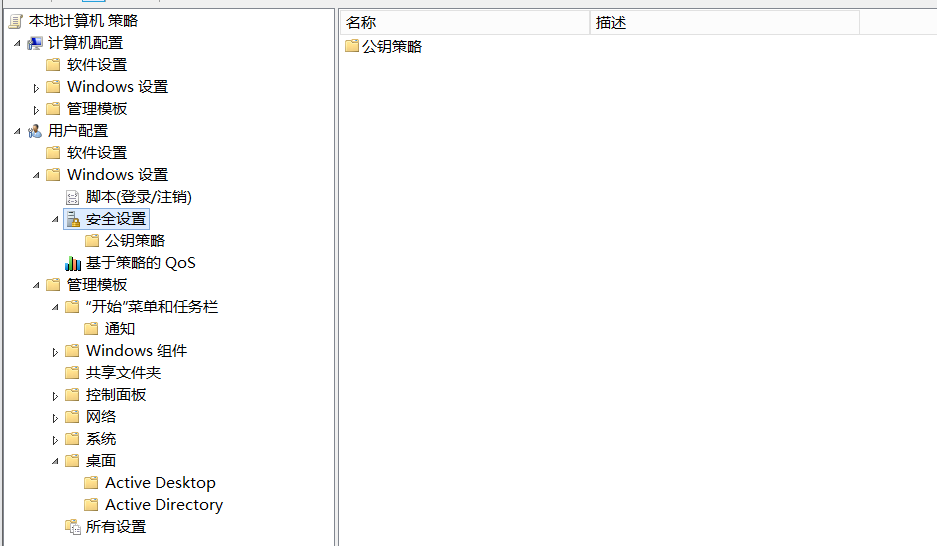

## 组策略的安全问题

组策略拥有这么强大的功能，因此在使用过程中，如果使用不当或被攻击者恶意滥用，会存在严重的安全问题。

### 1. 组策略首选项 GPP 提权

前面我们讲到了组策略模板 GPT 的存储位置位于域控制器的 `%systemroot%\sysvol\sysvol\域名\Policies` 文件夹内，任何用户都可以访问该文件夹。

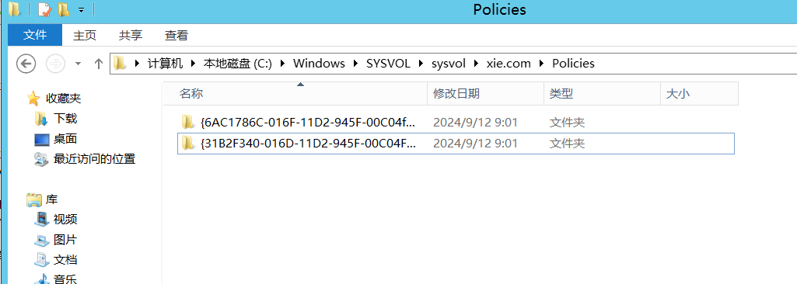

域管理员通过组策略统一修改后的密码虽然强度有所提高，但该修改后的密码会使用 AES-256 加密算法保存在 SYSVOL 共享目录中的 XML 文件内。本来 AES-256 加密算法安全性是较高的，但是 2012 年微软在官方网站上公布了该密码的私钥，导致保存在 XML 文件中的密码可以被解密。任何有效域用户均可对该共享目录进行访问，这就意味着，任何用户都可以访问保存在 XML 文件中的密码并将其解密，从而控制域中所有使用该密码的计算机。

#### (1) 组策略首选项 GPP 提权复现

首先，我们针对域 xie.com 新建一个名为 Gpp_test 的组策略。如图所示：

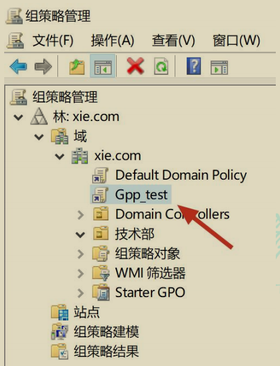

然后对该组策略进行编辑，如图所示，点击计算机配置——>首选项——>控制面板设置——>本地用户和组。

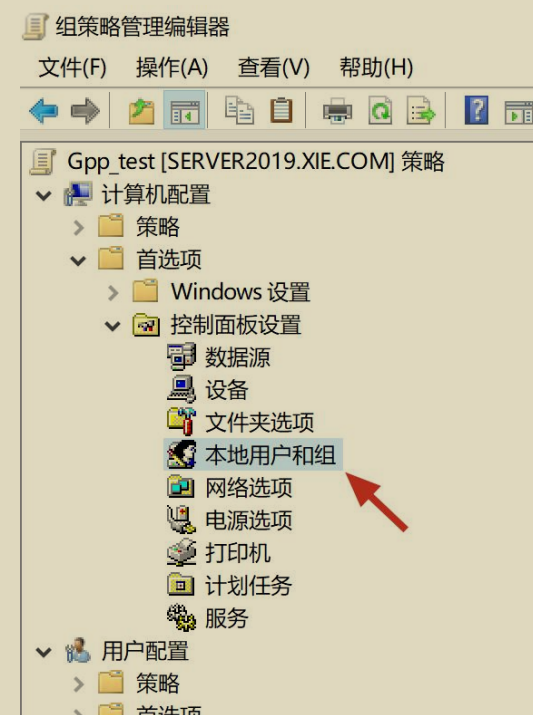

然后右键本地用户和组——>新建——>本地用户，我们将域中每个计算机的本地administrator 用户更名为 admin，并且设置新的密码 root@123456。如图所示：

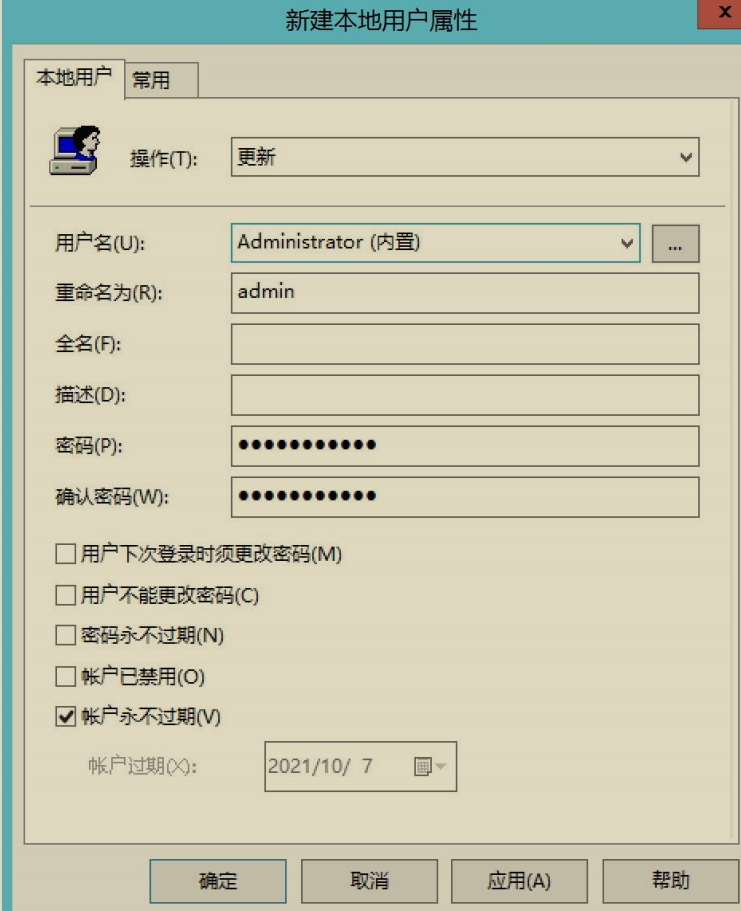

等待组策略应用完成即可。然后我们可以在如下目录下找到 Groups.xml 文件。

```
\\xie.com\sysvol\xie.com\Policies\{新建组策略的 GUID}\Machine\Preferences\Groups
```

如图所示，找到 Groups.xml 文件。

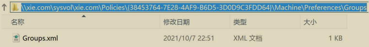

查看 Groups.xml 文件内容，如图所示，可以看到我们刚刚通过组策略设置的一些值。其中可以看到 cpassword 字段，该字段的值就是我们修改后的密码经过AES-256 进行加密后的密文。由于微软在 2012 年公布了该密码的私钥，导致该字段的密文能被解密成明文。

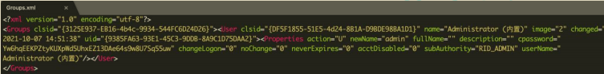

我们可以以域普通用户身份登录域内任意一台机器，使用 PowerSploit 中的 `Get- GPPPassword.ps1` 脚本执行如下命令将组策略中的密文解密成明文。

```
Import-Module .\Get-GPPPassword.ps1
Get-GPPPassword
```

如图所示，使用 Get-GPPPassword.ps1 脚本成功获得密码明文。

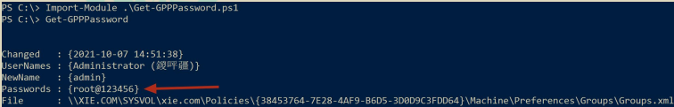

#### (2) 针对组策略首选项提权的防御措施

在用于管理组策略的计算机上安装 `KB2962486 `补丁，防止新的凭据被放置在组策略首选项中。微软在 2014 年 5 月 13 日发布了针对 GPP 组策略首选项提权漏洞的更新补丁` KB2928120`，补丁更新后使用的方法就是不再将密码保存在组策略首选项中。

### 2. 滥用组策略委派属性

我们在查看组策略委派属性的时候，可以看到哪些用户和组对其有权限编辑、删除和修改。如果攻击者在获得高权限的时候，将组策略对象的完整权限赋予给某个恶意用户的话，则该恶意用户后续可以修改该组策略对象的配置，以达到攻击受此组策略影响的计算机和用户的目的。因此，***该攻击手法通常被攻击者用来后权限维持***。

如图所示，赋予给了普通域用户 hack 编辑、删除、修改组策略 test 的权限。如果 hack 用户被攻击者掌握，则攻击者可以利用 hack 用户对该 test 组策略进行修改等操作。

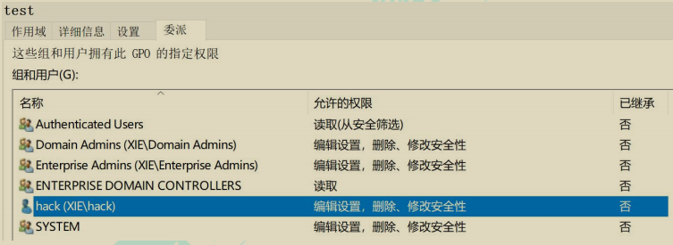

#### (1) 滥用组策略委派属性检测

我们可以使用 PowerSploit 中的 `PowerView.ps1 `脚本执行如下命令通过指定 DN检测可能存在风险的组策略权限配置。

```
Import-Module .\PowerView.ps1
Invoke-ACLScanner -ResolveGUIDs -ADSpath "CN=Policies, CN=System, DC=xie, DC=com" -verbose
```

如图所示，可以知道可能存在权限配置风险的组策略 GUID 为 B08E4C8C-581C-4421-973C-47D01E455623。

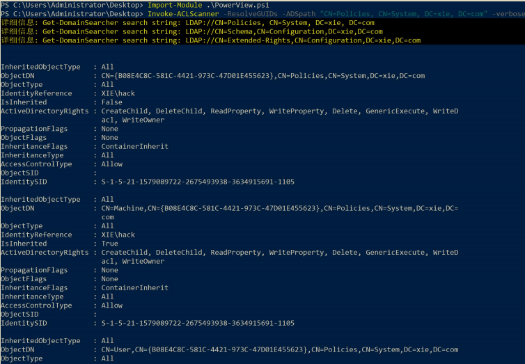

然后再通过如下命令查询该组策略作用的 OU，以及 OU 内的用户和计算机。就可以知道该可能存在风险的组策略影响了哪些用户和计算机。

```
Get-NetOU -GUID B08E4C8C-581C-4421-973C-47D01E455623
Get-NetOU -GUID B08E4C8C-581C-4421-973C-47D01E455623 | %{Get-NetUser -ADSpath $_}
Get-NetOU -GUID B08E4C8C-581C-4421-973C-47D01E455623 | %{Get-Netcomputer -ADSpath $_}
```

如图所示，可以知道该可能存在风险的组策略影响了哪些用户和计算机。

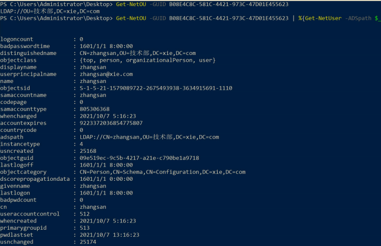