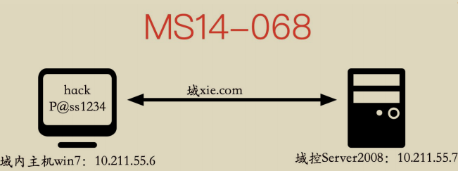
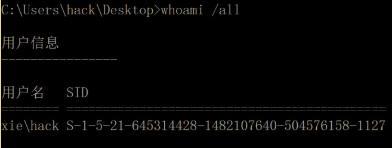
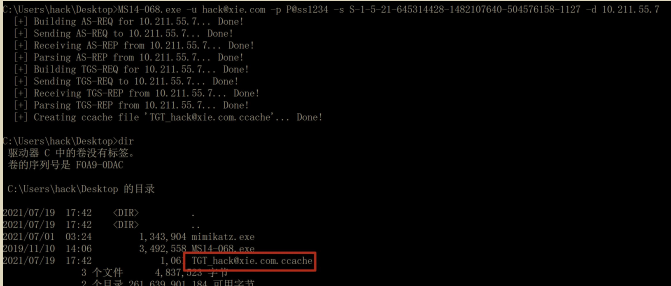
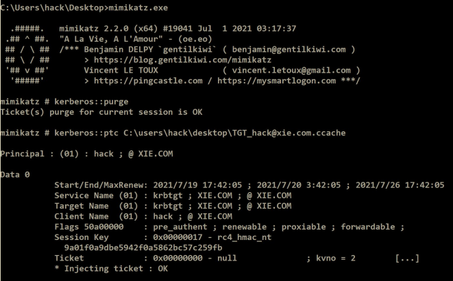
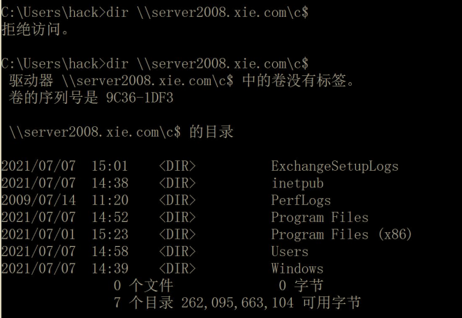

# MS14-068 域内权限提升漏洞

## 漏洞背景和描述

2014 年 11 月 19 日，微软发布 11 月份安全补丁更新，其中一个补丁KB3011780 引起了人们的注意，这是一个域内权限提升漏洞，该漏洞允许安全研究员在仅有一个普通域账号的情况下将权限提升为域管理员，危害极大！微软将该漏洞编号设置为 MS14-068(CVE-2014-6324)。

注：红日靶场2利用到了这个漏洞

## 漏洞原理

> **PAC是什么？** 可以把PAC想象成是一张身份证，它证明了你在系统中拥有的权限（比如普通用户、管理员等）。每次你通过Kerberos请求某项服务时，都会附上这张“身份证”。
> 
> **PAC的签名机制**： 这张“身份证”上有两个地方需要盖章，类似两道印章，保证内容没有被篡改：
> 
> 第一个印章（PAC_SERVER_CHECKSUM）：由请求的服务（比如文件服务器）的密钥生成。想象成服务为你的“身份证”盖了章，证明你有权限请求该服务。
> 
> 第二个印章（PAC_PRIVSVR_CHECKSUM）：由KDC的密钥生成，确保KDC也认可这张“身份证”是真的，没被伪造。
> 
> 这两个签名的设计初衷是使用HMAC等基于密钥的算法，这意味着需要特定的密钥（krbtgt的密钥和服务的密钥）才能生成合法的签名。而你作为普通用户，通常没有这些密钥，因此不能伪造有效的PAC。
> 
> **问题出现**： MS14-068的漏洞出在签名的实现上，原本要求只能使用需要密钥参与的HMAC系列算法，但实际中，它允许使用MD5这种不需要密钥的哈希算法。这就像服务和KDC同意盖章时使用了一个不太安全的印章工具，任何人都可以自己制作这个印章，而不需要真的有权力来做这件事。
> 
> **如何利用漏洞**： 在这种情况下，你不需要服务或KDC的密钥就能生成一个“有效的”签名。你可以随意修改PAC中的内容，比如把自己从普通用户改成管理员，然后用MD5重新生成签名。因为KDC不会再检查签名的有效性，它就会认为你的伪造“身份证”是真的，从而给你更高的权限。

该漏洞最核心的地方在于 **KDC 无法正确检查 ST 服务票据中 PAC 的有效签名，导致用户可以自己构造一张高权限 PAC，然后通过校验**。PAC 包含两个数字签名：一个使用服务的 hash(PAC_SERVER_CHECKSUM)进行签名，另一个使用krbtgt 的 hash(PAC_PRIVSVR_CHECKSUM)进行签名，该签名<u>设计之初是要用到HMAC 系列的 checksum 算法，也就是必须要有 key 的参与</u>，而这里的 key 是krbtgt 的 hash 和服务的 hash，我们没有 krbtgt 的 hash 以及服务的 hash，自然就没有办法生成有效的签名。但是**问题就出于该签名在实现的时候允许所有的checksum 算法都可以，包括 MD5，因此就不需要 key 的参与了**。此时我们只需要把 PAC 进行 md5，就生成了新的校验和。这也就<u>意味着我们可以随意更改PAC 的内容，更改完之后再用 md5 给他生成一个服务检验和以及 KDC 校验和</u>。

## 漏洞复现

实验环境如下：

- 域内主机：Win7(10.211.55.6)
- 域控：Server2008(10.211.55.7) 
- 域用户：hack
- 域用户密码：P@ss1234
- 域：xie.com

拓扑图如图所示：



目前我们获得了域内主机 Win7 的权限，该机器上登录着普通域用户 hack。以下演示如何通过 MS14-068 漏洞从一个普通域用户权限 hack 提升至域管理员权限。

### 权限提升至域管理员

首先查看当前 hack 用户的 SID，如图所示：



然后在 Win7 机器上执行如下命令进行漏洞利用。

```
MS14-068.exe -u hack@xie.com -p P@ss1234 -s S-1-5-21-645314428-1482107640-504576158-1127 -d 10.211.55.7
```

参数含义如下：

- -u：指定域用户名，这里是 hack@xie.com
- -p：指定域密码，hack 域用户的密码为 P@ss1234
- -s：指定域用户的 SID，也就是我们上一步查询的内容
- -d：指定域控，域控的 ip 为 10.211.55.7

如图所示，命令运行成功后，会在当前目录生成 ccache 后缀的票据。



然后使用 mimikatz 执行如下命令导入上一步生成的票据。

```
#删除当前缓存的 kerberos 票据
kerberos::purge
#导入指定路径的票据
kerberos::ptc C:\users\hack\desktop\TGT_hack@xie.com.ccache
```



如图所示，可以看到没导入票据之前是无法访问域控的。导入了票据后，可以访问域控了！

